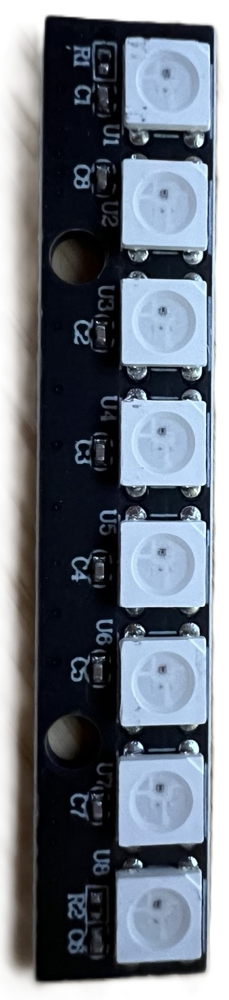
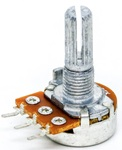
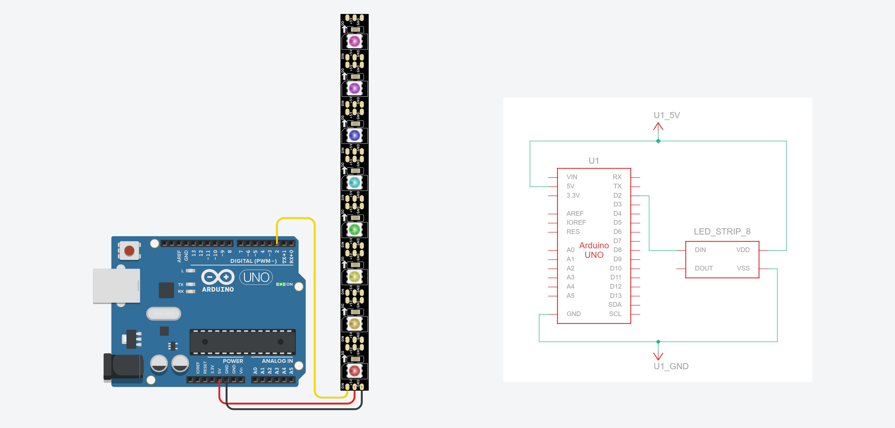
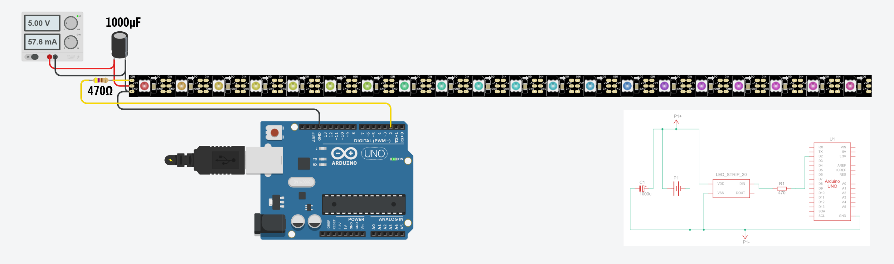
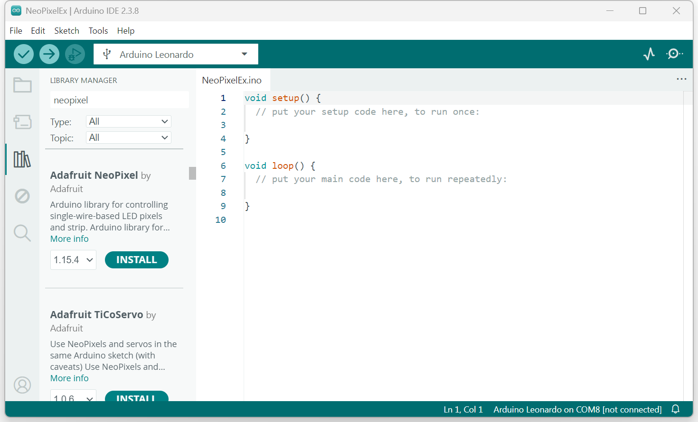
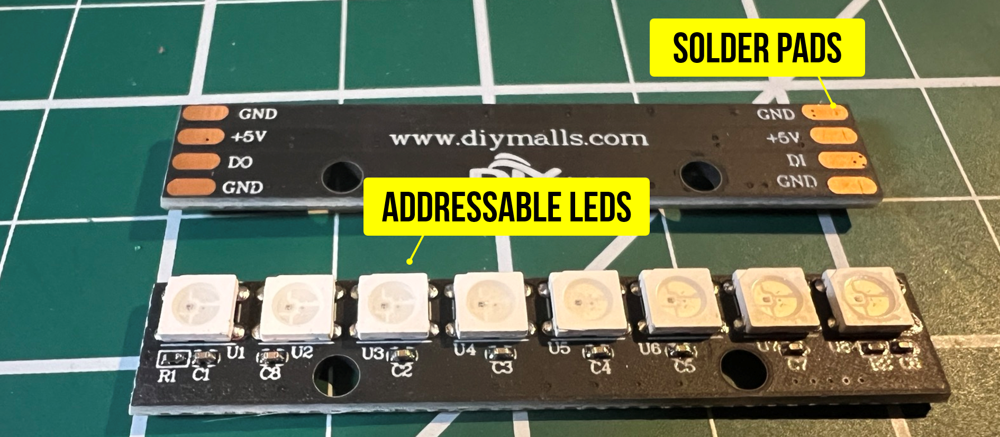
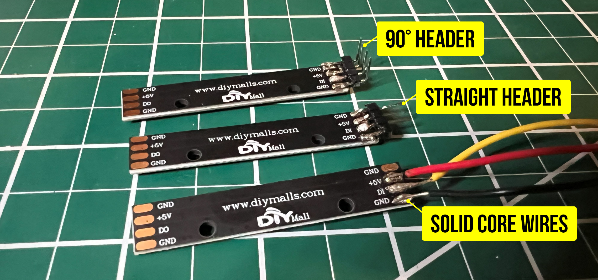
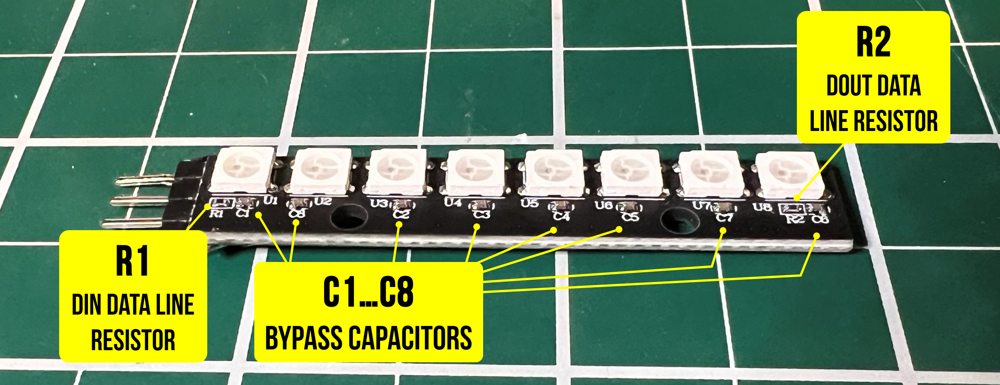

# {{ page.title | replace_first:'L','Lesson '}}
{: .no_toc }

## Table of Contents
{: .no_toc .text-delta }

1. TOC
{:toc}
---

<video autoplay loop muted playsinline style="margin:0px" aria-label="Video showing an LED stick with 8 RGB LEDs being controlled by two potentiometers: one for hue and one for brightness.">
  <source src="assets/videos/LEDStickOverview_optimized_720p.mp4" type="video/mp4" />
</video>
**Video.** Setting the hue and brightness on a WS2812B LED stick with 8 RGB LEDs. The first part of the video is running the [ManualRainbowHueBriPotNeoPixelOLEDGraph sketch](https://github.com/makeabilitylab/arduino/tree/master/AddressableLEDs/NeoPixel/ManualRainbowHueBriPotNeoPixelOLEDGraph) and the second is running [HueBrightnessPotNeoPixelOLEDSimple](https://github.com/makeabilitylab/arduino/tree/master/AddressableLEDs/NeoPixel/HueBrightnessPotNeoPixelOLEDSimple). The OLED is, of course, unnecessary but used to show underlying operation.
{: .fs-1 }

From holiday lights to wearable costumes to interactive art installations, addressable RGB LEDs are everywhere. Unlike the [single RGB LEDs](../arduino/rgb-led.md) we used in the [Intro to Arduino lessons](../arduino/index.md)—which required three PWM pins and careful `analogWrite()` mixing for just *one* LED—addressable LEDs have a tiny driver chip built into *each* LED, allowing you to individually control hundreds of pixels from a single Arduino pin. In this lesson, we'll learn how they work and build some colorful projects!

{: .note }
> **In this lesson, you will learn:**
> - What addressable RGB LEDs are and how they differ from standard RGB LEDs
> - How the WS2812B/SK6812 single-wire protocol works (daisy-chained data)
> - Why each LED has a built-in driver chip and what it does for you
> - How to install and use the Adafruit NeoPixel library (which works with any WS2812B/SK6812 hardware)
> - How to set individual pixel colors using RGB and HSV values
> - How to calculate power requirements and when to use an external power supply
> - How to create animations by updating pixels in `loop()`

## Materials

You will need the following materials for this lesson:

| Arduino | LED Stick or Strip | Breadboard | Potentiometer |
|:-----:|:-----:|:-----:|:-----:|
|  |  |  |  |
| Arduino Uno, Leonardo, or similar | WS2812B or SK6812 LED stick (8 LEDs) or strip | Breadboard | 10KΩ Potentiometer (for interactive demos) |

You will also need jumper wires. For longer strips (more than ~10 LEDs), you will need an external 5V power supply—see [Power considerations](#power-considerations) below.

{: .note }
> Our student kits include an 8-LED WS2812B/SK6812 stick. If you have a different addressable LED product (a strip, ring, or matrix), everything in this lesson still applies—only the number of LEDs changes in your code.

## Addressable RGB LEDs

### From single RGB LEDs to addressable strips

In the [Intro to Arduino RGB LED lesson](../arduino/rgb-led.md), you learned how to control a single RGB LED by connecting its red, green, and blue legs to three separate PWM pins and calling `analogWrite()` on each channel to mix colors. It worked, but it was pin-hungry: controlling just one LED required three PWM pins. To control 10 LEDs individually, you would need 30 PWM pins—more than most Arduino boards even have!

Addressable RGB LEDs solve this problem elegantly. Each LED package **contains a tiny integrated circuit (IC)** that handles the color mixing and current limiting internally. Instead of three analog wires per LED, the entire strip of LEDs is controlled through a **single digital data pin**. The Arduino sends color data for all pixels down one wire, and each LED's built-in chip reads its own data and passes the rest downstream.

### How addressable LEDs work

The most common addressable LED chipsets are the **WS2812B** and the **SK6812** (a compatible alternative that offers RGBW variants with a dedicated white LED element, a higher PWM frequency, and improved signal reshaping). Both use the same single-wire protocol and are fully compatible with the same software libraries. You'll find them sold under many brand names—Adafruit calls theirs "[NeoPixels](https://learn.adafruit.com/adafruit-neopixel-uberguide)"—but they all work the same way.

{: .note }
> **"NeoPixel" is Adafruit's brand name** for WS2812B/SK6812-compatible LEDs, much like "Band-Aid" is a brand name for adhesive bandages. The Adafruit NeoPixel library works with *any* WS2812B or SK6812 LEDs regardless of manufacturer. Throughout this lesson, we'll use "NeoPixel library" to refer to the software and "addressable LEDs" or "WS2812B/SK6812" to refer to the hardware generically.

Here's how the data flows:

1. The Arduino sends a stream of color data (3 bytes per LED: one each for red, green, and blue) on a single data pin.
2. The **first LED** in the chain reads the first 3 bytes (its own color), latches them, and passes the remaining data downstream to the next LED.
3. The **second LED** reads the next 3 bytes, latches them, and passes the rest along.
4. This continues down the chain until every LED has received its color.
5. After a brief pause (50µs or more) in the data stream, the LEDs treat the next transmission as a new frame.

<!-- Potential future TODO: Create a diagram showing the daisy-chain data flow:
     Arduino Pin 2 → [LED 1] → [LED 2] → [LED 3] → ... → [LED N]
     With labeled arrows showing "3 bytes consumed" at each LED and "remaining bytes passed downstream" -->

This daisy-chain architecture is what makes addressable LEDs so powerful: you can control hundreds of LEDs from a single pin, with each LED individually addressable.

### The single-wire timing protocol

What makes the WS2812B protocol unusual is that it encodes data using **precisely timed pulses on a single wire**. There is no separate clock signal—instead, each bit is represented by a fixed-length pulse (1.25µs total), and the LED distinguishes a "1" from a "0" based on how long the signal stays high within that period. A long high followed by a short low means "1"; a short high followed by a long low means "0." The [WS2812B datasheet](https://cdn-shop.adafruit.com/datasheets/WS2812B.pdf) calls this "NZR" communication (and you'll often see it referred to as "NRZ" online), but it's more precisely described as pulse-width encoding—each bit's value is determined by how long the signal stays high within the fixed 1.25µs window.

<!-- Potential future TODO: Create a timing diagram showing the NRZ encoding:
     - One bit period = 1.25µs total
     - "0" bit: ~0.4µs high, ~0.85µs low
     - "1" bit: ~0.8µs high, ~0.45µs low
     - Show a few bits in sequence with labels -->

Because there is no clock line, the timing must be extremely precise—accurate to within a few hundred nanoseconds. This is why the NeoPixel library uses hand-tuned assembly code and **temporarily disables interrupts** during `show()` to prevent any timing jitter from corrupting the data. For an 8-LED stick, interrupts are disabled for only ~240µs (barely noticeable), but for a 144-LED strip, it can be ~4.3ms—long enough to occasionally interfere with `Serial` communication or `millis()` accuracy.

{: .note }
> **Not all addressable LEDs use this timing-based protocol.** The **APA102** (sold by Adafruit as "[DotStars](https://learn.adafruit.com/adafruit-dotstar-leds)") uses a two-wire SPI interface with a separate clock line, making it completely **timing-insensitive**. This means APA102 LEDs can be driven reliably from multitasking systems like the Raspberry Pi (where the WS2812B protocol struggles), and they achieve a much higher PWM frequency (~20kHz vs. ~400Hz for WS2812B) and faster data refresh rates. The trade-off is an extra wire and higher cost. For this course, we use WS2812B/SK6812 LEDs because they are the most common and affordable, and the NeoPixel library handles all the timing complexity for us.

### Form factors

<video autoplay loop muted playsinline style="margin:0px" aria-label="Video showing a grid of NeoPixel form factors from matrices to strips">
  <source src="assets/videos/Adafruit_NeoPixel_VideoMontageGrid_optimized_720p.mp4" type="video/mp4" />
</video>
**Video.** A video highlighting the diverse form factors of addressable LEDs from sticks and strips to rings and matrices. All of these videos are from [Adafruit](https://www.adafruit.com/search?q=neopixel).
{: .fs-1 }

Addressable LEDs come in a wide variety of form factors, all using the same protocol and code:

- **Sticks** (like the 8-LED stick in your kit) — compact, easy to breadboard, great for learning
- **Strips** — the most common form factor, available in densities of 30, 60, or 144 LEDs per meter
- **Rings** — circular arrangements, popular for clocks, gauges, and wearable projects
- **Matrices** — rectangular grids (*e.g.,* 8x8 or 16x16) for pixel-art displays
- **Individual LEDs** — for custom PCB designs or embedding into 3D-printed enclosures

Aren't these form factors cool?! And what's **truly amazing** about this: regardless of form factor, the wiring and code are identical—only the number of LEDs changes! So, if you become an expert in one form factor, it will transfer to others.

## Power considerations

Power management is one of the most important considerations when working with addressable LEDs. Each LED can draw a surprising amount of current, and miscalculating power can lead to dim LEDs, flickering, Arduino resets, or even damaged components.

### Per-LED current draw

Each WS2812B/SK6812 LED contains three internal LEDs (red, green, and blue), each of which draws up to **20mA** at full brightness. At full white (all three channels at maximum), a single LED draws:

$$I_{LED} = 20\text{mA (red)} + 20\text{mA (green)} + 20\text{mA (blue)} = 60\text{mA}$$

At lower brightness or non-white colors, the current draw is proportionally less. A single red LED at full brightness draws only 20mA. A dim purple might draw 10mA total.

### Calculating total current

To calculate the maximum current your LED project could draw, multiply the number of LEDs by 60mA:

$$I_{total} = N_{LEDs} \times 60\text{mA}$$

Here are some common scenarios:

| Configuration | LEDs | Max current (full white) | Typical current (mixed colors, ~50% brightness) |
|---|---|---|---|
| 8-LED stick (your kit) | 8 | 480mA | ~100-200mA |
| 30-LED/m strip (1 meter) | 30 | 1.8A | ~400-600mA |
| 60-LED/m strip (1 meter) | 60 | 3.6A | ~800mA-1.2A |
| 144-LED/m strip (1 meter) | 144 | 8.6A | ~2-3A |

### Three power tiers

Depending on how many LEDs you're driving, you'll need different power strategies:

#### Tier 1: Arduino USB power (≤ ~8-10 LEDs)

For small projects like your 8-LED stick, the Arduino's **5V pin** powered by USB is usually sufficient. USB provides up to 500mA, and at moderate brightness with colorful (non-white) patterns, 8 LEDs typically draw 100-200mA—well within the limit.

This is the simplest wiring: just three connections from the LED stick to the Arduino.

**Figure.** Basic wiring for an 8-LED stick powered from the Arduino's 5V pin. This setup is fine for small numbers of LEDs at moderate brightness. No external resistor is needed on the data line because our sticks have one built into the PCB (R1)—see [What's already on the board](#whats-already-on-the-board).
{: .fs-1 }

{: .warning }
> Even with just 8 LEDs, calling `strip.fill(strip.Color(255, 255, 255))` (full white at max brightness) draws ~480mA from USB—very close to the 500mA limit. If your Arduino resets or behaves erratically when all LEDs are full white, reduce the brightness with `strip.setBrightness(128)` or use an external power supply (see below for more!).

#### Tier 2: External 5V supply (10-60+ LEDs)

For longer strips, you **must** use a dedicated external 5V power supply. A USB phone charger (rated 2A or higher), a 5V wall adapter, or a bench power supply all work well. The key requirement is that the supply is rated for the total current your LEDs could draw. 

Place a large electrolytic capacitor (*e.g.,* 1000 µF rated for 6.3V or higher) across the VDD and VSS lines on the LED strip and as close to the LED strip as possible. This buffers sudden current draws and protects the strip from initial power-on surges.

<!-- TODO: Create a Fritzing wiring diagram showing:
     - External 5V supply → VCC and GND on LED strip
     - Arduino GND → shared ground bus (connected to supply GND and strip GND)
     - Arduino Pin 2 → DIN on LED strip (through 300-470Ω resistor)
     - Arduino powered separately via USB
     - 1000µF capacitor across the supply's + and - (near the strip)
     - Clear labels showing "COMMON GROUND" connection -->

**Figure.** Wiring for longer LED strips with an external 5V power supply. I am using a benchtop power supply because a 5V/2A wall adapter is not an available component in Tinkercad. The Arduino and the external supply **must share a common ground** connection—without this, the data signal won't work. The 1000µF capacitor across the power supply protects the LEDs from the initial power surge when the supply is first connected. Finally, in this case, we added a series resistor (470Ω) because the RGB LED strip did not have an inline resistor on DIN.
{: .fs-1 }

{: .warning }
> **The common ground is critical!** The Arduino and the external power supply must share a ground connection. Without a common ground, the Arduino's data signal has no reference voltage and the LEDs won't respond. This is the most common wiring mistake with externally-powered LED strips.

#### Tier 3: Large installations (100+ LEDs)

For very long strips or LED matrices, you may need to "inject" power at multiple points along the strip (every 1-2 meters) to compensate for voltage drop across the thin copper traces. This is beyond the scope of this lesson, but the [Adafruit NeoPixel Überguide](https://learn.adafruit.com/adafruit-neopixel-uberguide/powering-neopixels) covers it in detail.

### The brightness trick

In practice, you almost never need to run all LEDs at full white brightness. Calling `strip.setBrightness(128)` (half brightness) roughly halves your current draw, and most projects actually look *better* at reduced brightness—full-power NeoPixels are blindingly bright! This is a simple way to stay within your power budget without an external supply.

## The Adafruit NeoPixel library

### Installation

The Adafruit NeoPixel library can be installed directly from the Arduino Library Manager. Go to `Sketch → Include Library → Manage Libraries`, search for "Adafruit NeoPixel", and click Install.

**Figure.** Installing the open-source [Adafruit Neopixel Library](https://github.com/adafruit/adafruit_neopixel) in the Arduino IDE.
{: .fs-1 }

{: .note }
> **What about FastLED?** If you search online for WS2812B tutorials, you'll find many that use the [FastLED library](https://fastled.io/) instead. FastLED is a popular alternative that supports the same hardware and offers advanced features like built-in color palettes and noise functions. We use the NeoPixel library in this course because its API is simpler and more consistent with the other Adafruit libraries we use (like the SSD1306 OLED library). Once you're comfortable with the basics, FastLED is worth exploring—see [Resources](#resources) for the link.

### Key API

The NeoPixel library API will feel familiar if you've completed the [OLED lesson](oled.md)—it follows the same **buffer → display** pattern:


#include <Adafruit_NeoPixel.h>

const int LED_PIN = 2;       // Any digital pin works — no PWM required!
const int NUM_LEDS = 8;      // Number of LEDs in the strip/stick

// Create the NeoPixel object
// NEO_GRB: most WS2812B/SK6812 strips use Green-Red-Blue color order
// NEO_KHZ800: 800 KHz data rate (standard for WS2812B/SK6812)
Adafruit_NeoPixel strip(NUM_LEDS, LED_PIN, NEO_GRB + NEO_KHZ800);

void setup() {
  strip.begin();             // Initialize the strip
  strip.setBrightness(50);   // Set brightness (0-255). 50 is ~20% bright
  strip.show();              // Initialize all pixels to 'off'
}


{: .note }
> Notice the same **buffer → show** pattern from the [OLED lesson](oled.md): `setPixelColor()` writes to a buffer in RAM, and `show()` pushes the data to the LEDs. If you forget to call `show()`, nothing will change on the LEDs—just like forgetting `_display.display()` on the OLED!

{: .note }
> **Why Pin 2 (not a PWM pin)?** You might expect addressable LEDs to require a PWM pin since they involve precise signal timing. But the NeoPixel library doesn't use the Arduino's hardware PWM timers—it generates the WS2812B protocol signal entirely in software using carefully timed bit-banging (see [The single-wire timing protocol](#the-single-wire-timing-protocol) above). Any digital pin works! We intentionally chose Pin 2 (a non-PWM pin) to make this clear and to keep the PWM pins free for other uses like [vibromotors](vibromotor.md) or [LED fading](../arduino/led-fade.md).

Here are the most commonly used functions from the [Adafruit NeoPixel library](https://github.com/adafruit/adafruit_neopixel):

| Function | Description |
|----------|-------------|
| `strip.begin()` | Initialize the strip. Call once in `setup()`. |
| `strip.show()` | Push the color buffer to the LEDs. **Nothing changes on the strip until you call this.** |
| `strip.setPixelColor(index, r, g, b)` | Set pixel at `index` to the specified RGB color (0-255 per channel). |
| `strip.setPixelColor(index, color)` | Set pixel using a packed 32-bit color value. |
| `strip.Color(r, g, b)` | Helper that packs RGB values into a single 32-bit color value. |
| `strip.ColorHSV(hue, sat, val)` | Convert HSV color to a packed value. `hue` is 0-65535, `sat` and `val` are 0-255. |
| `strip.setBrightness(value)` | Set global brightness (0-255). Affects all subsequent `show()` calls. |
| `strip.clear()` | Set all pixels to off (black). Still need to call `show()` to take effect. |
| `strip.fill(color, first, count)` | Fill a range of pixels with a single color. |
| `strip.numPixels()` | Returns the number of LEDs in the strip. |
| `strip.getPixelColor(index)` | Returns the current color of a pixel as a packed 32-bit value. |

### Color representation

Each pixel's color is specified using RGB values from an 8-bit value—0-255 per channel—just like the [RGB LED lesson](../arduino/rgb-led.md). Some examples:


// Named colors using strip.Color(R, G, B)
uint32_t red    = strip.Color(255, 0, 0);
uint32_t green  = strip.Color(0, 255, 0);
uint32_t blue   = strip.Color(0, 0, 255);
uint32_t white  = strip.Color(255, 255, 255);
uint32_t purple = strip.Color(128, 0, 255);
uint32_t off    = strip.Color(0, 0, 0);


For animations that cycle through colors, the **HSV** (hue, saturation, value) color space is much more useful than RGB. Remember the [HSL crossfading lesson](../arduino/rgb-led-fade.md)? The same principle applies here. The `ColorHSV()` function lets you smoothly sweep through the entire rainbow by varying just the hue value:


// Hue ranges from 0 to 65535 (full color wheel)
// 0 = red, ~10922 = yellow, ~21845 = green, ~32768 = cyan,
// ~43690 = blue, ~54613 = magenta, 65535 wraps back to red

uint32_t color = strip.ColorHSV(hue, 255, 255); // Full sat, full brightness

// Note: ColorHSV returns a value that should be passed through strip.gamma32()
// for perceptually accurate colors:
strip.setPixelColor(i, strip.gamma32(strip.ColorHSV(hue, 255, 255)));


{: .note }
> **What is `gamma32()`?** Human eyes perceive brightness non-linearly—the difference between 0 and 50 looks much bigger than the difference between 200 and 250. The `gamma32()` function applies a correction curve so that color transitions look smooth and natural to our eyes. It's optional but makes a noticeable difference in gradients and fades.

### Color order

One common "gotcha": not all addressable LEDs use the same color channel order. Most WS2812B strips use **GRB** (green-red-blue) order, but some use RGB, and SK6812 RGBW strips use GRBW. If you set a pixel to red but it lights up green, try changing `NEO_GRB` to `NEO_RGB` (or vice versa) in your strip constructor.

### Memory considerations

Remember that `setPixelColor()` writes to a buffer in RAM, and `show()` pushes that buffer to the LEDs. That buffer has to live somewhere—and on an Arduino Uno or Leonardo, RAM is scarce. The NeoPixel library allocates **3 bytes per pixel** for RGB LEDs (or 4 bytes for RGBW), so the memory cost grows linearly with your strip length:

| Strip length | NeoPixel buffer | Uno SRAM remaining (of 2,048 bytes) |
|---|---|---|
| 8 LEDs (your stick) | 24 bytes | ~2,024 bytes — plenty |
| 60 LEDs (1m strip) | 180 bytes | ~1,868 bytes — fine |
| 144 LEDs (1m dense strip) | 432 bytes | ~1,616 bytes — getting tight |
| 300 LEDs (5m strip) | 900 bytes | ~1,148 bytes — caution |

These numbers might look fine in isolation, but keep in mind that the Arduino's SRAM also holds all your global variables, local variables, the stack, and buffers allocated by other libraries. If you've completed the [OLED lesson](oled.md), you may recall that the SSD1306 display driver allocates a **1,024-byte framebuffer** for a 128×64 display. Running an OLED *and* a 300-LED strip on an Uno would consume 1,024 + 900 = 1,924 bytes of buffer alone—leaving almost nothing for the rest of your sketch.

When SRAM runs out, the symptoms are not helpful: variables silently corrupt, the sketch crashes or resets at random, or Serial output turns to garbage. The Arduino IDE won't warn you at compile time because SRAM usage depends on runtime behavior.

{: .note }
> **For the 8-LED stick in this lesson, memory is not a concern.** But if you later scale up to longer strips—especially while also using an OLED or other memory-hungry libraries—keep this constraint in mind. If you hit mysterious crashes, try reducing `NUM_LEDS`, removing other large buffers, or upgrading to a board with more SRAM (the Arduino Mega has 8KB; the ESP32 has 520KB).

## Wiring

The wiring for addressable LEDs is simple—just three connections:

| Wire | LED Stick Pin | Arduino Pin | Color (typical) |
|------|-------------|-------------|-----------------|
| Power | VCC / 5V | 5V | Red |
| Ground | GND | GND | Black |
| Data | DIN (Data In) | Pin 2 (or any digital pin) | Your Choice (Green, White, Yellow, *etc.*) |

### Preparing the LED stick

**Figure.** The back and front sides of an 8-LED WS2812B stick. We will need to solder either jumper wires or header pins to the pads.
{: .fs-1 }

Many LED sticks (including the 8-LED WS2812B sticks in our kits) come with **bare solder pads** on the back—there are no pre-attached wires or header pins. You'll need to solder either jumper wires or header pins to the pads before you can connect the stick to your breadboard.

Our sticks have **four pads on each end**—both ends have GND, +5V, a data pad, and GND again. The difference is the data pad: one end is labeled **DI** (data in) and the other end is labeled **DO** (data out). You connect the Arduino to the **DI end**. The DO end is used to daisy-chain the data signal out to another stick or strip. The duplicate GND pads on each end make it easy to share a ground connection when chaining.

**Figure.** Three different example soldering options: a 90-degree header, a straight header, and some jumper wires. Make sure you solder the **DI** side (data in).
{: .fs-1 }

**Figure.** Hooking up the soldered wire version to Arduino. In this case, I've hooked up the data line to Pin 2 and I'm running our ["static rainbow" code](https://github.com/makeabilitylab/arduino/blob/master/AddressableLEDs/NeoPixel/RainbowStatic/RainbowStatic.ino). See the [Tinkercad version here](https://www.tinkercad.com/things/lSqArYGju94-neopixel-strip-8-static-rainbow).
{: .fs-1 }

#### What's already on the board

**Figure.** If you examine the RGB LED stick closely, you'll notice that there are some tiny surface-mount components already soldered on. In addition to the white RGB LEDs, there is a data line resistor on the **DIN** line (R1), a series of bypass capacitors (C1-C8) stabilizing the power supply locally at each LED, and a output line resistor (R2) on **DOUT**, which protects whatever device you daisy-chain off the output
{: .fs-1 }

If you look closely at the PCB, you'll notice some tiny surface-mount components already soldered on. On our sticks, you'll see:

- **C1–C8**: One small bypass capacitor per LED (typically 100nF ceramic), placed between VCC and GND. These stabilize the power supply locally at each LED, as recommended by the WS2812B datasheet.
- **R1** (next to the first LED): A data line resistor on the **DIN** line. This protects the first LED's data input from voltage spikes caused by signal ringing—see [The data line resistor](#the-data-line-resistor-300-470ω) below for a full explanation.
- **R2** (next to the last LED): A matching resistor on the **DOUT** line, which provides the same protection for whatever device you daisy-chain off the output.

Because these components are already built into the stick, **you do not need to add an external resistor or capacitor**—just solder wires or header pins directly to the pads and you're ready to go.

{: .note }
> **First time soldering?** This is a great beginner soldering project—the pads are large and widely spaced. If you need guidance, see the [Adafruit Guide to Excellent Soldering](https://learn.adafruit.com/adafruit-guide-excellent-soldering). The key tips: tin both the pad and the wire first, then bring them together with the iron. You only need to solder three connections to get started: **DIN** (data in), **+5V**, and one of the **GND** pads.

{: .warning }
> **Watch the data direction!** Most LED strips and sticks have directional arrows printed on the PCB. Data flows from **DIN** (data in) to **DOUT** (data out). Make sure you connect the Arduino to the **DIN** end. If you wire it to the DOUT end, nothing will work—and there will be no error message to help you debug it!

### The data line resistor (300-470Ω)

As noted in [above](#whats-already-on-the-board), our LED sticks have a built-in data line resistor (R1) on the DIN input. Many pre-made LED strips include one as well. But what does it actually do, and when do you need to add one yourself?

The [Adafruit NeoPixel Überguide's Best Practices](https://learn.adafruit.com/adafruit-neopixel-uberguide/best-practices) section recommends placing a 300-500Ω resistor between the microcontroller's data output and the first LED's data input. Here's why.

The WS2812B data signal switches between 0V and 5V extremely fast (each bit lasts only 1.25µs). When a fast-changing signal travels down a wire, the wire's parasitic inductance and capacitance can cause the signal to **overshoot** at the receiving end—momentarily spiking above 5V. This is called **ringing**, and it's the same transmission-line effect that happens when a wave hits a sudden impedance change (the data input pin of the LED has much higher impedance than the wire). These voltage spikes can stress or damage the first LED's data input pin over time.

A small series resistor placed **close to the first LED's DIN pin** absorbs this energy. The resistor converts the excess voltage into a tiny amount of heat before it reaches the LED, effectively damping the ringing. The value isn't critical—anything from 300Ω to 470Ω works well—but the **placement** matters: the resistor should be as close to the LED's input as possible, not back at the Arduino end of the wire.

This applies to **all WS2812B/SK6812 form factors**—sticks, strips, rings, and matrices alike—because the underlying electrical issue is the same. If you're using our LED sticks or a pre-made strip that already has a resistor on the PCB, you're covered. But if you ever use an LED product without a built-in resistor (check the area near the DIN pad for a tiny SMD component), you should add one externally. Adding a second resistor to a product that already has one does no harm.

{: .warning }
> **Best practice: always verify a data line resistor is present.** If your LED product doesn't include one on the PCB, add a 300-470Ω resistor as close to the first LED's DIN pin as possible. It takes five seconds to add and prevents a class of failures that are rare but frustrating to diagnose. For the 1000µF capacitor across the power supply (relevant when using an external supply), see [Tier 2](#tier-2-external-5v-supply-10-60-leds) above.

### Using addressable LEDs with 3.3V boards (ESP32)

The WS2812B/SK6812 protocol expects 5V logic levels. When using a **5V Arduino** (Uno, Leonardo), this works perfectly since the GPIO pins output 5V.

However, if you're using a **3.3V board** like the [ESP32](../esp32/index.md), the data signal may not be reliably recognized by the LEDs. The WS2812B datasheet specifies a minimum logic HIGH of 0.7 × VDD (= 3.5V when powered at 5V), and a 3.3V signal falls just below this threshold. In practice, many strips *happen* to work at 3.3V—but some don't, and reliability can vary with temperature, strip length, and manufacturing batch.

There are two common solutions:

- **Level shifter (recommended):** Use a level-shifting chip like the [74AHCT125](https://www.adafruit.com/product/1787) to convert the 3.3V data signal to 5V. This is the most reliable approach and only requires one extra chip.
- **Sacrificial first pixel:** Power the first LED at 3.3V (from the ESP32's 3.3V pin) instead of 5V. Because this LED is powered at 3.3V, it will accept the ESP32's 3.3V data signal (which comfortably exceeds 0.7 × 3.3V = 2.31V). Its data *output* will then be at 3.3V logic levels, which—in practice—the next LED in the chain (powered at 5V) tends to accept, even though 3.3V is technically below the 3.5V threshold specified in the datasheet. This trick works reliably for many people, but it is not guaranteed by the spec. It also wastes one LED and its color may look slightly different due to the lower supply voltage.

{: .note }
> For the projects in this lesson using an Arduino Uno or Leonardo (5V boards), you don't need to worry about any of this—just wire it up and go!

## Let's make stuff!

Now that we understand how addressable LEDs work and have our stick wired up, let's build some colorful projects!

### Activity 1: Light 'em up

Let's start by simply setting each LED to a different color. This confirms that your wiring is correct and that the library is communicating with all 8 LEDs. This is our equivalent of the [shape drawing activity](oled.md#activity-draw-shapes-and-text) from the OLED lesson—the simplest possible test.


#include <Adafruit_NeoPixel.h>

const int LED_PIN = 2;
const int NUM_LEDS = 8;

Adafruit_NeoPixel strip(NUM_LEDS, LED_PIN, NEO_GRB + NEO_KHZ800);

void setup() {
  strip.begin();
  strip.setBrightness(50);  // Keep it gentle on the eyes!

  // Set each LED to a different color
  strip.setPixelColor(0, strip.Color(255, 0, 0));     // Red
  strip.setPixelColor(1, strip.Color(255, 128, 0));   // Orange
  strip.setPixelColor(2, strip.Color(255, 255, 0));   // Yellow
  strip.setPixelColor(3, strip.Color(0, 255, 0));     // Green
  strip.setPixelColor(4, strip.Color(0, 255, 255));   // Cyan
  strip.setPixelColor(5, strip.Color(0, 0, 255));     // Blue
  strip.setPixelColor(6, strip.Color(128, 0, 255));   // Purple
  strip.setPixelColor(7, strip.Color(255, 0, 128));   // Pink

  strip.show();  // Don't forget this!
}

void loop() {
  // Nothing to do — the colors persist until changed
}


If your colors look wrong (*e.g.,* you asked for red but got green), try changing `NEO_GRB` to `NEO_RGB` in the strip constructor. This is the most common issue students encounter!

**Figure.** An image of the RGB LED stick running the above code. You can also view and play with this on [Tinkercad](https://www.tinkercad.com/things/lSqArYGju94-neopixel-strip-8-static-rainbow). See our [RainbowStatic8.ino](https://github.com/makeabilitylab/arduino/blob/master/AddressableLEDs/NeoPixel/RainbowStatic8/RainbowStatic8.ino) and [RainbowStatic.ino](https://github.com/makeabilitylab/arduino/blob/master/AddressableLEDs/NeoPixel/RainbowStatic/RainbowStatic.ino) sketches in GitHub.
{: .fs-1 }

Try playing with the colors by changing the RGB values above. Our code for this is in GitHub as [RainbowStatic8.ino](https://github.com/makeabilitylab/arduino/blob/master/AddressableLEDs/NeoPixel/RainbowStatic8/RainbowStatic8.ino). We also have a slightly more complicated version that scales the rainbow to N number of RGB LEDs, called [RainbowStatic.ino](https://github.com/makeabilitylab/arduino/blob/master/AddressableLEDs/NeoPixel/RainbowStatic/RainbowStatic.ino).

### Activity 2: Rainbow animation

Now let's create a classic rainbow animation that cycles smoothly across all 8 LEDs. This introduces the concept of **animation on LED strips**: update pixel colors, call `show()`, wait a bit, repeat. It's the same pattern we used for the [bouncing ball](oled.md#activity-draw-a-bouncing-ball) on the OLED.


#include <Adafruit_NeoPixel.h>

const int LED_PIN = 2;
const int NUM_LEDS = 8;
const int HUE_STEP = 256;
const uint32_t MAX_HUE = 65536; // Full circle (360 degrees) in 16-bit hue

Adafruit_NeoPixel strip(NUM_LEDS, LED_PIN, NEO_GRB + NEO_KHZ800);

uint32_t firstPixelHue = 0; 

void setup() {
  strip.begin();
  strip.setBrightness(50);
  strip.show();
}

void loop() {
  for (int i = 0; i < strip.numPixels(); i++) {
    // Offset each pixel's hue to spread the rainbow across the strip
    uint32_t pixelHue = firstPixelHue + (i * MAX_HUE / strip.numPixels());
    
    // ColorHSV accepts a 16-bit hue; gamma32 provides more natural color transitions
    strip.setPixelColor(i, strip.gamma32(strip.ColorHSV(pixelHue)));
  }
  strip.show();

  // Increment and wrap around using modulo to stay within 0-65535
  firstPixelHue = (firstPixelHue + HUE_STEP) % MAX_HUE;

  delay(20); // ~50 fps
}


Try changing the `HUE_STEP` constant to `64` (slower rainbow) or `512` (faster rainbow). What happens if you change `setBrightness()` to 255? (Shield your eyes!).

Below, we have two versions: [RainbowAnimationUnidirectional.ino](https://github.com/makeabilitylab/arduino/blob/master/AddressableLEDs/NeoPixel/RainbowAnimationUnidirectional/RainbowAnimationUnidirectional.ino), which shows a one-way rainbow, and [RainbowAnimationBidrectional.ino](https://github.com/makeabilitylab/arduino/blob/master/AddressableLEDs/NeoPixel/RainbowAnimationBidirectional/RainbowAnimationBidirectional.ino), which oscillates the rainbow back-and-forth. 

<video autoplay loop muted playsinline style="margin:0px" aria-label="Video showing the RainbowAnimationUnidirectional.ino sketch.">
  <source src="assets/videos/RainbowAnimationUnidirectional_IMG_8991_optimized_720p.mp4" type="video/mp4" />
</video>
**Video.** A demonstration of the unidirectional rainbow animation (see [RainbowAnimationUnidirectional.ino](https://github.com/makeabilitylab/arduino/blob/master/AddressableLEDs/NeoPixel/RainbowAnimationUnidirectional/RainbowAnimationUnidirectional.ino) on GitHub).
{: .fs-1 }

<video autoplay loop muted playsinline style="margin:0px" aria-label="Video showing the RainbowAnimationBidirectional.ino sketch.">
  <source src="assets/videos/RainbowAnimationBidrectional_IMG_8992_optimized_720p.mp4" type="video/mp4" />
</video>
**Video.** A demonstration of the bidirectional rainbow animation (see [RainbowAnimationBidirectional.ino](https://github.com/makeabilitylab/arduino/blob/master/AddressableLEDs/NeoPixel/RainbowAnimationBidirectional/RainbowAnimationBidirectional.ino) on GitHub).
{: .fs-1 }

### Activity 3: Potentiometer-controlled color

Now let's add **analog input** to control the LED colors. We'll use a potentiometer on `A0` to sweep the hue across the entire color wheel—turn the knob and watch all LEDs shift from red to green to blue and back. This is the same `analogRead()` → `map()` → output pattern we used in the [OLED interactive demos](oled.md#activity-interactive-graphics) and the [vibromotor potentiometer activity](vibromotor.md#activity-2-potentiometer-controlled-vibration).

#### The circuit

Use the same LED wiring as before, and add a 10KΩ potentiometer with its wiper connected to `A0`.

<video autoplay loop muted playsinline style="margin:0px" aria-label="A circuit diagram for the potentiometer-controlled color example.">
  <source src="assets/videos/HuePotNeoPixel-NoOLED-Tinkercad-WiringDiagram.mp4" type="video/mp4" />
</video>
**Video.** A circuit diagram for the potentiometer-controlled hue example. You can play with this example directly in [Tinkercad](https://www.tinkercad.com/things/3Z4eWd23kGU-neopixel-strip-8-pot-controlled-hue).
{: .fs-1 }

#### The code


#include <Adafruit_NeoPixel.h>

const int LED_PIN = 2;
const int NUM_LEDS = 8;
const int POT_PIN = A0;

Adafruit_NeoPixel strip(NUM_LEDS, LED_PIN, NEO_GRB + NEO_KHZ800);

void setup() {
  strip.begin();
  strip.setBrightness(50);
  strip.show();
  Serial.begin(9600);
}

void loop() {
  // Read the potentiometer (0-1023)
  int potVal = analogRead(POT_PIN);

  // Map to hue (0-65535 for the full color wheel)
  long hue = map(potVal, 0, 1023, 0, 65535);

  // Set all pixels to the same hue
  for (int i = 0; i < strip.numPixels(); i++) {
    strip.setPixelColor(i, strip.gamma32(strip.ColorHSV(hue)));
  }
  strip.show();

  // Debug output
  Serial.print("Pot: ");
  Serial.print(potVal);
  Serial.print(" -> Hue: ");
  Serial.println(hue);

  delay(20);
}


As you turn the potentiometer, you should see all 8 LEDs smoothly cycle through the rainbow together.

I also made a version with the OLED to make the controls more clear. 

<video autoplay loop muted playsinline style="margin:0px" aria-label="A version of the potentiometer-controlled hue example with an OLED screen for improved user feedback.">
  <source src="assets/videos/HuePotNeoPixelOLED_IMG_8994_optimized_720p.mp4" type="video/mp4" />
</video>
**Video.** A version of the potentiometer-controlled hue example with an OLED screen for improved user feedback. To be clear, you do **not need an OLED** to use the addressable RGB LEDs. I've added this only for additional feedback and clarity on how this example works.
{: .fs-1 }

#### Part 2: Two-pot color and brightness control

Now let's add a **second potentiometer** on `A1` to independently control brightness while the first pot controls hue. This gives you two physical knobs—one for color, one for intensity—which is a nice introduction to **multi-input control**. It also demonstrates why the HSV color space is so useful: hue and brightness are independent parameters, so two knobs map naturally to two HSV axes.

<video autoplay loop muted playsinline style="margin:0px" aria-label="A circuit diagram for the potentiometer-controlled hue and brightness example.">
  <source src="assets/videos/HueBrightnessPotNeoPixel-NoOLED-Tinkercad-WiringDiagram.mp4" type="video/mp4" />
</video>
**Video.** A circuit diagram for the potentiometer-controlled hue and brightness example. You can view and play with this example on [Tinkercad](https://www.tinkercad.com/things/53EaKIvUCsX-neopixel-strip-8-pot-controlled-hue-and-brightness).
{: .fs-1 }


#include <Adafruit_NeoPixel.h>

const int LED_PIN = 2;
const int NUM_LEDS = 8;
const int HUE_POT_PIN = A0;
const int BRIGHTNESS_POT_PIN = A1;

Adafruit_NeoPixel strip(NUM_LEDS, LED_PIN, NEO_GRB + NEO_KHZ800);

void setup() {
  strip.begin();
  strip.show();
  Serial.begin(9600);
}

void loop() {
  // Read both potentiometers
  int huePotVal = analogRead(HUE_POT_PIN);
  delay(1);  // Brief delay for ADC multiplexer settling when switching analog channels
  int brightPotVal = analogRead(BRIGHTNESS_POT_PIN);

  // Map to HSV parameters
  long hue = map(huePotVal, 0, 1023, 0, 65535);         // Full color wheel
  int brightness = map(brightPotVal, 0, 1023, 0, 255);  // 0 (off) to 255 (max)

  // Set all pixels to the same hue with the controlled brightness
  // ColorHSV takes: hue (0-65535), saturation (0-255), value/brightness (0-255)
  for (int i = 0; i < strip.numPixels(); i++) {
    strip.setPixelColor(i, strip.gamma32(strip.ColorHSV(hue, 255, brightness)));
  }
  strip.show();

  // Debug output
  Serial.print("Hue: ");
  Serial.print(hue);
  Serial.print(" | Brightness: ");
  Serial.println(brightness);

  delay(20);
}


Try turning each knob independently—you can dial in any color at any brightness level. Notice how the `ColorHSV()` function's three parameters (hue, saturation, value) map perfectly to physical controls. What would you use a *third* potentiometer for? (Hint: saturation controls how vivid *vs.* pastel the color looks!)

Similar to above, I also made a version with the OLED to make the controls and resulting output more clear.

<video autoplay loop muted playsinline style="margin:0px" aria-label="A version of the potentiometer-controlled hue and brightness example with an OLED screen for improved user feedback.">
  <source src="assets/videos/HueBrightnessPotNeoPixelOLEDSimple_IMG_8979_LightsOn_optimized.mp4" type="video/mp4" />
</video>
**Video.** A version of the potentiometer-controlled hue and brightness example with an OLED screen for improved user feedback. As noted previously, you do **not need an OLED** to use the addressable RGB LEDs. I've added this only for additional feedback and clarity on how this example works.
{: .fs-1 }

<!-- ### Activity 4: LED level meter

For our final activity, let's build a **level meter** (or VU meter)—a bar-graph display where the number of lit LEDs corresponds to an analog input value. This is similar to the [analog graph we built on the OLED](oled.md#demo-3-basic-real-time-analog-graph), but using physical LEDs instead of on-screen pixels. It's a great way to visualize sensor data in the physical world!

We'll color the LEDs from green (low) through yellow (mid) to red (high), like a classic audio level meter.


#include <Adafruit_NeoPixel.h>

const int LED_PIN = 2;
const int NUM_LEDS = 8;
const int SENSOR_PIN = A0;

Adafruit_NeoPixel strip(NUM_LEDS, LED_PIN, NEO_GRB + NEO_KHZ800);

// Colors for the level meter (green → yellow → red)
// Note: strip.Color() is a pure math function (it just packs RGB into a uint32_t),
// so it's safe to call here at global scope before strip.begin().
uint32_t levelColors[] = {
  strip.Color(0, 255, 0),     // LED 0: Green
  strip.Color(0, 255, 0),     // LED 1: Green
  strip.Color(0, 255, 0),     // LED 2: Green
  strip.Color(128, 255, 0),   // LED 3: Yellow-green
  strip.Color(255, 255, 0),   // LED 4: Yellow
  strip.Color(255, 128, 0),   // LED 5: Orange
  strip.Color(255, 0, 0),     // LED 6: Red
  strip.Color(255, 0, 0),     // LED 7: Red
};

void setup() {
  strip.begin();
  strip.setBrightness(50);
  strip.show();
}

void loop() {
  // Read the analog sensor
  int sensorVal = analogRead(SENSOR_PIN);

  // Map to number of LEDs to light (0 to NUM_LEDS)
  int numLit = map(sensorVal, 0, 1023, 0, NUM_LEDS);

  // Update the strip
  strip.clear();
  for (int i = 0; i < numLit; i++) {
    strip.setPixelColor(i, levelColors[i]);
  }
  strip.show();

  delay(30);
}


Turn the potentiometer and watch the LEDs fill up like a progress bar! This is a simple but satisfying example of mapping data to a physical display. Try replacing the potentiometer with a [force-sensitive resistor](../arduino/force-sensitive-resistors.md) or a [photoresistor](../sensors/photoresistors.md) for a more interactive experience.

{: .note }
> **Connecting to the previous lessons:** Notice how the same `analogRead()` → `map()` → output pattern appears in every lesson in this module. In the [OLED lesson](oled.md), it controlled a circle's size. In the [vibromotor lesson](vibromotor.md), it controlled vibration intensity. Here, it controls the number of lit LEDs. Learning to recognize this pattern is a key physical computing skill—once you can map sensor input to output, you can build almost anything! -->

## Troubleshooting

If your LEDs aren't behaving as expected, work through this list. These are the most common issues students encounter, roughly in order of likelihood:

| Symptom | Likely cause | Fix |
|---------|-------------|-----|
| No LEDs light up at all | Wired to **DOUT** instead of **DIN** | Check the directional arrows on the PCB. Data flows from DIN to DOUT—the Arduino must connect to the DIN end. |
| No LEDs light up at all | Wrong pin number in code | Make sure `LED_PIN` in your sketch matches the physical Arduino pin you wired to. |
| No LEDs light up at all | Forgot to call `strip.show()` | `setPixelColor()` only writes to a buffer in RAM. Nothing appears on the LEDs until you call `show()`. |
| Colors are wrong (*e.g.,* red shows as green) | Wrong color order in constructor | Change `NEO_GRB` to `NEO_RGB` (or vice versa) in the `Adafruit_NeoPixel` constructor. |
| LEDs flicker or Arduino resets | Insufficient power | At full white, 8 LEDs draw ~480mA—close to the USB limit. Reduce brightness with `setBrightness()` or use an external 5V supply. |
| LEDs flicker or show random colors | Missing common ground | When using an external power supply, the Arduino and the supply **must** share a ground connection. |
| First LED died or behaves erratically | Missing data line resistor | Our sticks have a built-in resistor (R1), but if you're using a different LED product, verify it has one near the DIN pad. If not, add a 300-470Ω resistor externally. See [The data line resistor](#the-data-line-resistor-300-470ω). |
| Only some LEDs work | Damaged LED in the chain | A dead LED breaks the data chain for all LEDs after it. Cut out the bad LED, resolder, and the rest should work again. |
| Colors look washed out or gradients look "steppy" | Missing gamma correction | Pass colors through `strip.gamma32()` for perceptually smooth transitions. |

{: .note }
> **When in doubt, go back to basics.** Upload the [Activity 1](#activity-1-light-em-up) sketch with no modifications and confirm that all 8 LEDs light up in distinct colors. If that works, the issue is in your code. If it doesn't, the issue is in your wiring.

## Exercises

Want to go further? Here are some challenges to reinforce what you've learned:

- **Larson scanner.** Create the classic "Knight Rider" or Cylon eye effect: a single bright LED (with a dim trail) that sweeps back and forth across the strip. Hint: on each frame, dim all LEDs slightly, then set the current position LED to full brightness.
- **Color mixer.** Use three potentiometers (on A0, A1, A2) to control the red, green, and blue channels of all LEDs. Display the current RGB values on the [OLED display](oled.md) at the same time for a multimodal output!
- **Reaction timer game.** Create a "light" that bounces back and forth across the strip. The player presses a button to try to "catch" the light when it reaches a specific LED. Display their reaction time on the Serial Monitor (or OLED).
- **Temperature indicator.** If you have a temperature sensor (like the [TMP36](https://www.adafruit.com/product/165)), map the temperature to a color gradient on the LEDs—blue for cold, green for comfortable, red for hot.

## Lesson Summary

In this lesson, you learned about addressable RGB LEDs and how to create colorful, animated, and interactive light displays. The key concepts were:

- **Addressable LEDs** (WS2812B/SK6812) contain a built-in driver chip at each LED, allowing individual control of hundreds of pixels from a single data pin. This is fundamentally different from standard RGB LEDs, which require three PWM pins per LED.
- The LEDs use a **daisy-chain protocol**: data flows from the Arduino to the first LED, which reads its color and passes the remaining data downstream. Each LED in the chain receives its own color data automatically.
- The WS2812B protocol encodes bits using precisely timed pulses on a single wire (pulse-width encoding), with no clock signal. The NeoPixel library handles this timing in software and must briefly disable interrupts during `show()`. Alternative chipsets like the APA102 use a clocked SPI interface that avoids these timing constraints.
- The **Adafruit NeoPixel library** provides a clean API that follows the same buffer → show pattern as the OLED: `setPixelColor()` writes to RAM, and `show()` pushes the data to the LEDs.
- **Power management** is critical: each LED can draw up to 60mA at full white. For 8 LEDs, Arduino USB power is usually sufficient; for longer strips, an external 5V power supply with a **shared ground** is required.
- The **HSV color space** (via `ColorHSV()`) makes it easy to create rainbow effects by sweeping the hue value, and `gamma32()` applies perceptual brightness correction for smoother gradients.
- "NeoPixel" is Adafruit's brand name; the underlying WS2812B/SK6812 hardware is made by many manufacturers and is all compatible with the same library.

## Resources

- [Adafruit NeoPixel Überguide](https://learn.adafruit.com/adafruit-neopixel-uberguide), Adafruit — the definitive guide to all things NeoPixel, including best practices, wiring, and advanced techniques

- [FastLED Library](https://fastled.io/) — a popular alternative library with advanced features like built-in palettes, noise functions, and math helpers. Worth exploring once you're comfortable with the NeoPixel library.

- [WS2812B Datasheet](https://cdn-shop.adafruit.com/datasheets/WS2812B.pdf), Worldsemi

- [NeoPixel Best Practices](https://learn.adafruit.com/adafruit-neopixel-uberguide/best-practices), Adafruit — essential reading on power, wiring, and protection

## Next Lesson

In the [next lesson](servo.md), we will learn about servo motors—another output device with a built-in control circuit—and how to precisely control angular position with the Arduino Servo library.

[Previous: OLED Displays](oled.md){: .btn .btn-outline }
[Next: Servo Motors](servo.md){: .btn .btn-outline }
