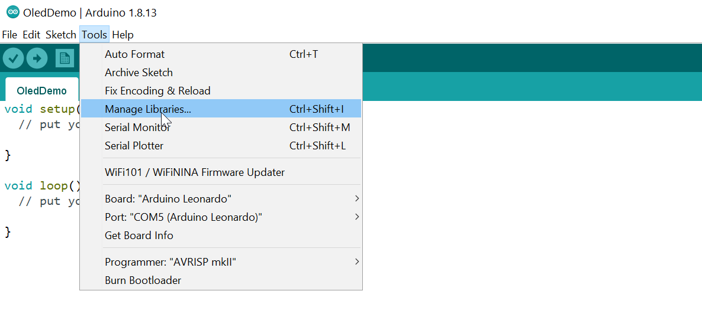
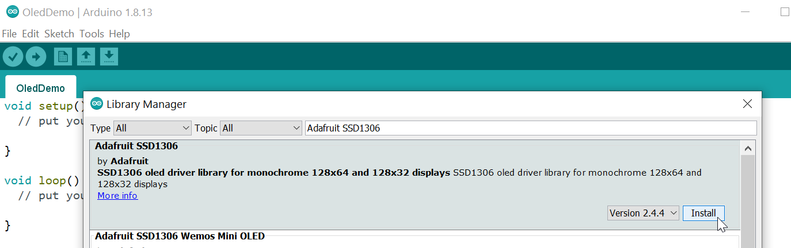
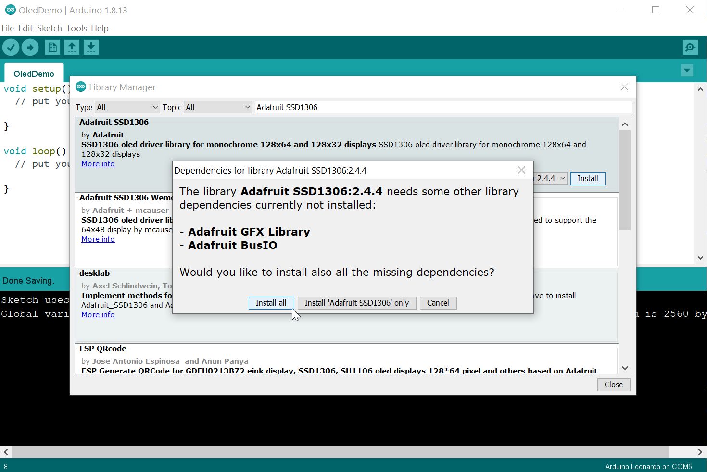
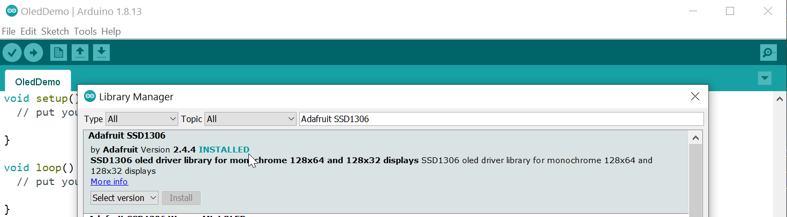
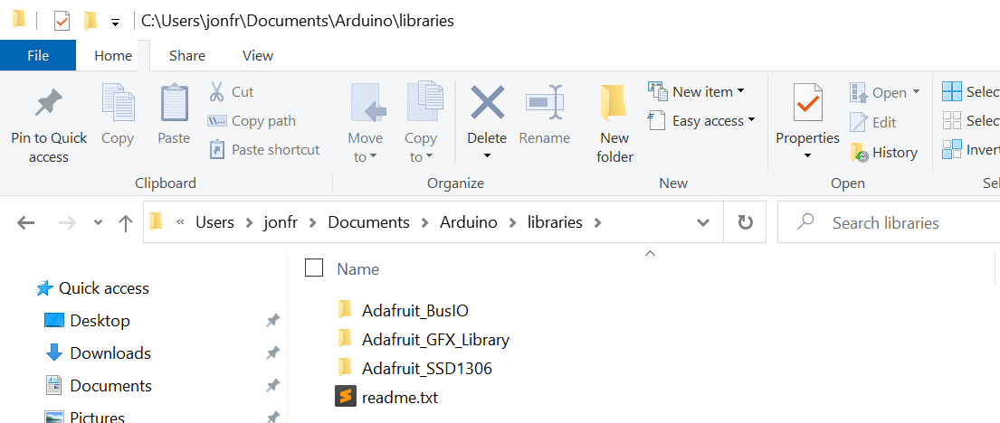
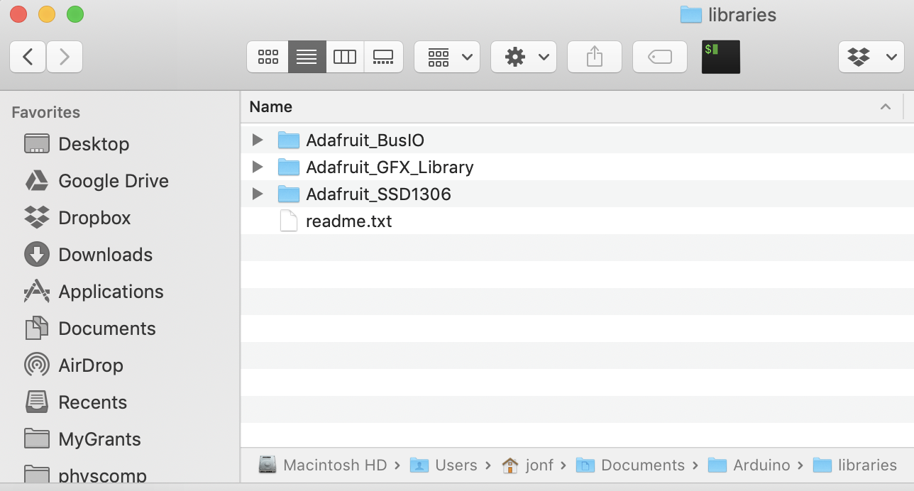

# {{ page.title | replace_first:'L','Lesson '}}
{: .no_toc }

## Table of Contents
{: .no_toc .text-delta }

1. TOC
{:toc}
---

To use the Adafruit OLED display, we need two libraries:

- The [Adafruit_SSD1306](https://github.com/adafruit/Adafruit_SSD1306) display driver library, which handles display communication, memory mapping, and low-level drawing routines
- The [Adafruit_GFX](https://github.com/adafruit/Adafruit-GFX-Library) graphics library, which provides core graphics routines for all Adafruit displays like drawing points, lines, circles. 

To install both, follow the instructions below:

## Step 1: Open "Manage Libraries"

Open your Arduino IDE, then go to `Tools -> Manage Libraries`.

## Step 2: Search for Adafruit SSD1306

In the Library Manager, search for "Adafruit SSD1306". There are other SSD1306 libraries so make sure you find the one by Adafruit. In this screenshot, the current version is 2.4.4.

## Step 3: Install Adafruit SSD1306 library
Click on the `Install` button.

## Step 4: Install all dependencies

The Adafruit SSD1306 library depends on two other libraries, which we also need to install. Fortunately, the Library Manager detects this and explicitly asks about dependencies. So, select `Install all`.

<!-- The Arduino IDE Library Manager let's library designers to identify other library dependencies in their metadata. This allows the IDE to ask users about dependencies automatically.  -->

## Step 5: Confirm installation

If the SSD1306 library was correctly installed, you should see a teal "INSTALLED" label next to it as we do below:

## Library installation folder location on OS

All libraries are installed in the `Documents` folder on your OS. It's useful to be aware of this directory in case you want to do a manual install of a library (like the [Makeability Lab Arduino Library](https://github.com/makeabilitylab/arduino/tree/master/MakeabilityLab_Arduino_Library)) or want to view library source code. 

Depending on your OS, you can view the installed Arduino `libraries` folder on your filesystem here:

- On Windows, this defaults to `C:\Users\<username>\Documents\Arduino\libraries`
- On Mac, `/Users/<username>/Documents/Arduino/libraries`

| Arduino Library directory on Windows | Arduino Library directory on Mac |
|:------------------------------------:|:--------------------------------:|
|  |  |

You'll note that the `libraries` folder contains raw source and **not** pre-compiled binaries. The Arduino IDE compiles the underlying library files differently depending on the selected board.

## Return to OLED lesson

Now, return to the [OLED lesson](oled.md) and work on wiring up your display!