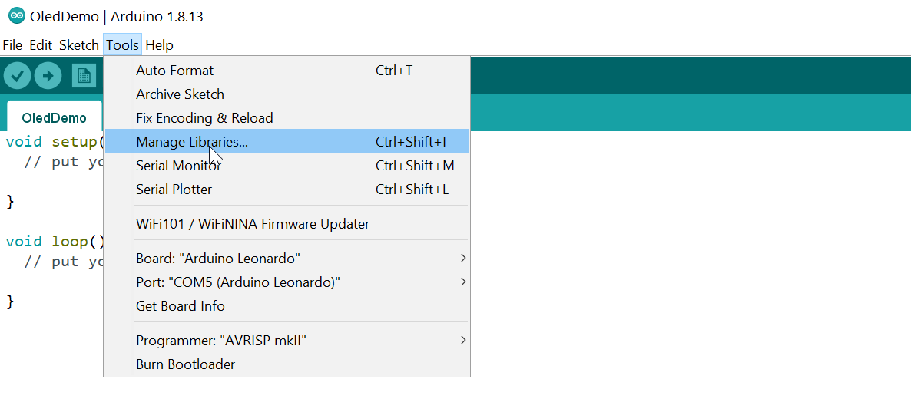
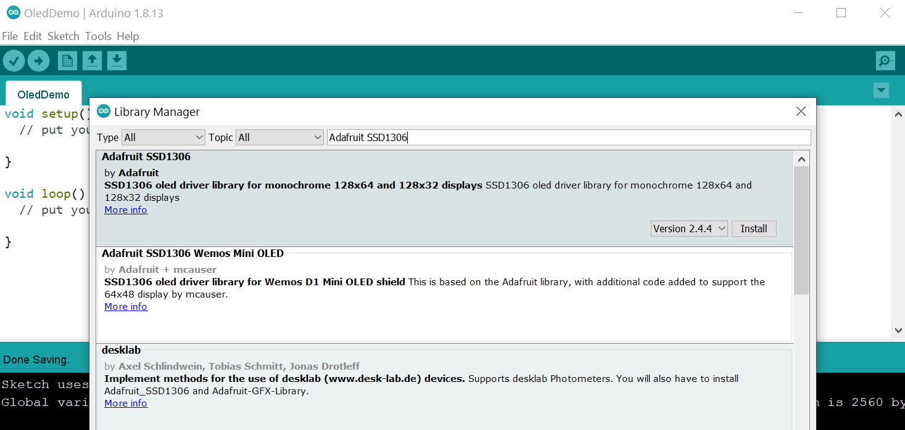
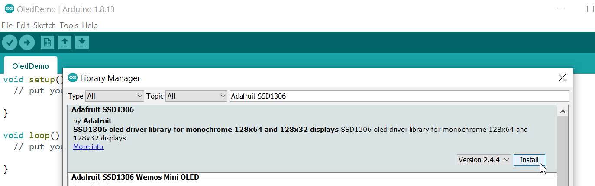
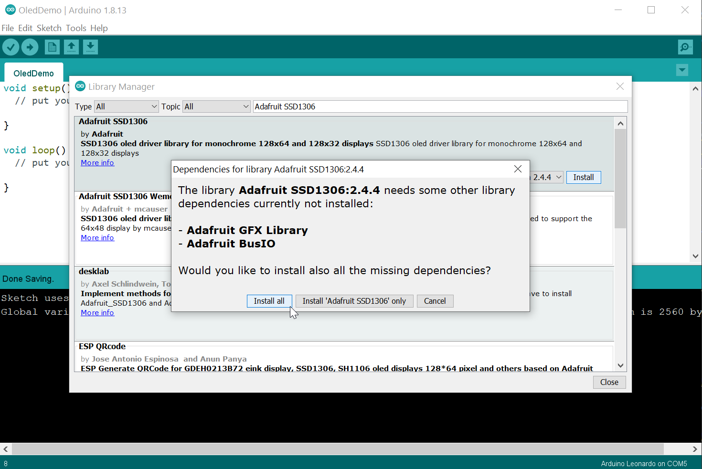
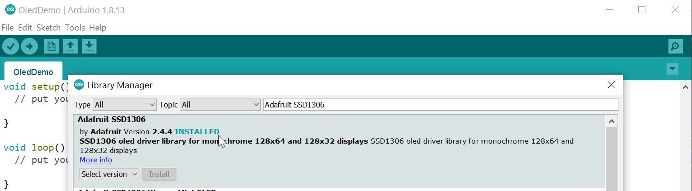
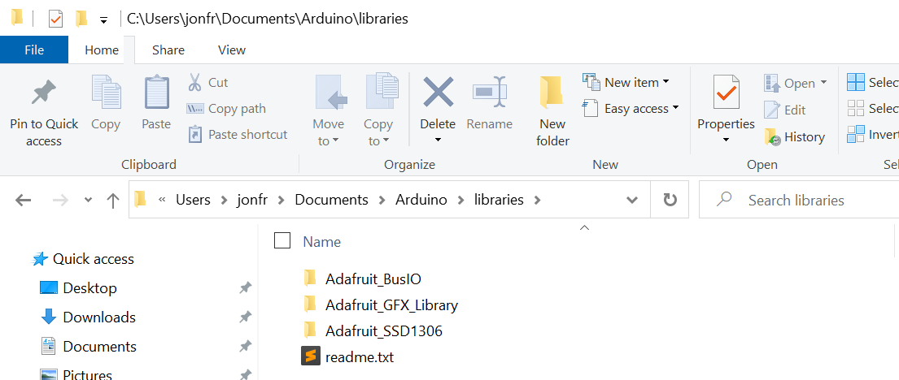
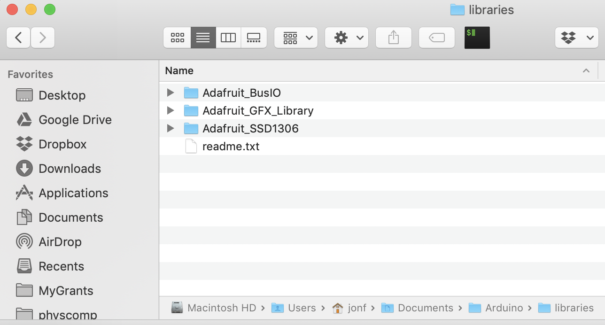

# {{ page.title }}
{: .no_toc }

## Table of Contents
{: .no_toc .text-delta }

1. TOC
{:toc}
---

To use the Adafruit OLED display, we need two libraries:

- The [Adafruit_SSD1306](https://github.com/adafruit/Adafruit_SSD1306) display driver library, which handles display communication, memory mapping, and low-level drawing routines.
- The [Adafruit_GFX](https://github.com/adafruit/Adafruit-GFX-Library) graphics library, which provides core graphics routines for all Adafruit displays like drawing points, lines, and circles.

To install both, follow the instructions below:

## Step 1: Open the Library Manager

Open your Arduino IDE, then open the Library Manager. In Arduino IDE 2.x, click the library icon in the left sidebar (it looks like stacked books) or go to `Sketch → Include Library → Manage Libraries`.

## Step 2: Search for Adafruit SSD1306

In the Library Manager, search for "Adafruit SSD1306". There are other SSD1306 libraries, so make sure you find the one by Adafruit. The screenshots below may show an older version—always install the latest available version.

## Step 3: Install Adafruit SSD1306 library

Click on the `Install` button.

## Step 4: Install all dependencies

The Adafruit SSD1306 library depends on other libraries (including Adafruit GFX and Adafruit BusIO), which we also need. Fortunately, the Library Manager detects this and explicitly asks about dependencies. Select `Install all`.

<!-- The Arduino IDE Library Manager lets library designers identify other library dependencies in their metadata. This allows the IDE to ask users about dependencies automatically. -->

## Step 5: Confirm installation

If the SSD1306 library was correctly installed, you should see a teal "INSTALLED" label next to it as we do below:

## Library installation folder location

All libraries are installed in a `libraries` folder within your Arduino sketchbook directory. It's useful to know this location in case you want to do a manual install of a library (like the [Makeability Lab Arduino Library](https://github.com/makeabilitylab/arduino/tree/master/MakeabilityLab_Arduino_Library)) or want to view library source code.

Depending on your OS, the default location is:

- **Windows:** `C:\Users\<username>\Documents\Arduino\libraries`
- **Mac:** `/Users/<username>/Documents/Arduino/libraries`
- **Linux:** `~/Arduino/libraries`

| Arduino Library directory on Windows | Arduino Library directory on Mac |
|:------------------------------------:|:--------------------------------:|
|  |  |

You'll note that the `libraries` folder contains raw source code and **not** pre-compiled binaries. The Arduino IDE compiles the underlying library files differently depending on the selected board.

## Return to OLED lesson

You're all set! Return to the [OLED lesson](oled.md) to wire up your display and start drawing.