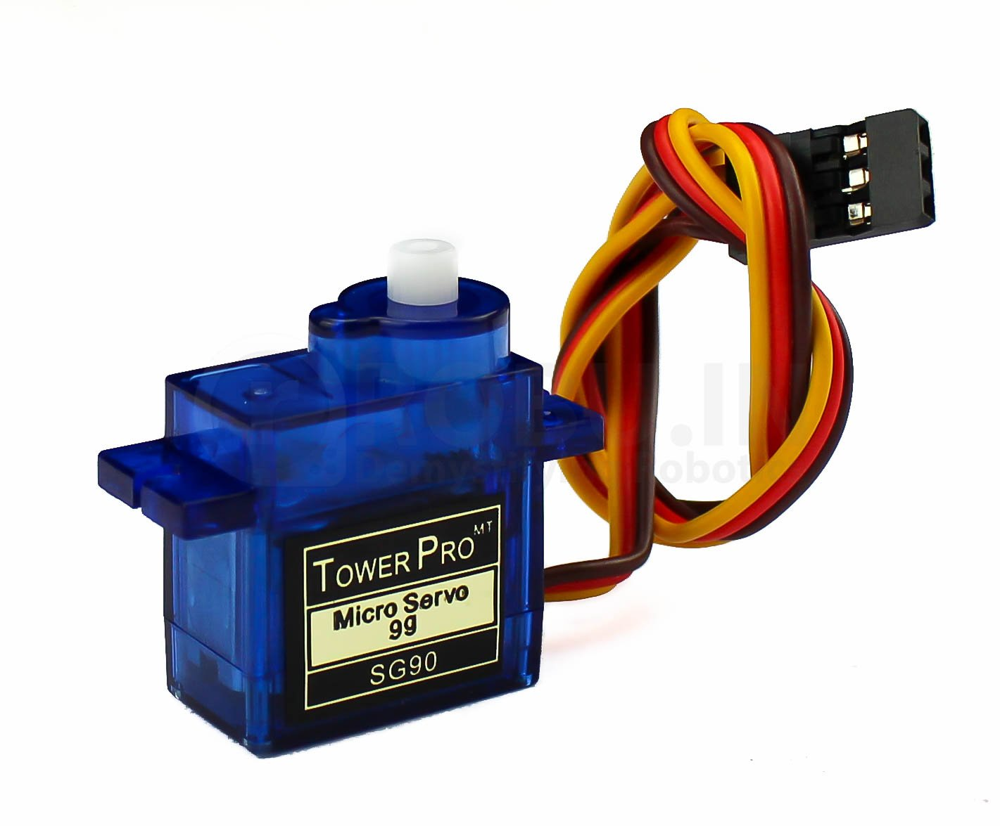
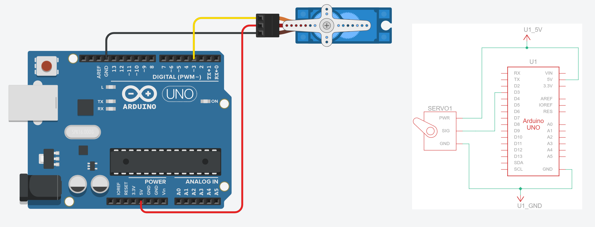
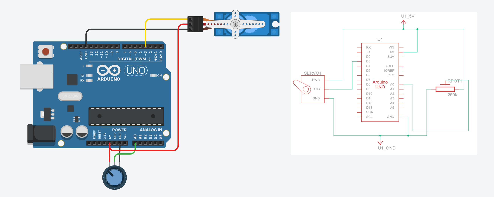

# {{ page.title | replace_first:'L','Lesson '}}
{: .no_toc }

## Table of Contents
{: .no_toc .text-delta }

1. TOC
{:toc}
---

{: .warning }
> This lesson is in draft form. The circuit diagrams and videos have not yet been inserted; however, the content is complete and can be followed.

<!-- TODO: Record a hero video showing a servo sweeping back and forth (or a more creative servo project like a pointing gauge or waving hand) and embed here -->

In the previous two lessons, we controlled pixels—on an [OLED screen](oled.md) and on an [LED strip](addressable-leds.md). Now let's make things **move**! Servo motors let you precisely control angular position, making them essential components in robotics, RC vehicles, pan/tilt camera mounts, automated door locks, and countless other projects. Best of all, like the OLED and addressable LEDs, servos have a built-in control circuit—so the wiring is simple and a library handles the tricky signal timing.

{: .note }
> **In this lesson, you will learn:**
> - What servo motors are and how they differ from regular DC motors
> - How the internal feedback loop (motor + gears + potentiometer + control circuit) enables precise position control
> - The difference between servo PWM signals and `analogWrite()` PWM—and why they're not the same thing
> - How to use the Arduino Servo library to control servo position
> - How to wire a servo to Arduino (no transistor needed!)
> - Power considerations for servos and when to use an external supply
> - How to create interactive servo projects driven by sensor input

## Materials

You will need the following materials for this lesson:

| Arduino | Servo Motor | Breadboard | Potentiometer |
|:-----:|:-----:|:-----:|:-----:|
|  |  |  |  |
| Arduino Uno, Leonardo, or similar | SG90 or SG92R micro servo (9g) | Breadboard | 10KΩ Potentiometer |

You will also need jumper wires and, for [Activity 3](#activity-3-sensor-driven-servo-gauge), a couple of tactile buttons.

{: .note }
> Our kits include a 9g micro servo—either the TowerPro SG92R (available from [Adafruit](https://www.adafruit.com/product/169)) or the Miuzei SG90 (available from [Amazon](https://www.amazon.com/dp/B0BWH95XSH)). Both are SG90-class servos with nearly identical specs and wiring. Any 9g micro servo with a standard 3-pin connector will work for this lesson.

## Servo motors

### What is a servo motor?

A **servo motor** is a motor that can rotate to a specific angle and *hold* that position. Unlike a regular DC motor (which just spins continuously when you apply voltage), a servo knows where its output shaft is pointing and actively works to maintain that position—even if you try to push it away.

How does it do this? A servo packs four components into one compact package:

1. **A small DC motor** that provides rotational force.
2. **A gear reduction system** that slows the motor down while increasing torque (turning force).
3. **A potentiometer** mechanically coupled to the output shaft that measures the shaft's current angle.
4. **A control circuit** that continuously compares the *desired* position (from your Arduino's signal) with the *actual* position (from the potentiometer) and drives the motor until they match.

<!-- TODO: Create or find a diagram showing the internal components of a servo motor: DC motor, gears, potentiometer, and control circuit, with labels and arrows showing the feedback loop -->

This is called a **closed-loop feedback system**—the control circuit constantly monitors and corrects the position. You tell the servo "go to 90°" and it figures out how to get there and stay there.

{: .note }
> **Built-in smarts!** Notice the pattern across this module: the [OLED](oled.md) has a built-in SSD1306 display controller, [addressable LEDs](addressable-leds.md) have built-in WS2812B driver chips, and servos have a built-in feedback control circuit. Each device handles the complex low-level work internally, and you communicate with it through a simple signal. In the [next lesson](vibromotor.md), we'll encounter a component that *doesn't* have built-in intelligence—and you'll appreciate the difference!

<!-- TODO: consider adding a section on "how to choose a servo" and include things like open vs. closed, accuracy, metal gears vs. plastic, total torque and weight, etc. -->

### Standard vs. continuous rotation servos

There are two types of hobby servos:

- **Standard (positional) servos** rotate to a specific angle, typically between 0° and 180°, and hold that position. The angle is determined by the signal you send. This is what we'll use in this lesson.
- **Continuous rotation servos** spin freely like a regular motor, but you control their speed and direction rather than their position. The same PWM signal that means "go to 90°" on a standard servo means "stop" on a continuous rotation servo, while "0°" means "full speed clockwise" and "180°" means "full speed counter-clockwise."

For this lesson, we'll focus on **standard (positional) servos**, specifically the popular **SG90 micro servo**.

### The SG90 micro servo

The SG90 is a class of tiny, inexpensive servo motors that weigh only 9 grams. Despite their small size, they're surprisingly capable! You'll find SG90-class servos from many manufacturers (TowerPro, Miuzei, and others)—they all share the same basic form factor, connector, and specs:

| Attribute | Rating |
|-----------|--------|
| Weight | 9g |
| Operating voltage | 4.8V - 6.0V |
| Stall torque | 1.8 kg·cm (4.8V) |
| Operating speed | 0.09 sec/60° (4.8V) |
| Rotation range | ~180° |
| Idle current | ~6mA |
| Running current (no load) | ~200-500mA |
| Stall current | ~500-700mA |

The SG90 has a standard 3-pin connector with color-coded wires: **orange/yellow** (signal), **red** (power), and **brown/black** (ground).

## Servo PWM vs. `analogWrite()` PWM

Before we start wiring, let's clear up a common source of confusion. You've already used `analogWrite()` to control [LED brightness](../arduino/led-fade.md). Servos are also controlled by a "PWM" signal. But these are **fundamentally different** kinds of PWM, and mixing them up is a common mistake.

| | `analogWrite()` PWM | Servo PWM |
|---|---|---|
| **What varies** | The **duty cycle** (fraction of time HIGH) | The **pulse width** (duration of the HIGH pulse) |
| **Frequency** | Fixed at 490 Hz or 980 Hz (depending on pin) | Fixed at **50 Hz** (one pulse every 20ms) |
| **What it controls** | Power delivery (brightness, motor speed) | Position (angle) |
| **Signal meaning** | 0% duty cycle = off, 100% = full power | ~1ms pulse = 0°, ~1.5ms = 90°, ~2ms = 180° |
| **Arduino function** | `analogWrite(pin, 0-255)` | `servo.write(0-180)` via the Servo library |

With `analogWrite()`, a 50% duty cycle delivers 50% of the available power—useful for dimming LEDs or slowing motors. With servo PWM, the duty cycle doesn't matter for power delivery. Instead, the servo's control circuit *measures the width of each pulse* to determine the target angle.

<!-- Potential TODO (though this confuses me): Create a side-by-side diagram or animation showing (perhaps we make a p5js example visualization like we did for the tone lesson with piezo buzzers):
     (1) analogWrite PWM with varying duty cycles at fixed ~490Hz frequency
     (2) Servo PWM at fixed 50Hz with varying pulse widths (1ms, 1.5ms, 2ms)
     Label the key differences clearly -->

<video autoplay loop muted playsinline style="margin:0px" aria-label="A video snippet from [Engineering Mindset](https://youtu.be/1WnGv-DPexc) showing the PWM waveform driving a servo motor. Notice how the duty cycle—the duration of the HIGH pulse within a waveform period—controls the servo's target angle.">
  <source src="assets/videos/EngineeringMindset_DrivingServoMotorWithPWM_Oscilliscope_optimized_720p_muted.mp4" type="video/mp4" />
</video>
**Video.** A video snippet from [Engineering Mindset](https://youtu.be/1WnGv-DPexc) showing the PWM waveform driving a servo motor. Notice how the duty cycle—the duration of the HIGH pulse within a waveform period—controls the servo's target angle.
{: .fs-1 }

{: .warning }
> **Do not use `analogWrite()` to control servos!** The `analogWrite()` function produces PWM at 490 Hz or 980 Hz—much too fast for servos, which expect 50 Hz. Sending the wrong signal can cause erratic behavior or damage. Always use the Arduino `Servo` library, which generates the correct 50 Hz signal for you.

## The Arduino Servo library

The [Arduino Servo library](https://github.com/arduino-libraries/Servo/blob/master/src/Servo.h) ships with the Arduino IDE—no installation needed. It handles all the precise signal timing so you can simply tell the servo which angle you want. If you visit the [GitHub source tree for the Servo library](https://github.com/arduino-libraries/Servo/tree/master/src), you'll notice that it has many subfolders, including `avr`, `esp32`, `samd`, and more. This is because Arduino supports multiple hardware types—each subfolder maps to a different hardware architecture, which requires separate source code. For the Arduino Uno and Leonardo, which use the AVR architecture, the library uses [avr/Servo.cpp](https://github.com/arduino-libraries/Servo/blob/master/src/avr/Servo.cpp); for the Arduino Nano 33 IoT and Zero boards, which use the SAMD architecture, the library uses [samd/Servo.cpp](https://github.com/arduino-libraries/Servo/blob/master/src/samd/Servo.cpp).

In fact, if you look at [Servo.h](https://github.com/arduino-libraries/Servo/blob/master/src/Servo.h), you'll see


#if defined(ARDUINO_ARCH_AVR)
#include "avr/ServoTimers.h"
#elif defined(ARDUINO_ARCH_SAM)
#include "sam/ServoTimers.h"
#elif defined(ARDUINO_ARCH_SAMD)
...
#elif defined(ARDUINO_ARCH_ZEPHYR)
#include "zephyr/ServoTimers.h"
#else
#error "This library only supports boards with an AVR, SAM, SAMD, NRF52, STM32F4, Renesas, XMC, ESP32 or Zephyr core."
#endif


Servo libraries rely heavily on hardware Timers. Since an Arduino Uno (AVR) and an Nano 33 IoT (SAMD) have completely different timer hardware, the library must maintain separate codebases for each. If you look inside the avr folder, you'll find custom [Servo.cpp](https://github.com/arduino-libraries/Servo/blob/master/src/avr/Servo.cpp) and [ServoTimers.h](https://github.com/arduino-libraries/Servo/blob/master/src/avr/ServoTimers.h) code specifically written to manipulate the ATmega registers.

Thankfully, you do not need to worry about these different files. Once you select your board type in the Arduino IDE, the compiler determines which files to use based on those `#if defined` statements.

### Key API


#include <Servo.h>

Servo myServo;              // Create a Servo object

void setup() {
  myServo.attach(3);        // Attach to pin 3 (any digital pin works)
  myServo.write(90);        // Move to 90° (center position)
}


Here are the most commonly used functions:

| Function | Description |
|----------|-------------|
| `myServo.attach(pin)` | Attach the servo to a digital pin and start sending the control signal. |
| `myServo.attach(pin, min, max)` | Attach with custom pulse width limits (in microseconds). Default: 544µs min, 2400µs max. |
| `myServo.write(angle)` | Move the servo to the specified angle (0-180). |
| `myServo.writeMicroseconds(us)` | Set the pulse width directly in microseconds for finer control. |
| `myServo.read()` | Returns the last angle written with `write()`. |
| `myServo.attached()` | Returns `true` if the servo is currently attached to a pin. |
| `myServo.detach()` | Stop sending the control signal. The servo will no longer hold its position. |

{: .note }
> **Any digital pin works!** Like the [NeoPixel library](addressable-leds.md), the Servo library generates its signal timing in software—it does not use hardware PWM. You can attach a servo to *any* digital pin, not just PWM-capable pins. We use Pin 3 in our examples for consistency with the rest of the textbook, but Pin 2, Pin 7, or Pin 13 would work just as well.

### `write()` vs. `writeMicroseconds()`

For most projects, `write(angle)` is all you need. However, if you need finer-grained control, `writeMicroseconds(us)` lets you set the exact pulse width. The mapping between the two is roughly:

- `write(0)` → `writeMicroseconds(544)` (default minimum)
- `write(90)` → `writeMicroseconds(1472)` (note: not exactly 1500!)
- `write(180)` → `writeMicroseconds(2400)` (default maximum)

The Arduino Servo library maps 0-180° to 544-2400µs by default, which is slightly wider than the traditional 1000-2000µs range. This means `write(90)` actually sends ~1472µs, not 1500µs. For most projects this doesn't matter, but if you need precise calibration, use `writeMicroseconds()` directly.

{: .warning }
> **Timer conflict:** The Servo library uses Timer1 to generate its 50 Hz signal, which **disables `analogWrite()` on certain pins**—even if your servo isn't connected to those pins:
> - **Arduino Uno:** `analogWrite()` disabled on **Pins 9 and 10** (Timer1 controls those PWM outputs)
> - **Arduino Leonardo:** `analogWrite()` disabled on **Pins 9, 10, and 11** (the ATmega32u4's Timer1 also controls Pin 11)
>
> This matters if you're combining servos with PWM-controlled outputs like LEDs or motors on the same Arduino. If you need PWM on those pins, use different pins for your other outputs, or consider a dedicated servo driver board like the [PCA9685](https://www.adafruit.com/product/815).

## Wiring

Wiring a servo is remarkably simple—just three connections, with no transistor, no diode, and no resistor needed.

| Wire Color | Servo Pin | Arduino Pin |
|-----------|-----------|-------------|
| Orange/Yellow | Signal | Pin 3 (or any digital pin) |
| Red | Power (+) | 5V |
| Brown/Black | Ground (−) | GND |

**Figure.** Wiring the SG90 servo requires just three connections. No transistor or external components needed—the servo has its own built-in driver circuit.
{: .fs-1 }

{: .note }
> **No transistor needed!** In the [vibromotor lesson](vibromotor.md), you'll learn that raw DC motors need a transistor because they draw more current than a GPIO pin can supply. Servos are different—the signal wire carries only a *control signal* (a few milliamps), not the motor's power. The servo's internal driver circuit handles the heavy lifting. The motor power comes directly from the 5V pin, not through the Arduino's GPIO.

### Power considerations

A single SG90 servo under light load can usually be powered from the Arduino's 5V pin (via USB). However, servos can draw significant current, especially during rapid movements or when holding position against a load:

| State | Typical current |
|-------|----------------|
| Idle (holding position, no load) | ~6mA |
| Moving (no load) | ~200-500mA |
| Stall (load exceeds torque) | ~500-700mA |

The Arduino's USB power supply provides about 500mA total. A single SG90 moving under light load is usually fine, but if your servo jitters, stalls, or your Arduino resets, you may be hitting the current limit.

{: .warning }
> **If your Arduino resets when the servo moves**, the servo is drawing too much current from USB. Power the servo from an **external 5V supply** (like a USB phone charger rated 1A+). Connect the supply's 5V directly to the servo's red wire and the supply's GND to both the servo's brown wire and the Arduino's GND (shared ground). Do **not** connect the external 5V to the Arduino's 5V pin.

For projects with **multiple servos**, you will almost certainly need an external power supply. Two or more servos moving simultaneously can easily exceed 1A. For larger builds, consider a dedicated [servo driver board](https://www.adafruit.com/product/815) like the PCA9685, which provides its own power bus and can control up to 16 servos via I2C.

<video autoplay loop muted playsinline style="margin:0px" aria-label="Example wiring diagram with multiple servos connected to Arduino with an external power supply">
  <source src="assets/videos/Tinkercad_MultipleServosWithExternalPowerSupply_optimized_720p_muted.mp4" type="video/mp4" />
</video>
**Video.** Wiring multiple servo motors together with an external power supply. Importantly, both the Arduino GND and the external power supply GND must be connected. You can [play with this multi-servo circuit on Tinkercad here](https://www.tinkercad.com/things/9uPF2TKXYW3-simple-servo-with-external-power).
{: .fs-1 }

## Let's make stuff!

Now that we understand how servos work and have one wired up, let's build some projects! As with the previous lessons, we'll start simple and progressively add interactivity.

### Activity 1: Servo sweep

Just as we started with [blinking an LED](../arduino/led-blink.md) and [lighting up NeoPixels](addressable-leds.md#activity-1-light-em-up), let's start with the simplest possible servo program: sweeping back and forth between 0° and 180°. This confirms your wiring is correct and that the library is communicating with the servo.


#include <Servo.h>

const int SERVO_PIN = 3;
Servo myServo;

void setup() {
  myServo.attach(SERVO_PIN);
}

void loop() {
  // Sweep from 0° to 180°
  for (int angle = 0; angle <= 180; angle++) {
    myServo.write(angle);
    delay(15);  // Wait for the servo to reach the position
  }

  // Sweep back from 180° to 0°
  for (int angle = 180; angle >= 0; angle--) {
    myServo.write(angle);
    delay(15);
  }
}


<!-- TODO: Record a video of the servo sweeping back and forth and embed here. The Tinkercad version is here: https://www.tinkercad.com/things/hNVrJEXGKrT-simple-servo-sweep -->

The `delay(15)` gives the servo time to reach each position before advancing to the next degree. Try changing the delay—a shorter delay means faster sweeping, but if it's too short, the servo can't keep up and will jitter. What happens if you change the range to `for (int angle = 30; angle <= 150; ...)`?

{: .warning }
> **Avoid driving to the mechanical limits.** If your servo makes a grinding or buzzing sound at 0° or 180°, it's hitting its mechanical stops and stalling. This draws high current and can strip the plastic gears over time. Try reducing your range to 10-170° or experiment to find your servo's actual safe limits.

### Activity 2: Potentiometer-controlled servo

Now let's add a potentiometer to directly control the servo's position—turn the knob, and the servo follows. This is the same `analogRead()` → `map()` → output pattern from the [OLED ball-size demo](oled.md#demo-1-setting-ball-size-based-on-analog-input) and the [NeoPixel color wheel](addressable-leds.md#activity-3-potentiometer-controlled-color). You'll see this pattern again in the [vibromotor lesson](vibromotor.md) too—it's one of the most fundamental patterns in physical computing!

#### The circuit

Use the same servo wiring as before, and add a 10KΩ potentiometer with its wiper connected to `A0`.

**Figure.** The wiring diagram for controlling a servo motor with a potentiometer. [Play with the circuit on Tinkercad here](https://www.tinkercad.com/things/idpwDlLVTNL-servo-pot-control); alternatively, you can play with [this version](https://www.tinkercad.com/things/26AJEMw7hut-servo-pot-control-with-oscilliscope), which is the same circuit but with the addition of an oscilloscope to see the PWM control waveform.
{: .fs-1 }

#### The code


#include <Servo.h>

const int SERVO_PIN = 3;
const int POT_PIN = A0;

Servo myServo;

void setup() {
  myServo.attach(SERVO_PIN);
  Serial.begin(9600);
}

void loop() {
  // Read the potentiometer (0-1023)
  int potVal = analogRead(POT_PIN);

  // Map to servo angle (0-180)
  int angle = map(potVal, 0, 1023, 0, 180);

  // Move the servo
  myServo.write(angle);

  // Debug output
  Serial.print("Pot: ");
  Serial.print(potVal);
  Serial.print(" -> Angle: ");
  Serial.println(angle);

  delay(15);
}


<!-- TODO: Record a video of the potentiometer controlling the servo and embed here -->

This is essentially the Arduino's built-in ["Knob" example](https://www.arduino.cc/en/Tutorial/Knob), which you can also find in the Arduino IDE under `File → Examples → Servo → Knob`. Turn the potentiometer and watch the servo track your input in real time. Try replacing the potentiometer with a [force-sensitive resistor](../arduino/force-sensitive-resistors.md) or a [photoresistor](../sensors/photoresistors.md)—squeeze to point, or let light control the angle!

You can hook up an oscilloscope to examine the underlying PWM signal, which we've done in [Tinkercad here](https://www.tinkercad.com/things/26AJEMw7hut-servo-pot-control-with-oscilliscope):

<video autoplay loop muted playsinline style="margin:0px" aria-label="A video of the potentiometer-controlled servo in Tinkercad hooked up to an oscilloscope to show the PWM control signal">
  <source src="assets/videos/Tinkercad_ServoPotWithOscilliscope_50msWindow_optimized_720p_muted.mp4" type="video/mp4" />
</video>
**Video.** A video of the potentiometer-controlled servo in Tinkercad hooked up to an oscilloscope to show the PWM control signal. Play with the [circuit directly here](https://www.tinkercad.com/things/26AJEMw7hut-servo-pot-control-with-oscilliscope)!
{: .fs-1 }

The Engineering Mindset YouTube channel did this for real with an oscilloscope, nicely matching the above simulation:

<video autoplay loop muted playsinline style="margin:0px" aria-label="A video snippet from [Engineering Mindset](https://youtu.be/1WnGv-DPexc) showing a potentiometer-controlled PWM waveform driving a servo motor with an Arduino. Notice how the duty cycle—the duration of the HIGH pulse within a waveform period—controls the servo's target angle">
  <source src="assets/videos/EngineeringMindset_DrivingServoMotorWithArduinoPotPWM_Oscilliscope_optimized_720p_muted.mp4" type="video/mp4" />
</video>
**Video.** A video snippet from [Engineering Mindset](https://youtu.be/1WnGv-DPexc) showing a potentiometer-controlled PWM waveform driving a servo motor with an Arduino. Notice how the duty cycle—the duration of the HIGH pulse within a waveform period—controls the servo's target angle.
{: .fs-1 }

### Activity 3: Sensor-driven servo gauge

For our final activity, let's build a **physical gauge**—a servo-powered pointer that displays sensor data in the real world, like an analog speedometer or a VU meter needle. This is the physical output equivalent of the [OLED analog graph](oled.md#demo-3-basic-real-time-analog-graph) and the [NeoPixel level meter](addressable-leds.md#activity-4-led-level-meter). Where the OLED drew data on screen and the NeoPixels lit up LEDs proportionally, here we'll sweep a physical pointer across a scale.

We'll read an analog sensor on `A0` and map it to the servo's range. To make it more interesting, we'll add two buttons: one to "freeze" the gauge at its current reading (like a max-hold feature on a multimeter), and one to reset it.

#### The circuit

Use the same servo + potentiometer wiring, and add two tactile buttons on Pins 8 and 9 using `INPUT_PULLUP`.

<!-- TODO: Create a Fritzing wiring diagram showing servo + potentiometer + two buttons -->

#### The code


#include <Servo.h>

const int SERVO_PIN = 3;
const int SENSOR_PIN = A0;
const int FREEZE_BTN = 8;
const int RESET_BTN = 9;

Servo gaugeServo;
bool isFrozen = false;
int frozenAngle = 0;

void setup() {
  gaugeServo.attach(SERVO_PIN);
  pinMode(FREEZE_BTN, INPUT_PULLUP);
  pinMode(RESET_BTN, INPUT_PULLUP);
  Serial.begin(9600);
}

void loop() {
  // Check freeze button (INPUT_PULLUP reads LOW when pressed)
  if (digitalRead(FREEZE_BTN) == LOW) {
    isFrozen = !isFrozen;  // Toggle freeze state
    if (isFrozen) {
      frozenAngle = gaugeServo.read();
      Serial.print("Frozen at: ");
      Serial.println(frozenAngle);
    } else {
      Serial.println("Unfrozen");
    }
    delay(300);  // Simple debounce
  }

  // Check reset button
  if (digitalRead(RESET_BTN) == LOW) {
    isFrozen = false;
    gaugeServo.write(0);
    Serial.println("Reset to 0");
    delay(300);
  }

  // Update gauge if not frozen
  if (!isFrozen) {
    int sensorVal = analogRead(SENSOR_PIN);
    int angle = map(sensorVal, 0, 1023, 0, 180);
    gaugeServo.write(angle);

    Serial.print("Sensor: ");
    Serial.print(sensorVal);
    Serial.print(" -> Angle: ");
    Serial.println(angle);
  }

  delay(15);
}


<!-- TODO: Record a video of the gauge in action and embed here. Consider 3D printing or crafting a simple gauge face/backing to make the servo look like an analog meter. -->

Try attaching a small pointer (a piece of cardboard, a toothpick, or a 3D-printed needle) to the servo horn to create a visual gauge. You could print or draw a scale on paper behind it to complete the analog meter look. This is a great example of **physical data visualization**—the same sensor data that we graphed on the OLED screen is now embodied as physical motion.

{: .note }
> **Connecting it all together:** At this point, you could combine the servo gauge with an [OLED display](oled.md) to show the numeric reading on screen while the servo shows it physically, or with [NeoPixels](addressable-leds.md) to add color coding (green for low, red for high). Multimodal output—visual, spatial, and haptic—is a powerful tool in physical computing and HCI!

## Exercises

Want to go further? Here are some challenges to reinforce what you've learned:

- **Servo-powered door lock.** Use a button to toggle the servo between "locked" (0°) and "unlocked" (90°) positions. Add an LED that turns green when unlocked and red when locked. You could even attach the servo to a small latch mechanism.
- **Light tracker.** Mount two photoresistors on either side of a servo. Read both sensors and turn the servo toward whichever side detects more light—a simple solar tracker!
- **Servo + OLED dashboard.** Display the current servo angle, sensor reading, and servo state (frozen/unfrozen) on the [OLED display](oled.md) while the gauge moves. This combines two lessons into a multimodal output project.
- **Animatronic face.** If you have two servos, mount them to control the horizontal and vertical movement of a pair of eyes (drawn or 3D-printed). Use two potentiometers—or an accelerometer—as input for a fun animatronic project.

## Lesson Summary

In this lesson, you learned how to control servo motors for precise angular positioning. The key concepts were:

- **Servo motors** contain a DC motor, gears, a position-sensing potentiometer, and a control circuit in one package. This closed-loop feedback system lets you command a specific angle and the servo figures out how to get there.
- **Standard servos** rotate to a specific angle (typically 0-180°) and hold position. **Continuous rotation servos** control speed and direction instead.
- **Servo PWM** is fundamentally different from `analogWrite()` PWM. Servos expect a 50 Hz signal where the pulse width (1-2ms) encodes the target angle. `analogWrite()` produces 490-980 Hz PWM with varying duty cycles for power control. Never use `analogWrite()` to drive a servo.
- The **Arduino Servo library** generates the correct 50 Hz signal for you. Like the NeoPixel library, it works on **any digital pin**—no hardware PWM required.
- Unlike raw DC motors (covered in the [next lesson](vibromotor.md)), **no transistor is needed** because the signal wire carries only a low-current control signal. The servo's internal circuit handles motor power.
- The Servo library uses Timer1, which **disables `analogWrite()`** on Pins 9 and 10 (Uno) or Pins 9, 10, and 11 (Leonardo). Plan your pin assignments accordingly when combining servos with other PWM outputs.
- For multiple servos or heavy loads, use an **external 5V power supply** with a shared ground connection to the Arduino—the same principle we'll encounter again in the vibromotor lesson.

## Resources

- [Arduino Servo Library Reference](https://www.arduino.cc/en/reference/servo), Arduino.cc

- [Servo Motor Basics with Arduino](https://docs.arduino.cc/learn/electronics/servo-motors/), Arduino Docs

- [Adafruit Motor Selection Guide](https://learn.adafruit.com/adafruit-motor-selection-guide), Adafruit — helps you choose the right motor type for your project

- [PCA9685 16-Channel Servo Driver](https://learn.adafruit.com/16-channel-pwm-servo-driver/), Adafruit — for projects needing many servos

- [SG90 Datasheet](http://www.ee.ic.ac.uk/pcheung/teaching/DE1_EE/stores/sg90_datasheet.pdf)

## Next Lesson

In the [next lesson](vibromotor.md), we will shift from components with built-in intelligence to a raw DC motor—the vibromotor. You'll learn why transistors, flyback diodes, and resistor calculations become necessary when a component doesn't have its own driver circuit.

[Previous: Addressable LEDs](addressable-leds.md){: .btn .btn-outline }
[Next: Vibromotors](vibromotor.md){: .btn .btn-outline }
