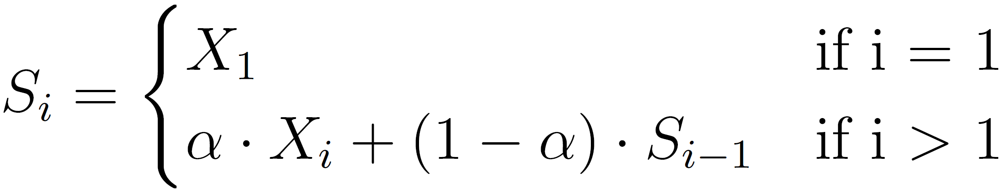

# {{ page.title | replace_first:'L','Lesson '}}
{: .no_toc }

## Table of Contents
{: .no_toc .text-delta }

1. TOC
{:toc}
---

<video autoplay loop muted playsinline style="margin:0px">
  <source src="assets/videos/MovingAverageFilterWindowSize10-Optimized.mp4" type="video/mp4" />
</video>

**Video** Smoothing an analog input signal using a moving average filter with window size of 10. The raw analog input is shown in blue; the smoothed data is shown in red. Graph made with the built-in [Arduino Serial Plotter](https://diyrobocars.com/2020/05/04/arduino-serial-plotter-the-missing-manual/).
{: fs-1}

<!-- TODO: insert video of me using Sharp with noise instead? -->

By now, you may have noticed that your analog input data can be noisy. How can we smooth our input and what factors should we consider?

This is a big, complex question. Indeed, there is an entire field called [digital signal processing](https://en.wikipedia.org/wiki/Digital_signal_processing) (DSP), which explores techniques to sample, smooth, or otherwise transform signals, like sensor data, into more usable forms. In signal processing, [filters](https://en.wikipedia.org/wiki/Filter_(signal_processing)) refer to algorithmic methods and/or hardware approaches to remove or attenuate unwanted components of a signal.

In this lesson, we will cover a class of digital filters called smoothing algorithms (aka **signal filters**), why they're helpful, and potential tradeoffs in their implementation and use.

---

**DIVE DEEPER:**

DSP is a vast, complex area but even simple signal processing techniques like those covered in this lesson are helpful. If you'd like to dive deeper into this topic, see our [Signal Processing](../signals/signal-processing.md) lessons, which introduce [quantization and sampling](../signals/quantization-and-sampling.md), [signal comparisons](../signals/comparing-signals.md), and [frequency analysis](../signals/frequency-analysis.md). For a more technical introduction to digital filters, see [Chapter 14: Introduction to Digital Filters](http://www.dspguide.com/ch14/1.htm) in Steven W. Smith's book [The Scientist and Engineer's Guide to Digital Signal Processing](http://www.dspguide.com/). We also recommend Jack Schaelder's [interactive primer on DSP](https://jackschaedler.github.io/circles-sines-signals/index.html).

 <!-- In fact, the moving average filter is the most common filter in DSP both because of its simplicity but also because it does a great job of reducing random noise (see [Chapter 15](http://www.dspguide.com/ch15.htm) of Smith's book)! -->

---

<!-- ## Digital Filters

There are two primary approaches to filtering a signal: **time domain** methods, where the x-axis is time and the y-axis is sensor data, and **frequency domain** methods that transform the signal such that the x-axis are the frequency components in the signal and the y-axis is the magnitude of those frequencies. You may have heard of low-pass or high-pass filters, which filter (keep) low frequency components of a signal or high frequency components of a signal, respectively. These filters are typically implemented in the frequency domain, and include  -->

<!-- methods, which are commonly used for smoothing, applying an offset (*e.g.,* DC removal) and **frequency domain** methods that analyze the frequency components of a signal to filter low-frequency -->

## Noisy input

When reading sensor data using analog input pins on a microcontroller (*e.g.,* via [`analogRead`](https://www.arduino.cc/reference/en/language/functions/analog-io/analogread/) on the Arduino), there are many sources of noise, including electromagnetic interference, mechanical noise (for electro-mechanical sensors like potentiometers), stray capacitance, unstable voltage sources, and/or [small imperfections in the ADC](https://www.analog.com/en/analog-dialogue/articles/adc-input-noise.html#).

For example, in the video below, we are **not** touching the potentiometer and yet the analog input is oscillating between 142 and 143 (0.694V and 0.699V)—shown as the blue line. You may have experienced this too in your own builds with potentiometers or even in our [Arduino potentiometer lesson](../arduino/potentiometers.md). In this case, we fixed this "input noise" by smoothing the signal using a moving average filter—shown in red.

<video autoplay loop muted playsinline style="margin:0px">
  <source src="assets/videos/PotentiometerOscillatingWithNoInputButFixedWithMovingAverage-Optimized.mp4" type="video/mp4" />
</video>
**Video** In this video, we're graphing the analog input from a potentiometer. Although we're not touching or using the potentiometer, the analog input is oscillating between 142 and 143 (0.694V and 0.699V). Read more about potentiometer noise [here](https://passive-components.eu/resistors-potentiometers-basic-principles/). Graph made with the built-in [Arduino Serial Plotter](https://diyrobocars.com/2020/05/04/arduino-serial-plotter-the-missing-manual/).
{: fs-1}

Rather than smoothing a potentiometer input signal with a digital filter (a software solution), we could, instead, use a hardware solution: add in a small ceramic capacitor (0.1µF or 0.47 µF) from the potentiometer wiper to ground.

However, the focus of this lesson is on software solutions.

<!-- TODO: video of sharpIR sensor -->

## Moving window filters

The most common and simplest to understand digital filters employ a moving window (or buffer) to smooth a signal in realtime. Some factors to consider:
- Window size
- Calculation on window

As each sensor and human- or environmental-interaction is unique, we encourage you to experiment with different smoothing approaches to achieve your desired behavior. Note that if you're **logging** data (*e.g.,* to a storage card or the cloud), it's often best to capture and transmit the **raw** data so that you can experiment with signal processing approaches post hoc. Once an ideal sampling frequency and, perhaps, filtering approach has been determined, you could integrate this into the deployed system (to save bandwidth, power, etc.).

### Weighted moving average

In the basic moving average algorithm, we assign equal weight to all data in our filter window. You could imagine implementations that more heavily weight data as a function of recency—that is, more recent data is likely more relevant and thus should be weighted more. This class of algorithms are called **weighted moving averages (WMA)** and include linear weighting schemes where weights drop off linearly in the filter window and exponential weighting schemes where weights drop off exponentially.

If a regular moving average is:

$$MA=\frac{X_{1} + X_{2} + \ldots + X_{N}}{N}$$

Then the weighted version is simply:

$$WMA=\frac{w_{1}X_{1} + w_{2}X_{2} + \ldots + w_{n}X_{n}}{w_{1} + w_{2} + \ldots + w_{n}}$$

If the weight coefficients are precomputed to sum to one ($$\sum_{i=1}^{n} w_{i} = 1$$), then the above equation simply becomes:

$$WMA=w_{1}X_{1} + w_{2}X_{2} + \ldots + w_{n}X_{n}$$

Below, we've included sample weights for both linear and exponential weighting schemes with a sliding window size of 15.

| Linear Weights | Exponential Weights |
|:----------------:|:-------------:|
|  |    |
| Linearly decreasing weights for window size 15 | Exponentially decreasing weights for window size 15|

**Figure.** Images from [Wikipedia](https://en.wikipedia.org/wiki/Moving_average).
{: fs-1 }

### Exponential moving average implementation
Interestingly, you can implement the exponential moving average (EMA)—also known as the exponentially weighted moving average (EWMA)—without storing a sliding window buffer.

The algorithm is simply:

$$
S_{i} =
\begin{cases}
    X_{1} & \text{if i = 1}\\
    \alpha \cdot X_{i} + (1 - \alpha) \cdot S_{i-1} & \text{if i $>$ 1}
\end{cases}
$$

{: .mx-auto .align-center }

Where:
- The coefficient $$\alpha$$ represents the degree of weighting decrease between 0 and 1. A higher $$\alpha$$ discounts older observations faster.
- $$X_{i}$$ is the value at index i.
- $$S_{i}$$ is the value of the EMA at index i.

And here's a version implemented for Arduino, which might make things more clear:


const int SENSOR_INPUT_PIN = A0;

float _ewmaAlpha = 0.1;  // the EWMA alpha value
double _ewma = 0;        // the EWMA result, initialized to zero

void setup()
{
  Serial.begin(9600); // for printing values to console
  _ewma = analogRead(SENSOR_INPUT_PIN);  //set EWMA for index 1
}

void loop()
{
  int sensorVal = analogRead(A0); // returns 0 - 1023 (due to 10 bit ADC)
  
  // Apply the EWMA formula 
  _ewma = (_ewmaAlpha * sensorVal) + (1 - _ewmaAlpha) * _ewma;

  Serial.print(sensorVal);      
  Serial.print(",");  
  Serial.println(_ewma);  
  delay(50); // Reading new values at ~20Hz
}


<!-- Equation written in: https://www.codecogs.com/latex/eqneditor.php -->
<!-- https://www.norwegiancreations.com/2015/10/tutorial-potentiometers-with-arduino-and-filtering/ -->
<!-- https://www.norwegiancreations.com/2016/08/double-exponential-moving-average-filter-speeding-up-the-ema/ -->

## Outline

- What is the problem
- Introduce digital signal processing
- Some potential approaches
- Moving average
- Moving weighted average (more recent values are weighted more)
    - Exponentially weighted moving average: https://hackaday.com/2019/09/06/sensor-filters-for-coders/
- Median filter
- Some general issues:
  - Latency (dependent on window size)
  - Beginning. How to initialize. Common solutions are to fill initial array with first value. 
  - How to organize filter around the data (middle, left, or right)
  - refer to numpy documentation here

## Arduino filtering libraries

We have not had a chance to evaluate all of these libraries. So, use at your own risk. :)

- [Kick Filter Library](https://github.com/LinnesLab/KickFilters), by [LinnesLab](https://github.com/LinnesLab) on GitHub. Here's the associated [IEEE publication](http://dx.doi.org/10.1109/EMBC.2018.8513356) from Linnes Lab's Kick LL smartwatch, a research device for measuring heart rate, respiration, and blood oxygen, which was the impetus for creating the library.
  
- [Arduino Filters](https://github.com/tttapa/Arduino-Filters), by [tttapa](https://github.com/tttapa) on GitHub

- [Microsmooth](https://github.com/AsheeshR/Microsmooth), by [asheeshr](https://github.com/asheeshr) on GitHub

- [Median Filter Library 2](https://github.com/warhog/Arduino-MedianFilter), by Luis Llamas based on [an article](https://www.embedded.com/better-than-average/) by Phil Ekstrom

## Resources

- [Signal Smoothing](https://www.mathworks.com/help/signal/ug/signal-smoothing.html), Mathworks.com
  
- [Arduino Simple High-pass, Band-pass, and Band-stop Filtering](https://www.norwegiancreations.com/2016/03/arduino-tutorial-simple-high-pass-band-pass-and-band-stop-filtering/), Norwegian Creations
  
- [Sensor Filters for Coders](https://hackaday.com/2019/09/06/sensor-filters-for-coders/), Hackaday

- [Moving Average](https://en.wikipedia.org/wiki/Moving_average), Wikipedia

- [Exponential Moving Average](https://tttapa.github.io/Pages/Mathematics/Systems-and-Control-Theory/Digital-filters/Exponential%20Moving%20Average/Exponential-Moving-Average.html), Pieter P

<!-- 
USEFUL LINKS:
https://www.alanzucconi.com/2016/06/03/an-introduction-to-signal-smoothing/ 

Median filtering:
https://cdnsciencepub.com/doi/pdf/10.1139/v95-195

https://pyageng.mpastell.com/book/dsp.html
https://terpconnect.umd.edu/~toh/spectrum/Smoothing.html
-->