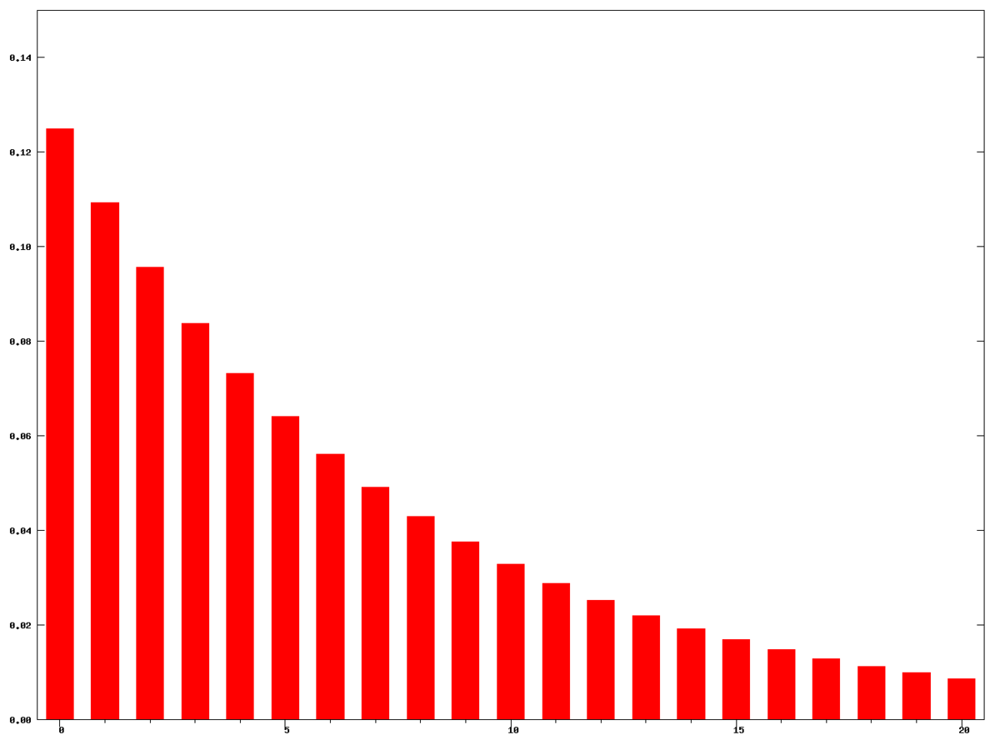
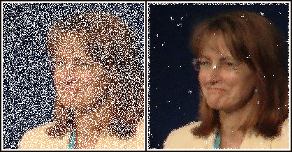
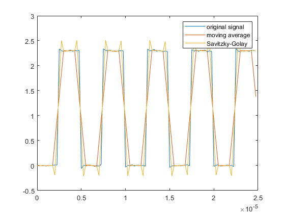
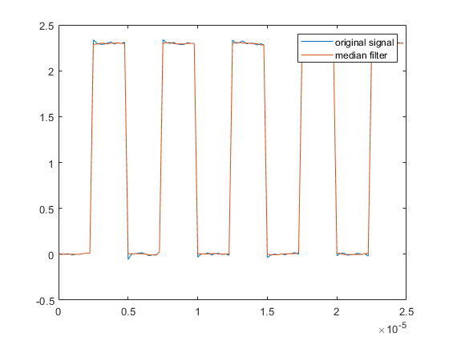

# {{ page.title | replace_first:'L','Lesson '}}
{: .no_toc }

## Table of Contents
{: .no_toc .text-delta }

1. TOC
{:toc}
---

By now, you may have noticed that your analog input data can be noisy. How can we smooth our input and what factors should we consider?

<video autoplay loop muted playsinline style="margin:0px">
  <source src="assets/videos/MovingAverageFilterWindowSize10-Optimized.mp4" type="video/mp4" />
</video>

**Video** Smoothing an analog input signal using a moving average filter with window size of 10. The raw analog input is shown in blue; the smoothed data is shown in red. Graph made with the built-in [Arduino Serial Plotter](https://diyrobocars.com/2020/05/04/arduino-serial-plotter-the-missing-manual/).
{: .fs-1 }

<!-- TODO: insert video of me using Sharp with noise instead? -->

This is a big, complex question. Indeed, there is an entire field called [digital signal processing](https://en.wikipedia.org/wiki/Digital_signal_processing) (DSP), which explores techniques to sample, smooth, or otherwise transform signals, like sensor data, into more usable forms. In signal processing, [filters](https://en.wikipedia.org/wiki/Filter_(signal_processing)) refer to algorithmic methods and/or hardware approaches to remove or attenuate unwanted components of a signal.

In this lesson, we will cover a class of digital filters called smoothing algorithms (aka **signal filters**), why they're helpful, and potential tradeoffs in their implementation and use.

---

**DIVE DEEPER:**

DSP is a vast, complex area but even simple signal processing techniques like those covered in this lesson are helpful. If you'd like to dive deeper into DSP, see our [Signal Processing](../signals/signal-processing.md) lessons, which introduce [quantization and sampling](../signals/quantization-and-sampling.md), [signal comparisons](../signals/comparing-signals.md), and [frequency analysis](../signals/frequency-analysis.md). For a more technical introduction to digital filters, see [Chapter 14: Introduction to Digital Filters](http://www.dspguide.com/ch14/1.htm) in Steven W. Smith's book [The Scientist and Engineer's Guide to Digital Signal Processing](http://www.dspguide.com/). We also recommend Jack Schaelder's [interactive primer on DSP](https://jackschaedler.github.io/circles-sines-signals/index.html).

 <!-- In fact, the moving average filter is the most common filter in DSP both because of its simplicity but also because it does a great job of reducing random noise (see [Chapter 15](http://www.dspguide.com/ch15.htm) of Smith's book)! -->

---

## Noisy input

When reading sensor data using analog input pins on a microcontroller (*e.g.,* via [`analogRead`](https://www.arduino.cc/reference/en/language/functions/analog-io/analogread/) on the Arduino), there are many sources of noise, including electromagnetic interference, sensor noise, mechanical noise (for electro-mechanical sensors like potentiometers), stray capacitance, unstable voltage sources, and/or [small imperfections in the ADC](https://www.analog.com/en/analog-dialogue/articles/adc-input-noise.html#). Oh my!

Even with a simple potentiometer, we can observe noise on our input pin. In the video below, we are **not** touching the potentiometer and yet the analog input is oscillating between 142 and 143 (0.694V and 0.699V)—shown as the blue line. You may have experienced this too in your own potentiometer-based projects or in the [Arduino potentiometer lesson](../arduino/potentiometers.md). In this case, we fixed this "input noise" by smoothing the signal using a moving average filter—shown in red—which we will describe in this lesson.

<video autoplay loop muted playsinline style="margin:0px">
  <source src="assets/videos/PotentiometerOscillatingWithNoInputButFixedWithMovingAverage-Optimized.mp4" type="video/mp4" />
</video>
**Video.** In this video, we're graphing the raw analog input (blue line) from a potentiometer along with a "smoothed" version (red line). Although we're not touching or using the potentiometer, the analog input is oscillating between 142 and 143 (0.694V and 0.699V). We smooth this noise using a moving average filter (window size = 10)—shown in red. Note that, depending on the oscillation pattern, a different window size or smoothing approach may be necessary. Read more about potentiometer noise [here](https://passive-components.eu/resistors-potentiometers-basic-principles/). Graph made with the built-in [Arduino Serial Plotter](https://diyrobocars.com/2020/05/04/arduino-serial-plotter-the-missing-manual/).
{: .fs-1 }

In addition to smoothing a potentiometer input signal with a digital filter (a software solution), we could, instead, use a hardware solution: add in a small ceramic capacitor (0.1µF or 0.47 µF) from the potentiometer wiper to ground. However, the focus of this lesson is on software solutions (putting the **digital** in DSP).

<!-- TODO: video of sharpIR sensor -->

<!-- ## Digital Filters

There are two primary approaches to filtering a signal: **time domain** methods, where the x-axis is time and the y-axis is sensor data, and **frequency domain** methods that transform the signal such that the x-axis are the frequency components in the signal and the y-axis is the magnitude of those frequencies. You may have heard of low-pass or high-pass filters, which filter (keep) low frequency components of a signal or high frequency components of a signal, respectively. These filters are typically implemented in the frequency domain, and include  -->

<!-- methods, which are commonly used for smoothing, applying an offset (*e.g.,* DC removal) and **frequency domain** methods that analyze the frequency components of a signal to filter low-frequency -->

## Moving window filters

The most common digital filters use a moving window (or buffer) to smooth a signal in realtime. Typically, **larger** window sizes result in a "smoother" but more distorted signal. Larger windows also incur "lag"—the filtered signal's responsiveness to changes in the raw signal—and require more storage and computation time.

As each sensor and physical computing project is unique, we encourage you to experiment with different smoothing algorithms and window sizes to achieve your desired behavior.

---

SPECIAL CASE: DATA LOGGING

Note that if you're **logging** data (*e.g.,* to a storage card or the cloud) for research or data experiments, it's often best to first capture and transmit the **raw** data so that you can experiment with signal processing approaches *post hoc* (*e.g.,* offline in Jupyter Notebook). Through offline analysis with these raw logs, you can determine an ideal sampling frequency and filtering approach for your particular hardware components and problem domain. Then, you can implement this approach in your field-deployed system, which can result in reduced computational overhead, bandwidth, power, *etc.*.

---

### Moving average filter

The most common filter in DSP is the **moving average filter** (or moving mean filter), which slides a window of size $$N$$ over a raw signal, computes the average over that window, and uses this average as the smoothed value. 

$$MA=\frac{X_{1} + X_{2} + \ldots + X_{N}}{N}$$

This filter is a type of **low-pass** filter because it smooths out (eliminates) the high frequency oscillations in the signal. 

You can control the filter's performance by tweaking the size of the sliding window. The animation below demonstrates a sliding window of size 3. The blue line corresponds to the raw input signal; the orange line, the smoothed filter output. For illustrative purposes, we only show the sliding window applied to a subset of data.

<video autoplay loop muted playsinline style="margin:0px">
  <source src="assets/videos/MovingAverageFilter_PowerPointAnimation_TrimmedAndCropped.mp4" type="video/mp4" />
</video>
**Video** This video illustrates a moving average filter of window size 3 over a subset of data. Animation made in PowerPoint.
{: .fs-1 }

<!-- As [Smith notes ](http://www.dspguide.com/ch15.htm):

> the moving average is the most common filter in DSP, mainly because it is the easiest digital filter to understand and use. In spite of its simplicity, the moving average filter is optimal for a common task: reducing random noise...
{: .fs-4 } -->

Despite its simplicity, a moving average filter often all you will need in your physical computing projects. This, of course, depends on your use context and the underlying sensors + circuit setup. Thus, we encourage you to play around with various smoothing approaches and tuning parameters. If you're sampling a sensor 20 times per second (~20Hz), then a window size of 10 will capture roughly 500ms of data. So, it may be useful to think in terms of time rather than samples.

Below, we compute three different moving average filter window sizes: 5, 10, and 20 and show the resulting filter output in red, green, and yellow, respectively.

<!-- The object-oriented filtering approach makes it easy to test and compare the effect of different window sizes on the filtered output. -->

<video autoplay loop muted playsinline style="margin:0px">
  <source src="assets/videos/MovingAverageWithThreeWindowSizes-Optimized.mp4" type="video/mp4" />
</video>
**Video** This video graphs raw analog input (blue) and filtered output from three different moving average window sizes: 5 (red line), 10 (green), and 20 (yellow). To produce this video, we used [this code](https://github.com/makeabilitylab/arduino/blob/master/Filters/MovingAverageFilterWindowSizeDemo/MovingAverageFilterWindowSizeDemo.ino) and the [Arduino Serial Plotter](https://diyrobocars.com/2020/05/04/arduino-serial-plotter-the-missing-manual/). You should [try it](https://github.com/makeabilitylab/arduino/blob/master/Filters/MovingAverageFilterWindowSizeDemo/MovingAverageFilterWindowSizeDemo.ino) yourself!
{: .fs-1 }

#### Arduino implementation

The official Arduino [signal smoothing tutorial](https://www.arduino.cc/en/Tutorial/BuiltInExamples/Smoothing) uses a moving average filter. Cleverly, their code uses an optimization (which we borrow below) to avoid iterating over the entire window to compute each new average. Instead, we simply subtract the least recent reading in our sliding window from a running total. The code also uses a [circular buffer](https://en.wikipedia.org/wiki/Circular_buffer) to eliminate needless memory allocations, which is important on constrained systems like microcontrollers.



// read the sensor value
int sensorVal = analogRead(SENSOR_INPUT_PIN);

// subtract the last reading from our sliding window
_sampleTotal = _sampleTotal - _samples[_curReadIndex];

// add in current reading to our sliding window
_samples[_curReadIndex] = sensorVal;

// add the reading to the total
_sampleTotal = _sampleTotal + _samples[_curReadIndex];

// calculate the average:
_sampleAvg = _sampleTotal / SMOOTHING_WINDOW_SIZE;

// advance to the next position in the array
_curReadIndex = _curReadIndex + 1;

// if we're at the end of the array...
if (_curReadIndex >= SMOOTHING_WINDOW_SIZE) {
  // ...wrap around to the beginning:
  _curReadIndex = 0;
}


#### Arduino code

Our full implementation:

#### Simple C++ class

Signal filtering is a perfect opportunity to create a class to hide complexity, avoid code redundancy, and handle data processing. In our [Makeability Lab Arduino Library](https://github.com/makeabilitylab/arduino/tree/master/MakeabilityLab_Arduino_Library/src), we created the [`MovingAveragefilter.hpp`](https://github.com/makeabilitylab/arduino/blob/master/MakeabilityLab_Arduino_Library/src/MovingAverageFilter.hpp) class, which simplifies using a moving average filter. But you could make your own, of course, or use [other libraries](#arduino-filtering-libraries.)

Here's a demonstration of how to use [`MovingAveragefilter.hpp`](https://github.com/makeabilitylab/arduino/blob/master/MakeabilityLab_Arduino_Library/src/MovingAverageFilter.hpp):

We also use the [`MovingAveragefilter.hpp`](https://github.com/makeabilitylab/arduino/blob/master/MakeabilityLab_Arduino_Library/src/MovingAverageFilter.hpp) class in our demonstration of various sliding window sizes on the moving average output ([code here](https://github.com/makeabilitylab/arduino/blob/master/Filters/MovingAverageFilterWindowSizeDemo/MovingAverageFilterWindowSizeDemo.ino)).

<!-- TODO: in future, make these libraries into template so we can have a native floating point version. Can use typdefs to "hide" template construction -->

### Weighted moving average

In the moving average algorithm above, we assign equal weight to all data in our filter window. You could imagine, however, designing an algorithm that assigns higher weights to more recent data (with the theory that recency correlates to relevancy). And, indeed, there are a class of algorithms called **weighted moving averages (WMA)** that do just this, including linear weighting schemes with weights that drop off linearly in the filter window and exponential weighting schemes where weights drop off exponentially.

Recall that a regular moving average is:

$$MA=\frac{X_{1} + X_{2} + \ldots + X_{N}}{N}$$

Then the weighted version is simply:

$$WMA=\frac{w_{1}X_{1} + w_{2}X_{2} + \ldots + w_{n}X_{n}}{w_{1} + w_{2} + \ldots + w_{n}}$$

If the weight coefficients are precomputed to sum to one ($$\sum_{i=1}^{n} w_{i} = 1$$), then the above equation simply becomes:

$$WMA=w_{1}X_{1} + w_{2}X_{2} + \ldots + w_{n}X_{n}$$

Below, we've included sample weights for both linear and exponential weighting schemes with a sliding window size of 15.

| Linear Weights | Exponential Weights |
|:----------------:|:-------------:|
|  |    |
| Linearly decreasing weights for window size 15 | Exponentially decreasing weights for window size 15|

**Figure.** Images from [Wikipedia](https://en.wikipedia.org/wiki/Moving_average).
{: fs-1 }

### Exponential moving average

Interestingly, you can implement the exponential moving average (EMA)—also known as the exponentially weighted moving average (EWMA)—without storing a sliding window buffer! This is a very cool optimization and means that you can achieve smoothing without the memory and computation overhead of many other "moving" filter techniques.

The algorithm is:

$$
S_{i} =
\begin{cases}
    X_{1} & \text{if i = 1}\\
    \alpha \cdot X_{i} + (1 - \alpha) \cdot S_{i-1} & \text{if i $>$ 1}
\end{cases}
$$

Where:
- The coefficient $$\alpha$$ represents the degree of weighting decrease between 0 and 1. A higher $$\alpha$$ discounts older observations faster.
- $$X_{i}$$ is the value at index i.
- $$S_{i}$$ is the value of the EMA at index i.

The coefficient $$\alpha$$ determines the exponential dropoff. A higher $$\alpha$$ weights more recent data more. For example, the video below shows EWMA performance with $$\alpha$$ equal to 0.5 (red line), 0.1 (green line), and 0.01 (yellow line). Notice how closely the $$\alpha=0.5$$ EWMA filter tracks the underlying raw signal whereas the $$\alpha=0.01$$ filter is quite distorted and lagged. The $$\alpha=0.1$$ filter may still be appropriate, depending on your needs. Again, it's up to you to experiment!

<video autoplay loop muted playsinline style="margin:0px">
  <source src="assets/videos/ExponentialMovingAverageFilter-ThreeAlphaValues-Optimized.mp4" type="video/mp4" />
</video>
**Video** This video shows EWMA performance with $$\alpha$$ equal to 0.5 (red line), 0.1 (green line), and 0.01 (yellow line). The code used to produce this video is [here](https://github.com/makeabilitylab/arduino/blob/master/Filters/EwmaFilterAlphaDemo/EwmaFilterAlphaDemo.ino). Graph made with the built-in [Arduino Serial Plotter](https://diyrobocars.com/2020/05/04/arduino-serial-plotter-the-missing-manual/).
{: .fs-1 }

#### Arduino EWMA implementation

If you're not used to reading equations, then perhaps the Arduino code below is more clear. The algorithm is quite straightforward and, again, unlike the traditional moving average algorithm, does not require a window buffer!


const int SENSOR_INPUT_PIN = A0;

float _ewmaAlpha = 0.1;  // the EWMA alpha value (α)
double _ewma = 0;        // the EWMA result (Si), initialized to zero

void setup()
{
  Serial.begin(9600); // for printing values to console
  _ewma = analogRead(SENSOR_INPUT_PIN);  //set EWMA (S1) for index 1
}

void loop()
{
  int sensorVal = analogRead(A0); // returns 0 - 1023 (due to 10 bit ADC)
  
  // Apply the EWMA formula 
  _ewma = (_ewmaAlpha * sensorVal) + (1 - _ewmaAlpha) * _ewma;

  Serial.print(sensorVal);      
  Serial.print(",");  
  Serial.println(_ewma);  
  delay(50); // Reading new values at ~20Hz
}


**Code.** [This code](https://github.com/makeabilitylab/arduino/blob/master/Filters/ExponentialWeightedMovingAverageFilter/ExponentialWeightedMovingAverageFilter.ino) is on GitHub.
{: .fs-1 }

<!-- Equation written in: https://www.codecogs.com/latex/eqneditor.php -->
<!-- https://www.norwegiancreations.com/2015/10/tutorial-potentiometers-with-arduino-and-filtering/ -->
<!-- https://www.norwegiancreations.com/2016/08/double-exponential-moving-average-filter-speeding-up-the-ema/ -->

### Moving median filter

A **moving median filter** is almost the exact same as a [moving average filter](#moving-average-filter) but takes the **median** over the sliding window rather than the average. 

<video autoplay loop muted playsinline style="margin:0px">
  <source src="assets/videos/MovingMedianFilter_PowerPointAnimation_TrimmedAndCropped.mp4" type="video/mp4" />
</video>
**Video** This video shows a moving median filter with a window size of three. Animation made in PowerPoint.
{: .fs-1 }

The challenge, however, is [calculating](https://en.wikipedia.org/wiki/Median_filter#Algorithm_implementation_issues) the median efficiently. The median is simply the *middle* value of a sorted array $$X_s$$ or, if the size of the array is odd, then it is the average of the *two* middle values.

$$
Med(X) =
\begin{cases}
    X_{s}
    \begin{bmatrix}
     \frac{n}{2}\\ 
    \end{bmatrix} & \text{if n is even}\\
     \frac{(X_{s}\begin{bmatrix}
       \frac{n-1}{2}\\ 
     \end{bmatrix} +
     \begin{bmatrix}
       \frac{n+1}{2}\\ 
     \end{bmatrix})}{2} & \text{if n is odd}
\end{cases}
$$

**Note:** The array $$X$$ must be sorted (indicated by the 's' subscript in $$X_s$$). The brackets in the equation above indicate indices, similar to arrays in programming.
{: .fs-1 }

But how can we obtain this "middle" value efficiently? We know that re-sorting an array on each value insert can be computationally expensive. Thus, typically realtime median filters use other data structures, like [indexable skiplists](https://en.wikipedia.org/wiki/Skip_list#Indexable_skiplist), to efficiently keep a sorted data structure on inserts and removals.

Similar to the moving average filter, we can tweak the moving median filter's performance by modifying the filter window size. Below, we show a moving median filter with window sizes 5, 11, and 21. For this video, we used our test code [MovingMedianFilterWindowSizeDemo.ino](https://github.com/makeabilitylab/arduino/blob/master/Filters/MovingMedianFilterWindowSizeDemo/MovingMedianFilterWindowSizeDemo.ino), which relies on Luis Llama's [Arduino Median Filter 2](https://github.com/warhog/Arduino-MedianFilter) library based on Phil Ekstrom's "[Better Than Average](https://www.embedded.com/better-than-average/)" article.

<video autoplay loop muted playsinline style="margin:0px">
  <source src="assets/videos/MovingMedianFilter-ThreeWindowSizes-TrimmedAndOptimized.mp4" type="video/mp4" />
</video>
**Video** This video shows moving median filter performance with window sizes 5, 11, and 21. Notice how a median filter tends to flatten "peaks" in the signal, which is unlike the other filters we've examined. To make this video, we used [this code](https://github.com/makeabilitylab/arduino/blob/master/Filters/MovingMedianFilterWindowSizeDemo/MovingMedianFilterWindowSizeDemo.ino) and the built-in [Arduino Serial Plotter](https://diyrobocars.com/2020/05/04/arduino-serial-plotter-the-missing-manual/).
{: .fs-1 }

### Why use a median filter?

Median filters are widely used in image processing to remove noise from images (image processing is its own subfield of signal processing focusing on 2D DSP techniques). Unlike mean (or average) filters, median filters remove noise while preserving edges—and edges are often a crucial part of other image processing algorithms like the [Canny edge detector](https://en.wikipedia.org/wiki/Canny_edge_detector).

{: .mx-auto .align-center }

**Figure**. Median filtering is widely used in image processing where it is particularly effective at removing "speckle" or "salt-and-pepper" noise while preserving edges. Image from [Wikipedia](https://en.wikipedia.org/wiki/Median_filter).
{: .fs-1 }

In the case of 1-dimensional signal processing, which we've focused on in this lesson, median filters have the same advantage: they provide a smoothing technique the preserves edges in our signal. For example, what if our data is from an underlying clock signal that should have sharp rising and falling edges, which we don't wish to smooth. A moving average filter distorts *rise* and *fall* times while the median filter sharpens them.

| Moving Average Filter | Moving Median Filter |
|:----------------:|:-------------:|
|  |    |
| The moving average filter distorts the rising and falling edges of the clock signal | The median filter both smooths the signal and crispens the clock transition edges |

**Figure.** Images from [MathWorks](https://www.mathworks.com/help/signal/ug/signal-smoothing.html).
{: .fs-1 }

## Other filters

In this lesson, we covered only a few basic digital filters but many others exist—some which allow you to actually control which frequencies in your signal to eliminate. For example, high-pass filters can remove specific low-frequency components from your signal while keeping high frequencies, low-pass filters eliminate high-frequency components while keeping low frequencies, bandpass filters let you specify a *range* (or band) of frequencies to keep, *etc.*  

Other popular filters include the [Savitzky-Golay filter](https://en.wikipedia.org/wiki/Savitzky%E2%80%93Golay_filter), the [Butterworth filter](https://en.wikipedia.org/wiki/Butterworth_filter), and the [Kalman filter](https://en.wikipedia.org/wiki/Kalman_filter). The [Savitzky-Golay filter](https://en.wikipedia.org/wiki/Savitzky%E2%80%93Golay_filter), for example, is like a weighted moving average filter that attempts to fit a polynomial over the sliding window (to better fit the underlying signal)—see this [MathWorks article](https://www.mathworks.com/help/signal/ug/signal-smoothing.html#SignalSmoothingExample-7).

In general, it is **not** helpful or appropriate to perform filtering investigations in real-time on sensor data because it's difficult to replicate input signals and test and compare filtering algorithms. Yes, it's fine to experiment with filters+real-time data for gut checking or to get something working quickly but not for more deep signal analysis.

Thus, if you're interested in this area, we suggest experimenting with the filters in [SciPy](https://docs.scipy.org/doc/scipy/reference/signal.html) with [Jupyter Notebook](https://jupyter.org/). You should log the sensor data to your computer and then analyze it "offline" in a testbed environment, as we do in our [Step Tracker](../signals/StepTracker/index.html) and [Gesture Recognition](../signals/gesturerec/shapebased/index.html) assignments. This will allow you to experiment with and compare different algorithm approaches and parameter tuning.

<!-- ### Considerations

TODO in future: 
- startup time
- how window is applied around data...
- centered moving average: https://www.alanzucconi.com/2016/06/03/an-introduction-to-signal-smoothing/ -->

<!-- ## Outline

- What is the problem
- Introduce digital signal processing
- Some potential approaches
- Moving average
- Moving weighted average (more recent values are weighted more)
    - Exponentially weighted moving average: https://hackaday.com/2019/09/06/sensor-filters-for-coders/
- Median filter
- Some general issues:
  - Latency (dependent on window size)
  - Beginning. How to initialize. Common solutions are to fill initial array with first value. 
  - How to organize filter around the data (middle, left, or right)
  - refer to numpy documentation here -->

## Activity

For your prototyping activity, we would like you to choose a sensor from your hardware kits—it could be a [potentiometer](../arduino/potentiometers.md), a [hall effect sensor](../sensors/hall-effect.md), a [force-sensitive resistor](../arduino/force-sensitive-resistors.md), a [photoresistor](../sensors/photoresistors.md), an [accelerometer](../sensors/accelerometers.md), a DIY sensor, *etc.*—and **two** different smoothing algorithms to apply to it.

More specifically, build an appropriate circuit for your sensor, read the input on an analog input pin, process this input with two different smoothing algorithms (either those we covered in this lesson or beyond), graph the three signals (raw signal, smoothing algorithm 1 output, smoothing algorithm 2 output), record a video of your input + the graphs, and report on your observations in the prototyping journal. Include a link to your video (or an embedded animated gif).

## Arduino filtering libraries

There are lots of Arduino filtering libraries online and general C++ filtering code that could be adapted to the Arduino context. The usual disclaimers apply: we have not had a chance to evaluate all of these libraries. So, use at your own risk. :)

- [Kick Filter Library](https://github.com/LinnesLab/KickFilters), by [LinnesLab](https://github.com/LinnesLab) on GitHub. Here's the associated [IEEE publication](http://dx.doi.org/10.1109/EMBC.2018.8513356) from Linnes Lab's Kick LL smartwatch, a research device for measuring heart rate, respiration, and blood oxygen, which was the impetus for creating the library.
  
- [Arduino Filters](https://github.com/tttapa/Arduino-Filters), by [tttapa](https://github.com/tttapa) on GitHub

- [Microsmooth](https://github.com/AsheeshR/Microsmooth), by [asheeshr](https://github.com/asheeshr) on GitHub

- [Median Filter Library 2](https://github.com/warhog/Arduino-MedianFilter), by Luis Llamas based on [an article](https://www.embedded.com/better-than-average/) by Phil Ekstrom

- [Moving Average Filter](https://github.com/makeabilitylab/arduino/blob/master/Filters/MovingAverageFilter/MovingAverageFilter.ino) by the [Makeability Lab](https://github.com/makeabilitylab)

## Resources

- [Signal Smoothing](https://www.mathworks.com/help/signal/ug/signal-smoothing.html), Mathworks.com
  
- [Arduino Simple High-pass, Band-pass, and Band-stop Filtering](https://www.norwegiancreations.com/2016/03/arduino-tutorial-simple-high-pass-band-pass-and-band-stop-filtering/), Norwegian Creations
  
- [Sensor Filters for Coders](https://hackaday.com/2019/09/06/sensor-filters-for-coders/), Hackaday

- [Moving Average](https://en.wikipedia.org/wiki/Moving_average), Wikipedia

- [Exponential Moving Average](https://tttapa.github.io/Pages/Mathematics/Systems-and-Control-Theory/Digital-filters/Exponential%20Moving%20Average/Exponential-Moving-Average.html), Pieter P

<!-- 
USEFUL LINKS:
https://www.alanzucconi.com/2016/06/03/an-introduction-to-signal-smoothing/ 

Median filtering:
https://cdnsciencepub.com/doi/pdf/10.1139/v95-195

https://pyageng.mpastell.com/book/dsp.html
https://terpconnect.umd.edu/~toh/spectrum/Smoothing.html
-->