# {{ page.title | replace_first:'L','Lesson '}}
{: .no_toc }

## Table of Contents
{: .no_toc .text-delta }

1. TOC
{:toc}
---

<!-- TODO: have hero video showing the vibration motor working -->

In the previous three lessons, every output device we used had built-in intelligence—the [OLED](oled.md) had an SSD1306 display controller, [addressable LEDs](addressable-leds.md) had WS2812B driver chips, and [servos](servo.md) had an internal feedback circuit. In each case, a library handled the communication protocol and we wired up just 3-4 wires. In this lesson, we're working with something much simpler: a **raw DC motor**. There's no driver chip, no library, and no built-in smarts—and that changes everything about how we wire it up.

Haptic or tactile actuator technology provides feedback to the user **via touch** through force, motion, or temperature. In this lesson, we will learn about vibration motors, which are commonly used to provide haptic feedback in game controllers, mobile phones, and smartwatches.

{: .note }
> **In this lesson, you will learn:**
> - What haptic feedback is and why vibration motors are the most common haptic actuators
> - The difference between eccentric rotating mass (ERM) motors and linear resonant actuators (LRAs)
> - The physics behind ERM vibration: how frequency and amplitude relate to voltage
> - Why you cannot drive an ERM motor directly from an Arduino GPIO pin
> - How to use an NPN transistor as a switch to safely control higher-current loads
> - Why motors need a flyback diode and how to calculate a base resistor value
> - How to use PWM through a transistor to control vibration intensity
> - How to design distinct haptic patterns that communicate information through touch

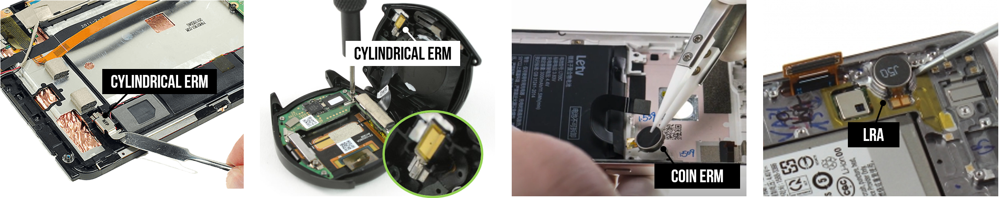
**Figure.** Examples of *eccentric rotating mass (ERM)* motors and *linear resonant actuators (LRA)* in mobile phones and watches. Images from [NFP Motors](https://youtu.be/k1iTLqAtd0U) and [Sosav](https://www.sosav.com/guides/mobiles/samsung/galaxy-s10/vibrator/).
{: .fs-1 }

## Materials

You will need the following materials for this lesson:

| Arduino | Coin ERM Motor | NPN Transistor | 1KΩ Resistor | 1N4001 Diode |
|:-----:|:-----:|:-----:|:-----:|:-----:|
|  | 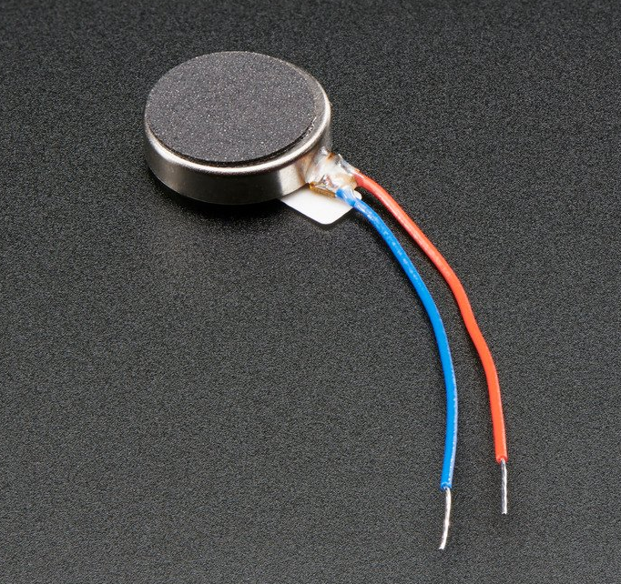 |  |  |  |
| Arduino Uno, Leonardo, or similar | [Adafruit Vibrating Mini Motor Disc](https://www.adafruit.com/product/1201) | [PN2222A](https://www.adafruit.com/product/756) NPN BJT | 1KΩ Resistor | [1N4001](https://www.digikey.com/en/products/detail/onsemi/1N4001/458986) Flyback Diode |

You will also need jumper wires and a breadboard. A small ceramic capacitor (0.1µF) is optional but recommended for filtering motor noise.

## Vibromotors

<!-- https://www.fictiv.com/articles/intro-to-haptic-technology-vibration-motors -->

There are two common types of vibration motors: **eccentric rotating mass (ERM)** motors that have a small unbalanced mass attached to the DC motor axle that creates a displacement force when rotating, and **linear resonant actuators (LRAs)** that contain a small internal mass attached to a spring, which vibrates in a reciprocating linear motion with an applied AC signal. ERMs vibrate along two axes while LRAs are single-axis vibrators. We will be using ERM motors in this lesson. The video excerpt below from [Precision Microdrives](https://vimeo.com/132533086) shows how ERMs and LRAs vibrate.

<video autoplay loop muted playsinline style="margin:0px" aria-label="Video comparing ERM and LRA vibration motors side by side, showing how the ERM spins an unbalanced mass while the LRA moves a mass linearly on a spring">
  <source src="assets/videos/PrecisionMicrodrives_ERMvsLRAMotors_Optimized.mp4" type="video/mp4" />
</video>
**Video.** A [video](https://vimeo.com/132533086) from Precision Microdrives showing the two most common types of vibration motors: eccentric rotating mass (ERM) motors and linear resonant actuators (LRA). ERM motors vibrate in two directions due to the centripetal force of the unbalanced mass attached to the DC motor axle. LRAs are similar in design to speakers: they use a magnetic voice coil to move a mass linearly against a spring.
{: .fs-1 }

**ERMs** are built with DC motors and an off-centered mass: they are cheap, provide a strong vibration, and are pervasive in toys, game controllers, mobile phones, and watches; however, they have a comparatively long startup time (~20-30ms) and limited controllability. For ERMs, you cannot individually control the frequency of the vibration (*i.e.,* how fast the mass is spinning) and the amplitude of that vibration—they are tied together. As the applied DC voltage increases, the frequency and amplitude of the vibration both increase, which is perceived as an increase in overall vibration intensity. 

In contrast to ERMs, **LRAs** do not spin. They linearly move a mass (up and down) attached to a spring using a [magnetic voice coil](https://en.wikipedia.org/wiki/Voice_coil). LRAs require a smooth sine wave voltage signal (aka an AC signal) driven at specific resonant frequencies—usually 150-200Hz—which controls how often the mass moves and, therefore, the vibration oscillation. They are increasingly common in smartphones, watches, and trackpads to mimic the feeling of a click. For example, newer Apple MacBooks and iPhones feature the [Apple Taptic Engine](https://www.ifixit.com/News/16768/apple-taptic-engine-haptic-feedback), which uses LRA technology. While LRAs are more responsive than ERMs (~15-25ms startup times), their vibration strength is more minimal and the wiring circuitry more complicated. Moreover, their vibration frequency is strongest at a single frequency (the resonant frequency).

If a vibromotor is fully enclosed in a shell, you cannot necessarily tell whether it is ERM or LRA even though the technologies are fundamentally different. Below, we are showing "coin" (or "pancake") form factors of both ERM and LRA.

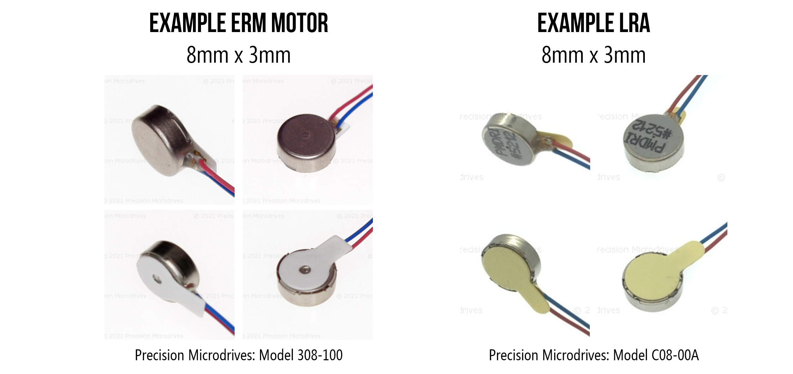
**Figure.** Depending on their enclosure and form factor, some ERMs and LRAs can look similar even though they are fundamentally different technologies. They require different driver circuits and actuation methods (DC for ERM and AC for LRA). Images from [Precision Microdrives](https://www.precisionmicrodrives.com/).
{: .fs-1 }

<!-- Nice resource for comparing ERM vs LRA: https://www.precisionmicrodrives.com/content/ab-028-vibration-motor-comparison-guide/ -->

### Eccentric Rotating Mass (ERM) Motors

Eccentric rotating mass (ERM) motors have an unbalanced mass attached to their axle. When the ERM motor spins, the rotating mass's centripetal force causes displacement. By attaching an ERM to an object—like a smartphone or game controller—the rotating irregular mass causes the motor and attached device to shake. The larger the object, the more force is needed to modulate the vibration onto the object. 

<video autoplay loop muted playsinline style="margin:0px" aria-label="Video from Precision Microdrives demonstrating how an ERM motor works by spinning an asymmetric mass on its axle to create vibration">
  <source src="assets/videos/PrecisionMicrodrives_HowDoVibrationMotorsWork_ERM-OverviewOptimized.mp4" type="video/mp4" />
</video>
**Video.** A [video](https://vimeo.com/128603396) from [Precision Microdrives](https://www.precisionmicrodrives.com/vibration-motors/) demonstrating how eccentric rotating mass (ERM) motors work. The idea is quite simple: attach an asymmetric or unbalanced mass to the DC motor's axle. When it rotates, the weight shifts, causing a vibration.
{: .fs-1 }

#### Vibration frequency and amplitude

There are two main characteristics of a vibration: the vibration **frequency**, which is how fast the mass is spinning, and the vibration **amplitude**, which is the strength of the vibration force. For ERM motors, you *cannot* vary the vibration frequency and amplitude independently—both increase with the applied voltage.

DC motors spin at a rate proportional to the applied voltage. We measure "spin rate" in revolutions per minute (RPM); however, we measure vibration frequency in Hz (cycles per second). So, to convert RPM to the vibration frequency $$V_F$$ in Hz, we simply divide by 60: 

$$
V_F = \frac{RPM}{60}
$$

The strength of the force generated by the ERM motor is:

$$
F = m \cdot r \cdot \omega^2
$$

Where $$F$$ is the centripetal force in Newtons (N), $$m$$ is the mass of the eccentric weight (in kg), $$r$$ is the distance from the motor shaft to the center of the eccentric mass (in meters), and $$\omega$$ is the angular velocity in radians/second (*i.e.,* the speed of the motor).

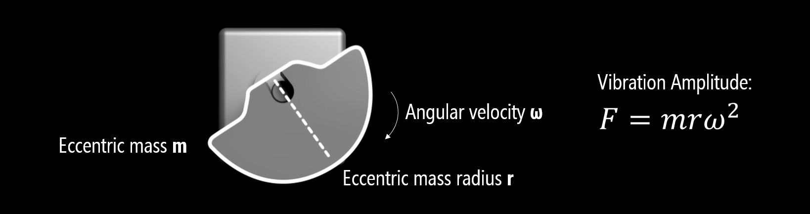
**Figure.** The strength of the force generated by the ERM motor is: $$F = m \cdot r \cdot \omega^2$$ where $$F$$ is the centripetal force in Newtons (N), $$m$$ is the mass of the eccentric weight (in kg), $$r$$ is the distance from the shaft to the center of the eccentric mass (in meters), and $$\omega$$ is the angular velocity in radians/second. Image based on [video](https://vimeo.com/128603396) from Precision Microdrives.
{: .fs-1 }

{: .note }
> Because the force depends on $$\omega^2$$, the relationship between motor speed and vibration amplitude is **not** linear—it's quadratic. A small increase in speed produces a proportionally larger increase in force. However, since motor speed itself is roughly proportional to applied voltage, the *perceived* relationship between voltage and vibration intensity feels approximately linear to the user.

When attached to an object, the vibration amplitude is also affected by the size of that object. This should make intuitive sense. For example, the small ERM motor in your mobile phone (used for alerts and notifications) would not cause much displacement when attached to a larger object like a laptop or an office desk. If you know the size of the target object, you can use this to inform the size and operating characteristics of your ERM motor.

<video autoplay loop muted playsinline style="margin:0px" aria-label="Video showing how the same ERM motor vibrates more visibly when attached to a small mass versus a large mass">
  <source src="assets/videos/PrecisionMicrodrives_HowDoVibrationMotorsWork_ERM-VibrationAmplitudeOptimized.mp4" type="video/mp4" />
</video>
**Video.** An ERM's vibration amplitude is not just a function of motor speed and eccentric mass size but also the size of the attached object. A larger object requires more force to vibrate. Notice how the vibration displacement is greater with the smaller attached mass compared to the larger attached mass. Video from [Precision Microdrives](https://www.precisionmicrodrives.com/vibration-motors/).
{: .fs-1 }

<!-- TODO: in future talk about other characteristics like startup time, stop time, etc. -->

#### ERM form factors

There are a variety of ERM form factors—see the figure below—from the basic cylindrical "pager" motor, which can be mounted directly to a PCB, to fully encapsulated waterproof versions, to the popular coin or "pancake" forms. The coin ERMs are compact, easy to use, and come with strong adhesive backing for mounting. Don't be confused: many LRAs also come in a coin form factor but are fundamentally different technology.

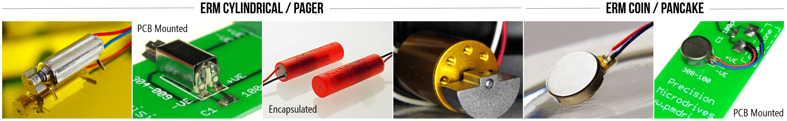
**Figure.** Example ERM motors, including the cylindrical (or pager) ERM and the coin or pancake ERM. Images from [Precision Microdrives](https://www.precisionmicrodrives.com/vibration-motors/vibration-motors-erms-and-lras/).
{: .fs-1 }

#### Example ERM motors

Below, we've highlighted example ERM motors from a popular supplier: [Precision Microdrives](https://www.precisionmicrodrives.com/). For each ERM motor, we include the body diameter and length, the eccentric mass radius and length, the operating voltage and current, and the motor speed and vibration frequency at that voltage/current. We specifically selected small ERMs that are common in handheld devices, but they can get much larger.

Because vibration amplitude is dependent not just on the speed of the ERM motor and the size of its eccentric mass but also the size of the affixed target object (*e.g.,* smartphone or watch), vibromotor datasheets often quote a "normalized vibration amplitude", which is the ERM's motor performance at its rated voltage when attached to a fixed mass. The Precision Microdrive datasheets, for example, use a fixed mass of 100g to calculate a normalized vibration amplitude for its motors.

| Model | Body Diameter | Body Length | Eccentric Weight Radius | Eccentric Weight Length | Operating Voltage | Operating Current | Motor Speed | Vibration Frequency | Normalized Amplitude |
|---|---|---|---|---|---|---|---|---|---|
| [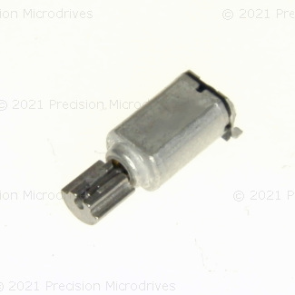](https://www.precisionmicrodrives.com/product/304-015-4mm-vibration-motor-7mm-type) | 4.1mm | 6.8mm | 1.4mm | 3mm | 2.5V | 25mA | 11,000 rpm | 183 Hz | 0.25G |
| [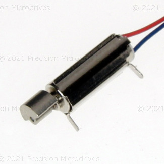](https://www.precisionmicrodrives.com/product/304-005-002-5mm-vibration-motor-11mm-type) | 4.5mm | 11mm | 2mm | 3mm | 1.5V | 17mA | 9,100 rpm | 152 Hz | 0.4G |
| [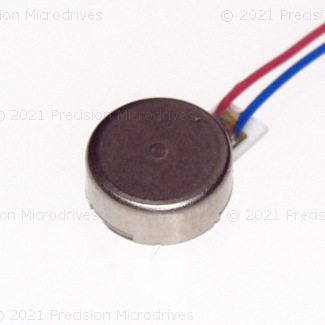](https://www.precisionmicrodrives.com/product/308-100-8mm-vibration-motor-3mm-type) | 8mm | 3.4mm | -- | -- | 3V | 66mA | 12,500 rpm | 208 Hz | 1.13G |
| [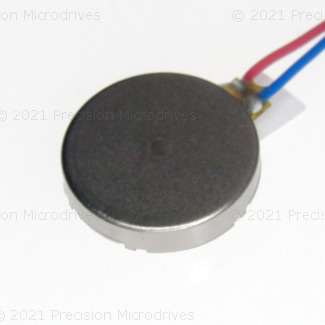](https://www.precisionmicrodrives.com/product/310-118-001-10mm-vibration-motor-2mm-type) | 10mm | 2.1mm | -- | -- | 3V | 60mA | 14,000 rpm | 233 Hz | 1.1G |
| [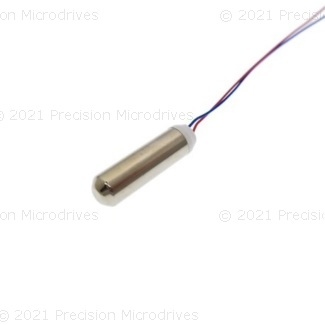](https://www.precisionmicrodrives.com/product/306-10h-7mm-vibration-motor-25mm-type) | 7mm | 24.5mm | -- | -- | 3V | 50mA | 13,800 rpm | 230 Hz | 1.84G |
| [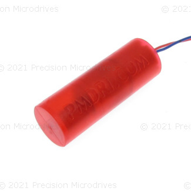](https://www.precisionmicrodrives.com/product/307-103-9mm-vibration-motor-25mm-type) | 8.7mm | 25.1mm | -- | -- | 3V | 100mA | 13,800 rpm | 230 Hz | 7G |
| [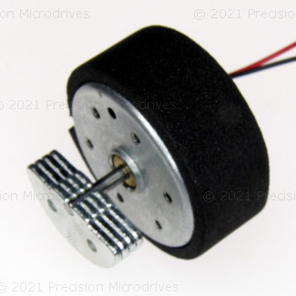](https://www.precisionmicrodrives.com/product/324-401-24mm-vibration-motor-13mm-type) | 24.3mm | 12.5mm | 9mm | 4.8mm | 12V | 148mA | 5,500 rpm | 92 Hz | 13G |
{: .vibro-table }

<!-- | [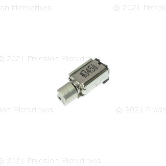](https://www.precisionmicrodrives.com/product/304-10k-4mm-vibration-motor-6mm-type) | 4.4mm | 6mm | 1.7mm | 2.8mm | 2.7V | 65mA | 13,500 rpm | 0.5G | -->
<!-- | [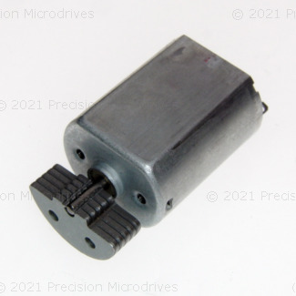](https://www.precisionmicrodrives.com/product/320-105-20mm-vibration-motor-25mm-type) | 20.4mm | 25mm | 9mm | 5.9mm | 3V | 413mA | 6,100 rpm | 15.9G | -->

<!-- - https://e2e.ti.com/blogs_/b/analogwire/posts/how-to-improve-the-startup-and-stop-behavior-of-erm-and-lra-actuators
- https://www.vibrationmotors.com/vibration-motor-product-guide/coin-vibration-motor/
- https://www.precisionmicrodrives.com/vibration-motors/ -->

#### Coin vibration ERM motors

In our [teaching hardware kits](../index.md/#example-hardware-kits), we often supply ERM motors in the coin form factor. These motors are also called pancake ERMs or vibrating mini-motor discs. Coin ERMs are compact, self-contained, and provide a strong vibration. Due to their small size, ease of use, and fully enclosed vibration mechanism, they are common in mobile phones, handheld devices (*e.g.,* controllers), and medical applications.

| Adafruit "Vibrating Mini-motor Disc" | Digikey ERM Vibration Motor |
|:---:|:---:|
|  | 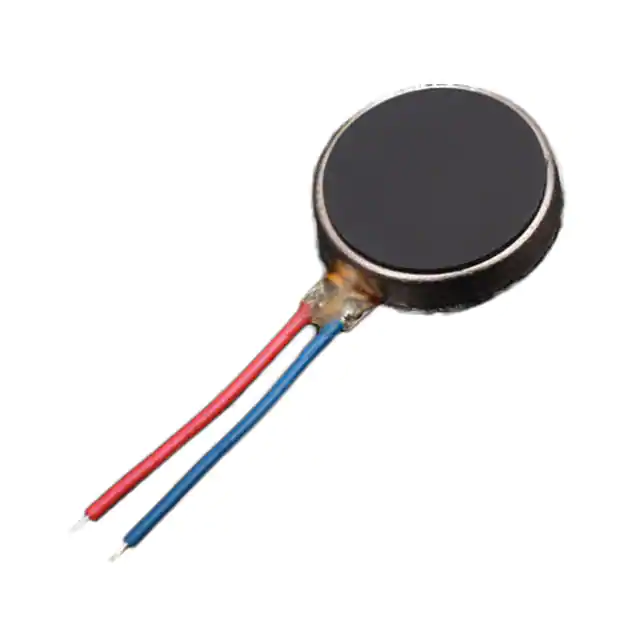 |
| [Product #1201](https://www.adafruit.com/product/1201) $1.95 | [Product #316040001](https://www.digikey.com/en/products/detail/seeed-technology-co.,-ltd/316040001/5487672) $1.20 |

Coin vibration motors are ERMs and generally have the same operating and functional characteristics as their cylindrical counterparts; however, their construction is different. See the video below. You can read about their construction on the [Precision Microdrives](https://www.precisionmicrodrives.com/vibration-motors/coin-vibration-motors/) website.

<video autoplay loop muted playsinline style="margin:0px" aria-label="Video showing the inside of a coin ERM motor with the cover removed, revealing the flat coil and eccentric weight mechanism">
  <source src="assets/videos/CoinVibromotor_HowAMobilePhoneVibrationMotorLooksAndWorks_TrimmedOptimized.mp4" type="video/mp4" />
</video>
**Video.** A demonstration of an opened coin ERM from [Tech Vision](https://youtu.be/iwEGqBpYaqc). There is another [great video](https://youtu.be/lp7bwXXsVl8?t=537) looking at a coin ERM with a microscope by Marty Jopson.
{: .fs-1 }

<!-- - https://www.precisionmicrodrives.com/vibration-motors/coin-vibration-motors/
- https://nfpmotor.com/products-coin-vibration-motors.html
- https://www.androidpolice.com/2020/10/20/a-lot-more-goes-into-good-smartphone-haptics-than-youd-think/ -->

<!-- ### LRAs

Some helpful links:

- https://www.vibrationmotors.com/vibration-motor-product-guide/linear-resonant-actuator/
- https://www.precisionmicrodrives.com/vibration-motors/linear-resonant-actuators-lras/
- https://www.nfpmotor.com/products-linear-resonant-actuators-lras.html

LRAs are in iPhones since iPhone7: https://www.boreas.ca/blogs/piezo-haptics/last-decade-haptics-in-mobile-erm-to-lra-and-the-taptic-engine 

LRA Motors

| Model | Body Diameter | Body Length | Voltage (RMS) | Operating Current | Vibration Frequency | Amplitude |
|---|---|---|---|---|---|---|
| [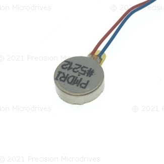](https://www.precisionmicrodrives.com/product/c08-00a-8mm-linear-resonant-actuator-3mm-type) | 8mm | 2.6mm | 1.2V | 28mA | 240Hz | 0.7G |
| [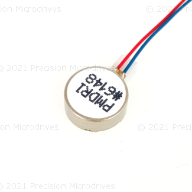](https://www.precisionmicrodrives.com/product/c10-100-10mm-linear-resonant-actuator-4mm-type) | 10mm | 3.7mm | 2V | 69mA | 175Hz | 1.5G |
| [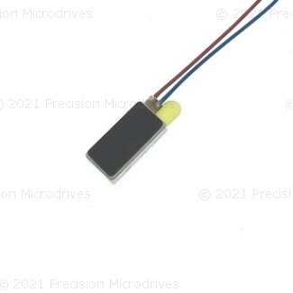](https://www.precisionmicrodrives.com/product/c12-003-001-6mm-linear-resonant-actuator-12mm-type) | 6mm | 12mm | 2V | 111mA | 204Hz | 1.5G |
{: .vibro-table } -->

<!-- | [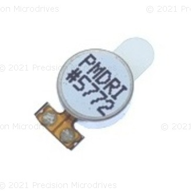](https://www.precisionmicrodrives.com/product/c08-00a-003-8mm-linear-resonant-actuator-3mm-type) | 8mm | 2.6mm | 1.2V | 28mA | 240Hz | 0.7G | -->

<!-- Really neat inside-a-LRA demo: https://youtu.be/Nz3Z2XQZpJs?t=198 -->

<!-- Amazing LRA video of the Samsung S10 LRA: https://youtu.be/gOBhQRVmLsA -->

## Wiring ERM motors with Arduino

Many online tutorials and YouTube videos show ERM motors directly hooked up to Arduino GPIO pins—using wirings similar to how we connect [LEDs](../arduino/led-blink.md). For a quick bench test with a tiny coin motor, this *can* work. However, it's risky and not recommended for anything beyond a momentary test.

Why? Arduino GPIO pins can supply a [maximum of 40mA](https://www.arduino.cc/en/reference/board) per pin with a safe continuous current of 20mA. This is sufficient for LEDs with current-limiting resistors but not for motors. In the table [above](#example-erm-motors), most ERM motors have operating currents of 50mA or beyond. Moreover, as electromechanical devices, ERMs require a higher startup current to initiate motor movement from rest (due to inertia). The [coin ERM sold](https://www.adafruit.com/product/1201) by Adafruit has an operating current of 75mA and a startup current of up to 120mA—both well beyond the safe limit.

So, what do we do? We use a **transistor** as a switch. The Arduino sends a small control signal to the transistor, and the transistor connects the motor to a separate power supply (the 3.3V or 5V pin) that can handle the current.

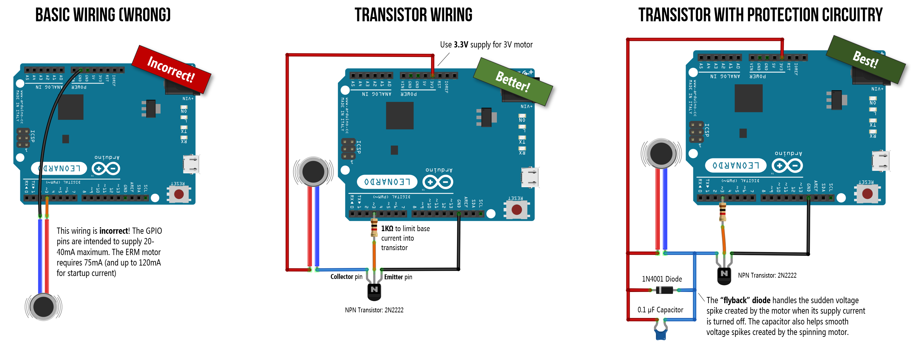
**Figure.** Three example wirings for hooking up ERM motors to your Arduino. The incorrect wiring on the left directly connects the ERM to GPIO Pin 3 (using a similar wiring as we did with [LEDs](../arduino/led-blink.md)). This is wrong and could damage your Arduino—GPIO pins can only supply up to 40mA of current but the ERM motor requires 75mA with a startup current of up to 120mA. The other two wirings use transistors as switches to connect the ERM motors to the 3.3V and 5V supply pins. You can right-click on this image and select "Open Image in a New Tab" to enlarge. See also this "[How to Build a Vibration Motor Circuit](http://www.learningaboutelectronics.com/Articles/Vibration-motor-circuit.php)" by Learning about Electronics.
{: .fs-1 }

{: .warning }
> **Fragile wires!** The two wires on the Adafruit coin ERMs are extremely fragile and can easily break or snap off their solder joints. Handle them gently, avoid bending the wires near the solder point, and consider securing them with a small dab of hot glue after wiring.

<!-- TODO: in future, include figure showing how with red and blue wires reversed, simply reverses direction of motor -->

### Transistors

<!-- The invention of the transistor in 1947 marked the beginning of the [computing revolution](https://en.wikipedia.org/wiki/History_of_computing_hardware_(1960s%E2%80%93present)#Third_generation), allowing electrical circuits to rapidly switch off (`0`) and on (`1`) to create [logic gates](https://en.wikipedia.org/wiki/Logic_gate), [accumulators](https://en.wikipedia.org/wiki/Accumulator_(computing)), and other computational building blocks. Before transistors, computers used [vacuum tubes](https://en.wikipedia.org/wiki/Vacuum_tube_computer), which were slower, less robust, much larger, and required significantly more power.

TODO: insert picture of variety of transistors -->

[Transistors](https://en.wikipedia.org/wiki/Transistor) are semiconductor devices used to **amplify** or **switch** electronic signals. They are the basic building blocks of computers and used in almost every modern electronic device from smartphones to headphone amplifiers. Transistors come in a variety of shapes, sizes, and operating specifications. There are two common designs: [**BJTs**](https://en.wikipedia.org/wiki/Bipolar_junction_transistor) (Bipolar Junction Transistors), which we'll use in this lesson, and [**MOSFETs**](https://en.wikipedia.org/wiki/MOSFET) (Metal-Oxide Semiconductor Field Effect Transistors), which are better suited for higher-current loads.

There are two primary "form factors" or packages for transistors: [TO-92](https://en.wikipedia.org/wiki/TO-92) packages and [TO-220](https://en.wikipedia.org/wiki/TO-220) packages; the latter is more common for higher-current loads due to the built-in heat sinks. You can find both BJT and MOSFET transistors in either package type and we've included examples of each below.

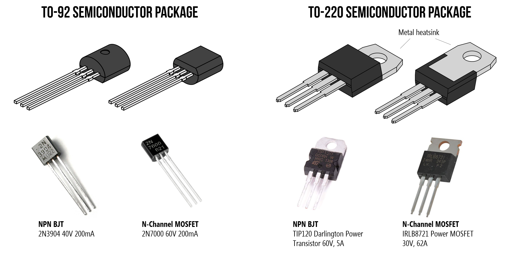
**Figure.** There are two primary "form factors" or packages for transistors: [TO-92](https://en.wikipedia.org/wiki/TO-92) packages and [TO-220](https://en.wikipedia.org/wiki/TO-220) packages. You can find both BJT and MOSFET transistors in either package type. Shown above: the [2N3904](https://www.sparkfun.com/datasheets/Components/2N3904.pdf) NPN BJT and [2N7000](https://www.onsemi.com/products/discretes-drivers/mosfets/2n7000) N-Channel MOSFET with TO-92 packaging, and the [TIP120](https://components101.com/transistors/tip120-pinout-datasheet-equivalent) NPN BJT and [IRLB8721](https://cdn-shop.adafruit.com/datasheets/irlb8721pbf.pdf) N-Channel MOSFET with TO-220 packaging. Images from Wikipedia and respective datasheets.
{: .fs-1 }

<!-- Nice discussion of BJT vs. Mosfet: https://electronics.stackexchange.com/a/527268 -->

Transistors are a complex topic deserving of their own lesson; however, for our purposes here, two attributes are relevant:

- First, transistors can work as **electronically controlled switches**. You can control transistors with *small* amounts of current (to turn them on and off) but the signal they control can be much *larger*. Thus, transistors are commonly used to control high-current loads with microcontrollers such as [RGB LED strips](https://learn.adafruit.com/rgb-led-strips/usage) and [motors](https://itp.nyu.edu/physcomp/labs/motors-and-transistors/).
 
<!-- On the Arduino, recall that our GPIO pins can only supply 40mA of continuous current (maximum!); however, [RGB LED strips](https://learn.adafruit.com/rgb-led-strips/usage) can easily require 1A or more and even small [DC hobby motors](https://www.adafruit.com/product/711) use between 70-250mA. The tiny pancake vibromotor used in this lesson has a rated current of 75mA and a startup current of up to ~120mA—both beyond the maximum safe current of our microcontroller GPIO pins. -->

- Second, because transistors can **rapidly switch on and off**, they can use pulse-width modulation. That is, your microcontroller can supply a PWM signal to the transistor's control input, which will modulate the same PWM signal, but amplified, on the transistor's output. Thus, we can use PWM via our transistor to control the vibration strength of our vibromotor.

<!-- ### The BJT Transistor

Show  -->

### Wiring up the Adafruit ERM motor with a 2N2222 transistor

The [datasheet](https://cdn-shop.adafruit.com/product-files/1201/P1012_datasheet.pdf) for the [Adafruit vibrating mini-motor disc](https://www.adafruit.com/product/1201) states the following operating specifications.

| Attribute | Rating |
|-----------|--------|
| Rated operating voltage | 3.0V |
| Voltage range | ~2.5-3.8V |
| Rated operating current | 75mA |
| Rated speed | 11,000 ± 3,000rpm |
| Rated vibration frequency | 183 ± 50 Hz |
| Starting voltage | 2.3V |
| Starting current | Up to ~120mA |

Remember, the ERM vibromotor is a type of DC motor—though a very tiny one. You need to supply a starting voltage and current to initiate rotations from rest; these values are higher than the general operating voltage and current.

#### 3.3V vs. 5V supply

While the operating range of the Adafruit ERMs is 2.5-3.8V, the Adafruit docs suggest that 2-5V works. You face a slight engineering tradeoff here:

- **The 3.3V pin** matches the motor's rated voltage, preserving its lifespan. However, the Arduino Uno's onboard 3.3V regulator (the [LP2985-33](https://www.ti.com/lit/ds/symlink/lp2985-33.pdf)) can only supply a maximum of **150mA**. Because the motor's startup current can reach 120mA, you are close to that limit. If a student stalls the motor or connects other devices to the 3.3V line, the regulator could overheat and temporarily shut down (causing the Arduino to reset).
- **The 5V pin** gives you much more current headroom—up to 500mA via USB power, or more via the barrel jack—and produces stronger vibrations. The tradeoff is that you are over-volting the motor beyond its rated range, which may reduce its lifespan over extended use.

For our class projects, either option works fine. We'll use **5V** below but 3.3V is the conservative alternative.

<!-- TODO: Update the Fritzing diagram (Arduino_WiringUpERMMotorWithTransistor.png) to include:
     1. A 1N4001 flyback diode across the motor (cathode/stripe toward positive supply, anode toward transistor collector)
     2. Optionally, a 0.1µF ceramic capacitor across the motor for noise filtering
     Show both the 3.3V and 5V versions with the diode included. -->

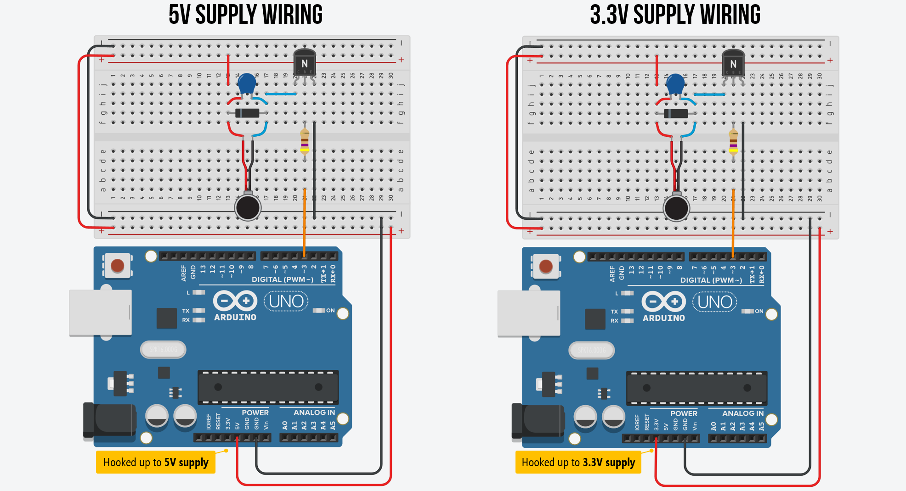
**Figure.** Two example wirings with an NPN BJT transistor. On the left, we are using the 5V supply pin and on the right, we're using the 3.3V supply pin. To zoom in, right-click on the image and select "Open Image in a New Tab." You can also view the circuits on Tinkercad: [5V version](https://www.tinkercad.com/things/3p3GU3ZfVKl-arduino-vibromotor-circuit-blinky) and [3.3 version](https://www.tinkercad.com/things/bteTfrO7QzC-arduino-vibromotor-33v-circuit-blinky).
{: .fs-1 }

<!-- How to improve start time and stop behavior of ERM and LRA actuators: https://e2e.ti.com/blogs_/b/analogwire/posts/how-to-improve-the-startup-and-stop-behavior-of-erm-and-lra-actuators -->

#### The flyback diode

There's one more critical component: a **flyback diode** (also called a snubber diode or freewheeling diode). Don't let the name fool you—there's no special "flyback diode" component. It's just a regular rectifier diode used in a specific protective role. Any general-purpose rectifier diode will work, such as the 1N4001, 1N4004, or 1N4007 (they differ only in their maximum reverse voltage rating). The key requirement is that the diode's current rating exceeds the motor's operating current—and since even the humble 1N4001 handles 1A, it's more than sufficient for our 75mA motor.

So why do we need it? Motors are *inductive* loads—their coils store energy in a magnetic field while spinning. When you turn the motor off (the transistor switches to `LOW`), that magnetic field collapses rapidly, and the stored energy has to go somewhere. It manifests as a sharp reverse voltage spike across the transistor that can easily exceed the transistor's breakdown voltage and destroy it.

The fix is simple: place the diode **in parallel with the motor**, with the striped end (cathode) pointing toward the positive power supply and the plain end (anode) toward the transistor's collector. During normal operation, the diode is reverse-biased and does nothing. But when the voltage spike occurs, the diode becomes forward-biased and safely shunts the spike current back through the motor coil, protecting the transistor.

Optionally, you can also add a small **ceramic capacitor** (0.1µF) across the motor terminals to filter out high-frequency electrical noise generated by the motor's brushes. This is less critical than the flyback diode but good practice, especially if you notice erratic sensor readings while the motor is running.

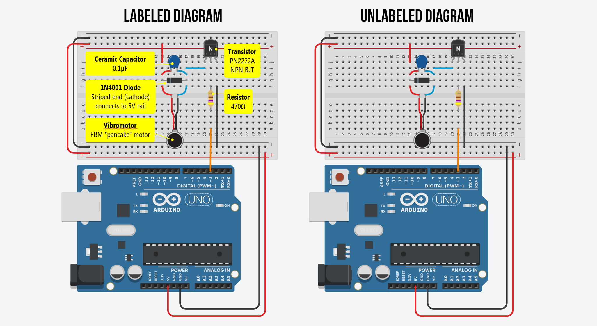
**Figure.** An annotated and unannotated circuit diagram for the ERM pancake motor with a transistor, flyback diode, and capacitor.
{: .fs-1 }

{: .warning }
> **Always use a flyback diode with motors!** While our tiny coin motor *might* not destroy the transistor on the first use without one, the voltage spikes are real and cumulative. A 1N4001 diode costs a few cents and takes seconds to add. Get in the habit now—every motor circuit you build in the future (DC motors, solenoids, relays) should include a flyback diode. It's a mandatory safety component, not an optional extra.

#### Choosing a base resistor (optional deep dive)

{: .note }
> This section explains *how* to calculate the base resistor value for a transistor switch circuit. For this lesson, **a 330Ω-1KΩ resistor works**—you can skip ahead to [Transistor orientation](#transistor-orientation) if you just want to get building. But if you're curious about *why* 330Ω-1KΩ (and not 10KΩ or 100Ω), or if you want to design transistor circuits for other loads in the future, read on!

The NPN bipolar transistors we use in our courses are the [PN2222A](https://www.adafruit.com/product/756) transistors (and variants such as the [2N2222A](https://components101.com/transistors/2n2222a-pinout-equivalent-datasheet)). You need a resistor in series with the Arduino GPIO pin and the transistor's base pin to limit the base current. But how do you choose the right value?

For the transistor to act as a fully-on switch (not just partially on), it needs to be driven into **saturation**. This means supplying enough base current $$I_B$$ to fully support the collector current $$I_C$$ (the motor current). The minimum base current is determined by the transistor's DC current gain $$h_{FE}$$ (also called $$\beta$$):

$$I_B \geq \frac{I_C}{h_{FE}}$$

The 2N2222 has an $$h_{FE}$$ of roughly 100-300 (it varies by unit and operating conditions). To guarantee reliable saturation, engineers typically use a safety factor and target a base current that is about **one-tenth** of the collector current:

$$I_B \approx \frac{I_C}{10}$$

As a best practice, we should design our switch for the **maximum expected load**—in this case, the motor's startup current of **120mA**:

$$I_B \approx \frac{120\text{mA}}{10} = 12\text{mA}$$

Now we can calculate the base resistor using Ohm's law. The Arduino GPIO pin outputs 5V, and the transistor's base-emitter junction has a forward voltage drop of ~0.7V:

$$R_B = \frac{V_{GPIO} - V_{BE}}{I_B} = \frac{5\text{V} - 0.7\text{V}}{12\text{mA}} \approx 358\Omega$$

So the "ideal" base resistor is around **330Ω to 470Ω**. In practice, we use a **1KΩ resistor** because it's readily available in our kits and provides a base current of about 4.3mA. Because the 2N2222's actual gain ($$h_{FE}$$) is typically much higher than 10—often around 100—that 4.3mA is still plenty to keep the transistor fully saturated even during the 120mA startup spike.

{: .note }
> **Rule of thumb for future projects:** To calculate the base resistor for any NPN transistor switch circuit, use $$R_B = \frac{V_{GPIO} - 0.7\text{V}}{I_{C(max)} / 10}$$, where $$I_{C(max)}$$ is the **maximum** expected collector current (including startup spikes). This ensures reliable saturation under worst-case conditions. For very high-current loads, consider using a MOSFET instead—MOSFETs are voltage-controlled (not current-controlled) and don't need a base resistor calculation at all.

#### Transistor orientation

Make sure you orient the transistor correctly. We created the abstract diagram below to help with assembly. In this diagram, the text on the transistor is facing us and the bulbous part is facing away.

<!-- TODO: Update the abstract pictorial diagram (Arduino_VibromotorTransistorCircuit_AbstractPictorialDiagramPlusCircuitDiagram.png)
     to include:
     1. The flyback diode across the motor (cathode toward positive supply)
     2. Clear labels showing the base resistor value (1KΩ) and why
     3. Optionally, the 0.1µF capacitor across the motor -->

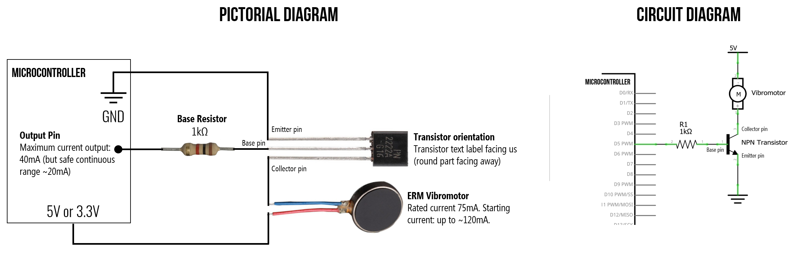
**Figure.** An additional diagram to help you wire up this transistor-based circuit. Pay close attention to the orientation of the transistor. The text on the transistor is facing us and the bulbous part is facing away from us. Diagram idea based on [Learning About Electronics](http://www.learningaboutelectronics.com/Articles/Vibration-motor-circuit.php).
{: .fs-1 }

<!-- 1023 | 255 | 0.012 A | 75.55
900 | ~225 | 0.011 A | 65 mA
800 | 199 | 0.009A | 58 mA
700 | 174 | 0.008A | 52 mA
600 | 149 | 0.007A | 45 mA
400 | 99 | 0.005A | 32 mA
300 | 75 | 0.004A | 25 mA
200 | 50 | 0.002A | 15 mA
160 | 40 | 0.002A | 12 mA (turned off)
100 | 25 | 0.001A | 6.1 mA -->

<!-- TODO: Take video of experimental  setup.

- http://www.learningaboutelectronics.com/Articles/Vibration-motor-circuit.php
- https://www.precisionmicrodrives.com/content/how-to-drive-a-vibration-motor-with-arduino-and-genuino/ 
- http://www.ermicro.com/blog/?p=423
- Transistor gain: https://www.electronics-notes.com/articles/electronic_components/transistor/current-gain-hfe-beta.php
- [Discrete Driver Circuits for Vibration Motors](https://www.precisionmicrodrives.com/content/ab-001-discrete-driver-circuits-for-vibration-motors/), Precision Microdrives
- [Electrical Techniques for Driving Vibration Motors](https://www.precisionmicrodrives.com/content/ab-011-electrical-techniques-for-using-different-power-sources/), Precision Microdrives -->

<!-- Talk about using diodes and capacitor:
https://www.reddit.com/r/arduino/comments/a06hxr/why_do_motors_need_transistors_and_diodes/ -->

### Controlling vibration with code

Once you've wired up the circuit, controlling the vibromotor is straightforward. Because the transistor acts as a switch controlled by the Arduino's GPIO pin, you can use `digitalWrite()` for on/off control or `analogWrite()` for PWM-based intensity control—just like controlling LED brightness!

{: .note }
> Make sure the pin you use supports PWM (marked with a `~` on most Arduino boards). On the Arduino Uno, PWM pins are 3, 5, 6, 9, 10, and 11. On the Leonardo, they are 3, 5, 6, 9, 10, 11, and 13. If you use `digitalWrite()` instead of `analogWrite()`, the motor will be either fully on or fully off with no intensity control.

## Let's make stuff!

Now that we understand the theory and have our circuit wired up, let's build three progressively more complex vibromotor projects. This should be fun—you'll *feel* your code running!

### Activity 1: Vibration blink

Just as we started our Arduino journey by [blinking an LED](../arduino/led-blink.md), let's start here by "blinking" a vibration motor—turning it on and off at a regular interval. This is the simplest possible vibromotor program and confirms that your circuit is working.


const int VIBRO_PIN = 3; // Connect to the transistor base (via 1K resistor)

void setup() {
  pinMode(VIBRO_PIN, OUTPUT);
}

void loop() {
  digitalWrite(VIBRO_PIN, HIGH);  // Motor on
  delay(500);                     // Vibrate for 500ms
  digitalWrite(VIBRO_PIN, LOW);   // Motor off
  delay(500);                     // Pause for 500ms
}


Try experimenting with different on/off durations. What happens with very short pulses (*e.g.,* 50ms on, 200ms off)? Can you feel the difference between a 100ms buzz and a 500ms buzz? This is the foundation of haptic pattern design!

### Activity 2: Potentiometer-controlled vibration

Now let's add **analog input** to control vibration intensity. We'll hook up a potentiometer to `A0` and map its reading to a PWM value that drives the motor. This is directly analogous to the [potentiometer-controlled LED brightness](../arduino/potentiometers.md) lesson and the [OLED interactive demos](oled.md#activity-interactive-graphics) from the previous lesson.

#### The circuit

Use the same transistor circuit as before, and add a 10KΩ potentiometer with its wiper connected to `A0`.

<!-- TODO: add wiring diagram showing transistor circuit plus potentiometer -->

#### The code


const int VIBRO_PIN = 3;           // PWM pin connected to transistor base
const int POT_PIN = A0;            // Potentiometer wiper
const int MAX_ANALOG_INPUT = 1023; // 10-bit ADC

void setup() {
  pinMode(VIBRO_PIN, OUTPUT);
  Serial.begin(9600);
}

void loop() {
  // Read the potentiometer
  int sensorVal = analogRead(POT_PIN);

  // Map the 10-bit analog input (0-1023) to 8-bit PWM output (0-255)
  int pwmVal = map(sensorVal, 0, MAX_ANALOG_INPUT, 0, 255);

  // Drive the motor
  analogWrite(VIBRO_PIN, pwmVal);

  // Print to Serial Monitor for debugging
  Serial.print("Pot: ");
  Serial.print(sensorVal);
  Serial.print(" -> PWM: ");
  Serial.println(pwmVal);

  delay(50);
}


As you turn the potentiometer, you should feel the vibration intensity change smoothly from off (fully counter-clockwise) to maximum (fully clockwise). Open the Serial Monitor to see the mapping from analog input to PWM output. Can you feel differences at low PWM values (*e.g.,* between 20 and 50)? At what PWM value does the motor stop vibrating entirely?

### Activity 3: Haptic notification patterns

For our final activity, let's design **haptic notification patterns**—distinct vibration sequences that communicate different information through touch alone. This is how your phone differentiates between a text message buzz, a phone call vibration, and an alarm. It's also a great introduction to **haptic interaction design**, which is an active area of HCI research!

We'll define three patterns triggered by three buttons: a short "tap" notification, a double-pulse "alert", and an urgent pulsing "alarm". This brings together [digital input](../arduino/buttons.md) (buttons with internal pull-ups) and PWM output.

#### The circuit

Use the same transistor + vibromotor circuit, and add three tactile buttons connected to pins 8, 9, and 10 using `INPUT_PULLUP` (so no external resistors needed for the buttons).

<!-- TODO: add wiring diagram showing transistor circuit plus three buttons -->

#### The code


const int VIBRO_PIN = 3;
const int BTN_TAP = 8;
const int BTN_ALERT = 9;
const int BTN_ALARM = 10;

void setup() {
  pinMode(VIBRO_PIN, OUTPUT);
  pinMode(BTN_TAP, INPUT_PULLUP);
  pinMode(BTN_ALERT, INPUT_PULLUP);
  pinMode(BTN_ALARM, INPUT_PULLUP);
}

void loop() {
  // INPUT_PULLUP reads LOW when pressed
  if (digitalRead(BTN_TAP) == LOW) {
    playTap();
  } else if (digitalRead(BTN_ALERT) == LOW) {
    playAlert();
  } else if (digitalRead(BTN_ALARM) == LOW) {
    playAlarm();
  }
}

// A single short buzz — like a text message notification
void playTap() {
  analogWrite(VIBRO_PIN, 200);
  delay(100);
  analogWrite(VIBRO_PIN, 0);
  delay(300); // debounce + settle time
}

// Two quick pulses — like a calendar reminder
void playAlert() {
  for (int i = 0; i < 2; i++) {
    analogWrite(VIBRO_PIN, 220);
    delay(80);
    analogWrite(VIBRO_PIN, 0);
    delay(100);
  }
  delay(300);
}

// Escalating pulses — like an urgent alarm
void playAlarm() {
  for (int intensity = 100; intensity <= 255; intensity += 30) {
    analogWrite(VIBRO_PIN, intensity);
    delay(150);
    analogWrite(VIBRO_PIN, 0);
    delay(80);
  }
  delay(300);
}


Try pressing each button and feeling the difference. Can you tell the three patterns apart with your eyes closed? Try designing your own patterns—a heartbeat (*thump-thump... thump-thump...*), a countdown, or a rhythmic pattern. Haptic design is all about creating distinct, recognizable tactile signatures.

{: .note }
> **From hand-coded to hardware-driven:** Notice how we hand-coded each pattern using `analogWrite()` and `delay()`. This works fine for simple patterns, but for more complex haptic effects, dedicated [haptic motor drivers](#haptic-motor-drivers) like the TI DRV2605L offer 123 preprogrammed patterns that you can trigger with a single I2C command—much easier than coding them all yourself!

<!-- ### Tinkercad version

<iframe width="725" height="453" src="https://www.tinkercad.com/embed/dlqdbv0SFV4?editbtn=1" frameborder="0" marginwidth="0" marginheight="0" scrolling="no"></iframe>

Though messier, we also [made a version](https://www.tinkercad.com/things/jGRVrL9C8Jv) with ammeters to track (1) the current through the vibromotor and into the transistor emitter, (2) the current into the transistor's base pin (the control pin), and (3) current out of the emitter.

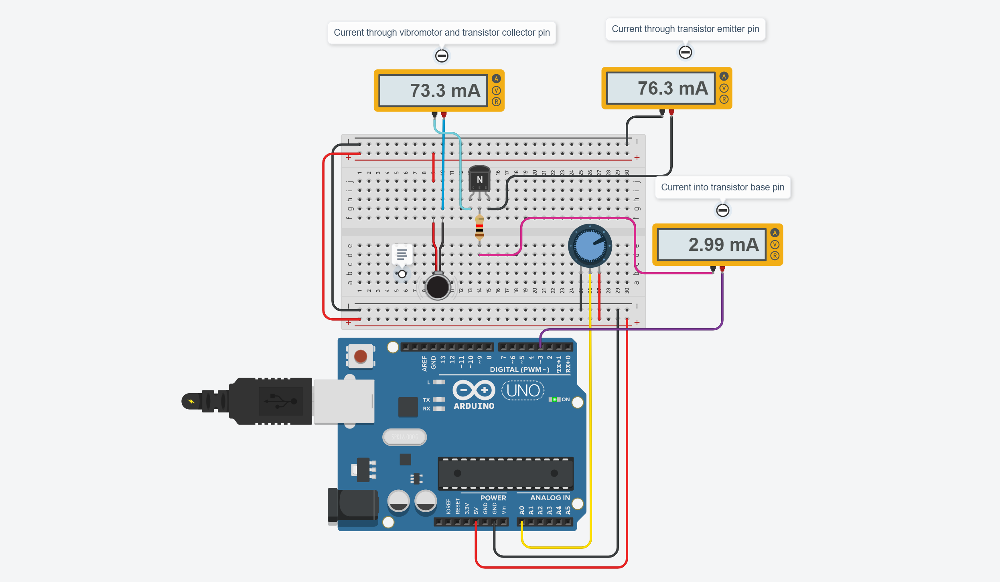
**Figure.** We remixed the original vibromotor Tinkercad circuit to include ammeters ([link](https://www.tinkercad.com/things/jGRVrL9C8Jv)).
{: .fs-1 } -->

<!-- ## Generating haptic patterns

TODO: have students make a haptic pattern or two. Maybe schedule a timer interrupt to do this?

Are there Arduino libraries for this? -->

## Haptic motor drivers

When haptics play a key role in your project, consider using a [haptic motor driver](https://learn.sparkfun.com/tutorials/haptic-motor-driver-hook-up-guide), which makes it easier to interface with vibration motors and drive complex haptic patterns.

For example, Texas Instruments (TI) sells a variety of [haptic motor drivers](https://www.ti.com/motor-drivers/actuator-drivers/overview.html). The popular [TI DRV2605](https://www.ti.com/lit/ds/symlink/drv2605.pdf) provides an [I2C](https://en.wikipedia.org/wiki/I%C2%B2C)-based interface to control both ERM and LRA motors, generates its own pulse-width modulated (PWM) waveforms (which relieves the host microcontroller of this responsibility, saving hardware pins and reducing code complexity), and includes an integrated library of 123 licensed haptic patterns, reducing the need to design and implement software to create custom haptic effects.

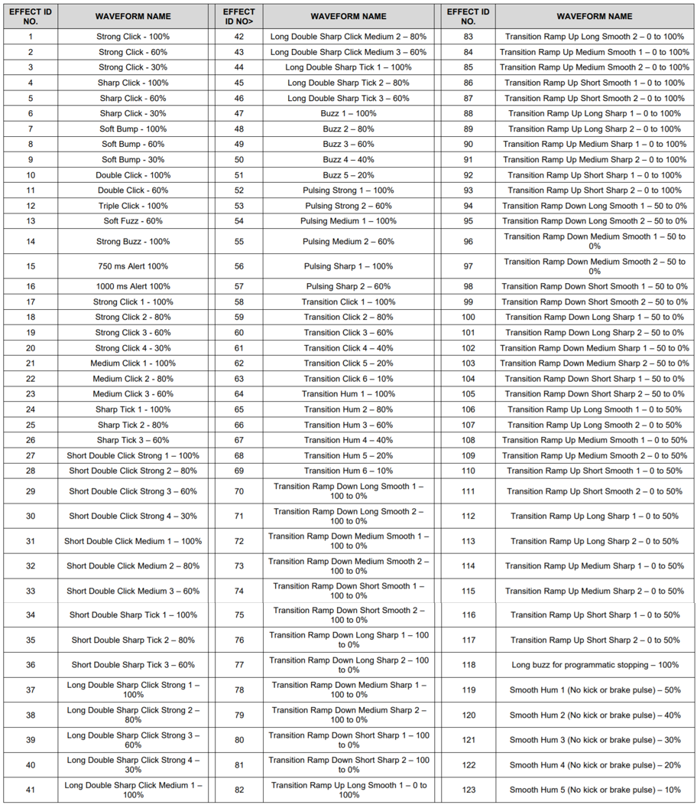
**Figure.** The [TI DRV2605L](https://www.ti.com/lit/ds/symlink/drv2605l.pdf) includes a preprogrammed library of over 100 haptic waveform effects, including single, double, and triple clicks, alerts, and transitions. These haptic patterns are licensed from Immersion Corporation. See page 63 of the [TI DRV2605L](https://www.ti.com/lit/ds/symlink/drv2605l.pdf) datasheet. Right-click on the image and select "Open image in new tab" to zoom in.
{: .fs-1 }

Both [Adafruit](https://www.adafruit.com/product/2305) and [SparkFun](https://www.sparkfun.com/products/14538) provide custom breakout boards to interface with the [TI DRV2605](https://www.ti.com/lit/ds/symlink/drv2605.pdf) IC.

| SparkFun Haptic Breakout Board for TI DRV2605L | Adafruit Haptic Breakout Board for TI DRV2605L |
|:---:|:---:|
| 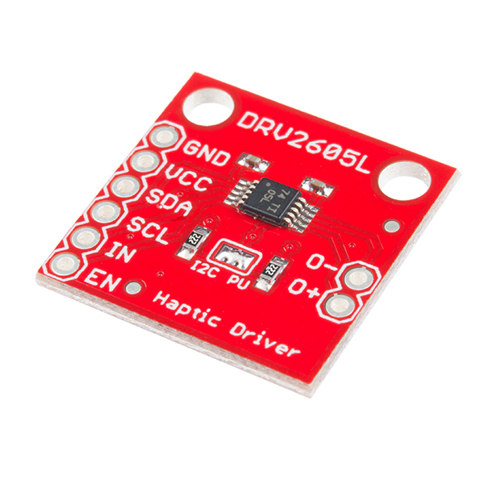 | 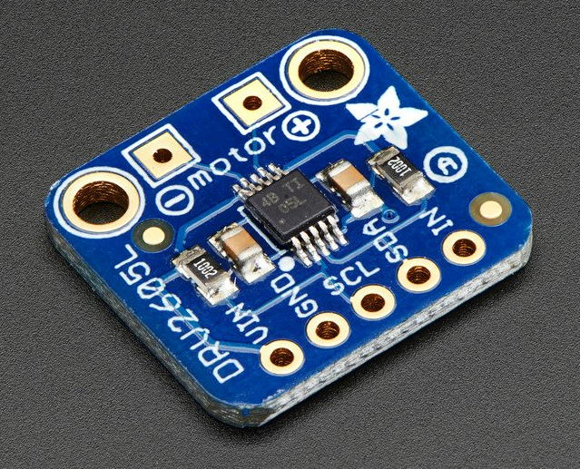 |
| $8.50 from [SparkFun](https://www.sparkfun.com/products/14538) | $7.95 from [Adafruit](https://www.adafruit.com/product/2305) |

You can also purchase breakout boards with the vibration motor and haptic driver integrated together like this [SparkFun DA7280 Haptic Driver](https://www.sparkfun.com/products/17590) with Qwiic [I2C](https://en.wikipedia.org/wiki/I%C2%B2C) connectors.

For more information on using haptic motor drivers with Arduino, see [SparkFun's Haptic Motor Driver Hook-up Guide](https://learn.sparkfun.com/tutorials/haptic-motor-driver-hook-up-guide).

## Exercises

Want to go further? Here are some challenges to reinforce what you've learned:

- **Morse code vibrator.** Modify [Activity 1](#activity-1-vibration-blink) to vibrate your name (or "SOS") in [Morse code](https://en.wikipedia.org/wiki/Morse_code). Short buzz = dot, long buzz = dash. This is similar to the [LED Morse code exercise](../arduino/led-blink.md#exercises) but now you'll *feel* it instead of see it!
- **Proximity haptics.** If you have an ultrasonic distance sensor (like the [HC-SR04](https://www.sparkfun.com/products/15569)), map the measured distance to vibration intensity—the closer an object gets, the stronger the vibration. This is similar to how parking sensors work in cars.
- **Haptic metronome.** Create a vibration metronome that pulses at a configurable BPM (beats per minute). Use a potentiometer to control the tempo. Can you keep rhythm by feel alone?
- **Multimodal feedback.** Combine the vibromotor with the [OLED display](oled.md) from the previous lesson. Display the current vibration pattern name on screen while it plays, or create a visual waveform that matches the haptic output.

## Lesson Summary

In this lesson, you learned about vibration motors and how to safely control them with Arduino. The key concepts were:

- **Haptic feedback** provides information through touch, using force, motion, or temperature. Vibration motors are the most common haptic actuators in consumer electronics.
- There are two main types of vibration motors: **ERM** (eccentric rotating mass) motors that spin an unbalanced mass, and **LRA** (linear resonant actuators) that move a mass linearly on a spring. ERMs use DC signals; LRAs use AC signals at a resonant frequency.
- For ERM motors, vibration **frequency** and **amplitude** cannot be controlled independently—both increase with applied voltage. The centripetal force is $$F = m \cdot r \cdot \omega^2$$.
- Arduino GPIO pins can only supply **20-40mA**, which is insufficient for most ERM motors (which typically need 50-120mA). While a direct connection may work briefly for tiny motors, it risks damaging your board.
- A **transistor** (such as the PN2222A NPN BJT) acts as an electronically controlled switch, allowing a small control signal from the Arduino to switch a larger current from the power supply to the motor.
- Motors are **inductive loads** that generate reverse voltage spikes when turned off. A **flyback diode** (like the 1N4001) placed in parallel with the motor is mandatory to protect the transistor from these spikes.
- The transistor's **base resistor** limits the base current and should be calculated using the motor's **maximum** expected current (including startup spikes): $$R_B = \frac{V_{GPIO} - 0.7\text{V}}{I_{C(max)} / 10}$$. For our motor and a 2N2222 transistor, values from 330Ω to 1KΩ work well.
- By sending a **PWM signal** to the transistor's base via `analogWrite()`, you can control vibration intensity. Using `digitalWrite()` gives only on/off control.
- Distinct **haptic patterns**—varying in duration, intensity, and rhythm—can communicate different types of information through touch. This is the foundation of haptic interaction design.
- For more advanced haptic applications, dedicated **haptic motor drivers** like the TI DRV2605L offer preprogrammed vibration patterns and support for both ERM and LRA motors.

## Resources

### Vibromotor resources

- [Vibration Motor Best Practices from Mobile Phones](https://www.precisionmicrodrives.com/content/ab-008-vibration-motor-best-practices-from-mobile-cell-phones/), Precision Microdrives

- [Vibration Motor Comparison Guide](https://www.precisionmicrodrives.com/content/ab-028-vibration-motor-comparison-guide/), Precision Microdrives

- [Understanding ERM Vibration Motor Characteristics](https://www.precisionmicrodrives.com/content/ab-004-understanding-erm-vibration-motor-characteristics/), Precision Microdrives

- [How to Build a Vibration Motor Circuit](http://www.learningaboutelectronics.com/Articles/Vibration-motor-circuit.php), Learning About Electronics

### Using transistors with Arduino

- [How to Drive a Vibration Motor with Arduino](https://www.precisionmicrodrives.com/content/how-to-drive-a-vibration-motor-with-arduino-and-genuino/), Precision Microdrives

- [Controlling RGB LED Strips with Transistors](https://learn.adafruit.com/rgb-led-strips/usage), Adafruit

- [Transistors 101](https://learn.adafruit.com/transistors-101/overview), Adafruit
  
- [Using a Transistor to Control High Current Loads with an Arduino](https://itp.nyu.edu/physcomp/labs/motors-and-transistors/using-a-transistor-to-control-high-current-loads-with-an-arduino/), NYU ITP Physical Computing Course

- [Motors and Transistors](https://itp.nyu.edu/physcomp/labs/motors-and-transistors/), NYU ITP Physical Computing Course

### Videos

- [BJTs as Transistor Switches](https://youtu.be/sRVvUkK0U80), AddOhms on YouTube

- [Transistor (BJT) as a Switch](https://youtu.be/WRm2oUw4owE), GreatScott! on YouTube

- [MOSFETs and Transistors with Arduino](https://youtu.be/IG5vw6P9iY4), DroneBot Workshop on YouTube

## Next Lesson

In the [next lesson](../smoothing-input.md), we will switch from output to input and learn how to smooth noisy sensor data using digital signal processing techniques.

[Previous: Servo Motors](servo.md){: .btn .btn-outline }
