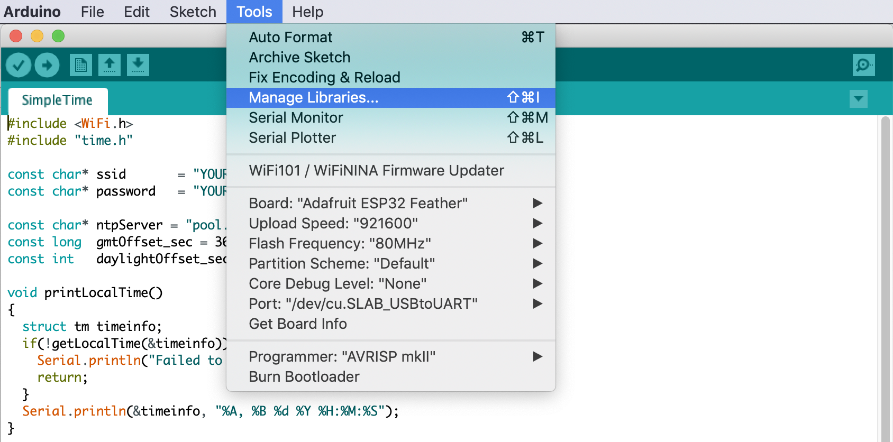
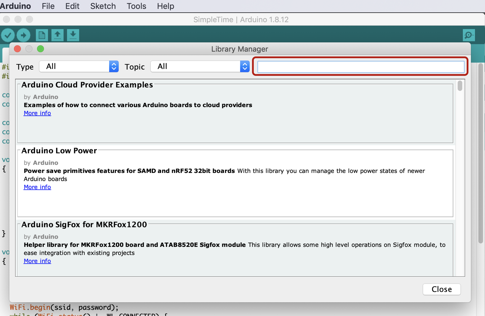
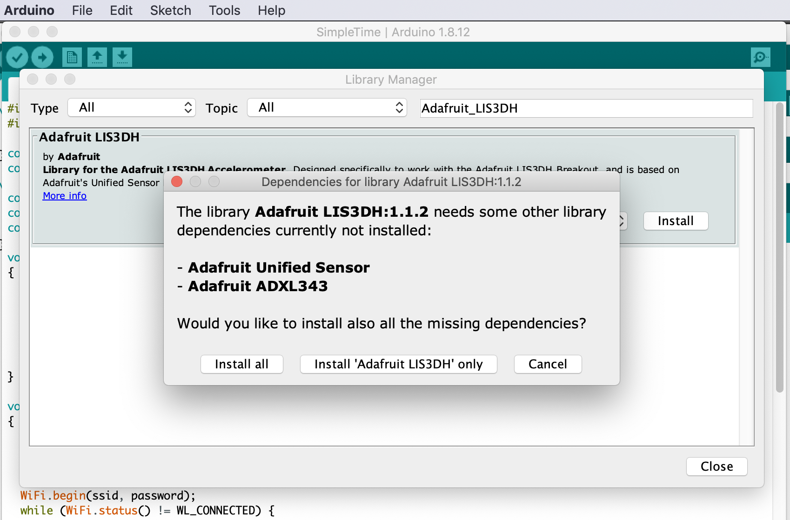
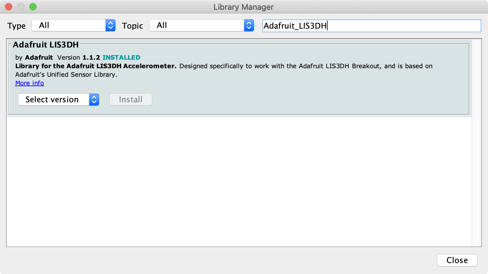

## Installing library for Adafruit LIS3DH 3-Axis accelerometer
You can follow the official [Adafruit tutorial](https://learn.adafruit.com/adafruit-lis3dh-triple-axis-accelerometer-breakout). You'll need to add Adafruit's LIS3DH library and dependencies using Arduino's Library Manager.

