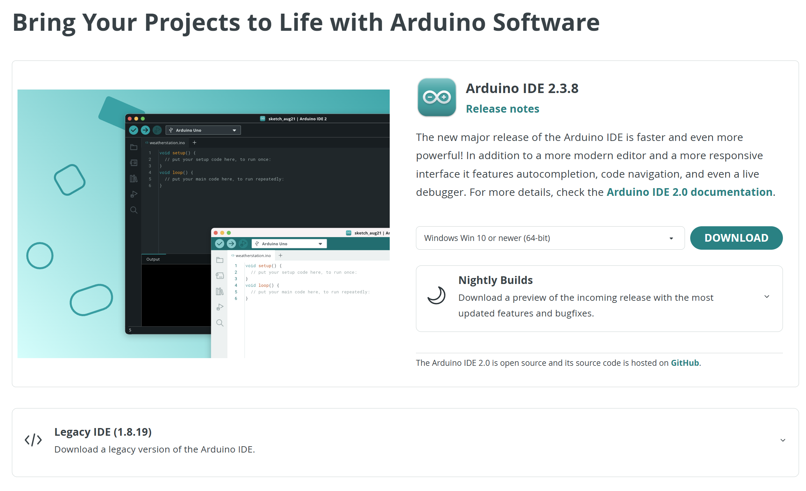
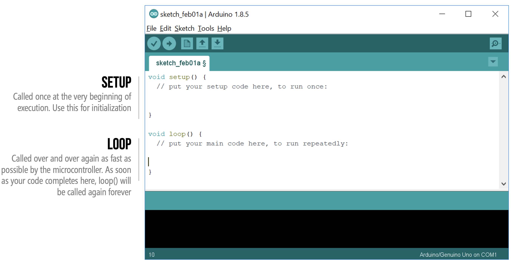
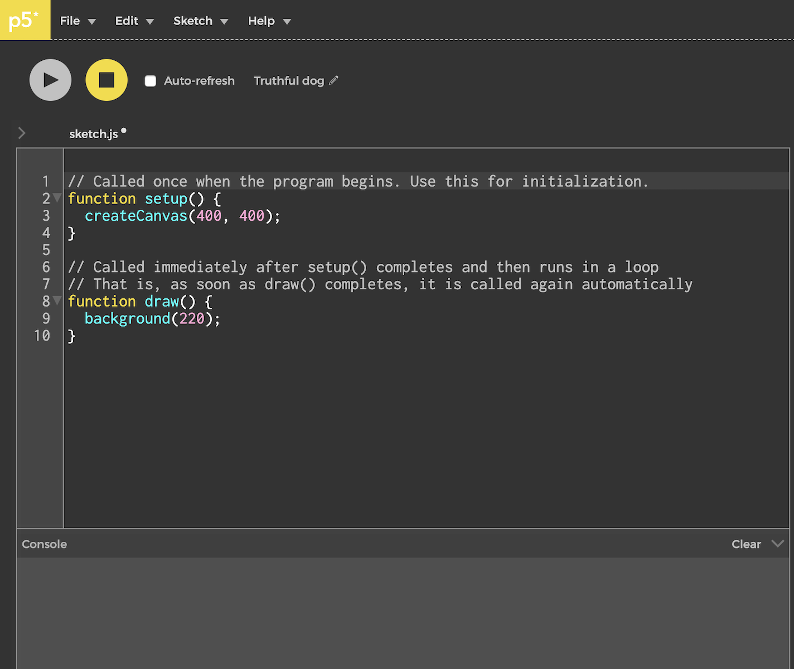
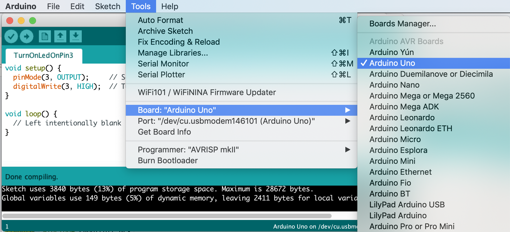
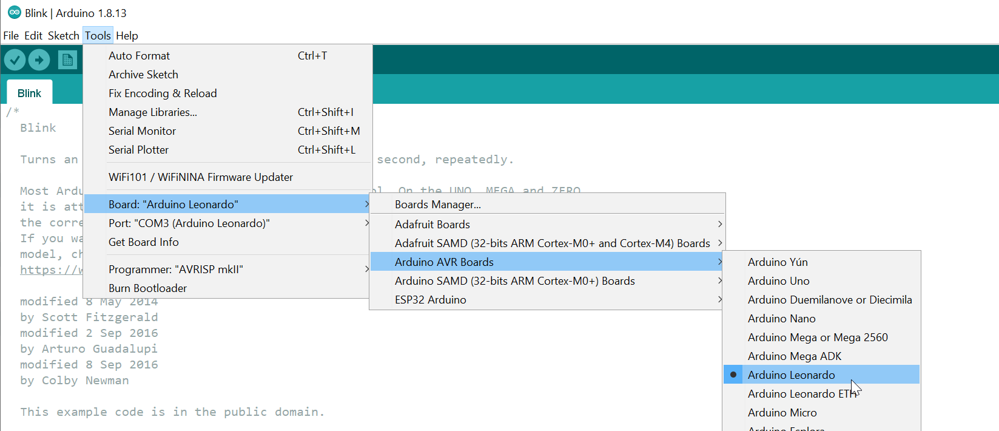
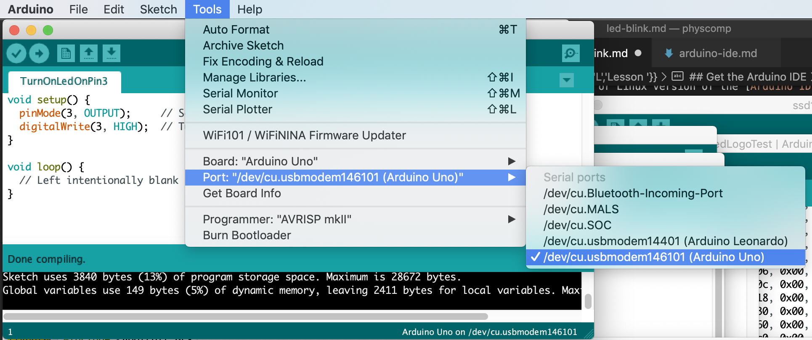
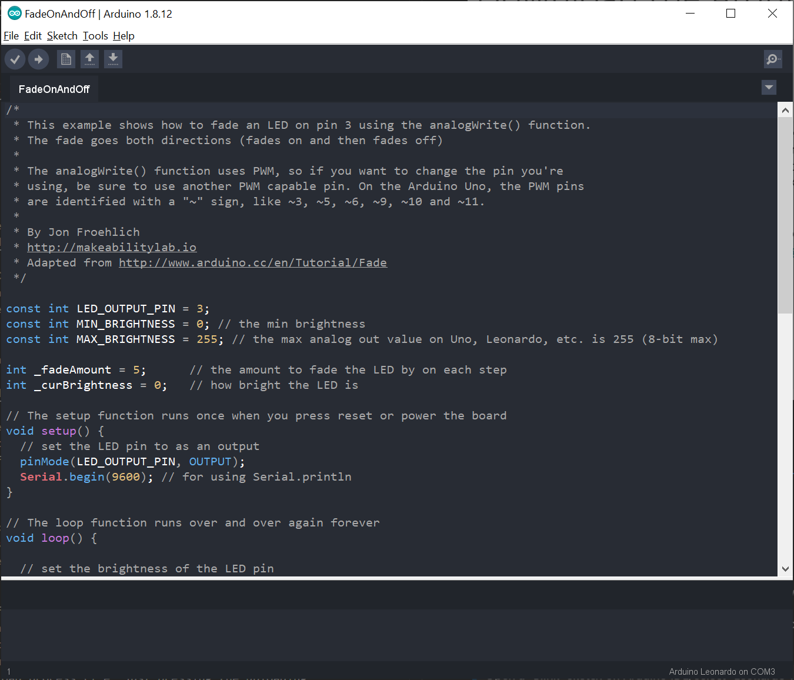
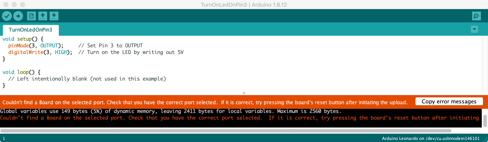
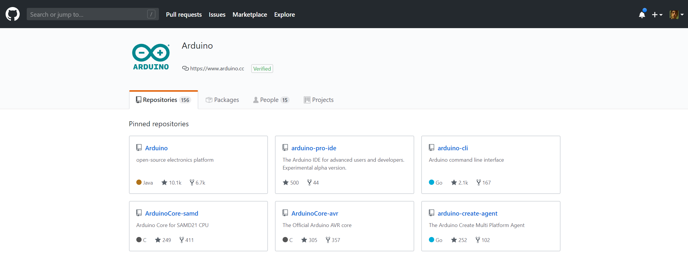

# Arduino
{: .no_toc }

## Table of Contents
{: .no_toc .text-delta }

1. TOC
{:toc}
---

## Download and install the Arduino IDE
Please follow our step-by-step download and installation instructions for the [Arduino IDE](https://www.arduino.cc/en/main/software).

### Step 1: Download and install the Arduino IDE

Download and install the local Mac, Windows, or Linux version of the [Arduino IDE](https://www.arduino.cc/en/main/software). We will **not** be using the Cloud version (the "Arduino Web Editor"), so please download and install the version that runs locally on your machine.

### Step 2: Open the IDE

After installation is complete, open the Arduino IDE. Notice that there are **two blocks** of code (called functions):

1. The first block is `setup()`, which is called once and only once when the Arduino is turned on
2. And the second block is `loop()`, which is called as soon as `setup()` completes. When `loop()` completes, it's automatically called again and again (until the Arduino is turned off). Want to learn more, read [Inside Arduino](inside-arduino.md#whats-calling-loop-and-how-fast).

For those who have used [Processing](https://processing.org/)—a programming environment for digital artists and creators (and a favorite of mine)—this code structure should seem familiar. Indeed, the Arduino IDE is written in Java and derives from Processing ([link](https://github.com/arduino/Arduino/tree/ee1967cd530ceb9a1d638875e385157e90d532e8/arduino-core/src/processing/app)).

| Processing | p5js |
|----|----|
|  |  |
| A screenshot of the [Processing IDE](https://processing.org/) | A screenshot of the [p5.js IDE](https://editor.p5js.org/) |

### Step 3: Select your Arduino board

Plug in your Arduino and select your Arduino board in the Tools menu:

In newer versions of the IDE (since [1.8.13](https://www.arduino.cc/en/Main/ReleaseNotes)), there is a cascading menu organized by platform type.

### Step 4: Select your Arduino port

Then select your Arduino port. **Important:** This port can change if, for example, you change which USB port you plug in your Arduino. Students have also reported this port changing on their computer after restarts, etc. You will not be able to download code to Arduino if the proper port is not selected.

### Stop and double check the following

A significant number of frustrating hours are wasted because:

1. The **incorrect Arduino board** was selected. Double check this. For example, there are two Arduino Leonardo options: "Arduino Leonardo" and "Arduino Leonardo ETH". You must select the regular "Arduino Leonardo" board.

2. The **incorrect port** was selected. Sometimes, your port selection gets reset. Other times, your Arduino gets moved to a different port. If you get a "uploading error", check this first!

3. Finally, using a **non-data enabled USB cable**. You must use a USB cable that provides *data* not just one that provides power. Sometimes, cheap USB cords—which are largely sold to charge mobile phones—save on costs by *not* including and connecting the data wire in the USB spec. 

## Install custom theme

To use a dark theme in the Arduino IDE, [follow these steps](https://create.arduino.cc/projecthub/konradhtc/one-dark-arduino-modern-dark-theme-for-arduino-ide-2fca81). Note: I started investigating this when I noticed that the default Arduino theme was difficult to read over Zoom.

## Troubleshooting

### Couldn't find a Board on the selected port

If you click the `upload` button but receive the following error, did you remember to set the correct Arduino board and port in `Tools->Board` and `Tools->Port`? See above.

### Arduino Leonardo port doesn't show up in Tools->Port

First, check to ensure that your USB cable provides both power + data. Some cheaper cables are power only.

Second, I've found (frustratingly) that sometimes the com software on the Leonardo can get confused. The only way I've figured out how to solve it is by following these [directions](https://www.dfrobot.com/forum/viewtopic.php?t=216). In short:

> Open a "Blink" sketch on Arduino IDE, select "Leonardo". Now there is no COM port. Press "RESET" and select the COM port in the Arduino IDE immediately. Wait a minute, the COM port will disappear again. Now, click "Upload". After IDE has completed verifying, press "RESET" on the Leonardo (physical button). If everything is OK, the COM port has been fixed after uploading.
{: .fs-4 }

Fortunately, if this solution works, the Leonardo will be 'fixed' and you can upload normally again.

Why does this happen? Read the official Arduino guide [here](https://www.arduino.cc/en/Guide/ArduinoLeonardoMicro#toc6):

> In general, you upload code to the Leonardo or Micro as you would with the Uno or other Arduino boards. Click the upload button in the Arduino IDE and your sketch will be automatically uploaded onto the board and then started. This works more or less the same way as with the Uno: the Arduino software initiates a reset of the board, launching the bootloader - which is responsible for receiving, storing, and starting the new sketch.
>
> However, because the serial port is virtual, it disappears when the board resets, the Arduino software uses a different strategy for timing the upload than with the Uno and other boards. In particular, after initiating the auto-reset of the Leonardo, Leonardo ETH or Micro (using the serial port selected in the Tools > Serial Port menu), the Arduino software waits for a new virtual (CDC) serial / COM port to appear - one that it assumes represents the bootloader. It then performs the upload on this newly-appeared port.
>
> These differences affect the way you use the physical reset button to perform an upload if the auto-reset isn't working. Press and hold the reset button on the Leonardo or Micro, then hit the upload button in the Arduino software. Only release the reset button after you see the message "Uploading..." appear in the software's status bar. When you do so, the bootloader will start, creating a new virtual (CDC) serial port on the computer. The software will see that port appear and perform the upload using it. Again, this is only necessary if the normal upload process (i.e. just pressing the uploading button) doesn't work. (Note that the auto-reset is initiated when the computer opens the serial port at 1200 baud and then closes it; this won't work if something interferes with the board's USB communication - e.g. disabling interrupts.)
{: .fs-4 }

## Arduino is open source
Arduino is open source and hosted on [GitHub](https://github.com/arduino).

