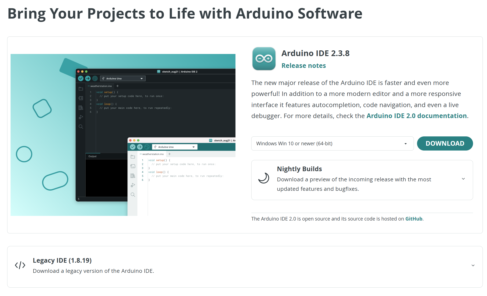
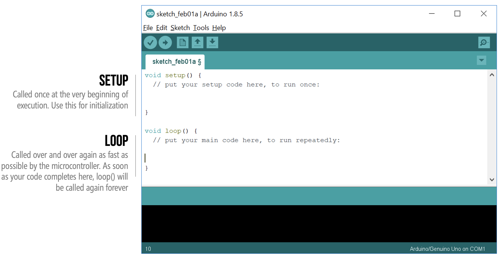
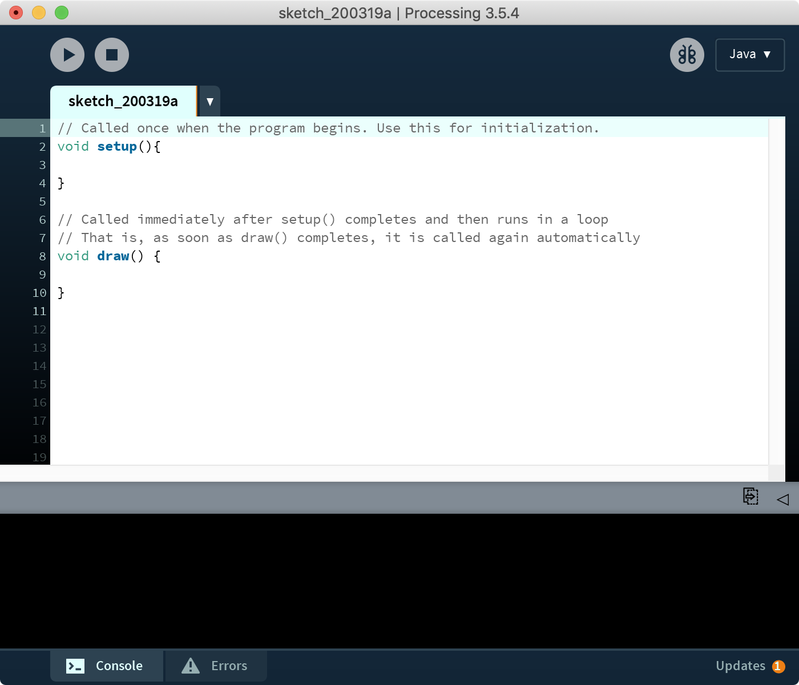
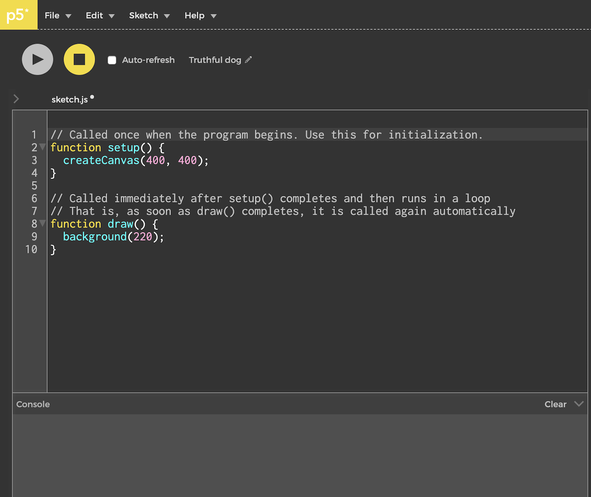
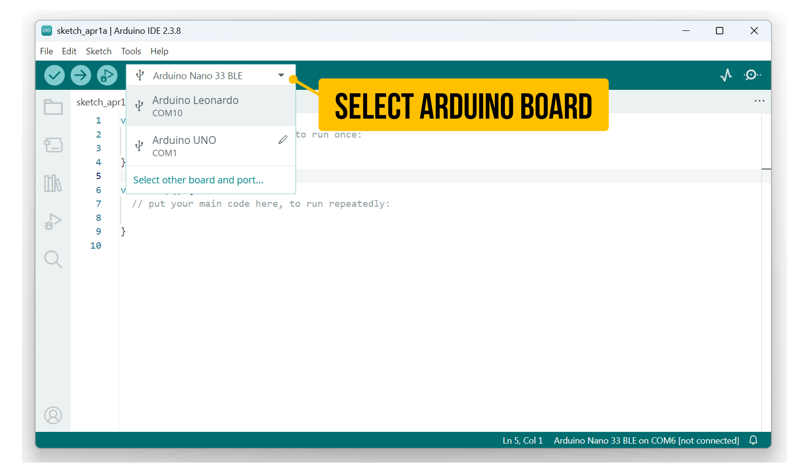
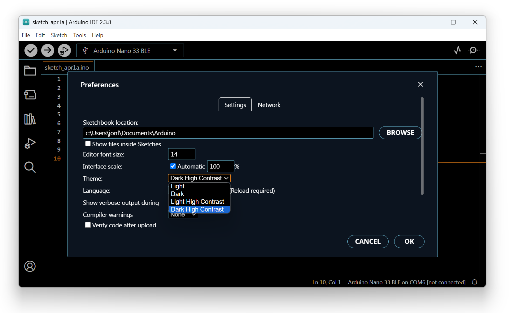
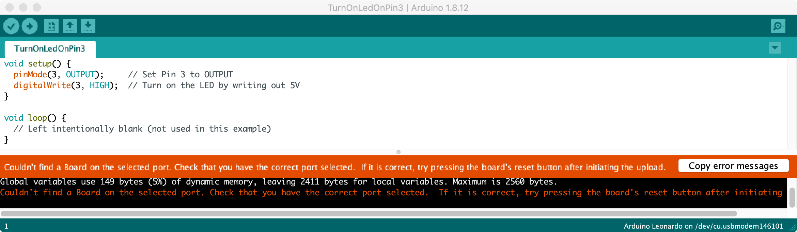
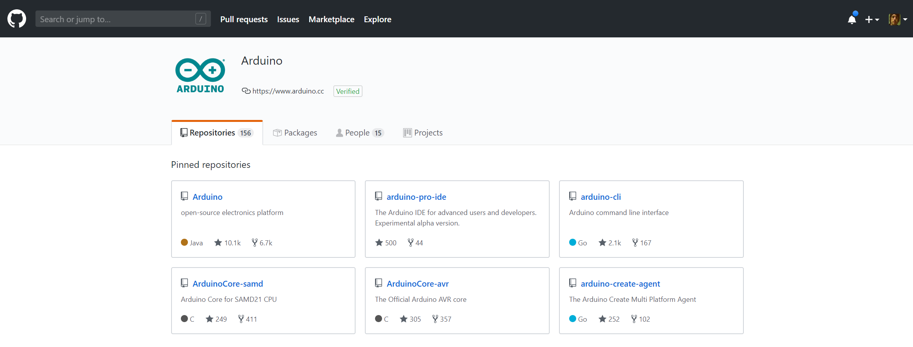

# Setting Up the Arduino IDE
{: .no_toc }

## Table of Contents
{: .no_toc .text-delta }

1. TOC
{:toc}
---

The Arduino IDE (Integrated Development Environment) is where you'll write, compile, and upload code to your Arduino board. This page walks through downloading, installing, and configuring the IDE so you're ready to start programming.

## Download and install the Arduino IDE

### Step 1: Download and install

Download and install the Arduino IDE 2 for Mac, Windows, or Linux from the [Arduino Software page](https://www.arduino.cc/en/software). We will **not** be using the cloud version (the "Arduino Cloud Editor"), so please download and install the version that runs locally on your machine.

**Figure.** The Arduino download page. As of April 1, 2026, the current version is 2.3.8 but nightly builds are also available. And the IDE source code itself is even open source and viewable on [GitHub](https://github.com/arduino/arduino-ide).
{: .fs-1 }

{: .note }
> The legacy Arduino IDE (1.x) is also available on the download page. Some older online tutorials reference it, but we recommend using Arduino IDE 2 for these lessons. If you encounter a tutorial showing a different-looking IDE, it's likely using the 1.x version—the core concepts (compiling, uploading, `setup()`/`loop()`) are the same.

### Step 2: Open the IDE

After installation is complete, open the Arduino IDE. You'll see a code editor with **two blocks** of code (called functions):

1. The first block is `setup()`, which is called once and only once when the Arduino is turned on or reset.
2. The second block is `loop()`, which is called as soon as `setup()` completes. When `loop()` completes, it's automatically called again and again (until the Arduino is turned off). Want to learn more? Read [Inside Arduino](inside-arduino.md#whats-calling-loop-and-how-fast).

<!-- TODO: Consider retaking screenshot of Arduino IDE 2.x with blank sketch, annotated -->

**Figure.** When you first create a new project in the Arduino IDE, the initial code template is composed of a `setup()` function, which is called once when the Arduino is turned on or reset, and a `loop()` function, which is called continuously.
{: .fs-1 }

The Arduino IDE 2 also includes a sidebar with quick access to the Board Manager, Library Manager, Serial Monitor, and your Sketchbook—we'll use some of these in later lessons.

For those who have used [Processing](https://processing.org/)—a programming environment for digital artists and creators (and a favorite of mine)—the `setup()`/`loop()` code structure should seem familiar. The classic Arduino IDE (1.x) was actually written in Java and derived directly from Processing. The current IDE 2.x is a complete rewrite built on [Theia](https://theia-ide.org/) and [Electron](https://www.electronjs.org/), but it preserves the same `setup()`/`loop()` programming model.

| Processing | p5js |
|----|----|
|  |  |
| A screenshot of the [Processing IDE](https://processing.org/) | A screenshot of the [p5.js IDE](https://editor.p5js.org/) |

### Step 3: Select your Arduino board and port

Plug in your Arduino via USB. In IDE 2, the board and port can be selected from the dropdown at the top of the window. When you plug in an Arduino, the IDE will often auto-detect it and display something like "Arduino Leonardo on COM3" or "Arduino Uno on /dev/cu.usbmodem14101". Click the dropdown to verify or change the selection.

You can also select the board and port via `Tools -> Board` and `Tools -> Port`.

**Figure.** The Arduino IDE should recognize your board as soon as you plug it into your computer.
{: .fs-1 }

{: .note }
> **Port can change!** The port assigned to your Arduino can change if you switch USB ports, restart your computer, or unplug and replug the board. If you get an upload error, check your port selection first.

### Stop and double check the following

{: .warning }
> A significant number of frustrating hours are wasted because of the following three issues. Before asking for help, please verify each one:
>
> 1. The **incorrect Arduino board** was selected. Double check this. For example, there are two Arduino Leonardo options: "Arduino Leonardo" and "Arduino Leonardo ETH". You must select the regular "Arduino Leonardo" board.
>
> 2. The **incorrect port** was selected. Sometimes your port selection gets reset. Other times, your Arduino gets moved to a different port. If you get an uploading error, check this first!
>
> 3. Using a **non-data USB cable**. You must use a USB cable that provides *data*, not just one that provides power. Some cheap USB cables—which are largely sold to charge mobile phones—save on costs by *not* including the data wires in the USB spec. If your Arduino powers on but doesn't show up in the port list, try a different cable.

## Customize the IDE

### Theme

The Arduino IDE 2 includes built-in theme support. To switch to a dark theme, go to `File -> Preferences` (or `Arduino IDE -> Settings` on macOS) and change the **Theme** dropdown. There are several options including "Dark," "Light," and "High Contrast."

<!-- TODO: Retake screenshot of IDE 2.x Preferences showing theme dropdown -->

**Figure.** The Arduino IDE natively supports a number of themes, including light, dark, and high contrast modes.
{: .fs-1 }

### Text size

You can also adjust the editor font size in `File -> Preferences` by changing the **Editor Font Size** value. This is helpful when presenting code over Zoom or a projector.

## Troubleshooting

### Couldn't find a Board on the selected port

If you click the `Upload` button but receive a "Couldn't find a Board on the selected port" error, double check that the correct board and port are selected (see [Step 3](#step-3-select-your-arduino-board-and-port) above). Also verify that your USB cable supports data transfer.

<!-- TODO: Retake screenshot of this error in IDE 2.x -->

**Figure.** Screenshot of the "Couldn't find a board on the selected port" problem.

### Arduino Leonardo port doesn't show up

First, check that your USB cable provides both power and data. Some cheaper cables are power only.

Second, the Leonardo (and other boards using the ATmega32u4 microcontroller) uses a *virtual* serial port that disappears briefly when the board resets. This can sometimes confuse the IDE. If the Leonardo's port doesn't appear, try the following:

1. Open the Blink example sketch (`File -> Examples -> 01.Basics -> Blink`)
2. Select "Arduino Leonardo" as your board
3. Press and **hold** the physical reset button on the Leonardo
4. Click `Upload` in the IDE
5. When you see "Uploading..." appear in the status bar, **release** the reset button

This gives the IDE a chance to catch the bootloader's virtual port during the brief reset window. If this works, the Leonardo should be fixed for normal uploads going forward.

For more details on why this happens (the Leonardo's bootloader creates a temporary virtual serial port during reset), see the [official Arduino upload troubleshooting guide](https://support.arduino.cc/hc/en-us/articles/4403365313810-If-your-sketch-doesn-t-upload).

## Arduino is open source

The entire Arduino ecosystem is open source and hosted on [GitHub](https://github.com/arduino). This includes the [Arduino IDE](https://github.com/arduino/arduino-ide) itself, the [board cores](https://github.com/arduino/ArduinoCore-avr) that define how code compiles for specific microcontrollers (like the ATmega328P on the Uno), the [language reference](https://github.com/arduino/reference-en), and even the [documentation](https://github.com/arduino/docs-content) at [docs.arduino.cc](https://docs.arduino.cc). As a CS student, browsing these repositories can be a great way to learn how an embedded toolchain works under the hood—from how `digitalWrite()` is actually implemented in C to how the IDE communicates with your board.

**Figure.** The [Arduino GitHub organization](https://github.com/arduino) hosts open-source code for the IDE, board cores, libraries, and documentation.
{: .fs-1 }