# {{ page.title | replace_first:'L','Lesson '}}
{: .no_toc }

## Table of Contents
{: .no_toc .text-delta }

1. TOC
{:toc}
---

This is the first lesson in the [**Intro to Arduino Input**](intro-input.md) lesson series. We assume you've already completed the [**Intro to Arduino Output**](intro-output.md) series. If not, please complete that first!

In this lesson, we'll finally get to build something interactive: turning on an LED with a push button. We'll cover buttons (aka momentary switches), how to use digital input with the [`digitalRead`](https://www.arduino.cc/reference/en/language/functions/digital-io/digitalread/) function, and pull-up and pull-down resistors.

Switches themselves are conceptually easy to understand—they are either "closed" or "open". We use switches everyday when we turn on and off our light circuits in our home. However, when **using switches with microcontrollers**, we've found that students often struggle to understand why pull-up or pull-down resistors are necessary. So, take your time with this lesson. Try to understand the **why**  and **how** of these resistors in your circuits.

For example, in the animation below, we show a button circuit with a pull-down resistor hooked up to Pin 2. Importantly, notice **where** the current flows when the button is pressed—perhaps surprisingly, it does **not** flow into Pin 2. In fact, (virtually) no current flows into Pin 2! Why not? We'll talk about this and more in this lesson!

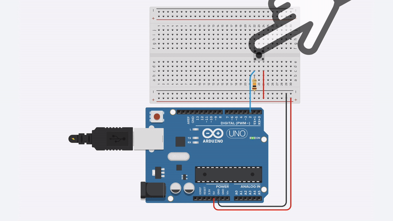
Animation shows the Arduino's built-in LED illuminating when the button on Pin 2 is pressed. When the button is pressed, current flows from $$V_{CC}$$ through the pull-down resistor to GND. We'll learn more about this circuit in this lesson.
{: .fs-1 }

## Switches

As noted above, switches are simple components: they're typically either "open" (disconnected) or "closed" (connected). There are lots of different types of switches from **momentary switches** (aka buttons) to **toggle** or **slide** switches (which maintain their state) to switches that activate based on environmental conditions like a **tilt switch** or a **reed switch**.

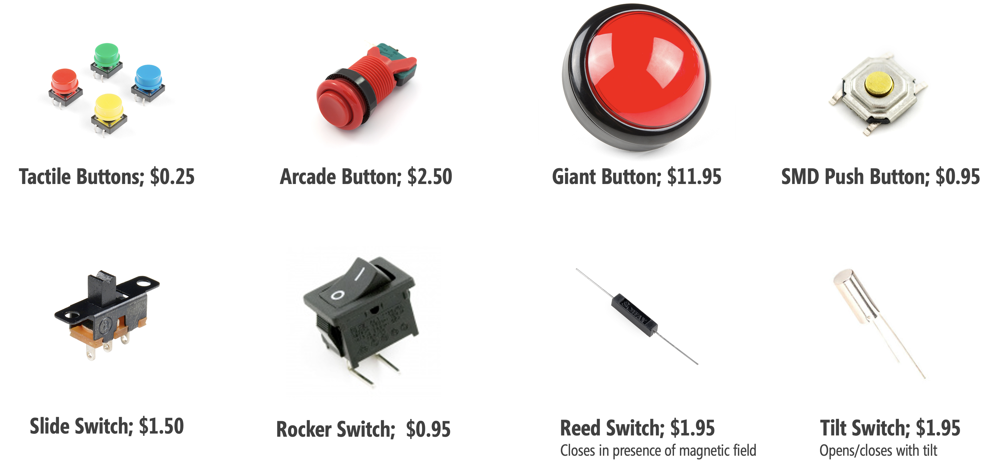
Prices and pictures are from Sparkfun.com, Jan 2020; parts can be cheaper in bulk from suppliers like [Digi-Key](https://www.digikey.com/) or [Mouser Electronics](https://www.mouser.com/).
{: .fs-1 }

In this lesson, we are going to use a **four-legged push button** (momentary switch), which look like:

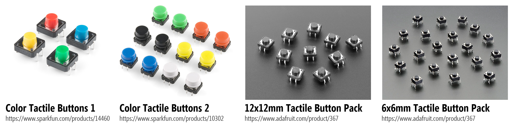
<!-- TODO: in future, make this into a table with links for improved accessibility -->

If you want to learn more about switches in general, see these articles by [Sparkfun](https://learn.sparkfun.com/tutorials/switch-basics/all) and [ITP NYU](https://itp.nyu.edu/physcomp/labs/labs-electronics/switches/).

<!-- TODO: show animation of a switch -->

<!-- TODO: add in schematic icons? Also, different types like SPST, DPST? -->

## Making an initial button circuit

We'll first learn how to use a button **without** a microcontroller. This will strengthen our understanding of buttons, in general, before switching over to digital input.

### Materials

We'll need the following materials:

| Breadboard | Arduino | LED | Resistor | Button |
|:-----:|:-----:|:-----:|:-----:|:-----:|
|  |  |  |  |  |
| Breadboard | Arduino Uno, Leonardo, or similar  | Red LED | 220Ω Resistor | [12x12mm "Tactile Switch Buttons"](https://www.adafruit.com/product/1119) |

### Four-legged tactile buttons

The four-leg push button is one of the most common button types for breadboarding circuits; however, it's also a bit funky and non-intuitive at first. You might be wondering: why **four legs** instead of two? How does this button work? See the diagram below.

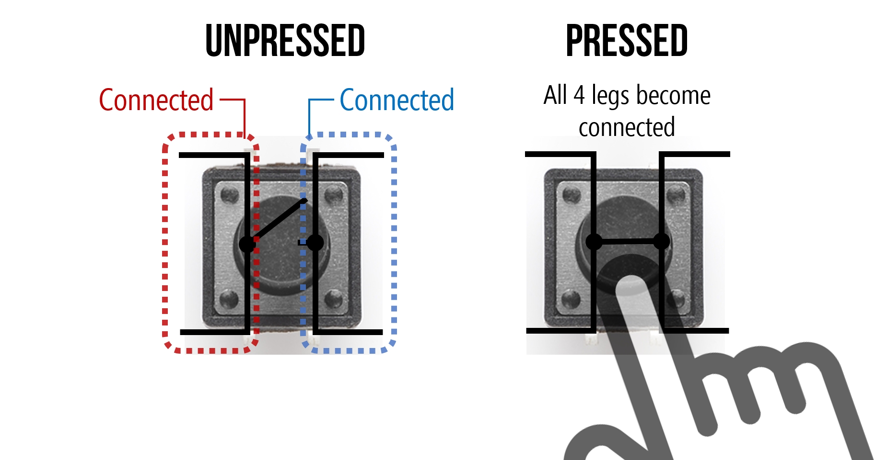

The key thing to remember is that the two legs closest together (on the same side) are, somewhat unintuitively, **not** connected until you press the button. Upon button press, all four legs become connected (*i.e.,* the same node). We created the following animation to help explain further. Observe the *orientation* of the button and how the legs are connected.

<!-- 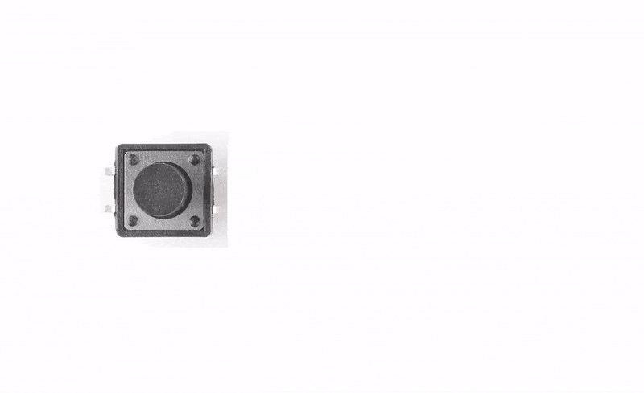 -->

<video autoplay loop muted playsinline style="margin:0px">
  <source src="assets/movies/FourLeggedTactileButtons_Animation.mp4" type="video/mp4" />
</video>
**Video.** Animation shows which two sides of a four-legged tactile button are disconnected until the button is pressed, creating a connection between all four legs.
{: .fs-1 }

<!-- TODO: I like this simple picture by LadyAda, consider adding it? https://www.ladyada.net/images/arduino/pushbuttons.gif -->

And, of course, the best way to learn it is to try it yourself (and hopefully the animation will help). In general, if you're confused about how to use a component, it's a good idea to consult the [datasheet](https://cdn-shop.adafruit.com/datasheets/B3F-1000-Omron.pdf). You can also use a multimeter, if you have one, to check for continuity between the four legs.

<!-- TODO video of using a multimeter to figure out how the four legs are hooked up -->

### Using buttons without a microcontroller

We'll make a simple button-based circuit that turns on an LED when the button is pressed. This will give you experience with how the button connections work before hooking it up to an Arduino.

Below, we've included two wiring diagrams: one using an external power source like a 9V battery with a snap connector (you could use alligator clips!) and the other using Arduino's 5V pin for power, just like we did in the [LED on](led-on.md) lesson. We suggest the 9V battery approach just to avoid confusion—remember, this circuit is completely independent of Arduino!

| With 9V Battery | With Arduino 5V Pin |
|:-------------:|:-----------:|
|  |  |
| Circuit powered by 9V battery | Circuit powered by 5V Arduino pin | 

If you build the 9V battery circuit, then we suggest a 680Ω or 1kΩ resistor rather than a 220Ω resistor.
{: .fs-1 }

That's it! Once you've created the circuit, give it a try by pushing the button and the LED should turn on. See the animation below.

<!-- 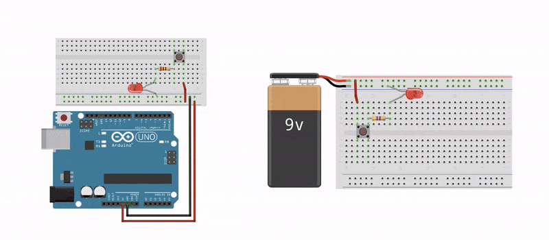 -->

<video autoplay loop muted playsinline style="margin:0px">
  <source src="assets/movies/Button_LEDCircuit_Breadboard_Animation-Edited-Cropped_Trim.mp4" type="video/mp4" />
</video>
**Video.** Animation showing two different voltage sources for a basic LED-based circuit with a four-legged button to control "on" and "off." When no button is pressed, there is no current flow and the LED is off.
{: .fs-1 }

<!-- TODO: Consider a circuit simulation of how this is working here? -->

Now that we understand how this button works, let's move on to using switches/buttons with a microcontroller.

## Intro to digital input

In our [Blink](led-blink.md) lesson, we introduced [digital I/O](led-blink.md#introducing-digital-output) with a specific focus on **digital output**. Here, we are going to talk about **digital input**, which is a bit more complicated.

### Digital I/O refresher

Recall that the Arduino Uno and Leonardo have 14 digital I/O pins that can be used either for input with [`digitalRead()`](https://www.arduino.cc/reference/en/language/functions/digital-io/digitalread/) or output with [`digitalWrite()`](https://www.arduino.cc/reference/en/language/functions/digital-io/digitalwrite/), respectively.

As noted in our [Blink](led-blink.md) lesson, you can control any of these 14 digital I/O pins with three functions:

1. [`pinMode(int pin, int mode)`](https://www.arduino.cc/reference/en/language/functions/digital-io/pinmode/) configures a specified pin as either an `INPUT` or `OUTPUT`. For our buttons, we'll be using `INPUT`—because a button is an input and not an output—and a variant of `INPUT` called `INPUT_PULLUP`.
2. [`digitalRead(int pin)`](https://www.arduino.cc/reference/en/language/functions/digital-io/digitalread/) reads digital input from the specified pin, either `HIGH` or `LOW`. This is what we need to read the button's state (either pressed or not pressed)
3. [`digitalWrite(int pin, int value)`](https://www.arduino.cc/reference/en/language/functions/digital-io/digitalwrite/) writes digital output to the specified pin, either `HIGH` or `LOW`. This is not relevant to us here because we don't write out data to a button.

### What is digital input?

Digital input is any input that can be considered either **on** (typically, `HIGH` or 5V) or **off** (typically, `LOW` or 0V). Simple, right? However, using digital input with microcontrollers can be confusing, at least at first.

The **most critical** concept to understand is that microcontrollers read voltage, not current. This directly (and dramatically) affects how we setup our input circuits.

Indeed, the [Arduino documentation ](https://www.arduino.cc/en/Tutorial/DigitalPins) states that pins configured as digital input "*are in a high-impedance state*" equivalent to a 100,000,000Ω (100MΩ) resistor added to the front of the input pin. This means that once you configure a microcontroller pin as input, very little current will "seep" into the pin. More specifically, Section 26.2 (entitled *DC Characteristics*) of the [ATMega328 datasheet](../assets/datasheets/ATMega328.pdf) states that the input "leakage" current is 1 microamp (1 µA).

<!-- TODO: consider adding illustrative figure here. -->

### Is it LOW or is it HIGH?

You might be wondering: what's the precise voltage-related definition of `HIGH` and `LOW` from the microcontroller's perspective? And what does `digitalRead` read if our voltage signal is not 0V and not 5V? Great questions!

As Lee describes in [his Arduino lecture notes](https://web.stanford.edu/class/archive/engr/engr40m.1178/slides_sp17/arduino-io.pdf), "*the value returned from `digitalRead()` is only well-defined when the input pin voltage is **close** to $$V_{CC}$$ or $$0V$$. The precise meaning of "close" varies between microcontrollers*"

For the ATmega328, the input voltage needs to be at least $$0.6\cdot V_{CC}\to 0.6\cdot5 V=3V$$ to qualify as `HIGH` and between $$0$$ and $$0.3\cdot V_{CC}\to 0.3\cdot 5V=1.5V$$ to qualify as `LOW`. For the middle range $$0.3\cdot V_{CC}$$ to $$0.6\cdot V_{CC}$$, the behavior of the pin is undefined.

In general, this is unlikely to affect how you wire your digital input circuits with switches, buttons, or binary sensors (like reed switches)—because your two states will be 5V and 0V—but it may affect whether and how you hook up other sensors to a microcontroller, if you want to interpret them as digital input.

## Hooking up digital input with microcontrollers

Let's walk through how one might try to hook up a button to a microcontroller. In doing so, we'll learn about what **not** to do and **why** as well as **what to do** and the role of **pull-down resistors**.

### The floating pin problem

Given how we built button-based circuits above—without a microcontroller—you might initially think to hook up your button like the following:

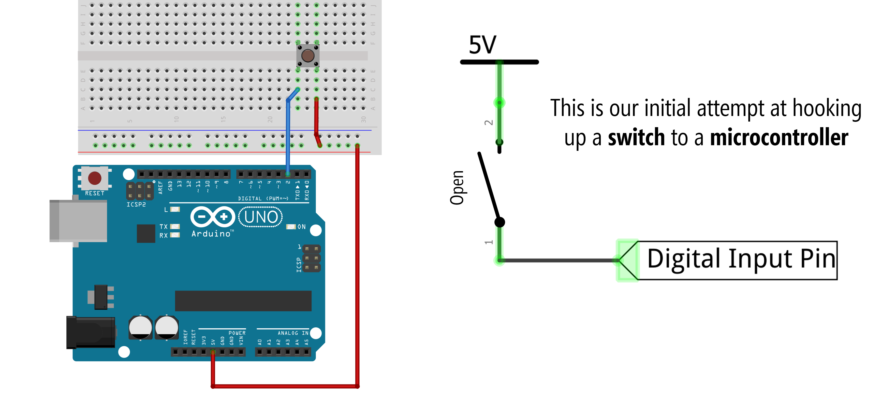
**Figure.** Button circuit for microcontroller hooked up similarly to our non-microcontroller version above. This circuit will "sort of" work but has a problem related to a "floating pin" when the switch is open.
{: .fs-1 }

However, if you do this, what will the digital input pin read when the switch is **open** (that is, when the button is **not** pressed)? Well, this is called a "floating pin" and it's not good. A floating pin is susceptible to randomly oscillating between `HIGH` and `LOW`. See the animation below. <!-- TODO: add in reasons why pin could oscillate -->

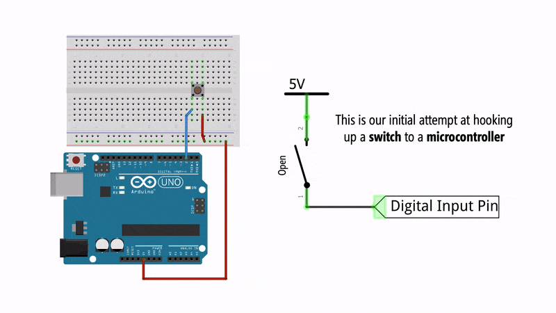
**Figure.** Animation of what happens when you press a button with the simple circuit configuration.
{: .fs-1 }

In fact, try wiring up this configuration yourself and running the following program with the [Serial Monitor](../electronics/serial-print#step-3-open-serial-monitor-in-the-arduino-ide) open. What happens when you press the button? Try touching the button legs with your fingers but not actually pressing the button, what happens to the `digitalRead` value? Are you reliably tracking the button state?


const int INPUT_BUTTON_PIN = 2;
void setup()
{
  pinMode(INPUT_BUTTON_PIN, INPUT);
  Serial.begin(9600); // for printing values to console
}

void loop()
{
  int buttonVal = digitalRead(INPUT_BUTTON_PIN); // returns 0 (LOW) or 1 (HIGH)
  Serial.println(buttonVal);                     // print value to Serial
  delay(5);                                      // small delay
}


Here's a quick video demonstration of what happens—the floating pin problem! Note: we are using a slightly modified version of this code where an LED is turned on if the button is pressed (*i.e.,* if `buttonVal == 1`). This just makes it easier to see the fluctuating button state.

<video autoplay loop muted playsinline style="margin:0px">
  <source src="assets/movies/Arduino_Button_FloatingPinProblem720p.mp4" type="video/mp4" />
</video>
**Video.** Floating pins are digital input pins that are not tied to a specific input voltage (either 0V or 5V) and thus, are subject to electromagnetic interference. Here, the button state is oscillating between `HIGH` and `LOW` simply due to the electromagnetic interference from my body. Makes me feel like Dumbledore! The source code is [here](https://github.com/makeabilitylab/arduino/blob/master/Basics/digitalRead/ButtonPressedFloatingPin/ButtonPressedFloatingPin.ino).
{: .fs-1 }

In the video above, the button state is noisy and vulnerable to electromagnetic interference, which could come from the human body (as it does here), cross-talk between wires, stray capacitance, *etc.* To fix this, we need to **force** the input pin into a known state. But how?

### An (incorrect) attempt to fix the floating pin

To solve the floating pin problem, we need to bias the digital input pin to a known voltage state when the circuit is open (the button is not pressed).

You might try to do this by adding `GND` to the other leg of the button like this:

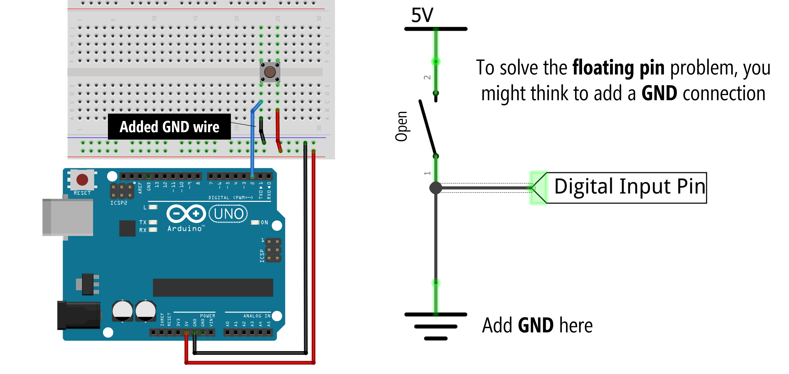
**Figure.** Warning: Do **not** do this. When the switch closes, a short circuit occurs, which could damage your microcontroller or Arduino.
{: .fs-1 }

And you're on the right track. Now, when the switch is open, the digital input pin is in a known voltage state—it reads 0V. But what happens when we actually press the button? Oh no, a short circuit occurs! This could damage your microcontroller and/or Arduino! 

<!-- TODO: expand on why short circuits are bad? -->

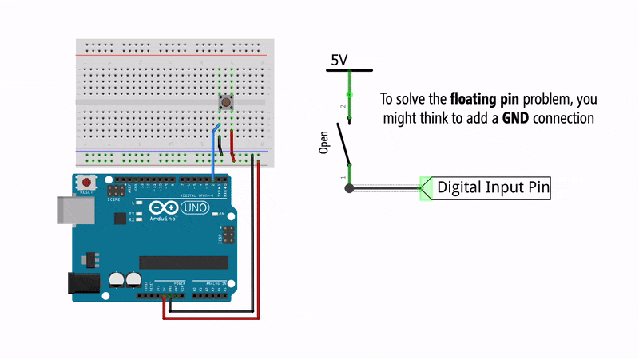
**Figure.** Animation showing the effect of connecting `GND` without a resistor. A short circuit!
{: .fs-1 }

So, what to do? **Pull-down resistors** to the rescue!

### Pull-down resistors

To solve this problem, we can add in what's called a **pull-down resistor** before the GND connection, which prevents short circuits when the switch is closed while still biasing the pin to 0V when the switch is open. 

Typically, this pull-down resistor value is 10kΩ, which is also what the official [Arduino docs](https://www.arduino.cc/en/Tutorial/DigitalPins) recommends. A small resistor is called a **strong** pull-down and a large resistor is called a **weak** pull-down. In a bit, we'll talk about **what** factors influence the pull-down resistor value (hint: use a 10kΩ) but the primary tradeoff is in power efficiency (low resistor values "waste" more current) and function (a large resistor may not always work properly as a pull-down).

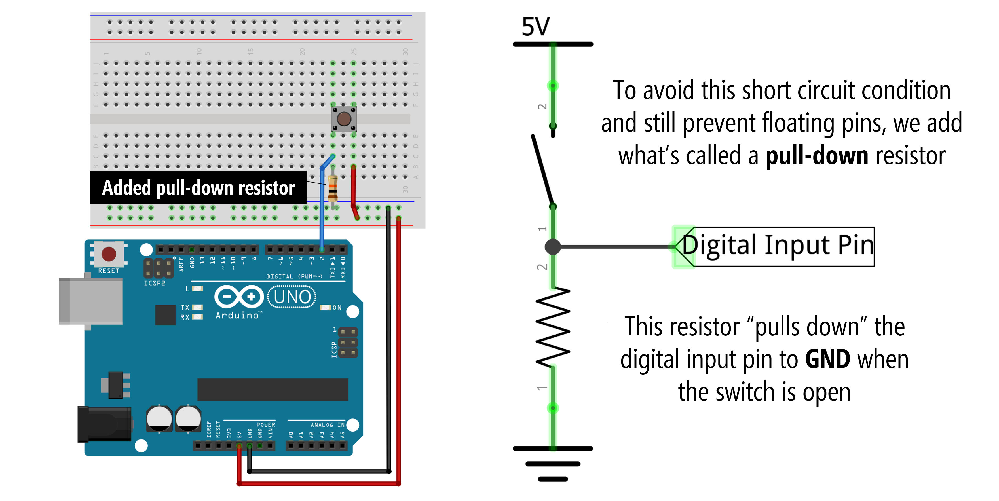
The pull-down resistor is quite large: 10,000Ω (10kΩ)
{: .fs-1 }

Here's an animation showing how a pull-down resistor configuration works:

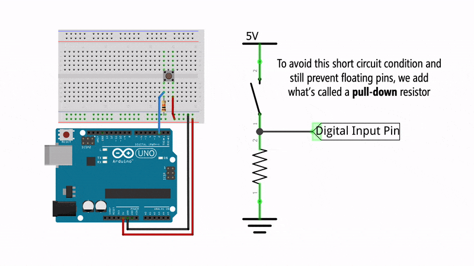

And here's a video demonstrating the floating pin problem and fix:

<iframe width="560" height="315" src="https://www.youtube.com/embed/4qgyICqIVFA" title="YouTube video player" frameborder="0" allow="accelerometer; autoplay; clipboard-write; encrypted-media; gyroscope; picture-in-picture" allowfullscreen></iframe>

### Pull-up resistors

So, what's a **pull-up resistor** then? With a **pull-down resistor** configuration, the input pin is biased to GND when the circuit is in an open state. With a **pull-up resistor** configuration, the resistor moves from the GND side of the circuit to the 5V side and logic is flipped: the input pin is "pulled up" to $$V_{CC}$$ when the switch is open and goes to GND when the switch is closed.

<!-- TODO: insert pull-up resistor animation -->

Pull-up resistor configurations can be confusing because the `HIGH` and `LOW` values are flipped. Now, when the switch is open, the digital input pin is `HIGH`. When the switch closes, the input pin goes `LOW`.

| Switch State | Input pin with pull-down | Input pin with pull-up |
| ------------ | ------------------------ | ---------------------- |
| Open         | `LOW`                    | `HIGH`                 |
| Closed       | `HIGH`                   | `LOW`                  |

For convenience, here are side-by-side diagrams of a pull-down *vs.* pull-up resistor configuration:

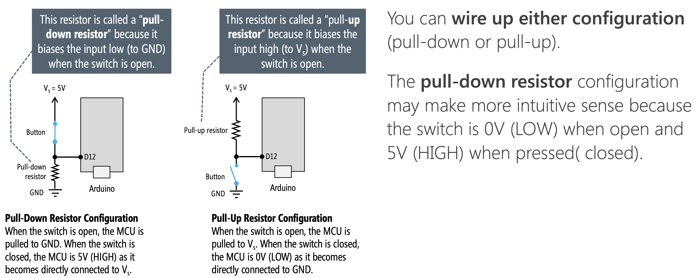 

### Internal pull-up resistors

Finally, many microcontrollers include an internal pull-up resistor that can be activated with software. On the Arduino, we can configure an input pin to use its internal pull-up resistor with: `pinMode(<pin>, INPUT_PULLUP);`. This eliminates the need for any external resistors (thus simplifying your circuit).

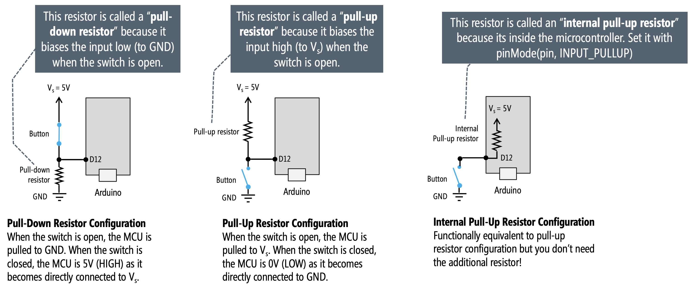

Some microcontrollers have both internal pull-up *and* pull-down resistors. The popular ESP32 chip, for example, used in the [Adafruit Huzzah32](https://learn.adafruit.com/adafruit-huzzah32-esp32-feather/overview) has built-in pull-up and pull-down resistors on all GPIO pins except for GPIO34-GPIO39 (see [link](https://github.com/espressif/arduino-esp32/issues/316)). These can be enabled with either `pinMode(<pin>, INPUT_PULLUP);` or `pinMode(<pin>, INPUT_PULLDOWN);`

<!-- TODO: fix syntax mistake in figure; have its instead of it's in the diagram above -->

<!-- actual diagram of atmega328 with pull-up circled: https://electronics.stackexchange.com/a/296452 -->

### What value should I use for my pull-down or pull-up resistors?

The short answer: use a **10kΩ resistor**. As mentioned above, the official [Arduino docs](https://www.arduino.cc/en/Tutorial/DigitalPins) recommend a 10kΩ pull-down or pull-up resistor for digital input pins. On the ATmega microcontrollers (those on the Arduino Uno and Leonardo), the internal pull-up resistor is 20kΩ. On the Arduino Due, the internal pull-up is between 50kΩ and 150kΩ.

#### Tradeoffs in selecting a pull-up resistor

The longer answer: there are multiple factors to consider, but the primary tradeoff is in selecting a resistor that is small enough to "pull-up" the voltage to `HIGH` when the switch is open but large enough to not "waste" power due to too much current through the resistor when the switch is closed. Remember, a "strong" pull-up is a low-resistance value while a "weak" pull-up is a high-resistance value. Why? Let's read more below.

**Figure.** On the ATmega328, the digital input pin voltage ($$V_{pin}$$) needs to be greater than 3V to quality as `HIGH` and less than 1.5V to qualify as `LOW`. The in-between voltage range (1.5-3V) is undefined.  
{: .fs-1 }

Above, we show two diagrams: one for when the switch is **closed** and the other for when the switch is **open**. We'll walk through each scenario and their relevance to selecting a pull-up resistor. 

##### Scenario 1: Switch is open

When the switch is open (not pressed), we have a leakage current $$I_{IH}$$ into our input pin of $$0.000001A$$ or ($$1µA$$)—as specified in the [ATmega328 datasheet](../assets/datasheets/ATMega328.pdf) (Section 26.2). We can thus calculate the voltage on the input pin ($$V_{pin}$$) using Ohm's Law: $$V_{pin} = V_{in} - I_{IH} * R$$ where $$V_{in}=5V$$, $$I_{IH}=1µA$$, and $$R$$ is our pull-up resistor value. Recall that on the ATmega328, the input voltage needs to be at least $$0.6\cdot V_{CC}\to 0.6\cdot5 V=3V$$ to qualify as `HIGH`. So, we must ensure that our selection of $$R$$ is not so high as to drop below this threshold for $$V_{pin}$$. So, what's the theoretical maximum pull-up resistor value to meet this limit?

$$
V_{pin} = V_{in} - I_{IH} * R \\ 
3V = 5V - 0.000001A * R \\
0.000001A * R = 2V \\
R = 2,000,000Ω = 2MΩ
$$

Using this formula alone to drive our decision, we can determine that $$R$$ should not exceed 2MΩ—which would be a very large (weak) pull-up resistor. 

##### Scenario 2: Switch is closed

When the switch is closed (button pressed), the leakage current of ($$1µA$$) can be ignored as the current is dominated by the $$V_{in}$$ to $$GND$$ branch. And here, the key factor is how much current is flowing when the switch is closed: from Ohm's Law ($$I=\frac{V_{in}}{R}$$), we know that a small resistor will result in more current. We can characterize this as how much power is being dissipated by the resistor—ideally, we want to minimize this. The formula for power is $$P = I \cdot V$$ (in watts), which, using Ohm's Law to replace $$I$$ with $$\frac{V}{R}$$, can be rewritten as $$P = \frac{V^2}{R}$$. Or, in this case, $$P = \frac{V_{in}^2}{R}$$. Given the exponential, when $$R$$ is small, power dissipation is quite large.

##### Calculating tradeoffs in selecting a resistance value

We can use the two formulas from above to determine the the tradeoff in selecting a resistance value for the pull-up resistor $$R$$ and the effect on $$V_{pin}$$ and power dissipation. Given that we are using a 5V microcontroller, we can set $$V_{in}=5V$$.

$$
V_{pin} = V_{in} - I_{IH} * R = 5V - 0.000001A * R \\
P = \frac{V_{in}^2}{R} = \frac{25}{R}
$$

Below, we are graphing these two equations together for varying values of the pull-up resistor $$R$$. For convenience, we've marked the ATmega328 `HIGH` threshold for $$V_{pin}$$ and the 10kΩ $$R$$ value.  

<!-- 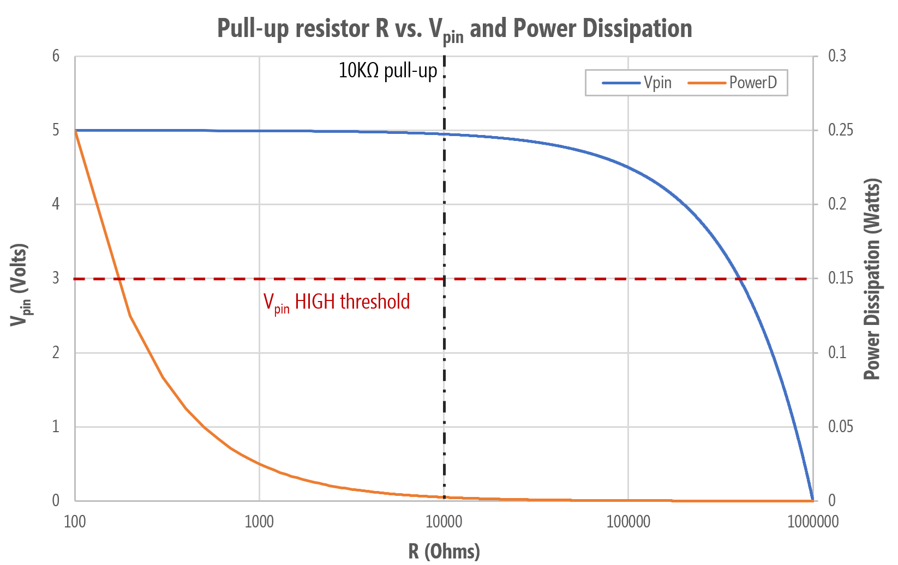
Calculated using $$V_{in}=5V$$ -->

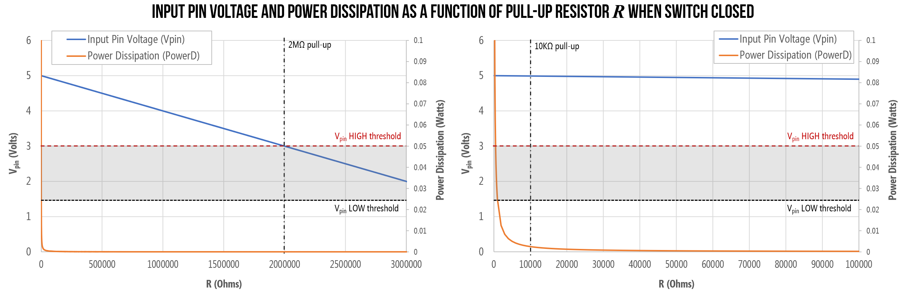
**Figure.** Graphing the input voltage $$V_{pin}$$ and the power dissipation $$P$$ as a function of pull-up resistor value. Both graphs are the same but differ in the x-axis: the right graph zooms in so that you can better see the 10kΩ pull-up value.
{: .fs-1 }

When the switch is closed (button is pressed), with a pull-up resistor of $$R=100Ω$$ (an unnecessarily strong pull-up), we are drawing 50mA (and consuming 250 milliwatts of power)—a non-trivial amount for a battery-powered circuit (*e.g.,* for a mobile or wearable). In contrast, with a 10kΩ pull-up—the recommended value for the ATmega328 microcontroller—we would draw a more reasonable $$I=0.5mA$$ and consume 2.5mW of power.

---

**OTHER FACTORS**

Though beyond the scope of this class, there are other factors to consider as well—for example, including line capacitance and capacitive coupling. For the former, the input line will have some "stray capacitance" to ground, which creates an "RC circuit" that has associated rise and fall times. Larger resistors can slow down the responsiveness of the circuit. But these factors are beyond the scope of our class. See these forum posts for more details: [AVR Freaks](https://www.avrfreaks.net/forum/input-impedance-digital-ios-atmega328p) and ([EE StackExchange](https://electronics.stackexchange.com/questions/23645/how-do-i-calculate-the-required-value-for-a-pull-up-resistor)).

---

#### Tradeoffs in selecting a pull-down resistor

What about pull-down resistors? The same tradeoffs and factors apply here. But instead of $$I_{IH}$$, we need to know the leakage current $$I_{IL}$$ from an input pin to ground. The [ATmega328 datasheet](../assets/datasheets/ATMega328.pdf) specifies the same leakage current for $$I_{IH}$$ and $$I_{IL}$$ as $$1µA$$. 

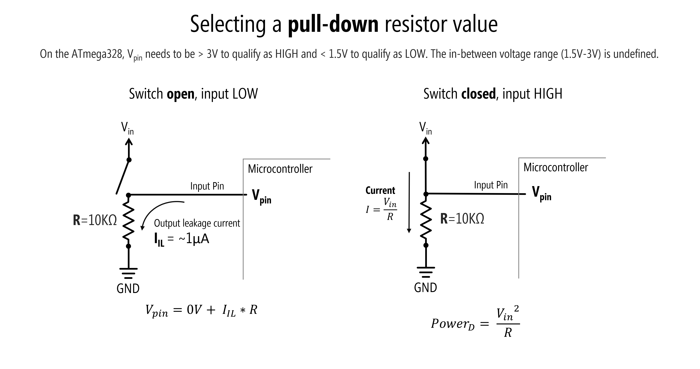

The above sub-sections were strongly informed by Section 12.6.9 entitled "Pullup and Pulldown Resistors" of Scherz and Monk's [Practical Electronics for Inventors](https://learning.oreilly.com/library/view/practical-electronics-for/9781259587559).

### Want to dive deeper?

Still feeling confused or want to learn more about pull-up and pull-down resistors? Try watching this [video](https://youtu.be/wxjerCHCEMg) by AddOhms: 

<iframe width="736" height="414" src="https://www.youtube.com/embed/wxjerCHCEMg" frameborder="0" allow="accelerometer; autoplay; encrypted-media; gyroscope; picture-in-picture" allowfullscreen></iframe>
[Video](https://youtu.be/wxjerCHCEMg) by AddOhms demonstrating floating pins and why pull-up resistors are necessary for digital input with microcontrollers.
{: .fs-1 }

Or this video by NYU ITP's Jeff Feddersen:

<iframe src="https://player.vimeo.com/video/241209240?title=0&byline=0&portrait=0" style="position:absolute;top:0;left:0;width:100%;height:100%;" frameborder="0" allow="autoplay; fullscreen" allowfullscreen></iframe>

[Video](https://vimeo.com/241209240) by NYU ITP’s Jeff Feddersen on pull-up and pull-down resistors.
{: .fs-1 }

See also:
- [Sparkfun's tutorial on Pull-up Resistors](https://learn.sparkfun.com/tutorials/pull-up-resistors/all)
- [Arduino's official `INPUT_PULLUP` tutorial](https://www.arduino.cc/en/Tutorial/InputPullupSerial)
- [Electronics Tutorials' Pull-up Resistors](https://www.electronics-tutorials.ws/logic/pull-up-resistor.html)

## Let's make stuff!

Whew, OK. We've now explained how to use four-legged tactile buttons, how to use pull-down, pull-up, and internal pull-up resistors and their purpose, and provided a general overview of digital input.

It's time to make stuff. We're going to start with a button in a pull-down configuration before making circuits with external pull-up and internal pull-up configurations. Then, in the [next lesson](piano.md), we'll make a simple "piano" synthesizer that puts our skills to the test!

## Pull-down resistor configuration

Let's begin with a pull-down resistor configuration.

### Pull-down resistor wiring diagram

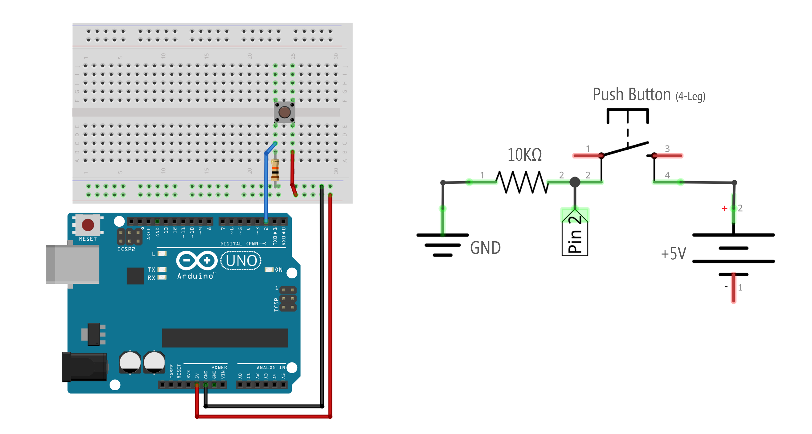

As with any circuit, there are many ways to wire up a button with a pull-down resistor configuration. Here are some examples—all are functionally equivalent. I tend to use the wiring shown on the far left, which is the same one shown above.

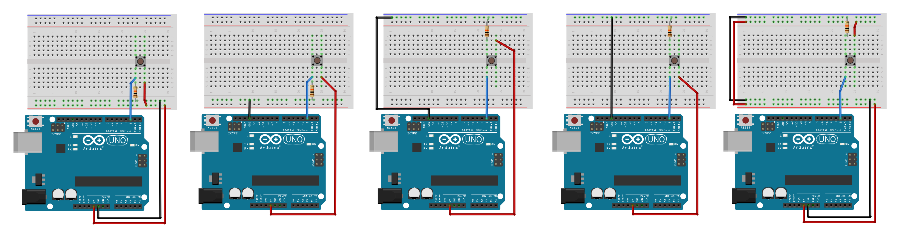

To zoom in on this image, right-click and select 'Open image in a new tab.'
{: .fs-1 }

### Code to turn on LED with button press


const int INPUT_BUTTON_PIN = 2;
const int OUTPUT_LED_PIN = LED_BUILTIN;

void setup()
{
  pinMode(INPUT_BUTTON_PIN, INPUT);
  pinMode(OUTPUT_LED_PIN, OUTPUT);
}

void loop()
{
  // read the state of the pushbutton value
  int buttonState = digitalRead(INPUT_BUTTON_PIN);
  digitalWrite(OUTPUT_LED_PIN, buttonState);
  delay(30);
}


<!-- TODO: show video of this and then also modify code and include serial.print for button state -->

## Pull-up resistor configuration

Here's the wiring for a pull-up resistor configuration. Modify the code above to turn on the LED when the button is pressed.

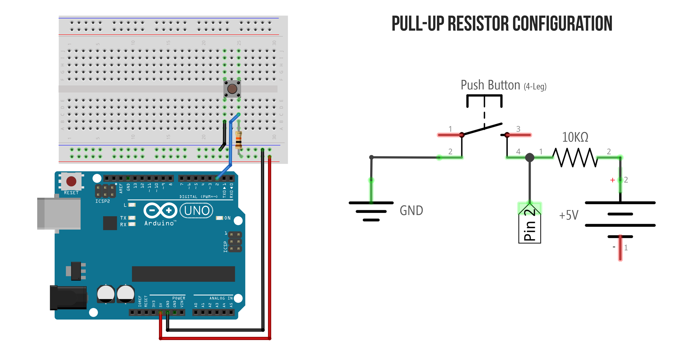

## Internal pull-up resistor configuration

Now try it with the internal pull-up resistor.

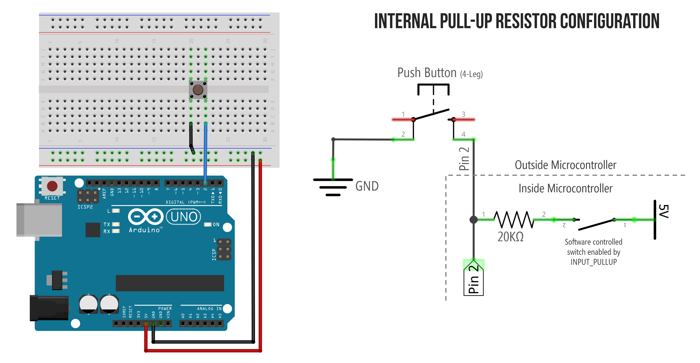

The schematic is for illustrative purposes. The internal software controlled switch is a transistor so the actual circuit looks something like [this](assets/images/Arduino_InputPinWithPullUpResistor_Schematic.png) (from [Lee, Input/output pins on Arduino, Stanford ENGR40M](https://web.stanford.edu/class/archive/engr/engr40m.1178/slides_sp17/arduino-io.pdf))
{: .fs-1 }

## Putting it all together

For your prototyping journals, make a circuit that has three buttons wired to digital input and three corresponding (external) LEDs wired to digital output. Use a different pull-down or pull-up configuration for each button. Then write code to respond accordingly.

<!-- TODO: add code for this and a workbench video showing it working -->

## Next Lesson

In the [next lesson](piano.md), we'll get to apply our newfound digital input skills to build a simple interactive piano with tactile buttons and a piezo buzzer.

[Next: Make a simple piano](piano.md){: .btn .btn-outline }

<!-- ## TODO/Outline
- The button is funky: why four legs? what's connected. Maybe show multimeter?
- We are going to cover three separate circuit designs: pull-down resistor, pull-up resistor, internal pull-up resistor
- Why do we need these resistors. Explain.
- Make pull-down circuit + code
- Make pull-up circuit + code
- Show using internal pull-up + code

## Notes:
Things to remember:
- [done] include Jeff Feddersen video of pull-up and pull-down
- [done] ITP has some good content on switches that we should link to
- show calculation about pull-down and pull-up resistors (and the fact that they should be high to not waste current)
- Talk about super high impedance on input pin?

## References
- [Arduino Internal Pull-up Resistor Tutorial](https://www.baldengineer.com/arduino-internal-pull-up-resistor-tutorial.html), James Lewis

## Tinkercad circuits
- https://www.tinkercad.com/things/9skzhTypQRh-button-with-breadboard/
- https://www.tinkercad.com/things/hlkxqsvSz2E-button-no-breadboard -->