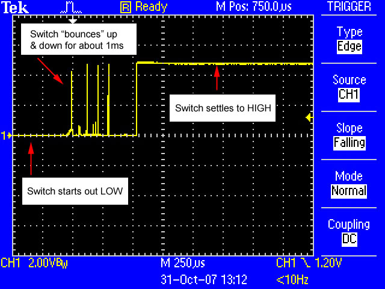
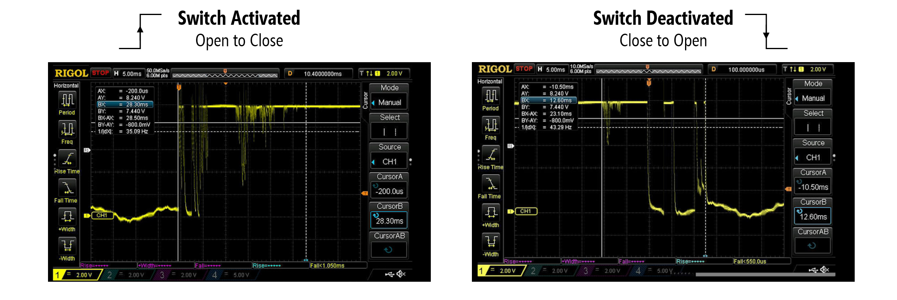
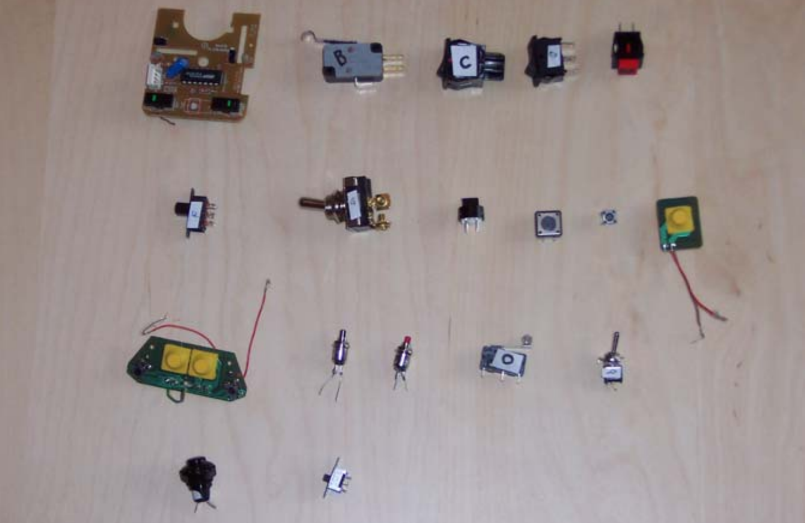
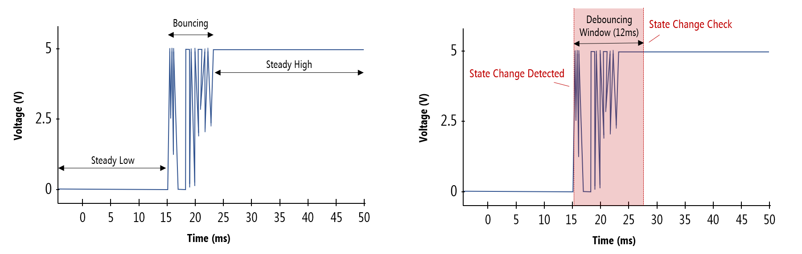
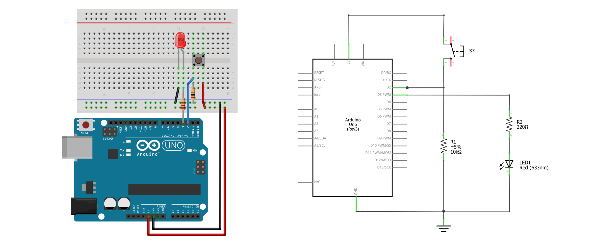
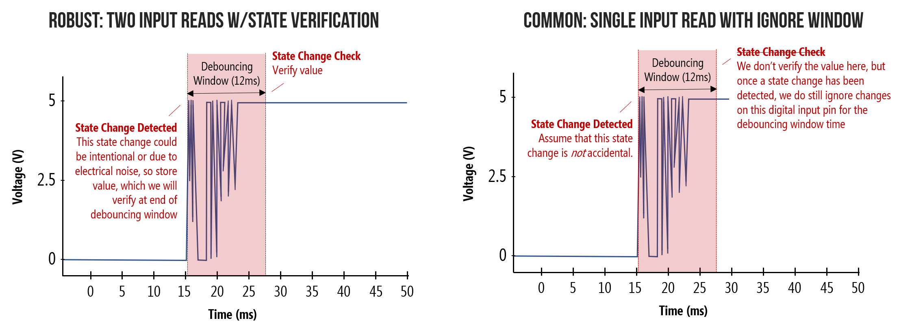

# {{ page.title | replace_first:'L','Lesson '}}
{: .no_toc }

## Table of Contents
{: .no_toc .text-delta }

1. TOC
{:toc}
---

In this lesson, we're going to learn about [contact bouncing ](https://en.wikipedia.org/wiki/Switch#Contact_bounce) (or chatter), a common problem with mechanical switches, buttons, and [relays](https://en.wikipedia.org/wiki/Relay), and how to address it. As electromechanical devices, switch contact points are subject to momentum and elasticity, which act together to create rapid contact oscillations ("bounces") when a switch is "opened" or "closed". As an exaggerated but helpful analog, think of a hammer striking a surface: the hammer will "bounce" with dampened oscillations before entering a steady resting state with a surface.

<video autoplay loop muted playsinline style="margin:0px">
  <source src="assets/movies/DebouncingHammer_CurrentSource_720p-Optimized.mp4" type="video/mp4" />
</video>
**Video**. A slow-motion video of a hammer bouncing off a table to help illustrate how switch contacts bounce before entering a steady state. Video from Episode 37 ["Contact and Bounce"](https://youtu.be/jI-rC2FCKo4) of [The Current Source](https://www.youtube.com/channel/UCw0U6DtO0PHb3l37eKEAdSg) YouTube channel.
{: .fs-1 }

<!--  -->

So, what can you do? The solution is to "debounce" your switches, which can be done via software or [pure hardware solutions](#pure-hardware-solutions), which we'll address below. But first, let's learn a bit more about the problem before discussing solutions. We're going to use the term 'switch' to refer to any class of electromechanical device that has electrical contact points that can mechanically move to open or close an electrical circuit.

## The contact bouncing problem

[The Current Source](https://www.youtube.com/channel/UCw0U6DtO0PHb3l37eKEAdSg) recorded slow motion videos of switches bouncing during activations and deactivations. Just like the hammer, this electrical contact visibly bounces when first activated, creating a noisy contact signal.

<video autoplay loop muted playsinline style="margin:0px">
  <source src="assets/movies/DebouncingButton_CurrentSource_720p-Optimized-WithLabels.mp4" type="video/mp4" />
</video>
**Video**. A slow-motion video of a switch mechanically bouncing off its contacts. Buttons are mechanical devices. When a button is pressed or a contact switch moved, it creates a rapid oscillation of open- and closed-circuits before settling to its final state. In comparison to computation, mechanical motion is slow. Microcontrollers—even old, slow ones like the ATmega328—work so fast that they will read these rapid oscillations as `HIGH` and `LOW` input state changes. Video from Episode 37 ["Contact and Bounce"](https://youtu.be/jI-rC2FCKo4) of [The Current Source](https://www.youtube.com/channel/UCw0U6DtO0PHb3l37eKEAdSg) YouTube channel.
{: .fs-1 }

When you press a button or slide a switch, you are interacting with an electro-mechanical device. There is a **physical** mechanism moving to close a connection. When a switch/button first hits its contact point, it does not immediately stick. Instead, it rapidly "bounces" back and forth before eventually settling into a steady state (see animation above). This "bouncing" action only takes a few milliseconds (rarely more) but can cause problems if you naively assume that every contact is a new button press.

### Contact bounce signal on an oscilloscope

Indeed, if you look at a switch signal with an oscilloscope, you can see the "bouncing" action—the voltage rapidly fluctuates between `LOW` (0V) and `HIGH` (5V) before finally settling into its steady state of `HIGH`. If you counted each of these fluctuations as a button press, you would have very erroneous input!

{: .mx-auto .align-center }
**Figure.** Image from [ladyada.net](https://www.ladyada.net/learn/arduino/lesson5.html)
{: .fs-1 }

### Do switches bounce both when closing and opening?

Yes! Take a look at the bouncing graphs below from an oscilloscope reading of both a switch activation (open to close) and deactivation (close to open). Depending on the switch type, the bouncing action may be more extreme for either action.

**Figure.** Switches can bounce during both closing and opening operations. Image derived from [The Current Source](https://youtu.be/jI-rC2FCKo4).
{: .fs-1 }

### How long do switches bounce?

So, how long do buttons bounce for? The answer: it varies depending on the switch type.

Thankfully, we have [Jack Ganssle](http://www.ganssle.com/), an expert in embedded systems, to help answer this question. He painstakingly tested nearly twenty different switches ranging from cheap joystick and old mouse buttons to toggle and slide switches (see figure below). For each switch, he hooked up their contact signals to an oscilloscope, individually pressed them 300 times, and logged the min and max amount of bouncing for both *closing* and *opening* activations. The results of his research are documented [here](https://my.eng.utah.edu/~cs5780/debouncing.pdf).

**Figure.** Switches tested by Jack Ganssle in his "switch bouncing" experiences ([source](https://my.eng.utah.edu/~cs5780/debouncing.pdf)).
{: .fs-1 }

In sum, most switches exhibited an average of 1.5 milliseconds (ms) of bouncing; however, two outlier switches exceeded 6.2ms. The worst  was a red pushbutton, which had an *open* bounce of 157ms but only 20 microseconds (μs) on close. Interestingly, each switch seemed to have its own "bounce pattern" off rapid oscillations.

### What happens if we don't debounce?

I made a [small test program](https://github.com/makeabilitylab/arduino/blob/master/Basics/digitalRead/DebounceTest/DebounceTest.ino) to help illustrate how problematic contact bouncing can be. I have a simple button circuit (like [this one](assets/images/ArduinoButtonPlusLEDCircuit.png)), which turns on a red LED when pressed.

I am tracking both **non-debounced button presses** ("raw" button presses) and **debounced button presses**. In the video, you'll observe how errant the non-debounced button press count gets (shown with the blue line)!

<iframe width="736" height="414" src="https://www.youtube.com/embed/tw-pndJQFqw" title="YouTube video player" frameborder="0" allow="accelerometer; autoplay; clipboard-write; encrypted-media; gyroscope; picture-in-picture" allowfullscreen></iframe>

**Video.** A video demonstrating the importance of debouncing your buttons. We track the number of "raw" button presses (in blue) and the number of debounced button presses (in red) and plot the values in Serial Plotter.
{: .fs-1 }

## Debouncing solutions

Like with many problems involving microcontrollers and circuit, there are multiple solution approaches including those that rely purely on software, on hardware, or some combination of both. In this lesson, we'll primarily focus on software solutions but briefly describe a common hardware solution below.

### Pure hardware solutions

Although in physical computing, we often emphasize software solutions, hardware solution can be just as functionally good (though it does complicate the build and require more components). For example, in this Texas Instruments video, the instructor shows how to use a capacitor and a [Schmitt Trigger](https://en.wikipedia.org/wiki/Schmitt_trigger) to debounce a switch. The capacitor smooths out the the rising and falling edges of a button state transition and the Schmitt Trigger converts this smoothed signal back into digital output.

<iframe width="736" height="414" src="https://www.youtube.com/embed/e1-kc04jSE4" title="YouTube video player" frameborder="0" allow="accelerometer; autoplay; clipboard-write; encrypted-media; gyroscope; picture-in-picture" allowfullscreen></iframe>
**Video.** This [Texas Instruments video](https://youtu.be/e1-kc04jSE4) shows how to use a capacitor and a Schmitt Trigger to debounce a switch.
{: .fs-1 }

### Software solution

So, how do we solve debouncing in software? The key is to first detect a switch state change (let's call this `state1`), then wait for a set amount of time (a "debouncing window"), then check the switch state again (let's call this `state2`). If the initial state and the post-debouncing window state match (*i.e.,* `state1 == state2`), then we can confidently conclude that the switch has transitioned from one steady state to another. See graph below.

**Figure.** Both graphs are showing the same open-to-close switch state change but with different annotations. The graph on the left highlights the first steady state (`LOW`), the transition and bouncing contact state, and the second steady state (`HIGH`). The graph on the right shows a depiction of our "debouncing window", which is key to the software solution. Image made in PowerPoint.
{: .fs-1 }

#### What should our debounce window be?

So, how long should you set your debounce window? This depends on the switch type and on the expected use of your switch. Is it an occasionally-used toggle switch, a keyboard (a fast typist can generate ~10 characters/second), or a joystick button (button mashing anyone!?)?

As a second consideration, what's a human perceptible amount of lag? Wikipedia suggests that "input lag"—from controller input to display response—of ~200ms are perceptible and distracting and that "quick twitch" games like [first-person shooters](https://en.wikipedia.org/wiki/First-person_shooter) and [fighting games](https://en.wikipedia.org/wiki/Fighting_game) have response times of 67ms. Similarly, [Ganssle suggests](https://my.eng.utah.edu/~cs5780/debouncing.pdf) that, in his tests, a 100ms delay is noticeable but 50ms seems instantaneous. 

## Making a debounced button circuit+software solution

Let's build the following test circuit and then walk through some possible software solutions to debouncing.

**Figure.** The button-based circuit. Image made in Fritzing and PowerPoint.
{: .fs-1 }

### Materials

Just like with the [buttons](buttons.md) lesson, we'll need the following materials:

| Breadboard | Arduino | LED | Resistor | Button |
|:-----:|:-----:|:-----:|:-----:|:-----:|
|  |  |  |  |  |
| Breadboard | Arduino Uno, Leonardo, or similar  | Red LED | 220Ω Resistor | [12x12mm "Tactile Switch Buttons"](https://www.adafruit.com/product/1119) |

### Debouncing solution 1: using delays

For our first and most basic solution, we will read the button state, wait a given time period (the "debouncing window"), and then read the button state again. Notably, you should minimize the debouncing window while still satisfying the steady state requirement.

We're going to use [`delay`](https://www.arduino.cc/reference/en/language/functions/time/delay/) here to wait for the "debouncing window" time period, which we already know should generally be avoided but is sometimes helpful and appropriate (if it's not negatively impacting the responsiveness of your program, for example).



const int BUTTON_INPUT_PIN = 2;
const int LED_OUTPUT_PIN = 3;
const int DEBOUNCE_WINDOW = 40; // in milliseconds

int _savedButtonVal = LOW; //starts low because using pull-down resistor

void setup() {
  pinMode(BUTTON_INPUT_PIN, INPUT);
  pinMode(LED_OUTPUT_PIN, OUTPUT);
}

void loop() {

  // Read the button value. We assume a pull-down resistor button configuration so
  // the button will be HIGH when pressed and LOW when not pressed
  int buttonVal = digitalRead(BUTTON_INPUT_PIN);

  // Wait to check the button state again
  delay(DEBOUNCE_WINDOW);

  // read the button value again
  int buttonVal2 = digitalRead(BUTTON_INPUT_PIN);

  // If buttonVal and buttonVal2 are the same, then we are in steady state
  // If this stead state value does not match our _lastButtonVal, then
  // a transition has occurred and we should save the new buttonVal
  // This works both for open-to-close transitions and close-to-open transitions
  if(buttonVal == buttonVal2 && _savedButtonVal != buttonVal){
    _savedButtonVal = buttonVal;
  }

  // Write out HIGH or LOW
  digitalWrite(LED_OUTPUT_PIN, _savedButtonVal);
}


This [source code](https://github.com/makeabilitylab/arduino/blob/master/Basics/digitalRead/DebounceWithDelays/DebounceWithDelays.ino) is on GitHub.
{: .fs-1 }

<!-- From: https://github.com/makeabilitylab/arduino/tree/fd5a1403148cd98b7dcfa3a3be2ab64e0d231b76/RedBearDuo/RedBearDuoReadButtonSimpleDebouncing -->

### Debouncing solution 2: using timestamps

Just as we did for our [rate blinking LEDs](led-blink3.md) lesson, we can modify the above program to **eliminate delays** and simply use timestamps to track state transitions. Indeed, this is how the official Arduino debounce tutorial works ([link](https://www.arduino.cc/en/Tutorial/BuiltInExamples/Debounce)). Before looking at our solution, can you come up with your own?

### Debouncing solution 3: softening requirements

For the two debouncing solutions above, we observed an initial state change on our digital input pin (`state1`) and then, after some time period (the debouncing window), we verified this state change via a second read to the digital input pin (`state2`). This approach protects against contact bounce, errant button presses (of time less than the debouncing window), and electrical interference (*e.g.,* electric static discharge that cause transient digital input pin changes).

However, if we soften our requirement and assume that the `state1` change was correct and not some errant signal, then we can apply a few other solutions. In these cases, we do **not read** from the digital input pin **again** after the debouncing window but, instead, simply ignore input for that time period.

**Figure.** Two approaches to debouncing buttons.
{: .fs-1 }

This solution is nicely captured by user [cdvma](https://www.reddit.com/r/embedded/comments/gf74p8/reliable_user_input_with_unreliable_physical/fprrygg?utm_source=share&utm_medium=web2x&context=3) on the [r/embedded](https://www.reddit.com/r/embedded/) sub-reddit:

> I have learned two truths when it comes to debouncing:
>
> 1. Buttons don't push themselves
>
> 2. Humans can't do repeated button presses faster than 30 ms
>
> So my go-to to avoid tuning things for various mechanical buttons has been:
>
> 1. As soon as the GPIO state changes to active, you declare the button is pressed (due to rule #1 above).
>
>2. Ignore all further input on that button for 30 ms.
>
> 3. Go back to step #1.
>
> This allows for interrupt-driven input and has zero delay between user action and input processing because you don't wait the debounce period before declaring it pressed. It is important to have that low delay in highly reactive control surfaces (games).
>
> The downside is that it won't work if you need to pass regulatory ESD testing.
{: .fs-4 }

Here's a quick implementation:



const int BUTTON_INPUT_PIN = 2;
const int LED_OUTPUT_PIN = 3;
const int DEBOUNCE_WINDOW = 40; // in milliseconds

int _savedButtonVal = LOW; //starts low because using pull-down resistor

void setup() {
  pinMode(BUTTON_INPUT_PIN, INPUT);
  pinMode(LED_OUTPUT_PIN, OUTPUT);
}

void loop() {

  // Read the button value. We assume a pull-down resistor button configuration so
  // the button will be HIGH when pressed and LOW when not pressed
  int buttonVal = digitalRead(BUTTON_INPUT_PIN);

  // Check for state change in button input
  if(_savedButtonVal != buttonVal){
    _savedButtonVal = buttonVal;

    // Delay here for a very short time to ensure we get passed
    // the debouncing period. Obviously, you could (and should) do this
    // without a delay() call by simply tracking timestamps
    delay(DEBOUNCE_WINDOW); 
  }

  // Write out HIGH or LOW
  digitalWrite(LED_OUTPUT_PIN, _savedButtonVal);
}


This solution is less robust but works well for human input in environments with limited electrical noise (see this [Reddit discussion](https://www.reddit.com/r/embedded/comments/gf74p8/reliable_user_input_with_unreliable_physical/fprrygg?utm_source=share&utm_medium=web2x&context=3)). However, as is pointed out in the Reddit thread ([link](https://www.reddit.com/r/embedded/comments/gf74p8/reliable_user_input_with_unreliable_physical/fpw7xpf?utm_source=share&utm_medium=web2x&context=3)), this simple solution does not protect against electrostatic discharge (ESD) and thus fails regulatory requirements (which require the two state reads like we did in Solutions 1 and 2).

### Reflecting on our solutions

Debouncing a single button is relatively simple but our state tracking code does not scale well to multiple buttons (it would look very messy). So, what should we do?

This problem is very similar to our state tracking issue for [rate blinking LEDs](led-blink3.md). For that, we developed an object-oriented approach called [`Blinker`](led-blink3.md##multi-rate-blinking-an-object-oriented-approach). Similarly, we could develop a `Button` class that works largely the same way—and could even have special features like tracking *double clicks*, *long presses*, etc.

Indeed, there are a number of custom `Button` classes online for Arduino, including:

- kristianklein's [PushButton Arduino Button Library](https://github.com/kristianklein/PushButton), which supports debouncing, double clicking, and long presses

- JChristensen's [JC_Button Arduino Button Library](https://github.com/JChristensen/JC_Button), which includes debouncing support

- ThomasGravekamp's [Arduino Debounced Switched Library](https://github.com/ThomasGravekamp/Arduino-Debounced-Switch), which includes support for callback functions when a trigger state is reached.

As a disclaimer, I have not tested these libraries myself but please do peruse them (to learn about how they work) and try them out yourself, if you'd like.

### Other solutions

There are many other software debouncing solutions, including using [interrupts](https://www.arduino.cc/reference/en/language/functions/external-interrupts/attachinterrupt/). For example, here's a version we made for the Redbear Duo boards (https://github.com/makeabilitylab/arduino/blob/master/RedBearDuo/RedBearDuoButtonInterruptWithDebouncing/RedBearDuoButtonInterruptWithDebouncing.ino). See [Resources](#resources) below.

## Activity

For your prototyping journals, modify your [piano code](https://github.com/makeabilitylab/arduino/blob/master/Basics/digitalRead/SimplePiano/SimplePiano.ino) from the [previous activity](piano.md) to use debouncing. You can use one of the aforementioned button classes or roll your own solution. Do you notice anything different? Why or why not?

<!-- ## Solution 3
Uses interrupts. Assumes any initial state change is not spurious but due to human input.

https://github.com/makeabilitylab/arduino/blob/fd5a1403148cd98b7dcfa3a3be2ab64e0d231b76/RedBearDuo/RedBearDuoButtonInterruptWithDebouncing/RedBearDuoButtonInterruptWithDebouncing.ino 

Problem is: is susceptible to electromagnetic interference (ESD testing) but is simple

-->

<!-- ## Outline
- [Done] Describe problem and include snippets (or animated gifs) of videos we typically show in class
- [Done] Talk about potential solutions
- [Done] Show off the simplest: just check value wait for some amount of time and then check value again (using sleep)
- [Done] Show and talk about test code that shows why debouncing is important (maybe with video?). Could have top-down video of OLED display showing counting differences. Update: had video with serial monitor.
- [done] Introduce class to do debouncing for us (and other things like deal with both pull-down and pull-up resistor configs)
  - Maybe talk about callback functions for handling buttonDown vs. buttonUp events? Or even like double click?
  - Some potential libraries to check out:
    -  [PushButton](https://github.com/kristianklein/PushButton) (looks quite nice)
    -  [SensorToButton](https://github.com/nathanRamaNoodles/SensorToButton) includes setting thresholds to interpret sensor states as "button" triggers
    -  [DebounchedSwitch](https://github.com/ThomasGravekamp/Arduino-Debounced-Switch) uses callback functions
 -  Consider also showing how to use a tilt switch? (just as another example digital input?)
 -  [Done] There are also hardware solutions using, for example, RC circuits (could include links?) -->

## Resources

There are lots of debouncing resources and various solutions covered online and in the literature:

- [Chapter 13: Microcontrollers - Debouncing](https://learning.oreilly.com/library/view/practical-electronics-for/9781259587559/xhtml/24_Chapter_13.xhtml), Scherz and Monk, Practical Electronics for Inventors

- [Debounce Code: One Post To Rule Them All](https://hackaday.com/2010/11/09/debounce-code-one-post-to-rule-them-all/), Hackaday

- [Switch Bounce and How to Deal with It](https://www.allaboutcircuits.com/technical-articles/switch-bounce-how-to-deal-with-it/) Jens Christoffersen at [allaboutcircuits.com](https://www.allaboutcircuits.com/)

- [Reliable User Input with Unreliable Physical Switches](https://www.reddit.com/r/embedded/comments/gf74p8/reliable_user_input_with_unreliable_physical/), Reddit discussion

- [Debounce](https://www.arduino.cc/en/Tutorial/BuiltInExamples/Debounce), Official Arduino tutorial

## Next Lesson

In the [next lesson](potentiometers.md), we'll move beyond digital input to the far more exciting and flexible world of analog input!

[Previous: Building a piano](piano.md){: .btn .btn-outline }
[Next: Using potentiometers](potentiometers.md){: .btn .btn-outline }
