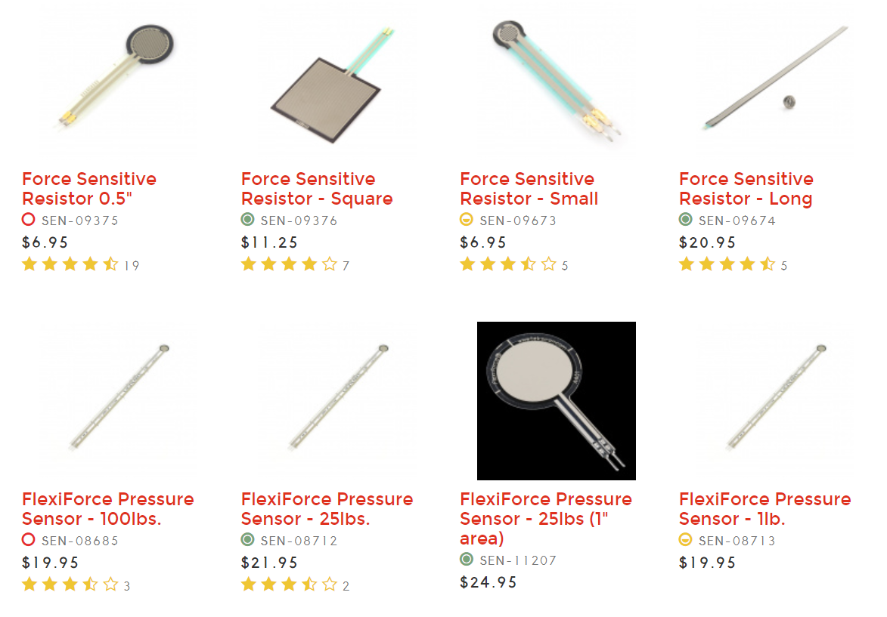
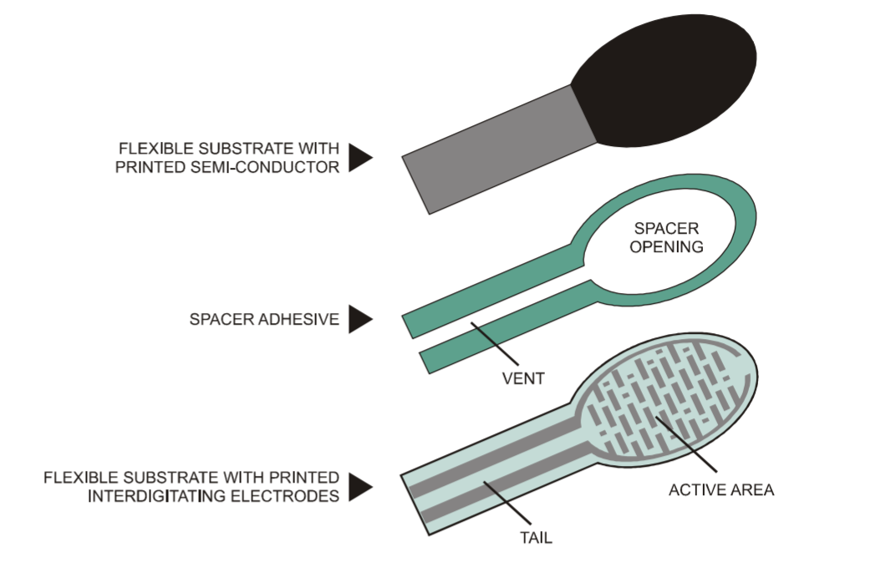
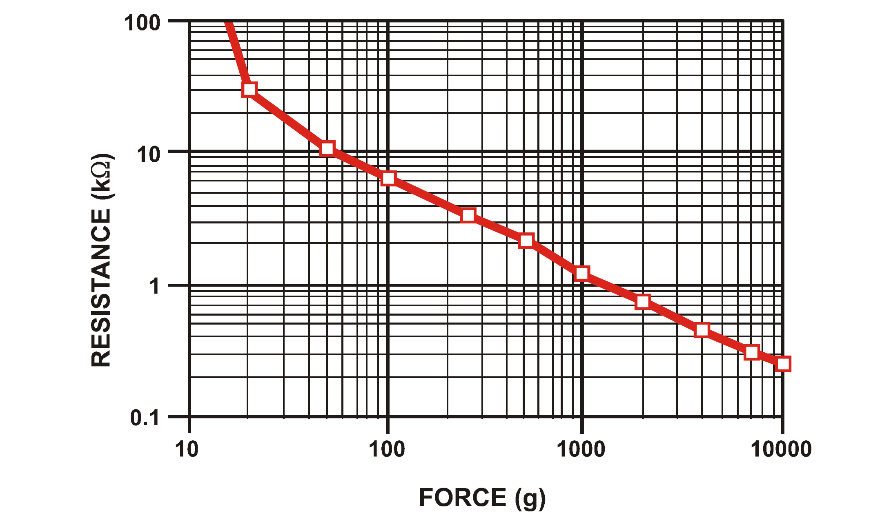
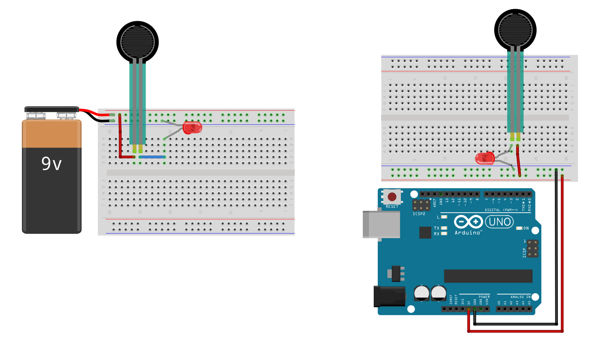
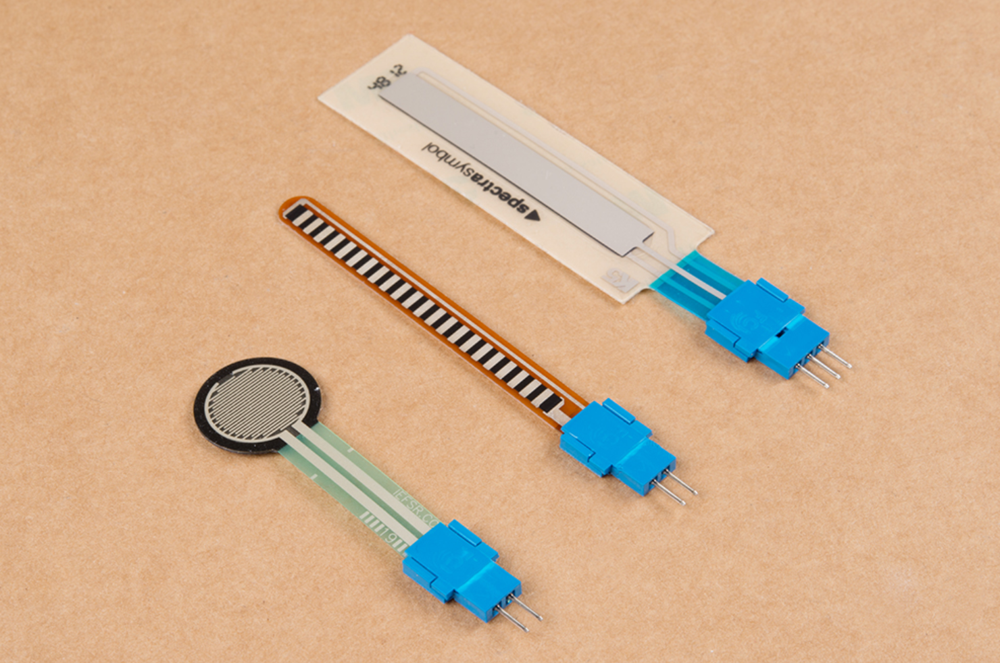
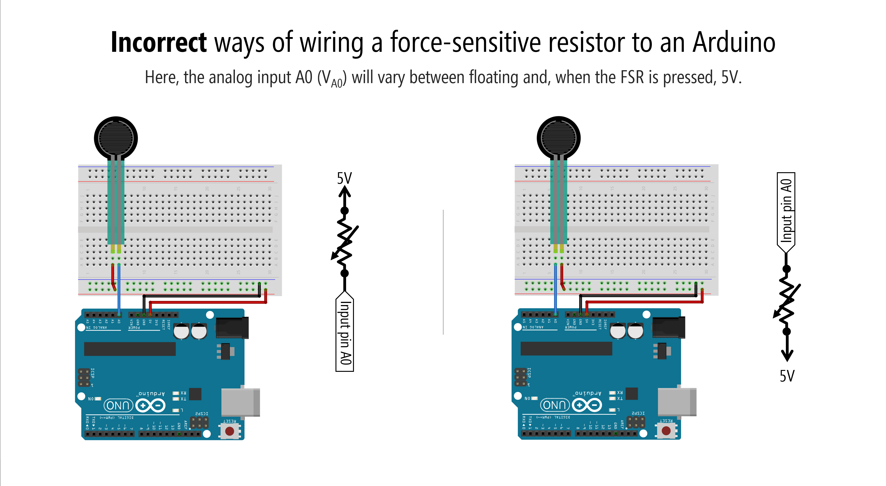
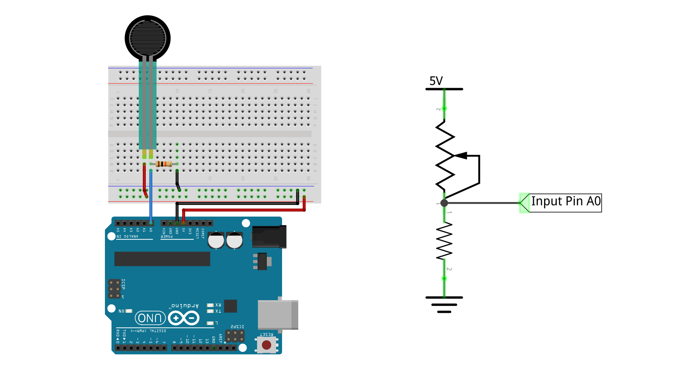
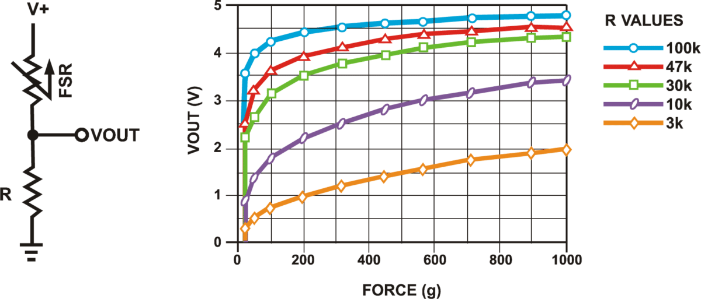
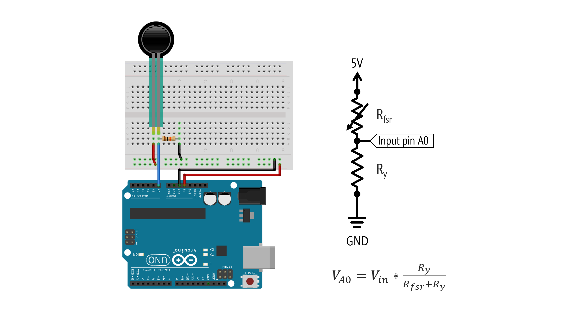
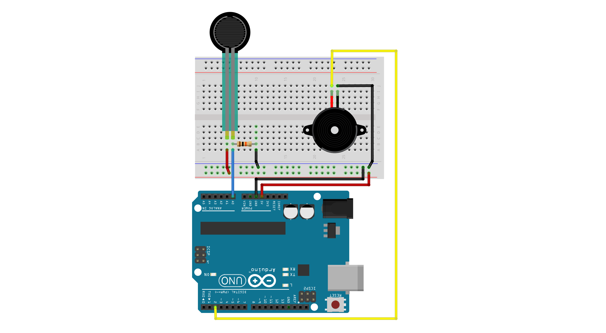

# {{ page.title | replace_first:'L','Lesson '}}
{: .no_toc }

## Table of Contents
{: .no_toc .text-delta }

1. TOC
{:toc}
---

In this lesson, you'll learn about force-sensitive resistors (FSRs) and how to use FSRs and two-legged variable resistors more generally with microcontrollers. We'll conclude with building a "force-sensitive" musical instrument—very Jedi-like!

This lesson directly builds on the prior one ([potentiometers](potentiometers.md)), so definitely complete that first.

**Figure.** Animation shows how the resistance of the FSR drops with applied pressure (higher pressure, lower resistance, brighter LED).
{: .fs-1 }

## Materials

We'll need the following materials:

| Breadboard | Arduino | FSR | Resistor | Piezo Buzzer |
|:-----:|:-----:|:-----:|:-----:|:-----:|
|  |  |  |  |  |
| Breadboard | Arduino Uno, Leonardo, or similar  | [Force-Sensitive Resistor](https://www.adafruit.com/product/166) | 10kΩ Resistor | [Piezo Buzzer](https://www.mouser.com/ProductDetail/810-PS1240P02BT) |

## Force-sensitive resistors (FSRs)

Force-sensing (or force-sensitive) resistors (FSRs) are two-legged variable resistors that **decrease** in resistance with an **increase** in applied force. 

FSRs can differ in size, shape, and force sensing sensitivity. There are a variety form factors, including square and circular (which host the active sensor area). In our hardware kits, we typically purchase and provide the popular [Interlink FSR 402]({{ site.baseurl }}/assets/datasheets/ForceSensitiveResistor_InterlinkFSR402_2010-10-26-DataSheet-FSR402-Layout2.pdf) (either from [Sparkfun](https://www.sparkfun.com/products/9375) or [Adafruit](https://www.adafruit.com/product/166)), which is the product in the upper-left below.

Prices and products from [Sparkfun.com](https://learn.sparkfun.com/tutorials/force-sensitive-resistor-hookup-guide/all)
{: .fs-1 }

### FSR applications

What can we do with FSRs?

The [FSR 402 datasheet]({{ site.baseurl }}/assets/datasheets/ForceSensitiveResistor_InterlinkFSR402_2010-10-26-DataSheet-FSR402-Layout2.pdf) describes a number of example applications, including:
- **Detecting human interaction.** Sense whether a touch is accidental or intentional by a reading force (or other signal processing)
- **Using force for UI feedback.** Detect user's touch force to make a more intuitive interface
- **Enhancing tool safety.** Differentiate a grip from a touch as a safety lock
- **Finding centroid of force.** Use multiple sensors to determine centroid of force
- **Detecting presence, position, or motion** Sense a person/patient in a bed, chair, or medical device
- **Detecting liquid blockage.** Detect tube or pump occlusion or blockage by measuring back pressure

While FSRs respond to force, they are not precision measurement instruments like [load cells](https://learn.sparkfun.com/tutorials/getting-started-with-load-cells) or [strain gauges](https://learn.sparkfun.com/tutorials/getting-started-with-load-cells/strain-gauge-basics), so use those if you want to precisely measure weight, load, or strain.

<!-- TODO: in future, include papers from HCI and UbiComp with pressure sensors -->

### How do FSRs work?

How do FSRs actually work? Their construction is quite simple. There are three layers: the top and bottom layers are conductive and the middle layer provides a "thin air gap" that separates the two. When the two conductive layers are pressed together, electrical pathways are made. The harder you press, the more connections. And the more connections, the less resistance. See the FSR construction diagram from Interlink below:

Diagram from the Interlink FSR [Integration Guide]({{ site.baseurl }}/assets/datasheets/ForceSensitiveResistor_Interlink_IntegrationGuide.pdf)
{: .fs-1 }

<!-- TODO: in future, consider adding in a second diagram that shows how the connections in the "active area" are made when the top layer comes down? -->

### FSR force-resistance graph

So, what exactly is the relationship between an FSR's resistance and an applied force?

A graph of the force (g) vs. resistance (kΩ) of the FSR 402 is shown below (plotted on a log-log scale). As can be observed from the graph, the FSR has two response phases: 

1. An initial "break force" or "turn on threshold" that dramatically swings the resistance from >10MΩ to roughly 10kΩ
2. After this threshold, the FSR resistance becomes inversely proportional to the applied force (following an inverse power-law characteristic).  

At the high-end of the force range (greater than 1000g), the FSR saturates and does not continue to drop resistance.

A graph of the force (g) vs. resistance (kΩ) plotted on a log-log scale for the Interlink FSR 402. Graph from the [Interlink FSR Integration Guide]({{ site.baseurl }}/assets/datasheets/ForceSensitiveResistor_Interlink_IntegrationGuide.pdf).
{: .fs-1 }

For more details, see the Interlink [FSR 402 datasheet]({{ site.baseurl }}/assets/datasheets/ForceSensitiveResistor_InterlinkFSR402_2010-10-26-DataSheet-FSR402-Layout2.pdf) and [Integration Guide]({{ site.baseurl }}/assets/datasheets/ForceSensitiveResistor_Interlink_IntegrationGuide.pdf).

## Making an LED dimmer with an FSR

Let's make something!

To begin, just like we did with the [buttons](buttons.md) and [potentiometers](potentiometers.md) lessons, we'll make a simple LED circuit without a microcontroller. In fact, this circuit will be the exact same as the "rheostat" potentiometer circuit [here](potentiometers.md#build-the-potentiomer-based-led-dimmer) (but we'll replace the rheostat with an FSR).

Below, we show two possible wiring diagrams: the first (preferred) shows the FSR circuit powered by a 9V battery while the second shows power derived from the 5V and GND pins on the Arduino. (Again, we prefer the former just to further emphasize that at this point, we're not using microcontrollers!)

Two wiring options of an FSR using a breadboard. Like typical resistors, FSRs can be inserted into your circuits in either direction.
{: .fs-1 }

With the 9V wiring, we include a backup resistor; however, with the 5V wiring (with Arduino), we do not. This is because both the [FSR 402 datasheet]({{ site.baseurl }}/assets/datasheets/ForceSensitiveResistor_InterlinkFSR402_2010-10-26-DataSheet-FSR402-Layout2.pdf) and our own empirical use demonstrate that even with significant force (roughly 1,000g according to the datasheet), the FSR still has ~200Ω-500Ω of resistance. So, while a potentiometer may drop to 0Ω at the lowest setting, the FSR does not, and thus does not require a backup resistor.

For the 9V wiring, if we assume the red LED's $$V_f=2V$$ and the lowest FSR resistance of 200Ω, then $$I=\frac{9V-2V}{200Ω}=35mA$$, which exceeds the max current of the LED. We thus added a 470Ω backup resistor to be safe. So, $$I=\frac{9V-2V}{200Ω + 470Ω}=10.4mA$$.

### Positioning FSR on breadboard

The two contact legs are 2.54mm apart (0.1"), so should fit snugly into your breadboard. Just like a traditional resistor, the FSR can be inserted in either direction.

Image from [Sparkfun.com](https://learn.sparkfun.com/tutorials/force-sensitive-resistor-hookup-guide/all#res).
{: .fs-1 }

If you want a more permanent connection, see this [fantastic guide](https://learn.sparkfun.com/tutorials/force-sensitive-resistor-hookup-guide/all#hardware-assembly) from Sparkfun on soldering FSRs (difficult) or using Amphenol FCI Clinchers (recommended):

Image from [Sparkfun.com](https://learn.sparkfun.com/tutorials/force-sensitive-resistor-hookup-guide/all#hardware-assembly) showing Amphenol CFI clincher connectors installed on the FSR's legs.
{: .fs-1 }

### Workbench video of completed circuit

Once you've made the circuit, have fun playing with the FSR. Get a sense of its responsiveness and how hard you have to press.

Here's a workbench video of our completed circuit (this is the same video as the one in the [potentiometers](potentiometers.md) lesson, so there is a backup resistor):

<iframe width="736" height="414" src="https://www.youtube.com/embed/YMCqDcnwMYo" frameborder="0" allow="accelerometer; autoplay; encrypted-media; gyroscope; picture-in-picture" allowfullscreen></iframe>
Workbench video of the FSR LED dimmer circuit
{: .fs-1 }

## Using FSRs with microcontrollers
OK, now that you've gained some experience with FSRs and understand how to use them *without* a microcontroller, let's explore how to use them *with* a microcontroller.

First, like usual, we'll show you the wrong way to hook up a component to a microcontroller:

Why doesn't this work?

Recall from our [potentiometers](potentiometers.md) lesson, microcontrollers read voltages, not current. We have to setup a circuit that enables our microcontroller to "see" changes in voltages. 

<!-- make and show an animation of the pot splitting into two resistors and how this is the same thing that we have to do for our FSR -->

We had to do the same thing with the [potentiometer](potentiometers.md). The potentiometer would not work as analog input when only two legs were used. We had to connect all three potentiometer legs. 

To use an FSR—or any variable resistor—with a microcontroller, you must add a fixed resistor to form a voltage divider like this:

That fixed resistor is like hooking up the third leg of a potentiometer. It's also similar to the pull-up or pull-down resistors for our switch circuits (and, indeed, when the FSR is **not** pressed, it acts like an open switch because its resistance is so high).

### How to select the fixed resistor

But how do we know what value to select for this fixed resistor? To the datasheets!

The [Interlink FSR Integration Guide]({{ site.baseurl }}/assets/datasheets/ForceSensitiveResistor_Interlink_IntegrationGuide.pdf) suggests choosing the fixed resistor (which it calls $$R_M$$) based on your specific use context to maximize the desired force sensitivity range and to limit current.

The guide provides a useful force *vs.* $$V_{out}$$ graph with different fixed resistor values ($$R_M$$). As can be observed from the graph, selecting a 10kΩ resistor for $$R_M$$ provides the most dynamic $$V_{out}$$ range for the full sensing force range of the FSR. Note also the two-phase relationship with the initial steep slope followed by a softer increase.

Graph originally from [Interlink FSR Integration Guide]({{ site.baseurl }}/assets/datasheets/ForceSensitiveResistor_Interlink_IntegrationGuide.pdf). Image above from [Makerguides](https://www.makerguides.com/fsr-arduino-tutorial).
{: .fs-1 }

In general, for a resistive sensor like an FSR, read the datasheet (of course) but also play around with the sensor. Start with a 10kΩ fixed resistor, write a simple Arduino program to graph its analog input in response to various stimuli (in this case, force), and go from there.

## Let's make stuff!

We're going to begin with a simple circuit to read the FSR and proportionally set the Arduino's built-in LED brightness. We'll also graph the FSR input using the Arduino IDE's [Serial Plotter](https://randomnerdtutorials.com/arduino-serial-plotter-new-tool/). Then, we'll conclude with the Jedi-force "instrument." For both constructions, try to make the circuit and write the code before looking at our solutions. You can do it!

## FSR-based LED fader

### FSR-based LED fade circuit

Let's make a simple FSR circuit with the fixed resistor (10kΩ) in the pull-down position. In this configuration, the analog input A0 (VA0) will increase with increasing force and start at 0V when the FSR is not pressed.

### FSR-based LED fade code

For our FSR-based LED fade code, we're going to read in the FSR value from the voltage divider using `analogRead` and then use this to proportionally set our LED brightness using `analogWrite`. Easy, right?

#### Converting analogRead range to analogWrite range using map()

There is one small issue, which is that `analogRead` (on the Uno and Leonardo) uses a 10-bit ADC. Thus, the `analogRead` value ranges from 0-1023; however, the `analogWrite` value is 8 bits, which means that it ranges from 0-255. So, we have to do a simple conversion between the two ranges: 0-1023 to 0-255.

If we assume both ranges start at zero (as they do in this case), our conversion is simply: `int outputVal = (int)(inputVal/1023.0 * 255);`. 

If, instead, we can't assume that both ranges start at zero, the more general conversion algorithm is: `int outputVal = OUTPUT_MIN + (inputVal - INPUT_MIN)/(INPUT_MAX - INPUT_MIN) * (OUTPUT_MAX - OUTPUT_MIN);` This type of range conversion is so common that Arduino (and Processing and many other programming libraries) have a built-in function for it called [`map`](https://www.arduino.cc/reference/en/language/functions/math/map/). It's called "map" because we want to re-map a number from one range to another. Indeed, here's the entire `map` function from the Arduino source code:


long map(long x, long in_min, long in_max, long out_min, long out_max) {
  return (x - in_min) * (out_max - out_min) / (in_max - in_min) + out_min;
}


Importantly, as the [docs](https://www.arduino.cc/reference/en/language/functions/math/map/) make abundantly clear, notice that this built-in method using **integer** math and so will not return fractions (floats). If you need more precise conversions, implement your own mapping function (which also provides the opportunity to implement non-linear conversions like logarithmic mappings). 

OK, now that we have that out of the way, let's write our code!

#### Full FSR-based LED fade code

### Workbench video with serial plotter

Here's a workbench video with a corresponding Serial Plotter screen recording. The `analogRead` FSR values are in blue, the `analogWrite` LED PWM values are in orange. We're using the built-in LED, so the LED brightness changes may be difficult to see in the video.

<iframe width="736" height="414" src="https://www.youtube.com/embed/MTpmVaVi92o" frameborder="0" allow="accelerometer; autoplay; encrypted-media; gyroscope; picture-in-picture" allowfullscreen></iframe>

## Jedi force instrument

For our final creation, we're going to make a Jedi force instrument: the harder you press on the FSR, the higher the frequency we play on the piezo. Again, try making this yourself without looking at our circuit or code.

### Jedi force circuit

Simply add in a piezo buzzer and connect it to a GPIO pin.

### Jedi force code

In our code, we only play sound when the FSR is pressed (to limit the annoyance). :)

### Workbench video with serial plotter

Here's our take on it! Make sure to have your sound on (or not) if you want to hear the piezo buzzer! 

<iframe width="736" height="414" src="https://www.youtube.com/embed/OuEABPQV9_k" frameborder="0" allow="accelerometer; autoplay; encrypted-media; gyroscope; picture-in-picture" allowfullscreen></iframe>

## Exercises

For your prototyping journals, choose of the following extensions and implement it!

- Can you improve the Jedi force instrument so that it sounds better (well, as good as we can make a piezo with square waves sound). How about only playing notes on a scale, for example.
- Add in some LEDs that work as a "bar graph" for the FSR value.
- Try making a lo-fi pressure sensor using everyday materials and use it to make a new Jedi force instrument!
- Another idea that you can think of (that should take ~15-20 minutes to accomplish!)

<!-- ### Make your own lo-fi pressure sensor. TODO: show super simple lo-fi pressure sensor out of pencil. Show both alligator clip version and taped jumper wire version. -->

## References
- [Interlink FSR 402 Data Sheet]({{ site.baseurl }}/assets/datasheets/ForceSensitiveResistor_InterlinkFSR402_2010-10-26-DataSheet-FSR402-Layout2.pdf)
- [Interlink FSR Integration Guide]({{ site.baseurl }}/assets/datasheets/ForceSensitiveResistor_Interlink_IntegrationGuide.pdf)
- [Force Sensing Resistor (FSR) with Arduino Tutorial](https://www.makerguides.com/fsr-arduino-tutorial/), Makerguides.com
- [Force Sensitive Resistors (FSRs)](http://www.openmusiclabs.com/learning/sensors/fsr/), Open Music Labs
- [Force Sensitive Resistor (FSR)](https://learn.adafruit.com/force-sensitive-resistor-fsr), Adafruit Learn
- [Force Sensitive Resistor Hookup Guide](https://learn.sparkfun.com/tutorials/force-sensitive-resistor-hookup-guide/all), Sparkfun Tutorials
