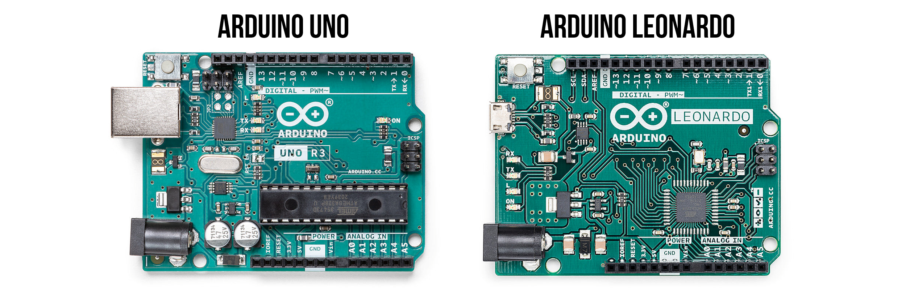

# {{ page.title }}
{: .no_toc }

## Table of Contents
{: .no_toc .text-delta }

1. TOC
{:toc}
---

Welcome 👋 to the second module in your Physical Computing journey: **Introduction to Microcontrollers** (using Arduino). Here, you will learn about [digital output](./led-blink.md), [analog output](./led-fade.md), [digital input](./buttons.md), and [analog input](./potentiometers.md) and build interesting musical instruments along the way from a [button piano](./piano.md) to a [Jedi-force instrument](./force-sensitive-resistors.md#jedi-force-instrument)! Get started with our first lesson: [L1: Turning on an LED](./led-on.md) and start building! ⚒🛠

{: .note }
Although you can begin your learning journey here, we  recommend that you complete the first module on [Intro to Electronics](../electronics/index.md) first. This will allow you to have a more deep understanding of the content in this section, and we will occassionally refer back to [Intro to Electronics](../electronics/index.md).

<!-- Call this intro to Microcontrollers and then cast Arduino as an example? -->

<!-- Add an Intro to Microcontrollers, talk about Arduino vs. RaspPi -->

**Why this tutorial series?** There are many Arduino resources online, many good, some bad. Our two favorites are, perhaps, [Adafruit’s 18-Step Guide](https://learn.adafruit.com/series/learn-arduino) and Jeremy Blum's [Exploring Arduino: Tools and Techniques for Engineering Wizardry](https://alliance-primo.hosted.exlibrisgroup.com/permalink/f/kjtuig/CP51311244450001451), 2nd Edition, Wiley, 2020. See our [Resources](../resources/index.md) page for more.

Our lessons are different both in approach and scope. They are based on years of experience in teaching physical computing—to design students, computer scientists, and engineers at the undergraduate and graduate level—and attempts to address common confusions head-on.

Thus, while other resources **start** with digital/analog input (or quickly intermix input and output), we've found that it's easier to start with **output**. For novices, input is simply harder—it requires an understanding (or at least an awareness) of concepts like pull-down resistors, voltage dividers, and that a microcontroller reads *voltages* rather than current or resistance.

So, our lessons start and stick with **output** to solidify understanding of how to programmatically control microcontroller pins before adding in **input**—where the fun, of course, really starts! Moreover, most resources—at least those we are aware of—strike a different balance between depth and breadth. We love Adafruit's [tutorials](http://learn.adafruit.com/) but they tend towards step-by-step construction recipes rather than explaining *why* or *how* things work. As a college-level resource, we attempt to provide a deeper understanding at a cost of complexity and longer lessons. But we think it's worth it.

Let the fun begin! 🚀🥳

The following tutorials are interactive and designed to be completed **in order**. All Arduino code is open source and in this [GitHub repository](https://github.com/makeabilitylab/arduino).

<!-- The [Adafruit lessons](https://learn.adafruit.com/series/learn-arduino) provide a rapid, broad taste of using microcontrollers for digital and analog I/O. As a book, Blum's [Exploring Arduino](https://alliance-primo.hosted.exlibrisgroup.com/permalink/f/kjtuig/CP51311244450001451) goes deeper; however, ne -->

{: .highlight-title }
> Arduino Uno R3 vs. Arduino Leonardo
> 
> For this lesson series, we use two of the most popular 5V Arduino models: the [Arduino Uno Rev3](https://store.arduino.cc/products/arduino-uno-rev3) and the [Arduino Leonardo](https://store-usa.arduino.cc/products/arduino-leonardo-with-headers); however, the lessons themselves should translate to almost any Arduino board (which is the beauty of the Arduino hardware-software ecosystem!).
>
> 
>
> Both the Uno and Leonardo have similar form factors, memory, clock speeds (16MHz), and GPIO pins (20 digital I/O pins); however, there are some differences:
> * The Uno uses the [ATmega328P microcontroller](http://ww1.microchip.com/downloads/en/DeviceDoc/Atmel-7810-Automotive-Microcontrollers-ATmega328P_Datasheet.pdf) while the Leonardo uses the [ATmega32u4](http://www.atmel.com/devices/atmega32u4.aspx)
> * The ATmega32u4 has built-in USB support whereas the Uno actually has a second microcontroller (the ATmega16U2) to provide USB communication. On the Uno, pins 0 and 1 are used to communicate with the 16u2 co-processor, which can conflict with components plugged into those pins (so our examples will often avoid using pins 0 or 1, even on the Leonardo)
> * Because the Leonardo natively supports USB, it can be mounted as a Human-Input Device and thus used as a mouse, keyboard, or joystick.
> * The Leonardo has 12 analog inputs vs. the Uno's 6
> 
> In the lessons themselves, we'll mark specific differences between the Uno and Leonardo, when relevant.

## Intro to Output

<!-- TODO:

    * [Done] Consider adding a debugging with Serial Monitor lesson -- maybe after Lesson 3? Update: I put it after Lesson 2
    * I'm tempted to put in a tone lesson after LED fading because we are just too LED heavy here imo
    
    -->

### [Lesson 1: Turning on an LED](led-on.md)

Introduces the Arduino power and ground pins, powering an initial LED circuit with a current limiting resistor, and plugging components into the Arduino.

### [Lesson 2: Blinking an LED](led-blink.md)

Introduces the Arduino IDE, digital output, and the ability to programmatically control Arduino GPIO pins to turn an LED on and off via [`digitalWrite`](https://www.arduino.cc/reference/en/language/functions/digital-io/digitalwrite/).

### [Lesson 3: Serial debugging](serial-print.md)

Introduces some basic debugging approaches for Arduino, with a specific focus on [`Serial.print`](https://www.arduino.cc/reference/en/language/functions/communication/serial/print/).

### [Lesson 4: Fading an LED](led-fade.md)

Introduces analog output, pulse-width modulation (PWM), and demonstrates how to gradually fade an LED on and off by using [`analogWrite`](https://www.arduino.cc/reference/en/language/functions/analog-io/analogwrite/)

### [Lesson 5: Blinking an LED Part 2](led-blink2.md)

Introduces the concept of using Arduino GPIO pins as either current **sources** or **sinks** by hooking up two LED circuit configurations: one circuit with the LED cathode towards GND and another with the LED anode towards GND.

### [Lesson 6: RGB LEDs](rgb-led.md)

Introduces RGB LEDs, using both common anode and cathode versions, and independently controlling brightness and hue.

### [Lesson 7: Crossfading RGB LEDs](rgb-led-fade.md)

Shows how to fade between RGB colors using [`analogWrite`](https://www.arduino.cc/reference/en/language/functions/analog-io/analogwrite/), to use the [HSL colorspace](https://en.wikipedia.org/wiki/HSL_and_HSV) to more easily (and independently) control hue and brightness, and to use and load local `C/C++` libraries

### [Lesson 8: Rate Blinking Multiple LEDs](led-blink3.md)

In this lesson, we will learn how to blink multiple LEDs at different rates and build our first [C/C++ class](http://www.cplusplus.com/doc/tutorial/classes/), which will greatly simplify our code and, as an added bonus, reduce its size by eliminating code redundancy.

## Intro to Input

### [Lesson 1: Using buttons](buttons.md)

Introduces buttons (aka momentary switches), digital input, using Arduino's [`digitalRead`](https://www.arduino.cc/reference/en/language/functions/digital-io/digitalread/) function, and pull-up and pull-down resistors.

### [Lesson 2: Button piano](piano.md)

In [this lesson](piano.md), we are going to make a simple five-key piano with tactile buttons wired with internal pull-up resistors and a [piezo buzzer](https://www.adafruit.com/product/160).

### [Lesson 3: Debouncing switches](debouncing.md)

In [this lesson](debouncing.md), we'll learn about "contact bouncing" and how to "debounce" to make our digital input more reliable.

### [Lesson 4: Potentiometers](potentiometers.md)

[This lesson](potentiometers.md) introduces potentiometers and rheostats, analog input, and using Arduino's [`analogRead`](https://www.arduino.cc/reference/en/language/functions/analog-io/analogread/) function. Also shows how to use Tinkercad to prototype and test circuits in an online simulator and how to use a multimeter to measure current.

### [Lesson 5: Force-sensitive resistors](force-sensitive-resistors.md)

Introduces [force-sensitive resistors (FSRs)](force-sensitive-resistors.md), how to use two-legged variable resistors with microcontrollers (including FSRs), and how to make a force-piano. Very Jedi-like!

<!--
TODO: after Lesson 4, have them make their own lo-fi resistive sensor? and turn their arduino into a voltmeter?
TODO: [done] what is debouncing and why
TODO: how to use interrupts
TODO: how to use some startup sequence to calibrate sensors?
 -- https://www.arduino.cc/en/Tutorial/BuiltInExamples/Calibration
TODO: some basics on smoothing the signal? -->

<!-- ## Other possibilities
- Debugging
  - Using VS Code
- TODO: consider adding interrupts here? Like after Lesson 2?
  - Nick Gammon's blog is a nice resource for this: https://www.gammon.com.au/interrupts
- When to introduce -->
