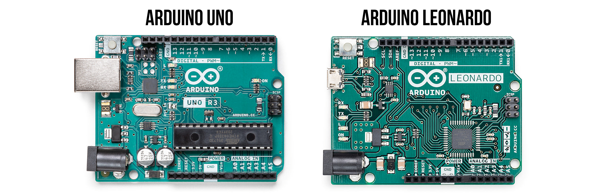

# {{ page.title }}
{: .no_toc }

## Table of Contents
{: .no_toc .text-delta }

1. TOC
{:toc}
---

Welcome 👋 to the second module in your Physical Computing journey: **Introduction to Microcontrollers** using Arduino. Here, you will learn about [digital output](./led-blink.md), [analog output](./led-fade.md), [digital input](./buttons.md), and [analog input](./potentiometers.md) and build interesting musical instruments along the way from a [button piano](./piano.md) to a [Jedi-force instrument](./force-sensitive-resistors.md#jedi-force-instrument)! Get started with our first lesson: [L1: Turning on an LED](./led-on.md) and start building! ⚒🛠

{: .note }
**New to this interactive textbook?** While you can start here (with learning Arduino, woohoo! 🥳), we highly recommend completing [Intro to Electronics](../electronics/index.md) first. We frequently build on fundamental concepts from that module—like voltage, current, resistance, and circuit analysis—without re-explaining them here.

<!-- Call this intro to Microcontrollers and then cast Arduino as an example? -->

<!-- Add an Intro to Microcontrollers, talk about Arduino vs. RaspPi -->

## Why this Learning Series?

There are many Arduino resources online, many good, some bad. Our two favorites are, perhaps, [Adafruit’s 18-Step Guide](https://learn.adafruit.com/series/learn-arduino) and Jeremy Blum's [Exploring Arduino: Tools and Techniques for Engineering Wizardry](https://alliance-primo.hosted.exlibrisgroup.com/permalink/f/kjtuig/CP51311244450001451), 2nd Edition, Wiley, 2020. See our [Resources](../resources/index.md) page for more.

Our lessons are different both in approach and scope. They are based on years of experience in teaching physical computing—to design students, computer scientists, and engineers at the undergraduate and graduate level—and we attempt to address common confusions head-on.

Thus, while other resources **start** with digital/analog input (or quickly intermix input and output), we've found that it's easier to start with **output**. For novices, input is simply harder—it requires an understanding (or at least an awareness) of concepts like pull-down resistors, voltage dividers, and that a microcontroller reads *voltages* rather than current or resistance.

So, our lessons start and stick with **output** to solidify understanding of how to programmatically control microcontroller pins before adding in **input**—where the fun, of course, really starts! Moreover, most resources—at least those we are aware of—strike a different balance between depth and breadth. We love Adafruit's [tutorials](https://learn.adafruit.com/) but they tend towards step-by-step construction recipes rather than explaining *why* or *how* things work. As a college-level resource, we attempt to provide a deeper understanding at a cost of complexity and longer lessons. But we think it's worth it.

<!-- The [Adafruit lessons](https://learn.adafruit.com/series/learn-arduino) provide a rapid, broad taste of using microcontrollers for digital and analog I/O. As a book, Blum's [Exploring Arduino](https://alliance-primo.hosted.exlibrisgroup.com/permalink/f/kjtuig/CP51311244450001451) goes deeper; however, ne -->

## Arduino Uno R3 vs. Arduino Leonardo

For this introductory lesson series, we use two of the most popular 5V Arduino models: the [Arduino Uno Rev3](https://store.arduino.cc/products/arduino-uno-rev3) and the [Arduino Leonardo](https://store-usa.arduino.cc/products/arduino-leonardo-with-headers); however, the lessons themselves should translate to almost any Arduino board—which is the beauty of the Arduino hardware-software ecosystem!

Both the [Uno](https://store.arduino.cc/products/arduino-uno-rev3) and [Leonardo](https://store-usa.arduino.cc/products/arduino-leonardo-with-headers) have similar form factors, memory, clock speeds (16MHz), and GPIO pins (20 digital I/O pins); however, there are some differences:

* The **Uno** uses the [**ATmega328P** microcontroller](https://ww1.microchip.com/downloads/en/DeviceDoc/Atmel-7810-Automotive-Microcontrollers-ATmega328P_Datasheet.pdf) while the **Leonardo** uses the [**ATmega32u4**](https://www.atmel.com/devices/atmega32u4.aspx)

* The Leonardo's **ATmega32u4** has **built-in USB support** whereas the Uno actually has a second microcontroller (the ATmega16U2) to provide USB communication. On the Uno, pins 0 and 1 are used to communicate with the 16u2 co-processor, which can conflict with components plugged into those pins (so our examples will often avoid using pins 0 or 1, even on the Leonardo)

* Because the **Leonardo** natively supports USB, it can be mounted as a **Human Interface Device (HID)** and thus used as a mouse, keyboard, or joystick.

* The **Leonardo** has **12 analog inputs** vs. the **Uno's 6**

**A Note on the Arduino Uno R4** Released in June 2023, the [Arduino Uno R4](https://store.arduino.cc/pages/uno-r4) (available in "Minima" and "WiFi" versions) is a significant hardware leap from the R3 while maintaining the same physical footprint and 5V operating voltage. It upgrades from an 8-bit AVR chip to a 32-bit ARM Cortex-M4 microcontroller, boasting a 48 MHz clock speed (3x faster), vastly expanded memory (256 kB Flash, 32 kB SRAM), a modern USB-C connector, and a true built-in DAC for actual analog output. Because it maintains backward compatibility, the code and concepts in these lessons translate perfectly to the R4!
{: .note }

In the lessons themselves, we'll mark specific differences between the Uno and Leonardo, when relevant.

Now, let the fun begin! 🚀🥳

## Intro to Output
<!-- TODO: ADD a fun and catchy video that highlights something awesome from this output series to put here -->

🚦 **Start Here!** We highly recommend completing the [Output lessons](intro-output.md) first to build a solid foundation before moving on to the [Input series](intro-input.md). We've learned from years of teaching this material that output is easier to start with than input!
{: .important }

In the [Output lesson series](intro-output.md), you will learn how to programmatically control Arduino's GPIO pins to drive LEDs, produce colors with RGB LEDs, and build your first C++ class. Topics include digital output (`digitalWrite`), debugging with `Serial.print`, analog output (`analogWrite` and PWM), current sourcing vs. sinking, and multi-rate blinking without `delay()`.

All Arduino code is open source and in this [GitHub repository](https://github.com/makeabilitylab/arduino).

**[Start the Output lessons →](intro-output.md)**

<!-- TODO:
    * I'm tempted to put in a tone lesson after LED fading because we are just too LED heavy here imo.
        - Putting it after LED fading (analogWrite) lets us bring up difference between changing PWM duty cycle (with analogWrite) and changing square wave freq (with tone)
        - Could demonstrate the above by hooking up a potentiometer that changes the PWM wave using a pot; then switch to changing freq with pot
        - Hmm, I could have sworn I took videos for that already (would have to check lectures and lecture notes)
        - Could also demonstrate by hooking up piezo two one pin that is 490 for PWM and another that is 980Hz
        - Some great ideas in our https://makeabilitylab.github.io/physcomp/esp32/tone.html lesson too
    -->

## Intro to Input
<!-- TODO: ADD a fun and catchy video that highlights something awesome from this input series to put here -->

In the [Input lesson series](intro-input.md), you will learn about digital and analog input using buttons, potentiometers, and force-sensitive resistors. You'll build musical instruments along the way—from a button piano to a Jedi-force instrument!

**[Start the Input lessons →](intro-input.md)**

<!--
TODO: after Lesson 4, have them make their own lo-fi resistive sensor? and turn their arduino into a voltmeter?
TODO: [done] what is debouncing and why
TODO: how to use interrupts
TODO: how to use some startup sequence to calibrate sensors?
 -- https://www.arduino.cc/en/Tutorial/BuiltInExamples/Calibration
TODO: some basics on smoothing the signal? -->

<!-- ## Other possibilities
- Debugging
  - Using VS Code
- TODO: consider adding interrupts here? Like after Lesson 2?
  - Nick Gammon's blog is a nice resource for this: https://www.gammon.com.au/interrupts
- When to introduce -->