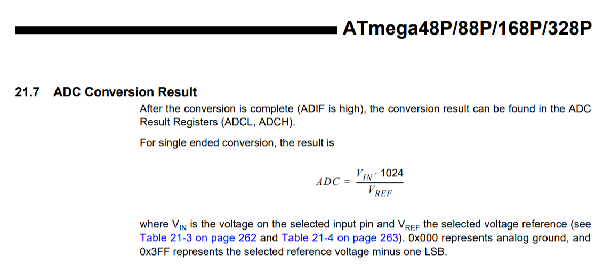
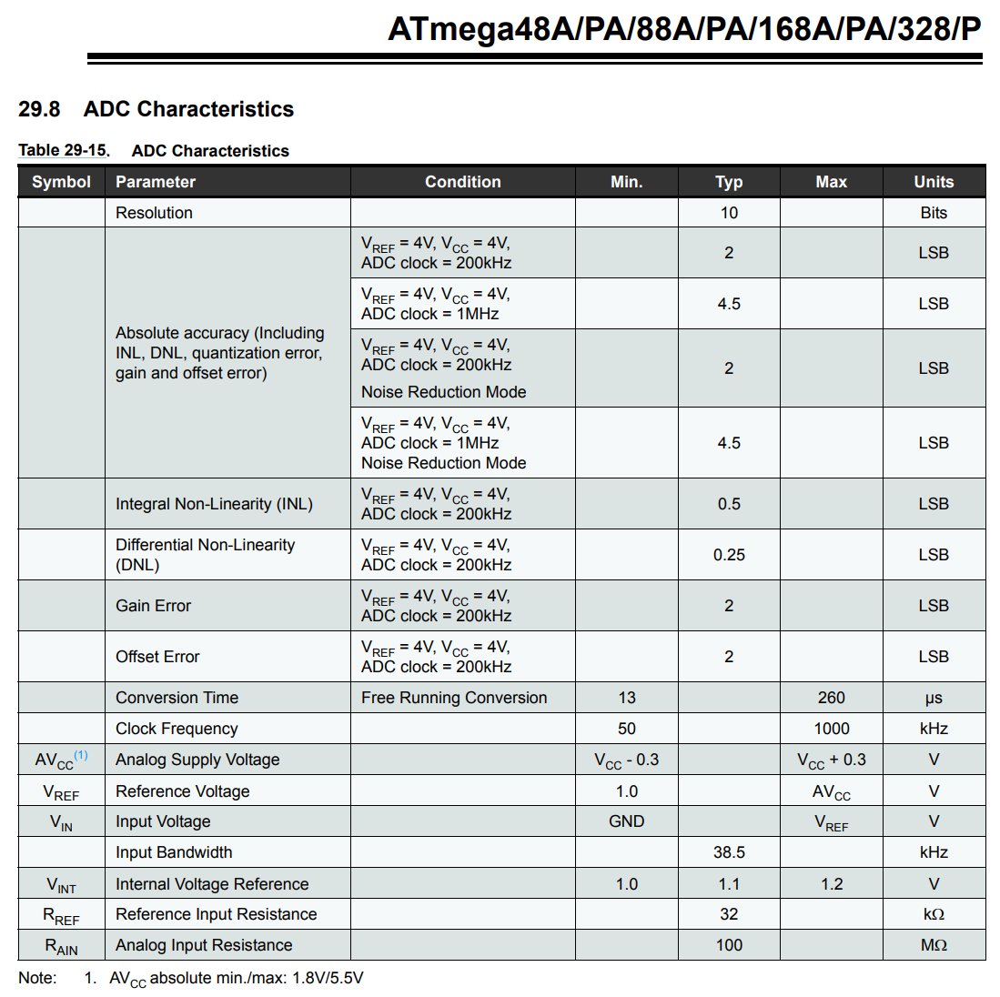

# {{ page.title }}
{: .no_toc }

## Table of Contents
{: .no_toc .text-delta }

1. TOC
{:toc}
---

This page provides more advanced, "under the hood" information about how Arduino works internally—including how `Serial.println` handles multiple variables, what's actually calling `loop()`, how `delay()` is implemented, and how the ADC converts analog signals to digital values. You do not need to read or understand this page to use the Arduino! It's here for the curious and in case you want to dive deeper. :)

<!-- Several of the [Output lessons](intro-output.md) link here for deeper dives, including [L2: Blinking an LED](led-blink.md), [L4: Fading an LED](led-fade.md), and [L8: Rate Blinking LEDs](led-blink3.md). -->

## How can I print multiple variables using `Serial.println`?

A common question in our courses and, indeed, online such as on [Arduino StackExchange](https://arduino.stackexchange.com/) and the [Arduino forums](https://forum.arduino.cc/) is some variation of: "*How can I print multiple variables in one line of code using* `Serial.println`?" 

Here are some common answers. Note: I have not stress tested them all and I'm sure many solutions are slow and memory inefficient (but if neither of these are concerns, then feel free to use them!)

**First**, perhaps the simplest way is to cast everything as a String and use string concatenation:

``` C
Serial.println((String)"Var 1:" + var1 + " Var 2:" + var2 + " Var 3:" + var3);
```
[Source](https://arduino.stackexchange.com/a/69566)
{: .fs-1 }

Note: you should only do this for rapid prototypes because of memory inefficiencies with creating Strings in Arduino `C++`; see ["The Evils of Arduino Strings"](https://hackingmajenkoblog.wordpress.com/2016/02/04/the-evils-of-arduino-strings/)

**Second**, use `snprintf` to format into a character buffer. This is the standard C/C++ approach and avoids the memory fragmentation problems of the `String` class:


char buffer[64]; // make sure this is large enough for your formatted string
snprintf(buffer, sizeof(buffer), "Var 1: %d  Var 2: %d  Var 3: %d", var1, var2, var3);
Serial.println(buffer);


{: .note }
> On standard Arduino AVR boards, `snprintf` does **not** support floating-point format specifiers (`%f`) out of the box—this is disabled to save memory. To format floats, use [`dtostrf()`](https://www.nongnu.org/avr-libc/user-manual/group__avr__stdlib.html#ga060c998e77fb5fc0d3168b3ce8571571) to convert the float to a string first, then include it in your `snprintf` call.

**Third**, you could use an external library such as [PrintEx](https://github.com/Chris--A/PrintEx#printex-library-for-arduino-).

**Fourth**, you could redirect `printf` to Serial output:


// Function that printf and related will use to print
int serial_putchar(char c, FILE* f) {
    if (c == '\n') serial_putchar('\r', f);
    return Serial.write(c) == 1? 0 : 1;
}

FILE serial_stdout;

void setup(){
    Serial.begin(9600);

    // Set up stdout
    fdev_setup_stream(&serial_stdout, serial_putchar, NULL, _FDEV_SETUP_WRITE);
    stdout = &serial_stdout;

    printf("My favorite number is %6d!\n", 12);
}

void loop() {
  static long counter = 0;
  if (millis()%300==0){
    printf("millis(): %ld\tcounter: %ld (%02X)\n", millis(), counter, counter++);
    delay(1);    
  }
}

[Source](https://arduino.stackexchange.com/a/480) and [discussion](https://forum.arduino.cc/index.php/topic,120440.0.html)

## What's calling loop() and how fast?

Because Arduino is [open source](https://github.com/arduino), we can look up the source code to answer this question. 

In short, `loop()` is called within an infinite `for` (or `while` loop). The only overhead is checking for whether there is data available on the serial port and then reading the serial buffers. The entire `int main(void)` function in [main.cpp](https://github.com/arduino/ArduinoCore-avr/blob/2f67c916f6ab6193c404eebe22efe901e0f9542d/cores/arduino/main.cpp) is:


int main(void)
{
    init();
    initVariant();

    #if defined(USBCON)
    USBDevice.attach();
    #endif

    setup();

    for (;;) {
        loop();
        if (serialEventRun) serialEventRun();
    }
    return 0;
}


Interestingly, this [Arduino forum post](https://forum.arduino.cc/index.php?topic=615714.0) suggests that because `serialEventRun()` is weakly defined in the core, you can define it locally in your sketch to override the default definition, which, according to the OP, will "save a little memory and makes the loop() run a little faster too!" You can do this if you don't need to use serial communication.


void serialEventRun() {}

void setup() {
}

void loop() {
}


## Converting analogRead to voltages

To convert an `analogRead` value to voltage, should we **divide** by **1023** or **1024**?

There is an interesting thread on [Arduino forums](https://forum.arduino.cc/index.php?topic=303189.msg2109121) discussing the merits of 1023 vs. 1024 as divisors. The maximum `analogRead` value is 1023; however, there are 1024 'steps' between 0 and 5V. The official [Arduino tutorial uses 1023](https://www.arduino.cc/en/Tutorial/ReadAnalogVoltage)—which effectively translates 0 - 1023 to 0 to 5V; however, others argue that this is wrong.

I think the key here is to remember that an ADC conversion represents a **range of values** with a step size of `5V/1024 = 0.0048828125V`. So if `analogRead` returns 0, this is really a range of 0V to 0.0048828125V, and 1 is a range of 0.0048828125V to 0.009765625V, *etc.* In that regard, we would want to divide analogRead by 1024 and if analogRead returns 1023, 1023/1024 * 5V = 4.9951171875V **to** 5V.

The [ATmega datasheet](https://www.sparkfun.com/datasheets/Components/SMD/ATMega328.pdf) says:



The formula from the datasheet is: $$ADC = \frac{V_{in} \times 1024}{V_{ref}}$$, where $$V_{ref}$$ is the reference voltage (typically 5V on the Uno) and $$ADC$$ is the 10-bit digital result (0–1023).

For most practical purposes, dividing by 1023 or 1024 won't matter. :) If you want to estimate the voltage at the *center* of each ADC bin rather than the bottom edge, you can add 0.5 to the `analogRead` value before dividing by 1024—but again, for 10-bit physical computing applications, this level of precision is rarely needed.

For more on this hotly debated issue, read:
- [Analog Input Noise](https://forum.arduino.cc/t/analog-input-noise/597713/6)
 
- [ADC Conversion on the Arduino](https://www.gammon.com.au/adc), by Nick Gammon

- [Precise Voltage Measurement with Arduino](https://www.skillbank.co.uk/arduino/measure.htm), by John Errington

## How fast can we sample a sensor with `analogRead()`?

When working with analog sensors, it is important to distinguish between the limitations of the standard Arduino software and the true capabilities of the microcontroller hardware:

- **The Arduino Software Limit**: By default, the standard Arduino analogRead() function is configured for safety and stability rather than pure speed. It takes approximately 104 μs to execute, which limits your practical sampling rate to roughly 9,600 samples per second.

- **The True Hardware Capability**: According to Section 23 of the [ATmega328P datasheet](https://ww1.microchip.com/downloads/en/DeviceDoc/Atmel-7810-Automotive-Microcontrollers-ATmega328P_Datasheet.pdf), the raw hardware is actually capable of conversion times between 65 and 260 μs, supporting up to 15,000 samples per second at maximum 10-bit resolution.

For reading basic sensors or potentiometers, the default Arduino software speed is more than sufficient. However, if you are trying to sample higher-frequency signals like audio, keep in mind that you can bypass the default analogRead() settings to unlock the hardware's full 15kSPS potential.

## What does `delay()` actually do?

As you might expect—given our warnings about avoiding overuse of [`delay(unsigned long ms)`](https://www.arduino.cc/reference/en/language/functions/time/delay/)—the delay code consists of a `while` loop that simply waits for the given amount of delay time to pass. There is a `yield()` call within the `while` loop but this is, by default, an empty function—though you could implement it to create a "real cooperative scheduler." The code for `yield()` is [here](https://github.com/arduino/ArduinoCore-avr/blob/2f67c916f6ab6193c404eebe22efe901e0f9542d/cores/arduino/hooks.c).

The [`delay(unsigned long ms)`](https://www.arduino.cc/reference/en/language/functions/time/delay/) function is found in [wiring.c](https://github.com/arduino/ArduinoCore-avr/blob/2f67c916f6ab6193c404eebe22efe901e0f9542d/cores/arduino/wiring.c) and is, in its entirety, copied below:


void delay(unsigned long ms)
{
  uint32_t start = micros();

  while (ms > 0) {
    yield();
    while ( ms > 0 && (micros() - start) >= 1000) {
      ms--;
      start += 1000;
    }
  }
}


## How does `digitalWrite()` work internally?

When you call `digitalWrite(3, HIGH)`, what actually happens at the hardware level? The AVR microcontrollers control their GPIO pins through **port registers**—special memory-mapped bytes where each bit corresponds to a physical pin. 

How these pins map to the registers depends entirely on your board:
* **Arduino Uno (ATmega328P):** The mapping is very clean. Digital pins 0–7 map to `PORTD` and pins 8–13 map to `PORTB`.
* **Arduino Leonardo (ATmega32U4):** Because of the built-in USB hardware, the pin mapping is scattered. For example, pins 0–4 map to various bits on `PORTD`, pin 5 is on `PORTC`, and pin 7 is on `PORTE`.

The `digitalWrite()` function (found in [wiring_digital.c](https://github.com/arduino/ArduinoCore-avr/blob/master/cores/arduino/wiring_digital.c)) does the following:

1. Looks up which port register and bit correspond to the given pin number (using a lookup table).
2. Disables interrupts briefly to prevent race conditions.
3. Sets or clears the appropriate bit in the port register.
4. Re-enables interrupts.

This lookup and safety logic is why `digitalWrite()` is relatively slow (~4-5 μs per call). For performance-critical code, experienced programmers bypass it and manipulate the port registers directly. For example, on an Uno, `PORTD |= (1 << 3);` sets Pin 3 `HIGH` in just two clock cycles (~125 ns at 16 MHz, via the AVR `sbi` instruction)—roughly 30-40x faster.

For our introductory lessons, `digitalWrite()` is perfectly fast enough. But it's good to know what's happening under the hood!

## How does `analogWrite()` and PWM work internally?

As covered in [L4: Fading an LED](led-fade.md), `analogWrite()` doesn't produce a true analog voltage—it generates a PWM waveform. But how does the hardware create this waveform?

Arduino boards use hardware **Timers** built into the microcontroller to generate PWM. When you call `analogWrite(pin, value)`, the Arduino core code configures the timer associated with that pin for PWM mode and sets a **compare match register** to your 8-bit value (0–255). The hardware then continuously counts from 0 to 255; when the count is below your value, the pin is `HIGH`, and when above, it's `LOW`. This happens entirely in the background, freeing up the CPU.

The timers and available PWM pins differ depending on your board:

**Arduino Uno (ATmega328P)**
The Uno has three hardware timers driving 6 PWM pins.
| Timer | PWM Pins | Frequency | Notes |
| :--- | :--- | :--- | :--- |
| Timer0 | 5, 6 | ~980 Hz | Also used by `millis()` and `delay()` |
| Timer1 | 9, 10 | ~490 Hz | 16-bit timer |
| Timer2 | 3, 11 | ~490 Hz | 8-bit timer |

**Arduino Leonardo (ATmega32U4)**
The Leonardo has four usable hardware timers driving 7 PWM pins.
| Timer | PWM Pins | Frequency | Notes |
| :--- | :--- | :--- | :--- |
| Timer0 | 3, 11 | ~980 Hz | Also used by `millis()` and `delay()` |
| Timer1 | 9, 10 | ~490 Hz | 16-bit timer |
| Timer3 | 5 | ~490 Hz | 16-bit timer |
| Timer4 | 6, 13 | ~980 Hz | High-speed 10-bit timer (clocked by a PLL) |

Because `Timer0` is responsible for `millis()` and `delay()`, altering its configuration to change your PWM frequency on pins 5 and 6 (Uno) or pins 3 and 11 (Leonardo) will break your timekeeping functions.

## Writing Blinky in Bare-Metal C

If you bypass the Arduino framework entirely, you can write code directly for the AVR microcontroller using standard C. This is often called "bare-metal" programming. It reveals the hidden `main()` function and replaces user-friendly functions like `pinMode()` and `digitalWrite()` with direct hardware register manipulation.

Here is what a standard "Blinky" sketch looks like in bare-metal C for the **Arduino Uno** (ATmega328P). On the Uno, the built-in LED (Pin 13) is hardwired to bit 5 of Port B (`PB5`). According to Section 13.2.1 of the ATmega328P datasheet, the `DDxn` bit in the Data Direction Register (`DDRx`) selects the pin's direction, and the `PORTxn` bit in the Data Register sets the output logic level.


#ifndef F_CPU
#define F_CPU 16000000UL // 16 MHz clock speed
#endif

#include <avr/io.h>      // Hardware register definitions
#include <util/delay.h>  // _delay_ms() function

int main(void) {
    // 1. Setup: Configure PB5 (Pin 13) as an output
    DDRB |= (1 << PB5);

    // 2. Loop: The equivalent of the Arduino loop()
    while (1) {
        // Toggle the state of PB5 using bitwise XOR
        PORTB ^= (1 << PB5); 
        
        // Wait for 1000 milliseconds
        _delay_ms(1000);
    }

    // never reached
    return 0; 
}


If we want to run this exact same bare-metal Blinky on an **Arduino Leonardo** (ATmega32U4), the code has to change. Because of the Leonardo's internal USB hardware, the built-in LED (Pin 13) is wired to bit 7 of Port C (`PC7`). 


#ifndef F_CPU
#define F_CPU 16000000UL
#endif

#include <avr/io.h>
#include <util/delay.h>

int main(void) {
    // 1. Setup: Configure PC7 (Pin 13) as an output
    DDRC |= (1 << PC7);

    // 2. Loop
    while (1) {
        // Toggle the state of PC7
        PORTC ^= (1 << PC7); 
        _delay_ms(1000);
    }

    // never reached
    return 0;
}


### The Takeaway: Hardware Abstraction

This comparison perfectly illustrates the concept of **Hardware Abstraction**—the core reason the Arduino framework exists.

When you write `digitalWrite(13, HIGH)`, the exact same Arduino sketch works on both the Uno and the Leonardo without you having to change a single line of code or read a datasheet. The Arduino software handles the translation in the background, figuring out that "Pin 13" means `PB5` on the Uno and `PC7` on the Leonardo.

The tradeoff is speed. `digitalWrite()` takes about 4-5 microseconds to do its safety checks and look up those pin mappings. In contrast, bare-metal port manipulation (`PORTB ^= (1 << PB5)`) compiles down to a single machine instruction that executes in just a few clock cycles (~125 nanoseconds). Arduino gives you cross-compatibility and ease of use, while bare-metal C gives you maximum performance and complete control.

## How does `millis()` work?

The [`millis()`](https://www.arduino.cc/reference/en/language/functions/time/millis/) function, which we use extensively in [L8: Rate Blinking LEDs](led-blink3.md), returns the number of milliseconds since the Arduino started running. But how does it keep track of time?

The answer is **Timer0 overflow interrupts**. Timer0 is an 8-bit counter that counts from 0 to 255 at a rate determined by the CPU clock and a prescaler. On the Uno (16 MHz clock, prescaler of 64), Timer0 overflows approximately every 1.024 ms. Each time it overflows, a hardware interrupt fires and increments an internal counter. The `millis()` function simply reads this counter.

You can see the implementation in [wiring.c](https://github.com/arduino/ArduinoCore-avr/blob/master/cores/arduino/wiring.c)—look for the `TIMER0_OVF_vect` interrupt service routine (ISR) and the `millis()` function.

A few important implications:

- `millis()` has a resolution of approximately **1 ms**, not exactly 1 ms (because 1.024 ms ≠ 1 ms). The Arduino core includes correction logic to compensate, but tiny drift can accumulate over very long periods.
- Since `millis()` relies on interrupts, it will **not advance** inside an ISR or while interrupts are disabled (via `noInterrupts()`).
- As noted in [L8](led-blink3.md#tracking-timestamps-and-overflow), `millis()` overflows back to zero after approximately 49.7 days. Using `unsigned long` arithmetic handles this correctly.

For microsecond resolution, use [`micros()`](https://www.arduino.cc/reference/en/language/functions/time/micros/), which has ~4 μs resolution on the Uno and overflows after ~70 minutes.

## How does the Arduino Uno ADC work exactly?

To convert analog signals to digital, the ATmega328 uses a successive approximation ADC, which [Wikipedia](https://en.wikipedia.org/wiki/Successive_approximation_ADC) nicely summarizes as: "*a type of analog-to-digital converter that converts a continuous analog waveform into a discrete digital representation via a binary search through all possible quantization levels before finally converging upon a digital output for each conversion*."

As Charles Platt explains in *Encyclopedia of Electronic Components Volume 3* (Maker Media, 2016), a successive approximation converter works by comparing the input voltage against a DAC output using a single comparator. It determines the digital value one bit at a time, from the most significant to the least significant bit, storing each result in a successive approximation register (SAR). This approach can achieve high resolution (many bits) at the cost of lower conversion speed compared to other ADC architectures.

## What is the analog input pin resistance on the ATmega328?

The [ATmega328 datasheet](https://ww1.microchip.com/downloads/en/DeviceDoc/ATmega48A-PA-88A-PA-168A-PA-328-P-DS-DS40002061A.pdf) says that the analog input resistance is 100 megohms:



<!-- An additional in-depth thread describing this here: https://www.avrfreaks.net/forum/input-impedance-digital-ios-atmega328p -->

### Source impedance and analog pin "ghosting"

While the analog input resistance is very high (100 MΩ), there's an important practical limitation that trips up many students. The ADC uses an internal **sample-and-hold capacitor** that must fully charge to the input voltage before each conversion. Section 23.6.1 of the ATmega328P datasheet specifies that the ADC is optimized for analog signals with an output impedance of **10 kΩ or less**. (This same 10 kΩ limit applies to the Leonardo's ATmega32U4 chip).

If you use high-value resistors in a voltage divider (*e.g.,* a 1 MΩ photoresistor with a 1 MΩ fixed resistor), the sample-and-hold capacitor won't charge fast enough, and you may see readings from one analog pin "bleed" into the next pin you read—a phenomenon sometimes called "ghosting." This is especially noticeable when rapidly switching between multiple `analogRead` pins.

{: .note }
> If you encounter ghosting, you can add a small delay between `analogRead` calls on different pins, or do a "dummy read" on each pin (read it twice and discard the first result) to give the capacitor time to settle. Better yet, keep your source impedance below 10 kΩ.

## References
- [Arduino Uno pin current limits](https://electronics.stackexchange.com/a/67173), StackExchange
- [ADC Conversion on the Arduino](https://www.gammon.com.au/adc), Nick Gammon
- [The Arduino ADC](https://www.skillbank.co.uk/arduino/adc.htm), John Errington

## Secrets of Arduino PWM

For a deep dive into how PWM works on the ATmega microcontrollers, including how to change PWM frequencies and use different timer modes, see the official [Secrets of Arduino PWM](https://docs.arduino.cc/tutorials/generic/secrets-of-arduino-pwm) tutorial.

<!-- Another nice article is Protecting Inputs in Digital Electronics: https://www.digikey.com/en/articles/protecting-inputs-in-digital-electronics -->
