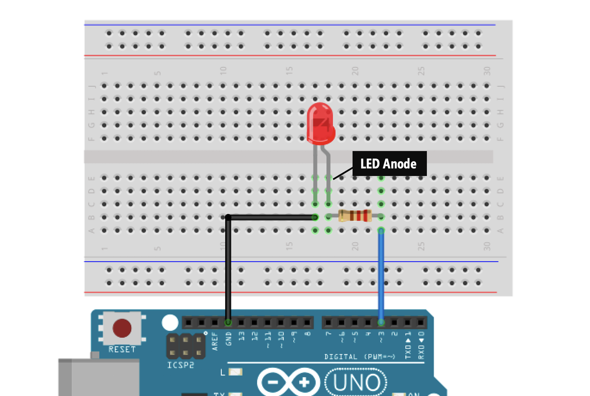
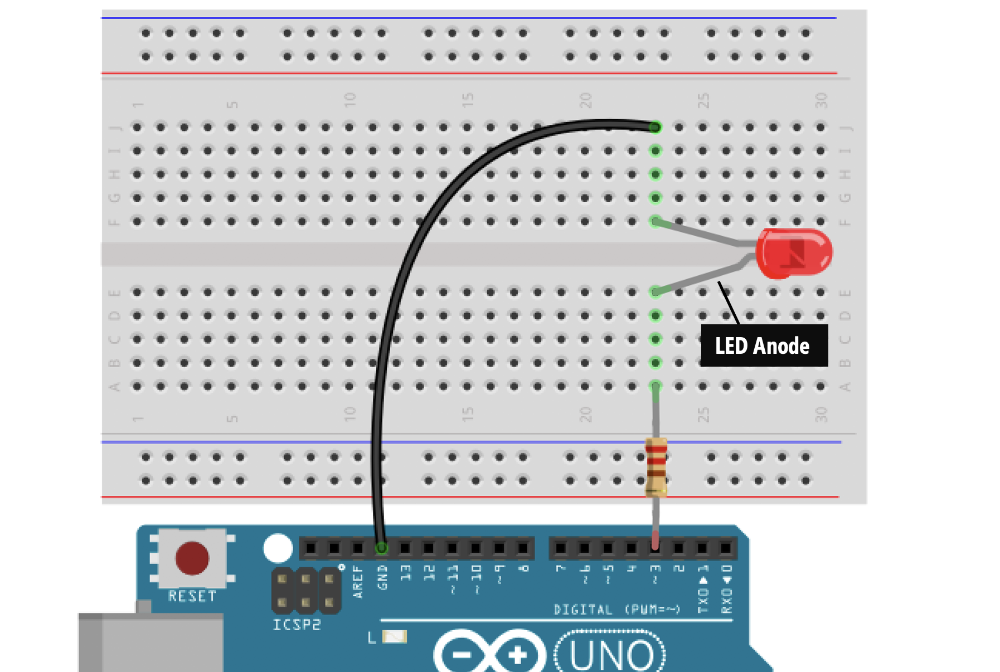
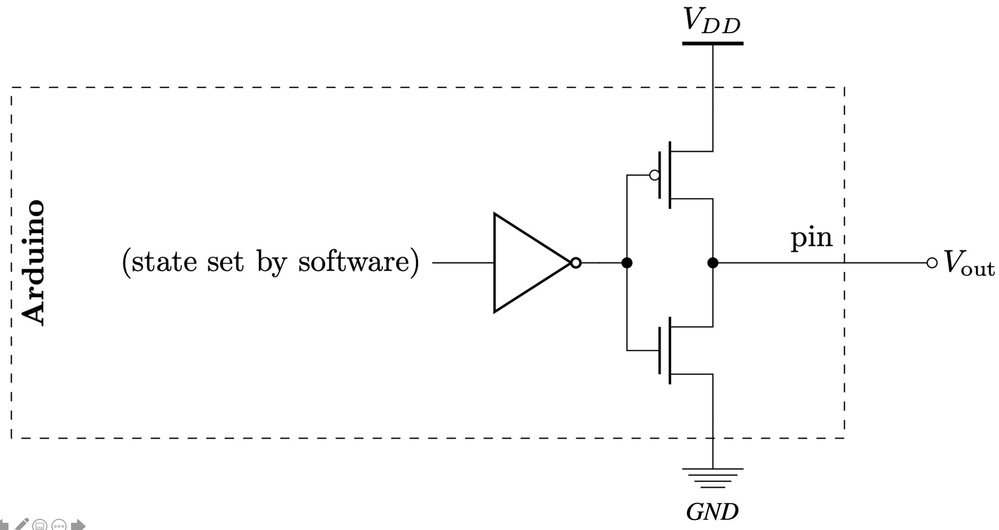
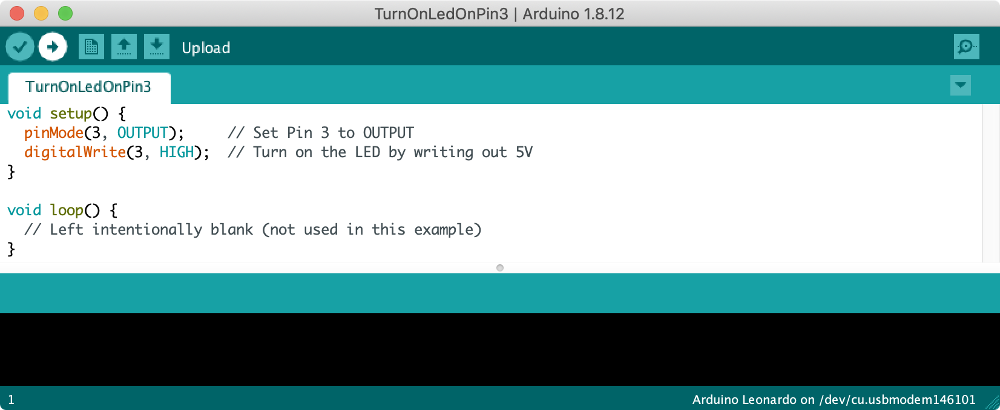
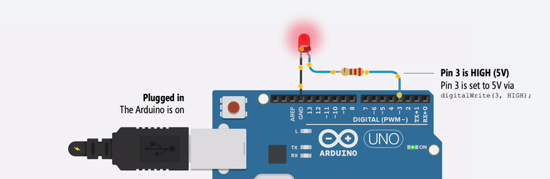
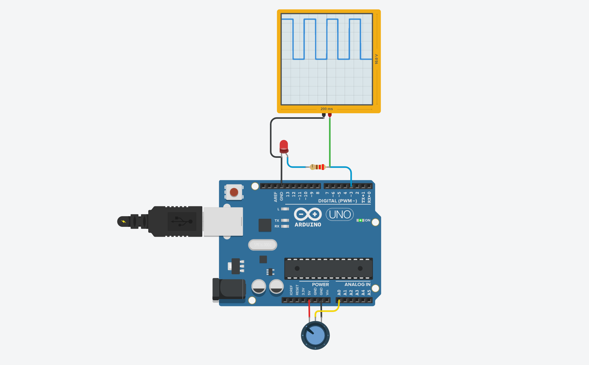
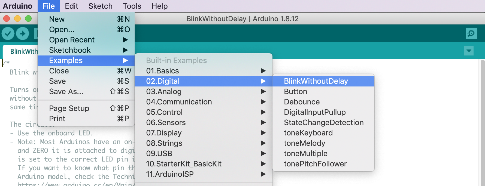

# {{ page.title | replace_first:'L','Lesson '}}
{: .no_toc }

## Table of Contents
{: .no_toc .text-delta }

1. TOC
{:toc}
---
In our [first lesson](led-on.md), we directly hooked up an LED circuit to the Arduino's 5V and 3.3V pins. While this enabled us to learn about Arduino's supply voltage and GND pins and gave us practical experience wiring electrical components into the Arduino ports, it was admittedly, a toy exercise.

In this lesson, we are going to do something more exciting: use the Arduino to turn the LED on and off by *programmatically* controlling the output voltage on one of Arduino's GPIO pins. This begins our entrée into the two key aspects of working with microcontrollers: (1) building circuits and (2) writing code to interact with those circuits.

<!-- TODO: Add in a version that makes a tone for accessibility reasons? 
     See: https://itp.nyu.edu/physcomp/labs/labs-arduino-digital-and-analog/digital-input-and-output-with-an-arduino/ -->

## Materials

You will use the same materials as [before](led-on.md), but you will also need the [Arduino IDE](https://www.arduino.cc/en/main/software) and a USB cable to upload your program from your computer to your Arduino.

| Arduino | LED | Resistor |
|:-----:|:-----:|:-----:|
|     |  |  |
| Arduino Uno, Leonardo, or similar  | Red LED | 220Ω Resistor |

## Making the circuit

Using the same resistor-wrapped red LED from [before](led-on.md#step-1-wrap-resistor-around-led-leg), plug the anode + resistor side into Pin 3 and the cathode into GND. See the wiring diagram below:

---

**TIP:** Double check to make sure that you've correctly connected GND and Pin 3—it's easy to be "off-by-one-pin" (a frustrating error!).

---

While it's not necessary to use a breadboard for this simple circuit, here are two functionally equivalent breadboard-based wiring options. As our circuits get more complex, you will need to use a breadboard—so it's good to start (or continue!) building up familiarity. Which breadboarded design makes most sense to you? Use your finger to trace the flow of current from Pin 3 to GND. To zoom in on the images, you can right click and select "Open Image in a New Tab."

| Breadboard Option 1 | Breadboard Option 2 |
|:----:|:-----:|
| |  |

You can always return to our [breadboard](../electronics/breadboards.md) lesson to refresh your memory!

Next, we'll write `C/C++` code for the Arduino's microcontroller to turn on the LED from Pin 3, which will programmatically set Pin 3 to 5V.

---
**NOTE:**

The Arduino software is open source and consists of a development environment (called an IDE) and core libraries. The core libraries are written in the `C` and `C++` programming language and compiled using avr-gcc and AVR libc. The source code for Arduino is hosted on [GitHub](https://github.com/arduino). The libraries for AVR microcontrollers like the ATmega328 (which the Arduino Uno uses) is in [GitHub here](https://github.com/arduino/ArduinoCore-avr).

---

## Get the Arduino IDE

But first, we need to download and install the [Arduino IDE](https://www.arduino.cc/en/software/) (if you haven't already). Please follow our step-by-step installation and customization instructions [here](arduino-ide.md).

## Introducing digital output

Now, we are going to write code to turn on our LED by setting Pin 3 to HIGH (or 5V). Then, we will modify this code to flash the LED both on *and* off. To do this, we have to introduce **digital output.**

The Arduino Uno has 14 general-purpose input/output ([GPIO](https://en.wikipedia.org/wiki/General-purpose_input/output)) pins that can be used for digital input/output (I/O)—that is, to read or write digital information (`HIGH` or `LOW`) using [`digitalRead()`](https://www.arduino.cc/reference/en/language/functions/digital-io/digitalread/) and [`digitalWrite()`](https://www.arduino.cc/reference/en/language/functions/digital-io/digitalwrite/), respectively. We could have selected any of these pins for this lesson but we chose Pin 3 (in part, because we want to use this same pin in [Lesson 4](led-fade.md) and using it now simplifies things!).

You can control any of these 14 digital I/O pins with three functions:

1. [`pinMode(int pin, int mode)`](https://www.arduino.cc/reference/en/language/functions/digital-io/pinmode/) configures a specified pin as either an `INPUT` or `OUTPUT`. In this case, we want to specify `OUTPUT` because we want to **output** a signal to turn on the LED.
2. [`digitalRead(int pin)`](https://www.arduino.cc/reference/en/language/functions/digital-io/digitalread/) reads digital input from the specified pin, either `HIGH` or `LOW`. We will cover `digitalRead` in our [Intro to Input](intro-input.md) lesson series.
3. [`digitalWrite(int pin, int value)`](https://www.arduino.cc/reference/en/language/functions/digital-io/digitalwrite/) writes digital output to the specified pin, either `HIGH` or `LOW`. We'll be using `digitalWrite` in this lesson.

### What do we mean by HIGH and LOW?

An Arduino's supply voltage is often written as $$V_S$$, $$V_{CC}$$, and $$V_{DD}$$ in datasheets. Sadly, there does not appear to be a consistent naming convention ([link1](https://forum.arduino.cc/index.php?topic=374042.0), [link2](https://electronics.stackexchange.com/questions/17382/what-is-the-difference-between-v-cc-v-dd-v-ee-v-ss)). We'll try to consistently use $$V_{CC}$$ or $$V_S$$ but occasionally you'll see others (e.g., $$V_{DD}$$).

On the Arduino Uno and Leonardo, the supply voltage ($$V_{CC}$$) is **5V**. So, when a pin as configured as an output via `pinMode(<pin>, OUTPUT)`, the pin can provide either a `HIGH` voltage ($$V_{CC}$$) or a `LOW` voltage (0V). Some microcontrollers operate at 3.3V. In this case, a `HIGH` state would be 3.3V but a `LOW` state would still be 0V.

We'll look at actual digital output signals on an oscilloscope later in this lesson (in the section ["What does digital output look like?"](#what-does-the-digital-output-look-like)).

### What can we use digital output pins for?

In general, digital output pins on microcontrollers are designed to send **control signals** and not act as **power supplies**. So, while these pins can supply enough current to use LEDs, piezo speakers, or control servo motors, if you need to control a high-current DC load such as a DC motor, you'll need to use a transistor—which is an electronically controlled switch. 

NYU's ITP course has a [nice tutorial](https://itp.nyu.edu/physcomp/labs/motors-and-transistors/using-a-transistor-to-control-high-current-loads-with-an-arduino/) on how to use a transistor, external power supply, and an Arduino to drive a DC motor. For students enrolled in our courses, we will tell you when you would need to do this. Rest assured, none of the introductory lessons require this circuit configuration.

### What's the maximum amount of current a digital output pin can supply?

The Arduino Uno uses the [ATmega328P](http://ww1.microchip.com/downloads/en/DeviceDoc/Atmel-7810-Automotive-Microcontrollers-ATmega328P_Datasheet.pdf) microcontroller, which can supply an absolute maximum of 0.04A (40 mA) per digital output pin or about ~4 LEDs in parallel (with 10mA per branch). 

According to Section 28.1 in the [ATmega328P datasheet](http://ww1.microchip.com/downloads/en/DeviceDoc/Atmel-7810-Automotive-Microcontrollers-ATmega328P_Datasheet.pdf), anything beyond these limits "*may cause permanent damage to the chip*". The maximum total current draw **across all I/O pins** together should not exceed 200mA. Again, this limit is not a concern for our introductory lessons (unless you deviate significantly from them).

Importantly, once you configure a digital I/O pin as `OUTPUT`, do not connect it directly to `GND` or $$V_{CC}$$ or you may damage the microcontroller (typically, just that particular pin will be damaged). So, for example, if you've accidentally connected Pin 3 directly to 5V and write `pinMode(3, OUTPUT); digitalWrite(3, LOW);`, a whole bunch of current will "sink" into Pin 3 and potentially damage the pin.

You may be thinking: "um, what?" That's OK. In our years of teaching, we have had very few Arduinos damaged due to current overdraw (though it's worth watching this video on ["5 Ways to Destroy an Arduino"](https://youtu.be/WmcMrKELkcs)). And you won't need to worry about these limits for any of the introductory lessons.

### Internally, how does the Arduino set a pin HIGH or LOW?

Though it's not necessary to understand the following in order to *use* an Arduino, you might be curious about how the Arduino controls the voltage output of a pin? Using transistors. As the (simplified) schematic below highlights, a digital output pin provides either $$V_{DD}$$ (5V on the Uno and Leonardo) or $$GND$$ (0V) by dynamically turning on/off transistors (an inverter ensures that only one transistor can be on at a time).

Schematic by Chuan-Zheng Lee for his ["Intro to Arduino"](https://web.stanford.edu/class/archive/engr/engr40m.1178/slides/arduino.pdf) course at Stanford.
{: .fs-1 }

## Turn on LED programmatically via Pin 3

OK, so let's write an initial program to set Pin 3 to `HIGH` (5V). We're not blinking yet—just using code to set Pin 3's output voltage to $$V_{CC}$$. 

### Step 1: Start a new sketch in the Arduino IDE

Start a new sketch in the Arduino IDE:

### Step 2: Set the pinMode for Pin 3

Because the 14 digital I/O pins can used for either input or output, we need to specify that Pin 3 should be used for *output*. That is, we want the Arduino to **output** a 5V signal on Pin 3 to turn on our LED. We configure pins in the  `setup()` block and use the [`pinMode(int pin, int mode)`](https://www.arduino.cc/reference/en/language/functions/digital-io/pinmode/) command, which takes in a pin as the first parameter and a mode (`INPUT` or `OUTPUT`) as the second.


void setup() {
  // put your setup code here, to run once:
  pinMode(3, OUTPUT);
}


### Step 3: Set Pin 3 HIGH

Lastly, we need to actually set the Pin 3 signal to `HIGH`. For this, we use the  [`digitalWrite(int pin, int value)`](https://www.arduino.cc/reference/en/language/functions/digital-io/digitalwrite/) command, which takes in a pin as the first parameter and a value (`HIGH` or `LOW`) as the second. We could do this either in `setup()` or in `loop()` but since we're not currently changing the output signal, there is no reason to put it in `loop()`, so let's put it in `setup()` along with the `pinMode` code.


void setup() {
  // put your setup code here, to run once:
  pinMode(3, OUTPUT);
  digitalWrite(3, HIGH); // turn LED on (output 5V)
}


### Step 4: Compile the code

We did it! Now it's time to compile and upload the code to Arduino. 

Compile the code by clicking on the "verify" checkmark button in the upper-left corner of the Arduino IDE. If you haven't already, the Arduino IDE will also ask you to save your sketch. If there are any syntax or other identifiable errors in the code, the Arduino IDE will print them out in the console window at the bottom.

### Step 5: Upload the code to Arduino

Finally, upload the code to the Arduino by clicking on the "right arrow" button (next to verify). Importantly, you must have already set your Arduino board and port in `Tools->Board` and `Tools->Port`, respectively.

Once uploading is complete, the code automatically runs on the Arduino and the LED should immediately turn on!

<video controls="controls">
  <source src="assets/movies/ArduinoUno_TurnOnLEDPin3_WorkbenchWithCode-Cropped.mov" type="video/mp4">
</video>
**Note:** On my Windows machine, I use a [dark theme](https://create.arduino.cc/projecthub/konradhtc/one-dark-arduino-modern-dark-theme-for-arduino-ide-2fca81) for the Arduino IDE.
{: .fs-1 }

Here's an illustrative animation of what's happening in your circuit when the Arduino drives Pin 3 `HIGH`—hopefully, this matches your conceptual understanding as well:

## Turn on and off the LED programmatically via Pin 3

Now, let's modify our code to turn on *and* off the LED programmatically. More specifically, we will alternate between having the LED on for one second and having the LED off for one second. To do this, we'll use the [`delay(int ms)`](https://www.arduino.cc/reference/en/language/functions/time/delay/) function, which pauses the program for the specified amount of time (in milliseconds).

### Step 1: Move the digitalWrite code from setup() to loop()

First, move the digitalWrite code from `setup()` to `loop()`:


void setup() {
  // set Pin 3 to output
  pinMode(3, OUTPUT);
}

void loop() {
  digitalWrite(3, HIGH);  // turn LED on (output 5V)
}


### Step 2: Add in delays and code to turn off LED

Now, add in code to pause (for one second) and then turn off the LED (for one second) using `delay()`. Remember, when `loop()` completes, it is automatically called again (making the LED blink continuously).


void setup() {
  // set Pin 3 to output
  pinMode(3, OUTPUT);
}

void loop() {
  digitalWrite(3, HIGH);  // turn LED on (output 5V)
  delay(1000);            // wait one second
  digitalWrite(3, LOW);   // turn LED off (output 0V)
  delay(1000);            // wait another second
}


### Step 3: Compile and upload

We're done! Now, compile and upload the code and see it run!

<video controls="controls">
  <source src="assets/movies/BlinkWithCodeAndWorkbenchCamera.mp4" type="video/mp4">
</video>

### Step 4: Replace constants

Typically, we want to limit the use of *literal constants* in our code and replace them by variables. In this case, let's replace `3` with `LED_OUTPUT_PIN` defined as a global variable at the top of our program (`const int LED_OUTPUT_PIN = 3;`). This will make our code more maintainable, more readable, and less prone to accidental mistakes. Try to do this for all literals in the future.


const int LED_OUTPUT_PIN = 3;
void setup() {
  // set Pin 3 to output
  pinMode(LED_OUTPUT_PIN, OUTPUT);
}

void loop() {
  digitalWrite(LED_OUTPUT_PIN, HIGH);  // turn LED on (output 5V)
  delay(1000);                         // wait one second
  digitalWrite(LED_OUTPUT_PIN, LOW);   // turn LED off (output 0V)
  delay(1000);                         // wait another second
}


### Walking through the code

How does this work? See the code walkthrough video below:

<video controls="controls">
  <source src="assets/movies/Arduino_BlinkWithCode_Pin3.mp4" type="video/mp4">
</video>

### Our Blink code is in GitHub

You can access our Blink code in our [Arduino GitHub repository](https://github.com/jonfroehlich/arduino). A "live" version is also embedded directly from the GitHub repo below (at the bottom of this "code window", you should see direct links back to the code on GitHub and a "view raw" option):

## What does the digital output look like?

A common and important question when first working with microcontrollers is: what does the digital output look like?

In your mind, imagine what the voltage out of Pin 3 looks like over time (the x-axis is time and the y-axis is voltage output). You should envision a 5V output signal `HIGH` for the delay length followed by a 0V output signal, which is `LOW` delay length. Indeed, this type of graph is exactly what an oscilloscope is for—it graphs voltage values over time.

Using Tinkercad Circuits, we built the same LED-based circuit as above running the Blink program and hooked it up to an oscilliscope. Then, we recorded different `delay` values (400, 200, and 50) and created this movie. Is the graph what you expected? Why or why not. We suggest opening the video in its own tab or viewing it in fullscreen to see the details.

<video autoplay loop muted playsinline style="margin:0px">
  <source src="assets/movies/LedBlinkOscilliscope_TinkercadCircuits_Trim.mp4" type="video/mp4" />
</video>
**Video.** A video of this [Tinkercad project](https://www.tinkercad.com/things/17q2GFeYwP9) with three different `delay` values for both `HIGH` and `LOW`: 400, 200, and 50.
{: .fs-1 }

We encourage you to play with this [Tinkercad project ](https://www.tinkercad.com/things/17q2GFeYwP9)yourself and investigate different delays and their output on the oscilloscope. 

<iframe width="725" height="453" src="https://www.tinkercad.com/embed/17q2GFeYwP9?editbtn=1" frameborder="0" marginwidth="0" marginheight="0" scrolling="no"></iframe>

### Setting and visualizing different blinking frequencies

We duplicated the above Tinkercad setup (circuit + oscilloscope) in our laboratory and recorded a video. Notably, we used slightly different [code](https://github.com/makeabilitylab/arduino/blob/master/Basics/digitalWrite/SettableBlinkWithoutDelay/SettableBlinkWithoutDelay.ino) that allows us to set the blink frequency by rotating a [potentiometer](../electronics/variable-resistors.md).

<iframe width="736" height="414" src="https://www.youtube.com/embed/_ByA8Q-hL8I" title="YouTube video player" frameborder="0" allow="accelerometer; autoplay; clipboard-write; encrypted-media; gyroscope; picture-in-picture" allowfullscreen></iframe>

**Video** A [video](https://youtu.be/_ByA8Q-hL8I) showing the digital output voltage waveform at different "blinking" frequencies.
{: .fs-1 }

You can play with the Tinkercad version of this experiment [here](https://www.tinkercad.com/things/42O2UlRJFrZ):

**Figure**. Tinkercad Circuits version of the settable delay circuit+code ([link](https://www.tinkercad.com/things/42O2UlRJFrZ)).
{: .fs-1 }

## Mental model check: code is loaded and running on the Arduino

As a quick mental model check, it's worth emphasizing that once you upload the code to your Arduino, you no longer need the USB cable. Why? Because a compiled version of the code is stored **locally** on your Arduino and stays there even when the Arduino loses power. Your Arduino *is* the computer! So, you could use some other power source like a 9V battery plugged in to the barrel jack port.

<video controls="controls">
  <source src="assets/movies/Arduino_LEDBlink_Pin3-9VPower.mp4" type="video/mp4">
</video>

## Blink without using delays()

Before moving on, it's worth emphasizing that, in general, long `delay()` calls should be avoided. Why? Because while in a `delay()`, the Arduino is no longer responsive. So, for example, imagine updating your Blink program to also react to a button press from the user. If the user happens to press the button while the Arduino is in a `delay()`, your program would never be able to process that a button was pressed! This is a problem.

---
**NOTE:**

It's OK to stop here and move on to the [next lesson](serial-print.md). It's sufficient to be **aware** that long `delay()` calls can be dangerous and should probably be avoided. However, if you're curious, you can continue this sub-section to see a Blink example that works without delays. We will return to this concept for our final [Intro to Output](intro-output.md) lesson on [multi-rate blinking LEDs](led-blink3.md).

If you want to know how `delay()` actually works, read ["What does delay() actually do"](inside-arduino.md#what-does-delay-actually-do) in our [Inside Arduino guide](#inside-arduino).

---

Because `delay()` usage can be so troublesome, as part of their introductory tutorial series, Arduino publishes another Blink example with a tutorial called [BlinkWithoutDelay](https://www.arduino.cc/en/Tutorial/BlinkWithoutDelay). As with the regular [Blink](http://www.arduino.cc/en/Tutorial/Blink), this example can be accessed directly in the Arduino IDE:

To avoid `delay()` calls, the code tracks **time**, **LED state changes** (when the LED switches from `HIGH` to `LOW` or `LOW` to `HIGH`), and **when** these state changes occur. The [BlinkWithoutDelay](https://www.arduino.cc/en/Tutorial/BlinkWithoutDelay) main loop is below. Notice that there are no `delay()` calls!


void loop() {
  // check to see if it's time to blink the LED; that is, if the difference
  // between the current time and last time you blinked the LED is bigger than
  // the interval at which you want to blink the LED.
  unsigned long currentMillis = millis();

  if (currentMillis - previousMillis >= interval) {
    // save the last time you blinked the LED
    previousMillis = currentMillis;

    // if the LED is off turn it on and vice-versa:
    if (ledState == LOW) {
      ledState = HIGH;
    } else {
      ledState = LOW;
    }

    // set the LED with the ledState of the variable:
    digitalWrite(ledPin, ledState);
  }
}


We've also made our own [BlinkWithoutDelay](https://github.com/makeabilitylab/arduino/blob/master/Basics/digitalWrite/BlinkWithoutDelay/BlinkWithoutDelay.ino) version, which is available on [GitHub](https://github.com/makeabilitylab/arduino/blob/master/Basics/digitalWrite/BlinkWithoutDelay/BlinkWithoutDelay.ino) and shown below. This version is functionally equivalent to Arduino's official example but uses our own coding style and is, in our opinion, more understandable.

## Next Lesson

In the [next lesson](serial-print.md), we are going to learn about a few basic debugging strategies before moving on to [analog output](led-fade.md), which lets us control the output voltage not just at two levels, `LOW` (0V) or `HIGH` (5V), but at finer levels between 0 and 5V using [`analogWrite(int pin, int value)`](https://www.arduino.cc/reference/en/language/functions/analog-io/analogwrite/). 

<!-- In the [next lesson](led-fade.md), we will learn how to control the output voltage not just at two levels, `LOW` (0V) or `HIGH` (5V), but at finer levels between 0 and 5V using [`analogWrite(int pin, int value)`](https://www.arduino.cc/reference/en/language/functions/analog-io/analogwrite/). -->

[Previous: Turning on an LED with Arduino](led-on.md){: .btn .btn-outline }
[Next: Debugging Arduino code with Serial.print](serial-print.md){: .btn .btn-outline }
<!-- [Next: Fading an LED with Arduino](led-fade.md){: .btn .btn-outline } -->

