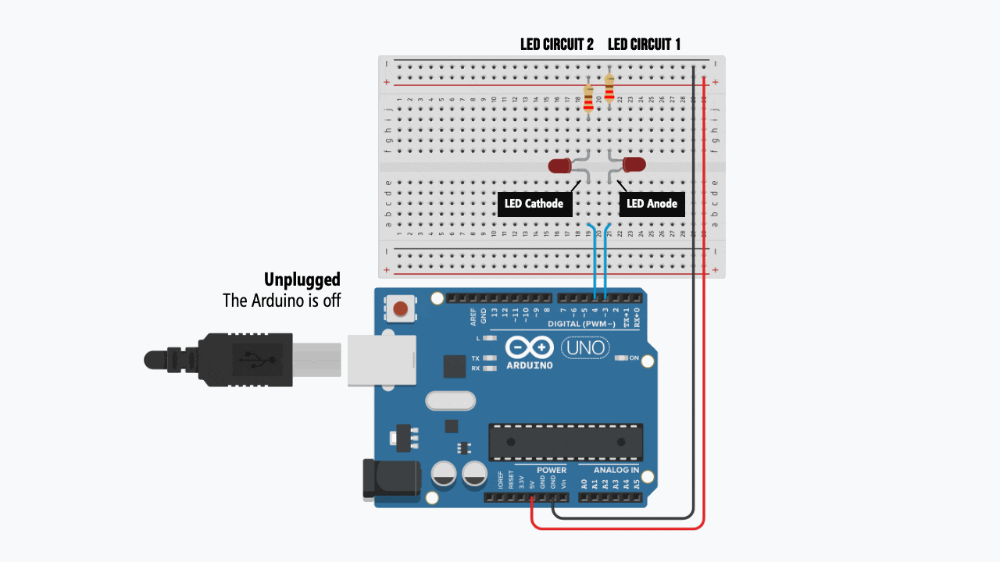
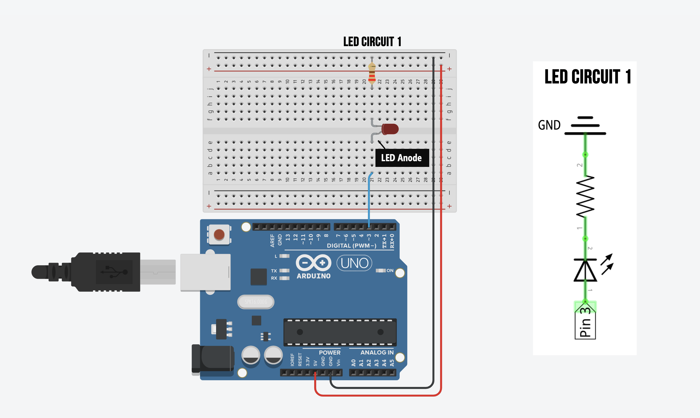
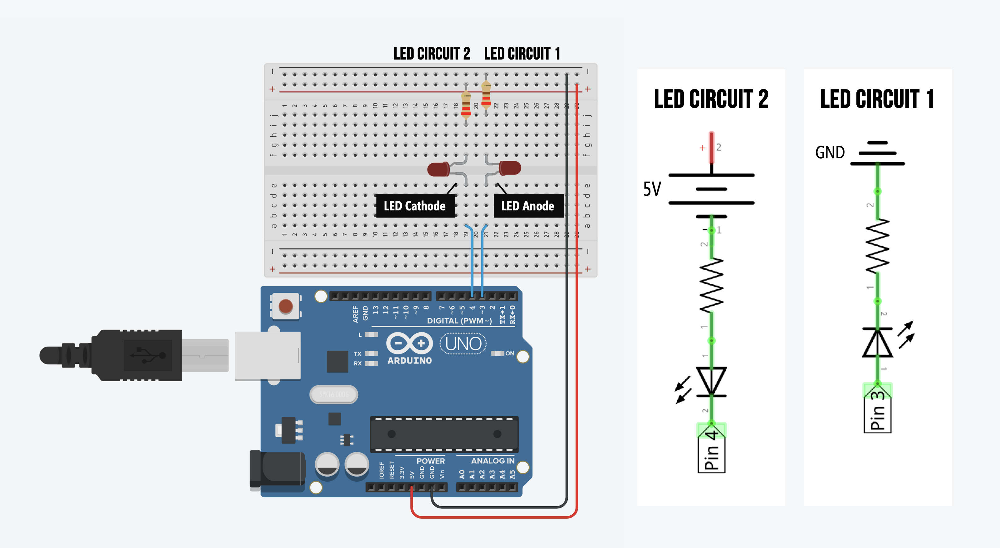
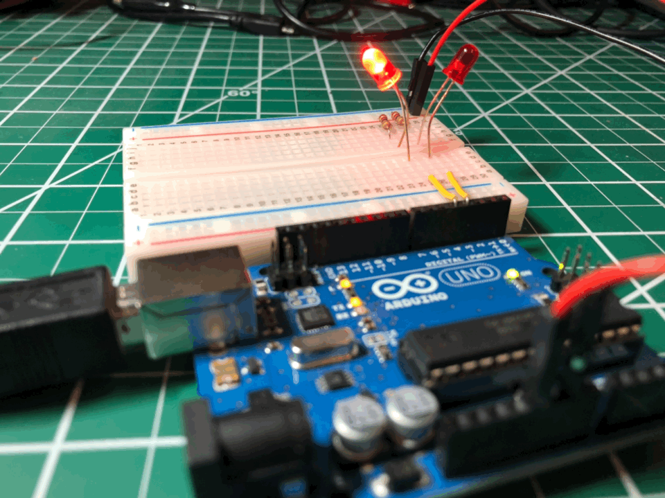

# {{ page.title | replace_first:'L','Lesson '}}
{: .no_toc }

## Table of Contents
{: .no_toc .text-delta }

1. TOC
{:toc}
---

In this tutorial, we will learn the difference between **current sourcing** and **current sinking** by revisiting our [LED Blink](led-blink.md) example. We will also incorporate the use of a [breadboard](../electronics/breadboards.md).

We are going to build two simple LED circuits:

1. **LED Circuit 1** will be the exact same as before with the LED anode facing Pin 3 and the cathode facing ground. When we drive Pin 3 `HIGH` (5V), the current will travel through the LED to `GND`. In this circuit, Pin 3 is the current source.
2. **LED Circuit 2** is similar but different. Here, we'll hook up a second LED with the anode facing *away* from Pin 4 (instead, towards 5V) and the cathode facing toward Pin 4. When we drive Pin 4 `HIGH` (5V), the LED will turn *off* because no voltage difference exists between the two ends of our circuit. However, if we drive Pin 4 `LOW` (0V), the LED will turn on. In this circuit, Pin 4 is the current sink.

Yes, this can be a bit confusing at first ("*wait, the LED turns off when Pin 4 is `HIGH`?!?!*"). But you'll gain understanding by completing this lesson. In the animation below, pay attention to the current direction in each circuit. Notice how they're opposite!

## Materials

Our materials are *almost* the same as before but this time, we are going to make two separate LED circuits (with the same components). So, we need **two red LEDs** and **two 220Ω resistors**. Now that we're using more components, we'll also need a **breadboard**—which will make it easier to make a clean, organized circuit.

| Breadboard | Arduino | LED | Resistor |
|:-----:|:-----:|:-----:|:-----:|
|  |     |  |  |
| Breadboard | Arduino Uno, Leonardo, or similar  | **2** Red LEDs | **2** 220Ω Resistors |

## Before you begin: breadboarding circuits

We will increasingly be using our breadboards in these lessons so now is a good opportunity to revisit how to use them. If you're unfamiliar please read our [breadboarding guide](../electronics/breadboards.md) and watch the following [video](https://youtu.be/6WReFkfrUIk):

<iframe width="736" height="414" src="https://www.youtube.com/embed/6WReFkfrUIk" frameborder="0" allow="accelerometer; autoplay; encrypted-media; gyroscope; picture-in-picture" allowfullscreen></iframe>

## Making the circuit

### Step 1: Wire up the power and GND rails

### Step 2: Wire up the first LED circuit

Now let's wire up the exact same circuit as before (*e.g.,* [LED Blink](led-blink.md) and [LED Fade](led-fade.md)) but this time we'll use a breadboard. Make sure the LED anode (the long leg) is facing Pin 3.

### Step 3: Wire up the second LED circuit

Now wire up the second LED circuit. This time, however, connect the LED cathode (short leg) to Pin 4 and the resistor to the 5V rail.

## Writing the code: blinking Pins 3 and 4

Let's write code to blink the LEDs hooked up to Pins 3 and 4.

Importantly, the Pin 3 circuit (**LED Circuit 1** i) will turn ***on*** with `digitalWrite(3, HIGH)` whereas the Pin 4 circuit (**LED Circuit 2**) will turn ***off*** with `digitalWrite(4, HIGH)`. Why? Recall that current always flows from **high** voltage potential to **low** voltage potential. 

When Pin 3 is `HIGH` (5V), there is a voltage difference between Pin 3 and `GND` so current flows from Pin 3 to ground. When Pin 4 is `HIGH` (5V), however, there is no voltage difference across the circuit (from Pin 4 to 5V) and thus, no current. This behavior is illustrated in the animation below.

<video controls="controls">
  <source src="assets/movies/Arduino_Blink2Animation_Pins3And4.mp4" type="video/mp4">
</video>

Let's write the code!

### Step 1: Write the setup and initialization code


const int LED1_OUTPUT_PIN = 3; // Anode faces Pin 3 (cathode connected to 0V)
const int LED2_OUTPUT_PIN = 4; // Cathode faces Pin 4 (anode connected to 5V)
const int DELAY_MS = 1000; // delay for 1 sec between blinks

// The setup function runs once when you press reset or power the board
void setup() {
  // Set our LED pins as output
  pinMode(LED1_OUTPUT_PIN, OUTPUT);
  pinMode(LED2_OUTPUT_PIN, OUTPUT);
}


### Step 2: Write the blink code in loop()


// The loop function runs over and over again forever
void loop() {
  // Below, you're going to see that driving Pin 3 HIGH will turn on LED1
  // but driving Pin 4 HIGH will actually turn *off* LED2
  digitalWrite(LED1_OUTPUT_PIN, HIGH);  // turns ON LED1
  digitalWrite(LED2_OUTPUT_PIN, HIGH);  // turns OFF LED2
  delay(DELAY_MS);                      // delay is in milliseconds; so wait one second
  
  digitalWrite(LED1_OUTPUT_PIN, LOW);   // turns OFF LED1 (Pin 3 is now 0V and other leg of LED is 0V)
  digitalWrite(LED2_OUTPUT_PIN, LOW);   // turns ON LED2 (Pin 4 is now 0V and other leg of LED is 5V)
  delay(DELAY_MS);                      // wait for a second
}


### Step 3: Compile, upload, and run the code!

We did it! Now compile and upload the code.

And here's a top-down video with the code window:

<iframe width="736" height="414" src="https://www.youtube.com/embed/q6KcPYfum7c" frameborder="0" allow="accelerometer; autoplay; encrypted-media; gyroscope; picture-in-picture" allowfullscreen></iframe>

<!--  -->

## Our Blink2 code on GitHub

You can access our Blink2 code in our [Arduino GitHub repository](https://github.com/jonfroehlich/arduino). It's also displayed below:

## Next Lesson

In the [next lesson](rgb-led.md), we will use a new component—an RGB LED—to output a variety of LED colors beyond just red and learn about the difference and how to use Common Anode *vs.* Common Cathode RGB LED designs.

[Previous: LED Fade](led-fade.md){: .btn .btn-outline }
[Next: RGB LEDs](rgb-led.md){: .btn .btn-outline }
