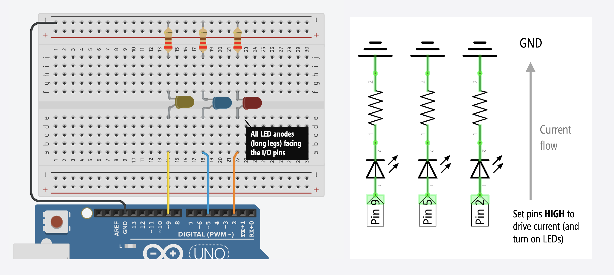
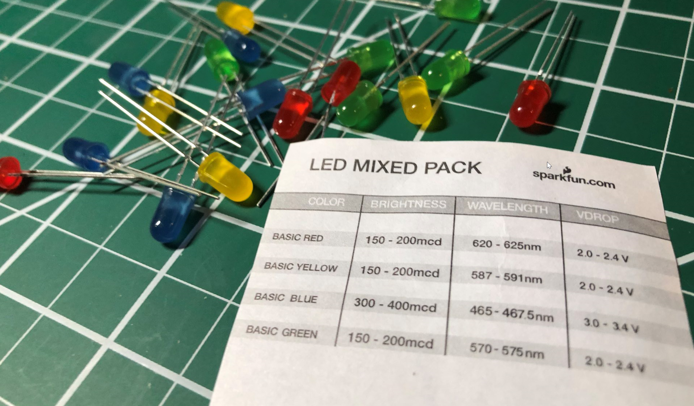

# {{ page.title | replace_first:'L','Lesson '}}
{: .no_toc }

## Table of Contents
{: .no_toc .text-delta }

1. TOC
{:toc}
---

In this lesson, we will learn how to blink multiple LEDs at different rates and build our first [C/C++ class](http://www.cplusplus.com/doc/tutorial/classes/), which will greatly simplify our code and, as an added bonus, reduce its size by eliminating code redundancy! 

As with our previous lesson on [crossfading RGB LEDs](rgb-led-fade.md), this lesson involves **simple circuits** but comparatively **complex code**. Often, when using microcontrollers, our code is the magic sauce—the circuits are straightforward but the code can be complicated.


## Background

The canonical and beloved **first Arduino sketch**, [Blink](https://www.arduino.cc/en/tutorial/blink), enables beginners to quickly build and write code for a circuit. The code looks something like this, which we covered in our own [Blink lesson](led-blink.md):


void setup() {
  // set Pin 3 to output
  pinMode(3, OUTPUT);
}

void loop() {
  digitalWrite(3, HIGH);  // turn LED on (output 5V)
  delay(1000);            // wait one second
  digitalWrite(3, LOW);   // turn LED off (output 0V)
  delay(1000);            // wait another second
}


Blink is easy. It's gratifying. But... it sets up a flawed mental model about how to structure programs and when/how to use [`delay()`](https://www.arduino.cc/reference/en/language/functions/time/delay/).

What if you want to blink multiple LEDs at **different rates**? How would you do this with `delay()`? Well, **you can't.** While in a `delay()`, your program is literally *doing nothing* (well, it's stuck in a `while` loop waiting for the delay period to finish but that's essentially nothing).

So, what should we do instead? We **eliminate all delays** and track time and state using [state machines](https://en.wikipedia.org/wiki/Finite-state_machine). Alternatively, we could use interrupts (but we'll cover that later).

## Materials

You'll need **three LEDs**—we'll use red, blue, and yellow but you can use whatever LEDs you want—along with current limiting resistors, a breadboard, and an Arduino.

| Breadboard | Arduino | Three LEDs | Three Resistors |
|:-----:|:-----:|:-----:|:-----:|
|  |     |  |  |
| Breadboard | Arduino Uno, Leonardo, or similar  | Three LEDs (We'll use a red, blue, and yellow) | **Three** 220Ω Resistors |

## Circuit

The circuit is the same as our basic [LED blink lesson](led-blink.md) but we duplicate it three times—once for each LED. We could use any of the Arduino's GPIO pins, but we chose Pins 2, 5, and 9 simply to space out the circuit and make it easier to read.

By now, this circuit and wiring should feel familiar. Indeed, you may not even need a wiring diagram like this to help!



Recall that each LED color has a unique forward voltage Vf. In this case, our red LED has a Vf between 2.0-2.4V, our blue LED between 3.0-3.4V, and our yellow LED between 2.0-2.4V. To simplify things, we'll use the same value resistor for each LED circuit (220Ω); however, you could use different resistors for each LED to try and balance brightness levels.


The [LED assorted pack ](https://www.sparkfun.com/products/12062) from Sparkfun.com, which shows the Vdrop (or Vf) for each LED.
{: .fs-1 }

## Writing code

We are going to implement two multi-rate blinking approaches:

1. The first introduces the overall idea of using state tracking variables and state change timestamps to control timing output without `delays()`.
2. The second will use the same approach but simplified using object-oriented programming. Here, we'll also show you how to make and use a `C++` class in Arduino.

### Multi-rate blinking: an initial approach

For our initial approach, we need four things for each LED:

1. **Pin number:** An integer value specifying the output pin.
2. **Blink interval:** A per-LED *interval* that controls how long to turn on (`HIGH`) and off (`LOW`) the LED.
3. **Toggle timestamp:** The *last time the LED was toggled* from `HIGH` to `LOW` or `LOW` to `HIGH`.
4. **Current LED state:** The *current LED state* (either `HIGH` or `LOW`), which is toggled every blink interval.

#### Blink interval

For the **blink interval**, we'll use `const` variables like `LED1_BLINK_INTERVAL_MS`, `LED2_BLINK_INTERVAL_MS`, and `LED3_BLINK_INTERVAL_MS`


const int LED1_OUTPUT_PIN = 2;
const int LED1_BLINK_INTERVAL_MS = 200; // interval at which to blink LED1 (in milliseconds)

const int LED2_OUTPUT_PIN = 5;
const int LED2_BLINK_INTERVAL_MS = 333; // interval at which to blink LED2 (in milliseconds)

const int LED3_OUTPUT_PIN = 9;
const int LED3_BLINK_INTERVAL_MS = 1111; // interval at which to blink LED3 (in milliseconds)


#### Toggle timestamps and LED states

For the **toggle timestamps** and **LED states**, we'll use variables like `_led1LastToggledTimestampMs` and `_led1State`. We can toggle `ledState` simply by: `ledState = !ledState`.


unsigned long _led1LastToggledTimestampMs = 0; // tracks the last time LED1 was updated
int _led1State = LOW; // will toggle between LOW and HIGH

unsigned long _led2LastToggledTimestampMs = 0; // tracks the last time LED2 was updated
int _led2State = LOW; // will toggle between LOW and HIGH

unsigned long _led3LastToggledTimestampMs = 0; // tracks the last time LED3 was updated
int _led3State = LOW; // will toggle between LOW and HIGH


To capture timestamps, we'll use Arduino's [`millis()` ](https://www.arduino.cc/reference/en/language/functions/time/millis/) function, which returns "*the number of **milliseconds** passed since the Arduino board began running the current program*" as an `unsigned long`. 

On the Arduino, the `unsigned long` data type is 32 bits (4 bytes), which ranges from `0` to `4,294,967,295` (2^32 - 1). Thus, `millis()` will overflow—go back to zero and begin again—after `4,294,967,295` milliseconds (or approximately 50 days). If you need more precise timing, you could use `micros()`, which provides **microsecond resolution** rather than millisecond resolution but `micros()` overflows every ~70 minutes.

#### Blinking without delays logic

We then use the same general logic as the "blinking without delays" [covered previously](led-blink#blink-without-using-delays) for each LED:


unsigned long currentTimestampMs = millis();

// Check to see if we reached the toggle state interval for LED1 
if (currentTimestampMs - _led1LastToggledTimestampMs >= LED1_BLINK_INTERVAL_MS) {
  _led1LastToggledTimestampMs = millis();
  _led1State = !_led1State;
  digitalWrite(LED1_OUTPUT_PIN, _led1State);
}

// Check to see if we reached the toggle state interval for LED2
if (currentTimestampMs - _led2LastToggledTimestampMs >= LED2_BLINK_INTERVAL_MS) {
  _led2LastToggledTimestampMs = millis();
  _led2State = !_led2State;
  digitalWrite(LED2_OUTPUT_PIN, _led2State);
}

... // and so on, copy the above block of code for each LED you're trying to blink


#### Tracking timestamps and overflow

This sub-section provides more background on tracking timestamps and overflow. Feel free to skip this if you'd like.

An important question to ask is: what happens if my Arduino needs to run for more than ~50 days and I'm relying on `millis()` to track time? Will the subtraction math (`currentTimestampMs - _lastToggledTimestampMs >= LED_BLINK_INTERVAL_MS`) still work? Even during an overflow condition?

Great question! And yes, it will still work! And the reason is because we are using `unsigned` data types, which inform the compiler that these values can never be `< 0`. This is crucial.

For example, imagine that `_lastToggledTimestampMs` is `4,294,967,290` or `0xFFFFFFFA` in hexadecimal (32 bits), which is 5 milliseconds from overflow. And then imagine that `millis()` overflows (returns back to 0) and `currentTimestampMs` becomes, say, `1` or `0x00000001`. So, our subtraction is then: `0x00000001 - 0xFFFFFFFA`. There is `7` milliseconds difference between these two numbers, so we'd like the subtraction to result in `7`:

```
1. 0xFFFFFFFA
2. 0xFFFFFFFB
3. 0xFFFFFFFC
4. 0xFFFFFFFD
5. 0xFFFFFFFE
-. (0xFFFFFFFF) <-- overflow
6. 0x00000000
7. 0x00000001
```

And this is what we get! Feel free to experiment with this yourself by running the code below on you Arduino. We also suggest [this article](https://www.baldengineer.com/arduino-millis-plus-addition-does-not-add-up.html) by James Lewis about `millis()`, overflow, and arithmetic for more background.  


unsigned long _lastToggledTimestampMs = 4294967290; // change this to experiment with overflow

void setup() {
  Serial.begin(9600);
  delay(2000);
}

void loop() {

  unsigned long currentTimestampMs = 1;
  unsigned long diff = currentTimestampMs - _lastToggledTimestampMs;

  Serial.println("The subtraction between: currentTimestampMs - lastToggledTimestampMs is: ");
  Serial.print(currentTimestampMs);
  Serial.print(" - ");
  Serial.print(_lastToggledTimestampMs);
  Serial.print(" = ");
  Serial.println(diff);
  delay(1000);

  _lastToggledTimestampMs++;
}


#### The full code for multi-rate blinking

OK, now back to the code. So, our full code for multi-rate blinking is below:

<script src="https://gist-it.appspot.com/https://github.com/makeabilitylab/arduino/blob/master/Basics/digitalWrite/BlinkMultiple/BlinkMultiple.ino?footer=minimal"></script>

#### Workbench video

<iframe width="736" height="414" src="https://www.youtube.com/embed/8DHhmXr3mC8" frameborder="0" allow="accelerometer; autoplay; encrypted-media; gyroscope; picture-in-picture" allowfullscreen></iframe>

### Multi-rate blinking: an object-oriented approach

Given the amount of code redundancy and shared logic and structure, the above solution is a strong candidate for refactoring into functions or classes. So, let's do it! 

We're going to define a new class, called `Blinker`, which will greatly simplify our code, decrease redundancy (and the potential for human error), and even make our compiled code smaller (from 1,118 to 1,042 bytes of program storage space). 

Once we've made the `Blinker` class, our main code reduces to:


Blinker _led1Blinker(2, 200);  // specify pin and blink interval (200ms)
Blinker _led2Blinker(5, 333);  // specify pin and blink interval (333ms)
Blinker _led3Blinker(9, 1111); // specify pin and blink interval (1111ms)

// The setup function runs once when you press reset or power the board
void setup() {
  // empty 
}

// The loop function runs over and over again forever
void loop() {
  _led1Blinker.update();
  _led2Blinker.update();
  _led3Blinker.update();
}


But we have to make the `Blinker` class first, which we do below!

#### Making the Blinker class

If you're familiar with object-oriented programming and declaring and using classes in `Java`, `C#`, `Python`, and even, to some extent, `JavaScript` since [ECMAScript 2015](https://developer.mozilla.org/en-US/docs/Web/JavaScript/Reference/Classes), then `C++` classes will feel familiar (but certainly have their own peculiarities). `C++` classes have a class name, member variables, member functions, and like `C#` and `Java`, access specifiers (*e.g.,* private, public). For a quick tutorial, see these links ([link1](https://www.geeksforgeeks.org/c-classes-and-objects/), [link2](http://www.cplusplus.com/doc/tutorial/classes/)).

To build our Blinker class, recall that we need four things per LED:
1. **Pin Number:** An integer value specifying the output pin.
2. **Blink Interval:** A *blink interval* that controls how long to turn on (`HIGH`) and off (`LOW`) each LED. 
3. **Toggle Timestamp:** The *last time the LED was toggled* from `HIGH` to `LOW` or `LOW` to `HIGH`. 
4. **Current LED State:** The *current LED state* (either `HIGH` or `LOW`), which is toggled every blink interval.

For the `Blinker` class, we are simply going to convert these four things into member variables:


class Blinker{

  private:
    const int _pin;                 // output pin
    const unsigned long _interval;  // blink interval in ms

    int _state;                     // current state (either HIGH OR LOW)
    unsigned long _lastToggledTimestamp; // last state toggle in ms

  ... // more here


Finally, we need two functions: a `constructor` and `update()`—the latter which handles our core logic and toggling code and is intended to be called once per `loop()` iteration. We are going to declare these in the class definition itself:


  public: 
    // Constructor
    Blinker(int pin, unsigned long blinkInterval) :
        _pin(pin), _interval(blinkInterval) // initialize const like this in C++
    {
      _state = LOW;
      _lastToggledTimestamp = 0;
      pinMode(_pin, OUTPUT);
    }

    /**
    * Calculates whether to toggle output state based on the set interval
    * Call this function once per loop()
    */ 
    void update(){
      unsigned long currentTimestampMs = millis();
        
      if (currentTimestampMs - _lastToggledTimestamp >= _interval) {
        _lastToggledTimestamp = currentTimestampMs;
        _state = !_state;
        digitalWrite(_pin, _state);
      }
    }


In order to use the `Blinker` class (as shown above), it needs to be defined within your `.ino` sketch at the top of the file (before you try to instantiate a Blinker object). Later, we'll also show how to create a class that exists in its own `.h` and `.cpp` files.

#### Full Blinker code

So, the entire code looks like this:

<script src="https://gist-it.appspot.com/https://github.com/makeabilitylab/arduino/blob/master/Basics/digitalWrite/BlinkMultipleWithInternalClass/BlinkMultipleWithInternalClass.ino?footer=minimal"></script>

### Multi-rate blinking: using an external class

In `C++`, you declare member variables and function signatures in a `.h` file and the function implementations in a `.cpp` file. This is often a cleaner solution than embedding classes within the `.ino` itself. 

Indeed, if we move `Blinker` into separate `.h` and `.cpp` files, then the full `.ino` sketch simply looks like:

<script src="https://gist-it.appspot.com/https://github.com/makeabilitylab/arduino/blob/master/Basics/digitalWrite/BlinkMultipleWithExternalClass/BlinkMultipleWithExternalClass.ino?footer=minimal"></script>

See the [code in our GitHub repository](https://github.com/makeabilitylab/arduino/tree/master/Basics/digitalWrite/BlinkMultipleWithExternalClass).

#### Workbench video

<iframe width="736" height="414" src="https://www.youtube.com/embed/vb5l8Tncedo" frameborder="0" allow="accelerometer; autoplay; encrypted-media; gyroscope; picture-in-picture" allowfullscreen></iframe>

## Exercises

Want to go further? Here are some design challenges to help improve your skills:

- **Dynamically changing intervals.** What if we wanted to support dynamically changing blink intervals—that is, once the Blinker object was instantiated. How would you do this?
- **Morse code**. Try adapting the Blinker class to support a sequence of on and off intervals like [Morse code](https://en.wikipedia.org/wiki/Morse_code)
- **Fade**. What about *fading* the LEDs rather than flashing them. How would you do this? **Stuck?** Nick Gammon wrote a class for this on his [blog](https://www.gammon.com.au/blink) called LedFader but don't look at his solution until you've tried your own!

## References

Some additional references:

- [Multi-tasking the Arduino: Part 1 - Blinking without delays](https://learn.adafruit.com/multi-tasking-the-arduino-part-1/overview), Adafruit Learn
- [Multi-tasking the Arduino: Part 2 - Using interrupts](https://learn.adafruit.com/multi-tasking-the-arduino-part-2/overview), Adafruit Learn
- [Multi-tasking the Arduino: Part 3](https://learn.adafruit.com/multi-tasking-the-arduino-part-3/overview), Adafruit Learn
- [How to do multiple things at once](https://www.gammon.com.au/blink), Nick Gammon

## Next Lesson

We did it! This completes our [Intro to Output](intro-output.md) series. Let's now begin [Intro to Input](intro-output.md) to learn about buttons, sensors, voltage dividers, and more!

<!-- In the next lesson, we'll learn about making sound with passive piezoelectric buzzers and the [`tone()`](https://www.arduino.cc/reference/en/language/functions/advanced-io/tone/).

<span class="fs-6">
[Previous: LED Blink 2](led-blink2.md){: .btn .btn-outline }
[Next: Cross-fading RGB LEDs](rgb-led-fade.md){: .btn .btn-outline }
</span> -->