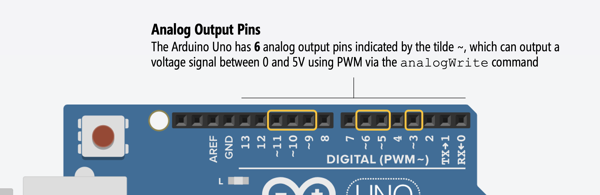
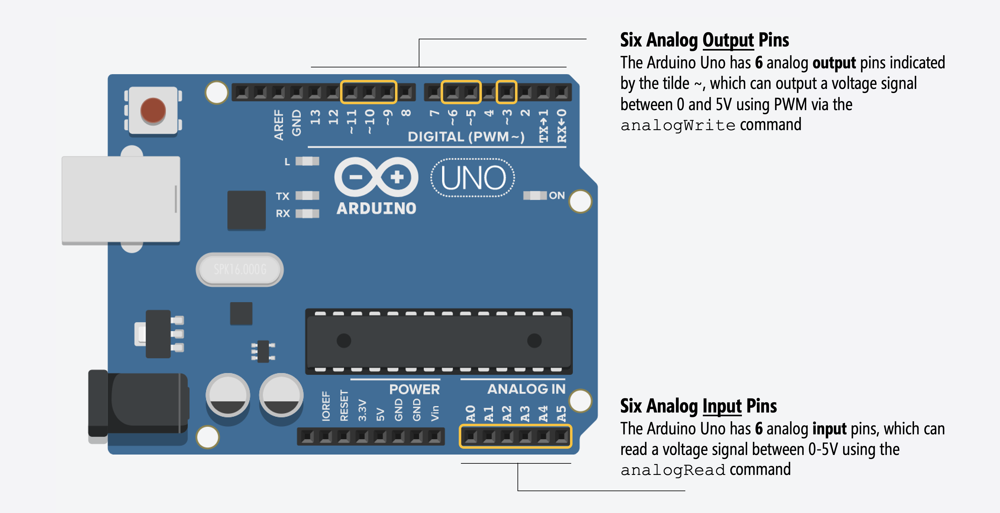

# {{ page.title | replace_first:'L','Lesson '}}
{: .no_toc }

## Table of Contents
{: .no_toc .text-delta }

1. TOC
{:toc}
---

In the [previous lesson](led-blink.md), we learned how to turn on and off an LED using [`digitalWrite`](https://www.arduino.cc/reference/en/language/functions/digital-io/digitalwrite/)—which worked by alternatively setting Pin 3 to 5V (`HIGH`) and 0V (`LOW`). In this lesson, we'll learn how to programmatically control the output voltage at finer gradations using [`analogWrite`](https://www.arduino.cc/reference/en/language/functions/analog-io/analogwrite/). More specifically, we will gradually fade an LED on and off.

This illustrative animation doesn't show current (the yellow circles) only due to my limited animation skills. But hopefully you can visualize (in your mind) how the LED varies in brightness with current just the same. :)
{: .fs-1 }

## Materials
You will use the same materials as [before](led-blink.md), including the [Arduino IDE](https://www.arduino.cc/en/main/software) and a USB cable to upload your program from your computer to your Arduino.

| Arduino | LED | Resistor |
|:-----:|:-----:|:-----:|
| Arduino Uno, Leonardo, or similar  | Red LED | 220Ω Resistor |
|     |  |  |
| Arduino Uno, Leonardo, or similar  | Red LED | 220Ω Resistor |

## Making the circuit

As noted in our previous lesson, the Arduino Uno has 14 digital I/O pins:

However, **6** of the 14 I/O pins can also be used for "analog" output—voltage output that is not just `HIGH` (5V) or `LOW` (0V) but between these two extremes. These analog output pins are indicated by the tilde (`~`) printed next to the pin on the Arduino (silkscreened directly on the Arduino's PCB).

So, for this lesson, we **don't** have to change our circuit at all! You can keep the same circuit as the [LED Blink lesson](led-blink.md). Indeed, this is the reason why we selected Pin 3 in the first place.

---
**IMPORTANT NOTE:**

A common confusion amongst beginners is mixing up the analog **output** pins and the analog **input** pins. For the digital I/O, the input and output pins are the same and configurable to `INPUT` or `OUTPUT` using the [`pinMode`](https://www.arduino.cc/reference/en/language/functions/digital-io/pinmode/) command, the analog I/O pins are different! See the figure below:

We'll learn about analog output in this lesson (using [`analogWrite`](https://www.arduino.cc/reference/en/language/functions/analog-io/analogwrite/)). In a future lesson, we will learn about analog input (using [`analogRead`](https://www.arduino.cc/reference/en/language/functions/analog-io/analogread/))

---

## Writing the code

To gradually fade an LED, we are going to use the [`analogWrite(int pin, int value)`](https://www.arduino.cc/reference/en/language/functions/analog-io/analogwrite/)) function, which takes in a pin as the first parameter and an 8-bit value between 0-255 as the second. This 8-bit value is directly proportional to the voltage output: so, 0 is 0V, 255 is 5V, 128 is 2.5V, 168 is 3.3V, *etc.* This means that the settable voltage granularity is `5V/255=~0.0196V`.

<!-- TODO: come up with a figure to explain this. -->

---

**SIDE NOTE:**

The Arduino Uno, Leonardo, Nano, Mega, and many other Arduino boards do not actually provide true analog output via a digital-to-analog converter (DAC). Instead, they use a method called Pulse-Width Modulation (PWM) to *emulate* analog output. For most purposes—like changing the brightness of an LED or controlling the speed of a motor—this won't matter; however, if you want to output a high-frequency sinusoidal waveform—a true analog output signal—like playing music, then you'll need to either find an Arduino microcontroller with a built-in DAC (like the [Due](https://store.arduino.cc/usa/due); see this [SimpleAudioPlayer tutorial](https://www.arduino.cc/en/Tutorial/SimpleAudioPlayer) or connect your Uno to an external DAC board (like this [SparkFun MP3 Player Shield](https://learn.sparkfun.com/tutorials/mp3-player-shield-hookup-guide-v15/all)).

If you want to learn more about PWM, read this [guide from ITP NYU](https://itp.nyu.edu/physcomp/lessons/microcontrollers/analog-output/) and/or watch their "analog output" video:

<!-- TODO: come up with a figure to explain this. -->

<iframe src="https://player.vimeo.com/video/93554355" style="position:absolute;top:0;left:0;width:100%;height:100%;" frameborder="0" allow="autoplay; fullscreen" allowfullscreen></iframe>

---

OK, so let's write some code!

### Step 1: Start a new sketch in the Arduino IDE

Start a new sketch in the Arduino IDE:

### Step 2: Write initialization code

Our initialization code is the same as for [LED blink](led-blink.md) except for the addition of `const int MAX_ANALOG_OUT = 255;` and a constant for the delay amount of 30 milliseconds (`const int DELAY_MS = 30;`).


const int LED_OUTPUT_PIN = 3;
const int MAX_ANALOG_OUT = 255; // the max analog output on the Uno is 255
const int DELAY_MS = 5;

void setup() {
  // set Pin 3 to output
  pinMode(LED_OUTPUT_PIN, OUTPUT);
}


### Step 3: Write fade loop

Now, write code that outputs steadily increasing values for [`analogWrite`](https://www.arduino.cc/reference/en/language/functions/analog-io/analogwrite/) (to fade on) followed by steadily decreasing values (to fade off).


void loop(){
  // fade on
  for(int i = 0; i <= MAX_ANALOG_OUT; i += 1){
    analogWrite(LED_OUTPUT_PIN, i);
    delay(DELAY_MS);
  }

  //fade off
  for(int i = MAX_ANALOG_OUT; i >= 0; i -= 1){
    analogWrite(LED_OUTPUT_PIN, i);
    delay(DELAY_MS);
  }
}


The full code is:

### Step 4: Compile, upload, and run!
Now, compile, upload, and run the code.

<iframe style="width:100%;height:100%;" src="https://www.youtube.com/embed/Y0mSFmW7G4U" frameborder="0" allow="accelerometer; autoplay; encrypted-media; gyroscope; picture-in-picture" allowfullscreen></iframe>

## Improved fading approach: limiting delays

Generally, we want to limit the use of `for` loops and `delays` in our code. Why? Because while we are in a delay, we can't do anything else: we can't read or respond to other input (side note: we could use interrupts but let's defer that point for now).

So, let's rewrite the fade example but without for loops. While the code below is different, the resulting LED fade behavior is the same (so you won't notice a difference if you try them both out).

---

**NOTE:**

I have a habit of prefixing my global variables by `_` but this is just my own convention and helps me easily discern between local variables and global variables.

---


const int LED_OUTPUT_PIN = 3;
const int MAX_ANALOG_OUT = 255; // the max analog output on the Uno is 255
const int DELAY_MS = 5;

int _fadeAmount = 5;      // the amount to fade the LED by on each step
int _curBrightness = 0;   // how bright the LED is

// The setup function runs once when you press reset or power the board
void setup() {
  // set the LED pin to as an output
  pinMode(LED_OUTPUT_PIN, OUTPUT);
  Serial.begin(9600); // for using Serial.println
}

// The loop function runs over and over again forever
void loop() {
  
  // set the brightness of the LED pin
  analogWrite(LED_OUTPUT_PIN, _curBrightness);

  // change the brightness for next time through the loop
  _curBrightness = _curBrightness + _fadeAmount;

  // reverse the direction of the fading at the end of each fade direction
  if (_curBrightness <= 0 || _curBrightness >= MAX_BRIGHTNESS) {
    _fadeAmount = -_fadeAmount; // reverses fade direction
  }
  
  // wait for 30 milliseconds to see the dimming effect
  delay(DELAY_MS);
}


## Visualizing the voltage output

We can visualize the (effective) voltage output on Pin 3 using the Arduino IDE's [Serial Plotter](https://learn.adafruit.com/experimenters-guide-for-metro/circ08-using%20the%20arduino%20serial%20plotter).

<video controls="controls">
  <source src="assets/movies/Arduino_LEDFadeWithGraph_Pin3.mp4" type="video/mp4">
</video>

Of course, it's the **current** through the LED that determines brightness. Again, given Ohm's Law ($$I = \frac{V}{R}$$), we can determine the current through our circuit at various Pin 3 outputs. TODO: verify these with multimeter because need to check when LED actually turns on due to Vf conditions being met.

| Pin 3 Value | Pin 3 Voltage | Resistor | Resulting Current |
|:-------------|:-------------|:-------------|:-------------|:------------------|
| 0 | 0V | 220Ω | $$I = \frac{0V}{220Ω}= 0.0mA $$ |
| 45 | 0.88V | 220Ω | $$I = TODO $$ |
| 103 | 2.02V | 220Ω | $$I = TODO $$ |
| 128 | 2.51V | 220Ω | $$I = TODO $$ |
| 199 | 3.9V | 220Ω | $$I = TODO $$ |
| 255 | 5V | 220Ω | $$I = TODO $$ |

## Next Lesson

In the next lesson, we will learn about the difference between **current sources** and **current sinks** to help reinforce our understanding of how microcontrollers drive output.

[Previous: LED Blink](led-blink.md){: .btn .btn-outline }
[Next: LED Blink 2](led-blink2.md){: .btn .btn-outline }

