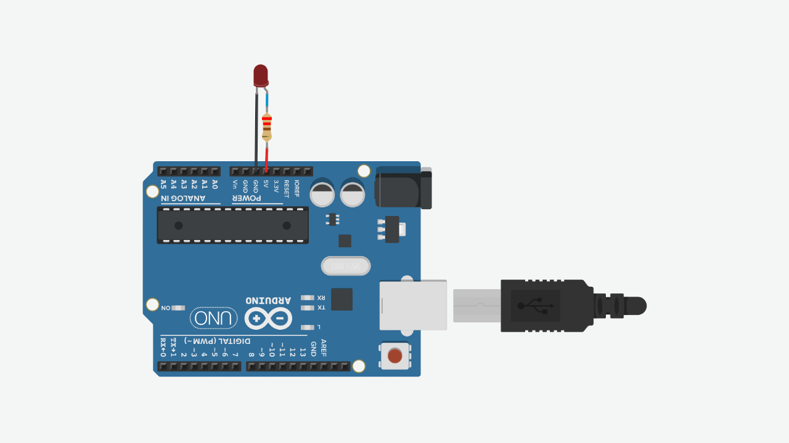
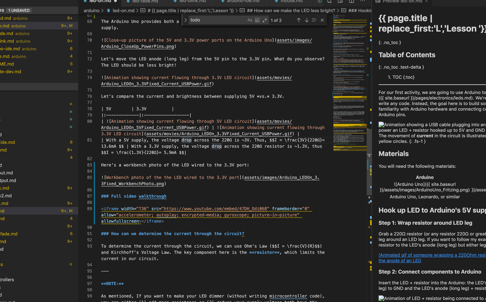
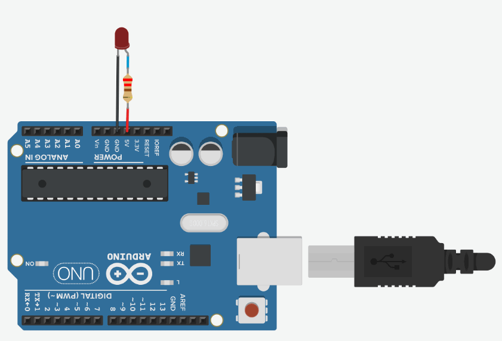
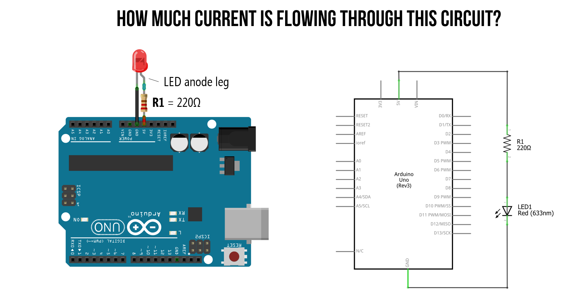
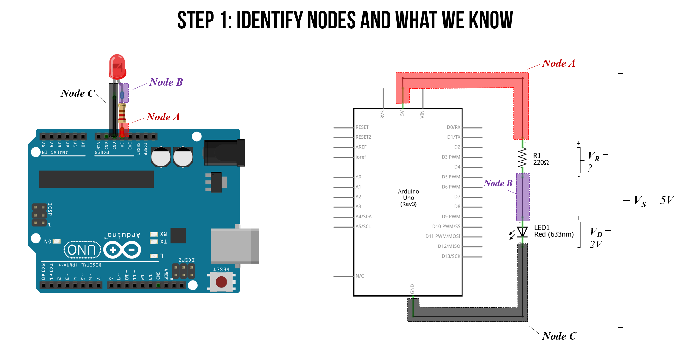
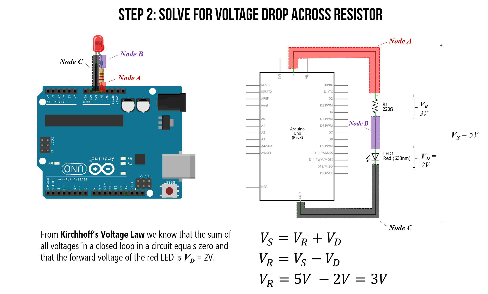
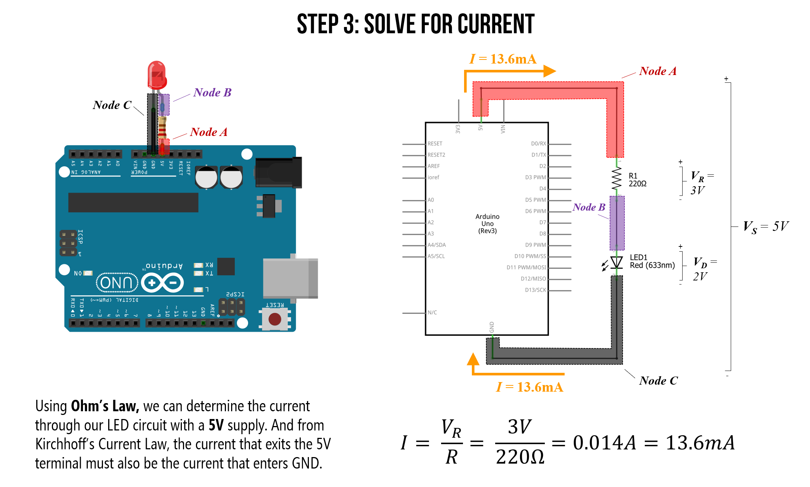
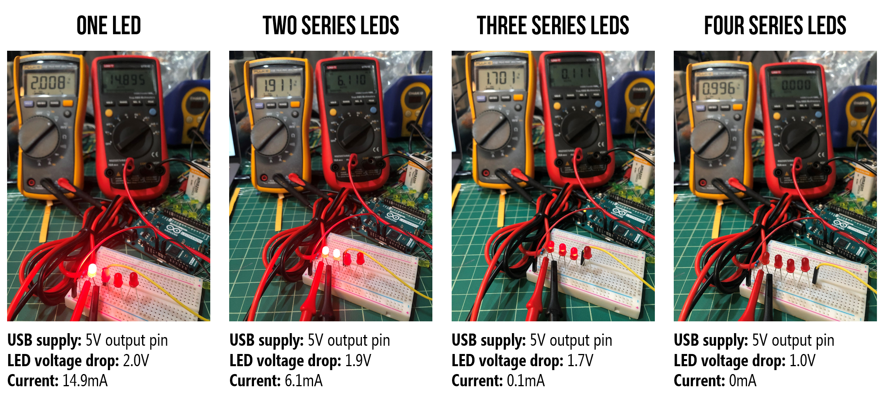
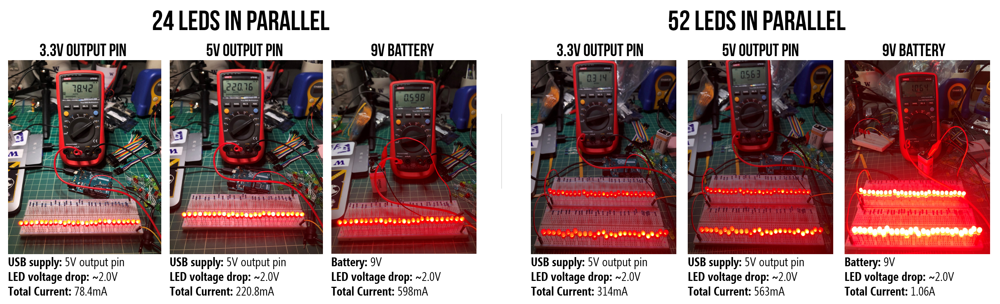
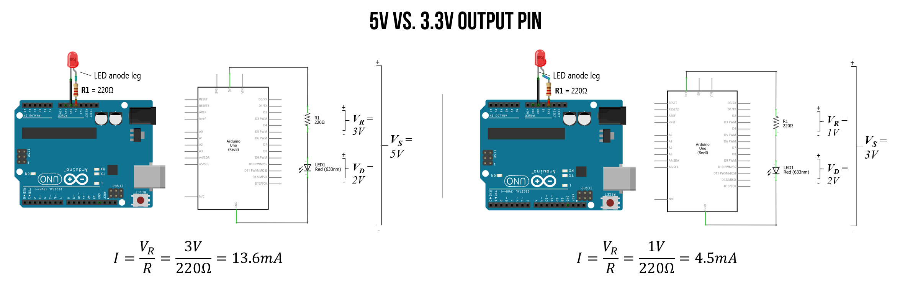

# {{ page.title | replace_first:'L','Lesson '}}
{: .no_toc }

## Table of Contents
{: .no_toc .text-delta }

1. TOC
{:toc}
---
For our first learning activity, we are going to use Arduino to turn on an [LED]({{ site.baseurl }}/pages/electronics/leds.md). We're **not** going to write any code. Instead, our goal is to build some initial familiarity with Arduino hardware and connecting components to Arduino pins before we introduce programming, which we do in the [next lesson](led-blink.md).

**Figure** The movement of **current** in the circuit is illustrated by the animated yellow circles. This visualization is a coarse abstraction designed to emphasize the direction of current flow. A more accurate visualization would show that electrons are already distributed throughout a wire before a voltage is applied. See our [Introduction to Electronics](../electronics/index.md) series, specifically the lesson on [Voltage, Current, and Resistance](../electronics/electricity-basics.md).
{: .fs-1 }

## Materials

For this lesson, you will need the following materials. Please build with us to advance your understanding and skillset—the best way to learn is by **doing!**. For those students enrolled in our courses, please document your creation journeys in your prototyping journals and attempt to answer and reflection on posed questions. 

| Arduino | LED | Resistor |
|:-----:|:-----:|:-----:|
|     |  |  |
| Arduino Uno, Leonardo, or similar  | Red LED | 220Ω Resistor |

We'll be using the [Arduino Leonardo](https://www.arduino.cc/en/Main/Arduino_BoardLeonardo) for these introductory microcontroller lessons but any 5V board will work, including the [Arduino Uno](https://store.arduino.cc/usa/arduino-uno-rev3), Adafruit's [METRO 328](https://www.adafruit.com/product/50), Sparkfun's [RedBoard](https://www.sparkfun.com/products/13975), *etc.* Each of these boards have the same pin layout and general specifications.

## Hook up LED to Arduino's 5V supply pin

### Step 1: Wrap resistor around LED leg

Grab a 220Ω resistor (or any resistor 220Ω or greater) and twist one leg around an LED leg. If you want to follow my example *exactly*, connect the resistor to the LED's anode (long leg) but either leg will work. (Remember, a current limiting resistor can go on either side of an LED, see our [LED lesson](../electronics/leds.md)).

To wire wrap your components, simply twist the legs together like this:

<video autoplay loop muted playsinline style="margin:0px">
  <source src="../electronics/assets/videos/WireWrapAnLED_ByJonFroehlich.mp4" type="video/mp4" />
</video>
**Video.** An example of wire wrapping a 220Ohm resistor leg (or lead) directly around the anode of an LED
{: .fs-1 }

### Step 2: Connect components to Arduino

Insert the LED + resistor into the Arduino: the LED's cathode (short leg) to GND and the LED's anode (long leg) + resistor to the Arduino's voltage supply, which you can access via the 5V pin. 

### Step 3: Connect your Arduino to power

Now connect your Arduino to power and the LED should light up. You did it!

Here's a photo of the version I made. I found it easier to stretch the wiring across the Arduino from the 5V port to the GND on the opposite side.

For power, you can use a USB cable (which supplies 5V) or a 9V battery (which supplies 9V). Either way, the Arduino **supplies 5V** through the 5V pin. How? Using a [voltage regulator](https://itp.nyu.edu/physcomp/labs/labs-electronics/components/). See "More Info" below.

| USB Power        | 9V Power          |
|:-------------|:------------------|
|  |  |
| With USB power, the 5V pin supplies 5V | Using the Arduino's barrel jack, we can connect an external power supply like a 7-12V wall adapter or a 9V battery. The Arduino's internal voltage regulator reduces these higher voltages to output a clean 5V |

### Let's analyze our circuit

Just as we did in our [LED lesson](../electronics/leds.md), let's analyze how much current is flowing through this simple LED-based circuit. To do this, we first need to determine the voltage drop across the resistor $$V_R$$ and then use Ohm's Law to figure out the current ($$I = \frac{V_R}{R}$$).

#### Step 1: Identify nodes and what we know

We always start by identifying nodes and what we know. We know that as long as $$V_f$$ is satisfied, that there will be a voltage drop $$V_R$$ across our resistor and a voltage drop $$V_D$$ across our LED.

Due to Kirchhoff's Circuit Laws, we know that the total voltage drop across both the resistor and LED ($$V_R + V_D$$) must equal our supply voltage $$V_S=5V$$. From our [LED lesson](../electronics/leds.md), we know that our circuit is off until the "on" or "forward" voltage of our LED is met, which for a red LED is ~2V. Thus, we can set $$V_D=2V$$ and solve for $$V_R$$.

#### Step 2: Solve for voltage drop across the resistor
Solving for $$V_R$$:

$$
V_S = V_R + V_D \\
V_R = V_S - V_D \\
V_R = 5V - 2V = 3V$$

#### Step 3: Solve for current

From Ohm's Law, we know that the total current in our circuit is equal to the voltage drop across our resistor $$V_R$$ divided by the resistance value $$R$$. That is, $$I = \frac{V_R}{R}$$. And we know that $$V_R=3V$$ and $$R=220Ω$$. Thus, the current through our circuit is:

$$I = \frac{V_R}{R} \\
I = \frac{3V}{220Ω} = 0.014A = 13.6mA$$

So, with the 5V supply pin, our circuit is drawing 13.6mA of current. Is this a lot or a little? Let's put this in context below.

### Maximum current draw

The Arduino has a variety of pin types, each with their own maximum current ratings. 

- **I/O Pins**: The maximum current draw of any **single** I/O pin—which we haven't used yet but we will in the [next lesson](led-blink.md)—is **40 mA** (a safer, continuous range is ~20mA). The total current across all I/O pins together is **200mA**. If we exceed these values, we could damage our Arduino board or the underlying microcontroller (the ATmega328 for the Uno or the ATmega32u4 for the Leonardo)

- **Power supply pins**: The **5V output pin** can supply ~400-500mA when powered by USB and ~900-1000mA when using an external power adapter. The **3.3V output pin** can supply ~150mA; however, if you have both 3.3V and 5V output pins connected, any current drawn from the 3.3V pin will be counted against 5V's total current. 

The only protection fuse is a [resettable polyfuse](https://www.littelfuse.com/products/polyswitch-resettable-ptcs.aspx) on the USB port, which limits current to 500mA on the 5V output pin (but only when powered by USB).

There are a variety of discussions about the Arduino Uno and Leonardo's maximum current draw online. The best resource I've found are these StackExchange posts, which also link to datasheets ([post1](https://electronics.stackexchange.com/a/67094), [post2](https://electronics.stackexchange.com/questions/67092/how-much-current-can-i-draw-from-the-arduinos-pins)).

#### Maximum number of LEDs in series

An interesting question to ponder then is: with the Arduino powered via USB (max 500mA current), how many red LEDs could you hook up in series to the 5V supply pin? How about in parallel? What is the limiting factor for each?

Well, for a simple series configuration, the total number of series LEDs is limited to the voltage supply, which is 5V. With a 200Ω resistor and a red LED with a "forward" voltage of $$V_f=2V$$, we are limited to a maximum of two LEDS: $$2 * 2V = 4V$$. However, in practice, I was able to get three LEDs in series (because the LED begins to turn on a bit around ~1.7-1.8V) though they were quite dim. See the table and image below for my measurements.

<!-- | Resistor | Num Red LEDs in Series | Voltage Drop Across Each LED | Voltage Drop Across Resistor | Current |
|----------|--------------|------------------------------|------------------------------|---------|
| 200Ω     | 1            | 2.07V                        | 2.91                         | 14.6mA  |
| 200Ω     | 2            | 1.95V                        | 1.16V                        | 5.8mA   |
| 200Ω     | 3            | 1.71V                        | 0.016V                       | 0.08mA  |
| 200Ω     | 4            | 1.06V                        | ~0V                          | ~0 mA   |

**Table**. I used the Adafruit 5mm diffused RED LEDs for this ([link](https://www.adafruit.com/product/4203)). -->

| Resistor | Num Red LEDs in Series | Voltage Drop Across Each LED | Voltage Drop Across Resistor | Current |
|----------|--------------|------------------------------|------------------------------|---------|
| 200Ω     | 1            | 2.02V                        | 2.95                         | 14.9mA  |
| 200Ω     | 2            | 1.92V                        | 1.21V                        | 6.1mA   |
| 200Ω     | 3            | 1.71V                        | 0.021V                       | 0.1mA  |
| 200Ω     | 4            | 1.01V                        | ~0V                          | ~0 mA   |

**Table**. For this empirical measurement test, I used the [Sparkfun 5mm diffused RED LEDs](https://www.sparkfun.com/products/12062).

Here's a picture of the test setup and circuits for the measurements above:

**Figure**. Measuring the individual LED voltage drop and current through the circuit using two multimeters: the yellow multimeter configured as a voltmeter to measure the voltage drop $$V_D$$ over the first LED in the circuit and the red multimeter configured as a ammeter to measure the current $$I$$ through the circuit.

Finally, we can also examine this circuit in a simulator, which mirrors our empirical measurements:

<video autoplay loop muted playsinline style="margin:0px">
  <source src="assets/movies/LEDOn5V_Series_CircuitJS.mp4" type="video/mp4" />
</video>
**Video.** A [CircuitJS simulation](https://www.falstad.com/circuit/circuitjs.html?ctz=CQAgjCAMB0l3BWcMBMcUHYMGZIA4UA2ATmIxAUgpABZsKBTAWjDACgA3cQqhYlblTAZCUMTV5iqMBGwDugxTWKiwPcGwBOtFeBE7RKBKKpp5ivgOWjLGhdaW7hh8w6Oi3GASjYAPcEQg2BhCNEjB9DTcFABqbNhRAGZyACaaAPYADgA6AI4o0GBM9BDE0NgozKxQsDRWsNj8CTQ8LcpqUrCyala6mL2iFaYgyWlZeQVFJVI1kD49BkHYHrrYeFECoxk5+YXF4DMwc66raIvYyyA+CmpC6rd6JieD64sSpmwLDu9vNHhXI1S2wme2m0lm80IA1ohCiDgQYG8gLGO0m+wg4KO11+-2+sKuzwoiMWtmxFVofyCAlJnyhVNocHpNEpmyB412UwOmNgZIEayi5J+2OKkCiDxFYv0kHM5KG9IuLgWssusterJRIM5GM6xyV3i88rO6uBHPRhx5fhAxTWQRCVuwYGItsi0QQcQU5Pc9P6BI9Age5Ocvvtooo-HptnY2kD+k9xjEaGlCglikD904IaithTQfBEmo3NkAHNM2GBCmeP9pGwSw9I+pK1JLUwiOREVEW0hEeQxf8ACoAC00DAY2QAzgBlBiaACWDDH44AMgBRAAiC7HAAoYtOAJ7j1czgC2AEpLUQhIFmf6UE7eyAAGLpACumnHU9n86Xa43m4A8okiRnv4TCEBgXZGFaCDBAEuLgP2cjpO+05zhuK7rjWVoiP82bYSAjbVlwTB4bhhD-Lm4iSIW5jEWRihMHQ-rptoDExqIrHePGphwDRJHhhxZZ2FajH0SJQbCiJXoCT6PggXgcy2lQxF4PQES0K6cQLNJBoCXKxrsmiYI6pC5YiQqwmqhsyImoZXLGTRZlnLplzCnh4puVKDmWRZ1LhsKeCrJcTABTYfk0YiaZKRF-qecmIVUkp8XmSZVrxT6wWnMMWwGaCdnSBaIGIoQgx2iwKA0OQalijY7qpX08YZYYBr+U46iNY8wZleS2bxZGWh1ao+jtV63FJla0X0fFDzsERE3ZhNFFUPmSDUSWXW+eWE0EVAzasIy3bjXMqi4OpYD-H+AB2o5juhbBAA) of various LED series configurations with a 5V voltage supply.
{: .fs-1 }

#### Maximum number of LEDs in parallel

For the parallel configuration, the limiting factor is the total amount of current we can source, which with the 5V pin powered by USB, is 500mA. How many red LEDs does it take to exceed 500mA using 200Ω resistors?

Well, in a parallel configuration, each resistor+LED branch is getting ~$$I=\frac{V_R}{R}=\frac{3V}{200}=15mA$$. Thus, the maximum number of LEDs in parallel is $$\frac{500mA}{15mA}=33.3$$ rounded to 34.

**Figure.** 34 LEDs in parallel draws 514.1mA of current, which exceeds the maximum amount of the 5V output pin on the Arduino (when powered by USB). Here's the [CircuitJS link](https://tinyurl.com/yhyl2zpo).
{: .fs-1 }

<!-- <video autoplay loop muted playsinline style="margin:0px">
  <source src="assets/movies/LEDOn5V_Parallel_CircuitJS.mp4" type="video/mp4" />
</video>
**Video.** A [CircuitJS simulation](https://www.falstad.com/circuit/circuitjs.html?ctz=CQAgjCAMB0l3BWcMBMcUHYMGZIA4UA2ATmIxAUgpABZsKBTAWjDACgB3EFlbFcGjW5he-MBkJQ22IQDMOAEwBOAewAOAHQCOKaGCb0IxaH2asosGvxqxsxXoMKQahGsTCSqMSAjYf+LGDOICgIkoHBuEL88srq2rr6hlAp3ihsAB7CREgomNkuIbi04JIIAGqcwkHRNFQR0WEhVQ0CQq0eVOlcPHwgfPWskWjgbErVwZ0TtV4hcC0ifWCC022jAG7ZfQNbYhKptFRIszC+PUNCUas73cJweP3BLPf9I7cdK8-4a+zjXw9Tf4hOopNCQBY1V6DF47djnF7LdpBb5Td7Ih4oEFA0KSdL+O7fHEEh5XGKKVSaHR6AzgA5pPyEALufhEpjMx7RECxCkJanJE6wd7szH1YVNIUiNZsyWohYwkbS-iwsbcdmA4UgrrzeEoz5qlZw1WSq6KqHNHp4Dwc7iWyQ3Fr69q2n4qpjOwHOkWg7VGpUK53Ki1WxE24NOc2h3FYz3ihkBGPhAPBMlxSmJGkQAWQPGM7gYN5NJj5qikrnk+JUpK0rPvYvA+p1om1kYhost8PvAMKuvKv51wGNzVzcFBySt-sGlo9p49t4tRmXJ4Ls3Nqit5ch37cDfhpjLr1akd5kY7PeYs2Gs9Cdfn2U9fdY-ex-FXkKF5el7kV9P81KCuPcAgKAYoWQEksmZapryVaZn+2YtGB9aAcBb64ghKGtohd7buep6Ib2yEAruiEHsO863p8WGTj0+FPPhc49HQSpPExK7oQCnysZurpcburGkWC7FmkwrGBtwXGcUsHYtPxWL8c+uYiX0rKiRBX5pny1ZwTmATYNguKFnpdpqeWGkwXS-49EZSEGPpqERrZY6fNZ2FKX69TWQRjmlB5dkCT6blSi51HcJ5TyeQx3Beia0WRd5rZetxfyJbuXr+Ue3mnrFa4tIlnwpV0uUgl6TBpQpARleE0UmVBlYZhZ8H4pVSGfqZ0H1TWVRpcVxWxlweUzD5EYhjcIIEQVSHpVUm4rANoz9WNyZjZFI2TCs9pcDQHHXgak7jJu4YhlNm0ki260ttNu07de0lcEdIJHeVaxEqtnLqe1v5eP++JbfZv2tbVP5aV98EnUhv1NlUv0htDt3iadVD-Rd4yw4jGJDoJjHbbQ2OGv9wRI4VWPWiJCMOTN7TQ3t8NDaTSGHgs531IT80062qMORDckgWhL4Q4W+NvW1dWfRYjWKY94SvSEkE8iLwNi2is1YpL5NXcIBpw6Vy2DEzox-AduuDQzPRzSw6uXtL5uXHOQA) of a parallel  with a 5V voltage supply.
{: .fs-1 } -->

I attempted to "stress" test the maximum values a bit using the USB port on an old MacBook Pro (do not do this!). Even though I exceeded both the 500mA limit with the 5V output pin (563mA) and the 150mA limit with the 3.3V pin (314mA), I did not trigger the fuse. However, I only kept the board plugged in for a short time.

**Figure.** I "stress tested" the 5V output pin using the USB for power. Do not attempt! Despite exceeding the rated maximums, I failed to trigger the Arduino's internal fuse on the 5V or 3.3V supplies. Note, the I/O pins do not have such protect so you could damage your board if you overdraw current.
{: .fs-1 }

## Stepping down power supply voltages

If we plug in a 7-12V wall adapter or a 9V battery to the Arduino's barrel jack, then how does the Arduino convert these higher voltages to 5V? Using a component called a [voltage regular](https://itp.nyu.edu/physcomp/labs/labs-electronics/components/#Voltage_Regulator), which can take in a range of DC voltages and step it down (but not up) to a stable constant voltage. You can buy and use voltage regulators in your own projects. If you want to learn more about about the Arduino Uno's power supply sub-system, read this [technobyte blog post](https://www.technobyte.org/arduino-uno-power-supply-arduino-hardware-core/).

## How can we make the LED less bright?

LED brightness is controlled by **current**. So, to dim an LED, we need to reduce current. But how? Recall Ohm's Law: $$V=I * R$$ or $$I = \frac{V}{R}$$. Thus, we can reduce current either by:

1. Decreasing **voltage**
2. Increasing **resistance**

In future tutorials, we'll show how you can **control voltage output programmatically** by writing code for the Arduino microcontroller. But, for now, let's dim the LED by first decreasing voltage using the Arduino's 3.3V pin (rather than the 5V pin) and then by using higher value resistors. This is similar to the activities in our [LED lessons](../electronics/leds.md) but now we are using the Arduino's pins as a voltage source.

### Hooking up the LED to the 3.3V supply pin

The Arduino Uno provides both a 5V power supply (which we just used) and a 3.3V power supply. 

Let's move the LED anode (long leg) from the 5V pin to the 3.3V pin but keep the 220Ω resistor. What do you observe? The LED should be less bright! This is because there is less current flowing through the 3.3V circuit.

Recall from above that with 5V, we have $$I=\frac{V_R}{R}=\frac{3V}{220Ω}=13.6mA$$. With the 3.3V output pin, this drops to $$I=\frac{V_R}{R}=\frac{1V}{220Ω}=4.5mA$$

Here's a workbench photo of the LED wired to the 3.3V port. The LED is noticeably less bright:

### Full video walkthrough

Here's a full video walkthrough of wrapping the resistor around the LED anode leg, wiring the circuit to 5V and GND, and then switching from the 5V to the 3.3V supply.

<iframe width="736" height="414" src="https://www.youtube.com/embed/47DH_Odi068" frameborder="0" allow="accelerometer; autoplay; encrypted-media; gyroscope; picture-in-picture" allowfullscreen></iframe>

<!-- ### How can we determine the current through the circuit?

To determine the current through the circuit, we can use Ohm's Law ($$I = \frac{V}{R}$$) and Kirchhoff's Voltage Law. The key component here is the **resistor**, which limits the current in our circuit.

---

**NOTE:**

As mentioned, If you want to make your LED dimmer (without writing microcontroller code), you can either (1) add more resistance or (2) reduce your supply voltage—both have the same effect: reducing current. This is sufficient conceptual knowledge to start building circuits. If you want to know more, read on! Otherwise, you can skip to the [next lesson](led-blink.md).
{: .notice}

---

To use Ohm's Law, we need to calculate the **voltage drop** across the resistor ($$V_R$$). For this, we need to know the LED's forward voltage $$V_f$$, which is the minimum voltage necessary to turn the LED on and allow current to pass. In this case, our forward voltage is 2V—a common $$V_f$$ for red LEDs. From Kirchhoff's Voltage Law, we know that the total voltage drop in our circuit—between the LED ($$V_f$$) and resistor ($$V_R$$)—must equal the supply voltage $$V_s$$, which is 3.3V. More formally:

$$V_{total} = V_R + V_f  \\
3.3V = V_R + V_f \\
V_R = 3.3V - V_f \\
V_R = 3.3V - 2V\to1.3V$$

With ($$V_R=1.3V$$), we can now use Ohm's Law to calculate $$I$$: $$I = \frac{V}{R}\to\frac{1.3V}{220}\to5.9mA$$

 -->

<!-- TODO: in future Fix Ohm's Law animations to use Vr, Vf nomenclature -->

<!-- TODO: and read our LED guide ... write the LED guide :) -->

### Using higher value resistors

We just showed how reducing the supply voltage ($$V_s$$) proportionally reduces current and, therefore, the LED brightness. Now, let's play around with higher-value resistors such as a 680Ω, 2.2kΩ, or 10kΩ, and see their effect. What happens?

You should observe that the LED's brightness *decreases* as the resistance *increases* as the LED brightness depends on current ($$I = \frac{V_R}{R}$$).

| Resistor | Resistor Image | Vs | Resulting Current | 
|:-------------|:-------------|:-------------|:-------------|
| 220Ω | | 5V | $$I = \frac{3V}{220Ω}= 13.6mA $$ |
| 680Ω | | 5V | $$I = \frac{3V}{680Ω}= 4.4mA $$ |
| 1kΩ | | 5V | $$I = \frac{3V}{1,000Ω}= 3mA $$ |
| 2.2kΩ | | 5V | $$I = \frac{3V}{2,200Ω}= 1.4mA $$ |
| 10kΩ | | 5V | $$I = \frac{3V}{10,000Ω}= 0.3mA $$ | 

We can verify these theoretical predictions using a multimeter to measure ($$V_s$$), the actual resistor values, and the current $$I$$. We conducted these measurements using a [Fluke 115 True RMS Multimeter](https://www.fluke.com/en-us/product/electrical-testing/digital-multimeters/fluke-115).

A few important notes:

- Each electronic component that we use from the LED to the resistors to the supply voltage ($$V_s$$) are going to differ slightly from ideal. Our carbon film resistors, for example, have a tolerance of 5% (indicated by the gold band), and I measured our supply voltage on the Arduino Uno to be ($$V_s$$=4.902V) rather than 5V. 
- The Fluke 115 provides three digits of precision. So, the multimeter reads 0.013A, 0.004A, *etc.* Thus, it's not possible to compare our theoretical predictions to the 4th digit of precision (which impacts our low current—milliamp—comparisons).

Again, we assume a $$V_f=2V$$ for our red LED (we could also measure this directly in each circuit):

| Resistor | Resistor Image | Measured Resistance | Measured Vs | Measured Current | Ohm's Law
|:-------------|:-------------|:-------------|:-------------|:-------------|:-------------|
| 220Ω | | 218.8Ω | 4.902V | 13mA | $$I = \frac{2.902V}{218.8Ω}= 13.3mA $$ |
| 680Ω | | 680Ω | 4.902V | 4mA | $$I = \frac{2.902V}{680Ω}= 4.3mA $$ |
| 1kΩ | | 994Ω | 4.902V | 3mA | $$I = \frac{2.902V}{994Ω}= 2.9mA $$ |
| 2.2kΩ | | 2.204kΩ | 4.902V | 1mA | $$I = \frac{2.902V}{2,204Ω}= 1.3mA $$ |
| 10kΩ | | 9.92kΩ | 4.902V | < 0mA | $$I = \frac{2.902V}{9,920Ω}= 0.3mA $$ |

If you want to know more about how to use a multimeter, here are a few "getting started" guides:

- [How to use a multimeter](https://learn.sparkfun.com/tutorials/how-to-use-a-multimeter/all), Sparkfun Tutorials
- [Multimeters](https://learn.adafruit.com/multimeters), Adafruit Learning

They have multimeters in [Tinkercad Circuits](https://www.tinkercad.com/things/d6wWCmUhl7g), so you can also use and play with them there (if you do not have one at home).

## Next Lesson

In the next lesson, we will learn how to programmatically control the output voltage of a digital I/O pin to switch between `LOW` (0V) or `HIGH` (5V) using [`digitalWrite(int pin, int value)`](https://www.arduino.cc/reference/en/language/functions/digital-io/digitalwrite/).

[Next: Blinking an LED with Arduino](led-blink.md){: .btn .btn-outline }
