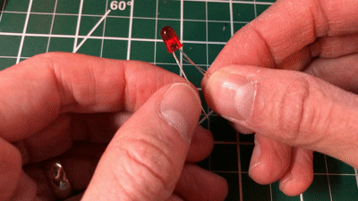

# {{ page.title | replace_first:'L','Lesson '}}
{: .no_toc }

## Table of Contents
{: .no_toc .text-delta }

1. TOC
{:toc}
---
For our first activity, we are going to use Arduino to turn on an [LED]({{ site.baseurl }}/pages/electronics/leds.md). We're *not* going to write any code. Instead, the goal here is to build some initial familiarity with Arduino hardware and connecting components to Arduino pins.

The movement of **current** in the circuit is illustrated by the animated yellow circles (but is a coarse abstraction).
{: .fs-1 }

## Materials

You will need the following materials:

| Arduino | LED | Resistor |
|:-----:|:-----:|:-----:|
|     |  |  |
| Arduino Uno, Leonardo, or similar  | Red LED | 220Ω Resistor |

## Hook up LED to Arduino's 5V supply pin

### Step 1: Wrap resistor around LED leg

Grab a 220Ω resistor (or any resistor 220Ω or greater) and twist one leg around an LED leg. If you want to follow my example, connect the resistor to the LED's anode (long leg) but either leg will work.

### Step 2: Connect components to Arduino

Insert the LED + resistor into the Arduino: the LED's cathode (short leg) to GND and the LED's anode (long leg) + resistor to 5V. 

### Step 3: Connect your Arduino to power

Now connect your Arduino to power and the LED should light up. You did it!

Here's a photo of the version I made. I found it easier to stretch the wiring across the Arduino from the 5V port to the GND on the opposite side.

For power, you can use a USB cable (which supplies 5V) or a 9V battery (which supplies 9V). Either way, the Arduino **supplies 5V** through the 5V pin. How? Using a voltage regulator, which takes in input

| USB Power        | 9V Power          |
|:-------------|:------------------|
|  |  |
| With USB power, the 5V pin supplies 5V | With a 9V battery, the 5V pin still supplies 5V |

---

**MORE INFO:**

If we use a 9V battery (which supplies ~9V) then how does the Arduino convert 9V to 5V? Using a component called a [voltage regular](https://itp.nyu.edu/physcomp/labs/labs-electronics/components/#Voltage_Regulator), which can take in a range of DC voltages and step it down (but not up) to a stable constant voltage. You can buy and use voltage regulators in your own projects. If you want to learn more about more about the Arduino Uno's power supply sub-system, read this [technobyte blog post](https://www.technobyte.org/arduino-uno-power-supply-arduino-hardware-core/).

---

## How can we make the LED less bright?

LED brightness is controlled by **current**. So, to dim an LED, we need to reduce current. But how? Recall Ohm's Law: $$V=I * R$$ or $$I = \frac{V}{R}$$. Thus, we can reduce current either by:

1. Decreasing **voltage**
2. Increasing **resistance**

In future tutorials, we'll show how you can **control voltage output programmatically** by writing code for the Arduino microcontroller. But, for now, let's dim the LED by first decreasing voltage using the Arduino's 3.3V pin (rather than the 5V pin) and then by using higher value resistors.

### Hooking up the LED to the 3.3V supply pin

The Arduino Uno provides both a 5V power supply (which we just used) and a 3.3V power supply.

Let's move the LED anode (long leg) from the 5V pin to the 3.3V pin. What do you observe? The LED should be less bright!

Let's compare the current and brightness between supplying 5V *vs.* 3.3V.

| 5V        | 3.3V          |
|:-------------|:------------------|
|  |  |
| With a 5V supply, the voltage drop across the 220Ω is ~3V. Thus, $$I = \frac{3V}{220Ω}= 13.6mA $$ | With a 3.3V supply, the voltage drop across the 220Ω resistor is ~1.3V, thus $$I = \frac{1.3V}{220Ω}= 5.9mA $$|

Here's a workbench photo of the LED wired to the 3.3V port:

### Full video walkthrough

Here's a full video walkthrough of wrapping the resistor around the LED anode leg, wiring the circuit to 5V and GND, and then switching from the 5V to the 3.3V supply.

<iframe width="736" height="414" src="https://www.youtube.com/embed/47DH_Odi068" frameborder="0" allow="accelerometer; autoplay; encrypted-media; gyroscope; picture-in-picture" allowfullscreen></iframe>

### How can we determine the current through the circuit?

To determine the current through the circuit, we can use Ohm's Law ($$I = \frac{V}{R}$$) and Kirchhoff's Voltage Law. The key component here is the **resistor**, which limits the current in our circuit.

---

**NOTE:**

As mentioned, If you want to make your LED dimmer (without writing microcontroller code), you can either (1) add more resistance or (2) reduce your supply voltage—both have the same effect: reducing current. This is sufficient conceptual knowledge to start building circuits; however, if you want to know more, read on!
{: .notice}

---

To use Ohm's Law, we need to calculate the **voltage drop** across the resistor ($$V_R$$). For this, we need to know the LED's forward voltage $$V_f$$, which is the minimum voltage necessary to turn the LED on and allow current to pass. In this case, our forward voltage is 2V—a common $$V_f$$ for RED LEDs. From Kirchhoff's Voltage Law, we know that the total voltage drop in our circuit—between the LED ($$V_f$$) and resistor ($$V_R$$)—must equal the supply voltage $$V_s$$, which is 3.3V. More formally:

$$V_{total} = V_R + V_f  \\
3.3V = V_R + V_f \\
V_R = 3.3V - V_f \\
V_R = 3.3V - 2V\to1.3V$$

To learn more about calculating the current through an LED, watch this video by NYU ITP's Jeff Feddersen:

<iframe src="https://player.vimeo.com/video/78674965" style="position:absolute;top:0;left:0;width:100%;height:100%;" frameborder="0" allow="autoplay; fullscreen" allowfullscreen></iframe>

<!-- TODO: and read our LED guide ... write the LED guide -->

### Using higher value resistors

We just showed how reducing the supply voltage ($$V_s$$) proportionally reduces current and, therefore, the LED brightness. Now, let's play around with higher-value resistors such as a 680Ω, 2.2KΩ, or 10KΩ, and see their effect. What happens?

You should observe that the LED's brightness *decreases* as the resistance *increases*. 

| Resistor | Resistor Image | Vs | Resulting Current |
|:-------------|:-------------|:------------------|
| 220Ω | | 5V | $$I = \frac{3V}{220Ω}= 13.6mA $$ |
| 680Ω | | 5V | $$I = \frac{3V}{680Ω}= 4.4mA $$ |
| 1KΩ | | 5V | $$I = \frac{3V}{1,000Ω}= 3mA $$ |
| 2.2KΩ | | 5V | $$I = \frac{3V}{2,200Ω}= 1.4mA $$ |
| 10KΩ | | 5V | $$I = \frac{3V}{10,000Ω}= 0.3mA $$ |

<!-- <video width="640" controls="controls">
  <source src="images/Arduino_LEDOn_5VFixed.mp4" type="video/mp4">
</video> -->

## TODO

- Fix Ohm's Law animations to use Vr, Vf nomenclature

## Next Lesson

In the next lesson, we will learn how to programmatically control the output voltage of a digital I/O pin to switch between `LOW` (0V) or `HIGH` (5V) using [`digitalWrite(int pin, int value)`](https://www.arduino.cc/reference/en/language/functions/digital-io/digitalwrite/).

[Next: Blinking an LED with Arduino](led-fade.md){: .btn .btn-outline }
