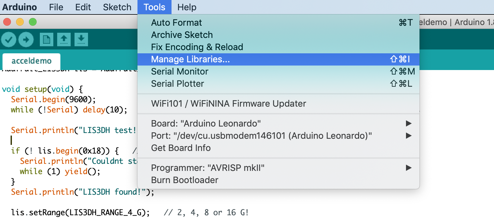
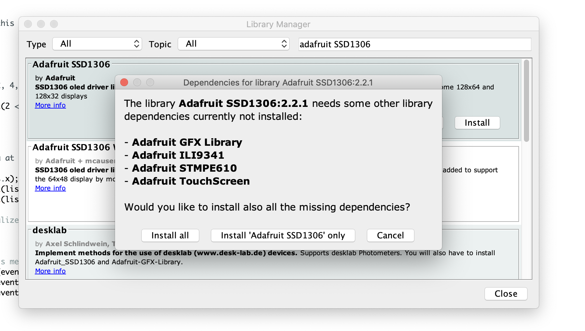
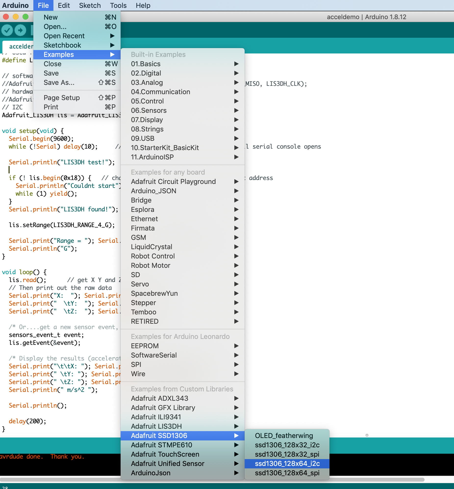

<!-- consider adding parent "Advanced Arduino" or Advanced I/O -->

These instructions are for the [Adafruit 128x64 OLED graphic display](https://www.adafruit.com/product/938). You can follow the official [Adafruit tutorial here](https://learn.adafruit.com/monochrome-oled-breakouts/arduino-library-and-examples).

## Install Arduino libraries

### Step 1: Open Manage Libraries in Arduino IDE file menu

### Step 2: Search for and install Adafruit SSD1306

Search for and install the Adafruit SSD1306 library.

### Step 3: Install all dependencies
When asked, install all SSD1306 library dependencies:

## Load and run sample code

Once the SSD1306 library and dependencies have been installed, wire up and test out the display using the `ssd1306_128x64` example code.

## Resources:
- https://learn.adafruit.com/monochrome-oled-breakouts/overview
- https://lastminuteengineers.com/oled-display-arduino-tutorial/
- https://learn.adafruit.com/adafruit-gfx-graphics-library/graphics-primitives

## SPI vs. I2C
- SPI is much faster: https://www.youtube.com/watch?v=SvOX-xs9v8M 