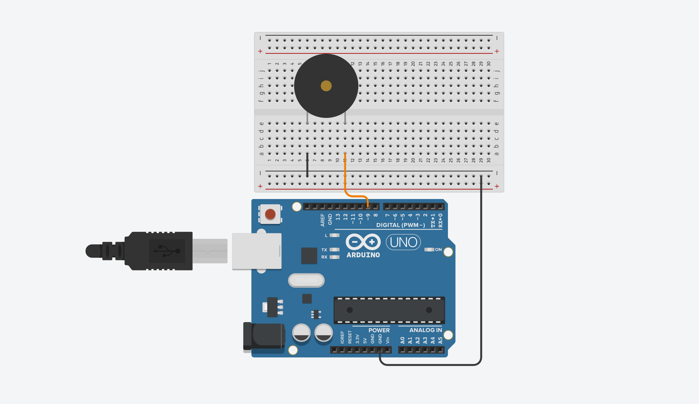
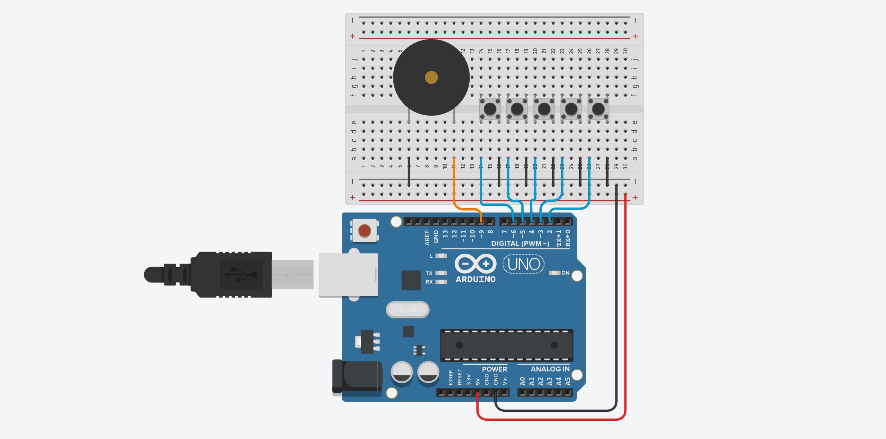

# {{ page.title | replace_first:'L','Lesson '}}
{: .no_toc }

## Table of Contents
{: .no_toc .text-delta }

1. TOC
{:toc}
---

OK, we made it through our first digital input lesson. Now, let's do something fun with this newfound knowledge!

In this lesson, we are going to make a simple five-key piano with tactile buttons wired with internal pull-up resistors and a [piezo buzzer](https://www.adafruit.com/product/160). Will it be fun? Yes! Will it produce hi-fidelity music? No!

As a sneak preview, try out our circuit+code in the [Tinkercad simulator](https://www.tinkercad.com/things/dunwYl8U0Uq). Click "Start Simulation" and then click on the buttons to "play the piano" (yes, the "notes" will sound somewhat abrasive to our ears—more on that below). You can even click on the 'Code' button, modify the code, and rerun the simulation.

<iframe width="725" height="453" src="https://www.tinkercad.com/embed/dunwYl8U0Uq?editbtn=1" frameborder="0" marginwidth="0" marginheight="0" scrolling="no"></iframe>
If the Tinkercad simulator does not load, [click here to view](https://www.tinkercad.com/things/dunwYl8U0Uq) the simulation on the Tinkercad page.
{: .fs-1 }

## Materials

We are going to build input circuits using the microcontroller's own internal pull-up resistors, so our material list includes only four things (well, and wires of course!):

| Breadboard | Arduino | Buttons | Piezo Buzzer |
|:-----:|:-----:|:-----:|:-----:|:-----:|
|  |  |  | 
| Breadboard | Arduino Uno, Leonardo, or similar  | **Five** [Tactile Buttons](https://www.adafruit.com/product/1119) | [Piezo Buzzer](https://www.mouser.com/ProductDetail/810-PS1240P02BT) |

## Making sound with Arduino

Sound waves are vibrations in air pressure. The speed of these vibrations (in cycles per second or Hertz) determines the pitch. The higher the vibration frequency, the higher the pitch.

If you're not familiar with sound waveforms and the differences between sinusoidal, triangle, and square waves—or even if you are—I recommend this short, interactive guide by Josh Comueau called "[Let's Learn About Waveforms.](https://pudding.cool/2018/02/waveforms/)" Make sure to have your sound on. The website defaults to **muted** volume, so press the letter 'm' to unmute once the website loads (or use the interactive sound volume widget). 

To play ear-pleasing, high-frequency waveforms with a microcontroller, you need a digital-to-analog converter [(DAC)](https://en.wikipedia.org/wiki/Digital-to-analog_converter). Some microcontrollers, like the Arduino Due, have DACs built in. The Arduino Uno and Leonardo microcontrollers do not.

Instead, these microcontrollers produce [square voltage waves](https://en.wikipedia.org/wiki/Square_wave). Indeed, when we use `analogWrite`, the Arduino produces a square wave of a fixed frequency—490Hz on most PWM pins but the Uno can produce double that (980Hz) on Pins 5 and 6 (see [docs](https://www.arduino.cc/en/Reference/AnalogWrite)). When you write an 8-bit value (0-255) to `analogWrite`, this changes the **duty cycle** of the waveform, not the **frequency**. And this fixed frequency waveform is not helpful for generating pitch-controllable tones. Well, it's fine if you just want to produce a tone at 490Hz or 980Hz but what about other frequencies?

<!-- TODO: show oscilloscope video of analogWrite vs. tone. Ah, see comment below. -->

### The Arduino tone library

Brett Hagman created the [tone](https://www.arduino.cc/reference/en/language/functions/advanced-io/tone/) library to address this problem, which is now part of the core Arduino library. While tone cannot generate sinusoidal waves like a DAC, it does produce square waves at specific frequencies, which can be used to actuate speakers and piezo buzzers.

Using tone is easy. You simply call `tone(pin, frequency)` with the pin number and a frequency (the minimum frequency is 31Hz) and a square wave with the given frequency is generated on the pin. The library also offers a convenience method that enables you to specify how long to play a tone in milliseconds: `tone(pin, frequency, duration)`.

<!-- TODO insert workbench video of OLED display + oscilliscope running test program. Button selects between using analogWrite and tone. And pot allows user to attempt to either change PWM duty cycle in former case or square wave frequency in latter case -->

---

**ADVANCED INFO:**

Note that the tone call returns immediately—almost like an asynchronous call in a multi-threaded program. However, the Arduino Uno is a single-core chip with no multi-threading support. So, how does this work?

Answer: via timer interrupts.

The ATmega328 supports a variety of interrupts, including interrupts to detect when a voltage value on a pin changes as well as time. The timer interrupts, for example, are used by the [millis()](https://www.arduino.cc/reference/en/language/functions/time/millis/) and [micros()](https://www.arduino.cc/reference/tr/language/functions/time/micros/) functions to count precisely. They are also used to generate square waves at specific frequencies, which is what tone() does.

The ATmega328 has three timers:
- Timer0: 8-bit timer used by millis() and micros().
- Timer1: 16-bit timer used by the [Servo](https://www.arduino.cc/en/reference/servo)() library
- Timer2: An-8 bit timer used by the [Tone()](https://www.arduino.cc/reference/en/language/functions/advanced-io/tone/) library

If you want to take a (super) deep dive into how tone works, see the [source code here](https://github.com/bhagman/Tone/blob/master/Tone.cpp) and accompanying [notes](https://github.com/bhagman/Tone). If you want to learn more about interrupts on the Arduino, see [Nick Gammon's blog post](https://gammon.com.au/interrupts) and this [Adafruit Learn series](https://learn.adafruit.com/multi-tasking-the-arduino-part-2/timers).

---

### Piezo buzzers

There are two primary types of buzzers: magnetic and piezo. A **magnetic buzzer** operates similarly to a traditional speaker: a current driven through a coil of wire produces a magnetic field, which dynamically moves a magnetic disk resulting in a sound wave. In contrast, a **piezo buzzer** is driven by voltage rather than current and is constructed out of piezoelectric material. This material mechanically deforms in response to applied voltages, which can be used to generate sounds.

<!-- TODO: would be great to have a slow-mo video of a piezo material being deformed by a voltage waveform... -->

There are two types of piezo buzzers: active and passive. Active buzzers use internal oscillators to generate tones, so only need a steady DC voltage. In contrast, passive buzzers require a voltage waveform—the waveform frequency will corresopndingly vibrate the piezoelectric material to make sound. This is the waveform that our Arduino will produce via [tone](https://www.arduino.cc/reference/en/language/functions/advanced-io/tone/). 

If you're taking one of our courses, we purchase **passive** piezo buzzers—typically from places like [Adafruit](https://www.adafruit.com/product/160) ($1.35) or [Mouser](https://www.mouser.com/ProductDetail/810-PS1240P02BT) ($0.51).

### Playing multiple tones simultaneously

Can you use the [Tone()](https://www.arduino.cc/reference/en/language/functions/advanced-io/tone/) library to generate chords?

No, the default [tone](https://www.arduino.cc/reference/en/language/functions/advanced-io/tone/) library does not support generating square waves composed of multiple frequencies (in other words, chords). However, Brett Hagman, the author of the original Arduino tone function, wrote a more [advanced tone library](https://code.google.com/archive/p/rogue-code/wikis/ToneLibraryDocumentation.wiki) to generate multiple simultaneous tones. This is also described in the [Arduino Cookbook (Section 9.3 Generating More than One Simultaneous Tone)](https://learning.oreilly.com/library/view/arduino-cookbook-2nd/9781449321185/ch09.html). Another discussion [here](https://forum.arduino.cc/index.php?topic=77447.0).

## Making a simple siren

Alright, let's build some stuff!

We'll start by constructing a simple piezo buzzer siren before making our piano. It's always a good idea to modularize and build things in small steps—especially when using new components. So, our simple siren will give us familiarity with hooking up and using a piezo buzzer before we add in the additional circuit and code complexity of buttons required by the piano.

### Making the siren circuit

The circuit is quite simple: simply connect one leg of the piezo buzzer to Pin 9 and the other leg to GND. The piezo buzzer will work in either direction (try it if you don't believe us!).

You can play with the Tinkercad simulation [here](https://www.tinkercad.com/things/iYOIfJAsLVl-simple-siren).
{: .fs-1 }

#### Should I use an in-series resistor?

There is some debate about whether you should use a small in-series resistor with a passive piezo buzzer ([link1](https://forum.arduino.cc/index.php?topic=16088.msg117474#msg117474), [link2](https://forum.arduino.cc/index.php?topic=522576.msg3564043#msg3564043)) similar to an LED circuit. I never have. I've always directly wired my piezo buzzer to the Arduino pins like the wiring diagram above (and [here](https://learn.adafruit.com/adafruit-arduino-lesson-10-making-sounds/playing-a-scale)).

It never hurts to add a resistor for testing. You could start with a 100Ω or 220Ω resistor (or try a [variable resistor](../electronics/variable-resistors.md) in series).

### Writing the siren code

We're going to flash the Arduino's built-in LED on and off (we can never outrun [Blink](led-blink.md)) and play two alternating sounds. We encourage you to try writing this code first before looking at our step-by-step guide. 

You've built up all the skills you need to do this! Just remember, [`tone(pin, frequency)`](https://www.arduino.cc/reference/en/language/functions/advanced-io/tone/). Oh, and yah, feel free to use [`delay()`](https://www.arduino.cc/reference/en/language/functions/time/delay/) calls for this simple prototype (hey, sometimes `delay()` is the best solution!)

#### Step 1: Declare our constants


const int OUTPUT_PIEZO_PIN = 9; // hook up one piezo leg to GND, other leg to Pin 9
const int OUTPUT_LED_PIN = LED_BUILTIN; // we'll flash an LED on/off with the sound
const int SOUND_DURATION_MS = 500; // duration to play each siren part


#### Step 2: Initialize our pins in setup()


void setup() {
  pinMode(OUTPUT_PIEZO_PIN, OUTPUT);
  pinMode(OUTPUT_LED_PIN, OUTPUT);
}


#### Step 3: Implement the siren logic in loop()

The loop alternates between playing a 392Hz square wave and a 262Hz square wave—each for `SOUND_DURATION_MS`. Feel free to use other frequencies, I chose 392 and 262 because they correspond to the piano keys `C4` (Middle C) and `G4`. We'll also flash on/off an LED with the same rhythm. Very siren like!


void loop() {
  
  // tone() generates a square wave of the specified frequency 
  // (and 50% duty cycle) on a pin. 
  tone(OUTPUT_PIEZO_PIN, 392);
  digitalWrite(OUTPUT_LED_PIN, HIGH);
  delay(SOUND_DURATION_MS);
  
  tone(OUTPUT_PIEZO_PIN, 262);
  digitalWrite(OUTPUT_LED_PIN, LOW);
  delay(SOUND_DURATION_MS);
}


#### Step 4: Compile, upload, and run!

We did it! Now, compile, upload and run your program!

---
**TIP:**

To stop this (admittedly) annoying program, load up a fresh, empty sketch (Ctrl-N or CMD-N in the Arduino IDE) and immediately upload it to your board. An empty sketch will compile, upload, and run just fine (and do nothing, which is, at this point, what you so desperately want!).

---

<!--TODO insert video of my siren -->

### Our SimpleSiren code on GitHub

You can access our [SimpleSiren](https://github.com/makeabilitylab/arduino/blob/master/Basics/digitalRead/SimpleSiren/SimpleSiren.ino) code in our GitHub repo. It's also displayed below:

### Go further

There are lots of fun examples online of using Arduino + piezo buzzers to play lo-fi versions of popular theme songs (like the [Imperial March](https://gist.github.com/StevenNunez/6786124) from Star Wars). Feel free to keep playing with the piezo buzzer before building your piano.

## Making a simple piano

Alright, let's make that piano.

### Making the piano circuit

To limit the use of unnecessary components, we're going to hook up our buttons with the ATmega's internal pull-up resistors. So, the default state will be `HIGH` for each button (and then `LOW` when pressed). We'll write code to support both pull-down and pull-resistor designs, however (ahhh, the magic of code to help manage hardware messiness!).

This is the first time we've breadboarded so many components, so try to keep your wiring and layout clean. I always reserve using **black wire** for connections to GND and **red wire** for connections to Vcc. In fact, if you sneak back a look to any of our wiring diagrams, you should observe this convention. :)

Note that we do **not** need to wire anything directly to Vcc here (and you can tell this at a glance with my wiring because no red wires!).

You can play with this circuit and the underlying Arduino program on [Tinkercad](https://www.tinkercad.com/things/dunwYl8U0Uq-simple-piano)
{: .fs-1 }

Here are two images of our physical wiring. Click and open the images in a new tab to zoom. Obviously, many other functionally equivalent wirings are possible. We are also using a mixture of jumper wires (which you have in your kits) and [manually cut solid-core wire](https://www.sparkfun.com/products/11367)s (which you do not). Generally, we strive to make clean, elegant circuits—but doubly so for when we're teaching!

| Simple Piano Wiring View 1 | Simple Piano Wiring View 2 |
| -------------------------- | -------------------------- |
|  |  |

### Writing the piano code

The code is fairly straightforward. 

#### Step 1: Declare our note frequencies

First, let's declare the waveform frequencies of our notes.


// Frequencies (in Hz) of our piano keys
// From: https://en.wikipedia.org/wiki/Piano_key_frequencies
#define KEY_C 262  // 261.6256 Hz (middle C)
#define KEY_D 294  // 293.6648 Hz
#define KEY_E 330  // 329.6276 Hz
#define KEY_F 350  // 349.2282 Hz
#define KEY_G 392  // 391.9954 Hz


#### Step 2: Declare our pin constants

Our piano has **five** buttons, so we need five input pins. We also need an output pin for our piezo buzzer, of course. And we'll hookup the built-in LED on the Arduino to turn on whenever we sense a button press (just for fun and to help us debug in case something goes wrong).

Finally, we'll add in a boolean constant `_buttonsAreActiveLow` that simply let's us handle pull-up *vs.* pull-down logic in software. The boolean defaults to `true` because we assume a pull-up resistor configuration. Switch this to `false` if you decide to design your button circuits with pull-down resistors.


// I lay out my buttons like piano keys. So, lower frequencies on left
// and increasingly higher frequencies to the right
// Change this depending on how you've laid out your keys
const int INPUT_BUTTON_C_PIN = 2;
const int INPUT_BUTTON_D_PIN = 3;
const int INPUT_BUTTON_E_PIN = 4;
const int INPUT_BUTTON_F_PIN = 5;
const int INPUT_BUTTON_G_PIN = 6;

const int OUTPUT_PIEZO_PIN = 9;
const int OUTPUT_LED_PIN = LED_BUILTIN; // visual feedback on button press

// By default, we assume buttons are in pull-up configurations
// Switch the following to false and change INPUT_PULLUP belows
// to INPUT
const boolean _buttonsAreActiveLow = true; 


#### Step 3: Setup our I/O pins in setup()

In setup(), we simply initialize our **five inputs** and **two outputs** as inputs and outputs accordingly. Note the `INPUT_PULLUP` flag for each button input.


void setup() {
  pinMode(INPUT_BUTTON_C_PIN, INPUT_PULLUP);
  pinMode(INPUT_BUTTON_D_PIN, INPUT_PULLUP);
  pinMode(INPUT_BUTTON_E_PIN, INPUT_PULLUP);
  pinMode(INPUT_BUTTON_F_PIN, INPUT_PULLUP);
  pinMode(INPUT_BUTTON_G_PIN, INPUT_PULLUP);
  pinMode(OUTPUT_PIEZO_PIN, OUTPUT);
  pinMode(OUTPUT_LED_PIN, OUTPUT);
}


#### Step 4: Write core piano logic in loop()

Because tone() can only play one frequency at a time (darn, no rockin' chords), we setup a large conditional block checking for each individual button press. If a button is pressed, we play the corresponding note.

To more easily handle both pull-up and pull-down circuit configurations, we wrote a convenience function called `isButtonPressed(int btnPin)`, which abstracts the "isPressed" logic. (Though one might criticize the use of a global variable—tis common for these rapid prototypes, I'm afraid. You could pass the global var as a parameter into `isButtonPressed` if this makes you feel better about code modularity). 


void loop() {

  // tone() generates a square wave of the specified frequency (and 50% duty cycle) on a pin. 
  // A duration can be specified, otherwise the wave continues until a call to noTone().
  // See: https://www.arduino.cc/reference/en/language/functions/advanced-io/tone/
  // 
  // Check each button to see if they're pressed. If so, play the corresponding note
  // We can only play one tone at a time, hence the massive if/else block
  if(isButtonPressed(INPUT_BUTTON_C_PIN)){
    tone(OUTPUT_PIEZO_PIN, KEY_C);
  }else if(isButtonPressed(INPUT_BUTTON_D_PIN)){
    tone(OUTPUT_PIEZO_PIN, KEY_D);
  }else if(isButtonPressed(INPUT_BUTTON_E_PIN)){
    tone(OUTPUT_PIEZO_PIN, KEY_E);
  }else if(isButtonPressed(INPUT_BUTTON_F_PIN)){
    tone(OUTPUT_PIEZO_PIN, KEY_F);
  }else if(isButtonPressed(INPUT_BUTTON_G_PIN)){
    tone(OUTPUT_PIEZO_PIN, KEY_G);
  }else{
    noTone(OUTPUT_PIEZO_PIN); // turn off the waveform
    digitalWrite(OUTPUT_LED_PIN, LOW);
  }
}

boolean isButtonPressed(int btnPin){
  int btnVal = digitalRead(btnPin);
  if(_buttonsAreActiveLow && btnVal == LOW){
    // button is hooked up with pull-up resistor
    // and is in a pressed state
    digitalWrite(OUTPUT_LED_PIN, HIGH);
    return true;
  }else if(!_buttonsAreActiveLow && btnVal == HIGH){
    // button is hooked up with a pull-down resistor
    // and is in a pressed state
    digitalWrite(OUTPUT_LED_PIN, HIGH);
    return true;
  }

  // button is not pressed
  return false;
}


#### Step 5: Compile, upload, and run the code

Now, compile, upload, and run your code. Let's hear it Beethoven!

Here's a workbench video of us playing our piano. Make sure your sound is on (or not) to hear our beautiful music! :-D

<iframe width="736" height="414" src="https://www.youtube.com/embed/FhfzZ4qpxZQ" frameborder="0" allow="accelerometer; autoplay; encrypted-media; gyroscope; picture-in-picture" allowfullscreen></iframe>
The sound and video stream seem a bit out of sync here, but you get the idea.
{: .fs-1 }

### Our SimplePiano code on GitHub

You can access our [SimplePiano](https://github.com/makeabilitylab/arduino/blob/master/Basics/digitalRead/SimplePiano/SimplePiano.ino) code in our GitHub repo. It's also displayed below:

## Exercises

For your prototyping journals, select one of the following extensions to the piano keyboard (or come up with your own) and document it.

- Extend your keyboard to support a full octave. If your kit only has five buttons, what else could you use for input (hint: it's fun and easy to make lo-fi button input out of everyday materials)
- Try adding in LEDs for each key, which light up and then fade after each corresponding key press (hint: use your LEDFader class from a previous exercise)
- Try supporting chords—that is, multiple simultaneous tones—using [Brett Hagman's tone library](https://code.google.com/archive/p/rogue-code/wikis/ToneLibraryDocumentation.wiki)

## Additional references

- [Lab 5: Tone Output Using An Arduino](https://itp.nyu.edu/physcomp/labs/labs-arduino-digital-and-analog/tone-output-using-an-arduino/)
- [Arduino sketch for high frequency precision sine wave tone sound synthesis](http://www.adrianfreed.com/content/arduino-sketch-high-frequency-precision-sine-wave-tone-sound-synthesis)

## Next Lesson

In the [next lesson](debouncing.md), we'll introduce the problem of "contact bouncing" and talk about solutions.

[Previous: Using buttons](buttons.md){: .btn .btn-outline }
[Next: Debouncing](debouncing.md){: .btn .btn-outline }
<!-- [Next: Using potentiometers](potentiometers.md){: .btn .btn-outline } -->

