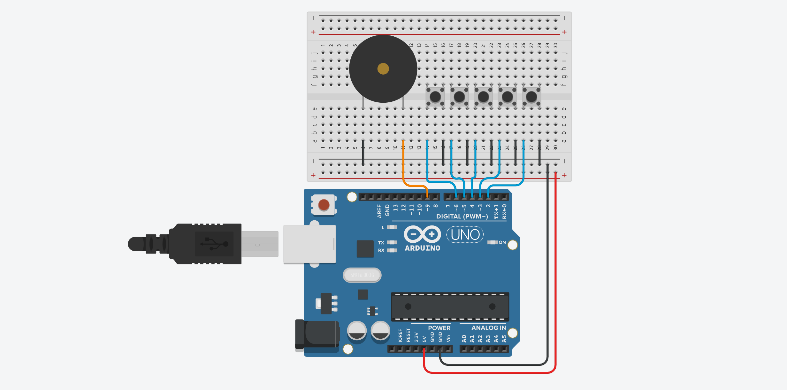

# {{ page.title | replace_first:'L','Lesson '}}
{: .no_toc }

## Table of Contents
{: .no_toc .text-delta }

1. TOC
{:toc}
---

OK, we made it through our first digital input lesson. Now, let's do something fun with this newfound knowledge!

In this lesson, we are going to make a simple five-key piano with tactile buttons wired with internal pull-up resistors and a [piezo buzzer](https://www.adafruit.com/product/160). Will it be fun? Yes! Will it produce hi-fidelity music? No!

As a sneak preview, try out our circuit+code in the [Tinkercad simulator](https://www.tinkercad.com/things/dunwYl8U0Uq). Click "Start Simulation" and then click on the buttons to "play the piano" (yes, the "notes" will sound somewhat abrasive to our ears—more on that below). You can even click on the 'Code' button, modify the code, and rerun the simulation.

<iframe width="725" height="453" src="https://www.tinkercad.com/embed/dunwYl8U0Uq?editbtn=1" title="Tinkercad simulation of a simple five-key piano with buttons and piezo buzzer" frameborder="0" marginwidth="0" marginheight="0" scrolling="no"></iframe>
If the Tinkercad simulator does not load, [click here to view](https://www.tinkercad.com/things/dunwYl8U0Uq) the simulation on the Tinkercad page.
{: .fs-1 }

{: .note }
> **In this lesson, you will learn:**
> - How to combine digital input (buttons) with audio output (`tone()`) to build an interactive instrument
> - How to wire multiple buttons using internal pull-up resistors
> - How to write code that maps button presses to musical note frequencies
> - Clean breadboard wiring practices for multi-component circuits

## Materials

We are going to build input circuits using the microcontroller's own internal pull-up resistors, so our material list includes only four things (well, and wires of course!):

| Breadboard | Arduino | Buttons | Piezo Buzzer |
|:-----:|:-----:|:-----:|:-----:|
|  |  |  | 
| Breadboard | Arduino Uno, Leonardo, or similar  | **Five** [Tactile Buttons](https://www.adafruit.com/product/1119) | [Piezo Buzzer](https://www.mouser.com/ProductDetail/810-PS1240P02BT) |

## From output to interactive instrument

In the [Playing Tones](tone.md) lesson, you learned to generate sound with `tone()` and even built a siren and played the Imperial March. Now we'll combine that audio output with your new **digital input** skills—instead of pre-programmed melodies, *you* control the notes in real time.

Quick recap of what we'll need from that lesson:

- **`tone(pin, frequency)`** plays a square wave at the given frequency; **`noTone(pin)`** stops it
- Only **one tone at a time** (no chords)
- We'll use **Pin 9** for the buzzer to avoid Timer2 conflicts with PWM on Pins 3/11

{: .note }
> Haven't completed [Playing Tones](tone.md) yet? We recommend at least skimming it first—it covers how piezo buzzers work, why they sound "buzzy," and the difference between `analogWrite()` (duty cycle) and `tone()` (frequency).

## Making a simple piano

Alright, let's make that piano.

### Making the piano circuit

To limit the use of unnecessary components, we're going to hook up our buttons with the ATmega's internal pull-up resistors. So, the default state will be `HIGH` for each button (and then `LOW` when pressed). We'll write code to support both pull-down and pull-up resistor designs, however (ahhh, the magic of code to help manage hardware messiness!).

This is the first time we've breadboarded so many components, so try to keep your wiring and layout clean. We always reserve using **black wire** for connections to GND and **red wire** for connections to Vcc. In fact, if you sneak back a look to any of our wiring diagrams, you should observe this convention. :)

Note that we do **not** need to wire anything directly to Vcc here (and you can tell this at a glance with our wiring because no red wires!).

You can play with this circuit and the underlying Arduino program on [Tinkercad](https://www.tinkercad.com/things/dunwYl8U0Uq-simple-piano).
{: .fs-1 }

Here are two images of our physical wiring. Click and open the images in a new tab to zoom. Obviously, many other functionally equivalent wirings are possible. We are also using a mixture of jumper wires (which you have in your kits) and [manually cut solid-core wire](https://www.sparkfun.com/products/11367)s (which you do not). Generally, we strive to make clean, elegant circuits—but doubly so for when we're teaching!

| Simple Piano Wiring View 1 | Simple Piano Wiring View 2 |
| -------------------------- | -------------------------- |
|  |  |

### Writing the piano code

The code is fairly straightforward. 

#### Step 1: Declare our note frequencies

First, let's declare the waveform frequencies of our notes.


// Frequencies (in Hz) of our piano keys
// From: https://en.wikipedia.org/wiki/Piano_key_frequencies
#define KEY_C 262  // 261.6256 Hz (middle C)
#define KEY_D 294  // 293.6648 Hz
#define KEY_E 330  // 329.6276 Hz
#define KEY_F 349  // 349.2282 Hz
#define KEY_G 392  // 391.9954 Hz


#### Step 2: Declare our pin constants

Our piano has **five** buttons, so we need five input pins. We also need an output pin for our piezo buzzer, of course. And we'll hookup the built-in LED on the Arduino to turn on whenever we sense a button press (just for fun and to help us debug in case something goes wrong).

Finally, we'll add in a boolean constant `_buttonsAreActiveLow` that simply lets us handle pull-up *vs.* pull-down logic in software. The boolean defaults to `true` because we assume a pull-up resistor configuration. Switch this to `false` if you decide to design your button circuits with pull-down resistors.


// I lay out my buttons like piano keys. So, lower frequencies on left
// and increasingly higher frequencies to the right
// Change this depending on how you've laid out your keys
const int INPUT_BUTTON_C_PIN = 2;
const int INPUT_BUTTON_D_PIN = 3;
const int INPUT_BUTTON_E_PIN = 4;
const int INPUT_BUTTON_F_PIN = 5;
const int INPUT_BUTTON_G_PIN = 6;

const int OUTPUT_PIEZO_PIN = 9;
const int OUTPUT_LED_PIN = LED_BUILTIN; // visual feedback on button press

// By default, we assume buttons are in pull-up configurations
// Switch the following to false and change INPUT_PULLUP belows
// to INPUT
const boolean _buttonsAreActiveLow = true; 


#### Step 3: Setup our I/O pins in setup()

In setup(), we simply initialize our **five inputs** and **two outputs** as inputs and outputs accordingly. Note the `INPUT_PULLUP` flag for each button input.


void setup() {
  pinMode(INPUT_BUTTON_C_PIN, INPUT_PULLUP);
  pinMode(INPUT_BUTTON_D_PIN, INPUT_PULLUP);
  pinMode(INPUT_BUTTON_E_PIN, INPUT_PULLUP);
  pinMode(INPUT_BUTTON_F_PIN, INPUT_PULLUP);
  pinMode(INPUT_BUTTON_G_PIN, INPUT_PULLUP);
  pinMode(OUTPUT_PIEZO_PIN, OUTPUT);
  pinMode(OUTPUT_LED_PIN, OUTPUT);
}


#### Step 4: Write core piano logic in loop()

Because tone() can only play one frequency at a time (darn, no rockin' chords), we set up a large conditional block checking for each individual button press. If a button is pressed, we play the corresponding note.

To more easily handle both pull-up and pull-down circuit configurations, we wrote a convenience function called `isButtonPressed(int btnPin)`, which abstracts the "isPressed" logic. (Though one might criticize the use of a global variable—tis common for these rapid prototypes, I'm afraid. You could pass the global var as a parameter into `isButtonPressed` if this makes you feel better about code modularity). 


void loop() {

  // tone() generates a square wave of the specified frequency (and 50% duty cycle) on a pin. 
  // A duration can be specified, otherwise the wave continues until a call to noTone().
  // See: https://www.arduino.cc/reference/en/language/functions/advanced-io/tone/
  // 
  // Check each button to see if they're pressed. If so, play the corresponding note
  // We can only play one tone at a time, hence the massive if/else block
  if(isButtonPressed(INPUT_BUTTON_C_PIN)){
    tone(OUTPUT_PIEZO_PIN, KEY_C);
  }else if(isButtonPressed(INPUT_BUTTON_D_PIN)){
    tone(OUTPUT_PIEZO_PIN, KEY_D);
  }else if(isButtonPressed(INPUT_BUTTON_E_PIN)){
    tone(OUTPUT_PIEZO_PIN, KEY_E);
  }else if(isButtonPressed(INPUT_BUTTON_F_PIN)){
    tone(OUTPUT_PIEZO_PIN, KEY_F);
  }else if(isButtonPressed(INPUT_BUTTON_G_PIN)){
    tone(OUTPUT_PIEZO_PIN, KEY_G);
  }else{
    noTone(OUTPUT_PIEZO_PIN); // turn off the waveform
    digitalWrite(OUTPUT_LED_PIN, LOW);
  }
}

boolean isButtonPressed(int btnPin){
  int btnVal = digitalRead(btnPin);
  if(_buttonsAreActiveLow && btnVal == LOW){
    // button is hooked up with pull-up resistor
    // and is in a pressed state
    digitalWrite(OUTPUT_LED_PIN, HIGH);
    return true;
  }else if(!_buttonsAreActiveLow && btnVal == HIGH){
    // button is hooked up with a pull-down resistor
    // and is in a pressed state
    digitalWrite(OUTPUT_LED_PIN, HIGH);
    return true;
  }

  // button is not pressed
  return false;
}


#### Step 5: Compile, upload, and run the code

Now, compile, upload, and run your code. Let's hear it Beethoven!

Here's a workbench video of us playing our piano. Make sure your sound is on (or not) to hear our beautiful music! :-D

<iframe width="736" height="414" src="https://www.youtube.com/embed/FhfzZ4qpxZQ" title="Workbench video of the simple five-key Arduino piano being played" frameborder="0" allow="accelerometer; autoplay; encrypted-media; gyroscope; picture-in-picture" allowfullscreen></iframe>
The sound and video stream seem a bit out of sync here, but you get the idea.
{: .fs-1 }

### Our SimplePiano code on GitHub

You can access our [SimplePiano](https://github.com/makeabilitylab/arduino/blob/master/Basics/digitalRead/SimplePiano/SimplePiano.ino) code in our GitHub repo. It's also displayed below:

<!-- gist-it is down, so now using emgithub -->
<!--  -->

This [source code](https://github.com/makeabilitylab/arduino/blob/master/Basics/digitalRead/SimplePiano/SimplePiano.ino) is on GitHub.
{: .fs-1 }

## Exercises

For your prototyping journals, select one or more of the following extensions to the piano keyboard (or come up with your own) and document it.

### Exercise 1: Full octave

Extend your keyboard to support a full octave (C4 through C5 — that's eight notes). If your kit only has five buttons, what else could you use for input? Hint: it's fun and easy to make lo-fi button input out of everyday materials like aluminum foil, pencil graphite, or conductive tape!

### Exercise 2: LED feedback per key

Add an LED for each key that lights up on the corresponding button press. For extra credit, have the LED fade out after each press rather than turning off instantly (hint: use your LEDFader class from a previous exercise).

### Exercise 3: Play a melody

Instead of a live-play piano, program your Arduino to play a short melody automatically when a single button is pressed. Use arrays of note frequencies and durations, like we did in the [Playing Tones](tone.md#playing-a-melody) lesson. Can you add a second button that plays a different melody?

### Exercise 4: Chord support

Try supporting chords—that is, multiple simultaneous tones—using [Brett Hagman's advanced tone library](https://code.google.com/archive/p/rogue-code/wikis/ToneLibraryDocumentation.wiki). How does it sound compared to single notes?

## Additional references

- [Lab 5: Tone Output Using An Arduino](https://itp.nyu.edu/physcomp/labs/labs-arduino-digital-and-analog/tone-output-using-an-arduino/), NYU ITP
- [Playing Tones](tone.md), our output lesson on `tone()`, piezo buzzers, and melodies

## Lesson summary

In this lesson, you built your first truly interactive Arduino project — a five-key piano! Along the way, you practiced:

- **Combining input and output** by reading digital input from buttons and generating audio output with `tone()`.
- **Using internal pull-up resistors** (`INPUT_PULLUP`) to simplify your button wiring — no external resistors needed.
- **Wiring multiple components** on a single breadboard with clean, organized layouts.
- **Mapping button presses to note frequencies** using `if/else` logic and the `tone()` / `noTone()` functions.
- **Writing reusable helper functions** like `isButtonPressed()` to abstract away pull-up vs. pull-down logic.

## Next Lesson

In the [next lesson](debouncing.md), we'll introduce the problem of "contact bouncing" and talk about solutions. You may have already noticed some odd behavior with your piano — occasionally a note might "stutter" or play twice from a single press. That's contact bounce in action!

[Previous: Using buttons](buttons.md){: .btn .btn-outline }
[Next: Debouncing](debouncing.md){: .btn .btn-outline }
