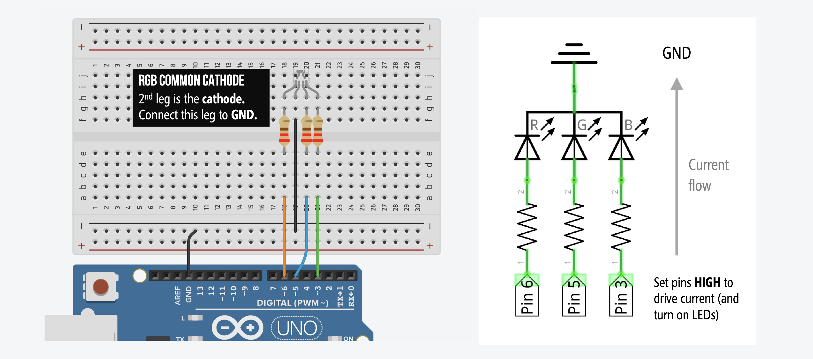
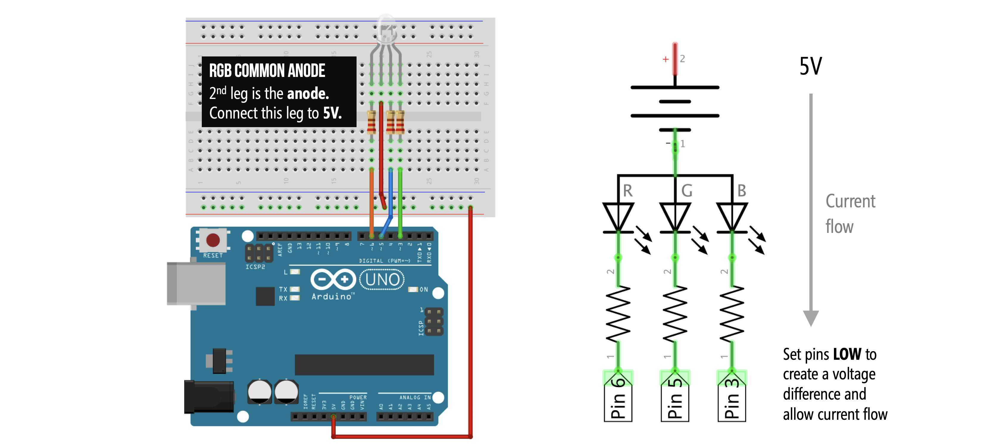
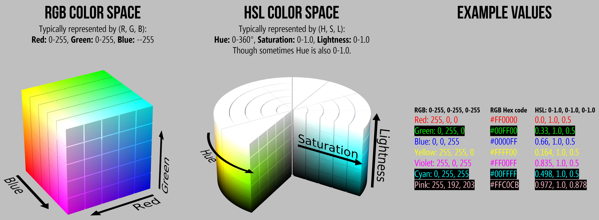

# {{ page.title | replace_first:'L','Lesson '}}
{: .no_toc }

## Table of Contents
{: .no_toc .text-delta }

1. TOC
{:toc}
---

In this lesson, you will learn how to fade between RGB colors using [`analogWrite`](https://www.arduino.cc/reference/en/language/functions/analog-io/analogwrite/), how to use the [HSL colorspace](https://en.wikipedia.org/wiki/HSL_and_HSV) to more easily (and independently) control hue and brightness, and how to use and load local `C/C++` libraries.

---
**NOTE:**

This is our most complex lesson yet. From a circuit standpoint, things are easy—it's the same circuit as [before](rgb-led.md) (yay!). From a coding standpoint, things are more complicated. If you don't have a coding background, it's OK if the code doesn't (fully) make sense. Try to read it and understand it given your current abilities. Regardless of your comprehension level, try copying the code and playing with it on your own!

---

## Materials

You'll need the same materials as the previous [RGB LED lesson](rgb-led.md). Recall that there are **two types** of RGB LEDs: a **common cathode design** and a **common anode design**, so make sure you know which one you have as it will affect the circuit you make and the code you write.

| Breadboard | Arduino | RGB LED | Resistors |
|:-----:|:-----:|:-----:|:-----:|
|  |     |  |  |
| Breadboard | Arduino Uno, Leonardo, or similar  | RGB LED (Either Common Cathode or Common Anode) | **Three** 220Ω Resistors |

## Making the circuit

The circuit is the same as the previous [RGB LED lesson](rgb-led.md). Make sure you follow the appropriate wiring based on whether you are using a **common cathode** or **common anode** RGB LED.

| RGB Common Cathode Wiring | RGB Common Anode Wiring |
|:-----:|:-----:|
|  |  |

## Writing the code

We are going to explore and implement two different RGB crossfade approaches.

1. First, we will use `for` loops to step through dyadic combinations between red, green, and blue LED colors. This approach is based on a [now-expired gist](https://gist.github.com/jamesotron/766994) by the user `jamesotron`.
2. Second, we will use the HSL color space to manipulate **hue**—what colloquially we refer to as *color*—and then convert this to the RGB color space for our `analogWrite` calls. This approach is cleaner and less convoluted but requires using a [separate library](https://github.com/ratkins/RGBConverter) for the HSL-to-RGB conversion.

With `analogWrite`'s maximum output value of `255`, each embedded red, green, blue LED can be set from `0` to `255`, which enables 16,777,216 combinations (256^3). However, only a small fraction of these are perceptually different. Indeed, in our first crossfade solution, by default, we only fade between 156 combinations.

### Crossfading in the RGB color space

The [code](https://github.com/makeabilitylab/arduino/blob/master/Basics/analogWrite/CrossFadeRGB/CrossFadeRGB.ino) for crossfading an RGB LED is the most complex that we've covered thus far (and, if you don't have a coding background, it's OK if you don't fully understand it). For those in our engineering courses (like Ubiquitous Computing, Physical Computing, or Prototyping Interactive Systems), you are expected to read and understand this code.

There are many different ways you could crossfade an RGB LED depending on which colors you want to illuminate and how quickly. If you want to play with and explore the RGB color space, see [this interactive visualization](https://makeabilitylab.github.io/p5js/Color/ColorExplorer3D/) we made in p5js.

Our particular crossfade method works by **increasing** one LED color value (from `0` to `255`) while **decreasing** another (from `255` to `0`). For example, the code begins by decreasing the red LED value while increasing the green LED value. When the red LED value reaches `0`, we begin decrementing another LED (green in this case). Similarly, when the green LED value reaches `255`, we begin incrementing another LED (the blue LED in this case), and so on. 

More specifically, we have an array `int _rgbLedValues[3]` that stores our `{int red, int green, int blue}` values. We initialize the array to `{255, 0, 0}`—so `red=255`, `green=0`, and `blue=0`. So, our RGB LED will start red. 


int _rgbLedValues[] = {255, 0, 0}; // Red, Green, Blue


To help index into this array and track state, we create the following `enum`:


enum RGB{
  RED,
  GREEN,
  BLUE,
  NUM_COLORS
};


This enum allows us to access our RGB LED values by writing `_rgbLedValues[RED]`, `_rgbLedValues[GREEN]`, and `_rgbLedValues[BLUE]` rather than `_rgbLedValues[0]`, `_rgbLedValues[1]`, and `_rgbLedValues[2]`. The enum doesn't just improve code readability and help avoid needless array index errors, it's also used to track state with two state-tracking variables: `_curFadingUpColor` and `_curFadingDownColor`.  

Our crossfade algorithm uses two `for` loops to simultaneously increase one color while decreasing another. We start by **increasing green** and **decreasing red** as controlled by `enum RGB _curFadingUpColor = GREEN;`) and (`enum RGB _curFadingDownColor = RED;`), respectively. 

Once we reach our maximum color value of `255` for the current `_curFadingUpColor`, we select the next color to increase (beginning with `RED` and then to `GREEN` then `BLUE` then back to `RED`). Similarly, once we reach our minimum color value of `0` for `_curFadingDownColor`, we select the next color to decrease (same order as before: from `RED` to `GREEN` to `BLUE` then back to `RED`).

The full fade algorithm is captured in `loop()`:


// Code based on https://gist.github.com/jamesotron/766994 (no longer available)
void loop() {

  // Increment and decrement the RGB LED values for the current
  // fade up color and the current fade down color
  _rgbLedValues[_curFadingUp] += FADE_STEP;
  _rgbLedValues[_curFadingDown] -= FADE_STEP;

  // Check to see if we've reached our maximum color value for fading up
  // If so, go to the next fade up color (we go from RED to GREEN to BLUE
  // as specified by the RGB enum)
  if(_rgbLedValues[_curFadingUp] > MAX_COLOR_VALUE){
    _rgbLedValues[_curFadingUp] = MAX_COLOR_VALUE;
    _curFadingUp = (RGB)((int)_curFadingUp + 1);

    if(_curFadingUp > (int)BLUE){
      _curFadingUp = RED;
    }
  }

  // Check to see if the current LED we are fading down has gotten to zero
  // If so, select the next LED to start fading down (again, we go from RED to 
  // GREEN to BLUE as specified by the RGB enum)
  if(_rgbLedValues[_curFadingDown] < 0){
    _rgbLedValues[_curFadingDown] = 0;
    _curFadingDown = (RGB)((int)_curFadingDown + 1);

    if(_curFadingDown > (int)BLUE){
      _curFadingDown = RED;
    }
  }

  // Set the color and then delay
  setColor(_rgbLedValues[RED], _rgbLedValues[GREEN], _rgbLedValues[BLUE]);
  delay(DELAY_MS);
}


We control the fade step—the *amount* to fade on each `loop()` iteration—with `const int FADE_STEP`. With `FADE_STEP=1`, we fade between 768 color combinations (`3*256`). By default, `FADE_STEP=5`, which results in 156 color combinations.

#### Full RGB-based crossfader code

Here's the code in its entirety:

<script src="https://gist-it.appspot.com/https://github.com/makeabilitylab/arduino/blob/master/Basics/analogWrite/CrossFadeRGB/CrossFadeRGB.ino?footer=minimal"></script>

#### RGB-based crossfader videos

Here are two videos showing the code running on an Arduino Uno. First, in the Tinkercad simulator. You can see the crossfade colors and a plot of the corresponding `analogWrite` values.

<iframe width="736" height="414" src="https://www.youtube.com/embed/ZyfHRQFwmeg" frameborder="0" allow="accelerometer; autoplay; encrypted-media; gyroscope; picture-in-picture" allowfullscreen></iframe>

Second, a workbench video of the code running on an Arduino Uno:

<iframe width="736" height="414" src="https://www.youtube.com/embed/zL7xIWHqVaY" frameborder="0" allow="accelerometer; autoplay; encrypted-media; gyroscope; picture-in-picture" allowfullscreen></iframe>

<!--TODO: add in a p5js that demonstrates how this works? And maybe let's reader play with different color values? -->

### Crossfading in the HSL color space

The second method for crossfading the RGB LED takes advantage of the [Hue, Saturation, Lightness (HSL)](https://en.wikipedia.org/wiki/HSL_and_HSV) color space. To change the "color" of the RGB LED, we are really talking about changing its **hue**. It's much easier to do this using HSL and then converting to RGB to set our RGB LED color. 


RGB and HSL color space visualizations from [Wikipedia](https://en.wikipedia.org/wiki/HSL_and_HSV).
{: .fs-1 }

Here's a video of various hues, saturations, and lightness levels using Hunor Marton's HSL Color Picker. Play around with it yourself on [codepen.io](https://codepen.io/HunorMarton/pen/dvXVvQ/). You can also open up almost any painting or graphics application to play with and switch between colorspaces from MSPaint to Adobe Photoshop and Illustrator to [GIMP](https://www.gimp.org/) and [Inkscape](https://inkscape.org/).

<iframe width="736" height="414" src="https://www.youtube.com/embed/a0j8qyBJE2E" frameborder="0" allow="accelerometer; autoplay; encrypted-media; gyroscope; picture-in-picture" allowfullscreen></iframe>
A screen recording of [Hunor Marton's HSL Color Picker](https://codepen.io/HunorMarton/pen/dvXVvQ/).
{: .fs-1 }

In our case, we perform this HSL-to-RGB conversion using the [RGBConverter](https://github.com/ratkins/RGBConverter) library. With this HSL approach, our code is comparatively much simpler, something like the following pseudocode:


// Basic overview of our approach (pseudocode)
float hue = 0, saturation = 0.8, lightness = 1.0;
float hueStepValue = 0.1f; // increment hue but keep saturation and lightness fixed
float MAX_HUE = 1.0f;
loop(){
    hue += stepValue;  // increment hue
    RGB rgb = convertHslToRgb(hue, saturation, lightness) // convert HSL to RGB
    setColor(rgb.red, rgb.green, rgb.blue); // set the color
    if(hue > MAX_HUE){ // reset hue to zero if MAX_HUE reached
        hue = 0;
    }
}


The downside of this implementation is that we must use [`floats`](https://www.arduino.cc/en/pmwiki.php?n=Reference/Float) because the [RGBConverter](https://github.com/ratkins/RGBConverter) library uses floating point functions. Why are floats bad? Two reasons: with the ATmega328 microcontroller, floating point arithmetic is **slow** (`float` division can be 2-4 times slower than `integer` division) and **[imprecise](https://www.arduino.cc/en/pmwiki.php?n=Reference/Float)** (floats can appear infinitely precise given their use of decimals but on the ATmega328, floats have ~6-7 decimal digits of precision).

However, these limitations won't matter for our program—or for any of our introductory lessons—because we are not speed limited and don't need high-precision math. If you want to know more about *why* embedded programmers try to avoid floating point operations, read the note below. Otherwise, skip ahead.

---
**NOTE:**

The ATmega328 chip (used by the Arduino Uno, Leonardo, etc.) does not natively support floating point (that is, there is no specialized hardware to speedup these floating point operations). This is a common limitation with microcontrollers. So, to avoid using floats while still computing the same mathematical operations, embedded programmers use [fixed-point arithmetic](https://en.wikipedia.org/wiki/Fixed-point_arithmetic).

Some interesting discussions and examples, include:
- [Sensor smoothing and optimized math on the Arduino](http://bleaklow.com/2012/06/20/sensor_smoothing_and_optimised_maths_on_the_arduino.html), Alan Burlison's blog
- [AVR GCC Fixed-Point vs. Floating Point Comparison](https://ucexperiment.wordpress.com/2015/03/31/avr-gcc-fixed-point-vs-floating-point-comparison/), ucexperiment blog
- [Speed of floating point operations](https://forum.arduino.cc/index.php?topic=40901.0), Arduino forums.

<!-- TODO: expand on why floats can be costly for embedded programming with microcontrollers? -->
---

#### Full HSL-based crossfader code

The full code for our HSL-based crossfader is below. **Importantly**, you cannot simply copy/paste this code into your Arduino IDE. You must have the RGBConverter code in a sub-folder called `src` in your root sketch directory. Use the same directory structure as our [GitHub](https://github.com/makeabilitylab/arduino/tree/master/Basics/analogWrite/CrossFadeHue). You can read more about loading libraries in the Arduino IDE below.

<script src="https://gist-it.appspot.com/https://github.com/makeabilitylab/arduino/blob/master/Basics/analogWrite/CrossFadeHue/CrossFadeHue.ino?footer=minimal"></script>

#### Workbench video

Here's a workbench video of [CrossFadeHue.ino](https://github.com/makeabilitylab/arduino/tree/master/Basics/analogWrite/CrossFadeHue) with a common cathode RGB LED.

<iframe width="736" height="414" src="https://www.youtube.com/embed/ROfJge7bsfI" frameborder="0" allow="accelerometer; autoplay; encrypted-media; gyroscope; picture-in-picture" allowfullscreen></iframe>

<!-- TODO look up what the minimum step value that makes sense with our quantization -->

<!-- TODO: Could be fun to write a p5js sketch that shows how the initial RGB LED naive code works and then the HSL version -->

### Loading libraries in the Arduino IDE

There are multiple ways of loading external libraries in the Arduino IDE (see this [official Arduino tutorial](https://www.arduino.cc/en/guide/libraries)); however, most are focused on **global libraries**—that is, libraries that **all** of your sketches have access to. What if you want to load just a local library just for the current sketch?

Well, it turns out this fundamental feature has a long, sordid history in the Arduino community (for example: [link](https://stackoverflow.com/questions/4705790/keeping-all-libraries-in-the-arduino-sketch-directory), [link](https://arduino.stackexchange.com/questions/8651/loading-local-libraries)). I have found three ways to load **local** `.h` and `.cpp` code:

**First** and easiest, place all `.h` and `.cpp` files in your root sketch folder (where your `.ino` file resides):

```
CrossFadeHue
|-CrossFadeHue.ino
|-RGBConverter.cpp
|-RGBConverter.h
```

**Second**, place all `.h` and `.cpp` files in a sub-folder off or your root sketch folder with a dir name of your choosing (*e.g.,* `lib`):

```
CrossFadeHue
|-CrossFadeHue.ino
|-lib
  |-RGBConverter.cpp
  |-RGBConverter.h
```

**Third**, if you have lots of `.h` and `.cpp` files and want to organize them into their own individual sub-folders, then... this can be frustrating! But there is a solution since the ~Arduino 1.6 release: you must put these sub-folders into a sub-folder called `src` ([link](https://github.com/arduino/Arduino/issues/4936#issuecomment-312953260)) within your root sketch directory. Indeed, this is exactly our setup for using the [RGBConverter](https://github.com/ratkins/RGBConverter) library. It's in `CrossFadeHue\src\RGBConverter`. So, your directory structure should look like:

```
CrossFadeHue
|-CrossFadeHue.ino
|-src
  |-RGBConverter
    |-RGBConverter.cpp
    |-RGBConverter.h
```
---

## Exercises

- **New crossfade algorithms**. Develop your own crossfade algorithm to fade between colors. Play around with hue, saturation, and lightness. How do they seem to affect the RGB LED?
- **Fade multiple RGB LEDs**. How could we modify our code to fade multiple RGB LEDs at different rates? **Hint:** We'll work on one potential solution in the [next lesson](led-blink3.md)

## Next Lesson

For our next and final [Intro to Output](intro-output.md) lesson, we are going to learn how to blink multiple LEDs at different frequencies, which is one of the most common questions on Arduino forums—perhaps because of the way the [official Arduino Blink tutorial](https://www.arduino.cc/en/tutorial/blink) uses `delay()` to control blinking rates (which is fine for one LED but doesn't scale). Before starting the lesson, it's worth thinking about how *you* would blink multiple frequencies at different rates. :)

<span class="fs-6">
[Previous: RGB LEDs](rgb-led.md){: .btn .btn-outline }
[Next: Blinking Multiple LEDs at Different Rates](led-blink3.md){: .btn .btn-outline }
</span>
