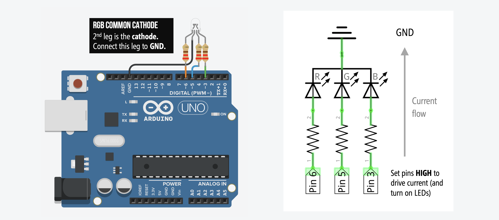

# {{ page.title | replace_first:'L','Lesson '}}
{: .no_toc }

## Table of Contents
{: .no_toc .text-delta }

1. TOC
{:toc}
---

In this tutorial, we will flash through a sequence of colors using an RGB LED (RGB stands for Red, Green, Blue) and learn about the difference between a Common Anode and Common Cathode RGB LED design.

## Materials

You'll need the following materials. Importantly, there are **two types** of RGB LEDs—described below—so make sure you **determine** which type of RGB LED you are using as it will affect how you configure your circuit. But don't worry, we'll walk through both RGB LED types.

| Arduino | RGB LED | Resistor |
|:-----:|:-----:|:-----:|
|     |  |  |
| Arduino Uno, Leonardo, or similar  | RGB LED | **3** 220Ω Resistor |

### Common Anode vs. Common Cathode

While capable of displaying thousands of color combinations, RGB LEDs are actually quite simple; they contain three LEDs in one package: red, green, and blue. Importantly but somewhat confusingly, there are two RGB LED designs—the **Common Anode** and the **Common Cathode**—which differ in the leg shared between the three embedded LEDs.

1. With the **Common Anode**, the three embedded LEDs share the anode leg. To control the RGB LED's color and drive current, you must hook up the anode to the higher voltage source and connect the red, green, and blue legs to lower voltage levels (*e.g.,* ground). 

<!-- For example, with a 5V voltage source connected to the common anode leg, setting the three other legs (red, green, blue) to 5V would, somewhat counterintuively, turn off the LED. In contrast, setting the red leg to 0V, for example, and the other two legs to 5V would turn the RGB LED red. -->

2. In contrast, the **Common Cathode** works much more like a typical LED (and like the red LED from our previous examples). Here, all three embedded LEDs share the cathode leg. So, you drive each individual color leg with a higher voltage source. 

<!-- For example, to turn the Common Cathode RGB LED red, you would set the cathode leg to ground, the red leg to 5V -->

#### How can I tell if I have a Common Anode or Cathode RGB LED?
You **cannot** tell whether you have a Common Anode or Common Cathode RGB LED by visual inspection. Instead, consult the supplier website, the datasheet, or experiment with the LED yourself (remember, diodes only work in one directly so as long as you include your current limiting resistors, you should be fine!).

| Common Anode | Common Cathode |
|:-----:|:-----:|
|  |  |
| A diffused **Common Anode** RGB LED from [Adafruit](https://www.adafruit.com/product/159). It's called diffused because the epoxy casing is scratchy and not perfectly transparent | A clear **Common Cathode** RGB LED from [Sparkfun](https://www.sparkfun.com/products/105). |

Here are two screenshots of supplier websites ([Sparkfun](https://sparkfun.com) and [Adafruit](https://adafruit.com)). Notice how the RGB LED type is clearly labeled.

## Common Cathode

We're going to start with a Common Cathode circuit + code because it's more intuitive (and similar to our red LED tutorials) before covering the Common Anode version.

### Making the circuit

With a Common Cathode design, the 2nd leg needs to be hooked up to the `GND` pin and the 1st (red), 3rd (blue), and 4th (green) legs should connect to digital I/O pins (don't forget a current limiting resistor for each). We could have used any digital I/O pins; however, we chose Pins 6, 5, and 3 for red, blue, and green respectively.

Here's the wiring without a breadboard:

And here's the wiring with a breadboard (the schematic on the right is the same either way):

### Writing the code

## Common Anode

### Making the circuit
TODO

### Writing the code
TODO

## Coding for both Common Cathode and Anode

## TODO:
- Working with a cathode RGB LED
- Now, let's do it with an anode RGB LED. Refer back to led-blink2 with current sink vs source

[Previous](led-blink2.md){: .btn .btn-outline }
[Next](TODO){: .btn .btn-outline }
