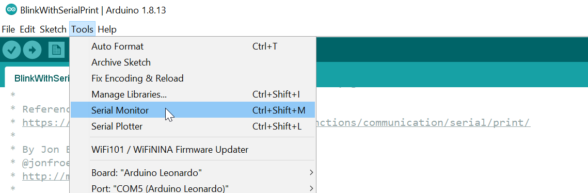
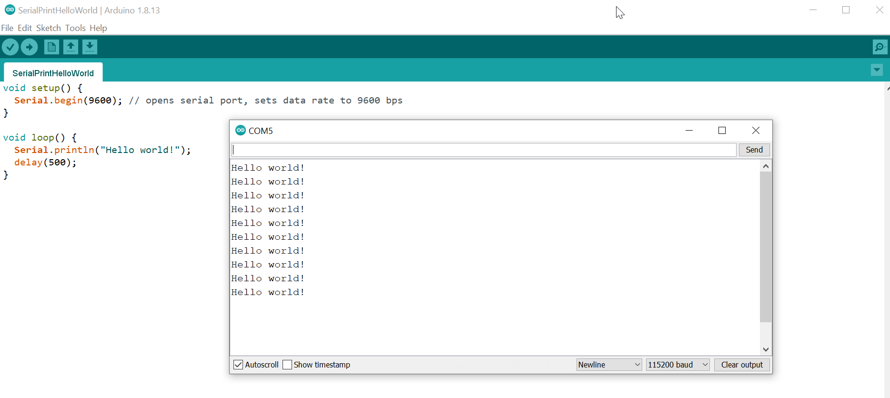
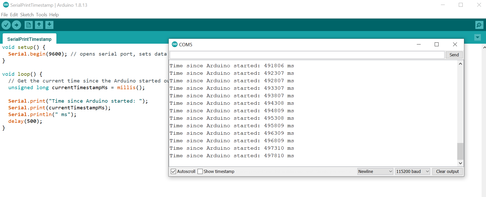
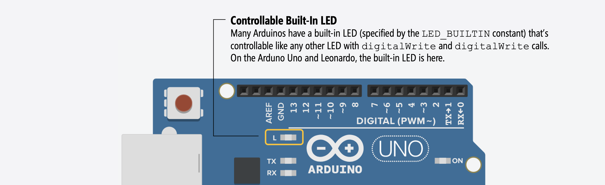
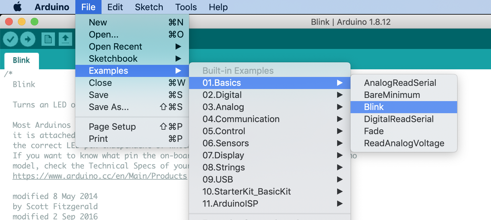

# {{ page.title | replace_first:'L','Lesson '}}
{: .no_toc }

## Table of Contents
{: .no_toc .text-delta }

1. TOC
{:toc}
---

Debugging code is always hard. Debugging code+circuits is even harder. Though we're only on our **third** Arduino lesson (woohoo!), it's time to introduce some Arduino debugging strategies.

For **hardware debugging**, multimeters and oscilloscopes are useful. We realize that many (most!) of you do not have your own multimeters or oscilloscopes and that, due to COVID, our labs are closed. Thus, your only option here is to use something like [Tinkercad Circuits](tinkercad.com/). If you're physically building something and it's not working, you could try to replicate it in Tinkercad or some other simulation tool.

For **code debugging**, it's common to use "print line" statements (yes, I know)—see video below. Currently, the Arduino IDE does not  support code debugging (*e.g.,* breakpoints, code stepping, memory stack dumps). Note: there is forthcoming debugging support in the [newest beta ](https://blog.arduino.cc/2021/03/01/announcing-the-arduino-ide-2-0-beta/) of the Arduino IDE and there is rudimentary debugging support in the Tinkercad Circuits code editor.

<video autoplay loop muted playsinline style="margin:0px">
  <source src="assets/movies/BlinkWithSerialPrint-IMG_5777_Trim_720p.mp4" type="video/mp4" />
</video>
**Video.** A video of the blink program with serial prints ([source code](https://github.com/makeabilitylab/arduino/blob/master/Basics/digitalWrite/BlinkWithSerialPrint/BlinkWithSerialPrint.ino)).
{: .fs-1 }

## Using Serial.print for debugging

Using "print out" statements to "console" is perhaps the oldest (and possibly most robust) debugging technique. It is the standard technique for Arduino as well (as tedious as it can be).

Unlike JavaScript, Java, C# or other code that runs in your web browser or natively on your desktops/laptops, your Arduino code is running on the Arduino's microcontroller. Thus, when we "print to console", we actually need to get the data from the Arduino's microcontroller on to your development computer. For this, Arduino uses the [serial](https://www.arduino.cc/reference/en/language/functions/communication/serial/) protocol. More specifically, the function [`Serial.print()`](https://www.arduino.cc/reference/en/language/functions/communication/serial/print/) and [`Serial.println()`](https://www.arduino.cc/reference/en/language/functions/communication/serial/println/).

These two functions print data to the serial port as human-readable ASCII text (the `println` version simply inserts a carriage return `\r` followed by a newline character `\n`). To send data without converting it to ASCII text, you need to use [`Serial.write()`](https://www.arduino.cc/reference/en/language/functions/communication/serial/write).

In later lessons, we'll see how to use serial communication for more than just debugging purposes but to actually bidirectionally communicate with the computer (see [these ITP examples](https://itp.nyu.edu/physcomp/labs/labs-serial-communication/)). For our introductory lessons, however, we'll just use it to print out information about how our program is performing.

---

**IMPORTANT:**

Once you turn on serial (via `Serial.begin()`), you can **no longer use** digital Pins 0 or 1 for I/O because these pins are used for serial communication (digital pin 0 is RX and pin 1 is TX). See [Arduino documentation](https://www.arduino.cc/en/reference/serial).

This is why many of my "starter" examples use Pin 3 rather than Pins 0 or 1 (Pin 3 also has the added benefit of being configurable for analog output, which we'll get to in the [next lesson](led-fade.md)).

---

### Build a simple "Hello World!" Serial.print program
Let's build a simple "Hello World!" program that uses `Serial.print` functionality to receive ASCII data over the serial port. We don't even need external hardware for this: just our Arduino Leonardo and a USB cable.

#### Step 1: Initialize the serial port

To use the serial port, we must first initialize it with [`Serial.begin(BAUD_RATE)`](https://www.arduino.cc/reference/en/language/functions/communication/serial/begin/). The baud rate is the transmission speed in bits per second (bps) and is typically set to `9600` unless greater speeds are needed.

Typically, we initialize the serial port in `setup()`, as it only needs to run time.


void setup() {
  Serial.begin(9600); // opens serial port, sets data rate to 9600 bps
}

void loop() {}


#### Step 2: Use Serial.print and Serial.println to write data

Here's a complete program that writes "Hello world!" once very 500 ms.


void setup() {
  Serial.begin(9600); // opens serial port, sets data rate to 9600 bps
}

void loop() {
  Serial.println("Hello world!");
  delay(500);
}


#### Step 3: Open 'Serial Monitor' in the Arduino IDE

Finally, to view the incoming serial data, open up the Serial Monitor in the Arduino IDE. 

And you should see something like this:

The full code is on GitHub [here](https://github.com/makeabilitylab/arduino/blob/master/Basics/serial/SerialPrintHelloWorld/SerialPrintHelloWorld.ino).

### Printing out variables

You will obviously want to print out more than just strings. So, how do you print out variables?

The simple answer is to use multiple `Serial.print` and `Serial.println` statements. To print variables, put the variable as the sole parameter (see below). A more complicated answer is available in our [Inside Arduino](inside-arduino.md) guide. You can also see the example code on the [`Serial.print`](https://www.arduino.cc/reference/en/language/functions/communication/serial/print/) API page.

Below, we've written a simple program to print out the current time (in milliseconds) since the Arduino was turned on and our program began to run:


void setup() {
  Serial.begin(9600); // opens serial port, sets data rate to 9600 bps
}

void loop() {
  // Get the current time since the Arduino started our program (in ms)
  unsigned long currentTimestampMs = millis();

  Serial.print("Time since Arduino started: ");
  Serial.print(currentTimestampMs);
  Serial.println(" ms");
  delay(500);
}


This code is also on GitHub [here](https://github.com/makeabilitylab/arduino/blob/master/Basics/serial/SerialPrintTimestamp/SerialPrintTimestamp.ino)

<!-- String formatting: https://cpp4arduino.com/2020/02/07/how-to-format-strings-without-the-string-class.html -->

## Modify your blink code to use Serial.print

Now, let's return to our blink code and modify it to use `Serial.print` to print out when the LED is on and off. Here's my example.

<video autoplay loop muted playsinline style="margin:0px">
  <source src="assets/movies/BlinkWithSerialPrint-IMG_5777_Trim_720p.mp4" type="video/mp4" />
</video>
**Video.** A video of the blink program with serial prints ([source code](https://github.com/makeabilitylab/arduino/blob/master/Basics/digitalWrite/BlinkWithSerialPrint/BlinkWithSerialPrint.ino)).
{: .fs-1 }

## Use the built-in LED

In addition to `Serial.print`, we can also use the Arduino's built-in LED for some quick debugging (*e.g.,* turn on the built-in LED to indicate some program state without hooking up an external LED circuit). On the Arduino Uno and Leonardo, the built-in LED is on Pin 13. So, if you write `digitalWrite(13, HIGH);` in your code, the built-in LED will turn on. Because not all Arduino boards have the built-in LED at Pin 13, you should use the constant `LED_BUILTIN` rather than a literal pin number.

In fact, the official [Arduino Blink example](http://www.arduino.cc/en/Tutorial/Blink) uses the built-in LED and the constant `LED_BUILTIN` to demonstrate blinking. This is also the program that ships with your Arduino and runs when you first power it up. 


// the setup function runs once when you press reset or power the board
void setup() {
  // initialize digital pin LED_BUILTIN as an output.
  pinMode(LED_BUILTIN, OUTPUT);
}

// the loop function runs over and over again forever
void loop() {
  digitalWrite(LED_BUILTIN, HIGH);   // turn the LED on (HIGH is the voltage level)
  delay(1000);                       // wait for a second
  digitalWrite(LED_BUILTIN, LOW);    // turn the LED off by making the voltage LOW
  delay(1000);                       // wait for a second
}


You can access this example directly in the Arduino IDE:

## Next Lesson

Now that we know a bit about debugging and [`Serial.print()`](https://www.arduino.cc/reference/en/language/functions/communication/serial/print/), it's time to learn about ["analog output"]((led-fade.md)) on the Arduino. We'll be using `Serial.print()` throughout the rest of our tutorials.

<!-- In the [next lesson](led-fade.md), we will learn how to control the output voltage not just at two levels, `LOW` (0V) or `HIGH` (5V), but at finer levels between 0 and 5V using [`analogWrite(int pin, int value)`](https://www.arduino.cc/reference/en/language/functions/analog-io/analogwrite/). -->

[Previous: Turning on an LED with Arduino](led-on.md){: .btn .btn-outline }
[Next: Fading an LED with Arduino](led-fade.md){: .btn .btn-outline }

