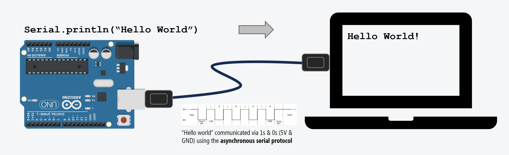
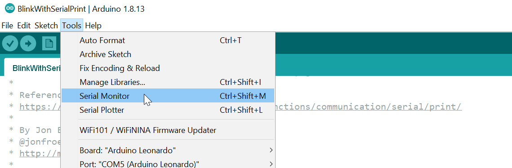
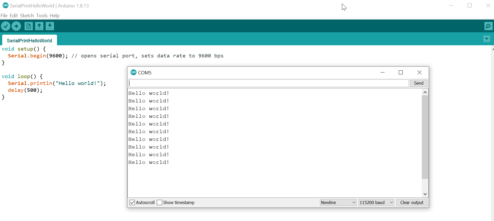
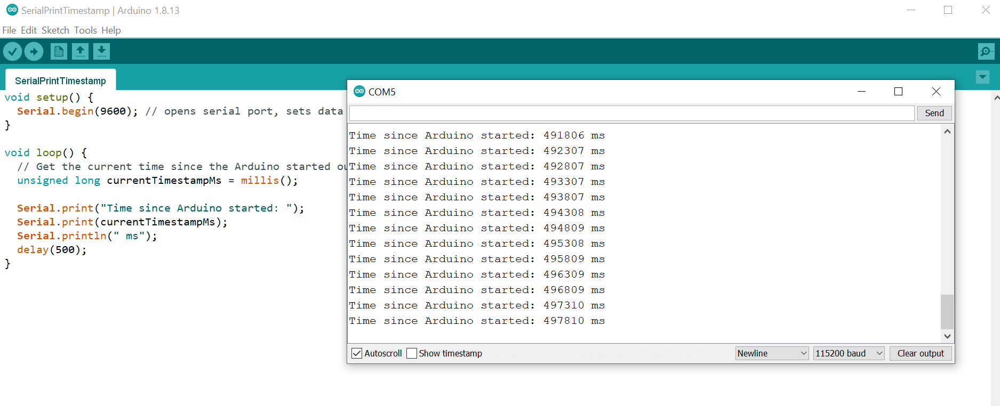
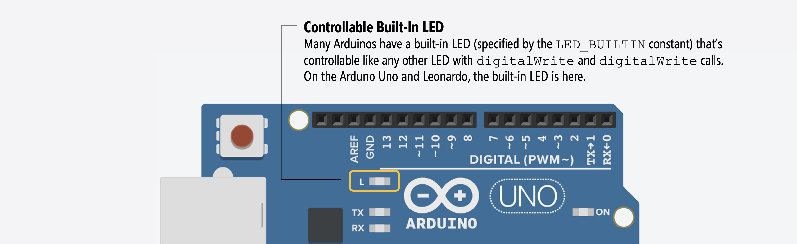
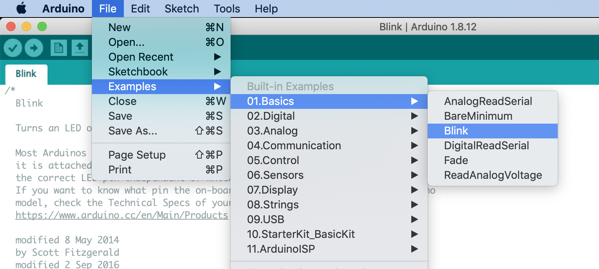

# {{ page.title | replace_first:'L','Lesson '}}
{: .no_toc }

## Table of Contents
{: .no_toc .text-delta }

1. TOC
{:toc}
---

<video autoplay loop muted playsinline style="margin:0px" aria-label="Video showing Serial.println output in the Arduino IDE Serial Monitor while an LED blinks">
  <source src="assets/movies/BlinkWithSerialPrint-IMG_5777_Trim_720p.mp4" type="video/mp4" />
</video>
**Figure.** A video showing how to use Serial.println() to debug code. For this, we modified the simple blink program to add serial prints ([source code](https://github.com/makeabilitylab/arduino/blob/master/Basics/digitalWrite/BlinkWithSerialPrint/BlinkWithSerialPrint.ino)).
{: .fs-1 }

Debugging code is always hard. Debugging code+circuits is even harder! 💪🏽 

Now that we're on our **third** Arduino lesson (woohoo!), it's time to introduce some Arduino debugging strategies.

For **hardware debugging**, multimeters and oscilloscopes are useful. If you don't have access to these tools, we recommend building your circuits in a simulation tool like [Tinkercad Circuits](https://www.tinkercad.com/) and using their virtual instruments (*e.g.,* multimeters). If you're physically building something and it's not working, you could try to replicate it in Tinkercad or some other simulation tool.

For **code debugging**, it's common to use "printline" statements (yes, I know! 🤣)—see video above. While the Arduino IDE 2 introduced [debugging support](https://docs.arduino.cc/software/ide-v2/tutorials/ide-v2-debugger/) (breakpoints, code stepping), it requires specific boards and hardware. For most of us, `Serial.print` remains the go-to technique. You *can* also always use the debugger in [Tinkercad Circuits](https://www.tinkercad.com/) to step through code in simulation.

<!-- TODO: consider having recommendations for a basic multimeter and oscilloscope here. -->

## Using Serial.print for debugging

Using "print out" statements to "console" is perhaps the oldest software debugging technique. It is the standard technique for Arduino as well although can be tedious at times.

Unlike JavaScript, Java, C# or other code that runs in your web browser or natively on your laptop, your Arduino code is running on the Arduino's microcontroller (*e.g.,* the Uno uses the [ATmega328P](https://ww1.microchip.com/downloads/en/DeviceDoc/Atmel-7810-Automotive-Microcontrollers-ATmega328P_Datasheet.pdf); Leonardo uses the [ATmega32u4](https://ww1.microchip.com/downloads/en/DeviceDoc/Atmel-7766-8-bit-AVR-ATmega16U4-32U4_Datasheet.pdf)). Thus, when we "print to console", we actually need to get the data from the Arduino's microcontroller on to your development computer. For this, Arduino uses the [serial](https://www.arduino.cc/reference/en/language/functions/communication/serial/) protocol. More specifically, the function [`Serial.print()`](https://www.arduino.cc/reference/en/language/functions/communication/serial/print/) and [`Serial.println()`](https://www.arduino.cc/reference/en/language/functions/communication/serial/println/).



These two functions print data to the serial port as human-readable ASCII text (the `println` version simply inserts a carriage return `\r` followed by a newline character `\n`). To send data without converting it to ASCII text, you need to use [`Serial.write()`](https://www.arduino.cc/reference/en/language/functions/communication/serial/write).

In later lessons, we'll see how to use serial communication for more than just debugging purposes but to actually bidirectionally communicate with the computer (see [L1: Intro to Serial](../communication/serial-intro.md) and [these ITP examples](https://itp.nyu.edu/physcomp/labs/labs-serial-communication/)). For our introductory lessons, however, we'll just use it to print out information about how our program is performing.

{: .warning }
> **Arduino Uno:** Once you turn on serial via `Serial.begin()`, you can **no longer use** digital Pins 0 or 1 for I/O because on the Uno, these pins are shared with the USB-serial communication chip (digital pin 0 is RX and pin 1 is TX). See [Arduino documentation](https://www.arduino.cc/en/reference/serial).
>
> **Arduino Leonardo:** This restriction does **not** apply. The Leonardo handles USB communication natively through its ATmega32u4 chip, so `Serial` goes directly over USB without using Pins 0 or 1. On the Leonardo, Pins 0 and 1 are a separate hardware serial port accessible via `Serial1`.
>
> This is one reason many of our "starter" examples use **Pin 3** rather than Pins 0 or 1, avoiding this Uno limitation. Pin 3 also has the added benefit of being configurable for analog output, which we'll get to in the [next lesson](led-fade.md).

### Build a simple "Hello World!" Serial.print program

Let's build a simple "Hello World!" program that uses `Serial.print` functionality to receive ASCII data over the serial port. We don't even need external hardware for this: just our Arduino Leonardo and a USB cable.

#### Step 1: Initialize the serial port

To use the serial port, we must first initialize it with [`Serial.begin(BAUD_RATE)`](https://www.arduino.cc/reference/en/language/functions/communication/serial/begin/). The baud rate is the transmission speed in bits per second (bps) and is typically set to `9600` unless greater speeds are needed. Because the [Serial library](https://www.arduino.cc/reference/en/language/functions/communication/serial/) uses asynchronous communication, both the transmitter and receiver need to agree on the speed of communication (the baud rate). So, you will also have to set the baud rate in the "Serial Monitor" window (see Step 3 below).

Typically, we initialize the serial port in `setup()`, as it only needs to run one time.


void setup() {
  Serial.begin(9600); // opens serial port, sets data rate to 9600 bps
}

void loop() {}


#### Step 2: Use Serial.print and Serial.println to write data

Here's a complete program that writes "Hello world!" once every 500 ms.


void setup() {
  Serial.begin(9600); // opens serial port, sets data rate to 9600 bps
}

void loop() {
  Serial.println("Hello world!");
  delay(500);
}


#### Step 3: Open 'Serial Monitor' in the Arduino IDE

Finally, to view the incoming serial data, open up the Serial Monitor in the Arduino IDE. 



And you should see something like this:



The full code is on GitHub [here](https://github.com/makeabilitylab/arduino/blob/master/Basics/serial/SerialPrintHelloWorld/SerialPrintHelloWorld.ino).

### Printing out variables

You will obviously want to print out more than just strings. So, how do you **print out variables**?

The simple answer is to use multiple `Serial.print` and `Serial.println` statements. To print variables, put the variable as the sole parameter (see below). A more complicated answer is available in our [Inside Arduino](inside-arduino.md) guide. You can also see the example code on the [`Serial.print`](https://www.arduino.cc/reference/en/language/functions/communication/serial/print/) API page.

Below, we've written a simple program to print out the current time (in milliseconds) since the Arduino was turned on and our program began to run:


void setup() {
  Serial.begin(9600); // opens serial port, sets data rate to 9600 bps
}

void loop() {
  // Get the current time since the Arduino started our program (in ms)
  unsigned long currentTimestampMs = millis();

  Serial.print("Time since Arduino started: ");
  Serial.print(currentTimestampMs);
  Serial.println(" ms");
  delay(500);
}




This code is also on GitHub [here](https://github.com/makeabilitylab/arduino/blob/master/Basics/serial/SerialPrintTimestamp/SerialPrintTimestamp.ino).

<!-- String formatting: https://cpp4arduino.com/2020/02/07/how-to-format-strings-without-the-string-class.html -->

## Modify your blink code to use Serial.print

Now, let's return to our [blink code](led-blink.md) and modify it to use `Serial.print` to print out when the LED is on and off. 


const int LED_OUTPUT_PIN = 3;

void setup() {
  pinMode(LED_OUTPUT_PIN, OUTPUT);
  Serial.begin(9600);
}

void loop() {
  
  // Turn on the LED
  digitalWrite(LED_OUTPUT_PIN, HIGH);   // turn LED on (5V)
  Serial.println("Pin 3 is HIGH (5V)"); // print status
  delay(500);                           // delay is in milliseconds
  
  // Turn off the LED
  digitalWrite(LED_OUTPUT_PIN, LOW);    // turn LED off (0V)
  Serial.println("Pin 3 is LOW (0V)");  // print status
  delay(500);                           // delay is in milliseconds
}


Here's a video of my code running with the Serial Monitor in the background.

<video autoplay loop muted playsinline style="margin:0px" aria-label="Video of the blink program running with serial print output visible in the Serial Monitor">
  <source src="assets/movies/BlinkWithSerialPrint-IMG_5777_Trim_720p.mp4" type="video/mp4" />
</video>
**Figure.** A video of the blink program with serial prints showing in the Serial Monitor ([source code](https://github.com/makeabilitylab/arduino/blob/master/Basics/digitalWrite/BlinkWithSerialPrint/BlinkWithSerialPrint.ino)).
{: .fs-1 }

## Use the built-in LED

In addition to `Serial.print`, we can also use the **Arduino's built-in LED** for some quick debugging (*e.g.,* turn on the built-in LED to indicate some program state without hooking up an external LED circuit). 

On the Arduino Uno and Leonardo, the built-in LED is on Pin 13. So, if you write `digitalWrite(13, HIGH);` in your code, the built-in LED will turn on. Because not all Arduino boards have the built-in LED at Pin 13, you should use the constant `LED_BUILTIN` rather than a literal pin number.



In fact, the official [Arduino Blink example](https://www.arduino.cc/en/Tutorial/Blink) uses the built-in LED and the constant `LED_BUILTIN` to demonstrate blinking. This is also the program that ships with your Arduino and runs when you first power it up.


// the setup function runs once when you press reset or power the board
void setup() {
  // initialize digital pin LED_BUILTIN as an output.
  pinMode(LED_BUILTIN, OUTPUT);
}

// the loop function runs over and over again forever
void loop() {
  digitalWrite(LED_BUILTIN, HIGH);   // turn the LED on (HIGH is the voltage level)
  delay(1000);                       // wait for a second
  digitalWrite(LED_BUILTIN, LOW);    // turn the LED off by making the voltage LOW
  delay(1000);                       // wait for a second
}


You can access this example directly in the Arduino IDE:



## Visualizing data with the Serial Plotter

We've now learned how to use **Serial Monitor** and the **built-in LED** (`LED_BUILTIN`) to help with debugging.

A third approach, which also uses serial, is called [**Serial Plotter**](https://docs.arduino.cc/software/ide-v2/tutorials/ide-v2-serial-plotter/)—a built-in tool that graphs numeric values over time. This is useful for visualizing how values change and will become even more powerful once we start working with analog input (sensors) in later lessons. But we can start using it right now with the code we've already written.

### Plotting the LED state

Let's make a new program that steadily increases a state value called `_triangleValue`. Once it passes a certain threshold `TURN_ON_THRESHOLD`, we turn on the LED at `LED_BUILTIN`.


const int LED_OUTPUT_PIN = LED_BUILTIN;
const int MAX_THRESHOLD = 255;
const int MIN_THRESHOLD = 0;
const int TURN_ON_THRESHOLD = 128;

int _triangleValue = 0;
int _triangleStep = 5;

void setup() {
  pinMode(LED_OUTPUT_PIN, OUTPUT);
  Serial.begin(9600);
}

void loop() {
  // If tri value great than threshold, turn on led
  int ledState = (_triangleValue > TURN_ON_THRESHOLD) ? HIGH : LOW;
  digitalWrite(LED_OUTPUT_PIN, ledState);

  // Print triangle value
  Serial.println(_triangleValue);

  // Update triangle wave
  _triangleValue += _triangleStep;
  if (_triangleValue >= MAX_THRESHOLD ||
      _triangleValue <= MIN_THRESHOLD) {
    _triangleStep = -_triangleStep;
  }

  delay(30);
}


To open the Serial Plotter, go to `Tools -> Serial Plotter` or click on the "graph icon" in the Arduino IDE toolbar. Here's a video of this code running with the Serial Plotter showing a triangle wave.

<video autoplay loop muted playsinline style="margin:0px" aria-label="Video of the triangle wave program running with serial print output visible in the Serial Monitor and the Serial Plotter">
  <source src="assets/videos/SerialPlotterTriangleWave_web_muted.mp4" type="video/mp4" />
</video>
**Figure.** I first open Serial Monitor to see the raw values before opening the Serial Plotter to see a real-time graph.
{: .fs-1 }

### Plotting multiple lines with labels

The Arduino IDE 2 Serial Plotter supports **multiple named data lines** with auto-generated legends and distinct colors. To use this feature, format your output as comma-separated `Label:value` pairs, ending with a newline. For example:

```
Label1:value1,Label2:value2\n
```

Let's modify our previous program but graph the `TURN_ON_THRESHOLD`.


const int LED_OUTPUT_PIN = LED_BUILTIN;
const int MAX_THRESHOLD = 255;
const int MIN_THRESHOLD = 0;
const int TURN_ON_THRESHOLD = 128;

int _triangleValue = 0;
int _triangleStep = 5;

void setup() {
  pinMode(LED_OUTPUT_PIN, OUTPUT);
  Serial.begin(9600);
}

void loop() {
  // If tri value great than threshold, turn on led
  int ledState = (_triangleValue > TURN_ON_THRESHOLD) ? HIGH : LOW;
  digitalWrite(LED_OUTPUT_PIN, ledState);

  // Print labeled values for Serial Plotter
  Serial.print("Turn-on Threshold:");
  Serial.print(TURN_ON_THRESHOLD);
  Serial.print(",");
  Serial.print("Triangle:");
  Serial.println(_triangleValue);

  // Update triangle wave
  _triangleValue += _triangleStep;
  if (_triangleValue >= MAX_THRESHOLD ||
      _triangleValue <= MIN_THRESHOLD) {
    _triangleStep = -_triangleStep;
  }

  delay(30);
}


In the Serial Plotter, you'll see two colored lines with a legend: `Turn-on Threshold` as a solid line at the `TURN_ON_THRESHOLD` value and `Triangle` as a triangular ramp of `_triangleValue`. The IDE automatically assigns colors and generates the legend from your labels. You can click on the checkboxes to toggle which values are graphed.

<video autoplay loop muted playsinline style="margin:0px" aria-label="Video of the triangle wave program running with serial print output visible in the Serial Monitor and the Serial Plotter with the addition of the threshold value">
  <source src="assets/videos/SerialPlotterTriangleWaveWithThreshold_web_muted.mp4" type="video/mp4" />
</video>
**Figure.** Adding in a threshold value to Serial Plotter. Notice how each graphed value now has a color and label. Note: you can toggle the checkboxes on/off to select which values are graphed.
{: .fs-1 }

### A peek ahead: plotting sensor data

{: .note }
> This section previews **analog input**, which we cover in the [Intro to Input](intro-input.md) lessons. If you have a potentiometer or other analog sensor handy, you can try this now—otherwise, come back to it later!

Once you learn [`analogRead`](https://www.arduino.cc/reference/en/language/functions/analog-io/analogread/) in a [future lesson](potentiometers.md), the Serial Plotter becomes especially powerful for visualizing real sensor data. For example, you could plot a sensor reading alongside a threshold value and use the built-in LED to indicate when the threshold is crossed:


const int SENSOR_PIN = A0;
const int THRESHOLD = 800;

void setup() {
  pinMode(LED_BUILTIN, OUTPUT);
  Serial.begin(9600);
}

void loop() {
  int sensorValue = analogRead(SENSOR_PIN);

  // Turn on the built-in LED when sensor goes above threshold
  if (sensorValue > THRESHOLD) {
    digitalWrite(LED_BUILTIN, HIGH);
  } else {
    digitalWrite(LED_BUILTIN, LOW);
  }

  // Format output so the IDE auto-generates a legend and distinct lines
  Serial.print("Raw_A0:");
  Serial.print(sensorValue);
  Serial.print(",");
  Serial.print("Threshold:");
  Serial.println(THRESHOLD);

  delay(50);
}


The Serial Plotter shows the sensor value fluctuating in real time with a flat threshold line for comparison, and the built-in LED lights up whenever the value goes above the threshold—giving you both visual feedback on the board *and* a graph on screen. This combination of Serial Plotter + indicator LED is a technique you'll use frequently when calibrating sensors and tuning interactive projects.

<video autoplay loop muted playsinline style="margin:0px" aria-label="Video graphing the analog input value and a threshold with the Arduino and LED visible">
  <source src="assets/videos/SerialPlotterAnalogInput-EditedBeginning_web_muted.mp4" type="video/mp4" />
</video>
**Figure.** Graphing the analog input value. Learn more about [analog input](potentiometers.md) in our []"Intro to Input" lessons](intro-input.md). 
{: .fs-1 }


## Exercises

Want to go further? Here are some things to try:

- **Blink counter.** Modify the blink program to count and print the number of times the LED has blinked (*e.g.,* "Blink count: 1", "Blink count: 2", ...).
- **How fast is loop()?** Remove all `delay()` calls from a simple program that just prints `millis()`. How fast does `loop()` execute? What do you observe in the Serial Monitor?
- **Experiment with baud rates.** Try changing the baud rate in `Serial.begin()` to `115200` instead of `9600`. What happens if the baud rate in your code doesn't match the baud rate selected in the Serial Monitor?

## Lesson Summary

Debugging is an essential skill for physical computing. In this lesson, you learned:
* How to initialize serial communication using `Serial.begin()`.
* How to send text and variable data from the Arduino to your computer using `Serial.print()` and `Serial.println()`.
* How to use the Serial Monitor to view text-based debugging information in real-time.
* How to use the Serial Plotter to visualize numerical data and thresholds graphically.
* How to use the Arduino's `LED_BUILTIN` as a quick visual debugging tool without needing to wire external circuits.

## Next Lesson

Now that we know a bit about debugging with [`Serial.print()`](https://www.arduino.cc/reference/en/language/functions/communication/serial/print/) and the Serial Plotter, it's time to learn about ["analog output"](led-fade.md) on the Arduino. We'll be using `Serial.print()` throughout the rest of our tutorials.

<!-- In the [next lesson](led-fade.md), we will learn how to control the output voltage not just at two levels, `LOW` (0V) or `HIGH` (5V), but at finer levels between 0 and 5V using [`analogWrite(int pin, int value)`](https://www.arduino.cc/reference/en/language/functions/analog-io/analogwrite/). -->

<span class="fs-6">
[Previous: Blinking an LED with Arduino](led-blink.md){: .btn .btn-outline }
[Next: Fading an LED with Arduino](led-fade.md){: .btn .btn-outline }
</span>