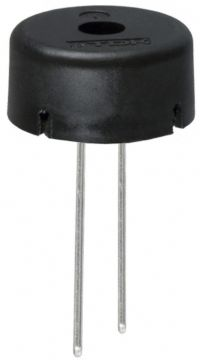
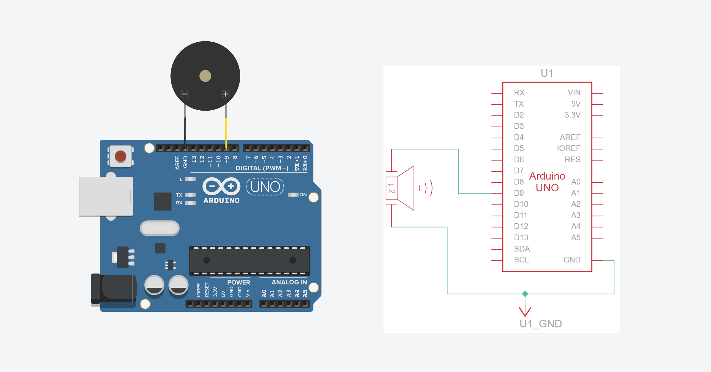
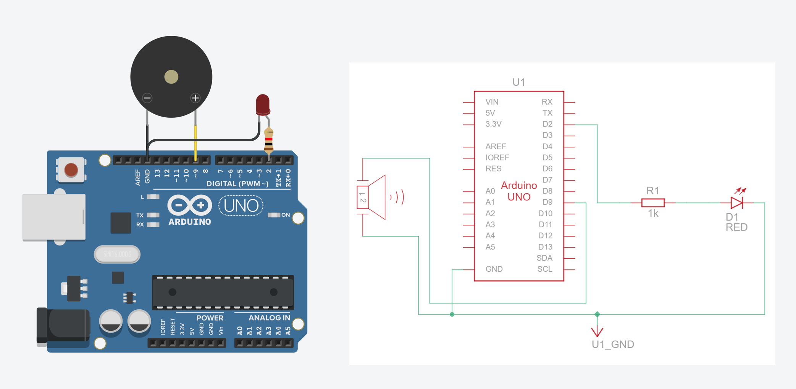

# {{ page.title | replace_first:'L','Lesson '}}
{: .no_toc }

## Table of Contents
{: .no_toc .text-delta }

1. TOC
{:toc}
---

<!-- TODO: Record a video of a melody playing on a piezo buzzer (with an LED flashing in sync) and embed here as the opening hook -->

So far, every output we've produced has been visual—turning LEDs on, off, fading, and blinking. In this lesson, we'll add a completely new output modality: **sound!** Using a piezo buzzer and the Arduino [`tone()`](https://www.arduino.cc/reference/en/language/functions/advanced-io/tone/) function, we'll learn how to play individual notes, scales, and even melodies.

This lesson also gives us a chance to clarify an important conceptual distinction: the difference between `analogWrite` (which controls **duty cycle**) and `tone()` (which controls **frequency**). If that doesn't make sense yet, it will by the end of this lesson!

## Materials

| Breadboard | Arduino | Piezo Buzzer |
|:-----:|:-----:|:-----:|
|  |  |  |
| Breadboard | Arduino Uno, Leonardo, or similar | Passive Piezo Buzzer |

We'll be using a passive piezo buzzer such as the [TDK PS1240](https://www.mouser.com/ProductDetail/810-PS1240P02BT) (~$0.40 from Mouser). These buzzers work with both 3.3V and 5V signals, and their resonant frequency (loudest tone) is around 4 kHz—but they can produce a wide range of audible frequencies. Piezo buzzers are **non-polarized** (like resistors), so they can be connected in either orientation.

{: .note }
> Make sure you have a **passive** piezo buzzer, not an **active** one. An active buzzer has a built-in oscillator and plays a fixed tone when powered. A passive buzzer requires an external signal (which is what `tone()` provides) and can play different frequencies. If your buzzer makes a sound when you simply connect it to 5V and GND, it's an active buzzer.
> 
> Here's the [TDK PS1240 piezoelectronic buzzer datasheet](https://product.tdk.com/system/files/dam/doc/product/sw_piezo/sw_piezo/piezo-buzzer/catalog/piezoelectronic_buzzer_ps_en.pdf), which makes clear on the title page that it is "without an oscillator circuit".

## `analogWrite` vs. `tone()`: what's the difference?

Before we start making sounds, it's important to understand how `tone()` differs from `analogWrite()`, which we learned about in the [previous lesson](led-fade.md). Both `tone()` and `analogWrite()` produce square waves, but they control **different properties** of the wave:

- **`analogWrite(pin, value)`** varies the **duty cycle** (the fraction of time the signal is HIGH) while keeping the frequency **fixed** (490 Hz or 980 Hz, depending on the pin). This is what we used to control LED brightness.

- **`tone(pin, frequency)`** varies the **frequency** (how many cycles per second) while keeping the duty cycle **fixed** at 50%. This is what controls pitch—the frequency of the sound wave determines whether you hear a low rumble or a high squeal.

<!-- TODO: Create a side-by-side diagram or animation showing: (1) analogWrite with varying duty cycles at fixed frequency, (2) tone() with varying frequencies at fixed 50% duty cycle -->

Here's a fun experiment to make this concrete: try connecting a piezo buzzer to a PWM pin and running `analogWrite(pin, 127)`. You'll hear a steady buzz at the PWM frequency of that pin (~490 Hz or ~980 Hz on the Uno, depending on the pin). Now try `tone(pin, 440)`. You'll hear concert A—a completely different pitch. With `analogWrite`, you can change the duty cycle, which alters the harshness or distortion of the buzz, but you can't cleanly change the pitch or lower the volume.

To make this more clear, we built a [Tinkercad Circuit example](https://www.tinkercad.com/things/5PaQ8YzlWdj-analogwrite-vs-tone-with-pot-input) that allows you to control either the **duty cycle** of the output waveform (via `analogWrite()`) or the **frequency** of the output waveform (via `tone()`). You control the analog input value with a [rotating potentiometer](potentiometers.md) and the mode `analogWrite()` vs. `tone()` via a slider switch (`tone()` is activated when the switch is to the left, `analogWrite()` is activated when the switch is to the right).

As you turn the potentiometer, listen carefully: in the `analogWrite()` mode, the buzzer stays at the same pitch but the volume changes slightly while in the `tone()` mode, the buzzer changes pitch. Watch the oscilloscopes: one waveform gets wider/narrower (duty cycle), the other gets faster/slower (frequency). This is the core distinction between PWM brightness control and tone frequency control!

<video autoplay loop muted playsinline style="margin:0px" aria-label="Video showing diff between the tone() function, which controls the waveform output frequency, and the analogWrite() function, which controls the waveform output duty cycle">
  <source src="assets/videos/analogWriteVersusToneWithPot_Tinkercad_web_muted.mp4" type="video/mp4" />
</video>
**Figure.** A Tinkercad simulation video showing the difference between the `tone()` function, which controls the waveform output frequency (pitch) with a fixed 50% duty cycle, and the `analogWrite()` function, which controls the waveform output duty cycle at a fixed frequency. The version above is muted. To play a version with sound (warning: wear headphones but at lower volumes), [click here](assets/videos/analogWriteVersusToneWithPot_Tinkercad.mp4). To play with our simulation interactively on Tinkercad, [click here](https://www.tinkercad.com/things/5PaQ8YzlWdj-analogwrite-vs-tone-with-pot-input).
{: .fs-1 }

> **Note:**
> This code uses `analogRead()` to read the [potentiometer dial](potentiometers.md). Don't worry if you don't understand how that works yet—we will cover it extensively in the upcoming [**Intro to Input**](intro-input.md) module! For now, just play [with this in Tinkercad](https://www.tinkercad.com/things/5PaQ8YzlWdj-analogwrite-vs-tone-with-pot-input) and get a sense for the difference between `tone()` and `analogWrite()`.
{: .note }

<!-- To really drive this home, we built a [Tinkercad Circuits example](https://www.tinkercad.com/) that sweeps through all `analogWrite` values (0–255) on a buzzer with an oscilloscope attached. Notice how the **duty cycle** changes (the waveform gets wider and narrower) but the **frequency stays the same**—the pitch of the buzz never changes! -->

<!-- TODO: Insert direct Tinkercad link to the PWM Sweep with Speaker and Oscilloscope circuit -->

<!-- 
**Figure.** A Tinkercad Circuits simulation demonstrating that `analogWrite` changes the duty cycle (visible on the oscilloscope) but not the frequency—so the buzzer pitch remains constant.
{: .fs-1 } -->

<!-- 
// Uses a PWM sweep to demonstrate that analogWrite has a fixed frequency
// but different duty cycle; so the speaker pitch is always the same!
// This is why we need tone(), which has a fixed 50% duty cycle
// but allows you to control the frequency.

const int SPEAKER_OUTPUT_PIN = 5;
const int MAX_ANALOG_OUT = 255;

int _analogOutVal = 0;
int _analogOutStep = 20;
const int DELAY_BETWEEN_STEPS = 500;

void setup() {
  Serial.begin(9600);
  pinMode(SPEAKER_OUTPUT_PIN, OUTPUT);
}

void loop() {
  analogWrite(SPEAKER_OUTPUT_PIN, _analogOutVal);

  float dutyCycle = _analogOutVal / (float)MAX_ANALOG_OUT * 100;
  Serial.print("Duty cycle: ");
  Serial.print(dutyCycle, 0);
  Serial.println("%");

  // Sweep up and down
  _analogOutVal += _analogOutStep;
  _analogOutVal = constrain(_analogOutVal, 0, MAX_ANALOG_OUT);
  if (_analogOutVal <= 0 || _analogOutVal >= MAX_ANALOG_OUT) {
    _analogOutStep *= -1;
  }

  delay(DELAY_BETWEEN_STEPS);
}


Compare this with `tone()`, where the duty cycle is always 50% but you control the frequency (pitch) directly. This is the fundamental distinction! -->

## The `tone()` function

Arduino provides three functions for generating tones:


tone(pin, frequency)              // play continuously until noTone() is called
tone(pin, frequency, duration)    // play for 'duration' milliseconds, then stop
noTone(pin)                       // stop playing


A few important details:

- `tone()` is non-blocking. This means your Arduino will immediately move to the next line of code while the hardware timer continues playing the sound in the background. If you want the program to wait until the note finishes, you must add a delay(duration) immediately after.
- `tone()` can work on **any digital pin**—not just PWM pins. This is because it uses its own timer (Timer2 on AVR boards) rather than the PWM hardware timers.
- Only **one tone** can play at a time. If you call `tone()` on a different pin while a tone is already playing, the first tone will stop. This is a limitation of using a single hardware timer.
- Because `tone()` relies on built-in hardware timers, it will **interfere with PWM output** on certain pins. On the Uno, it uses Timer2 (affecting Pins 3 and 11). On the Leonardo, it uses Timer3 (affecting Pin 5). Keep this in mind if you're combining `tone()` with `analogWrite`.

> **Hardware Conflict:**
> While a tone is playing, PWM `analogWrite()` functionality is disabled on specific pins depending on your board.
> * **Arduino Uno:** PWM is disabled on **Pins 3 and 11**.
> * **Arduino Leonardo:** PWM is disabled on **Pin 5**.
>
> If you need both `tone()` and `analogWrite` simultaneously, make sure to use PWM pins that don't conflict!
{: .warning }

For the implementation details, see [Tone.cpp](https://github.com/arduino/ArduinoCore-avr/blob/master/cores/arduino/Tone.cpp) in the [ArduinoCore-avr](https://github.com/arduino/ArduinoCore-avr) repository.

## Making the circuit

The circuit couldn't be simpler. Connect one leg of the piezo buzzer to a digital pin (we'll use **Pin 9** to avoid the Timer2 conflict with Pin 3) and the other leg to **GND**. No resistor is needed—the piezo buzzer draws very little current.

<!-- TODO: Create a wiring diagram showing a piezo buzzer connected between Pin 9 and GND on an Arduino Uno, with breadboard -->

**Figure.** A simple circuit connecting a passive piezo buzzer directly to Pin 9 and GND. No current-limiting resistor is required. You can [view and play with this simple tone circuit on Tinkercad here](https://www.tinkercad.com/things/aqUoDUiMU7x-simple-tone).
{: .fs-1 }

{: .note }
> We're using **Pin 9** rather than Pin 3 for the buzzer because `tone()` uses Timer2, which conflicts with PWM on Pins 3 and 11. By using Pin 9, we keep Pin 3 free for `analogWrite` in case we want to fade an LED at the same time (which we will, later in this lesson!).

We'll use this basic circuit throughout the lesson as most of the fun is in software.

### Why no series resistor?

In our previous lessons, we stressed the importance of using a current-limiting resistor with every LED. Without one, an LED will pull as much current as it can until it burns out—and potentially damages the Arduino pin in the process.

So, why are we wiring the piezo buzzer directly to Pin 9 and GND without a resistor?

The simple answer is that unlike LEDs, passive piezo buzzers draw very little current. They behave more like a small capacitor than a simple resistive load. The internal piezoceramic disk flexes when voltage is applied, and this process only requires a tiny amount of current—typically under 5 mA. Since an Arduino digital pin can safely supply up to 20 mA of continuous current, connecting the piezo buzzer directly is perfectly safe.

{: .note }
> **Piezo buzzers vs. electromagnetic speakers**
> 
> You may have seen Arduino speaker circuits online that include an inline resistor (typically 100Ω–1kΩ). Those circuits use **electromagnetic speakers**, which have a low-impedance coil (commonly 8Ω or 16Ω) and can draw significant current—easily exceeding the Arduino's per-pin limit. A series resistor is essential in those circuits to protect the microcontroller.
> 
> **Piezo buzzers** are fundamentally different: they are **capacitive** devices, not resistive, allowing them to be safely driven directly.
> 
> This capacitance also explains why you can't easily use a series resistor to reduce the volume of a piezo buzzer. Because a piezo's impedance varies with frequency, adding a series resistor attenuates different frequencies by different amounts—high notes get much quieter while low notes stay loud—rather than uniformly reducing the volume. That's why the tape trick mentioned earlier is the simplest, most practical solution!

## How do piezo buzzers actually work?

The word "piezoelectric" comes from the Greek word *piezein*, which means to press or squeeze. Piezoelectric materials have a fascinating property: when you apply a voltage to them, they physically change shape. Inside your passive buzzer is a thin metal plate with a piezoceramic disk glued to it. When the Arduino rapidly pulses voltage `HIGH` and `LOW`, the ceramic disk quickly bends back and forth. This rapid flexing pushes the surrounding air back and forth, generating the physical sound waves that reach your ears. The frequency of the electrical pulses directly dictates how fast the disk vibrates, which determines the pitch.

To help you visualize this, we built an interactive simulation. Try both modes:

- **Pulse (Tone) mode** simulates what happens when `tone()` drives the buzzer: the Arduino rapidly alternates the pin between 0V and 5V, and you can see the ceramic disk flexing back and forth in sync with the square wave. Notice the sound wave arcs radiating outward—that's the air being pushed back and forth by the vibrating disk. Try increasing the frequency and watch the disk flex faster.

- **Manual mode** lets you set a static DC voltage with the slider. Drag it to 5V and the disk bends—but stays bent. No oscillation means no vibration, which means no sound! This is why simply calling `digitalWrite(pin, HIGH)` won't produce a tone. You need the continuous pulsing that `tone()` provides.

<iframe src="https://editor.p5js.org/jonfroehlich/embed/mU7YwoUol" width="100%" height="620" style="border: none;"></iframe>
**Figure.** An interactive simulation of piezoelectric buzzer mechanics. In Pulse (Tone) mode, a square wave drives the ceramic disk to flex rapidly, producing sound waves. In Manual mode, you can apply a static voltage to see that a constant signal bends the disk but produces no sound. [Open in the p5.js editor](https://editor.p5js.org/jonfroehlich/sketches/mU7YwoUol).
{: .fs-1 }

### Why do they sound so... weird?

If you've listened to the Tinkercad simulations, you've probably noticed that the buzzer sounds a bit harsh, buzzy, and reminiscent of old 8-bit video games. There are two main reasons for this:

1. **The Square Wave:** The `tone()` function generates a perfect square wave, instantly snapping between 0V and 5V (or 3.3V on 3.3V boards). Unlike the smooth, continuous curve of a sine wave—which produces a pure, clean tone like a tuning fork—a square wave is composed of many overlapping frequencies called *harmonics* (we explore this in [Frequency Analysis](../signals/frequency-analysis.html)). Our ears perceive these extra harmonics as a buzzy, aggressive sound.

2. **Physical Resonance:** Piezo buzzers are designed primarily as alert buzzers (think microwave beeps or smoke detectors), not high-fidelity speakers. They are physically tuned to resonate and be loudest at a specific frequency—usually around 4 kHz. As you play different notes, the buzzer's physical characteristics will cause some pitches to sound overwhelmingly loud while others sound thin or muted.

### Square waves vs. sine waves

Because neither the Arduino Uno nor the Leonardo have built-in digital-to-analog converters (DACs), they cannot natively produce the smooth, analog sine waves that music is composed of. Instead, they can only produce digital square waves, which results in that distinctively harsh sound.

To let you interactively explore the difference, we built this p5js sound visualization tool. Make sure your computer speakers are on: do you hear the difference between a sine wave and a square wave? So, it's not just the type and quality of speaker (piezo buzzer) that matters but also the input waveform to the speaker!

<!-- Old p5js sketch <iframe src="https://editor.p5js.org/jonfroehlich/embed/t4DHmkij3" width="100%" height="460" style="border: none;"></iframe> -->

<iframe src="https://editor.p5js.org/jonfroehlich/embed/tLMt8T83M" width="100%" height="460" style="border: none;"></iframe>
**Figure.** An interactive square vs. sine wave explorer. Toggle between waveform types and adjust the frequency to hear and see the difference. The square wave produced by `tone()` sounds harsher due to its harmonic content, while a sine wave produces a pure, clean tone. [Open in the p5.js editor](https://editor.p5js.org/jonfroehlich/sketches/tLMt8T83M).
{: .fs-1 }

## Playing individual tones

Let's start by playing a single tone. The following code plays concert A (440 Hz) for one second, pauses for half a second, then repeats. You can [play with it interactively on Tinkercad](https://www.tinkercad.com/things/aqUoDUiMU7x-simple-tone) or copy/paste it into the Arduino IDE and run it for real!


const int BUZZER_PIN = 9;

void setup() {
  pinMode(BUZZER_PIN, OUTPUT);
}

void loop() {
  tone(BUZZER_PIN, 440);     // Play concert A (440 Hz)
  delay(1000);               // Delay for one second
  noTone(BUZZER_PIN);        // Stop tone
  delay(500);                // Pause for half a second
}


Try changing the frequency: 262 is middle C, 523 is one octave higher (C5), and 1000 produces a high-pitched tone. What's the lowest frequency you can hear? The highest? (Most humans can hear roughly 20 Hz to 20 kHz, but this varies with age.) Note: The standard Arduino `tone()` function has a minimum frequency of 31 Hz due to hardware timer limitations, so you won't be able to test the absolute bottom of human hearing (20 Hz).

> **Pro Tip: How do I make it quieter?**
> Once you get your buzzer working, your first question will probably be: *"How do I turn the volume down?"* Because the `tone()` function always outputs a fixed 50% duty cycle square wave, you **cannot** control the volume (amplitude) via code. Instead, we use a classic physical computing hack: **put a piece of tape over it!** Placing a small piece of masking tape or painter's tape directly over the hole on top of the piezo buzzer will significantly muffle the sound. As we discussed [above](#why-no-series-resistor), adding a series resistor doesn't work well here because the piezo's capacitive nature causes different frequencies to be muffled unevenly.
{: .note }

{: .highlight }
**Using Tinkercad?** Make sure you have your laptop volume 🔊 on (but to a relatively reasonable volume). The sound produced by these buzzers is cacophonous!

## Playing a scale

Now let's play something more musical. The Arduino IDE ships with a helpful file called `pitches.h` that defines frequency constants for musical notes. You can find it in the [toneMelody example](https://github.com/arduino/arduino-examples/blob/main/examples/02.Digital/toneMelody/pitches.h) or access it via `File -> Examples -> 02.Digital -> toneMelody` in the IDE.

Here are a few of the note definitions from [`pitches.h`](https://github.com/arduino/arduino-examples/blob/main/examples/02.Digital/toneMelody/pitches.h). You can also find musical note frequencies in this [Piano Key Frequencies article](https://en.wikipedia.org/wiki/Piano_key_frequencies) on Wikipedia.


#define NOTE_C4  262   // Middle C
#define NOTE_D4  294
#define NOTE_E4  330
#define NOTE_F4  349
#define NOTE_G4  392
#define NOTE_A4  440   // Concert A
#define NOTE_B4  494
#define NOTE_C5  523   // C one octave above middle C


Using these constants, we can play a C major scale:


#define NOTE_C4  262   // Middle C
#define NOTE_D4  294
#define NOTE_E4  330
#define NOTE_F4  349
#define NOTE_G4  392
#define NOTE_A4  440   // Concert A
#define NOTE_B4  494
#define NOTE_C5  523   // C one octave above middle C

const int BUZZER_PIN = 9;
const int NOTE_DURATION_MS = 400;
const int PAUSE_BETWEEN_NOTES_MS = 100;

// C major scale
int scale[] = {NOTE_C4, NOTE_D4, NOTE_E4, NOTE_F4, NOTE_G4, NOTE_A4, NOTE_B4, NOTE_C5};
int numNotes = 8;

void setup() {
  pinMode(BUZZER_PIN, OUTPUT);
}

void loop() {
  // Play each note ascending in the scale
  for (int i = 0; i < numNotes; i++) {
    tone(BUZZER_PIN, scale[i], NOTE_DURATION_MS);
    delay(NOTE_DURATION_MS); // Pause for the note duration
    delay(PAUSE_BETWEEN_NOTES_MS); // Additional pause for a rest between notes
  }

  delay(300); // pause before descending
  
  // Play each note descending in the scale
  for (int i = numNotes - 1; i >= 0; i--) {
    tone(BUZZER_PIN, scale[i], NOTE_DURATION_MS);
    delay(NOTE_DURATION_MS); // Pause for the note duration
    delay(PAUSE_BETWEEN_NOTES_MS); // Additional pause for a rest between notes
  }
  
  delay(1000); // pause before repeating
}


Notice that we use the `duration` parameter of `tone()` here, so we don't need to call `noTone()` manually—the tone stops automatically after `NOTE_DURATION_MS` milliseconds. One subtlety: `tone()` is **non-blocking**, meaning the sketch continues executing immediately even while the tone is still playing. That's why we still need the `delay()` call—without it, the loop would race ahead to the next note before the current one finishes.

You can play with [this project interactively in Tinkercad](https://www.tinkercad.com/things/2SqhVejLRNi). 

## Playing a melody

Now for the fun part—let's play a real melody! The approach is the same as the scale, but with different notes and varying durations. We store the melody as two arrays: one for the notes and one for the note durations.

The Arduino IDE includes a built-in example that plays a short melody. You can access it via `File -> Examples -> 02.Digital -> toneMelody`. 

Instead, we've written our own version using the Imperial March from Star Wars. You can [try it on Tinkercad here](https://www.tinkercad.com/things/l2d7xFFuWFY/).


#define NOTE_C4  262
#define NOTE_D4  294
#define NOTE_E4  330
#define NOTE_F4  349
#define NOTE_G4  392
#define NOTE_GS4 415
#define NOTE_A4  440
#define NOTE_B4  494
#define NOTE_C5  523
#define NOTE_E5  659
#define NOTE_F5  698

const int BUZZER_PIN = 9;

// The Imperial March - Main Theme (two phrases)
int melody[] = {
  // Phrase 1: The iconic opening
  NOTE_A4, NOTE_A4, NOTE_A4, NOTE_F4, NOTE_C5, 
  NOTE_A4, NOTE_F4, NOTE_C5, NOTE_A4,
  
  // Phrase 2: The response (up the octave)
  NOTE_E5, NOTE_E5, NOTE_E5, NOTE_F5, NOTE_C5, 
  NOTE_GS4, NOTE_F4, NOTE_C5, NOTE_A4
};

// Note durations as divisors of DURATION_BASE:
//   2 = half, 4 = quarter, 6 = dotted eighth, 8 = eighth, 16 = sixteenth
int noteDurations[] = {
  4, 4, 4, 6, 16, 
  4, 6, 16, 2,
  
  4, 4, 4, 6, 16, 
  4, 6, 16, 2
};

// In C/C++, arrays don't have a built-in .length property. 
// We calculate the number of elements by dividing the total array memory size (in bytes)
// by the memory size of a single element (the first item at index 0).
const int NUM_NOTES = sizeof(melody) / sizeof(melody[0]);

// The tempo in Beats Per Minute
const int BPM = 104;

// A minute has 60,000 ms. Divide by BPM to get the duration of one quarter note.
// Multiply by 4 because our array uses '4' to represent a quarter note divisor.
const int DURATION_BASE = (60000 / BPM) * 4;

// Pause between notes as a multiplier of note duration.
// 0.3 means 30% of the note length itself
const float NOTE_GAP_FACTOR = 0.30;

void setup() {
  for (int i = 0; i < NUM_NOTES; i++) {
    // Calculate note duration from the base tempo value
    // e.g., quarter note = 2308/4 = 577ms, dotted eighth = 2308/6 ≈ 385ms
    int duration = DURATION_BASE / noteDurations[i];
    if (melody[i] > 0) {
      tone(BUZZER_PIN, melody[i], duration);
    }
    delay(duration); // Wait for the duration whether playing a note or resting

    // Pause between notes
    int pauseBetweenNotes = duration * NOTE_GAP_FACTOR;
    delay(pauseBetweenNotes); // no music

    noTone(BUZZER_PIN);
  }
}

void loop() {
  // Melody plays once in setup(), nothing to do here
}


To represent a rest (silence), use a note value of `0` in the melody array. The code checks for this and simply skips the `tone()` call, relying on the `delay()` to produce a silent pause. Avoid calling `tone(pin, 0)` directly—while it happens to produce silence on AVR boards, it causes crashes on other platforms (like SAMD) due to a division by zero in the timer math.

<video controls playsinline style="margin:0px" aria-label="Star Wars Imperial March playing on an Arduino Leonardo">
  <source src="assets/videos/Arduino_Tone-PlayImperialMarch_Handheld_web.mp4" type="video/mp4" />
</video>
**Figure.** A video of the Imperial March from Star Wars playing with the `tone()` function on the Arduino Leonardo. Note: the code executing here is slightly more complicated than above ([see full source on GitHub here](https://github.com/makeabilitylab/arduino/blob/master/Basics/tone/PlayImperialMarchAdvanced/PlayImperialMarchAdvanced.ino)). I've also mapped the `LED_BUILTIN` to turn on when a note is played.
{: .fs-1 }

{: .note }
> **Want to play more complex melodies?** Search online for "Arduino tone songs" or "Arduino buzzer melodies" — the community has transcribed hundreds of songs into Arduino `tone()` format. The [arduino-songs](https://github.com/robsoncouto/arduino-songs) repository by Robson Couto is a great collection. Just remember that the piezo buzzer can only play one note at a time (no chords!).

## Combining tone with an LED

Now let's bring everything together. Since we already know how to control LEDs from lessons [L1](led-on.md) through [L4](led-fade.md), we can add **visual feedback** synchronized with our audio output. This kind of **multimodal feedback**—combining sound and light—makes the output more engaging and is a common pattern in interactive projects.

### Flashing an LED with each note

The simplest approach is to turn an LED on while a note plays and off during the pause. Here's a simple two-tone siren that alternates an LED with each pitch change:

<!-- TODO: Insert direct Tinkercad link to the Simple Siren with External LED circuit -->

**Figure.** A Tinkercad Circuits simulation of a simple siren with an LED that toggles with each tone change. Try it yourself in [Tinkercad](https://www.tinkercad.com/things/frb7eeyVkKN-simple-siren-with-external-led-no-breadboard/)!
{: .fs-1 }


const int BUZZER_PIN = 9;
const int LED_PIN = 2;
const int SOUND_DURATION_MS = 500;

void setup() {
  pinMode(BUZZER_PIN, OUTPUT);
  pinMode(LED_PIN, OUTPUT);
}

void loop() {
  // tone() generates a square wave of the specified frequency
  // (and 50% duty cycle) on a pin
  tone(BUZZER_PIN, 392);           // G4
  digitalWrite(LED_PIN, HIGH);     // LED on for high tone
  delay(SOUND_DURATION_MS);

  tone(BUZZER_PIN, 262);           // C4
  digitalWrite(LED_PIN, LOW);      // LED off for low tone
  delay(SOUND_DURATION_MS);
}


<video controls playsinline style="margin:0px" aria-label="A simple siren video playing alternating tones with an LED flashing on and off">
  <source src="assets/videos/Arduino_Tone-SimpleSirenWithLED_Handheld_web.mp4" type="video/mp4" />
</video>
**Figure.** A video of Simple Siren playing an alternating tone and correspondingly turning on/off an LED on Pin 2. See the [Tinkercad version here](https://www.tinkercad.com/things/frb7eeyVkKN-simple-siren-with-external-led-no-breadboard/).
{: .fs-1 }

You can also check out our Imperial March code, which also turns on the `BUILTIN_LED` whenever a note is played:

* **Imperial march simplified** on [Tinkercad](https://www.tinkercad.com/things/l2d7xFFuWFY/) and [GitHub](https://github.com/makeabilitylab/arduino/blob/master/Basics/tone/PlayImperialMarchSimple/PlayImperialMarchSimple.ino)
  
* **Imperial march advanced** in [GitHub](https://github.com/makeabilitylab/arduino/blob/master/Basics/tone/PlayImperialMarchAdvanced/PlayImperialMarchAdvanced.ino), which includes better rhythm and an extended melody.

<!-- ### Fading an LED with pitch

For a more sophisticated effect, we can use `analogWrite` to map the note frequency to LED brightness—higher notes produce a brighter LED:


#include "pitches.h"

const int BUZZER_PIN = 9;
const int LED_PIN = 5;  // PWM pin (not on Timer2)
const int NOTE_DURATION_MS = 400;
const int PAUSE_MS = 100;

int scale[] = {NOTE_C4, NOTE_D4, NOTE_E4, NOTE_F4, NOTE_G4, NOTE_A4, NOTE_B4, NOTE_C5};
int numNotes = 8;

void setup() {
  pinMode(LED_PIN, OUTPUT);
}

void loop() {
  for (int i = 0; i < numNotes; i++) {
    // Map note index to brightness (0-255)
    int brightness = map(i, 0, numNotes - 1, 30, 255);

    analogWrite(LED_PIN, brightness);                 // LED brightness matches pitch
    tone(BUZZER_PIN, scale[i], NOTE_DURATION_MS);     // play note
    delay(NOTE_DURATION_MS);

    analogWrite(LED_PIN, 0);                          // LED off during pause
    delay(PAUSE_MS);
  }

  delay(1000);
}


As the scale ascends, the LED gets brighter. As it descends, the LED dims. This is a simple example of **data-driven multimodal output**—the same data (the note being played) drives two different output channels (sound and light). -->

<!-- TODO: Record a video of the scale playing with an LED fading in sync with pitch -->
<!-- TODO: Create a Tinkercad Circuits version of the tone+LED example — Tinkercad supports both piezo buzzers and LEDs, so students can see and hear the output in simulation -->

## Exercises

Want to go further? Here are some challenges:

- **Compose your own melody.** Transcribe a simple tune you know into note and duration arrays. Start with something short like "Mary Had a Little Lamb" or "Twinkle Twinkle Little Star."
- **Hearing range test.** Write a program that sweeps from 20 Hz to 20,000 Hz. At what frequency can you no longer hear the tone? Compare with friends—does it vary?
- **Multiple LEDs.** Use an RGB LED (from [L7](rgb-led.md)) and map different notes to different colors. Can you create a visual "color organ" that changes color with each note? Alternatively, set up one LED per note and have them activate accordingly.
- **Serial Plotter.** Use `Serial.println` to output the frequency of each note as it plays and visualize it on the [Serial Plotter](serial-print.md#visualizing-data-with-the-serial-plotter). We made our [own version of the Imperial March](https://github.com/makeabilitylab/arduino/blob/master/Basics/tone/PlayImperialMarchSimpleWithSerial/PlayImperialMarchSimpleWithSerial.ino) that does just this!

## Lesson Summary

In this lesson, you added a completely new sensory modality to your output toolkit. You learned:

- The critical difference between an **active buzzer** (plays a fixed pitch when powered) and a **passive buzzer** (requires a frequency signal to produce varying pitches).
- The conceptual difference between `analogWrite()` (which varies the duty cycle of a fixed-frequency wave) and `tone()` (which varies the frequency of a fixed 50% duty cycle wave).
- How to use `tone(pin, frequency)` and `noTone(pin)` to play notes, scales, and melodies.
- How to combine visual feedback (LEDs) and audio feedback (buzzers) to create engaging, multimodal outputs.
- How hardware timers limit which pins can use PWM while a tone is actively playing (Pins 3/11 on the Uno, Pin 5 on the Leonardo).

## A peek ahead

In the [Intro to Input](intro-input.md) lessons, you'll learn how to read buttons and build a [five-key button piano](piano.md) where each button plays a different note. The `tone()` function you learned here will be the foundation for that project!

## Next Lesson

In the [next lesson](led-blink2.md), we will learn about the difference between **current sources** and **current sinks** by building two LED circuits that behave in opposite ways when their pins are driven `HIGH` and `LOW`.

[Previous: Fading an LED](led-fade.md){: .btn .btn-outline }
[Next: Blinking Two LEDs](led-blink2.md){: .btn .btn-outline }
