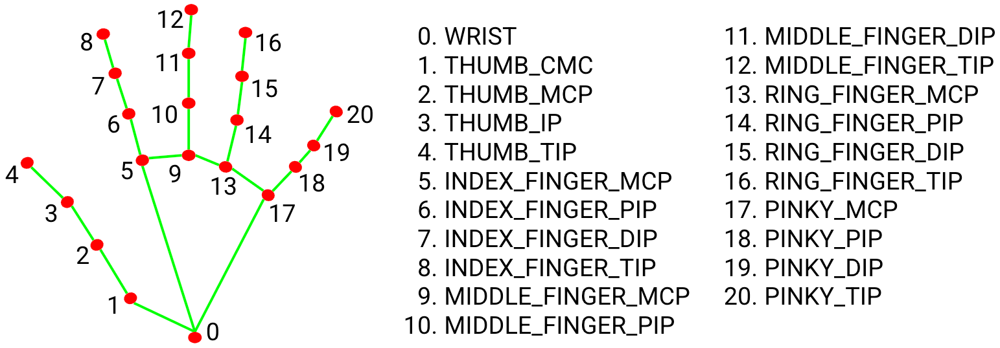
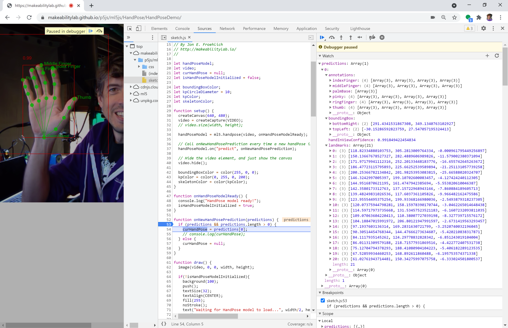
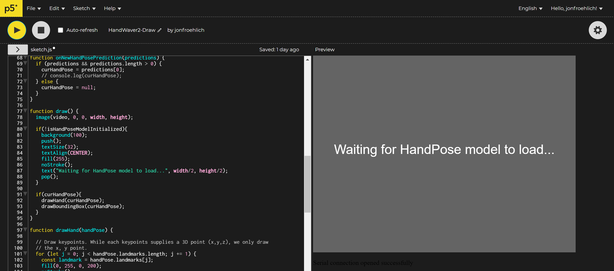
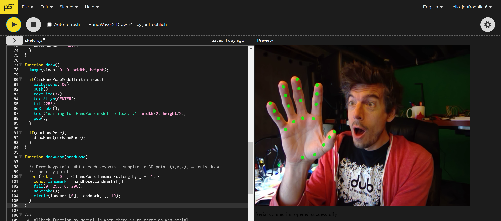
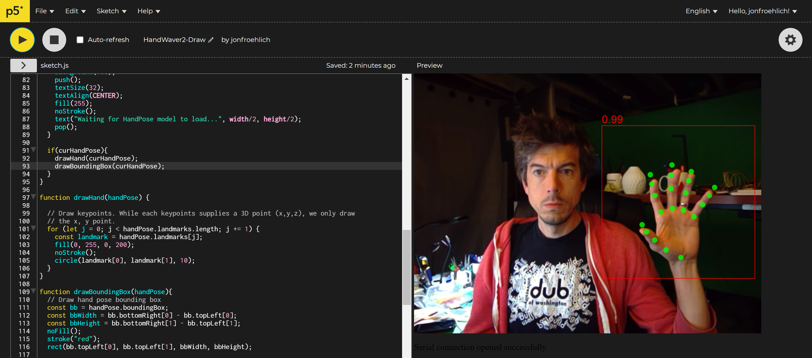
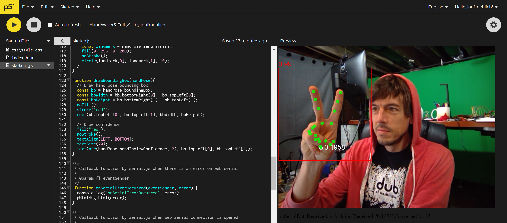
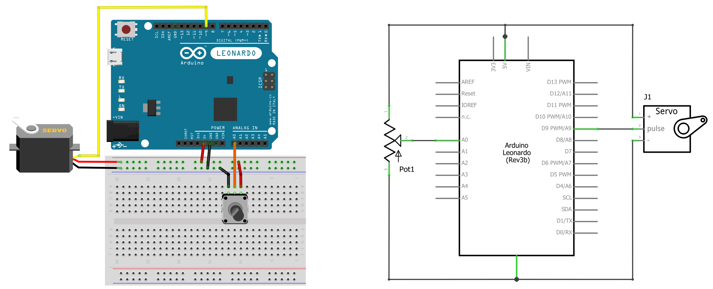
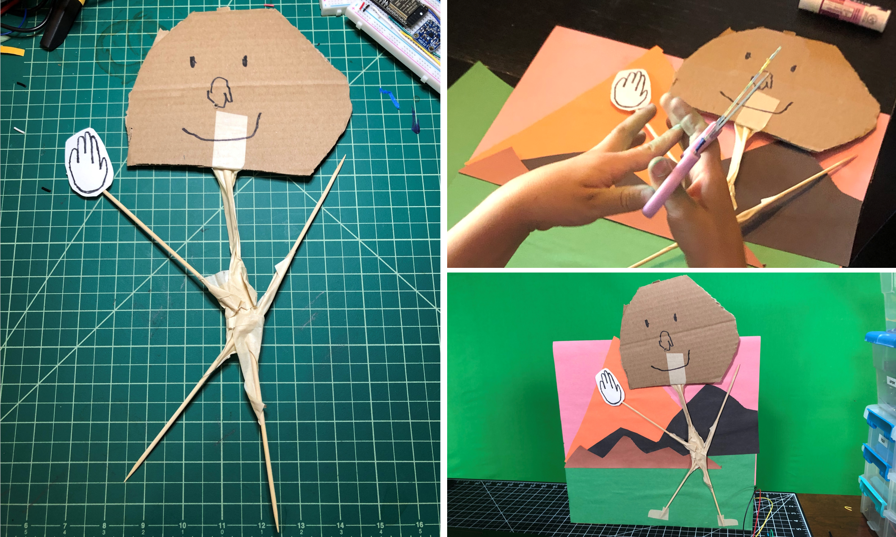
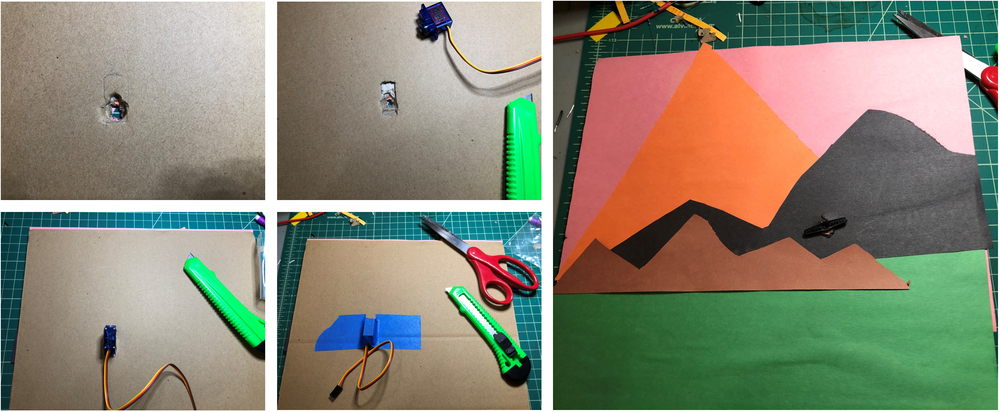

# {{ page.title }}
{: .no_toc }

## Table of Contents
{: .no_toc .text-delta }

1. TOC
{:toc}
---

In our [previous lesson](ml5js-serial.md), we introduced combining Arduino with machine learning (ML) libraries like [ml5.js](https://ml5js.org/), a web-based ML library built on [Google TensorFlow](https://www.tensorflow.org/js). Specifically, we built a [p5.js app](https://makeabilitylab.github.io/p5js/WebSerial/ml5js/NoseTracker/) that fed a real-time web cam stream into [ml5's PoseNet](https://learn.ml5js.org/#/reference/posenet) to identify and classify human body parts (keypoints) and sent identified keypoints to our Arduino to create new interactive experiences.

In this lesson, we will introduce a new ml5 model, called [Handpose](https://learn.ml5js.org/#/reference/handpose),  which precisely tracks the hand and 20 finger keypoints in 3-dimensions, and use it to control a servo motor. This lesson should further advance your understanding of using [ml5](https://ml5js.org/), how to modularize and build an ml5+Arduino app step-by-step, and hopefully also inspire you to think about how we can combine real-time ML with Arduino.

<!-- which was ported from [Google's TensorFlow Handpose model](https://github.com/tensorflow/tfjs-models/tree/master/handpose), -->

<video autoplay loop muted playsinline style="margin:0px">
  <source src="assets/videos/HandPose_Optimized_1200w.mp4" type="video/mp4" />
</video>
**Video.** A quick demonstration of [ml5's Handpose](https://learn.ml5js.org/#/reference/handpose) as implemented in our example app called [HandWaveDetector](https://makeabilitylab.github.io/p5js/ml5js/HandPose/HandWaveDetector) ([code](https://github.com/makeabilitylab/p5js/tree/master/ml5js/HandPose/HandWaveDetector)).
{: .fs-1 }

## Handpose

In March 2020, the [Google TensorFlow.js team](https://blog.tensorflow.org/2020/03/face-and-hand-tracking-in-browser-with-mediapipe-and-tensorflowjs.html) released two incredible packages for web-based face and hand tracking, entitled [FaceMesh](https://www.npmjs.com/package/@tensorflow-models/facemesh) (now [face-landmarks-detection](https://github.com/tensorflow/tfjs-models/tree/master/face-landmarks-detection)) and [HandPose](https://github.com/tensorflow/tfjs-models/tree/master/handpose), respectively. Soon thereafter a user made a [new feature request](https://github.com/ml5js/ml5-library/issues/823) to support these new packages with ml5. By November 2020, it was implemented into ml5 by [Bomani Oseni McClendon](https://github.com/bomanimc) as part of the [ml5.js Fellows Program](https://medium.com/processing-foundation/announcing-our-2020-ml5-js-fellows-45f8f6ff378d)).

<video autoplay loop muted playsinline style="margin:0px">
  <source src="assets/videos/HandPoseFaceMesh_Optimized.mp4" type="video/mp4" />
</video>
**Video.** A demonstration of TensorFlow.js' [FaceMesh](https://github.com/tensorflow/tfjs-models/tree/master/face-landmarks-detection) and [HandPose](https://github.com/tensorflow/tfjs-models/tree/master/handpose) both which are available in ml5 as [Facemesh](https://learn.ml5js.org/#/reference/facemesh) and [Handpose](https://learn.ml5js.org/#/reference/handpose). Video from the [TensorFlow.js blog](https://blog.tensorflow.org/2020/03/face-and-hand-tracking-in-browser-with-mediapipe-and-tensorflowjs.html).
{: .fs-1 }

In this lesson, we will focus on [HandPose](https://learn.ml5js.org/#/reference/handpose) rather than [FaceMesh](https://learn.ml5js.org/#/reference/facemesh) (though both are available in ml5). You are welcome to use either the [TensorFlow.js implementation](https://github.com/tensorflow/tfjs-models/tree/master/handpose), [Google's MediaPipe version](https://google.github.io/mediapipe/solutions/hands), or [ml5's version](https://learn.ml5js.org/#/reference/handpose). All three implementations use the same underlying pre-trained ML model. For this lesson, we will use [ml5's HandPose](https://learn.ml5js.org/#/reference/handpose). Here are some example demos across the three implementations, which run in your web browser:

- [Google MediaPipe's Hand Tracking Demo](https://codepen.io/mediapipe/pen/RwGWYJw)
- [Google MediaPipe's Demo App: Hand Defrosting](https://codepen.io/mediapipe/pen/bGweWyR)
- [Google TensorFlow's HandPose Demo](https://storage.googleapis.com/tfjs-models/demos/handtrack/index.html)
- [ml5 HandPose Demo in p5.js web editor](https://editor.p5js.org/ml5/sketches/Handpose_Webcam)

### HandPose model

In 2019, research scientists Margaret Mitchell, Timnit Gebru, and colleagues published a paper entitled [*Model Cards for Model Reporting*](https://arxiv.org/pdf/1810.03993.pdf), which called for ML-based APIs to provide transparent information about *how* the underlying ML model in the API was trained and expected usage contexts. The paper begins with important motivation that emphasizes how ML is beginning to permeate every aspect of life with serious ramifications:

> Trained machine learning models are increasingly used to perform high-impact tasks in areas such as law enforcement, medicine, education, and employment. In order to clarify the intended use cases of machine learning models and minimize their usage in contexts for which they are not well suited, we recommend that released models be accompanied by documentation detailing their performance characteristics.
{: .fs-4 }

They then propose a framework called "model cards" to standardize how ML models are reported by companies:

> In this paper, we propose a framework that we call **model cards**, to encourage such transparent model reporting. Model cards are short documents accompanying trained machine learning models that provide benchmarked evaluation in a variety of conditions, such as across different cultural, demographic, or phenotypic groups (*e.g.,* race, geographic location, sex, Fitzpatrick skin type [[15](https://pubmed.ncbi.nlm.nih.gov/3377516/)]) and intersectional groups (*e.g.,* age and race, or sex and Fitzpatrick skin type) that are relevant to the intended application domains. Model cards also disclose the context in which models are intended to be used, details of the performance evaluation procedures, and other relevant information.
{: .fs-4 }

This paper and the respective research scientists who authored it have made a significant impact on the ML community. As a testament, many of the Google ML APIs and models now provide "model cards". Here's the model card for [HandPose](https://drive.google.com/file/d/1sv4sSb9BSNVZhLzxXJ0jBv9DqD-4jnAz/view) ([local copy](../assets/datasheets/GoogleTensorFlow_ModelCard_HandPose.pdf))—notably, I could not find one for [PoseNet](https://github.com/tensorflow/tfjs-models/tree/master/posenet).

We summarize a few important HandPose model notes below.

#### Model specifications

HandPose consists of two lightweight models, a palm detector and a hand landmark model, to detect and classify keypoints on the hand. The model inputs an image or video frame, resizes that input to 256x256 for recognition, and outputs: 
- a palm bounding box, 
- 21 3-dimensional hand landmarks (keypoints), and 
- an overall confidence score for the hand detection 

The 21 keypoints include four each for the `thumb`, `indexFinger`, `middleFinger`, `ringFinger`, and `pinky` plus one more for the `palmBase`:

**Figure.** The HandPose keypoints from the [MediaPipe team](https://google.github.io/mediapipe/solutions/hands).
{: .fs-1 }

The actual keypoint indices from the TensorFlow implementation, which ml5 uses:


export const MESH_ANNOTATIONS: {[key: string]: number[]} = {
  thumb: [1, 2, 3, 4],
  indexFinger: [5, 6, 7, 8],
  middleFinger: [9, 10, 11, 12],
  ringFinger: [13, 14, 15, 16],
  pinky: [17, 18, 19, 20],
  palmBase: [0]
};


**Code.** Source from [keypoints.ts](https://github.com/tensorflow/tfjs-models/blob/master/handpose/src/keypoints.ts) in the [TensorFlow models repo](https://github.com/tensorflow/tfjs-models).
{: .fs-1 }

According to the [TensorFlow team](https://github.com/tensorflow/tfjs-models/tree/master/handpose), HandPose is well-suited for real-time inference across a variety of devices, achieving 40 FPS on a 2018 MacBook Pro, 35 FPS on an iPhone11, and 6 FPS on a Pixel3.

#### Model limitations and ethical considerations

In terms of limitations and ethical considerations, [the HandPose model card](https://drive.google.com/file/d/1sv4sSb9BSNVZhLzxXJ0jBv9DqD-4jnAz/view) specifies that the HandPose models have been trained on a limited dataset and are not appropriate for counting the number of hands in a crowd, detecting hands with gloves or occlusions, or detecting hands that are far from the camera (greater than ~2 meters).

Moreover, the model card makes clear that the HandPose model is not intended for life-critical decisions and that performance will vary across skin tones, gender, age, and environmental conditions (*e.g.,* low light).

Importantly, just as [PoseNet](https://learn.ml5js.org/#/reference/posenet), which we used in the [previous lesson](ml5js-serial.md), **detects** body pose keypoints but does **not** attempt to **recognize** *who* is in an image, HandPose similarly performs detection but does not attempt recognition (that is, *who* owns the detected hand). In computer vision, there is an important difference between *detection* and *recognition*. All detections occur locally in the user's web browser (and not in the cloud).

<!-- The HandPose model detects hands in an input image or video stream and returns twenty-one 3-dimensional landmarks (keypoints) locating features within each hand. More specifically, the  -->

## ml5 HandPose

The ml5 HandPose model works similarly to the [TensorFlow.js](https://github.com/tensorflow/tfjs-models/tree/master/handpose) and [ MediaPipe](https://google.github.io/mediapipe/solutions/hands) versions; however, the ml5 model only supports **one** hand at a time.

### The HandPose Data Structure

Just like with [PoseNet](ml5js-serial.md#the-posenet-data-structure), the TensorFlow and ml5 HandPose APIs use the same data structure. The model returns an array of objects describing each detected hand (always one in ml5's case, currently). Each "hand" object includes four things:
- a `handInViewConfidence`, which is the model's confidence that the hand actually exists
- a `boundingBox`, which provides the `topLeft` x,y and `bottomRight` x,y positions of the detected hand
- a `landmarks` array, which includes the 3D (x,y,z) coordinates of each hand landmark (keypoint)
- an `annotations` array, which provides the same 3D coordinates as `landmarks` but semantically grouped into `thumb`, `indexFinger`, `middleFinger`, `ringFinger`,  `pinky`, and `palmBase`

The array structure looks like this:


[
  {
    handInViewConfidence: 1, // The probability of a hand being present.
    boundingBox: { // The bounding box surrounding the hand.
      topLeft: [162.91, -17.42],
      bottomRight: [548.56, 368.23],
    },
    landmarks: [ // The 3D coordinates of each hand landmark.
      [472.52, 298.59, 0.00],
      [412.80, 315.64, -6.18],
      ...
    ],
    annotations: { // Semantic groupings of the `landmarks` coordinates.
      thumb: [
        [412.80, 315.64, -6.18]
        [350.02, 298.38, -7.14],
        ...
      ],
      ...
    }
  }
]


To make this more clear, here's a screenshot from Chrome's dev tools showing the `predictions` array (which, again, will always be size 1 because ml5 is currently limited to detecting one simultaneous hand). In the screenshot, I've expanded the array to show the aforementioned high-level structure of `handInViewConfidence`, `boundingBox`, `landmarks`, and `annotations`.

**Figure.** This figure shows a screenshot of the HandPose `predictions` array and underlying objects as shown in Chrome's dev tools. Right-click and select "Open Image in New Tab" to enlarge. The app running here is our [HandPoseDemo](https://makeabilitylab.github.io/p5js/ml5js/HandPose/HandPoseDemo/). You can also explore the model interactively: run [HandPoseDemo](https://makeabilitylab.github.io/p5js/ml5js/HandPose/HandPoseDemo/), open `sketch.js` in Sources, put a breakpoint on the `onNewHandPosePrediction()` function, and add the `predictions` array to the `Watch` list. Exploring data structures like this can help advance understanding—and is a great strategy for web dev.
{: .fs-1 }

### Example p5.js + ml5.js HandPose demo

To demonstrate the ml5.js HandPose API and how to step through the data structure, we created a simple application called [HandPoseDemo](https://makeabilitylab.github.io/p5js/ml5js/HandPose/HandPoseDemo/) that renders:

- the `boundingBox` returned from the API along with a "tighter" version that we manually calculate based on keypoints
- the `handInViewConfidence` score, which we draw above the "tight" bounding box
- the 21 `landmarks` (keypoints) for the `thumb`, `indexFinger`, `middleFinger`, `ringFinger`,  `pinky`, and `palmBase` along with text labels

This data structure is similar but not identical to [PoseNet](ml5js-serial.md#the-posenet-data-structure)—one key difference is that unlike PoseNet, the individual keypoints do not include specific confidence scores. Here's a quick video demo.

<video autoplay loop muted playsinline style="margin:0px">
  <source src="assets/videos/HandPoseDemo-GrayBackdrop_TrimmedAndOptimized.mp4" type="video/mp4" />
</video>
**Video.** The [HandPoseDemo](https://makeabilitylab.github.io/p5js/ml5js/HandPose/HandPoseDemo/) ([code](https://github.com/makeabilitylab/p5js/tree/master/ml5js/HandPose/HandPoseDemo) on GitHub). You can also view, edit, and play with the code in the [p5.js web editor](https://editor.p5js.org/jonfroehlich/sketches/Nn4pXTpbu).
{: .fs-1 }

We put the HandPoseDemo up on the p5.js web editor ([link](https://editor.p5js.org/jonfroehlich/sketches/Nn4pXTpbu)). We encourage you to view the code, edit it, and play. The demo is also available on GitHub ([live page](https://makeabilitylab.github.io/p5js/ml5js/HandPose/HandPoseDemo), [code](https://github.com/makeabilitylab/p5js/tree/master/ml5js/HandPose/HandPoseDemo)).

## Building an ml5 HandPose + Arduino app: HandWaver

To help highlight the potential of real-time ML plus Arduino, we will build a simple "robotic" hand waver. We will use ml5's HandPose API to sense the user's hand, which will then control a servo motor embedded on a cardboard-crafted figure. See sneak preview below.

<video autoplay loop muted playsinline style="margin:0px">
  <source src="assets/videos/HenryBodySerial_HenryStanding_TrimmedAndOptimized.mp4" type="video/mp4" />
</video>
**Video.** A quick demo of "Henry, the Tape Man", which was designed and built by a kindergartner, a preschooler, and me. The JavaScript-based frontend is built with the p5+ml5 app called [HandWaver](https://github.com/makeabilitylab/p5js/tree/master/WebSerial/ml5js/HandWaver) and the Arduino sketch [ServoSerialIn.ino](https://github.com/makeabilitylab/arduino/blob/master/Serial/ServoSerialIn/ServoSerialIn.ino). (The actual Arduino sketch running here is a slightly modified version called [ServoPotWithSerialInOLED.ino](https://github.com/makeabilitylab/arduino/blob/master/Serial/ServoPotWithSerialInOLED/ServoPotWithSerialInOLED.ino))
{: .fs-1 }

### Building the web app side

We'll begin by building the web app in [p5.js](https://p5js.org/) and [ml5](https://ml5js.org/). As usual, we'll start with the [web serial template](https://github.com/makeabilitylab/p5js/tree/master/WebSerial/p5js/SerialTemplate), as we'll communicate between ml5 and Arduino using web serial:

- If you're using VSCode, copy [`SerialTemplate`](https://github.com/makeabilitylab/p5js/tree/master/WebSerial/p5js/SerialTemplate) and rename the folder to `HandWaver`.
- If you're using the p5.js online editor, simply open [Serial Template](https://editor.p5js.org/jonfroehlich/sketches/vPfUvLze_C) and rename your project to `HandWaver`.

#### Add in and initialize ml5's HandPose

The ml5 library generally aims to create consistency across their APIs. Thus, the ml5 HandPose API should feel familiar if you followed our previous [PoseNet lesson](ml5js-serial.md). Similar to [PoseNet](https://learn.ml5js.org/#/reference/posenet), the `ml5.handpose` constructor takes in three optional arguments `video`, `options`, and `callback` (indicated by the `?` prefix):


const handpose = ml5.handpose(?video, ?options, ?callback);


- `video`: An optional [HTMLVideoElement](https://developer.mozilla.org/en-US/docs/Web/API/HTMLVideoElement), which we can acquire in p5.js simply by calling [`createCapture(VIDEO)`](https://p5js.org/reference/#/p5/createCapture).

- `options`: An optional object of PoseNet configuration properties. See below.

- `callback`: An optional reference to a callback function, which is called when the model is loaded.

The configuration `options` are listed below (with defaults shown). You can and should play with these options based on the needs of your application. 


const options = {
  flipHorizontal: false, // boolean value for if the video should be flipped, defaults to false
  maxContinuousChecks: Infinity, // How many frames to go without running the bounding box detector 
  detectionConfidence: 0.8, // [0, 1] threshold for discarding a prediction
  scoreThreshold: 0.75, // [0, 1] threshold for removing duplicate detections using "non-maximum suppression" 
  iouThreshold: 0.3, // [0, 1] threshold for deciding whether boxes overlap in non-maximum suppression
}


See also: the [TensorFlow documentation here](https://github.com/tensorflow/tfjs-models/tree/master/handpose#parameters-for-handposeload).

So, to initialize and create a `ml5.handpose` object, we write:


let handPoseModel;                       // stores model returned from ml5.handpose constructor
let video;                               // the createCapture video stream
let curHandPose = null;                  // the current hand pose (ml5 supports only one at a time)
let isHandPoseModelInitialized = false;  // whether the hand pose model is initialized

function setup() {
  createCanvas(640, 480);
  video = createCapture(VIDEO);
  video.hide();
  handPoseModel = ml5.handpose(video, onHandPoseModelReady);
}

function onHandPoseModelReady() {
  console.log("HandPose model ready!");
  isHandPoseModelInitialized = true;
}


Again, this should feel familiar! It's quite similar to our [PoseNet lesson](ml5js-serial.md#initialize-ml5s-posenet) thus far.

#### Subscribe to the new HandPose event

Also like [PoseNet](https://learn.ml5js.org/#/reference/posenet), we can subscribe to a "new pose event" via the `on` function by passing the `predict` event name:


handpose.on('predict', callback);


So, our full initialization + subscription HandPose code is:


let handPoseModel;
let video;
let curHandPose = null;
let isHandPoseModelInitialized = false;

function setup() {
  createCanvas(640, 480);
  video = createCapture(VIDEO);
  video.hide();
  handPoseModel = ml5.handpose(video, onHandPoseModelReady);
  handPoseModel.on("predict", onNewHandPosePrediction);
}

function onHandPoseModelReady() {
  console.log("HandPose model ready!");
  isHandPoseModelInitialized = true;
}

function onNewHandPosePrediction(predictions) {
  if (predictions && predictions.length > 0) {
    curHandPose = predictions[0];
    console.log(curHandPose);
  } else {
    curHandPose = null;
  }
}


You can view, play with, and edit [this code](https://editor.p5js.org/jonfroehlich/sketches/7q-M3hpvr) in the p5.js online editor. But there's not much there yet!

#### Add in drawing code

Now, the fun part! Let's add drawing code to render three things:
- the **21 HandPose keypoints** as circles (in a new function called `drawHand()`), 
- a **bounding box** with overall hand confidence score (in a function called `drawBoundingBox()`), and 
- some **convenience text** to tell the user about model initialization ("Waiting for model to load...").

First, let's update the `draw()` function to show some convenience text when the model is still loading and call drawing functions for the hand keypoints and bounding box (if the hand was detected):


function draw() {
  image(video, 0, 0, width, height);

  if(!isHandPoseModelInitialized){ // if hand model not yet initialized, show "model loading" text
    background(100);
    push();
    textSize(32);
    textAlign(CENTER);
    fill(255);
    noStroke();
    text("Waiting for HandPose model to load...", width/2, height/2);
    pop();
  }

  if(curHandPose){ // draw hand if detected
    drawHand(curHandPose);
    drawBoundingBox(curHandPose);
  }
}


It should look something like this:

**Figure.** Showing what "Waiting for HandPose model to load..." text looks like in the [p5.js editor](https://editor.p5js.org/jonfroehlich/sketches/YVRlHlR0I).
{: .fs-1 }

Now, let's add the `drawHand(handPose)` function. We will iterate through all 21 landmarks (keypoints) and draw a green circle at their x,y position (stored in `landmark` index 0 and 1 respectively).


function drawHand(handPose) {

  // Draw keypoints. While each keypoints supplies a 3D point (x,y,z), we only draw the x, y point.
  for (let j = 0; j < handPose.landmarks.length; j += 1) {
    const landmark = handPose.landmarks[j];
    fill(0, 255, 0, 200); // green with some opacity
    noStroke();
    circle(landmark[0], landmark[1], 10); // landmark[0] is x pos, landmark[1] is y pos
  }
}


Your hand should now have green circles drawn on the landmarks like this:

**Figure.** Drawing the keypoints on the hand. Screenshot from the [p5.js editor](https://editor.p5js.org/jonfroehlich/sketches/YVRlHlR0I).
{: .fs-1 }

Lastly, let's add a `drawBoundingBox(handPose)` function that renders a rectangle for the HandPose `boundingBox` object along with its `handInViewConfidence` score:


function drawBoundingBox(handPose){
  // Draw hand pose bounding box
  const bb = handPose.boundingBox;
  const bbWidth = bb.bottomRight[0] - bb.topLeft[0];
  const bbHeight = bb.bottomRight[1] - bb.topLeft[1];
  noFill();
  stroke("red");
  rect(bb.topLeft[0], bb.topLeft[1], bbWidth, bbHeight);

  // Draw confidence
  fill("red");
  noStroke();
  textAlign(LEFT, BOTTOM);
  textSize(20);
  text(nfc(handPose.handInViewConfidence, 2), bb.topLeft[0], bb.topLeft[1]);
}


Here's a screenshot with the keypoints, bounding box, and confidence:

**Figure.** Drawing the keypoints, the bounding box, and the hand confidence score. Screenshot from the [p5.js editor](https://editor.p5js.org/jonfroehlich/sketches/YVRlHlR0I).
{: .fs-1 }

You can view, edit, and play with [this code](https://editor.p5js.org/jonfroehlich/sketches/YVRlHlR0I) in the p5.js online editor.

#### Add in web serial code

For the final step, we'll add in code to transmit the `palmBase` normalized x position [0, 1] via web serial. To avoid saturating web serial with data, we will also limit our transmission rate to ~20Hz (one transmission every 50ms). Lastly, let's also add in drawing code to show `palmBase` information to the screen (useful for debugging!). 

First, add in a global variable: 

let palmXNormalized = 0;
let timestampLastTransmit = 0;
const MIN_TIME_BETWEEN_TRANSMISSIONS_MS = 50; // 50 ms is ~20 Hz


Then update the `onNewHandPosePrediction` function to calculate and transmit `palmXNormalized`:


function onNewHandPosePrediction(predictions) {
  if (predictions && predictions.length > 0) {
    curHandPose = predictions[0];
    // Grab the palm's x-position and normalize it to [0, 1]
    const palmBase = curHandPose.landmarks[0];
    const palmBaseX = palmBase[0]; // x is at palmBase[0], y is at palmBase[1]
    palmXNormalized = palmBaseX / width; // normalize x by dividing by canvas width

    if(serial.isOpen()){
      const outputData = nf(palmXNormalized, 1, 4); 
      const timeSinceLastTransmitMs = millis() - timestampLastTransmit;
      if(timeSinceLastTransmitMs > MIN_TIME_BETWEEN_TRANSMISSIONS_MS){
        serial.writeLine(outputData); 
        timestampLastTransmit = millis();
      }else{
        console.log("Did not send  '" + outputData + "' because time since last transmit was " 
                    + timeSinceLastTransmitMs + "ms");
      }
    }
  } else {
    curHandPose = null;
  }
}


Finally, update the `draw()` function to draw `palmBase` info to the screen:


function draw() {
  ...
  if(curHandPose){
    ...
    // draw palm info
    noFill();
    stroke(255);
    const palmBase = curHandPose.landmarks[0];
    circle(palmBase[0], palmBase[1], kpSize); // draw circle around palm keypoint
    noStroke();
    fill(255);
    text(nf(palmXNormalized, 1, 4), palmBase[0] + kpSize, palmBase[1] + textSize() / 2);
  }
}


And that's it! Because our [`SerialTemplate`](https://github.com/makeabilitylab/p5js/tree/master/WebSerial/p5js/SerialTemplate) already supports connecting to a serial device by clicking on the canvas (by default) and/or auto-connecting to previously approved web serial devices, we are all set. Feel free to add in your own connection code (*e.g.,* a specific "Connect Button" for web serial). The full code is [here](https://editor.p5js.org/jonfroehlich/sketches/vMbPOkdzu).

**Figure.** A screenshot of HandWaver running in the [p5.js online editor](https://editor.p5js.org/jonfroehlich/sketches/vMbPOkdzu). The code is also on GitHub ([live page](https://makeabilitylab.github.io/p5js/WebSerial/ml5js/HandWaver/), [code](https://github.com/makeabilitylab/p5js/tree/master/WebSerial/ml5js/HandWaver)).
{: .fs-1 }

Now on to the Arduino side!

### Building the Arduino side

We're going to build up the Arduino side step-by-step. There are five main steps:

- Create an initial servo motor circuit and Arduino test program
- Create a simple p5.js + servo test app with web serial
- Create an interesting lo-fi form for our embedded servo motor
- Test the form and our servo motor circuit
- Create the end-to-end HandPose + Arduino system

#### Initial servo motor circuit and Arduino test program

As a quick introduction to servo motors, please read this [Adafruit lesson](https://learn.adafruit.com/adafruit-arduino-lesson-14-servo-motors) by Simon Monk. Building on that lesson, we'll create a basic circuit that allows a user to control the servo motor position with a potentiometer. More specifically, we'll read in the potentiometer value on Pin `A0` using [`analogRead()`](https://www.arduino.cc/reference/en/language/functions/analog-io/analogread/), convert it to an angle between 0 - 180, and then write out the angle to the servo motor.

**Figure.** Basic servo motor circuit with servo pulse pin hooked to Arduino's Pin 9 and the potentiometer hooked to Pin `A0`. Diagram made in Fritzing and PowerPoint.
{: .fs-1 }

The code, in full, is:


#include <Servo.h> 

const int POTENTIOMETER_INPUT_PIN = A0;  
const int SERVO_OUTPUT_PIN = 9;
const int MAX_ANALOG_VAL = 1023;
Servo _servo; 
 
void setup() 
{ 
  _servo.attach(SERVO_OUTPUT_PIN);  
} 
 
void loop() 
{ 
  // Read pot value
  int potVal = analogRead(POTENTIOMETER_INPUT_PIN); 

  // Servo motor can move between 0 - 180 degrees
  int servoAngle = map(potVal, 0, MAX_ANALOG_VAL, 0, 180);

  // Set servo angle
  _servo.write(servoAngle);  
}


**Code.** This code is in our GitHub as [ServoPot.ino](https://github.com/makeabilitylab/arduino/blob/master/Basics/servo/ServoPot/ServoPot.ino).
{: .fs-1 }

Here's a video demonstration showing a slightly modified Arduino circuit and sketch (called [ServoPotOLED.ino](https://github.com/makeabilitylab/arduino/blob/master/Basics/servo/ServoPotOLED/ServoPotOLED.ino)). The only difference is that the OLED version outputs the current servo angle on the OLED display.

<video autoplay loop muted playsinline style="margin:0px">
  <source src="assets/videos/ServoMotorWithStick_TrimmedAndOptimized.mp4" type="video/mp4" />
</video>
**Video.** A demonstration of the servo circuit with potentiometer. The video is showing [ServoPotOLED.ino](https://github.com/makeabilitylab/arduino/blob/master/Basics/servo/ServoPotOLED/ServoPotOLED.ino), which is functionally equivalent to the code above ([ServoPot.ino](https://github.com/makeabilitylab/arduino/blob/master/Basics/servo/ServoPot/ServoPot.ino)) but includes OLED support. Here, the OLED displays the current servo angle.
{: .fs-1 }

#### Update code to accept serial input

Let's update our code to set the servo motor angle based on **serial input** rather than the potentiometer. We're going to write slightly more flexible parsing code than usual. In this case, we'll accept either line delimited strings of integer values ranging from 0 - 180, inclusive, or float values ranging from 0-1, inclusive. We'll determine whether the serial transmitter sent an integer *vs.* a float by looking for a decimal point in the string.

The full code:


#include <Servo.h> 

const int SERVO_OUTPUT_PIN = 9;
const int MAX_ANALOG_VAL = 1023;
const int MIN_SERVO_ANGLE = 0;
const int MAX_SERVO_ANGLE = 180;

Servo _servo; 
int _serialServoAngle = -1;
 
void setup() 
{ 
  Serial.begin(115200);
  _servo.attach(SERVO_OUTPUT_PIN);  
} 
 
void loop() 
{ 
  // Check if serial data exists, if so read it in
  if(Serial.available() > 0){
    // Read data off the serial port until we get to the endline delimiter ('\n')
    // Store all of this data into a string
    String rcvdSerialData = Serial.readStringUntil('\n'); 

    // We accept either integers between 0 and 180 or floats. Floats must have a period to be recognized
    int indexOfDecimal = rcvdSerialData.indexOf('.');
    if(indexOfDecimal != -1){
      float serialServoAngleF = rcvdSerialData.toFloat();
      _serialServoAngle = MIN_SERVO_ANGLE + (int)(serialServoAngleF * (MAX_SERVO_ANGLE - MIN_SERVO_ANGLE));
    }else{
      _serialServoAngle = rcvdSerialData.toInt();
    }

    _serialServoAngle = constrain(_serialServoAngle, MIN_SERVO_ANGLE, MAX_SERVO_ANGLE);

    // Echo back data
    Serial.print("# Arduino Received: '");
    Serial.print(rcvdSerialData);
    Serial.print("' Converted to: ");
    Serial.println(_serialServoAngle);

    // Set new servo angle
    _servo.write(_serialServoAngle);
  }
} 


**Code.** The full code is here [ServoSerialIn.ino](https://github.com/makeabilitylab/arduino/blob/master/Serial/ServoSerialIn/ServoSerialIn.ino).
{: .fs-1 }

<video autoplay loop muted playsinline style="margin:0px">
  <source src="assets/videos/ServoSerialInOLED-Pot-TrimmedAndOptimized.mp4" type="video/mp4" />
</video>
**Video.** A demonstration of controlling the servo motor from serial input. This video is using a slightly modified sketch with OLED support called [ServoSerialInOLED.ino](https://github.com/makeabilitylab/arduino/blob/master/Serial/ServoSerialInOLED/ServoSerialInOLED.ino) but is functionally equivalent to [ServoSerialIn.ino](https://github.com/makeabilitylab/arduino/blob/master/Serial/ServoSerialIn/ServoSerialIn.ino).
{: .fs-1 }

We also made a slightly more sophisticated version that allows the user to choose between whether to use the potentiometer or serial input to control the servo motor: [ServoPotWithSerialIn.ino](https://github.com/makeabilitylab/arduino/blob/master/Serial/ServoPotWithSerialIn/ServoPotWithSerialIn.ino) and [ServoPotWithSerialInOLED.ino](https://github.com/makeabilitylab/arduino/blob/master/Serial/ServoPotWithSerialInOLED/ServoPotWithSerialInOLED.ino). You can toggle between potentiometer *vs.* serial input using the button.

<video autoplay loop muted playsinline style="margin:0px">
  <source src="assets/videos/ServoPotWithSerialInOLED-SerialMonitor_TrimmedAndOptimized.mp4" type="video/mp4" />
</video>
**Video.** A demonstration of [ServoPotWithSerialInOLED.ino](https://github.com/makeabilitylab/arduino/blob/master/Serial/ServoPotWithSerialInOLED/ServoPotWithSerialInOLED.ino). You can use the button to change between two input modes to control the servo motor: the potentiometer and serial input. In the video, note how we press the button to switch between potentiometer-based control and serial control. For the latter, we send new values using Serial Monitor. We also created a non-OLED version of the code called [ServoPotWithSerialIn.ino](https://github.com/makeabilitylab/arduino/blob/master/Serial/ServoPotWithSerialIn/ServoPotWithSerialIn.ino).
{: .fs-1 }

#### Now add in basic p5.js test app

To more easily test our Arduino sketch with [p5](https://p5js.org/)), let's build a simple web serial app to control the servo through the web browser. In this case, we'll read the `x` position of the mouse, normalize it to [0, 1], and transmit it over serial. If this works, then the final step will be to integrate our HandWaver app—which should be straightforward.

Start by making a of copy [`SerialTemplate`](https://github.com/makeabilitylab/p5js/tree/master/WebSerial/p5js/SerialTemplate), if you're using VSCode, or [Serial Template](https://editor.p5js.org/jonfroehlich/sketches/vPfUvLze_C), if you're using p5.js. Rename your project to something like `XMouseSerialOut`—but the name is up to you, of course.

Now, we need to implement three things:
- **Sense and normalize** the `x` mouse position. This is easy, we can always grab the current `x` mouse position using the global `mouseX` variable in p5.js and the `mouseMoved()` function is called whenever the user's mouse moves
- **Transmit** the normalized `x` position over web serial
- **Draw** x mouse information to canvas. This is optional but useful.

##### Sense, normalize, and transmit x mouse position

The p5.js function [`mouseMoved()`](https://p5js.org/reference/#/p5/mouseMoved) is called every time the mouse moves (as long as the mouse button is not pressed). Let's put our mouse-related code there.

First, create two global variables for mouse tracking:


let xMouseConstrained = 0;
let xMouseNormalized = 0;


Now, implement the `mouseMoved()` function:


function mouseMoved(){
  xMouseConstrained = constrain(mouseX, 0, width); // get current x mouse pos
  xMouseNormalized = xMouseConstrained / width; // normalize x position
  
  if(serial.isOpen()){
    serial.writeLine(nf(xMouseNormalized, 0, 4)); // write out normalized value, if serial is connected/open
  }
}


##### Add in draw code for x mouse position

Finally, add in drawing code to display a gray line for the current x mouse position and large text for the normalized value:


function draw() {
  background(100);
  
  // draw vertical line at x position
  noFill();
  stroke(150);
  line(xMouseConstrained, 0, xMouseConstrained, height);
  
  // draw normalized x value
  textSize(80);
  fill(255);
  noStroke();
  
  textAlign(CENTER, CENTER);
  text(nf(xMouseNormalized, 0, 4), width / 2, height / 2);
}


You can view, edit, and play with the [XMouseSerialOut](https://makeabilitylab.github.io/p5js/WebSerial/p5js/XMouseSerialOut/) app in the [p5.js web editor](https://editor.p5js.org/jonfroehlich/sketches/iwbGN0wkj) or on GitHub ([live page](https://makeabilitylab.github.io/p5js/WebSerial/p5js/XMouseSerialOut/), [code](https://github.com/makeabilitylab/p5js/tree/master/WebSerial/p5js/XMouseSerialOut)).

<video autoplay loop muted playsinline style="margin:0px">
  <source src="assets/videos/XMouseP5jsAppWithServoSerial_TrimmedAndOptimized.mp4" type="video/mp4" />
</video>
**Video.** A demonstration of a small p5.js test app called [XMouseSerialOut](https://makeabilitylab.github.io/p5js/WebSerial/p5js/XMouseSerialOut/) ([code](https://github.com/makeabilitylab/p5js/tree/master/WebSerial/p5js/XMouseSerialOut)), which outputs a normalized mouse `x` position to serial. Code running on Arduino is [ServoPotWithSerialInOLED.ino](https://github.com/makeabilitylab/arduino/blob/master/Serial/ServoPotWithSerialInOLED/ServoPotWithSerialInOLED.ino) but many other programs in our GitHub repo would work like [ServoSerialIn](https://github.com/makeabilitylab/arduino/tree/master/Serial/ServoSerialIn).
{: .fs-1 }

#### Test with HandWaver p5.js app

If the simple p5.js x-position web app works with your Arduino sketch, then the HandWaver app should too. So, return to your HandWaver code—here's our version on the [p5.js web editor](https://editor.p5js.org/jonfroehlich/sketches/vMbPOkdzu) and on GitHub ([live page](https://makeabilitylab.github.io/p5js/WebSerial/ml5js/HandWaver), [code](https://github.com/makeabilitylab/p5js/tree/master/WebSerial/ml5js/HandWaver)). On the Arduino, you can run any of the following previously described serial-based servo code or write your own:

- [ServoSerialIn.ino](https://github.com/makeabilitylab/arduino/blob/master/Serial/ServoSerialIn/ServoSerialIn.ino) or the OLED version called [ServoSerialInOLED.ino](https://github.com/makeabilitylab/arduino/blob/master/Serial/ServoSerialInOLED/ServoSerialInOLED.ino), which take in either an integer value between 0 - 180 or a float value between 0 - 1 and set the servo position accordingly.
- [ServoPotWithSerialIn.ino](https://github.com/makeabilitylab/arduino/blob/master/Serial/ServoPotWithSerialIn/ServoPotWithSerialIn.ino) or the OLED version called [ServoPotWithSerialInOLED.ino](https://github.com/makeabilitylab/arduino/blob/master/Serial/ServoPotWithSerialInOLED/ServoPotWithSerialInOLED.ino), which work similarly to the previous Arduino programs but allow the user to switch between potentiometer control and serial-based control for the servo using button input.

<video autoplay loop muted playsinline style="margin:0px">
  <source src="assets/videos/ServoPotWithSerialInOLED-HandWaver_TrimmedAndOptimized.mp4" type="video/mp4" />
</video>
**Video.** A demonstration of [HandWaver](https://editor.p5js.org/jonfroehlich/sketches/vMbPOkdzu) with [ServoPotWithSerialInOLED.ino](https://github.com/makeabilitylab/arduino/blob/master/Serial/ServoPotWithSerialInOLED/ServoPotWithSerialInOLED.ino).
{: .fs-1 }

#### Create interesting form

Now, another fun, creative part: we need to create an interesting form for the servo motor. Remember, the servo motor will move in response to your hand's x position. So, you could:

- Create a lightsaber wielding Darth Vader
- Create a Statue of Liberty model moving her torch
- Create a cardboard-crafted LeBron James moving his arm to block Andre Iguodala in the 2016 NBA Finals ([video](https://youtu.be/-zd62MxKXp8)). Now known simply as "[The Block.](https://en.wikipedia.org/wiki/The_Block_(basketball))"
- Create a cardboard-crafted Queen of England waving back at you
- ... your ideas here! ...

In this case, I worked with a kindergartner and preschooler to create a paper-crafted mountain scene and stick person we call "Henry, the Tape Man."

**Figure.** Creating "Henry, the Tape Man" with construction paper, cardboard, glue, and lots of tape!
{: .fs-1 }

Then, we calculated an appropriate position to insert the servo motor for Henry's arm and cut an inset and hole into the cardboard:

**Figure.** Inserting the servo motor into the cardboard backdrop.
{: .fs-1 }

We attached a temporary "arm" to test our construction with the potentiometer and [HandWaver](https://makeabilitylab.github.io/p5js/WebSerial/ml5js/HandWaver).

<video autoplay loop muted playsinline style="margin:0px">
  <source src="assets/videos/Henry_NoBody_TestingArmWithPot_Optimized.mp4" type="video/mp4" />
</video>
**Video.** Testing the servo motor embedded into the cardboard with the potentiometer—the Arduino is running [ServoPotWithSerialInOLED.ino](https://github.com/makeabilitylab/arduino/blob/master/Serial/ServoPotWithSerialInOLED/ServoPotWithSerialInOLED.ino).
{: .fs-1 }

Now testing with [HandWaver](https://makeabilitylab.github.io/p5js/WebSerial/ml5js/HandWaver):

<video autoplay loop muted playsinline style="margin:0px">
  <source src="assets/videos/Henry_NoBody_TestingArmWithHandWaver_Optimized.mp4" type="video/mp4" />
</video>
**Video.** Testing the servo motor embedded into the cardboard with the [HandWaver](https://makeabilitylab.github.io/p5js/WebSerial/ml5js/HandWaver) app. The Arduino is running [ServoPotWithSerialInOLED.ino](https://github.com/makeabilitylab/arduino/blob/master/Serial/ServoPotWithSerialInOLED/ServoPotWithSerialInOLED.ino).
{: .fs-1 }

From these tests, we determined that a good range of motion for Henry's arm is 40 - 85 degrees, so we updated our Arduino sketch:


const int MIN_SERVO_ANGLE = 40;
const int MAX_SERVO_ANGLE = 85;


<!-- TODO: then we made a stand -->

### Final construction

And here's the final construction running the p5+ml5 app HandWaver—available in the [p5.js web editor](https://editor.p5js.org/jonfroehlich/sketches/vMbPOkdzu) or on GitHub ([live page](https://makeabilitylab.github.io/p5js/WebSerial/ml5js/HandWaver), [code](https://github.com/makeabilitylab/p5js/tree/master/WebSerial/ml5js/HandWaver)). On the Arduino, we are running [ServoPotWithSerialInOLED.ino](https://github.com/makeabilitylab/arduino/blob/master/Serial/ServoPotWithSerialInOLED/ServoPotWithSerialInOLED.ino) but something as simple as [ServoSerialIn.ino](https://github.com/makeabilitylab/arduino/blob/master/Serial/ServoSerialIn/ServoSerialIn.ino) would work (if you don't have an OLED or don't need/want to switch between the potentiometer and serial input to control the servo).

<video autoplay loop muted playsinline style="margin:0px">
  <source src="assets/videos/Henry_FullHandWaver_Optimized.mp4" type="video/mp4" />
</video>
**Video.** A demonstration of [HandWaver](https://editor.p5js.org/jonfroehlich/sketches/vMbPOkdzu) with [ServoPotWithSerialInOLED.ino](https://github.com/makeabilitylab/arduino/blob/master/Serial/ServoPotWithSerialInOLED/ServoPotWithSerialInOLED.ino).
{: .fs-1 }

<!-- TODO: create a HandPoseDemo 3D? -->

<!-- TODO: with two hands, could control two different servo motors and have cardboard darth vader and cardboard luke duel each other -->

## References

- [ml5 HandPose](https://learn.ml5js.org/#/reference/handpose), ml5

- [TensorFlow HandPose](https://github.com/tensorflow/tfjs-models/tree/master/handpose), Google TensorFlow

- [Training a Hand Detector like the OpenPose one in TensorFlow](https://ortegatron.medium.com/training-a-hand-detector-like-the-openpose-one-in-tensorflow-45c5177d6679), Marcelo Ortega on Medium

- [On-Device, Real-Time Hand Tracking with MediaPipe](https://ai.googleblog.com/2019/08/on-device-real-time-hand-tracking-with.html), Valentin Bazarevsky and Fan Zhang, Google AI Blog

- [Face and Hand Tracking in the Browser with MediaPipe and TensorFlow.js](https://blog.tensorflow.org/2020/03/face-and-hand-tracking-in-browser-with-mediapipe-and-tensorflowjs.html), Ann Yuan and Andrey Vakunov, TensorFlow Blog