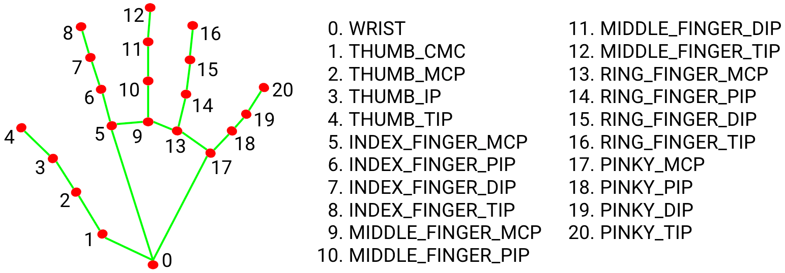
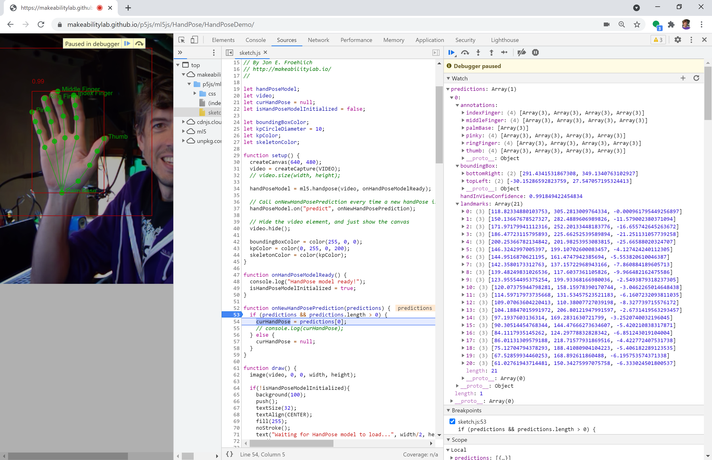
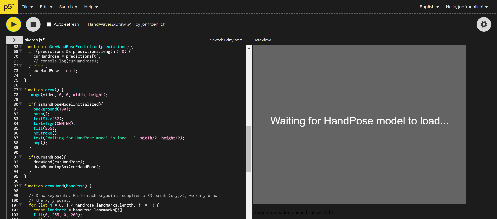
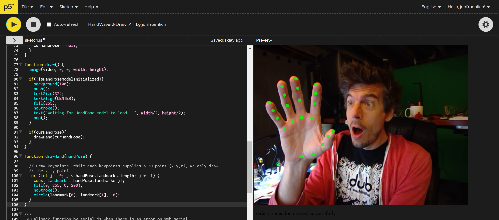
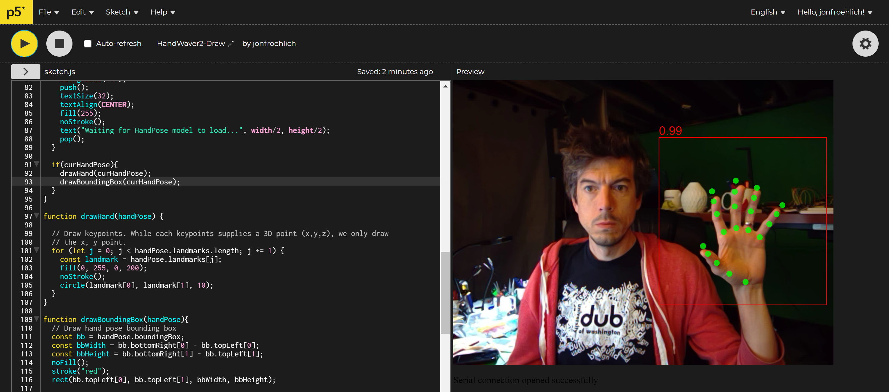
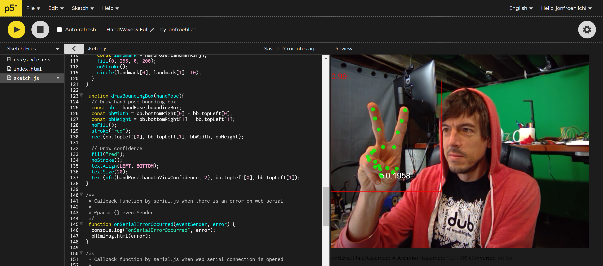
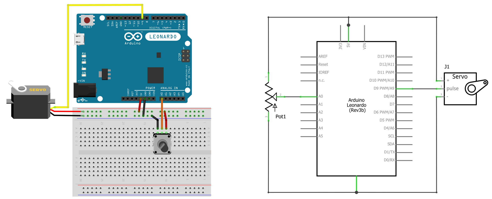
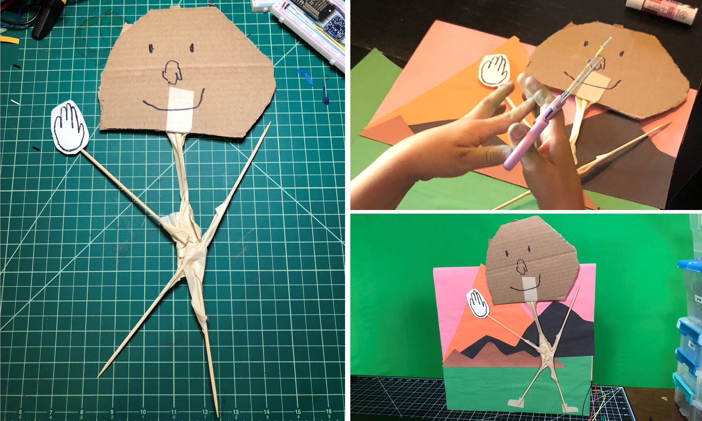
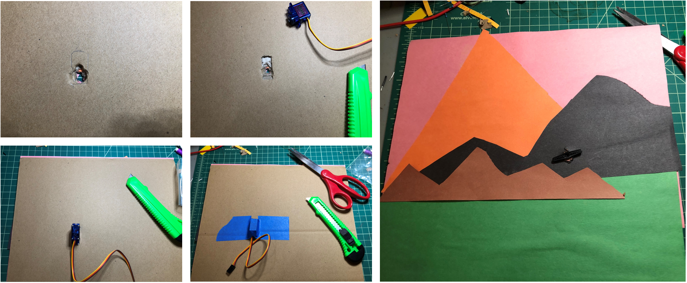

# {{ page.title | replace_first:'L','Lesson '}}
{: .no_toc }

## Table of Contents
{: .no_toc .text-delta }

1. TOC
{:toc}
---

In our [previous lesson](ml5js-serial.md), we introduced combining Arduino with machine learning (ML) libraries like [ml5.js](https://ml5js.org/), a web-based ML library built on [Google TensorFlow](https://www.tensorflow.org/js). Specifically, we built a [p5.js app](https://makeabilitylab.github.io/p5js/WebSerial/ml5js/NoseTracker/) that fed a real-time webcam stream into [ml5's BodyPose](https://docs.ml5js.org/#/reference/bodypose) model to identify and classify human body parts (keypoints) and sent identified keypoints to our Arduino to create new interactive experiences.

In this lesson, we will introduce a new ml5 model called [HandPose](https://docs.ml5js.org/#/reference/handpose), which precisely tracks 21 hand keypoints (the wrist plus 20 finger joints) in 3 dimensions, and use it to control a servo motor. This lesson should further advance your understanding of using [ml5](https://ml5js.org/), how to modularize and build an ml5+Arduino app step-by-step, and hopefully also inspire you to think about how we can combine real-time ML with Arduino! 🖐️

{: .note }
> **In this lesson, you will learn:**
> - How ml5's HandPose model detects and tracks 21 hand keypoints in real time
> - How to use the ml5.js v1.x HandPose API (`detectStart()`, keypoint data structure)
> - How to extract hand position data and transmit it over Web Serial to Arduino
> - How to build a servo motor circuit controlled by hand tracking
> - How to create a fun physical "hand waver" construction
> - Important model limitations and ethical considerations around ML hand tracking

{: .warning }
> **Library version note:** ml5.js underwent a major rewrite from v0.x to v1.x (released August 2024). The old `ml5.handpose()` API used `.on('predict', callback)` and returned a different data structure with `landmarks` arrays and `handInViewConfidence`. The new v1.x API uses **`ml5.handPose()`** with `detectStart()` and returns `keypoints` objects with named properties. If you find older tutorials online that use `ml5.handpose()` (lowercase 'p'), those use the deprecated v0.x API. This lesson uses **ml5.js v1.x** with the new HandPose API. See the [ml5.js v1.0 release blog post](https://ml5js.org/blog/releasing-version-1/) for details.

<!-- which was ported from [Google's TensorFlow Handpose model](https://github.com/tensorflow/tfjs-models/tree/master/handpose), -->

<video autoplay loop muted playsinline aria-label="Video demonstrating ml5 HandPose tracking hand keypoints in real time, controlling a servo motor">
  <source src="assets/videos/HandPose_Optimized_1200w.mp4" type="video/mp4" />
</video>
**Video.** A quick demonstration of ml5's HandPose as implemented in our example app called [HandWaveDetector](https://makeabilitylab.github.io/p5js/ml5js/HandPose/HandWaveDetector) ([code](https://github.com/makeabilitylab/p5js/tree/master/ml5js/HandPose/HandWaveDetector)). *Note: this video was created with ml5 v0.x; the v1.x HandPose API produces the same visual result.*
{: .fs-1 }

## HandPose

In March 2020, the [Google TensorFlow.js team](https://blog.tensorflow.org/2020/03/face-and-hand-tracking-in-browser-with-mediapipe-and-tensorflowjs.html) released two incredible packages for web-based face and hand tracking, entitled [FaceMesh](https://github.com/tensorflow/tfjs-models/tree/master/face-landmarks-detection) and [HandPose](https://github.com/tensorflow/tfjs-models/tree/master/handpose), respectively. Soon thereafter, a user made a [new feature request](https://github.com/ml5js/ml5-library/issues/823) to support these new packages with ml5. By November 2020, it was implemented into ml5 by [Bomani Oseni McClendon](https://github.com/bomanimc) as part of the [ml5.js Fellows Program](https://medium.com/processing-foundation/announcing-our-2020-ml5-js-fellows-45f8f6ff378d). With the ml5 v1.0 release in August 2024, HandPose was updated to support multi-hand tracking with named keypoints and improved accuracy.

<video autoplay loop muted playsinline aria-label="Video demonstrating TensorFlow.js FaceMesh and HandPose models tracking a face and hand simultaneously in a web browser">
  <source src="assets/videos/HandPoseFaceMesh_Optimized.mp4" type="video/mp4" />
</video>
**Video.** A demonstration of TensorFlow.js' [FaceMesh](https://github.com/tensorflow/tfjs-models/tree/master/face-landmarks-detection) and [HandPose](https://github.com/tensorflow/tfjs-models/tree/master/handpose), both of which are available in ml5 as [FaceMesh](https://docs.ml5js.org/#/reference/facemesh) and [HandPose](https://docs.ml5js.org/#/reference/handpose). Video from the [TensorFlow.js blog](https://blog.tensorflow.org/2020/03/face-and-hand-tracking-in-browser-with-mediapipe-and-tensorflowjs.html).
{: .fs-1 }

In this lesson, we will focus on [HandPose](https://docs.ml5js.org/#/reference/handpose) rather than [FaceMesh](https://docs.ml5js.org/#/reference/facemesh) (though both are available in ml5). You are welcome to use either the [TensorFlow.js implementation](https://github.com/tensorflow/tfjs-models/tree/master/handpose), [Google's MediaPipe version](https://developers.google.com/mediapipe/solutions/vision/hand_landmarker), or [ml5's version](https://docs.ml5js.org/#/reference/handpose). All three implementations use the same underlying pre-trained ML model. For this lesson, we will use [ml5's HandPose](https://docs.ml5js.org/#/reference/handpose). Here are some example demos across the three implementations, which run in your web browser:

- [Google MediaPipe's Hand Tracking Demo](https://codepen.io/mediapipe/pen/RwGWYJw)
- [Google MediaPipe's Demo App: Hand Defrosting](https://codepen.io/mediapipe/pen/bGweWyR)
- [Google TensorFlow's HandPose Demo](https://storage.googleapis.com/tfjs-models/demos/handtrack/index.html)
- [Daniel Shiffman's Hand Pose Detection with ml5.js](https://thecodingtrain.com/tracks/ml5js-beginners-guide/ml5/hand-pose/) (Coding Train)

### HandPose model

In 2019, research scientists Margaret Mitchell, Timnit Gebru, and colleagues published a paper entitled [*Model Cards for Model Reporting*](https://arxiv.org/pdf/1810.03993.pdf), which called for ML-based APIs to provide transparent information about *how* the underlying ML model in the API was trained and expected usage contexts. The paper begins with important motivation that emphasizes how ML is beginning to permeate every aspect of life with serious ramifications:

> Trained machine learning models are increasingly used to perform high-impact tasks in areas such as law enforcement, medicine, education, and employment. In order to clarify the intended use cases of machine learning models and minimize their usage in contexts for which they are not well suited, we recommend that released models be accompanied by documentation detailing their performance characteristics.
{: .fs-4 }

They then propose a framework called "model cards" to standardize how ML models are reported by companies:

> In this paper, we propose a framework that we call **model cards**, to encourage such transparent model reporting. Model cards are short documents accompanying trained machine learning models that provide benchmarked evaluation in a variety of conditions, such as across different cultural, demographic, or phenotypic groups (*e.g.,* race, geographic location, sex, Fitzpatrick skin type [[15](https://pubmed.ncbi.nlm.nih.gov/3377516/)]) and intersectional groups (*e.g.,* age and race, or sex and Fitzpatrick skin type) that are relevant to the intended application domains. Model cards also disclose the context in which models are intended to be used, details of the performance evaluation procedures, and other relevant information.
{: .fs-4 }

This paper and the respective research scientists who authored it have made a significant impact on the ML community. As a testament, many of the Google ML APIs and models now provide "model cards". Here's the model card for [HandPose](https://drive.google.com/file/d/1sv4sSb9BSNVZhLzxXJ0jBv9DqD-4jnAz/view) ([local copy](../assets/datasheets/GoogleTensorFlow_ModelCard_HandPose.pdf))—notably, I could not find one for the original [PoseNet](https://github.com/tensorflow/tfjs-models/tree/master/posenet) model.

We summarize a few important HandPose model notes below.

#### Model specifications

HandPose consists of two lightweight models, a palm detector and a hand landmark model, to detect and classify keypoints on the hand. The model inputs an image or video frame, resizes that input to 256x256 for recognition, and outputs:
- a palm bounding box,
- 21 3-dimensional hand landmarks (keypoints), and
- an overall confidence score for the hand detection

The 21 keypoints include four each for the `thumb`, `index_finger`, `middle_finger`, `ring_finger`, and `pinky` plus one for the `wrist`:

**Figure.** The HandPose keypoints from the [MediaPipe team](https://developers.google.com/mediapipe/solutions/vision/hand_landmarker).
{: .fs-1 }

In ml5.js v1.x, each keypoint is an object with `x`, `y`, `z` coordinates and a `name` property. The keypoint names are:


// The 21 HandPose keypoint names in ml5 v1.x
// Index 0: "wrist"
// Thumb:  "thumb_cmc", "thumb_mcp", "thumb_ip", "thumb_tip"
// Index:  "index_finger_mcp", "index_finger_pip", "index_finger_dip", "index_finger_tip"
// Middle: "middle_finger_mcp", "middle_finger_pip", "middle_finger_dip", "middle_finger_tip"
// Ring:   "ring_finger_mcp", "ring_finger_pip", "ring_finger_dip", "ring_finger_tip"
// Pinky:  "pinky_finger_mcp", "pinky_finger_pip", "pinky_finger_dip", "pinky_finger_tip"


{: .note }
> **v0.x vs v1.x keypoint naming:** The old ml5 v0.x API used `landmarks` (raw `[x,y,z]` arrays) and `annotations` (grouped by finger name like `thumb`, `indexFinger`). The new v1.x API uses `keypoints` (objects with `{x, y, z, name}`) and provides named shortcuts like `hand.wrist`, `hand.index_finger_tip`, *etc.* The keypoint indices are the same, but accessing them is more intuitive in v1.x.

According to the [TensorFlow team](https://github.com/tensorflow/tfjs-models/tree/master/handpose), HandPose is well-suited for real-time inference across a variety of devices, achieving 40 FPS on a 2018 MacBook Pro, 35 FPS on an iPhone11, and 6 FPS on a Pixel3.

#### Model limitations and ethical considerations

In terms of limitations and ethical considerations, [the HandPose model card](https://drive.google.com/file/d/1sv4sSb9BSNVZhLzxXJ0jBv9DqD-4jnAz/view) specifies that the HandPose models have been trained on a limited dataset and are not appropriate for counting the number of hands in a crowd, detecting hands with gloves or occlusions, or detecting hands that are far from the camera (greater than ~2 meters).

Moreover, the model card makes clear that the HandPose model is not intended for life-critical decisions and that performance will vary across skin tones, gender, age, and environmental conditions (*e.g.,* low light).

Importantly, just as [BodyPose](https://docs.ml5js.org/#/reference/bodypose), which we used in the [previous lesson](ml5js-serial.md), **detects** body pose keypoints but does **not** attempt to **recognize** *who* is in an image, HandPose similarly performs detection but does not attempt recognition (that is, *who* owns the detected hand). In computer vision, there is an important difference between *detection* and *recognition*. All detections occur locally in the user's web browser (and not in the cloud).

<!-- The HandPose model detects hands in an input image or video stream and returns twenty-one 3-dimensional landmarks (keypoints) locating features within each hand. More specifically, the  -->

## ml5 HandPose

The ml5 v1.x HandPose model works similarly to the [TensorFlow.js](https://github.com/tensorflow/tfjs-models/tree/master/handpose) and [MediaPipe](https://developers.google.com/mediapipe/solutions/vision/hand_landmarker) versions. In v1.x, ml5 HandPose now supports **multiple hands** simultaneously (the older v0.x version was limited to one hand).

### The HandPose data structure

In ml5 v1.x, the HandPose model returns an array of detected hand objects. Each hand object includes:
- a `confidence` score (0 to 1) indicating how confident the model is that a hand is present
- a `keypoints` array with 21 keypoint objects, each containing `x`, `y`, `z` coordinates and a `name` string
- a `keypoints3D` array with the same keypoints in 3D world coordinates
- a `handedness` string indicating `"Left"` or `"Right"`
- named shortcuts for each keypoint (*e.g.,* `hand.wrist`, `hand.index_finger_tip`)

The array structure looks like this:


// hands is an array of detected hands (ml5 v1.x supports multiple)
[
  {
    confidence: 0.95,       // Confidence score for this hand detection
    handedness: "Left",     // "Left" or "Right"
    keypoints: [            // Array of 21 keypoint objects
      { x: 350.2, y: 298.5, z: -0.05, name: "wrist" },
      { x: 312.8, y: 315.6, z: -0.02, name: "thumb_cmc" },
      { x: 290.1, y: 298.4, z: -0.01, name: "thumb_mcp" },
      // ... 21 keypoints total
    ],
    keypoints3D: [ ... ],   // Same keypoints in 3D world coordinates
    // Named shortcuts for convenience:
    wrist: { x: 350.2, y: 298.5, z: -0.05, name: "wrist" },
    index_finger_tip: { x: 280.5, y: 150.3, z: 0.02, name: "index_finger_tip" },
    thumb_tip: { x: 260.1, y: 250.8, z: -0.03, name: "thumb_tip" },
    // ... shortcuts for all 21 keypoints
  }
]


{: .note }
> **v0.x vs v1.x data structure:** If you're looking at older tutorials, note that the old HandPose API returned `predictions[0].landmarks[j]` as raw `[x, y, z]` arrays and used `handInViewConfidence`. The new v1.x API returns `hands[0].keypoints[j]` as objects with `{x, y, z, name}` and uses `confidence`. The named shortcuts (*e.g.,* `hand.wrist`) are new in v1.x.

To make this more concrete, here's a screenshot from Chrome's dev tools showing the hand data structure. In the screenshot, I've expanded the array to show the high-level structure of `confidence`, `handedness`, `keypoints`, and the named shortcuts.

**Figure.** This figure shows a screenshot of the HandPose data structure as shown in Chrome's dev tools. Right-click and select "Open Image in New Tab" to enlarge. *Note: this screenshot shows the v0.x data structure with `handInViewConfidence`, `boundingBox`, `landmarks`, and `annotations`. In v1.x, the structure uses `confidence`, `handedness`, `keypoints` (with named objects), and named shortcuts.* The app running here is our [HandPoseDemo](https://makeabilitylab.github.io/p5js/ml5js/HandPose/HandPoseDemo/). To explore interactively: open a HandPose sketch, open dev tools (`Ctrl+Shift+I` on Windows, `Cmd+Option+I` on Mac), click on the `Sources` tab, set a breakpoint in `draw()`, and add the `hands` variable to the `Watch` list. Exploring data structures like this can help advance understanding—and is a great strategy for web dev.
{: .fs-1 }

### Example p5.js + ml5.js HandPose demo

To demonstrate the ml5.js HandPose API and how to step through the data structure, we created a simple application called [HandPoseDemo](https://makeabilitylab.github.io/p5js/ml5js/HandPose/HandPoseDemo/) that renders:

- the 21 keypoints for the `wrist`, `thumb`, `index_finger`, `middle_finger`, `ring_finger`, and `pinky` with text labels
- a bounding box around the detected hand with the confidence score
- the `handedness` label ("Left" or "Right")

This data structure is similar but not identical to [BodyPose](ml5js-serial.md#recognizing-human-poses-with-bodypose)—one key difference is that HandPose includes 3D coordinates (`z` values) and provides `handedness` information. Here's a quick video demo.

<video autoplay loop muted playsinline aria-label="Video demonstrating the HandPoseDemo app with green keypoint circles, bounding box, and confidence score overlaid on a tracked hand">
  <source src="assets/videos/HandPoseDemo-GrayBackdrop_TrimmedAndOptimized.mp4" type="video/mp4" />
</video>
**Video.** The [HandPoseDemo](https://makeabilitylab.github.io/p5js/ml5js/HandPose/HandPoseDemo/) ([code](https://github.com/makeabilitylab/p5js/tree/master/ml5js/HandPose/HandPoseDemo) on GitHub). You can also view, edit, and play with the code in the [p5.js web editor](https://editor.p5js.org/jonfroehlich/sketches/Nn4pXTpbu). *Note: this video was created with ml5 v0.x; the v1.x HandPose API produces the same visual result with improved accuracy.*
{: .fs-1 }

We put the HandPoseDemo up on the p5.js web editor ([link](https://editor.p5js.org/jonfroehlich/sketches/Nn4pXTpbu)). We encourage you to view the code, edit it, and play. The demo is also available on GitHub ([live page](https://makeabilitylab.github.io/p5js/ml5js/HandPose/HandPoseDemo), [code](https://github.com/makeabilitylab/p5js/tree/master/ml5js/HandPose/HandPoseDemo)).

<!-- TODO: update HandPoseDemo p5.js editor and GitHub links to use ml5 v1.x HandPose API -->

## Building an ml5 HandPose + Arduino app: HandWaver

To help highlight the potential of real-time ML plus Arduino, we will build a simple "robotic" hand waver. We will use ml5's HandPose API to sense the user's hand, which will then control a servo motor embedded on a cardboard-crafted figure. See sneak preview below.

<video autoplay loop muted playsinline aria-label="Video showing a cardboard figure named Henry the Tape Man waving his arm, controlled by hand tracking via ml5 HandPose and a servo motor">
  <source src="assets/videos/HenryBodySerial_HenryStanding_TrimmedAndOptimized.mp4" type="video/mp4" />
</video>
**Video.** A quick demo of "Henry, the Tape Man", which was designed and built by a kindergartner, a preschooler, and me. The JavaScript-based frontend is built with the p5+ml5 app called [HandWaver](https://github.com/makeabilitylab/p5js/tree/master/WebSerial/ml5js/HandWaver) and the Arduino sketch [ServoSerialIn.ino](https://github.com/makeabilitylab/arduino/blob/master/Serial/ServoSerialIn/ServoSerialIn.ino). (The actual Arduino sketch running here is a slightly modified version called [ServoPotWithSerialInOLED.ino](https://github.com/makeabilitylab/arduino/blob/master/Serial/ServoPotWithSerialInOLED/ServoPotWithSerialInOLED.ino).) *Note: this video was created with ml5 v0.x; the v1.x HandPose API produces the same behavior.*
{: .fs-1 }

### Building the web app side

We'll begin by building the web app in [p5.js](https://p5js.org/) and [ml5](https://ml5js.org/). As usual, we'll start with the [web serial template](https://github.com/makeabilitylab/p5js/tree/master/WebSerial/p5js/SerialTemplate), as we'll communicate between ml5 and Arduino using web serial:

- If you're using VSCode, copy [`SerialTemplate`](https://github.com/makeabilitylab/p5js/tree/master/WebSerial/p5js/SerialTemplate) and rename the folder to `HandWaver`.
- If you're using the p5.js online editor, simply open [Serial Template](https://editor.p5js.org/jonfroehlich/sketches/vPfUvLze_C) and rename your project to `HandWaver`.

#### Add in ml5.js

First, add the ml5.js library to your `index.html`, just like we did in the [previous lesson](ml5js-serial.md#add-in-ml5js):


<head>
  
  
  
  <link rel="stylesheet" type="text/css" href="css/style.css">
  <meta charset="utf-8">
</head>


{: .note }
> We're pinning to **ml5.js v1.3.1** to ensure the API doesn't change unexpectedly. Always pin your library versions in course projects!

#### Initialize ml5's HandPose

The ml5 library aims to create consistency across its APIs. Thus, the ml5 HandPose API should feel familiar if you followed our previous [BodyPose lesson](ml5js-serial.md). Just like with BodyPose, we initialize the model in `preload()` and start continuous detection with `detectStart()` in `setup()`:


let handPose;                   // the ml5 HandPose model
let video;                      // the webcam video stream
let hands = [];                 // array of detected hands

function preload() {
  // Load the HandPose model before setup() runs
  handPose = ml5.handPose();
}

function setup() {
  createCanvas(640, 480);
  video = createCapture(VIDEO);
  video.hide(); // hide raw video element (we'll draw it to the canvas)

  // Start continuous hand detection on the video stream
  handPose.detectStart(video, onHandsDetected);
}

function onHandsDetected(results) {
  hands = results;
}


{: .note }
> **`detectStart()` vs the old `.on('predict')` pattern:** In ml5 v0.x, you subscribed to hand pose events with `handPoseModel.on('predict', callback)`. In v1.x, you call `handPose.detectStart(video, callback)`, which internally manages the detection loop. This is simpler, more consistent with other ml5 models, and prevents accidental recursive loop issues.

Again, this should feel familiar! It's quite similar to our [BodyPose lesson](ml5js-serial.md#initialize-the-webcam-and-bodypose-model).

#### Add in drawing code

Now, the fun part! Let's add drawing code to render three things:
- the **21 HandPose keypoints** as circles (in a new function called `drawHand()`),
- a **bounding box** with overall hand confidence score (in a function called `drawBoundingBox()`), and
- some **convenience text** to tell the user about model initialization ("Waiting for model to load...").

First, let's update the `draw()` function to show the webcam video and draw detected hands:


function draw() {
  image(video, 0, 0, width, height);

  if (hands.length === 0) {
    // Show helpful text when no hand is detected
    push();
    textSize(32);
    textAlign(CENTER);
    fill(255);
    noStroke();
    text("Show your hand to the camera!", width / 2, height / 2);
    pop();
  }

  for (let hand of hands) {
    drawHand(hand);
    drawBoundingBox(hand);
  }
}


It should look something like this before a hand is detected:

**Figure.** Showing what the "waiting" text looks like in the [p5.js editor](https://editor.p5js.org/jonfroehlich/sketches/YVRlHlR0I). *Note: this screenshot is from the v0.x version; the v1.x version displays the webcam feed immediately since the model loads in `preload()`.*
{: .fs-1 }

Now, let's add the `drawHand(hand)` function. We will iterate through all 21 keypoints and draw a green circle at their x,y position. In v1.x, each keypoint is an object with `.x` and `.y` properties:


function drawHand(hand) {
  // Draw keypoints. Each keypoint has x, y, z and name properties.
  for (let keypoint of hand.keypoints) {
    fill(0, 255, 0, 200); // green with some opacity
    noStroke();
    circle(keypoint.x, keypoint.y, 10);
  }
}


Your hand should now have green circles drawn on the keypoints like this:

**Figure.** Drawing the keypoints on the hand. Screenshot from the [p5.js editor](https://editor.p5js.org/jonfroehlich/sketches/YVRlHlR0I). *Note: this screenshot is from the v0.x version; the visual result is the same in v1.x.*
{: .fs-1 }

Lastly, let's add a `drawBoundingBox(hand)` function. In v1.x, there is no built-in bounding box property, so we calculate one from the keypoints. We'll also display the `confidence` score:


function drawBoundingBox(hand) {
  // Calculate bounding box from keypoints
  let minX = Infinity, minY = Infinity;
  let maxX = -Infinity, maxY = -Infinity;

  for (let keypoint of hand.keypoints) {
    minX = Math.min(minX, keypoint.x);
    minY = Math.min(minY, keypoint.y);
    maxX = Math.max(maxX, keypoint.x);
    maxY = Math.max(maxY, keypoint.y);
  }

  // Draw bounding box
  noFill();
  stroke("red");
  rect(minX, minY, maxX - minX, maxY - minY);

  // Draw confidence score
  fill("red");
  noStroke();
  textAlign(LEFT, BOTTOM);
  textSize(20);
  text(nfc(hand.confidence, 2), minX, minY);
}


Here's a screenshot with the keypoints, bounding box, and confidence:

**Figure.** Drawing the keypoints, the bounding box, and the hand confidence score. Screenshot from the [p5.js editor](https://editor.p5js.org/jonfroehlich/sketches/YVRlHlR0I). *Note: this screenshot is from the v0.x version, which had a built-in `boundingBox` property. In v1.x, we compute the bounding box from keypoints as shown above.*
{: .fs-1 }

You can view, edit, and play with [this code](https://editor.p5js.org/jonfroehlich/sketches/YVRlHlR0I) in the p5.js online editor.

<!-- TODO: update p5.js editor link to use ml5 v1.x HandPose API -->

#### Add in web serial code

For the final step, we'll add code to transmit the `wrist` keypoint's normalized x position [0, 1] via web serial. To avoid saturating web serial with data, we will also limit our transmission rate to ~20Hz (one transmission every 50ms). Lastly, let's also add drawing code to show `wrist` information on screen (useful for debugging!).

First, add some global variables:

let wristXNormalized = 0;
let timestampLastTransmit = 0;
const MIN_TIME_BETWEEN_TRANSMISSIONS_MS = 50; // 50 ms is ~20 Hz


Then update the `onHandsDetected` callback to calculate and transmit `wristXNormalized`:


function onHandsDetected(results) {
  hands = results;

  if (hands.length > 0) {
    const hand = hands[0];

    // Grab the wrist x-position and normalize it to [0, 1]
    // In v1.x, we can use the named shortcut hand.wrist
    // or access hand.keypoints[0] (index 0 is the wrist)
    if (hand.wrist) {
      wristXNormalized = hand.wrist.x / width;

      if (serial.isOpen()) {
        const outputData = nf(wristXNormalized, 1, 4);
        const timeSinceLastTransmitMs = millis() - timestampLastTransmit;
        if (timeSinceLastTransmitMs > MIN_TIME_BETWEEN_TRANSMISSIONS_MS) {
          serial.writeLine(outputData);
          timestampLastTransmit = millis();
        } else {
          console.log("Did not send '" + outputData + "' because time since last transmit was "
                      + timeSinceLastTransmitMs + "ms");
        }
      }
    }
  }
}


{: .note }
> **`wrist` vs `palmBase`:** In the old v0.x API, the base of the palm was accessed as `landmarks[0]` or `annotations.palmBase`. In v1.x, the same keypoint is called `wrist` and can be accessed as `hand.wrist` or `hand.keypoints[0]`. The position data is the same—only the naming changed.

Finally, update the `draw()` function to draw wrist info on screen:


function draw() {
  ...
  if (hands.length > 0) {
    ...
    // Draw wrist info for the first detected hand
    const hand = hands[0];
    if (hand.wrist) {
      const kpSize = 15;
      noFill();
      stroke(255);
      circle(hand.wrist.x, hand.wrist.y, kpSize); // circle around wrist keypoint
      noStroke();
      fill(255);
      text(nf(wristXNormalized, 1, 4), hand.wrist.x + kpSize, hand.wrist.y + textSize() / 2);
    }
  }
}


And that's it! Because our [`SerialTemplate`](https://github.com/makeabilitylab/p5js/tree/master/WebSerial/p5js/SerialTemplate) already supports connecting to a serial device by clicking on the canvas (by default) and/or auto-connecting to previously approved web serial devices, we are all set. Feel free to add your own connection code (*e.g.,* a specific "Connect Button" for web serial). The full code is [here](https://editor.p5js.org/jonfroehlich/sketches/vMbPOkdzu).

<!-- TODO: update HandWaver p5.js editor and GitHub links to use ml5 v1.x HandPose API -->

**Figure.** A screenshot of HandWaver running in the [p5.js online editor](https://editor.p5js.org/jonfroehlich/sketches/vMbPOkdzu). The code is also on GitHub ([live page](https://makeabilitylab.github.io/p5js/WebSerial/ml5js/HandWaver/), [code](https://github.com/makeabilitylab/p5js/tree/master/WebSerial/ml5js/HandWaver)). *Note: this screenshot was taken with ml5 v0.x; the v1.x version looks and works the same.*
{: .fs-1 }

Now on to the Arduino side!

### Building the Arduino side

We're going to build up the Arduino side step-by-step. There are five main steps:

- Create an initial servo motor circuit and Arduino test program
- Create a simple p5.js + servo test app with web serial
- Create an interesting lo-fi form for our embedded servo motor
- Test the form and our servo motor circuit
- Create the end-to-end HandPose + Arduino system

**The Arduino code is identical regardless of which ml5 version the p5.js app uses**—it just receives normalized values over serial. So if your Arduino code already works with the v0.x HandWaver, it will work with v1.x too!

#### Initial servo motor circuit and Arduino test program

As a quick introduction to servo motors, please read this [Adafruit lesson](https://learn.adafruit.com/adafruit-arduino-lesson-14-servo-motors) by Simon Monk. Building on that lesson, we'll create a basic circuit that allows a user to control the servo motor position with a potentiometer. More specifically, we'll read in the potentiometer value on Pin `A0` using [`analogRead()`](https://www.arduino.cc/reference/en/language/functions/analog-io/analogread/), convert it to an angle between 0 - 180, and then write out the angle to the servo motor.

**Figure.** Basic servo motor circuit with servo pulse pin hooked to Arduino's Pin 9 and the potentiometer hooked to Pin `A0`. Diagram made in Fritzing and PowerPoint.
{: .fs-1 }

The code, in full, is:


#include <Servo.h> 

const int POTENTIOMETER_INPUT_PIN = A0;  
const int SERVO_OUTPUT_PIN = 9;
const int MAX_ANALOG_VAL = 1023;
Servo _servo; 
 
void setup() 
{ 
  _servo.attach(SERVO_OUTPUT_PIN);  
} 
 
void loop() 
{ 
  // Read pot value
  int potVal = analogRead(POTENTIOMETER_INPUT_PIN); 

  // Servo motor can move between 0 - 180 degrees
  int servoAngle = map(potVal, 0, MAX_ANALOG_VAL, 0, 180);

  // Set servo angle
  _servo.write(servoAngle);  
}


**Code.** This code is in our GitHub as [ServoPot.ino](https://github.com/makeabilitylab/arduino/blob/master/Basics/servo/ServoPot/ServoPot.ino).
{: .fs-1 }

Here's a video demonstration showing a slightly modified Arduino circuit and sketch (called [ServoPotOLED.ino](https://github.com/makeabilitylab/arduino/blob/master/Basics/servo/ServoPotOLED/ServoPotOLED.ino)). The only difference is that the OLED version outputs the current servo angle on the OLED display.

<video autoplay loop muted playsinline aria-label="Video demonstrating a servo motor controlled by a potentiometer, with the current angle shown on an OLED display">
  <source src="assets/videos/ServoMotorWithStick_TrimmedAndOptimized.mp4" type="video/mp4" />
</video>
**Video.** A demonstration of the servo circuit with potentiometer. The video is showing [ServoPotOLED.ino](https://github.com/makeabilitylab/arduino/blob/master/Basics/servo/ServoPotOLED/ServoPotOLED.ino), which is functionally equivalent to the code above ([ServoPot.ino](https://github.com/makeabilitylab/arduino/blob/master/Basics/servo/ServoPot/ServoPot.ino)) but includes OLED support. Here, the OLED displays the current servo angle.
{: .fs-1 }

#### Update code to accept serial input

Let's update our code to set the servo motor angle based on **serial input** rather than the potentiometer. We're going to write slightly more flexible parsing code than usual. In this case, we'll accept either line-delimited strings of integer values ranging from 0 - 180, inclusive, or float values ranging from 0-1, inclusive. We'll determine whether the serial transmitter sent an integer *vs.* a float by looking for a decimal point in the string.

The full code:


#include <Servo.h> 

const int SERVO_OUTPUT_PIN = 9;
const int MAX_ANALOG_VAL = 1023;
const int MIN_SERVO_ANGLE = 0;
const int MAX_SERVO_ANGLE = 180;

Servo _servo; 
int _serialServoAngle = -1;
 
void setup() 
{ 
  Serial.begin(115200);
  _servo.attach(SERVO_OUTPUT_PIN);  
} 
 
void loop() 
{ 
  // Check if serial data exists, if so read it in
  if(Serial.available() > 0){
    // Read data off the serial port until we get to the endline delimiter ('\n')
    // Store all of this data into a string
    String rcvdSerialData = Serial.readStringUntil('\n'); 

    // We accept either integers between 0 and 180 or floats. Floats must have a period to be recognized
    int indexOfDecimal = rcvdSerialData.indexOf('.');
    if(indexOfDecimal != -1){
      float serialServoAngleF = rcvdSerialData.toFloat();
      _serialServoAngle = MIN_SERVO_ANGLE + (int)(serialServoAngleF * (MAX_SERVO_ANGLE - MIN_SERVO_ANGLE));
    }else{
      _serialServoAngle = rcvdSerialData.toInt();
    }

    _serialServoAngle = constrain(_serialServoAngle, MIN_SERVO_ANGLE, MAX_SERVO_ANGLE);

    // Echo back data
    Serial.print("# Arduino Received: '");
    Serial.print(rcvdSerialData);
    Serial.print("' Converted to: ");
    Serial.println(_serialServoAngle);

    // Set new servo angle
    _servo.write(_serialServoAngle);
  }
} 


**Code.** The full code is here [ServoSerialIn.ino](https://github.com/makeabilitylab/arduino/blob/master/Serial/ServoSerialIn/ServoSerialIn.ino).
{: .fs-1 }

<video autoplay loop muted playsinline aria-label="Video demonstrating controlling a servo motor from serial input typed into Serial Monitor, with the angle shown on an OLED display">
  <source src="assets/videos/ServoSerialInOLED-Pot-TrimmedAndOptimized.mp4" type="video/mp4" />
</video>
**Video.** A demonstration of controlling the servo motor from serial input. This video is using a slightly modified sketch with OLED support called [ServoSerialInOLED.ino](https://github.com/makeabilitylab/arduino/blob/master/Serial/ServoSerialInOLED/ServoSerialInOLED.ino) but is functionally equivalent to [ServoSerialIn.ino](https://github.com/makeabilitylab/arduino/blob/master/Serial/ServoSerialIn/ServoSerialIn.ino).
{: .fs-1 }

We also made a slightly more sophisticated version that allows the user to choose between whether to use the potentiometer or serial input to control the servo motor: [ServoPotWithSerialIn.ino](https://github.com/makeabilitylab/arduino/blob/master/Serial/ServoPotWithSerialIn/ServoPotWithSerialIn.ino) and [ServoPotWithSerialInOLED.ino](https://github.com/makeabilitylab/arduino/blob/master/Serial/ServoPotWithSerialInOLED/ServoPotWithSerialInOLED.ino). You can toggle between potentiometer *vs.* serial input using the button.

<video autoplay loop muted playsinline aria-label="Video demonstrating toggling between potentiometer and serial input control for a servo motor using a button">
  <source src="assets/videos/ServoPotWithSerialInOLED-SerialMonitor_TrimmedAndOptimized.mp4" type="video/mp4" />
</video>
**Video.** A demonstration of [ServoPotWithSerialInOLED.ino](https://github.com/makeabilitylab/arduino/blob/master/Serial/ServoPotWithSerialInOLED/ServoPotWithSerialInOLED.ino). You can use the button to change between two input modes to control the servo motor: the potentiometer and serial input. In the video, note how we press the button to switch between potentiometer-based control and serial control. For the latter, we send new values using Serial Monitor. We also created a non-OLED version of the code called [ServoPotWithSerialIn.ino](https://github.com/makeabilitylab/arduino/blob/master/Serial/ServoPotWithSerialIn/ServoPotWithSerialIn.ino).
{: .fs-1 }

#### Now add in basic p5.js test app

To more easily test our Arduino sketch with [p5.js](https://p5js.org/), let's build a simple web serial app to control the servo through the web browser. In this case, we'll read the `x` position of the mouse, normalize it to [0, 1], and transmit it over serial. If this works, then the final step will be to integrate our HandWaver app—which should be straightforward.

Start by making a copy of [`SerialTemplate`](https://github.com/makeabilitylab/p5js/tree/master/WebSerial/p5js/SerialTemplate), if you're using VSCode, or [Serial Template](https://editor.p5js.org/jonfroehlich/sketches/vPfUvLze_C), if you're using the p5.js online editor. Rename your project to something like `XMouseSerialOut`—but the name is up to you, of course.

Now, we need to implement three things:
- **Sense and normalize** the `x` mouse position. This is easy—we can always grab the current `x` mouse position using the global `mouseX` variable in p5.js, and the `mouseMoved()` function is called whenever the user's mouse moves
- **Transmit** the normalized `x` position over web serial
- **Draw** x mouse information to canvas (optional but useful)

##### Sense, normalize, and transmit x mouse position

The p5.js function [`mouseMoved()`](https://p5js.org/reference/#/p5/mouseMoved) is called every time the mouse moves (as long as the mouse button is not pressed). Let's put our mouse-related code there.

First, create two global variables for mouse tracking:


let xMouseConstrained = 0;
let xMouseNormalized = 0;


Now, implement the `mouseMoved()` function:


function mouseMoved(){
  xMouseConstrained = constrain(mouseX, 0, width); // get current x mouse pos
  xMouseNormalized = xMouseConstrained / width; // normalize x position
  
  if(serial.isOpen()){
    serial.writeLine(nf(xMouseNormalized, 0, 4)); // write out normalized value, if serial is connected/open
  }
}


##### Add in draw code for x mouse position

Finally, add drawing code to display a gray line for the current x mouse position and large text for the normalized value:


function draw() {
  background(100);
  
  // draw vertical line at x position
  noFill();
  stroke(150);
  line(xMouseConstrained, 0, xMouseConstrained, height);
  
  // draw normalized x value
  textSize(80);
  fill(255);
  noStroke();
  
  textAlign(CENTER, CENTER);
  text(nf(xMouseNormalized, 0, 4), width / 2, height / 2);
}


You can view, edit, and play with the [XMouseSerialOut](https://makeabilitylab.github.io/p5js/WebSerial/p5js/XMouseSerialOut/) app in the [p5.js web editor](https://editor.p5js.org/jonfroehlich/sketches/iwbGN0wkj) or on GitHub ([live page](https://makeabilitylab.github.io/p5js/WebSerial/p5js/XMouseSerialOut/), [code](https://github.com/makeabilitylab/p5js/tree/master/WebSerial/p5js/XMouseSerialOut)).

<video autoplay loop muted playsinline aria-label="Video demonstrating the XMouseSerialOut app, which sends the normalized mouse x position over serial to control a servo motor">
  <source src="assets/videos/XMouseP5jsAppWithServoSerial_TrimmedAndOptimized.mp4" type="video/mp4" />
</video>
**Video.** A demonstration of a small p5.js test app called [XMouseSerialOut](https://makeabilitylab.github.io/p5js/WebSerial/p5js/XMouseSerialOut/) ([code](https://github.com/makeabilitylab/p5js/tree/master/WebSerial/p5js/XMouseSerialOut)), which outputs a normalized mouse `x` position to serial. Code running on Arduino is [ServoPotWithSerialInOLED.ino](https://github.com/makeabilitylab/arduino/blob/master/Serial/ServoPotWithSerialInOLED/ServoPotWithSerialInOLED.ino) but many other programs in our GitHub repo would work like [ServoSerialIn](https://github.com/makeabilitylab/arduino/tree/master/Serial/ServoSerialIn).
{: .fs-1 }

#### Test with HandWaver p5.js app

If the simple p5.js x-position web app works with your Arduino sketch, then the HandWaver app should too. So, return to your HandWaver code—here's our version on the [p5.js web editor](https://editor.p5js.org/jonfroehlich/sketches/vMbPOkdzu) and on GitHub ([live page](https://makeabilitylab.github.io/p5js/WebSerial/ml5js/HandWaver), [code](https://github.com/makeabilitylab/p5js/tree/master/WebSerial/ml5js/HandWaver)). On the Arduino, you can run any of the following previously described serial-based servo code or write your own:

- [ServoSerialIn.ino](https://github.com/makeabilitylab/arduino/blob/master/Serial/ServoSerialIn/ServoSerialIn.ino) or the OLED version called [ServoSerialInOLED.ino](https://github.com/makeabilitylab/arduino/blob/master/Serial/ServoSerialInOLED/ServoSerialInOLED.ino), which take in either an integer value between 0 - 180 or a float value between 0 - 1 and set the servo position accordingly.
- [ServoPotWithSerialIn.ino](https://github.com/makeabilitylab/arduino/blob/master/Serial/ServoPotWithSerialIn/ServoPotWithSerialIn.ino) or the OLED version called [ServoPotWithSerialInOLED.ino](https://github.com/makeabilitylab/arduino/blob/master/Serial/ServoPotWithSerialInOLED/ServoPotWithSerialInOLED.ino), which work similarly to the previous Arduino programs but allow the user to switch between potentiometer control and serial-based control for the servo using button input.

<!-- TODO: update HandWaver p5.js editor and GitHub links to use ml5 v1.x HandPose API -->

<video autoplay loop muted playsinline aria-label="Video demonstrating the HandWaver app controlling a servo motor using hand tracking, with the servo angle shown on an OLED display">
  <source src="assets/videos/ServoPotWithSerialInOLED-HandWaver_TrimmedAndOptimized.mp4" type="video/mp4" />
</video>
**Video.** A demonstration of [HandWaver](https://editor.p5js.org/jonfroehlich/sketches/vMbPOkdzu) with [ServoPotWithSerialInOLED.ino](https://github.com/makeabilitylab/arduino/blob/master/Serial/ServoPotWithSerialInOLED/ServoPotWithSerialInOLED.ino). *Note: this video was created with ml5 v0.x; the v1.x version works the same.*
{: .fs-1 }

#### Create interesting form

Now, another fun, creative part: we need to create an interesting form for the servo motor. Remember, the servo motor will move in response to your hand's x position. So, you could:

- Create a lightsaber-wielding Darth Vader
- Create a Statue of Liberty model moving her torch
- Create a cardboard-crafted LeBron James moving his arm to block Andre Iguodala in the 2016 NBA Finals ([video](https://youtu.be/-zd62MxKXp8)). Now known simply as "[The Block.](https://en.wikipedia.org/wiki/The_Block_(basketball))"
- Create a friendly figure waving back at you
- ... your ideas here! ...

In this case, I worked with a kindergartner and preschooler to create a paper-crafted mountain scene and stick person we call "Henry, the Tape Man."

**Figure.** Creating "Henry, the Tape Man" with construction paper, cardboard, glue, and lots of tape!
{: .fs-1 }

Then, we calculated an appropriate position to insert the servo motor for Henry's arm and cut an inset and hole into the cardboard:

**Figure.** Inserting the servo motor into the cardboard backdrop.
{: .fs-1 }

We attached a temporary "arm" to test our construction with the potentiometer and [HandWaver](https://makeabilitylab.github.io/p5js/WebSerial/ml5js/HandWaver).

<video autoplay loop muted playsinline aria-label="Video testing the servo motor embedded in cardboard with a potentiometer, showing the temporary arm moving">
  <source src="assets/videos/Henry_NoBody_TestingArmWithPot_Optimized.mp4" type="video/mp4" />
</video>
**Video.** Testing the servo motor embedded into the cardboard with the potentiometer—the Arduino is running [ServoPotWithSerialInOLED.ino](https://github.com/makeabilitylab/arduino/blob/master/Serial/ServoPotWithSerialInOLED/ServoPotWithSerialInOLED.ino).
{: .fs-1 }

Now testing with [HandWaver](https://makeabilitylab.github.io/p5js/WebSerial/ml5js/HandWaver):

<video autoplay loop muted playsinline aria-label="Video testing the embedded servo motor with the HandWaver app, showing the arm moving in response to hand tracking">
  <source src="assets/videos/Henry_NoBody_TestingArmWithHandWaver_Optimized.mp4" type="video/mp4" />
</video>
**Video.** Testing the servo motor embedded into the cardboard with the [HandWaver](https://makeabilitylab.github.io/p5js/WebSerial/ml5js/HandWaver) app. The Arduino is running [ServoPotWithSerialInOLED.ino](https://github.com/makeabilitylab/arduino/blob/master/Serial/ServoPotWithSerialInOLED/ServoPotWithSerialInOLED.ino). *Note: this video was created with ml5 v0.x; the v1.x version works the same.*
{: .fs-1 }

From these tests, we determined that a good range of motion for Henry's arm is 40 - 85 degrees, so we updated our Arduino sketch:


const int MIN_SERVO_ANGLE = 40;
const int MAX_SERVO_ANGLE = 85;


<!-- TODO: then we made a stand -->

### Final construction

And here's the final construction running the p5+ml5 app HandWaver—available in the [p5.js web editor](https://editor.p5js.org/jonfroehlich/sketches/vMbPOkdzu) or on GitHub ([live page](https://makeabilitylab.github.io/p5js/WebSerial/ml5js/HandWaver), [code](https://github.com/makeabilitylab/p5js/tree/master/WebSerial/ml5js/HandWaver)). On the Arduino, we are running [ServoPotWithSerialInOLED.ino](https://github.com/makeabilitylab/arduino/blob/master/Serial/ServoPotWithSerialInOLED/ServoPotWithSerialInOLED.ino) but something as simple as [ServoSerialIn.ino](https://github.com/makeabilitylab/arduino/blob/master/Serial/ServoSerialIn/ServoSerialIn.ino) would work (if you don't have an OLED or don't need/want to switch between the potentiometer and serial input to control the servo).

<video autoplay loop muted playsinline aria-label="Video showing the final Henry the Tape Man construction with the servo-powered arm waving in response to hand tracking via the HandWaver app">
  <source src="assets/videos/Henry_FullHandWaver_Optimized.mp4" type="video/mp4" />
</video>
**Video.** A demonstration of [HandWaver](https://editor.p5js.org/jonfroehlich/sketches/vMbPOkdzu) with [ServoPotWithSerialInOLED.ino](https://github.com/makeabilitylab/arduino/blob/master/Serial/ServoPotWithSerialInOLED/ServoPotWithSerialInOLED.ino). *Note: this video was created with ml5 v0.x; the v1.x version produces the same behavior.*
{: .fs-1 }

<!-- TODO: create a HandPoseDemo 3D? -->

<!-- TODO: with two hands, could control two different servo motors and have cardboard darth vader and cardboard luke duel each other -->

## Lesson Summary

In this lesson, you learned how to use ml5's HandPose model—a real-time hand tracking library—with p5.js and Arduino to create an interactive physical computing experience controlled by hand gestures. Here are the key takeaways:

- **HandPose** detects 21 hand keypoints (wrist plus 20 finger joints) in 3 dimensions, right in the browser. In ml5 v1.x, it supports **multiple hands** simultaneously.
- The **ml5 v1.x API** uses `ml5.handPose()` in `preload()` and `handPose.detectStart(video, callback)` for continuous detection—consistent with BodyPose and other ml5 models.
- Each detected hand provides `keypoints` (objects with `{x, y, z, name}`), `confidence`, `handedness`, and **named shortcuts** like `hand.wrist` and `hand.index_finger_tip`.
- We built **HandWaver**, which extracts the wrist keypoint's x position, normalizes it to [0, 1], and transmits it over Web Serial to control a servo motor.
- The **Arduino code is model-agnostic**—it just receives normalized values over serial. You can swap between BodyPose, HandPose, or any other input source without changing the Arduino code.
- **Physical construction matters!** Building a fun, tangible form for your servo motor (like Henry, the Tape Man) makes the project more engaging and helps you think about the relationship between digital input and physical output.
- **ML model limitations** are real. HandPose doesn't work well with gloves, occlusions, or hands far from the camera, and performance varies across skin tones and lighting conditions.

## Exercises

**Exercise 1:** Modify the HandWaver to track a **different keypoint**—such as the `index_finger_tip`—instead of the wrist. How does changing the tracked keypoint affect the servo motor's responsiveness and the interaction experience?

**Exercise 2:** Add **confidence-based filtering** to the HandWaver. Only send data to Arduino when `hand.confidence` is above 0.7. Display the current confidence level on the p5.js canvas. What happens when you lower or raise the threshold?

**Exercise 3:** Use **two keypoints** to control the servo. For example, compute the distance between `thumb_tip` and `index_finger_tip` (a pinch gesture), normalize that distance, and send it to the servo. This creates a pinch-to-move interaction!

**Exercise 4 (Advanced):** Since ml5 v1.x supports **multiple hands**, modify the HandWaver to track *two* hands simultaneously. Send both wrist x-positions to Arduino as a comma-separated string, and use two servo motors—one per hand. Imagine a cardboard puppet show!

**Exercise 5 (Creative):** Design and build your own **physical construction** for the servo motor. It doesn't have to be a waving figure—it could be a nodding animal, a wagging tail, a swinging pendulum, or anything else you can imagine. Document your design process and share it with the class.

## Resources

- [ml5.js HandPose Reference](https://docs.ml5js.org/#/reference/handpose), ml5.js

- [ml5.js v1.0 Release Blog Post](https://ml5js.org/blog/releasing-version-1/), Processing Foundation

- [Hand Pose Detection with ml5.js](https://thecodingtrain.com/tracks/ml5js-beginners-guide/ml5/hand-pose/), The Coding Train (Daniel Shiffman)

- [TensorFlow HandPose](https://github.com/tensorflow/tfjs-models/tree/master/handpose), Google TensorFlow

- [On-Device, Real-Time Hand Tracking with MediaPipe](https://ai.googleblog.com/2019/08/on-device-real-time-hand-tracking-with.html), Valentin Bazarevsky and Fan Zhang, Google AI Blog

- [Face and Hand Tracking in the Browser with MediaPipe and TensorFlow.js](https://blog.tensorflow.org/2020/03/face-and-hand-tracking-in-browser-with-mediapipe-and-tensorflowjs.html), Ann Yuan and Andrey Vakunov, TensorFlow Blog

- [Training a Hand Detector like the OpenPose one in TensorFlow](https://ortegatron.medium.com/training-a-hand-detector-like-the-openpose-one-in-tensorflow-45c5177d6679), Marcelo Ortega on Medium

## Previous Lesson

In the [previous lesson](ml5js-serial.md), we introduced ml5.js and used **BodyPose** to track body keypoints and control an Arduino OLED display. 🧑‍💻

<nav class="lesson-nav" aria-label="Lesson navigation">
  <a href="ml5js-serial.html" class="nav-prev">
    
&larr; Previous Lesson

    
ml5.js Serial

  </a>
</nav>