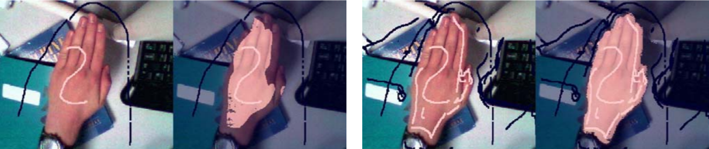
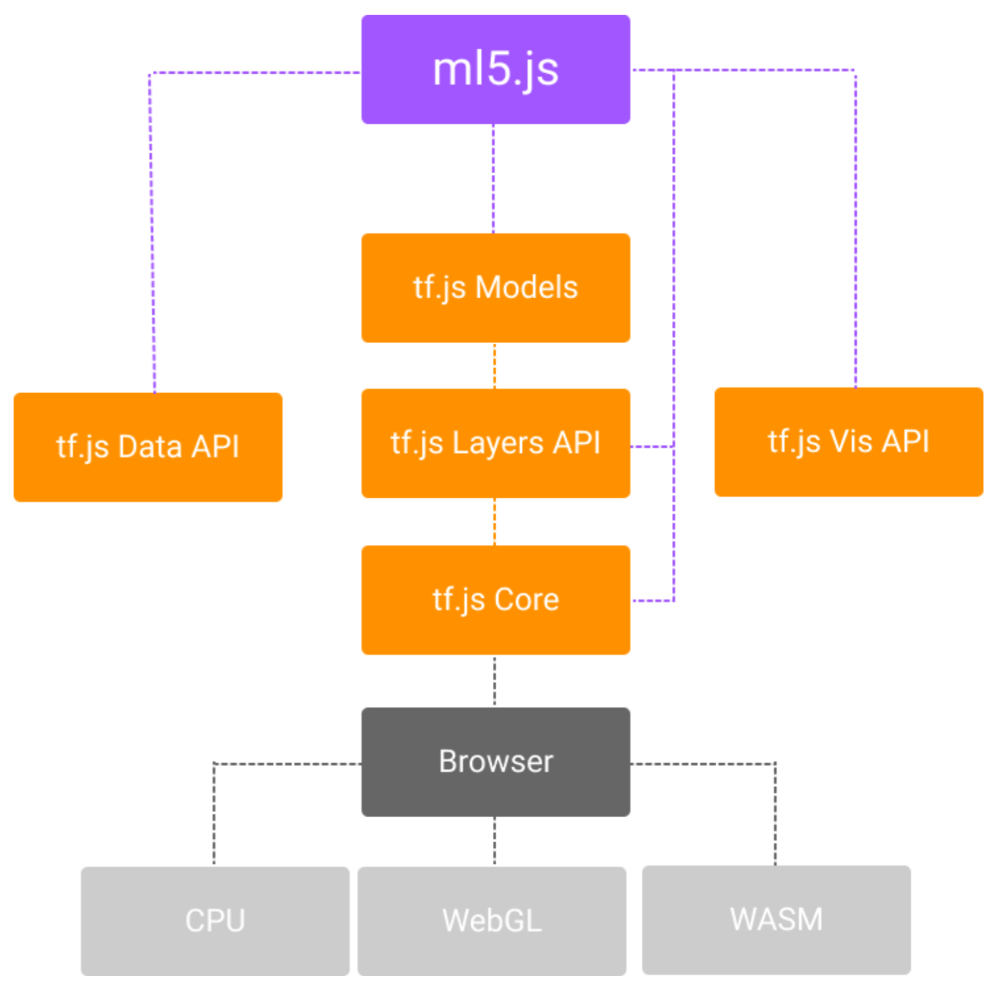
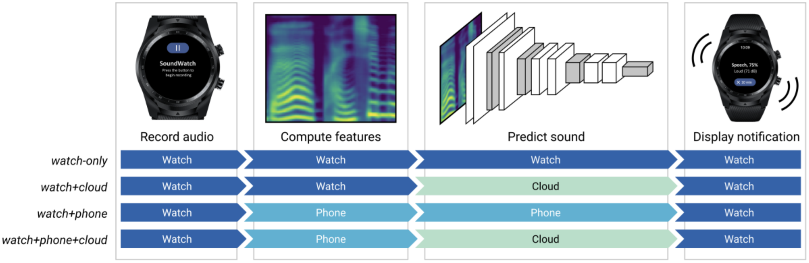
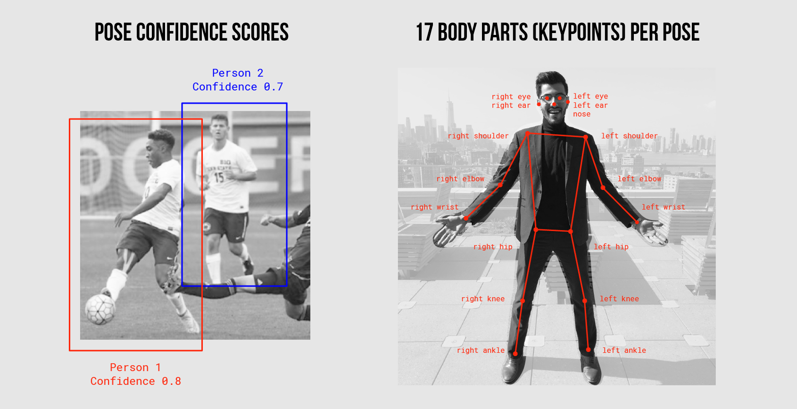
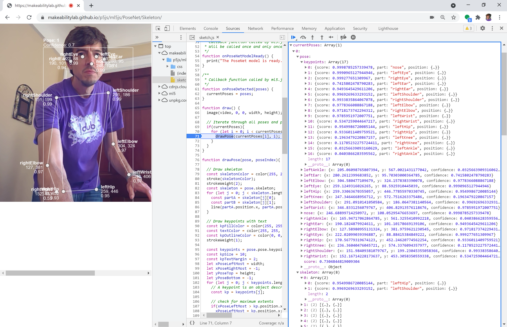
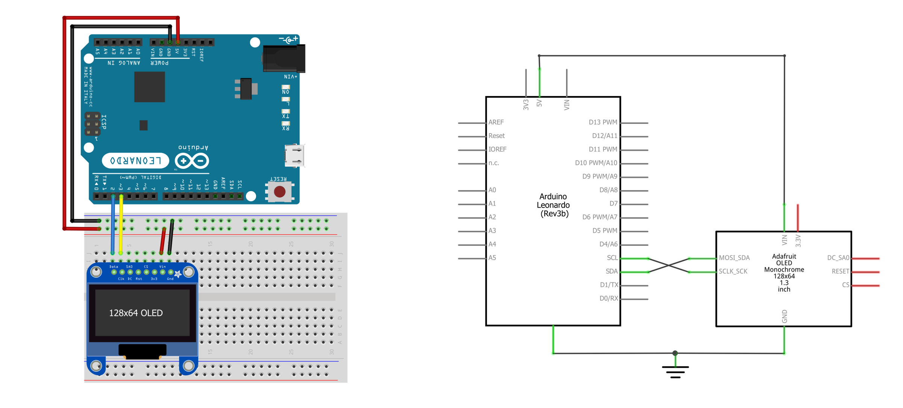
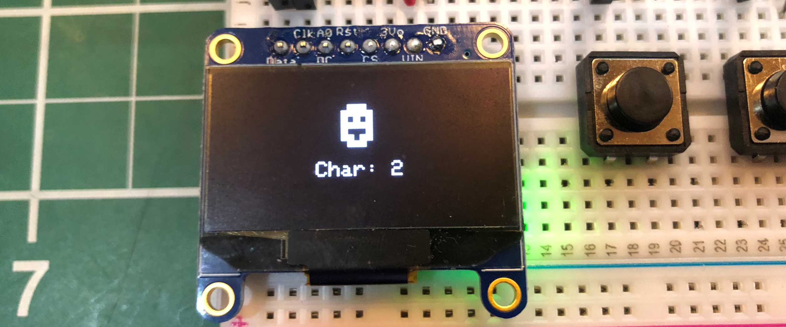

# {{ page.title }}
{: .no_toc }

## Table of Contents
{: .no_toc .text-delta }

1. TOC
{:toc}
---

In this lesson, we will extend our learning on [web serial](web-serial.md) and [p5.js](p5js-serial.md) to incorporate a machine learning (ML) framework called [ml5.js](https://ml5js.org/). While integrating machine learning into our designs may *seem* intimidating, just as p5.js makes it easier to play and experiment with interactive graphics in JavaScript so too does [ml5.js](https://ml5js.org/) make it easier to play and experiment with machine learning. It's really quite amazing!

For example, with only a few lines of JavaScript code and some slight modifications to our [FlappyBird.ino](https://github.com/makeabilitylab/arduino/blob/master/OLED/FlappyBird/FlappyBird.ino) Arduino sketch (updated to [FlappyBirdSerialIn.ino](https://github.com/makeabilitylab/arduino/blob/master/Serial/FlappyBirdSerialIn/FlappyBirdSerialIn.ino)), we can play FlappyBird with our nose using a real-time web camera stream and [ml5's PoseNet library](https://learn.ml5js.org/#/reference/posenet).

<video autoplay loop muted playsinline style="margin:0px">
  <source src="assets/videos/FlappyBirdNoseTracker_Short_1000w.mp4" type="video/mp4" />
</video>
**Video.** Playing Flappy Bird on the Arduino Leonardo by using my nose using p5.js, [ml5.js](https://ml5js.org/), and [web serial](web-serial.md). The p5.js app is called Nose Tracker ([p5.js online editor](https://editor.p5js.org/jonfroehlich/sketches/QgPPEU5o2), GitHub [live page](https://makeabilitylab.github.io/p5js/WebSerial/ml5js/NoseTracker), GitHub [code](https://github.com/makeabilitylab/p5js/tree/master/WebSerial/ml5js/NoseTracker)). The Arduino sketch is [FlappyBirdSerialIn.ino](https://github.com/makeabilitylab/arduino/blob/master/Serial/FlappyBirdSerialIn/FlappyBirdSerialIn.ino).
{: .fs-1 }

In this lesson, we'll show how to do this and more. But first, let's start with some background on machine learning frameworks before diving into [ml5.js](https://ml5js.org/) and ml5+Arduino more specifically.

## Machine learning frameworks

<video autoplay loop muted playsinline style="margin:0px">
  <source src="assets/videos/RealTimeGestureRecognizer-EditedAndOptimized.mp4" type="video/mp4" />
</video>
**Video.** In our MS course on *Ubiquitous Computing*, students build a real-time gesture recognizer from the "ground up" using an LIS3DH accelerometer, Arduino, and Python. We use the machine learning framework called [scikit-learn](https://scikit-learn.org/stable/). Full [YouTube video](https://youtu.be/nnTyqCwYVbA).
{: .fs-1 }

In our Computer Science and Engineering Master's course on *Ubiquitous Computing*, we teach a ~4-week module on filtering, interpreting, and classifying sensor data. Students learn and experience the full classification pipeline: collecting data, writing code to process and visualize that data, identifying and extracting unique features for classification, and writing code to classify those features. For example, students build custom [accelerometer-based step trackers](https://makeabilitylab.github.io/physcomp/signals/StepTracker/index.html) and [3D-gesture recognizers](https://youtu.be/nnTyqCwYVbA) using Arduino and Python. See video above.

<!-- TODO: insert diagram of this pipeline -->

To get there, we cover topics in [digital signal processing](https://makeabilitylab.github.io/physcomp/signals/) and [signal classification](https://makeabilitylab.github.io/physcomp/signals/classification.html), including [cross-correlation](https://makeabilitylab.github.io/physcomp/signals/ComparingSignals/index.html), [dynamic time warping](https://makeabilitylab.github.io/physcomp/signals/ComparingSignals/index.html), and [frequency analysis](https://makeabilitylab.github.io/physcomp/signals/FrequencyAnalysis/index.html) before diving into [heuristic-based classification](https://makeabilitylab.github.io/physcomp/signals/step-tracker.html), [template matching](https://makeabilitylab.github.io/physcomp/signals/gesturerec/shapebased/index.html), and supervised learning (*e.g.,* [support-vector machines](https://makeabilitylab.github.io/physcomp/signals/gesturerec/featurebased/index.html)). These topics alone are wide-ranging, dense, and worthy of their own courses—indeed, engineering departments typically offer multiple courses in DSP and machine learning. While our MS course provides a rapid tour with an applied perspective, there are still significant barriers to entry such as building familiarity with mathematical notation, technical nomenclature, and learning relevant toolkits/libraries.

For example, in our 4-week module, we use [Python3](https://www.python.org/downloads/), [Jupyter Notebook](https://jupyter.org/) and a variety of incredibly powerful but not particularly approachable signal processing and machine learning frameworks including [NumPy](https://numpy.org/), [SciPy](https://www.scipy.org/), [pandas](https://pandas.pydata.org/), [sci-kit learn](https://scikit-learn.org/stable/), and [matplotlib](https://matplotlib.org/). Whew! While these frameworks provide comprehensive libraries for processing, classifying, and visualizing data—and make it much easier to analyze and build ML systems—they have a relatively high bar for entry. As [Daniel Shiffman](https://medium.com/ml5js/ml5-friendly-open-source-machine-learning-library-for-the-web-e802b5da3b2) emphasizes in his introduction to [ml5](https://ml5js.org/):

> Machine learning frameworks are commonly geared for people with advanced knowledge of calculus, linear algebra, statistics, data science, and several years of programming in a language like python or C++. While important for research and development of new machine learning models and architectures, starting from this point can turn away newcomers with other backgrounds. Rather than thinking creatively about how to use machine learning as an artistic platform, beginners may be overwhelmed by fine distinctions between scalars, vectors, matrices, operations, inputs layers, outputs, and more.
{: .fs-4 }

And what if we don't need (or want) to train our own classifiers or deeply engage with signal analysis? What if we just want to play and experiment with pre-trained models and/or state-of-the-art classification techniques to create new interactive experiences? Fortunately, there are many emerging possibilities!

### Making machine learning accessible

Since its inception, researchers have worked to make machine learning more accessible to creators such as musicians, artists, designers, and hobbyists. For example, in 2009, Fiebrink and colleagues created the *[Wekinator](https://ualresearchonline.arts.ac.uk/id/eprint/16687/1/FiebrinkTruemanCook_NIME2009.pdf)* to allow "*musicians, composers, and new instrument designers to interactively train and modify many standard machine learning algorithms in real-time.*" Six years prior, Jerry Fails and Dan Olsen Jr. introduced [*Crayons*](http://citeseerx.ist.psu.edu/viewdoc/download?doi=10.1.1.14.8362&rep=rep1&type=pdf), an interactive machine-learning model that enabled users to train, classify, and correct pixel-based classifications via sketching (see Figure below).

**Figure.** The Crayons' interactive machine learning process for auto-segmenting pixel "blobs" in images. Users rapidly sketch over pixels to include and exclude from classification—in this case, segmenting a human hand—immediately see the ML model's response (highlighted pixels) and then make corrections. See full [video demo here](https://youtu.be/GtW-7YsiQdI).
{: .fs-1 }

As machine learning techniques have matured, so too have libraries to make them more accessible, including [Google's Teachable Machine](https://teachablemachine.withgoogle.com/), [Runway ML](https://runwayml.com/), and [ml5.js](https://ml5js.org/)—all which run in the web browser and work with JavaScript!

As a testament to these toolkits, machine learning is increasingly becoming another *prototyping material.* Just as we prototype with code, electronics, and crafts so too can we prototype with ML, unlocking new opportunities for computational creativity and new applications! However powerful, ML can also be dangerous and nefariously applied—[governments using facial recognition](https://epic.org/state-policy/facialrecognition/#:~:text=Facial%20recognition%20can%20be%20used,%2C%20misuse%2C%20and%20mission%20creep.) to surveil without consent, models furthering [systemic racial or gender bias](http://proceedings.mlr.press/v81/buolamwini18a/buolamwini18a.pdf), and/or technologists over-inflating ML's abilities, endangering end-users and possibly [leading to death](https://www.washingtonpost.com/technology/2021/05/14/tesla-california-autopilot-crash/). So, let's approach these ML frameworks with caution—they are imperfect and probabalistic. As the [Peter Parker principle](https://en.wikipedia.org/wiki/With_great_power_comes_great_responsibility) states:

> With great power comes great responsibility

Though this lesson will not dive deeply into ML, our hope is that it will serve as an accessible pathway to advance your understanding of how ML works, the importance of data and model training, and the socio-technical implications of creating ML-reliant technology. For example, we'll be using the ml5 PoseNet library to recognize human bodies—how well do you think this model works across different body types, ages, and skin colors? The answer will be based on the *training set* for the neural net model. If the training set is largely composed of images of tall, skinny, middle-age white males in business casual clothing and perfect ambient lighting conditions with solid backgrounds, it's unlikely that PoseNet will work well across other demographics, body types, skin colors, and environments. It's important that we constantly think about how our ML systems are trained, where the data comes from, and how well the ML systems will perform across contexts.

### Friendly machine learning on the web: ml5.js

<video autoplay loop muted playsinline style="margin:0px">
  <source src="assets/videos/PoseNet_TensorFlow-Optimized.mp4" type="video/mp4" />
</video>
**Video.** ml5.js's [PoseNet](https://learn.ml5js.org/#/reference/posenet) is a machine learning model for real-time pose estimation built on [TensorFlow](https://medium.com/tensorflow/real-time-human-pose-estimation-in-the-browser-with-tensorflow-js-7dd0bc881cd5).
{: .fs-1 }

In this lesson, we will be using [ml5.js](https://www.tensorflow.org/js/), which provides an easy-to-use wrapper library around Google's [TensorFlow.js](https://www.tensorflow.org/js/) and is designed to work well with [p5.js](https://p5js.org/) (hence, the '5' in the name!). 

{: .mx-auto .align-center }

**Figure.** ml5.js is built on top of Google's [TensorFlow.js](https://www.tensorflow.org/js/). It uses TensorFlow models, layers, and data API but abstracts them into a novice-friendly programming interface. Diagram from Yining Shi's "Machine Learning for the Web" course at ITP, NYU ([link](https://docs.google.com/presentation/d/1s0iT382Pl1DMGKb5xhk7_V3DlW1QQHfHs4snNoS_sIU/edit#slide=id.g953c8caacd_0_2))
{: .fs-1 }

As the [ml5 About Page](https://ml5js.org/about/) states:

> ml5 is not just about developing machine learning software, it is about making machine learning approachable for a broad audience of artists, creative coders, and students. The library provides access to machine learning algorithms and models in the browser, building on top of TensorFlow.js with no other external dependencies
{: .fs-4 }

You can read more about ml5's history [here](https://medium.com/ml5js/ml5-friendly-open-source-machine-learning-library-for-the-web-e802b5da3b2). ml5.js is open sourced on [GitHub](https://github.com/ml5js/ml5-library).

### Getting started with ml5.js

To get started with [ml5.js](https://ml5js.org/), we recommend reading the official ml5.js ["Getting Started" page](https://learn.ml5js.org/#/) and watching some of Daniel Shiffman's Coding Train YouTube series on a ["Beginner's Guide to Machine Learning with ml5.js"](https://www.youtube.com/playlist?list=PLRqwX-V7Uu6YPSwT06y_AEYTqIwbeam3y), which includes wonderful videos on [image classification](https://www.youtube.com/watch?v=yNkAuWz5lnY&list=PLRqwX-V7Uu6YPSwT06y_AEYTqIwbeam3y&index=3), [object detection](https://www.youtube.com/watch?v=QEzRxnuaZCk&list=PLRqwX-V7Uu6YPSwT06y_AEYTqIwbeam3y&index=5&t=211s), [sound classification](https://www.youtube.com/watch?v=cO4UP2dX944&list=PLRqwX-V7Uu6YPSwT06y_AEYTqIwbeam3y&index=19&t=766s), [doodle classification](https://www.youtube.com/watch?v=ABN_DWnM5GQ&list=PLRqwX-V7Uu6YPSwT06y_AEYTqIwbeam3y&index=30), and more! Shiffman also shows you how to train your own models, including for a JavaScript-based Snake game ([link](https://www.youtube.com/watch?v=kwcillcWOg0&list=PLRqwX-V7Uu6YPSwT06y_AEYTqIwbeam3y&index=13&t=66s)) or to [classify your own sounds](https://www.youtube.com/watch?v=TOrVsLklltM&list=PLRqwX-V7Uu6YPSwT06y_AEYTqIwbeam3y&index=20). The first video in the [Coding Train ml5js series](https://www.youtube.com/playlist?list=PLRqwX-V7Uu6YPSwT06y_AEYTqIwbeam3y) is below.

<iframe width="736" height="414" src="https://www.youtube.com/embed/jmznx0Q1fP0" title="YouTube video player" frameborder="0" allow="accelerometer; autoplay; clipboard-write; encrypted-media; gyroscope; picture-in-picture" allowfullscreen></iframe>
**Video.** The first video in Shiffman's Coding Train YouTube series on ["Beginner's Guide to Machine Learning with ml5.js"](https://www.youtube.com/playlist?list=PLRqwX-V7Uu6YPSwT06y_AEYTqIwbeam3y). We highly recommend all [Coding Train videos](https://www.youtube.com/channel/UCvjgXvBlbQiydffZU7m1_aw)!
{: .fs-1 }

### Why not embedded machine learning?

**Figure.** There are many possibilities for how to architect embedded/IoT ML systems depending on power, computation, and latency requirements. In our [ASSETS'20 paper](https://makeabilitylab.cs.washington.edu/media/publications/Jain_SoundwatchExploringSmartwatchBasedDeepLearningApproachesToSupportSoundAwarenessForDeafAndHardOfHearingUsers_ASSETS2020.pdf) for [SoundWatch](https://makeabilitylab.cs.washington.edu/project/soundwatch/), for example, we explore four different ML architectures: *watch-only*, *watch+phone*, *watch+phone+cloud*, and *watch+cloud*.
{: .fs-1 }

As this is a physical computing course, one may rightly ask: why not teach *embedded* machine learning where the ML model runs locally on the Arduino or IoT device rather than on a computer or in the cloud. This is a great question with a multifold response:

- First, when initially learning ML—even in the applied sense—we think the desktop provides a more approachable learning environment. The tools are more mature, it's easier to visualize and understand the data and the ML model, and it's easier to debug and iterate. 
- While new ML frameworks like [TensorFlow Lite](https://www.tensorflow.org/lite) are designed specifically for mobile and low-resource devices, the community is still small with commensurately few examples. And, again, running a model directly on Arduino increases training, testing, and iterating complexity. We should start simply and grow outward!
- Finally, even "smart" IoT or wearable devices, which use machine learning often rely on cloud-based APIs for classification. The device itself might preprocess the data or extract features for the cloud but the full classifier runs off-device. For example, our [SoundWatch](https://makeabilitylab.cs.washington.edu/project/soundwatch/) system classifies and visualizes sounds in real-time on a smartwatch for people who are d/Deaf or hard of hearing. In our [ASSETS'20 paper](https://makeabilitylab.cs.washington.edu/media/publications/Jain_SoundwatchExploringSmartwatchBasedDeepLearningApproachesToSupportSoundAwarenessForDeafAndHardOfHearingUsers_ASSETS2020.pdf), we explore four different classification architectures: *watch-only*, *watch+phone*, *watch+phone+cloud*, and *watch+cloud*. There are many possibilities for how to architect embedded/IoT ML systems depending on power, computation, and latency requirements.

In this lesson, we will **not** be classifying sensor streams off the Arduino but rather classifying web camera data with ml5.js and transmitting derived information to Arduino via [web serial](web-serial.md).

<!-- TODO: why not run classifiers on the microcontroller?
See: https://experiments.withgoogle.com/tfmicrochallenge -->

<!-- Pacman web cam controller: https://storage.googleapis.com/tfjs-examples/webcam-transfer-learning/dist/index.html -->

<!-- TODO: in future flesh out ml5.js library section and provide screenshots, etc.
### ml5.js library

The [ml5.js](https://learn.ml5js.org/#/reference/index) library provides image, sound, and text classification. Please see the Reference page for details. We will survey a few common models below.

#### Image

## Other libraries -->

<!-- - face-api.js https://github.com/justadudewhohacks/face-api.js -->

## Recognizing human poses with PoseNet

In this first lesson, we will use p5.js to capture a real-time web cam stream and ml5.js to recognize objects in that stream—specifically the human body and key body parts therein.

Recognizing parts of the human body in images/video is a type of computer vision problem called "pose estimation." Importantly, pose estimation does **not** recognize *who* is in an image or video, it simply identifies whether there are humans and, if so, provides data about their body parts (*e.g.,* an `x,y` position of an ankle or nose). This has long-been a challenging computer vision problem. Prior work often relied on specialized cameras, like the [Microsoft Kinect](https://www.microsoft.com/en-us/research/project/human-pose-estimation-for-kinect/), to capture and identify human poses.

In May 2018, Google Creative Lab [announced](https://medium.com/tensorflow/real-time-human-pose-estimation-in-the-browser-with-tensorflow-js-7dd0bc881cd5) PoseNet, a TensorFlow.js-based real-time human pose estimator for the web browser. This was an incredible achievement: now, anyone with a web browser and web cam could use and/or build pose-based applications. TensorFlow.js runs locally in the browser using pre-trained data. Thus, all recognition and pose data is local—none is sent up to the cloud (unless an application built around PoseNet transmits this information).

Where does the training data come from? According to [this article](https://medium.com/ml5js/ml5-friendly-open-source-machine-learning-library-for-the-web-e802b5da3b2), the pose detection models were trained using the [Cambridge Landmarks](http://mi.eng.cam.ac.uk/projects/relocalisation/) and [7-Scenes Datasets](https://www.microsoft.com/en-us/research/project/rgb-d-dataset-7-scenes/). It's not clear how well they generalize; however, PoseNet has worked well for us across ~2 years of teaching (with maybe ~100 students).

#### PoseNet models

PoseNet actually has two different trained models: a single-pose estimator for when you only need (or expect) one human figure in a frame and a multiple-pose detector for detecting multiple people. While the single-pose model is faster, if there is a possibility of multiple persons in a frame, use the multi-pose model. Otherwise, the single-pose model may conflate body parts across people (*e.g.,* person 1's left elbow is part of person 2).

<!-- Example:
https://storage.googleapis.com/tfjs-models/demos/posenet/camera.html -->

#### The PoseNet data structure

**Figure.** Overview of PoseNet data. Images from "[Real-time Human Pose Estimation in the Browser with TensorFlow.js](https://medium.com/tensorflow/real-time-human-pose-estimation-in-the-browser-with-tensorflow-js-7dd0bc881cd5)".
{: .fs-1 }

Both the [TensorFlow.js PoseNet](https://github.com/tensorflow/tfjs-models/tree/master/posenet) implementation and the [ml5.js wrapper ](https://learn.ml5js.org/#/reference/posenet) use the same pose data structure. PoseNet returns an array of objects—one object per human detected in a frame. For each human, we receive: 
1. a `pose` object, which includes an overall confidence score and an array of 17 keypoints, and 
2. a `skeleton` object, which includes the same keypoint data but with joint connectivity information (*e.g.,* the `rightElbow` and `rightShoulder` are connected). 

Each keypoint comes with a `position` (the x,y pixel position of the keypoint), a confidence `score` (ranging between 0-1), and a `part` name. As the figure above shows, there are [17 keypoints](https://github.com/tensorflow/tfjs-models/tree/master/posenet#keypoints) in total: `nose`, `leftEye`, `rightEye`, `leftEar`, `rightEar`, `leftShoulder`, `rightShoulder`, `leftElbow`, `rightElbow`, `leftWrist`, `rightWrist`, `leftHip`, `rightHip`, `leftKnee`, `rightKnee`, `leftAnkle`, `rightAnkle`. See image above.

The array structure looks like this:


[
  {
    pose: {
      score: { confidence },
      keypoints: [{ position: { x, y }, score, part }, { position: { x, y }, score, part }, ...],
      leftAngle: { x, y, confidence },
      leftEar: { x, y, confidence },
      leftElbow: { x, y, confidence },
      ...
    },
    skeleton: [
        [{ part, position: { x, y }, score }, { part, position: { x, y }, score }],
        [{ part, position: { x, y }, score }, { part, position: { x, y }, score }],
        ...
    ],
  },
  {
    score: { confidence },
    pose: {
      keypoints: [{ position: { x, y }, score, part }, { position: { x, y }, score, part }, ...],
      leftAngle: { x, y, confidence },
      leftEar: { x, y, confidence },
      leftElbow: { x, y, confidence },
      ...
    },
    skeleton: [
        { part, position: { x, y }, score }, { part, position: { x, y }, score }, ...
    ],
  },
  ...
];


To make this more clear, here's a screenshot of our [Skeleton](https://makeabilitylab.github.io/p5js/ml5js/PoseNet/Skeleton/) app with Chrome's dev tools showing a pose and skeleton object.

**Figure.** Examining the PoseNet data structure for a single recognized pose. Right-click and select "Open Image in New Tab" to enlarge. If you'd like to do the same, open our [Skeleton](https://makeabilitylab.github.io/p5js/ml5js/PoseNet/Skeleton/) app in your web browser (*e.g.,* Chrome or FireFox). Then open dev tools (ctrl-shift-i on Windows, cmd-option-i on Mac). Click on the `Sources` tab and then put in a breakpoint at the `drawPose()` function call within the `draw()` function. Finally, add the variable `currentPoses` to `Watch` in the debugger.
{: .fs-1 }

### Example p5.js + ml5.js PoseNet demo

To demonstrate the [ml5.js PoseNet API](https://learn.ml5js.org/#/reference/posenet), we created a simple application called [Skeleton](https://makeabilitylab.github.io/p5js/ml5js/PoseNet/Skeleton/) that renders:
- a bounding box around each detected human showing a confidence `score`
- all 17 keypoints with `x,y` position and keypoint-specific confidence `scores`
- the `skeleton` data for each pose.

Here's a video demonstration:

<video autoplay loop muted playsinline style="margin:0px">
  <source src="assets/videos/PoseNet_SkeletonDemo_Optimized.mp4" type="video/mp4" />
</video>
**Video.** This video demonstrates the ml5 PoseNet API via the [Skeleton](https://makeabilitylab.github.io/p5js/ml5js/PoseNet/Skeleton/) application. We are drawing each of the 17 recognized keypoints along with the x,y position and confidence scores. The code is available on GitHub [here](https://github.com/makeabilitylab/p5js/tree/master/ml5js/PoseNet/Skeleton).
{: .fs-1 }

We recommend opening the [version in p5.js' online editor](https://editor.p5js.org/jonfroehlich/sketches/mX-kqe-MS) and playing with the code. Can you change the color of the keypoints, thicken the skeleton, or filter out (not draw) keypoints with low confidence scores? You an also view the application on GitHub ([live page](https://github.com/makeabilitylab/p5js/tree/master/ml5js/PoseNet/Skeleton), [code](https://github.com/makeabilitylab/p5js/tree/master/ml5js/PoseNet/Skeleton)).

OK, now we're ready to start building a ml5.js + Arduino application together!

## Building our first ml5.js + Arduino app: NoseTracker

For our first exercise, we will build a simple but fun toy application: tracking a person's nose using [ml5.js' PoseNet](https://learn.ml5js.org/#/reference/posenet) to move around an object on the Arduino OLED display. As this is part of our [web serial](web-serial.md) series, we will transmit information from our JavaScript app to Arduino via serial communication.

Here's a quick sneak preview. Play close attention to the OLED display, which is displaying a face icon based on my nose's position in the web camera frame!

<video autoplay loop muted playsinline style="margin:0px">
  <source src="assets/videos/NoseTracker_TrimmedAndOptimized.mp4" type="video/mp4" />
</video>
**Video.** This brief demo shows our p5.js + Arduino application that uses ml5's PoseNet to track the user's nose and eyes in real time with a web camera stream. This data is used to draw a cartoonish overlay at the nose and eye positions, to transmit a normalized x,y position of the nose to Arduino via web serial, and to draw a emoji-like face at the x,y position on the OLED display. The p5.js application is loosely based on this Coding Train "[Hour of Code with p5.js and PoseNet](https://youtu.be/EA3-k9mnLHs)" video. The full code is available in the [p5.js online editor](https://editor.p5js.org/jonfroehlich/sketches/QgPPEU5o2) or on GitHub ([live page](https://makeabilitylab.github.io/p5js/WebSerial/ml5js/NoseTracker/), [code](https://github.com/makeabilitylab/p5js/tree/master/WebSerial/ml5js/NoseTracker)). The Arduino code is on GitHub as [NoseTrackerSerialIn.ino](https://github.com/makeabilitylab/arduino/blob/master/Serial/NoseTrackerSerialIn/NoseTrackerSerialIn.ino).
{: .fs-1 }

### Building the web app side

First, let's start by building the p5.js + ml5.js NoseTracker. As we've done in previous lessons, begin by copying [`SerialTemplate`](https://github.com/makeabilitylab/p5js/tree/master/WebSerial/p5js/SerialTemplate). If you're using VSCode, copy [`SerialTemplate`](https://github.com/makeabilitylab/p5js/tree/master/WebSerial/p5js/SerialTemplate) and rename the folder to `NoseTracker`. If you're using the p5.js online editor, simply open [Serial Template](https://editor.p5js.org/jonfroehlich/sketches/vPfUvLze_C) and rename your project to `NoseTracker`.

#### Add in and initialize ml5's PoseNet

Now, let's add in ml5.js' PoseNet. The `ml5.poseNet` object has [two primary constructors](https://learn.ml5js.org/#/reference/posenet?id=initialize)—one which uses a live `video` feed, like from a webcam and the other which does not. Both constructors use multiple *optional* arguments (indicated by the `?` prefix in the function's parameter list):


// Initialize with video, options and callback
const poseNet = ml5.poseNet(?video, ?options, ?callback);

// Initialize WITHOUT video. Just options and callback here
const poseNet = ml5.poseNet(?callback, ?options);


The parameters are:
* `video`: An optional [HTMLVideoElement](https://developer.mozilla.org/en-US/docs/Web/API/HTMLVideoElement). This is easy to acquire in p5.js, we simply call [`createCapture(VIDEO)`](https://p5js.org/reference/#/p5/createCapture). Don't worry, we'll show an example below.

* `options`: An optional object of PoseNet configuration properties. See below.

* `callback`: An optional reference to a callback function, which is called when the model is loaded.

The *options* object is formatted as follows. If no options object is passed, the given defaults below are used. For more on what these properties mean, please see the [ml5.js PoseNet properties reference](https://learn.ml5js.org/#/reference/posenet?id=properties)e or this [TensorFlow PoseNet article](https://medium.com/tensorflow/real-time-human-pose-estimation-in-the-browser-with-tensorflow-js-7dd0bc881cd5) (scroll to the section called "Part 2a: Single-person Pose Estimation").


{
  architecture: 'MobileNetV1',
  imageScaleFactor: 0.3,
  outputStride: 16,
  flipHorizontal: false,
  minConfidence: 0.5,
  maxPoseDetections: 5,
  scoreThreshold: 0.5,
  nmsRadius: 20,
  detectionType: 'multiple',
  inputResolution: 513,
  multiplier: 0.75,
  quantBytes: 2,
};


So, to initialize ml5 PoseNet with the web camera video stream, we write:


let video;
let poseNet;
function setup(){
  createCanvas(640, 480);
  video = createCapture(VIDEO);
  poseNet = ml5.poseNet(video);
}


If we want to know when the PoseNet model is initialized, we can pass in an optional callback function reference:

function setup(){
  ...
  poseNet = ml5.poseNet(video, onPoseNetModelReady);
}

function onPoseNetModelReady() {
  print("The PoseNet model is ready...");
}


We can also supply configuration options—for example, to specify the single-pose estimator or a minimum pose confidence of 0.3:


function setup(){
  ...
  const poseNetOptions = { detectionType: "single", minConfidence: 0.3 };
  poseNet = ml5.poseNet(video, poseNetOptions, onPoseNetModelReady);
}


#### Subscribe to the new pose event

Just as our [web serial](web-serial.md) library ([serial.js](https://github.com/makeabilitylab/p5js/blob/master/_libraries/serial.js)) uses an event-based architecture, so too does ml5.js. Recall that with serial.js, we can subscribe to four different events corresponding to connection opened, connection closed, data received, and error occurred. If you need a refresher, see [this section](web-serial.md#event-based-functions) of our [Web Serial lesson](web-serial.md).


// Setup Web Serial using serial.js
const serial = new Serial();

// Subscribe to the events
serial.on(SerialEvents.CONNECTION_OPENED, onSerialConnectionOpened);
serial.on(SerialEvents.CONNECTION_CLOSED, onSerialConnectionClosed);
serial.on(SerialEvents.DATA_RECEIVED, onSerialDataReceived);
serial.on(SerialEvents.ERROR_OCCURRED, onSerialErrorOccurred);


The ml5 PoseNet library is similar; however, there is only one event for subscription called `pose`. We subscribe by providing an event name and a callback function reference:


poseNet.on('pose', onPoseDetected);


Thus, the full ml5 PoseNet initialization code with the pose event subscription is:


let video;
let poseNet;
function setup() {
  createCanvas(640, 480);
  video = createCapture(VIDEO);
  video.hide(); // hide raw video (feel free to comment in/out to see effect)
  poseNet = ml5.poseNet(video, onPoseNetModelReady); //call onPoseNetModelReady when ready
  poseNet.on('pose', onPoseDetected); // call onPoseDetected when pose detected
}

function onPoseNetModelReady() {
  print("The PoseNet model is ready...");
}

function onPoseDetected(poses) {
  print("On new poses detected!");
  if(poses){
    print("We found " + poses.length + " humans");
  }
}


You can view, play with, and edit [this code](https://editor.p5js.org/jonfroehlich/sketches/TMafCYmKE) in the p5.js online editor.

#### Draw nose keypoint

Now, let's have some fun! Let's draw a red "nose" at the `nose` keypoint.

First, modify the `onPoseDetected(poses)` method to store an array of current poses:


function onPoseDetected(poses) {
  print("On new poses detected!");
  if(poses){
    print("We found " + poses.length + " humans");
  }
  currentPoses = poses;
}


Now, in the `draw()` function, let's draw the nose at the `nose` keypoint.


function draw() {
  background(100);

  image(video, 0, 0); // draw the video to the screen at 0,0
  if(currentPoses){
    for(let human of currentPoses){ // iterate through each human
      fill("red"); // red nose
      noStroke();

      // Draw a circle for at the nose keypoint
      circle(human.pose.nose.x, human.pose.nose.y, 40);
    }
  }
}


Here's a video demo with links to the [example code](https://editor.p5js.org/jonfroehlich/sketches/khxRw8FI3) of where we are thus far:

<video autoplay loop muted playsinline style="margin:0px">
  <source src="assets/videos/NoseTracker2-Nose_2x_Optimized.mp4" type="video/mp4" />
</video>
**Video.** Video demonstration of using ml5 to track and draw on top of body part keypoints. Based on this Coding Train "[Hour of Code with p5.js and PoseNet](https://youtu.be/EA3-k9mnLHs)" by Daniel Shiffman. You can run and edit this code directly in your browser using the p5.js online editor ([link](https://editor.p5js.org/jonfroehlich/sketches/khxRw8FI3)).
{: .fs-1 }

You can view, play with, and edit [this code](https://editor.p5js.org/jonfroehlich/sketches/khxRw8FI3) in the p5.js online editor.

#### Make yourself into a muppet

To make this a bit more fun, we can [muppetify](https://en.wikipedia.org/wiki/The_Muppets) ourselves by adding in some eyes. This is like making a basic Snapchat or Instagram face filter! We'll also modularize our code by creating `drawNose` and `drawEye` functions.


function draw() {
  image(video, 0, 0); // draw the video to the screen at 0,0
  if(currentPoses){
    for(let human of currentPoses){ // iterate through each human
      drawNose(human.pose.nose.x, human.pose.nose.y);
      drawEye(human.pose.leftEye.x, human.pose.leftEye.y);
      drawEye(human.pose.rightEye.x, human.pose.rightEye.y);
    }
  }
}

function drawNose(x, y) {
  fill("red"); // red nose
  noStroke();
  circle(x, y, 35);
}

function drawEye(x, y) {
  noStroke();
  
  fill(255); // white of eye (the sclera)
  const eyeWidth = 40;
  const pupilWidth = 15;
  ellipse(x, y, eyeWidth);

  fill(0); // black pupils
  ellipse(x, y, pupilWidth);
}


And another video demo to help show what we've created thus far! Notice how PoseNet will recognize *pictures* of humans as well as real, physical humans in the web cam stream (but not pictures of seals!).

<video autoplay loop muted playsinline style="margin:0px">
  <source src="assets/videos/NoseTracker3-EyesAndNoseWithBook-Optimized.mp4" type="video/mp4" />
</video>
**Video.** Video demonstration of turning oneself into Elmo using ml5 PoseNet. To demonstrate the multi-pose recognizer, I used a book cover with a human face (there was no one around me at the time to help demonstrate!). The video also shows how the book cover of a seal is not recognized. You can run and edit this code directly in your browser using the p5.js online editor ([link](https://editor.p5js.org/jonfroehlich/sketches/ZsvOFxZ0d)).
{: .fs-1 }

You can view, play with, and edit [this code](https://editor.p5js.org/jonfroehlich/sketches/ZsvOFxZ0d) in the p5.js online editor.

#### Add in web serial code

Finally, let's add in code to transmit the nose's location over web serial. Just as we've done in previous lessons, rather than transmit the raw x,y pixel location, we will transmit a normalized version between [0, 1] inclusive for both x and y. Modify the `onPoseDetected(poses)` function as follows:


function onPoseDetected(poses) {
  print("On new poses detected!");
  
  if(poses){
    let strHuman = " human";
    if(poses.length > 1){
      strHuman += 's';
    }
    text("We found " + poses.length + strHuman);
    
    // If serial is open, transmit normalized nose location
    if(serial.isOpen()){
      const human = poses[0];
      
      // Grab nose position and normalize as x,y fraction of screen to transmit over serial
      let noseXNormalized = human.pose.nose.x / width;
      let noseYNormalized = human.pose.nose.y / height;

      let outputData = nf(noseXNormalized, 1, 4) + ", " + nf(noseYNormalized, 1, 4) 
      serial.writeLine(outputData); 
    }
  }
  currentPoses = poses;
}


#### Connect to web serial device

Our template code, [`SerialTemplate`](https://github.com/makeabilitylab/p5js/tree/master/WebSerial/p5js/SerialTemplate), provides two different connection mechanisms—both are already coded so you need not do anything here. But, to review, the two different connection approaches are:

First, if you've never connected to a particular web serial device before, you can click on the canvas where you'll be greeted by a connection dialog:


function mouseClicked() {
  if (!serial.isOpen()) {
    serial.connectAndOpen(null, serialOptions);
  }
}


Second, if you've previously approved the web serial device, it will auto-connect as soon as you run the app. This is done in `setup()`:


serial.autoConnectAndOpenPreviouslyApprovedPort(serialOptions);


You can, of course, come up with your own interface to connect to web serial devices but that's what the template provides!

#### We're done with the JavaScript app

That's it for the p5.js app. The full code is available in the [p5.js online editor](https://editor.p5js.org/jonfroehlich/sketches/QgPPEU5o2) or on GitHub ([live page](https://makeabilitylab.github.io/p5js/WebSerial/ml5js/NoseTracker/), [code](https://github.com/makeabilitylab/p5js/tree/master/WebSerial/ml5js/NoseTracker)).

### Building the Arduino side

There are lots of creative possibilities for how our Arduino might use PoseNet data. For now, we're just going to draw a face icon on the OLED display at the incoming x,y position.

#### The OLED circuit

The circuit is similar to many we've built for our [web serial lessons](p5js-serial-io.md#a-simple-oled-circuit). Simply, wire up the OLED using I2C connections. 

| Arduino Leonardo Wiring | Huzzah32 (ESP32) Wiring |
|-------------------------|-------------------------|
|  |  |

**Figure.** Two example wirings for the OLED display, which we describe in detail in the [OLED lesson](../advancedio/oled.md). You can right-click on the images and select "Open Images in a New Tab" to enlarge.
{: .fs-1 }

#### The Arduino code

The NoseTracker Arduino code is similar to [previous lessons](p5js-serial-io.md#parse-serial-data-and-update-oled-debug-output). We simply need to:
- **Parse incoming serial data** into x,y floats. 
- **Convert the x,y normalized** positions into OLED pixel positions
- **Draw a face** at the x,y pixel positions
- **Echo data back** to our p5.js app for debugging purposes 

For the face, rather than drawing one using shape primitives (*e.g.,* [`drawCircle`](oled.md#drawing-shapes) calls), we're going to use the built-in face icon from the default font set (which is char index `2`):


_display.drawChar(x, y, (unsigned char)2, SSD1306_WHITE, SSD1306_BLACK, CHAR_SIZE);


**Figure.** A close-up image of the face icon we'll use from the default character set.
{: .fs-1 }

##### Parsing the incoming serial data
First, declare some global variables related to face drawing. 


const int CHAR_SIZE = 3;           // set font size to 3
const int DEFAULT_CHAR_WIDTH = 5;  // default font is 5 pixels wide at size 1
const int DEFAULT_CHAR_HEIGHT = 8; // default font is 8 pixels wide at size 1

int _charWidth = DEFAULT_CHAR_WIDTH * CHAR_SIZE;   // calculate char width at char size
int _charHeight = DEFAULT_CHAR_HEIGHT * CHAR_SIZE; // calculate char width at char size

float _faceX = 0; // normalized x position of face
float _faceY = 0; // normalize y position of face


Now, in `loop()` look for incoming serial data. If serial data exists, read and parse it into x,y floats.


void loop() {
  // Check to see if there is any incoming serial data
  if(Serial.available() > 0){
    // Read data off the serial port until we get to the endline delimeter ('\n')
    String rcvdSerialData = Serial.readStringUntil('\n'); 

    // Parse out the comma separated string
    int indexOfComma = rcvdSerialData.indexOf(',');
    
    if(indexOfComma != -1){
      String strXLocation = rcvdSerialData.substring(0, indexOfComma);
      _faceX = strXLocation.toFloat();

      String strYLocation = rcvdSerialData.substring(indexOfComma + 1, rcvdSerialData.length());
      _faceY = strYLocation.toFloat();
    } 
    
    // Echo the data back on serial (for debugging purposes)
    Serial.print("# Arduino Received: '");
    Serial.print(rcvdSerialData);
    Serial.println("'");
  }

  _display.clearDisplay();
  drawFace(_faceX, _faceY); // draw the face
  _display.display();
  delay(DELAY_MS);
}


##### Drawing the face

We could really draw anything we want at the received x,y position—an animated sprite, a shape, *etc.*. In this example, we'll simply draw a face.


void drawFace(float xFrac, float yFrac){
  int x = xFrac * (_display.width() - _charWidth);
  int y = yFrac * (_display.height() - _charHeight);
  
  _display.drawChar(x, y, (unsigned char)2, SSD1306_WHITE, SSD1306_BLACK, CHAR_SIZE);
}


And that's it, the full code is available on GitHub as [NoseTrackerSerialIn.ino](https://github.com/makeabilitylab/arduino/blob/master/Serial/NoseTrackerSerialIn/NoseTrackerSerialIn.ino).

### Video demonstration of NoseTracker

Here's a longer video demonstration of the full p5.js + Arduino NoseTracker app:

<video autoplay loop muted playsinline style="margin:0px">
  <source src="assets/videos/NoseTrackerFullDemo-Optimized.mp4" type="video/mp4" />
</video>
**Video.** The full code is available in the [p5.js online editor](https://editor.p5js.org/jonfroehlich/sketches/QgPPEU5o2) or on GitHub ([live page](https://makeabilitylab.github.io/p5js/WebSerial/ml5js/NoseTracker/), [code](https://github.com/makeabilitylab/p5js/tree/master/WebSerial/ml5js/NoseTracker)). The Arduino code is on GitHub as [NoseTrackerSerialIn.ino](https://github.com/makeabilitylab/arduino/blob/master/Serial/NoseTrackerSerialIn/NoseTrackerSerialIn.ino). You can ignore the two momentary buttons on the breadboard—we don't use them here.
{: .fs-1 }

## Introducing FlappyNose

Using the same p5+ml5 code, NoseTracker ([live page](https://makeabilitylab.github.io/p5js/WebSerial/ml5js/NoseTracker/), [code](https://github.com/makeabilitylab/p5js/tree/master/WebSerial/ml5js/NoseTracker)), we can build lots of interesting physical computing experiences. As one example, we can modify the [FlappyBird.ino](https://github.com/makeabilitylab/arduino/blob/master/OLED/FlappyBird/FlappyBird.ino) code we introduced in our [OLED Lesson](../advancedio/oled.md) to use **serial input** rather than **digital input** (a button press) to control flapping. We'll call this new incarnation: FlappyNose! :)

In this case, we'll draw a menu screen that asks the user to select the "flapping" control—either serial or button. If serial is selected, the Arduino sketch expects a text-encoded comma separated line of x,y positions—just like what the [NoseTracker](https://makeabilitylab.github.io/p5js/WebSerial/ml5js/NoseTracker/) page transmits—however, we only use the y position in the game to set the "bird" position. See the video below.

<iframe width="736" height="414" src="https://www.youtube.com/embed/AktNXq-cflw" title="YouTube video player" frameborder="0" allow="accelerometer; autoplay; clipboard-write; encrypted-media; gyroscope; picture-in-picture" allowfullscreen></iframe>
**Video.** A full demonstration of "FlappyNose". Watch me get a high score of 33 after a few tries. :) The p5.js app is available on the[p5.js online editor](https://editor.p5js.org/jonfroehlich/sketches/QgPPEU5o2) or in GitHub ([live page](https://makeabilitylab.github.io/p5js/WebSerial/ml5js/NoseTracker), [code](https://github.com/makeabilitylab/p5js/tree/master/WebSerial/ml5js/NoseTracker)). The Arduino sketch is [FlappyBirdSerialIn.ino](https://github.com/makeabilitylab/arduino/blob/master/Serial/FlappyBirdSerialIn/FlappyBirdSerialIn.ino).
{: .fs-1 }

<!-- TODO: You could imagine modifying this application to control a game.

Outline:
- Show Elmo
- Show elmo face track + Arduino
- Adapt code for flappy bird
- Show full body on OLED? Maybe with flipped display? -->

<!-- Physcomp + ml:
- https://experiments.withgoogle.com/objectifier-spatial-programming
- https://experiments.withgoogle.com/tfmicrochallenge -->

## Resources

- [Machine Learning for the Web](https://github.com/yining1023/machine-learning-for-the-web), Yining Shi's course at ITP, NYU

- [Beginner's Guide to Machine Learning with ml5.js](https://www.youtube.com/playlist?list=PLRqwX-V7Uu6YPSwT06y_AEYTqIwbeam3y), Daniel Shiffman's Coding Train YouTube series

