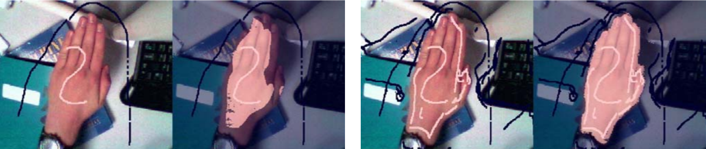
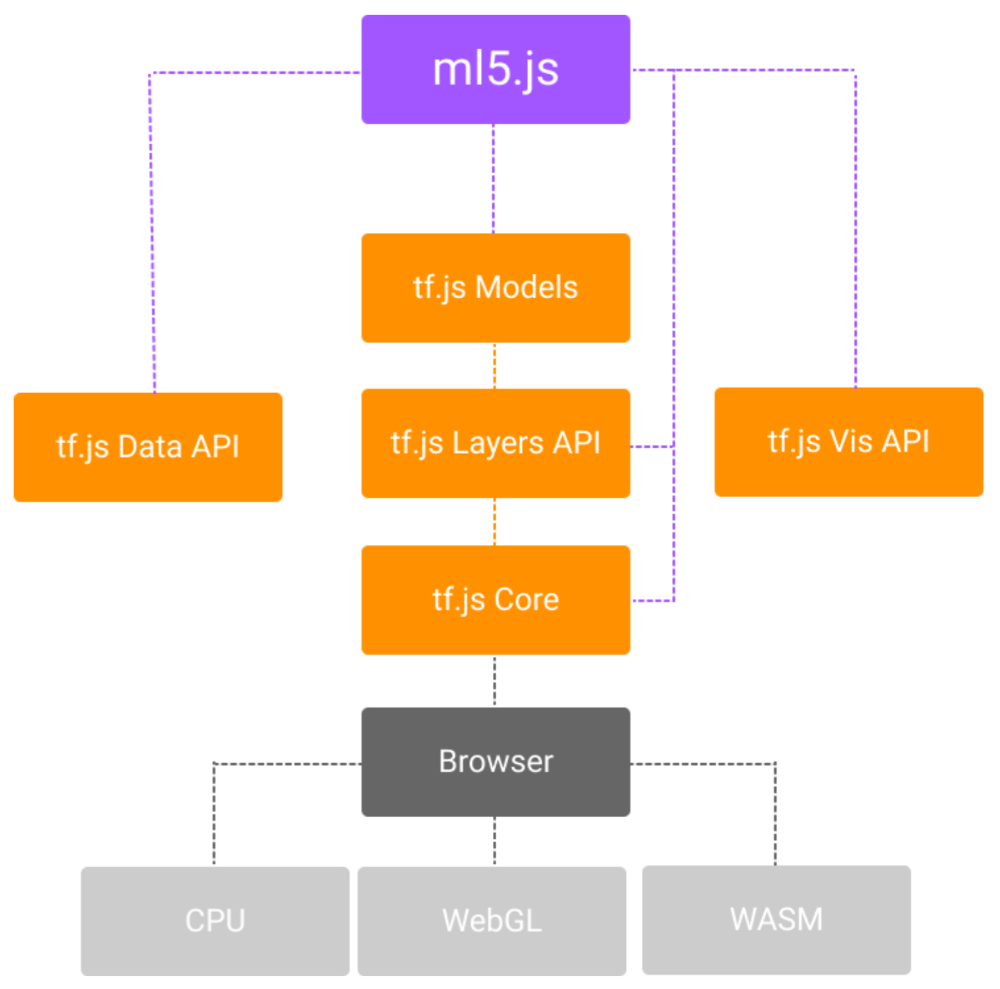
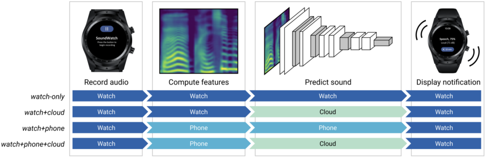
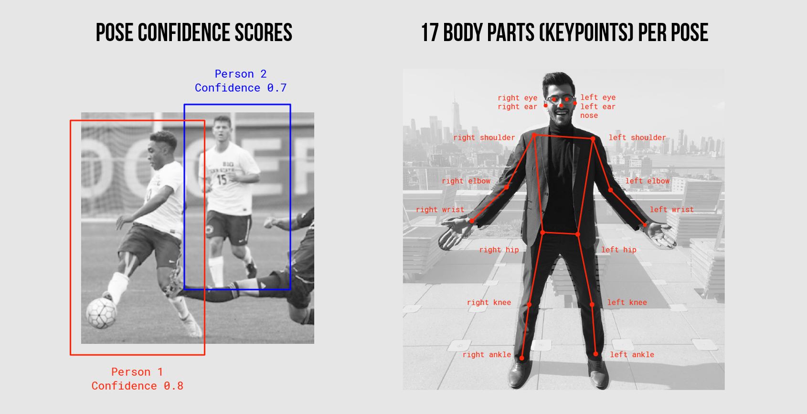
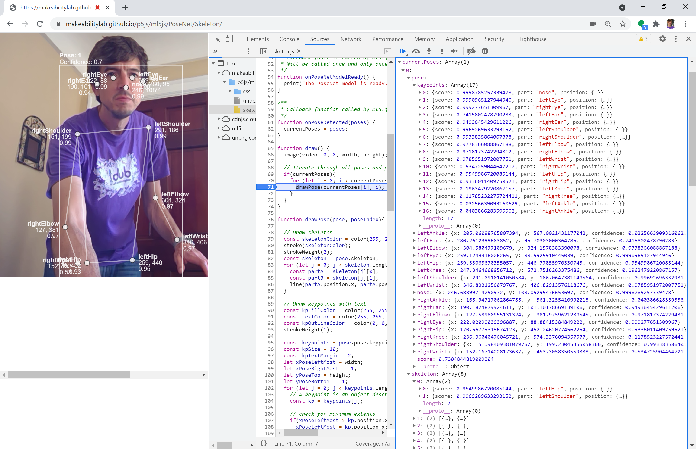
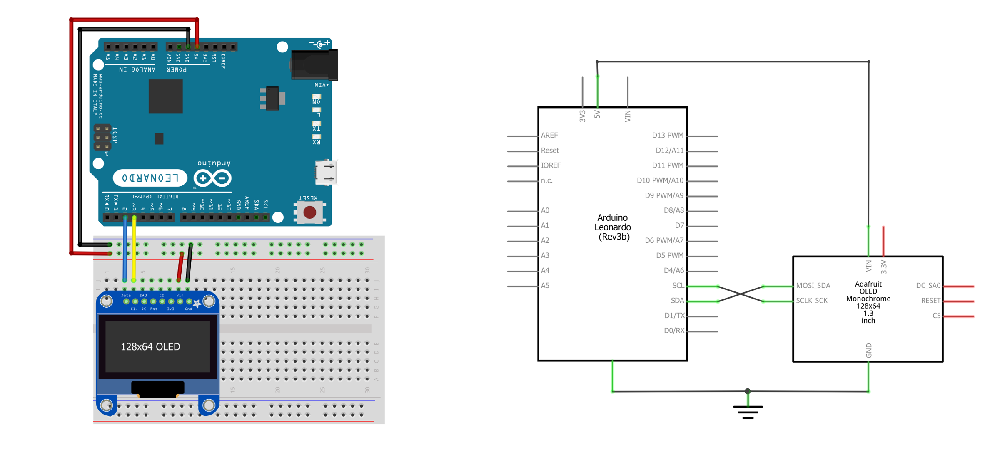
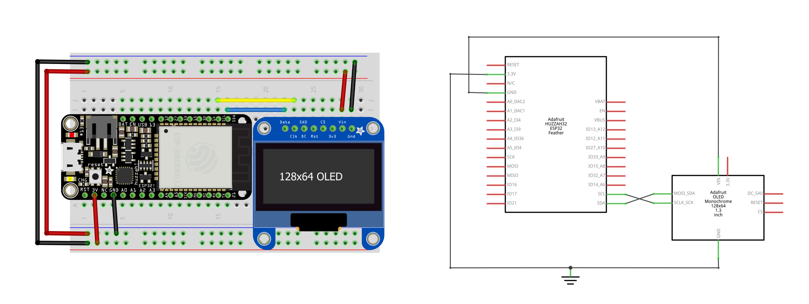
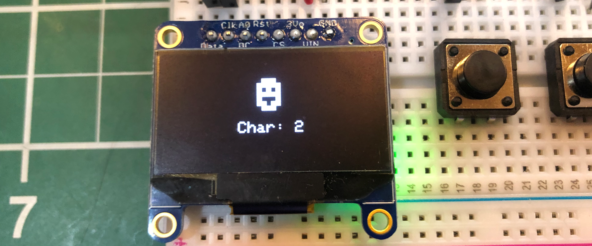

# {{ page.title | replace_first:'L','Lesson '}}
{: .no_toc }

## Table of Contents
{: .no_toc .text-delta }

1. TOC
{:toc}
---

In this lesson, we will extend our learning on [Web Serial](web-serial.md) and [p5.js](p5js-serial.md) to incorporate a machine learning (ML) framework called [ml5.js](https://ml5js.org/). While integrating machine learning into our designs may *seem* intimidating, just as p5.js makes it easier to play and experiment with interactive graphics in JavaScript so too does [ml5.js](https://ml5js.org/) make it easier to play and experiment with machine learning. It's really quite amazing!

For example, with only a few lines of JavaScript code and some slight modifications to our [FlappyBird.ino](https://github.com/makeabilitylab/arduino/blob/master/OLED/FlappyBird/FlappyBird.ino) Arduino sketch (updated to [FlappyBirdSerialIn.ino](https://github.com/makeabilitylab/arduino/blob/master/Serial/FlappyBirdSerialIn/FlappyBirdSerialIn.ino)), we can play FlappyBird with our nose using a real-time web camera stream and ml5's [BodyPose](https://docs.ml5js.org/#/reference/bodypose) library.

<video autoplay loop muted playsinline aria-label="Video demonstrating playing Flappy Bird on Arduino by tracking nose position using ml5.js pose detection">
  <source src="assets/videos/FlappyBirdNoseTracker_Short_1000w.mp4" type="video/mp4" />
</video>
**Video.** Playing Flappy Bird on the Arduino Leonardo by tracking my nose position using p5.js, [ml5.js](https://ml5js.org/), and [Web Serial](web-serial.md). The p5.js app is called NoseTracker ([p5.js online editor](https://editor.p5js.org/jonfroehlich/sketches/QgPPEU5o2), GitHub [live page](https://makeabilitylab.github.io/p5js/WebSerial/ml5js/NoseTracker), GitHub [code](https://github.com/makeabilitylab/p5js/tree/main/WebSerial/ml5js/NoseTracker)). The Arduino sketch is [FlappyBirdSerialIn.ino](https://github.com/makeabilitylab/arduino/blob/master/Serial/FlappyBirdSerialIn/FlappyBirdSerialIn.ino). *Note: this video was created using ml5.js v0.12 with PoseNet; the current lesson uses ml5.js v1.x with BodyPose, but the behavior is the same.*
{: .fs-1 }

In this lesson, we'll show how to do this and more. But first, let's start with some background on machine learning frameworks before diving into [ml5.js](https://ml5js.org/) and ml5+Arduino more specifically.

{: .note }
> **In this lesson, you will learn:**
> - What ml5.js is and how it relates to TensorFlow.js
> - How to use ml5's BodyPose model for real-time pose estimation in the browser
> - How to extract keypoint data (like the nose position) from detected poses
> - How to transmit pose data to Arduino via Web Serial
> - How to build a fun NoseTracker app and use it to play FlappyBird with your face!
> - Important ethical considerations around ML training data and bias

{: .warning }
> **Library version note:** ml5.js underwent a major rewrite from v0.x to v1.x (released August 2024). The old `PoseNet` API was replaced by **`BodyPose`** (using MoveNet and BlazePose models). If you find older tutorials online that use `ml5.poseNet()`, those use the deprecated v0.x API. This lesson uses **ml5.js v1.3.1** with the new BodyPose API. See the [ml5.js v1.0 release blog post](https://ml5js.org/blog/releasing-version-1/) for details.

## Machine learning frameworks

<video autoplay loop muted playsinline aria-label="Video showing a real-time gesture recognizer built with an accelerometer, Arduino, and Python">
  <source src="assets/videos/RealTimeGestureRecognizer-EditedAndOptimized.mp4" type="video/mp4" />
</video>
**Video.** In our MS course on *Ubiquitous Computing*, students build a real-time gesture recognizer from the "ground up" using an LIS3DH accelerometer, Arduino, and Python. We use the machine learning framework called [scikit-learn](https://scikit-learn.org/stable/). Full [YouTube video](https://youtu.be/nnTyqCwYVbA).
{: .fs-1 }

In our Computer Science and Engineering Master's course on *Ubiquitous Computing*, we teach a ~4-week module on filtering, interpreting, and classifying sensor data. Students learn and experience the full classification pipeline: collecting data, writing code to process and visualize that data, identifying and extracting unique features for classification, and writing code to classify those features. For example, students build custom [accelerometer-based step trackers](https://makeabilitylab.github.io/physcomp/signals/StepTracker/index.html) and [3D-gesture recognizers](https://youtu.be/nnTyqCwYVbA) using Arduino and Python. See video above.

<!-- TODO: insert diagram of this pipeline -->

To get there, we cover topics in [digital signal processing](https://makeabilitylab.github.io/physcomp/signals/) and [signal classification](https://makeabilitylab.github.io/physcomp/signals/classification.html), including [cross-correlation](https://makeabilitylab.github.io/physcomp/signals/ComparingSignals/index.html), [dynamic time warping](https://makeabilitylab.github.io/physcomp/signals/ComparingSignals/index.html), and [frequency analysis](https://makeabilitylab.github.io/physcomp/signals/FrequencyAnalysis/index.html) before diving into [heuristic-based classification](https://makeabilitylab.github.io/physcomp/signals/step-tracker.html), [template matching](https://makeabilitylab.github.io/physcomp/signals/gesturerec/shapebased/index.html), and supervised learning (*e.g.,* [support-vector machines](https://makeabilitylab.github.io/physcomp/signals/gesturerec/featurebased/index.html)). These topics alone are wide-ranging, dense, and worthy of their own courses—indeed, engineering departments typically offer multiple courses in DSP and machine learning. While our MS course provides a rapid tour with an applied perspective, there are still significant barriers to entry such as building familiarity with mathematical notation, technical nomenclature, and learning relevant toolkits/libraries.

For example, in our 4-week module, we use [Python3](https://www.python.org/downloads/), [Jupyter Notebook](https://jupyter.org/) and a variety of incredibly powerful but not particularly approachable signal processing and machine learning frameworks including [NumPy](https://numpy.org/), [SciPy](https://www.scipy.org/), [pandas](https://pandas.pydata.org/), [sci-kit learn](https://scikit-learn.org/stable/), and [matplotlib](https://matplotlib.org/). Whew! While these frameworks provide comprehensive libraries for processing, classifying, and visualizing data—and make it much easier to analyze and build ML systems—they have a relatively high bar for entry. As [Daniel Shiffman](https://medium.com/ml5js/ml5-friendly-open-source-machine-learning-library-for-the-web-e802b5da3b2) emphasizes in his introduction to [ml5](https://ml5js.org/):

> Machine learning frameworks are commonly geared for people with advanced knowledge of calculus, linear algebra, statistics, data science, and several years of programming in a language like python or C++. While important for research and development of new machine learning models and architectures, starting from this point can turn away newcomers with other backgrounds. Rather than thinking creatively about how to use machine learning as an artistic platform, beginners may be overwhelmed by fine distinctions between scalars, vectors, matrices, operations, inputs layers, outputs, and more.
{: .fs-4 }

And what if we don't need (or want) to train our own classifiers or deeply engage with signal analysis? What if we just want to play and experiment with pre-trained models and/or state-of-the-art classification techniques to create new interactive experiences? Fortunately, there are many emerging possibilities!

### Making machine learning accessible

Since its inception, researchers have worked to make machine learning more accessible to creators such as musicians, artists, designers, and hobbyists. For example, in 2009, Fiebrink and colleagues created the *[Wekinator](https://ualresearchonline.arts.ac.uk/id/eprint/16687/1/FiebrinkTruemanCook_NIME2009.pdf)* to allow "*musicians, composers, and new instrument designers to interactively train and modify many standard machine learning algorithms in real-time.*" Six years prior, Jerry Fails and Dan Olsen Jr. introduced [*Crayons*](https://dl.acm.org/doi/10.1145/604045.604056), an interactive machine-learning model that enabled users to train, classify, and correct pixel-based classifications via sketching (see Figure below).


**Figure.** The Crayons' interactive machine learning process for auto-segmenting pixel "blobs" in images. Users rapidly sketch over pixels to include and exclude from classification—in this case, segmenting a human hand—immediately see the ML model's response (highlighted pixels) and then make corrections. See full [video demo here](https://youtu.be/GtW-7YsiQdI).
{: .fs-1 }

As machine learning techniques have matured, so too have libraries to make them more accessible, including [Google's Teachable Machine](https://teachablemachine.withgoogle.com/), [Runway ML](https://runwayml.com/), and [ml5.js](https://ml5js.org/)—all of which run in the web browser and work with JavaScript!

As a testament to these toolkits, machine learning is increasingly becoming another *prototyping material.* Just as we prototype with code, electronics, and crafts so too can we prototype with ML, unlocking new opportunities for computational creativity and new applications! However powerful, ML can also be dangerous and nefariously applied—[governments using facial recognition](https://epic.org/state-policy/facialrecognition/) to surveil without consent, models furthering [systemic racial or gender bias](http://proceedings.mlr.press/v81/buolamwini18a/buolamwini18a.pdf), and/or technologists over-inflating ML's abilities, endangering end-users and possibly [leading to death](https://www.washingtonpost.com/technology/2021/05/14/tesla-california-autopilot-crash/). So, let's approach these ML frameworks with caution—they are imperfect and probabilistic. As the [Peter Parker principle](https://en.wikipedia.org/wiki/With_great_power_comes_great_responsibility) states:

> With great power comes great responsibility

Though this lesson will not dive deeply into ML, our hope is that it will serve as an accessible pathway to advance your understanding of how ML works, the importance of data and model training, and the socio-technical implications of creating ML-reliant technology. For example, we'll be using the ml5 BodyPose library to recognize human bodies—how well do you think this model works across different body types, ages, and skin colors? The answer will be based on the *training set* for the neural net model. If the training set is largely composed of images of tall, skinny, middle-age white males in business casual clothing and perfect ambient lighting conditions with solid backgrounds, it's unlikely that BodyPose will work well across other demographics, body types, skin colors, and environments. It's important that we constantly think about how our ML systems are trained, where the data comes from, and how well the ML systems will perform across contexts.

### Friendly machine learning on the web: ml5.js

<video autoplay loop muted playsinline aria-label="Video demonstrating ml5.js real-time pose estimation with keypoint overlay on a person">
  <source src="assets/videos/PoseNet_TensorFlow-Optimized.mp4" type="video/mp4" />
</video>
**Video.** ml5.js's pose estimation model performing real-time body tracking, built on [TensorFlow.js](https://www.tensorflow.org/js/). *Note: this video uses the older PoseNet model from ml5 v0.x; the current version uses BodyPose with MoveNet/BlazePose, which offers improved accuracy and performance.*
{: .fs-1 }

In this lesson, we will be using [ml5.js](https://ml5js.org/), which provides an easy-to-use wrapper library around Google's [TensorFlow.js](https://www.tensorflow.org/js/) and is designed to work well with [p5.js](https://p5js.org/) (hence, the '5' in the name!).


{: .mx-auto .align-center }

**Figure.** ml5.js is built on top of Google's [TensorFlow.js](https://www.tensorflow.org/js/). It uses TensorFlow models, layers, and data API but abstracts them into a novice-friendly programming interface. Diagram from Yining Shi's "Machine Learning for the Web" course at ITP, NYU ([link](https://docs.google.com/presentation/d/1s0iT382Pl1DMGKb5xhk7_V3DlW1QQHfHs4snNoS_sIU/edit#slide=id.g953c8caacd_0_2))
{: .fs-1 }

As the [ml5 About Page](https://ml5js.org/about/) states:

> ml5 is not just about developing machine learning software, it is about making machine learning approachable for a broad audience of artists, creative coders, and students. The library provides access to machine learning algorithms and models in the browser, building on top of TensorFlow.js with no other external dependencies
{: .fs-4 }

You can read more about ml5's history [here](https://medium.com/ml5js/ml5-friendly-open-source-machine-learning-library-for-the-web-e802b5da3b2). ml5.js is open source on [GitHub](https://github.com/ml5js/ml5-next-gen).

### Getting started with ml5.js

To get started with [ml5.js](https://ml5js.org/), we recommend reading the official ml5.js [Reference documentation](https://docs.ml5js.org/) and watching some of Daniel Shiffman's Coding Train YouTube videos on ml5.js, which includes wonderful tutorials on [BodyPose detection](https://thecodingtrain.com/tracks/ml5js-beginners-guide/ml5/7-bodypose/pose-detection/), [HandPose](https://thecodingtrain.com/tracks/ml5js-beginners-guide/ml5/hand-pose/), [FaceMesh](https://thecodingtrain.com/tracks/ml5js-beginners-guide/ml5/facemesh/), [image classification](https://www.youtube.com/watch?v=yNkAuWz5lnY&list=PLRqwX-V7Uu6YPSwT06y_AEYTqIwbeam3y&index=3), [sound classification](https://www.youtube.com/watch?v=cO4UP2dX944&list=PLRqwX-V7Uu6YPSwT06y_AEYTqIwbeam3y&index=19&t=766s), and more!

<!-- TODO: verify all Coding Train links above are still active -->

<div class="iframe-container">
  <iframe src="https://www.youtube.com/embed/jmznx0Q1fP0" title="YouTube video: Beginner's Guide to Machine Learning with ml5.js by Daniel Shiffman" frameborder="0" allow="accelerometer; autoplay; clipboard-write; encrypted-media; gyroscope; picture-in-picture" allowfullscreen></iframe>
</div>
**Video.** The first video in Shiffman's Coding Train YouTube series on ["Beginner's Guide to Machine Learning with ml5.js"](https://www.youtube.com/playlist?list=PLRqwX-V7Uu6YPSwT06y_AEYTqIwbeam3y). We highly recommend all [Coding Train videos](https://www.youtube.com/channel/UCvjgXvBlbQiydffZU7m1_aw)!
{: .fs-1 }

### Why not embedded machine learning?


**Figure.** There are many possibilities for how to architect embedded/IoT ML systems depending on power, computation, and latency requirements. In our [ASSETS'20 paper](https://makeabilitylab.cs.washington.edu/media/publications/Jain_SoundwatchExploringSmartwatchBasedDeepLearningApproachesToSupportSoundAwarenessForDeafAndHardOfHearingUsers_ASSETS2020.pdf) for [SoundWatch](https://makeabilitylab.cs.washington.edu/project/soundwatch/), for example, we explore four different ML architectures: *watch-only*, *watch+phone*, *watch+phone+cloud*, and *watch+cloud*.
{: .fs-1 }

As this is a physical computing course, one may rightly ask: why not teach *embedded* machine learning where the ML model runs locally on the Arduino or IoT device rather than on a computer or in the cloud? This is a great question with a multifold response:

- First, when initially learning ML—even in the applied sense—we think the desktop provides a more approachable learning environment. The tools are more mature, it's easier to visualize and understand the data and the ML model, and it's easier to debug and iterate.
- While new ML frameworks like [TensorFlow Lite](https://www.tensorflow.org/lite) are designed specifically for mobile and low-resource devices, the community is still small with commensurately few examples. And, again, running a model directly on Arduino increases training, testing, and iterating complexity. We should start simply and grow outward!
- Finally, even "smart" IoT or wearable devices that use machine learning often rely on cloud-based APIs for classification. The device itself might preprocess the data or extract features for the cloud but the full classifier runs off-device. For example, our [SoundWatch](https://makeabilitylab.cs.washington.edu/project/soundwatch/) system classifies and visualizes sounds in real-time on a smartwatch for people who are d/Deaf or hard of hearing. In our [ASSETS'20 paper](https://makeabilitylab.cs.washington.edu/media/publications/Jain_SoundwatchExploringSmartwatchBasedDeepLearningApproachesToSupportSoundAwarenessForDeafAndHardOfHearingUsers_ASSETS2020.pdf), we explore four different classification architectures: *watch-only*, *watch+phone*, *watch+phone+cloud*, and *watch+cloud*. There are many possibilities for how to architect embedded/IoT ML systems depending on power, computation, and latency requirements.

In this lesson, we will **not** be classifying sensor streams off the Arduino but rather classifying web camera data with ml5.js and transmitting derived information to Arduino via [Web Serial](web-serial.md).

<!-- TODO: why not run classifiers on the microcontroller?
See: https://experiments.withgoogle.com/tfmicrochallenge -->

<!-- Pacman web cam controller: https://storage.googleapis.com/tfjs-examples/webcam-transfer-learning/dist/index.html -->

<!-- TODO: in future flesh out ml5.js library section and provide screenshots, etc.
### ml5.js library

The [ml5.js](https://learn.ml5js.org/#/reference/index) library provides image, sound, and text classification. Please see the Reference page for details. We will survey a few common models below.

#### Image

## Other libraries -->

<!-- - face-api.js https://github.com/justadudewhohacks/face-api.js -->

## Recognizing human poses with BodyPose

In this section, we will use p5.js to capture a real-time webcam stream and ml5.js to recognize objects in that stream—specifically the human body and key body parts therein.

Recognizing parts of the human body in images/video is a type of computer vision problem called "pose estimation." Importantly, pose estimation does **not** recognize *who* is in an image or video, it simply identifies whether there are humans and, if so, provides data about their body parts (*e.g.,* an `x,y` position of an ankle or nose). This has long been a challenging computer vision problem. Prior work often relied on specialized cameras, like the [Microsoft Kinect](https://www.microsoft.com/en-us/research/project/human-pose-estimation-for-kinect/), to capture and identify human poses.

In 2018, Google released PoseNet for TensorFlow.js, enabling real-time pose estimation in the browser. Since then, the models have improved significantly. ml5.js v1.x now uses **BodyPose**, which wraps Google's [MoveNet](https://blog.tensorflow.org/2021/05/next-generation-pose-detection-with-movenet-and-tensorflowjs.html) and [BlazePose](https://ai.googleblog.com/2020/08/on-device-real-time-body-pose-tracking.html) models. These newer models are faster, more accurate, and support 3D coordinates.

{: .note }
> **MoveNet vs BlazePose:** ml5's BodyPose supports two underlying models. **MoveNet** is faster and great for real-time applications (this is the default). **BlazePose** provides 33 keypoints with 3D coordinates but is slower. For our serial communication examples, MoveNet works great.

#### The BodyPose data structure


**Figure.** Overview of body pose detection showing keypoints on detected human figures. Images from "[Real-time Human Pose Estimation in the Browser with TensorFlow.js](https://medium.com/tensorflow/real-time-human-pose-estimation-in-the-browser-with-tensorflow-js-7dd0bc881cd5)". *Note: the MoveNet model used in ml5.js v1.x detects 17 keypoints, same as the original PoseNet.*
{: .fs-1 }

ml5's BodyPose returns an array of detected poses—one per human detected in a frame. For each detected person, you receive an array of keypoints. Each keypoint has a `name`, an `x` and `y` position (in pixels), and a `confidence` score (0 to 1). There are **17 keypoints** with MoveNet: `nose`, `left_eye`, `right_eye`, `left_ear`, `right_ear`, `left_shoulder`, `right_shoulder`, `left_elbow`, `right_elbow`, `left_wrist`, `right_wrist`, `left_hip`, `right_hip`, `left_knee`, `right_knee`, `left_ankle`, `right_ankle`.

The data structure looks like this:

```javascript
// poses is an array of detected people
[
  {
    // Each pose has a keypoints array and named shortcuts
    keypoints: [
      { x: 320, y: 150, confidence: 0.95, name: "nose" },
      { x: 305, y: 138, confidence: 0.91, name: "left_eye" },
      { x: 335, y: 140, confidence: 0.89, name: "right_eye" },
      // ... 17 keypoints total
    ],
    // Named shortcuts for convenience
    nose: { x: 320, y: 150, confidence: 0.95 },
    left_eye: { x: 305, y: 138, confidence: 0.91 },
    right_eye: { x: 335, y: 140, confidence: 0.89 },
    // ...
  },
  // Additional detected people...
]
```

{: .note }
> **v0.x vs v1.x data structure:** If you're looking at older tutorials, note that the old PoseNet API returned `poses[0].pose.nose.x` (nested under a `pose` property). The new BodyPose API is flatter: `poses[0].nose.x`. The keypoint names also changed slightly (*e.g.,* `leftEye` → `left_eye`).

To make this more concrete, here's a screenshot of our [Skeleton](https://makeabilitylab.github.io/p5js/ml5js/PoseNet/Skeleton/) app with Chrome's dev tools showing a pose and skeleton object.


**Figure.** Examining the pose data structure for a single recognized person using Chrome DevTools. This screenshot shows the **v0.x PoseNet** data structure, where keypoints are nested under `pose.keypoints` and named shortcuts like `pose.nose`. In BodyPose v1.x, the structure is flatter: keypoints are directly on the pose object (*e.g.,* `poses[0].nose.x` instead of `poses[0].pose.nose.x`), and names use underscores (*e.g.,* `left_eye` instead of `leftEye`). To try this yourself: open a BodyPose sketch in your browser, open dev tools (`Ctrl+Shift+I` on Windows, `Cmd+Option+I` on Mac), click on the `Sources` tab, set a breakpoint in `draw()`, and inspect the `poses` variable in the Watch panel.
{: .fs-1 }

### Example p5.js + ml5.js BodyPose demo

To demonstrate the ml5.js BodyPose API, we created a simple application called [Skeleton](https://makeabilitylab.github.io/p5js/ml5js/PoseNet/Skeleton/) that renders:
- a bounding box around each detected human showing a confidence `score`
- all 17 keypoints with `x,y` position and keypoint-specific confidence `scores`
- the `skeleton` data for each pose

<!-- TODO: update Skeleton app to use ml5 v1.x BodyPose API and verify links -->

Here's a video demonstration:

<video autoplay loop muted playsinline aria-label="Video demonstrating the Skeleton app with ml5 pose detection showing keypoints and skeleton overlay">
  <source src="assets/videos/PoseNet_SkeletonDemo_Optimized.mp4" type="video/mp4" />
</video>
**Video.** This video demonstrates ml5 pose estimation via the [Skeleton](https://makeabilitylab.github.io/p5js/ml5js/PoseNet/Skeleton/) application. We are drawing each of the 17 recognized keypoints along with the x,y position and confidence scores. The code is available on GitHub [here](https://github.com/makeabilitylab/p5js/tree/main/ml5js/PoseNet/Skeleton). *Note: this video was created using ml5 v0.x with PoseNet; the current BodyPose API produces the same keypoints with improved accuracy.*
{: .fs-1 }

<!-- TODO: update Skeleton p5.js editor link to use v1.x BodyPose API -->

OK, now we're ready to start building an ml5.js + Arduino application together!

## Building our first ml5.js + Arduino app: NoseTracker

Let's build a p5.js + ml5.js application that tracks the nose position of a human and sends that position over serial to an Arduino. As always, we'll build this up step-by-step.

Start by copying our [SerialTemplate](https://github.com/makeabilitylab/p5js/tree/main/WebSerial/p5js/SerialTemplate) and rename the folder to `NoseTracker`.

#### Add in ml5.js

To use ml5.js, we need to add the library to our `index.html`. Add the following `<script>` tag in the `<head>`, alongside the p5.js and serial.js libraries we already have:

```html
<head>
  <script src="https://cdn.jsdelivr.net/npm/p5@1.11.13/lib/p5.js"></script>
  <script src="https://cdn.jsdelivr.net/gh/makeabilitylab/js@main/dist/makelab.serial.iife.js"></script>
  <script src="https://unpkg.com/ml5@1.3.1/dist/ml5.min.js"></script>
  <link rel="stylesheet" type="text/css" href="css/style.css">
  <meta charset="utf-8">
</head>
```

{: .note }
> We're pinning to **ml5.js v1.3.1** to ensure the API doesn't change unexpectedly. This is especially important for ml5.js, which underwent a major breaking change from v0.x to v1.x. Always pin your library versions in course projects!

#### Initialize the webcam and BodyPose model

Next, let's set up the webcam and ml5's BodyPose model. In the v1.x API, we initialize BodyPose in `preload()` (so the model is ready before `setup()` runs), then start continuous detection with `detectStart()` in `setup()`:

```javascript
let video;
let bodyPose;
let poses = [];

function preload() {
  // Load the BodyPose model (MoveNet by default)
  bodyPose = ml5.bodyPose();
}

function setup() {
  createCanvas(640, 480);
  video = createCapture(VIDEO);
  video.hide(); // hide raw video element (we'll draw it to the canvas)

  // Start continuous pose detection on the video stream
  bodyPose.detectStart(video, onPosesDetected);
}

function onPosesDetected(results) {
  poses = results;
}
```

{: .note }
> **`detectStart()` vs the old `.on('pose')` pattern:** In ml5 v0.x, you subscribed to pose events with `poseNet.on('pose', callback)`. In v1.x, you call `bodyPose.detectStart(video, callback)`, which internally manages the detection loop. This is simpler and prevents accidental recursive loop issues.

#### Draw nose keypoint

Now, let's have some fun! Let's draw a red "nose" at the `nose` keypoint.

```javascript
function draw() {
  background(100);
  image(video, 0, 0); // draw the video to the canvas

  for (let human of poses) {
    // Draw a red circle at the nose keypoint
    if (human.nose) {
      fill("red");
      noStroke();
      circle(human.nose.x, human.nose.y, 40);
    }
  }
}
```

Here's a video demo:

<video autoplay loop muted playsinline aria-label="Video showing a red circle tracking the nose position in real-time using ml5 pose detection">
  <source src="assets/videos/NoseTracker2-Nose_2x_Optimized.mp4" type="video/mp4" />
</video>
**Video.** Video demonstration of using ml5 to track and draw on top of body part keypoints. Based on this Coding Train "[Hour of Code with p5.js and PoseNet](https://youtu.be/EA3-k9mnLHs)" by Daniel Shiffman. *Note: this video was created with ml5 v0.x PoseNet; the BodyPose API produces the same visual result.* <!-- TODO: update p5.js editor link to v1.x version -->
{: .fs-1 }

#### Make yourself into a muppet

To make this a bit more fun, we can [muppetify](https://en.wikipedia.org/wiki/The_Muppets) ourselves by adding in some eyes. This is like making a basic Snapchat or Instagram face filter! We'll also modularize our code by creating `drawNose` and `drawEye` functions.

```javascript
function draw() {
  image(video, 0, 0); // draw the video to the canvas
  for (let human of poses) {
    if (human.nose) {
      drawNose(human.nose.x, human.nose.y);
    }
    if (human.left_eye) {
      drawEye(human.left_eye.x, human.left_eye.y);
    }
    if (human.right_eye) {
      drawEye(human.right_eye.x, human.right_eye.y);
    }
  }
}

function drawNose(x, y) {
  fill("red"); // red nose
  noStroke();
  circle(x, y, 35);
}

function drawEye(x, y) {
  noStroke();

  fill(255); // white of eye (the sclera)
  const eyeWidth = 40;
  const pupilWidth = 15;
  circle(x, y, eyeWidth);

  fill(0); // black pupils
  circle(x, y, pupilWidth);
}
```

And another video demo to show what we've created thus far! Notice how the pose model will recognize *pictures* of humans as well as real, physical humans in the webcam stream (but not pictures of seals!).

<video autoplay loop muted playsinline aria-label="Video showing muppet-style eyes and nose overlaid on detected faces, including a face on a book cover">
  <source src="assets/videos/NoseTracker3-EyesAndNoseWithBook-Optimized.mp4" type="video/mp4" />
</video>
**Video.** Video demonstration of turning oneself into Elmo using ml5 pose detection. To demonstrate the multi-pose recognizer, I used a book cover with a human face. The video also shows how the book cover of a seal is not recognized. *Note: this video was created with ml5 v0.x PoseNet; the BodyPose API works the same way.* <!-- TODO: update p5.js editor link to v1.x version -->
{: .fs-1 }

#### Add in web serial code

Finally, let's add code to transmit the nose's location over Web Serial. Just as we've done in previous lessons, rather than transmit the raw x,y pixel location, we will transmit a normalized version between [0, 1] inclusive for both x and y. We do this in the `onPosesDetected` callback:

```javascript
function onPosesDetected(results) {
  poses = results;

  // If serial is open and we have at least one person, transmit nose position
  if (serial.isOpen() && poses.length > 0) {
    const human = poses[0];

    if (human.nose) {
      // Normalize nose position as fraction of canvas dimensions
      let noseXNormalized = human.nose.x / width;
      let noseYNormalized = human.nose.y / height;

      let outputData = nf(noseXNormalized, 1, 4) + ", " + nf(noseYNormalized, 1, 4);
      serial.writeLine(outputData);
    }
  }
}
```

#### Connect to web serial device

Our template code, [`SerialTemplate`](https://github.com/makeabilitylab/p5js/tree/main/WebSerial/p5js/SerialTemplate), provides two different connection mechanisms—both are already coded so you need not do anything here. But, to review, the two different connection approaches are:

First, if you've never connected to a particular web serial device before, you can click on the canvas where you'll be greeted by a connection dialog:

```javascript
function mouseClicked() {
  if (!serial.isOpen()) {
    try {
      serial.connectAndOpen(null, serialOptions);
    } catch (error) {
      console.error("Serial connection failed:", error);
    }
  }
}
```

Second, if you've previously approved the web serial device, it will auto-connect as soon as you run the app. This is done in `setup()`:

```javascript
serial.autoConnectAndOpenPreviouslyApprovedPort(serialOptions);
```

#### We're done with the JavaScript app

That's it for the p5.js app. The full code is available in the [p5.js online editor](https://editor.p5js.org/jonfroehlich/sketches/QgPPEU5o2) or on GitHub ([live page](https://makeabilitylab.github.io/p5js/WebSerial/ml5js/NoseTracker/), [code](https://github.com/makeabilitylab/p5js/tree/main/WebSerial/ml5js/NoseTracker)).

<!-- TODO: update p5.js online editor and GitHub links to use ml5 v1.x BodyPose API -->

<!-- TODO: Sync GitHub source for NoseTracker/sketch.js to match lesson changes:
     - Add try/catch around connectAndOpen() in mouseClicked()
     - Ensure code uses ml5 v1.x BodyPose API (detectStart, named keypoints)
     GitHub: https://github.com/makeabilitylab/p5js/tree/main/WebSerial/ml5js/NoseTracker
     p5.js editor: https://editor.p5js.org/jonfroehlich/sketches/QgPPEU5o2 -->

### Building the Arduino side

There are lots of creative possibilities for how our Arduino might use pose data. For now, we're just going to draw a face icon on the OLED display at the incoming x,y position. **The Arduino code is identical regardless of which ml5 version the p5.js app uses**—it just receives normalized x,y coordinates over serial.

#### The OLED circuit

The circuit is similar to many we've built for our [web serial lessons](p5js-serial-io.md#a-simple-oled-circuit). Simply, wire up the OLED using I<sup>2</sup>C connections.

| Arduino Leonardo Wiring | ESP32 Wiring |
|-------------------------|-------------------------|
|  |  |

**Figure.** Two example wirings for the OLED display, which we describe in detail in the [OLED lesson](../advancedio/oled.md). You can right-click on the images and select "Open Image in a New Tab" to enlarge.
{: .fs-1 }

#### The Arduino code

The NoseTracker Arduino code is similar to [previous lessons](p5js-serial-io.md#parse-serial-data-and-update-oled-debug-output). We simply need to:
- **Parse incoming serial data** into x,y floats
- **Convert the x,y normalized** positions into OLED pixel positions
- **Draw a face** at the x,y pixel positions
- **Echo data back** to our p5.js app for debugging purposes

For the face, rather than drawing one using shape primitives (*e.g.,* [`drawCircle`](../advancedio/oled.md#drawing-shapes) calls), we're going to use the built-in face icon from the default font set (which is char index `2`):

```cpp
_display.drawChar(x, y, (unsigned char)2, SSD1306_WHITE, SSD1306_BLACK, CHAR_SIZE);
```


**Figure.** A close-up image of the face icon we'll use from the default character set.
{: .fs-1 }

##### Parsing the incoming serial data
First, declare some global variables related to face drawing.

```cpp
const int CHAR_SIZE = 3;           // set font size to 3
const int DEFAULT_CHAR_WIDTH = 5;  // default font is 5 pixels wide at size 1
const int DEFAULT_CHAR_HEIGHT = 8; // default font is 8 pixels tall at size 1

int _charWidth = DEFAULT_CHAR_WIDTH * CHAR_SIZE;   // calculate char width at char size
int _charHeight = DEFAULT_CHAR_HEIGHT * CHAR_SIZE;  // calculate char height at char size

float _faceX = 0; // normalized x position of face
float _faceY = 0; // normalized y position of face
```

Now, in `loop()` look for incoming serial data. If serial data exists, read and parse it into x,y floats.

```cpp
void loop() {
  // Check to see if there is any incoming serial data
  if(Serial.available() > 0){
    // Read data off the serial port until we get to the endline delimiter ('\n')
    String rcvdSerialData = Serial.readStringUntil('\n');

    // Parse out the comma separated string
    int indexOfComma = rcvdSerialData.indexOf(',');

    if(indexOfComma != -1){
      String strXLocation = rcvdSerialData.substring(0, indexOfComma);
      _faceX = strXLocation.toFloat();

      String strYLocation = rcvdSerialData.substring(indexOfComma + 1, rcvdSerialData.length());
      _faceY = strYLocation.toFloat();
    }

    // Echo the data back on serial (for debugging purposes)
    Serial.print("# Arduino Received: '");
    Serial.print(rcvdSerialData);
    Serial.println("'");
  }

  _display.clearDisplay();
  drawFace(_faceX, _faceY); // draw the face
  _display.display();
  delay(DELAY_MS);
}
```

##### Drawing the face

We could really draw anything we want at the received x,y position—an animated sprite, a shape, *etc.* In this example, we'll simply draw a face.

```cpp
void drawFace(float xFrac, float yFrac){
  int x = xFrac * (_display.width() - _charWidth);
  int y = yFrac * (_display.height() - _charHeight);

  _display.drawChar(x, y, (unsigned char)2, SSD1306_WHITE, SSD1306_BLACK, CHAR_SIZE);
}
```

And that's it, the full code is available on GitHub as [NoseTrackerSerialIn.ino](https://github.com/makeabilitylab/arduino/blob/master/Serial/NoseTrackerSerialIn/NoseTrackerSerialIn.ino).

### Video demonstration of NoseTracker

Here's a longer video demonstration of the full p5.js + Arduino NoseTracker app:

<video autoplay loop muted playsinline aria-label="Video demonstrating the full NoseTracker app with nose position controlling a face icon on the Arduino OLED display">
  <source src="assets/videos/NoseTrackerFullDemo-Optimized.mp4" type="video/mp4" />
</video>
**Video.** The full NoseTracker demo. The p5.js code is available in the [p5.js online editor](https://editor.p5js.org/jonfroehlich/sketches/QgPPEU5o2) or on GitHub ([live page](https://makeabilitylab.github.io/p5js/WebSerial/ml5js/NoseTracker/), [code](https://github.com/makeabilitylab/p5js/tree/main/WebSerial/ml5js/NoseTracker)). The Arduino code is on GitHub as [NoseTrackerSerialIn.ino](https://github.com/makeabilitylab/arduino/blob/master/Serial/NoseTrackerSerialIn/NoseTrackerSerialIn.ino). You can ignore the two momentary buttons on the breadboard—we don't use them here. *Note: this video was created with ml5 v0.x PoseNet; the behavior with BodyPose v1.x is the same.*
{: .fs-1 }

<!-- TODO: update p5.js online editor and GitHub links to use ml5 v1.x BodyPose API -->

## Introducing FlappyNose

Using the same p5+ml5 code, NoseTracker ([live page](https://makeabilitylab.github.io/p5js/WebSerial/ml5js/NoseTracker/), [code](https://github.com/makeabilitylab/p5js/tree/main/WebSerial/ml5js/NoseTracker)), we can build lots of interesting physical computing experiences. As one example, we can modify the [FlappyBird.ino](https://github.com/makeabilitylab/arduino/blob/master/OLED/FlappyBird/FlappyBird.ino) code we introduced in our [OLED Lesson](../advancedio/oled.md) to use **serial input** rather than **digital input** (a button press) to control flapping. We'll call this new incarnation: FlappyNose! 🐦

In this case, we draw a menu screen that asks the user to select the "flapping" control—either serial or button. If serial is selected, the Arduino sketch expects a text-encoded comma-separated line of x,y positions—just like what the NoseTracker page transmits—however, we only use the y position in the game to set the "bird" position. See the video below.

<div class="iframe-container">
  <iframe src="https://www.youtube.com/embed/AktNXq-cflw" title="YouTube video: Full demonstration of FlappyNose, playing Flappy Bird with nose tracking" frameborder="0" allow="accelerometer; autoplay; clipboard-write; encrypted-media; gyroscope; picture-in-picture" allowfullscreen></iframe>
</div>
**Video.** A full demonstration of "FlappyNose". Watch me get a high score of 33 after a few tries. :) The p5.js app is available on the [p5.js online editor](https://editor.p5js.org/jonfroehlich/sketches/QgPPEU5o2) or in GitHub ([live page](https://makeabilitylab.github.io/p5js/WebSerial/ml5js/NoseTracker), [code](https://github.com/makeabilitylab/p5js/tree/main/WebSerial/ml5js/NoseTracker)). The Arduino sketch is [FlappyBirdSerialIn.ino](https://github.com/makeabilitylab/arduino/blob/master/Serial/FlappyBirdSerialIn/FlappyBirdSerialIn.ino). *Note: this video was created with ml5 v0.x PoseNet; the behavior with BodyPose v1.x is the same.*
{: .fs-1 }

<!-- TODO: update p5.js online editor and GitHub NoseTracker links to use ml5 v1.x BodyPose API -->

<!-- TODO: You could imagine modifying this application to control a game.

Outline:
- Show Elmo
- Show elmo face track + Arduino
- Adapt code for flappy bird
- Show full body on OLED? Maybe with flipped display? -->


<!-- Physcomp + ml:
- https://experiments.withgoogle.com/objectifier-spatial-programming
- https://experiments.withgoogle.com/tfmicrochallenge -->

## Lesson Summary

In this lesson, you learned how to use ml5.js—a beginner-friendly machine learning library—with p5.js and Arduino to create interactive, ML-powered physical computing experiences. Here are the key takeaways:

- **ml5.js** is a friendly wrapper around TensorFlow.js that makes machine learning accessible to artists, designers, and students. It's designed to work seamlessly with p5.js.
- **BodyPose** (which replaced PoseNet in ml5.js v1.0) uses MoveNet or BlazePose to detect 17 body keypoints in real-time from a webcam feed—right in the browser, with no data sent to the cloud.
- The **`detectStart()`** API pattern continuously runs pose detection and calls your callback with results. This is simpler and more robust than the old event-based approach.
- We built **NoseTracker**, which extracts the nose keypoint position, normalizes it to [0, 1], and transmits it over Web Serial to an Arduino that displays a face icon on the OLED at the corresponding position.
- The **Arduino code is model-agnostic**—it just receives normalized x,y coordinates. This means you can swap the ML model (BodyPose, HandPose, FaceMesh) without changing any Arduino code.
- **ML bias and ethics matter.** Pre-trained models reflect their training data. Models trained mostly on one demographic may not work well for others. Always consider who your technology includes and excludes.

## Exercises

**Exercise 1:** Modify the NoseTracker to track a **different keypoint**—such as the wrist—and use it to control the face icon on the OLED. How does changing the tracked keypoint affect the interaction experience?

**Exercise 2:** Add **confidence-based filtering** to the NoseTracker. Only send data to Arduino when the nose keypoint confidence is above 0.5. Display the current confidence level on the p5.js canvas.

**Exercise 3:** Extend the NoseTracker to send **two body parts** as a comma-separated string (*e.g.,* `"noseX, noseY, wristX, wristY\n"`). On the Arduino side, draw both a face icon (for the nose) and a circle (for the wrist).

**Exercise 4:** Create a **"wave detector"** app. Track the wrist keypoint and detect when the user waves (large side-to-side motion). When a wave is detected, send a signal to the Arduino that triggers an LED blink or a buzzer tone.

## Resources

- [ml5.js Official Documentation](https://docs.ml5js.org/), ml5.js

- [ml5.js v1.0 Release Blog Post](https://ml5js.org/blog/releasing-version-1/), Processing Foundation

- [BodyPose with MoveNet](https://thecodingtrain.com/tracks/ml5js-beginners-guide/ml5/7-bodypose/pose-detection/), The Coding Train (Daniel Shiffman)

- [Beginner's Guide to Machine Learning with ml5.js](https://www.youtube.com/playlist?list=PLRqwX-V7Uu6YPSwT06y_AEYTqIwbeam3y), The Coding Train YouTube playlist

- [Machine Learning for the Web](https://github.com/yining1023/machine-learning-for-the-web), Yining Shi's course at ITP, NYU

## Next Lesson

In the [next lesson](handpose-serial.md), we'll explore ml5's **HandPose** model for hand tracking and build an Arduino app controlled by hand gestures. 🖐️

<nav class="lesson-nav" aria-label="Lesson navigation">
  <a href="p5js-paint-io.html" class="nav-prev">
    <div class="nav-label">&larr; Previous Lesson</div>
    <div class="nav-title">PaintIO Example</div>
  </a>
  <a href="handpose-serial.html" class="nav-next">
    <div class="nav-label">Next Lesson &rarr;</div>
    <div class="nav-title">HandPose Serial</div>
  </a>
</nav>