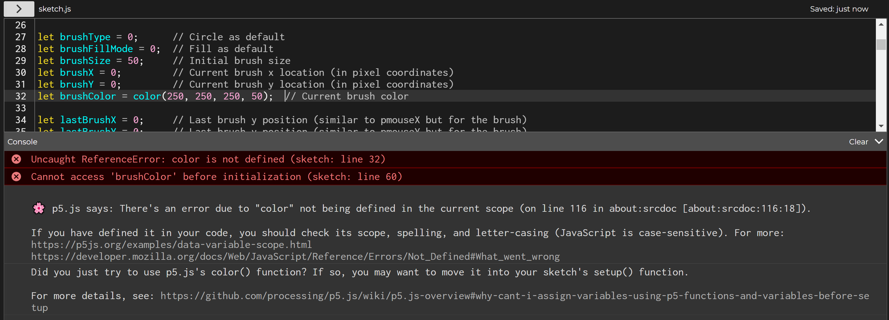
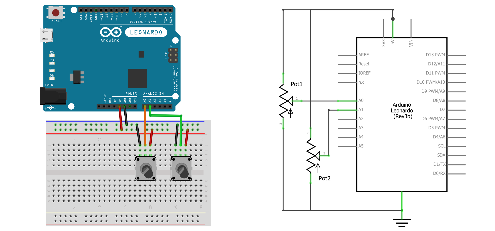
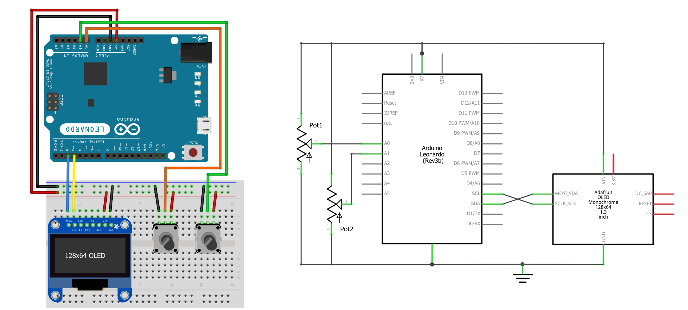
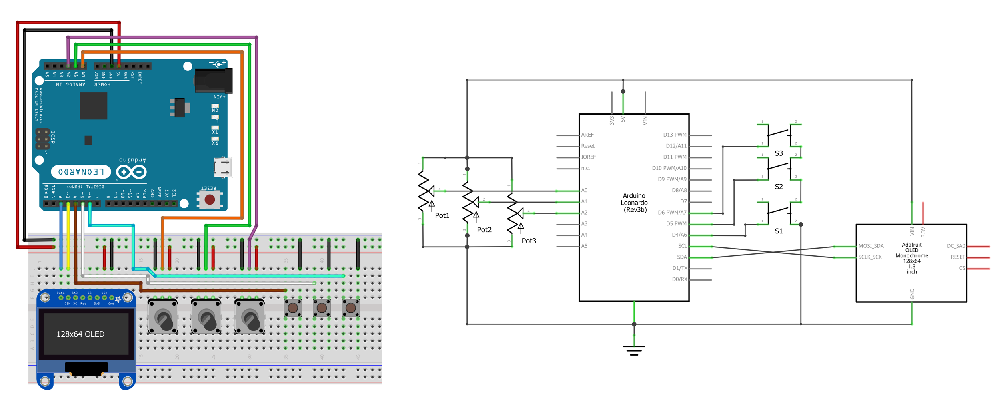
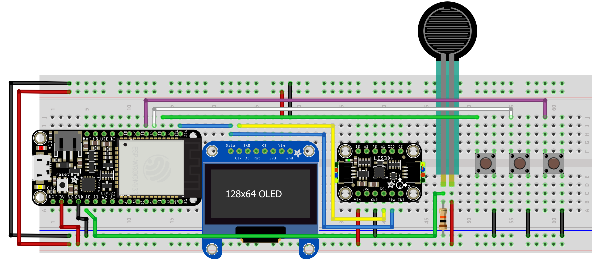
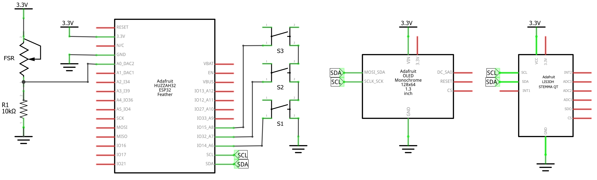
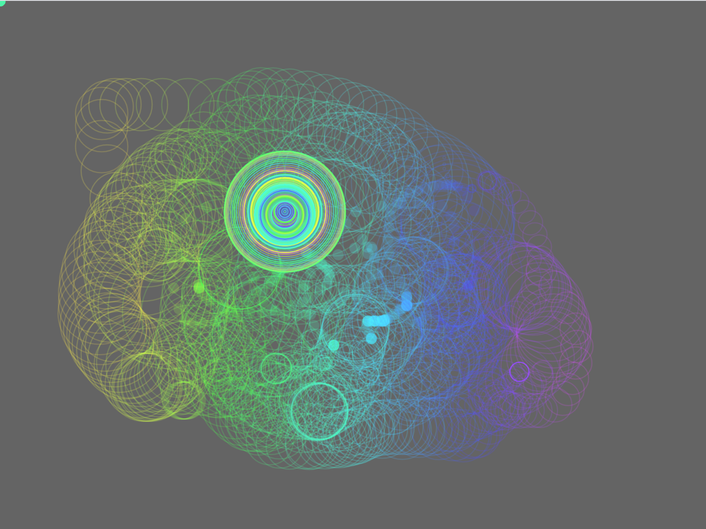
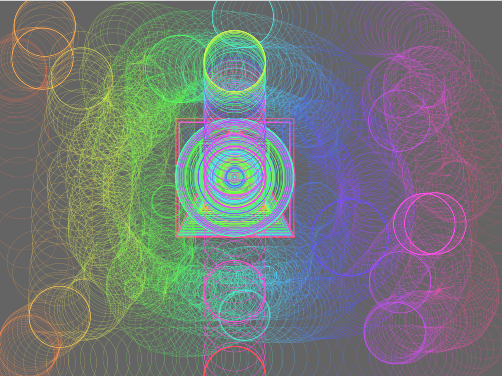
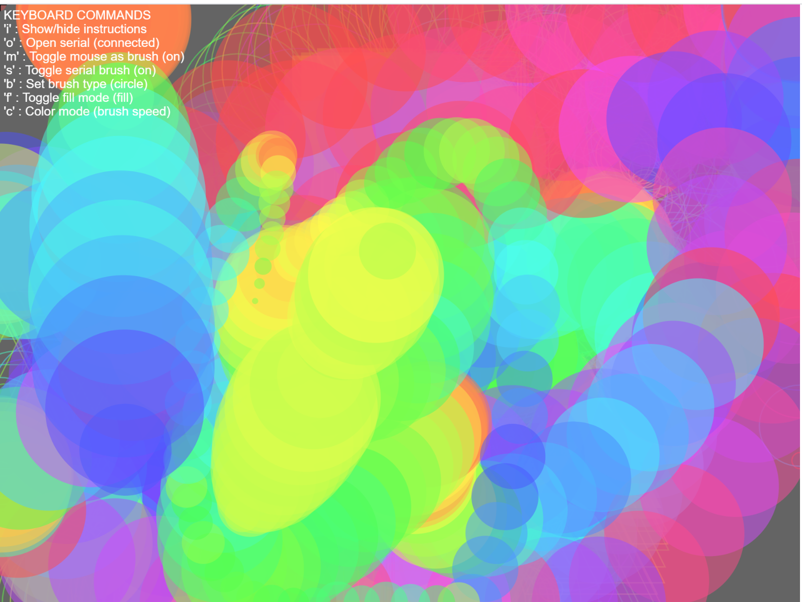
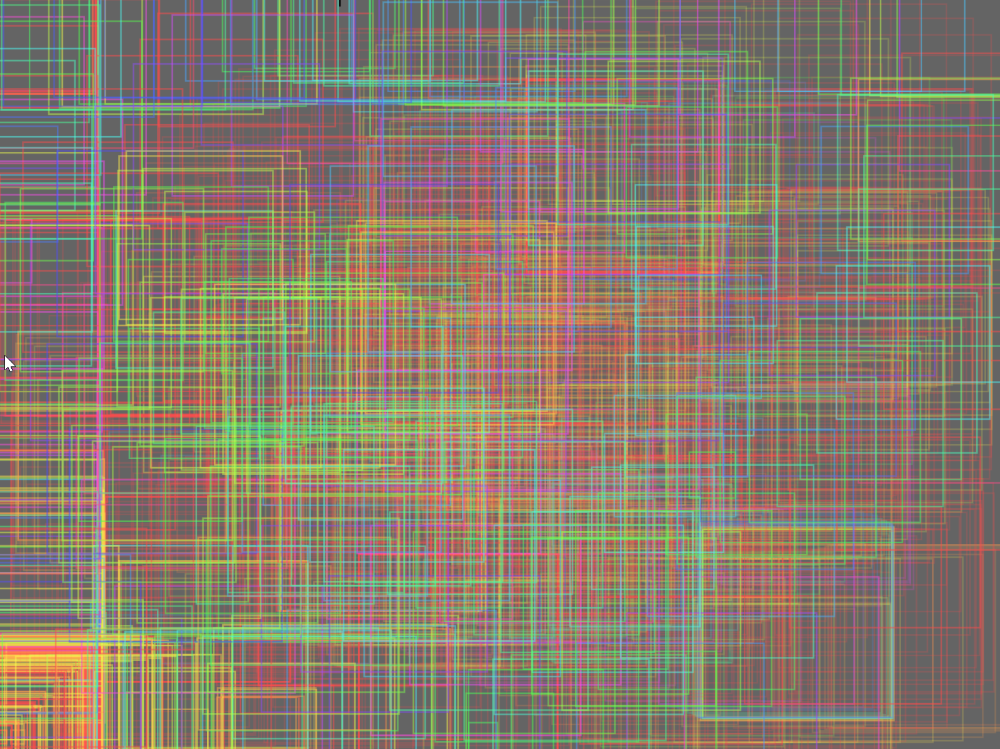

# {{ page.title }}
{: .no_toc }

## Table of Contents
{: .no_toc .text-delta }

1. TOC
{:toc}
---

In the past few lessons, we've learned about [serial communication](serial-intro.md), [web serial](web-serial.md), and using serial to create [p5.js](https://p5js.org/) + Arduino applications ([first lesson](p5js-serial.md), [second lesson](p5js-serial-io.md)). In this lesson, we're going to build on our growing knowledge and existing code to create a full end-to-end p5.js + Arduino application, which we'll call **PaintIO**. PaintIO includes a custom "paintbrush" controller with OLED display that controls and bidirectionally communicates with a custom painting application in p5.js.

<video autoplay loop muted playsinline style="margin:0px">
  <source src="assets/videos/PaintIO2-JustAHeart-TrimmedAndOptimized.mp4" type="video/mp4" />
</video>
**Video.** A quick demonstration of one PaintIO controller using the LIS3DH 3-axis accelerometer to set the paintbrush location, the paintbrush's speed to set the color, the force-sensitive resistor to set the brush size, and three buttons for changing the brush shape, the brush fill *vs.* outline, and for clearing the drawing. The controller also displays current brush properties like size, shape, and location on the OLED. The Arduino code is in our GitHub as [PaintIOAccel.ino](https://github.com/makeabilitylab/arduino/blob/master/Serial/PaintIOAccel/PaintIOAccel.ino). The p5.js app is here: [live page](https://makeabilitylab.github.io/p5js/WebSerial/p5js/PaintIO), [code](https://github.com/makeabilitylab/p5js/tree/master/WebSerial/p5js/PaintIO).
{: .fs-1 }

A painting app is a wonderfully fertile Physical Computing example and helps culminate our learning thus far because:
- There are many **different paint properties to control** such as paint brush size, speed, color, shape
- We can **explore** and **play** with different types of **sensors** and **hardware** **input** to control these properties
- Painting is an **openly creative** and **rich practice**—there are very few rules! And our custom hardware-based paintbrush" can directly influence *how* we paint and *what* we paint. From an interaction design perspective, this is exciting and fun!
- Finally, as we've already experienced, making a painting application in p5.js is **fairly easy** (and fun)! But how can we make it even more interesting with Arduino and custom input?

Previously, we created this [simple painting application](https://editor.p5js.org/jonfroehlich/embed/MSGdVYUle) in only ~20 lines of code (Impressive! Demonstrates the power of p5.js). In this app, the brush size is changed proportionally via mouse speed, the color is mapped to the mouse's x location, and you can mouse click to switch between fill *vs.* outline. Play with it below!

<iframe width="736" height="400" scrolling="no" src="https://editor.p5js.org/jonfroehlich/embed/MSGdVYUle"></iframe>
**Code.** A simple p5.js painting application in ~20 lines of code. You can view, edit, and play with it [here](https://editor.p5js.org/jonfroehlich/sketches/MSGdVYUle) via the p5.js online editor. In this lesson, we'll extend this example to include [web serial](web-serial.md) and a custom "paintbrush" controller.
{: .fs-1 }

In this lesson, we will build on this example but with a custom "paintbrush" controller and different interaction mappings to set brush properties. You will learn how to modularize and slowly build up a p5.js + Arduino application, how to draw using [offscreen buffers](https://p5js.org/reference/#/p5/createGraphics), how to use the [keyboard](https://p5js.org/reference/#/p5/keyPressed) for interaction, and how to think about and design application-level communication protocols between p5.js and Arduino.

## PaintIO Design Requirements

First, let's establish some design requirements for PaintIO. The app should:

- Have **bidirectional communication** between the Arduino and p5.js app. While the Arduino should serve as the primary painting input, we should be able to also change settings in p5.js, which should be immediately reflected on the controller

- At a minimum, the Arduino-based paintbrush controller should control paintbrush's **x,y location**, **size**, **shape**, and **fill mode** (fill vs. outline). These properties should sound familiar—we'll build directly on our previous lessons!

- The paintbrush controller must also include the **OLED** to provide feedback to our painter about the paintbrush. We're interested in dual-screen interaction and primary/secondary displays like Nintendo experimented with the [Wii U](https://en.wikipedia.org/wiki/Wii_U).

### Serial communication

Let's specify how we will meet these requirements using serial communication.

#### From Arduino to p5.js

From the Arduino to p5.js, we will transmit a comma-separated string as: `xPosFrac, yPosFrac, sizeFrac, brushType, brushFillMode` where:
- `xPosFrac` is a float between [0, 1] inclusive representing the brush's x position
- `yPosFrac` is a float between [0, 1] inclusive representing the brush's y position
- `sizeFrac` is a float between [0, 1] inclusive representing the brush's size
- `brushType` is either 0, 1, 2 corresponding to CIRCLE, SQUARE, TRIANGLE 
- `brushFillMode` is either 0, 1 corresponding to FILL, OUTLINE

We will also "echo back" received data for debugging purposes. We will prefix these echo backs with `#` as we did in our [previous lesson](p5js-serial-io.md#add-onserialdatareceived-parsing-code) to indicate to the p5.js app that these lines are for debugging. 

#### From p5.js to Arduino

As our app will be bidirectional, we will also communicate information from p5.js to Arduino. For this, we'll build off the [DisplayShapeBidirectionl](p5js-serial-io.md#displayshapebidirectional-p5js-to-arduino-and-arduino-to-p5js) example from the previous lesson and transmit a comma-separated string of `brushType, brushFillMode` where, again:
- `brushType` is either 0, 1, 2 corresponding to CIRCLE, SQUARE, TRIANGLE
- `brushFillMode` is either 0, 1 corresponding to FILL, OUTLINE

## PaintIO 1: Initial p5.js Application

As usual, let's start with a basic prototype and build outwardly. First, let's make a basic drawing p5.js application without any dependency on Arduino.

### Copy SerialTemplate and create initial PaintIO structure

Begin by copying [`SerialTemplate`](https://github.com/makeabilitylab/p5js/tree/master/WebSerial/p5js/SerialTemplate). If you're using VSCode, copy [`SerialTemplate`](https://github.com/makeabilitylab/p5js/tree/master/WebSerial/p5js/SerialTemplate) and rename the folder to `PaintIO`. If you're using the p5.js online editor, simply open this project, [Serial Template](https://editor.p5js.org/jonfroehlich/sketches/vPfUvLze_C), and rename your project to `PaintIO`.

In `sketch.js`, scroll down and remove the following. We will use a different approach to connect to serial.


function mouseClicked() {
  if (!serial.isOpen()) {
    serial.connectAndOpen(null, serialOptions);
  }
}


Also comment out this line of code in `setup()`, which attempts to automatically connect with previously approved serial devices:


// serial.autoConnectAndOpenPreviouslyApprovedPort(serialOptions);


We want to ignore anything serial related for now.

### Add in and initialize painting variables

For the painting code, we will use similar variables and drawing code from [DisplayShapeBidirectional](https://github.com/makeabilitylab/p5js/tree/master/WebSerial/p5js/DisplayShapeBidirectional) in our [previous lesson](p5js-serial-io.md#displayshapebidirectional-p5js-to-arduino-and-arduino-to-p5js). But we'll build this anew.

Add in the following global variables, which include the current `brushType`, `brushSize`, `brushFillMode`, `brushColor`, and brush location (`brushX`, `brushY`). Additionally, rather than paint directly to the canvas, we'll use an off-screen graphics buffer called `offscreenGfxBuffer`—so declare that too. We'll talk more about that next.  


let mapBrushTypeToShapeName = {
  0: "Circle",
  1: "Square",
  2: "Triangle"
};

let mapBrushFillMode = {
  0: "Fill",
  1: "Outline",
};

const MAX_BRUSH_SIZE = 150; // the maximum brush size

let brushType = 0;      // Circle as default
let brushFillMode = 0;  // Fill as default
let brushSize = 50;     // Initial brush size
let brushX = 0;         // Current brush x location (in pixel coordinates)
let brushY = 0;         // Current brush y location (in pixel coordinates)
let brushColor;         // Current brush color
 
let lastBrushX = 0;     // Last brush y position (similar to pmouseX but for the brush)
let lastBrushY = 0;     // Last brush y position (similar to pmouseY but for the brush)

let showInstructions = true; // If true, shows the app instructions on the screen

// We will paint to an offscreen graphics buffer
// See: https://p5js.org/reference/#/p5/createGraphics
let offscreenGfxBuffer;


Because we cannot use any p5.js constructs or functions until `setup()` is called, we need to initialize `brushColor` and `offscreenGfxBuffer` in `setup()`. If we try to initialize them at declaration, the p5.js online editor is smart enough to catch this and hint at the problem:

```
🌸 p5.js says: There's an error due to "color" not being defined in the current scope (on line 116 in about:srcdoc [about:srcdoc:116:18]).

If you have defined it in your code, you should check its scope, spelling, and letter-casing (JavaScript is case-sensitive). For more:
https://p5js.org/examples/data-variable-scope.html
https://developer.mozilla.org/docs/Web/JavaScript/Reference/Errors/Not_Defined#What_went_wrong 
Did you just try to use p5.js's color() function? If so, you may want to move it into your sketch's setup() function.

For more details, see: https://github.com/processing/p5.js/wiki/p5.js-overview#why-cant-i-assign-variables-using-p5-functions-and-variables-before-setup 
```


**Figure.** You cannot use any p5.js functions or classes before `setup()` has been called. If you do, you'll likely receive an error like the above where we tried to use [`color()`](https://p5js.org/reference/#/p5/color) during a global variable declaration. The specific error says: "Did you just try to use p5.js's color() function? If so, you may want to move it into your sketch's setup() function. For more details, see the [p5.js wiki](https://github.com/processing/p5.js/wiki/p5.js-overview#why-cant-i-assign-variables-using-p5-functions-and-variables-before-setup)"
{: .fs-1 }

So, instead, initialize them in `setup()`:


function setup() {
  ...
  // Initialize the brush color to a ~white with a ~20% opacity (50/255 is 19.6%)
  brushColor = color(250, 250, 250, 50);
  
  // Rather than storing individual paint strokes + paint properties in a
  // data structure, we simply draw immediately to an offscreen buffer
  // and then show this offscreen buffer on each draw call
  // See: https://p5js.org/reference/#/p5/createGraphics
  offscreenGfxBuffer = createGraphics(width, height);
  offscreenGfxBuffer.background(100); 
}


The [`createGraphics()`](https://p5js.org/reference/#/p5/createGraphics) function let's us create a new offscreen graphics buffer. The function returns a new [p5.Renderer](https://p5js.org/reference/#/p5.Renderer) object, which has the same drawing API as core p5.js. So, if we want to set the background of the offscreen buffer, we would write `offscreenGfxBuffer.background(100);`. If we want to draw a red circle at pixel coordinate `10, 10` with a diameter of 50 on the offscreen buffer, we would write: 


offscreenGfxBuffer.fill(255, 0, 0);    // set fill color in offscreen graphics context to red
offscreenGfxBuffer.circle(10, 10, 50); // draw the circle to the offscreen buffer.


And so on. We can make the offscreen buffer any size but, in this case, we want it the same size as our canvas, so we pass the canvas  `width` and `height` in the `createGraphics()` call.

### Add in painting code

In the `draw()` method, we will draw brush strokes to the offscreen buffer and then draw this buffer to canvas.


function draw() {
  // Draw the current brush stroke at the given x, y position
  // But we don't draw to canvas, we draw to the offscreenGfxBuffer
  drawBrushStroke(mouseX, mouseY);
  
  // Draw the offscreen buffer to the screen
  image(offscreenGfxBuffer, 0, 0);
}


Obviously, we also need to add the `drawBrushStroke()` method, which should feel familiar and understandable from [previous lessons](p5js-serial-io.md). The only difference is that we are drawing to the offscreen buffer object `offscreenGfxBuffer`. 


function drawBrushStroke(xBrush, yBrush){
  // set the fill and outline brush settings
  if (brushFillMode == 0) { // brushFillMode 0 is fill
    offscreenGfxBuffer.fill(brushColor);
    offscreenGfxBuffer.noStroke();
  } else { // brushFillMode 0 is outline
    offscreenGfxBuffer.stroke(brushColor);
    offscreenGfxBuffer.noFill();
  }

  // draw the specific brush shape depending on brushType
  let xCenter = xBrush;
  let yCenter = yBrush;
  let halfShapeSize = brushSize / 2;
  switch (brushType) {
    case 0: // draw circle
      offscreenGfxBuffer.circle(xCenter, yCenter, brushSize);
      break;
    case 1: // draw square
      // Draw rectangle based on center coordinates
      offscreenGfxBuffer.rectMode(CENTER);
      offscreenGfxBuffer.square(xCenter, yCenter, brushSize);
      break;
    case 2: // draw triangle
      let x1 = xCenter - halfShapeSize;
      let y1 = yCenter + halfShapeSize;

      let x2 = xCenter;
      let y2 = yCenter - halfShapeSize;

      let x3 = xCenter + halfShapeSize;
      let y3 = y1;

      offscreenGfxBuffer.triangle(x1, y1, x2, y2, x3, y3)
  }
}


### Why use an offscreen buffer?

But **why** are we using an offscreen buffer? For simplicity and rendering speed!

In short, using an offscreen buffer let's us render individual paint strokes once and only once and still draw stuff over it, like onscreen instructions, a crosshair cursor, *etc.*

<!-- We are going to put all "painting" related rendering into the offscreen buffer and then we can still draw stuff over it, like onscreen instructions or a crosshair cursor, *etc.* -->

It's common to use offscreen graphics (or frame) buffers in gaming and visualization code because it let's us draw computationally complex objects once—to a buffer—and then simply render this buffer whenever we need that object drawn again. As one example, this [sound visualizer](https://editor.p5js.org/jonfroehlich/sketches/d2euV09i) computes real-time sound processing on incoming microphone data and draws a variety of real-time visualizations, including scrolling waveforms and spectrograms—both which render sound data for a given sound sample buffer once and only once to an offscreen graphics buffer and then simply add new graphics to that buffer over time. 

In our case, we could create a data structure—say a `PaintStroke` class that takes in a x,y position, brush color, and all of the other brush-related properties—to store individual paint strokes in an array. For each new paint operation (*i.e.,* each new circle, square, or triangle drawn), we would create a corresponding `PaintStroke` object and store it in this array. And then, on each new `draw()` call, we would iterate through these `PaintStroke` objects and perform the appropriate p5.js draw operations. However, as the number of paint strokes grow, our rendering speed would decrease! And it's inefficient to keep redrawing the same paint stroke over-and-over. So, instead, we draw each paint operation once and only once to the offscreen buffer!

Note that tracking and storing `PaintStroke` objects is **not** mutually exclusive to using an offscreen buffer for rendering. We could still do this to support operations like undo/redo, change previously drawn strokes, *etc.* (and if we did this, then an undo/redo operation would cause us to loop through all `PaintStrokes` and redraw them).

<!-- We can also have many simultaneous offscreen graphics buffers and then use various blending algorithms to combine them. -->

<!-- 

It's simply an easy approach for us to "store" all of the painting operations thus far that the user has performed. Alternatively, we could create a data structure—say a `PaintStroke` class that takes in a x,y position, brush color, and all of the other brush-related properties—to store individual paint strokes in an array. For each new paint operation (*i.e.,* each new circle, square, or triangle drawn), we would create a corresponding `PaintStroke` object and store it in this array. And then, on each new `draw()` call, we would iterate through these `PaintStroke` objects and perform the appropriate p5.js draw operations. This object-oriented approach has many benefits: you could support undo/redo (by removing parts of the array), you could "change" previously drawn strokes, *etc.* In fact, you could certainly combine both approaches—they are not mutually exclusive. -->

### Add in on-screen instructions

Because we're using this offscreen graphics buffer, it's easy to draw a "layer" on top of the user's painting with other graphics—in this case, user instructions. Crucially, unlike the paint strokes, we are **not** drawing these instructions to the offscreen buffer but rather directly onto the canvas.


function drawInstructions(){
  // Some instructions to the user
  noStroke();
  fill(255);
  let tSize = 10;

  textSize(tSize);
  let yText = 2;
  let yBuffer = 1;
  let xText = 3;
  text("KEYBOARD COMMANDS", xText, yText + tSize);
  yText += tSize + yBuffer;
  text("'i' : Show/hide instructions", xText, yText + tSize);
  
  yText += tSize + yBuffer;
  text("'l' : Clear the screen", xText, yText + tSize);
  
  yText += tSize + yBuffer;
  let strBrushType = "'b' : Set brush type (" + mapBrushTypeToShapeName[brushType] + ")";
  text(strBrushType, xText, yText + tSize);
  
  yText += tSize + yBuffer;
  let strToggleFillMode = "'f' : Toggle fill mode (" + mapBrushFillMode[brushFillMode] + ")";
  text(strToggleFillMode, xText, yText + tSize);
}


Let's go back to our `draw()` function and add in the call to `drawInstructions()` but only if `showInstructions` is enabled. And note how this `drawInstructions()` call must come after drawing the offscreen buffer to the screen. That way, it will be "layered" on top.


function draw() {
  // Draw the current brush stroke at the given x, y position
  // But we don't draw to canvas, we draw to the offscreenGfxBuffer
  drawBrushStroke(mouseX, mouseY);
  
  // Draw the offscreen buffer to the screen
  image(offscreenGfxBuffer, 0, 0);
  
  // Check to see if we are supposed to draw our instructions
  if(showInstructions){
    drawInstructions();
  }
}


### Hook up keyboard commands

If you carefully read the instruction code above, you may have noticed that we are going to listen for particular keyboard keys to control different properties and behaviors of our PaintIO program. We'll use the following key mappings:

- The **i** key will show/hide instructions
- The **l** key (lowercase L) will clear the screen
- The **b** key will iterate through brush shapes (CIRCLE, SQUARE, TRIANGLE)
- The **f** key will iterate through fill mode types (FILL, OUTLINE)

We'll implement keyboard support via the [`keyPressed()`](https://p5js.org/reference/#/p5/keyPressed) method, which is called once every time a key is pressed.


function keyPressed() {
  let lastFillMode = brushFillMode;
  let lastBrushType = brushType;
  print("keyPressed", key);
  if(key == 'f'){
    brushFillMode++;
    if (brushFillMode >= Object.keys(mapBrushFillMode).length) {
      brushFillMode = 0;
    }
  }else if(key == 'b'){
    brushType++;
    if (brushType >= Object.keys(mapBrushTypeToShapeName).length) {
      brushType = 0;
    }
  }else if(key == 'i'){
    showInstructions = !showInstructions;
  }else if(key == 'l'){
    // To clear the screen, simply "draw" over the existing
    // graphics buffer with an empty background
    offscreenGfxBuffer.background(100);
  }
}


To clear the screen, notice how we simply overwrite the current graphics buffer with a solid background of a given color (grayscale 100 in this case): the `offscreenGfxBuffer.background(100)` call.

### A fully functional grayscale drawing app

Here's what we have so far. A grayscale drawing app that has a fixed brush size but multiple brush types (circle, square, triangle)—selectable by the `b` key—and fill types (fill, outline)—selectable by the `f` key. You can also clear the screen with the `l` key and show/hide the instructions with `i`. Try it out below or open the code in the p5.js online editor [here](https://editor.p5js.org/jonfroehlich/sketches/bl5o1BeZd) to view, edit, and play with the code yourself!

<iframe width="736" height="400" scrolling="no" src="https://editor.p5js.org/jonfroehlich/embed/bl5o1BeZd"></iframe>
**Code.** You need to click on the gray canvas to give it "focus" in order for the keyboard commands to work. You can view, edit, and play with the code in the [p5.js online editor](https://editor.p5js.org/jonfroehlich/sketches/bl5o1BeZd).
{: .fs-1 }

## PaintIO 2: Adding in Arduino

We made an initial mouse-based painting application in p5.js (woohoo!) but it lacks support for our custom "paintbrush" controller and, in fact, we haven't even built or discussed this controller (boo!).

Continuing our simplicity and step-by-step construction themes: let's build an initial "paintbrush" controller that provides only **x, y** brush location data (normalized as floats between [0, 1]). Initially, the controller will be input-only—that is, it communicates unidirectionally over serial from the Arduino to the p5.js app.

We need to update our p5.js application to support serial and to parse incoming data from our "paintbrush" controller and design and build said "paintbrush" controller in Arduino. Let's do it!

<video autoplay loop muted playsinline style="margin:0px">
  <source src="assets/videos/PaintIO-Grayscale-TwoPots-SayHi-Optimized.mp4" type="video/mp4" />
</video>
**Video.** Here's a sneak peak of the initial p5.js + Arduino app, which we will further develop in this lesson. Yes, I'm trying to write "Hi!". It's like an etch-a-sketch. :) This p5.js code version is available as [Paint I/O 2 - Web Serial](https://editor.p5js.org/jonfroehlich/sketches/NxUaI2hnT) and the Arduino code is [XYAnalogOut.ino](https://github.com/makeabilitylab/arduino/blob/master/Serial/XYAnalogOut/XYAnalogOut.ino) on GitHub.
{: .fs-1 }

### Updating PaintIO on the p5.js side to support serial

To update our p5.js PaintIO application to support web serial, we need to accomplish four steps:

- Add in a **serial connect** and **open** sequence
- Update our **on-screen instructions** to explain how to connect to serial (by hitting `o` key)
- Add in **parsing code **that parses incoming paintbrush controller data
- **Update drawing code **to utilize parsed x,y brush location from serial data

#### Add serial connect and open sequence

In previous lessons we were capturing mouse clicks to initiate serial connections. Here, we will use the keyboard—specifically, the `o` key. So, let's update the `keyPressed()` function to look for the `o` key and then call `serial.connectAndOpen()`.


function keyPressed(){
  ...
  }else if(key == 'o'){
    if (!serial.isOpen()) {
      serial.connectAndOpen(null, serialOptions);
    }
  }
}


#### Update on-screen instructions

And add in the corresponding instructions:


function drawInstructions(){
  ...
  yText += tSize + yBuffer;
  let strConnectToSerial = "'o' : Open serial (";
  if(serial.isOpen()){
    strConnectToSerial += "connected";
  }else{
    strConnectToSerial += "not connected";
  }
  strConnectToSerial += ")";
  text(strConnectToSerial, xText, yText + tSize);
  ...
}


#### Parse serial data

Update the `onSerialDataReceived()` function to parse incoming data and set the variables `brushX` and `brushY`, which hold the brush's x,y coordinates in pixels as well as `lastBrushX` and `lastBrushY`, which track the previous x,y locations (similar to p5.js's [`pmouseX`](https://p5js.org/reference/#/p5/pmouseX) and [`pmouseY`](https://p5js.org/reference/#/p5/pmouseY)):


function onSerialDataReceived(eventSender, newData) {
  //console.log("onSerialDataReceived", newData);
  pHtmlMsg.html("onSerialDataReceived: " + newData);

  if(!newData.startsWith("#")){
    let startIndex = 0;
    let endIndex = newData.indexOf(",");
    if(endIndex != -1){
      // Parse x location (normalized between 0 and 1)
      let strBrushXFraction = newData.substring(startIndex, endIndex).trim();
      let xFraction = parseFloat(strBrushXFraction);

      // Parse y location (normalized between 0 and 1)
      startIndex = endIndex + 1;
      endIndex = newData.indexOf(",", startIndex);
      let strBrushYFraction = newData.substring(startIndex, endIndex).trim();
      let yFraction = parseFloat(strBrushYFraction);

      // Set relevant global variables for brush x,y location in pixels
      lastBrushX = brushX;
      lastBrushY = brushY;

      brushX = xFraction * width;
      brushY = yFraction * height;
    }
  }
}


#### Update drawing code to use brush x,y

Currently, we are only drawing brush strokes at the current `mouseX` and `mouseY` position. Let's also now draw brush strokes at the current `brushX` and `brushY` position, which are set by the Arduino-based paintbrush controller. 

A keen reader will note that we are now calling `drawBrushStroke()` **twice**: once for mouse input and once for our Arduino-based controller input. Yes, that's true. But bimanuel interaction with two controllers has a long history in HCI (see Engelbart's [Mother of All Demos](https://youtu.be/yJDv-zdhzMY?t=2115) from 1968) and opens up many fruitful interaction possibilities! Later, we'll make the mouse as a paintbrush toggleable. 


function draw() {
  
  // Draw the current brush stroke at the given mouse x, y position
  drawBrushStroke(mouseX, mouseY);
  
  // Check if serial is open. If so, use brushX, brushY data
  if(serial.isOpen()){
    // Draw current brush stroke at current brush x,y position (from serial)
    drawBrushStroke(brushX, brushY);
  }
  
  // Draw the offscreen buffer to the screen
  image(offscreenGfxBuffer, 0, 0);
  
  // Check to see if we are supposed to draw our instructions
  if(showInstructions){
    drawInstructions();
  }
}


And that's it. The full code is available in the p5.js online editor as [Paint I/O 2 - Web Serial](https://editor.p5js.org/jonfroehlich/sketches/NxUaI2hnT).

### Building the paintbrush controller

Now that we completed an initial PaintIO app with serial input support, it's time to build the custom Arduino-based paintbrush controller. Recall that initially, we will simply transmit x,y brush location information from Arduino to p5.js. We could really use any analog input sensor we want for this but for simplicity, we will start with our handy and reliable [potentiometer](../arduino/potentiometers.md).

#### The initial paintbrush controller circuit


**Figure.** The initial paint brush controller with two potentiometers controlling the x- and y-location of the brush, respectively.
{: .fs-1 }

#### Initial paintbrush controller code

The Arduino code is simple: read from the two analog input pins, normalize these readings between [0, 1] (inclusive), and transmit them over serial as a comma-separated string.


const int X_ANALOG_INPUT_PIN = A0;
const int Y_ANALOG_INPUT_PIN = A1;

// On the Arduino Uno/Leonardo, there is a 10-bit ADC so the
// maximum analog value is 1023. On other microcontrollers, like the ESP32,
// there is a 12-bit ADC, so the maximum analog value is 4095
const int MAX_ANALOG_VAL = 1023; 

const long BAUD_RATE = 115200;
void setup() {
  Serial.begin(BAUD_RATE);
}

void loop() {
  // Read the analog values
  int xAnalogVal = analogRead(X_ANALOG_INPUT_PIN);
  int yAnalogVal = analogRead(Y_ANALOG_INPUT_PIN);

  // Calculate normalized x,y location
  _x = xAnalogVal / (float)MAX_ANALOG_VAL;
  _y = yAnalogVal / (float)MAX_ANALOG_VAL;

  // Transmit over serial as comma-separated string
  Serial.print(_x, 4);
  Serial.print(", ");
  Serial.println(_y, 4);
  
  delay(10);
}


**Code.** This code is available in our GitHub as [XYAnalogOut.ino](https://github.com/makeabilitylab/arduino/blob/master/Serial/XYAnalogOut/XYAnalogOut.ino). You can also see the OLED-based variant as [XYAnalogOutOLED.ino](https://github.com/makeabilitylab/arduino/blob/master/Serial/XYAnalogOutOLED/XYAnalogOutOLED.ino).
{: .fs-1 }

### Test and play with the initial end-to-end app!

We did it! Now, it's time to test and play with it.

<video autoplay loop muted playsinline style="margin:0px">
  <source src="assets/videos/PaintIO-Grayscale-TwoPots-KeyboardCommands-Optimized.mp4" type="video/mp4" />
</video>
**Video.** An initial PaintIO p5.js + Arduino app. We are using the two potentiometers to set the brush's x,y location (the brush size is fixed) and the laptop keyboard to switch between brush types (`b` key) and fill modes (`f` key). The p5.js code is available as [Paint I/O 2 - Web Serial](https://editor.p5js.org/jonfroehlich/sketches/NxUaI2hnT) and the Arduino code is [XYAnalogOut.ino](https://github.com/makeabilitylab/arduino/blob/master/Serial/XYAnalogOut/XYAnalogOut.ino) on GitHub.
{: .fs-1 }

### Upgrading our Arduino controller with OLED

As we're interested in exploring dual-screen interaction, let's add in an [OLED](../advancedio/oled.md) to our paintbrush controller—this way, the painter can get real-time, at-a-glance information about the paintbrush on the controller itself. For now, we will only show the paintbrush location. But we'll add more information as our app progresses.

#### Basic paintbrush controller with OLED


**Figure.** Same two-pot circuit as before but with an OLED display.
{: .fs-1 }

#### Update code to show x,y location of brush on OLED

Now, let's update our Arduino code to show the x,y location of the brush on the OLED. This will prove useful when we add in dynamic brush sizes and our brush is small in the p5.js app. The full code is in GitHub as [XYAnalogOutOLED.ino](https://github.com/makeabilitylab/arduino/blob/master/Serial/XYAnalogOutOLED/XYAnalogOutOLED.ino); however, the relevant bit is simply:


void loop(){
  ...

  // Calculate normalized x,y location
  _x = xAnalogVal / (float)MAX_ANALOG_VAL;
  _y = yAnalogValal2 / (float)MAX_ANALOG_VAL;

  // Set new circle location based on accel
  int xBall = _radius + _x * _display.width() - 2 * _radius;
  int yBall = _radius + _y * _display.height() - 2 * _radius;

  // Display this normalized location to screen
  _display.setCursor(0, 0);
  _display.println("Normalized x,y:");
  _display.print("X: ");
  _display.println(_x, 4);
  _display.print("Y: ");
  _display.print(_y, 4);

  _display.fillCircle(xBall, yBall, _radius, SSD1306_WHITE);

  // Render buffer to screen
  _display.display();

  ...
}


**Code.** The full code is in our GitHub as [XYAnalogOutOLED.ino](https://github.com/makeabilitylab/arduino/blob/master/Serial/XYAnalogOutOLED/XYAnalogOutOLED.ino).
{: .fs-1 }

### Video demonstration of initial PaintIO app

<video autoplay loop muted playsinline style="margin:0px">
  <source src="assets/videos/PaintIO-Grayscale-TwoPots-Optimized.mp4" type="video/mp4" />
</video>
**Video.** Here, we're using the same p5.js code as before ([Paint I/O 2 - Web Serial](https://editor.p5js.org/jonfroehlich/sketches/NxUaI2hnT)) but with an updated Arduino circuit (with OLED) and code to show brush position. Notice how as we move the brush via the two potentiometers, the brush's position also shows on the OLED. We are also printing out the normalized x,y position on the OLED for debugging. The Arduino code is on GitHub as [XYAnalogOutOLED.ino](https://github.com/makeabilitylab/arduino/blob/master/Serial/XYAnalogOutOLED/XYAnalogOutOLED.ino).
{: .fs-1 }

<!-- Also supports bimanual interaction:

TODO: insert video. -->

<!-- TODO: possibly also show the SharpIR sensor as brush input? -->

## PaintIO 3: Adding in bidirectionality

Now that we have a basic end-to-end painting application with a custom input controller, let's add some additional creative paint features, which will require updating both the p5.js and the Arduino apps:

- **Bidirectional communication:** Allow the painter to set the brush type and fill mode both in p5.js and on the paint controller.
- **Support four incoming brush properties**: From the Arduino to p5.js, we will receive a comma-separated string for the brush location, size, type, and fill mode: `xPosFrac, yPosFrac, sizeFrac, brushType, brushFillMode`.
- **Support clear screen signal**: We want the painter to be able to trigger a clear screen using the paintbrush. 
- **Display brush properties on OLED:** Currently, we only show a representation of the brush's location on the OLED. Let's improve this to show other brush information such as the brush type, size, and fill mode.
- **Color:** We could also receive explicit color information from the Arduino. For now, however, let's simply set the color based on the brush's size.

You could certainly add in more features like custom input hardware to control the brush color, brush opacity, outline thickness, *etc.* And feel free to do so! But we'll focus on the above points for now.

Here's a sneak peek!

<video autoplay loop muted playsinline style="margin:0px">
  <source src="assets/videos/PaintIO-FullPotController-PaintingWithShapes-1200w.mp4" type="video/mp4" />
</video>
**Video.** A sneak peek of the p5.js app [Paint I/O 3 - Bidirectional with Color](https://editor.p5js.org/jonfroehlich/sketches/GOvMjQr6y) with the Arduino sketch [PaintIO.ino](https://github.com/makeabilitylab/arduino/blob/master/Serial/PaintIO/PaintIO.ino).
{: .fs-1 }

### Updating the p5.js application

As noted above, our p5.js PaintIO app should now support four incoming brush properties: `xPosFrac, yPosFrac, sizeFrac, brushType, brushFillMode`, which are described in [detail here](p5js-paint-io.md#from-arduino-to-p5js). Additionally, when the user hits the `b` key (to change the brush type) or the `f` key (to change the fill mode), we want to communicate that information back to the Arduino so our paintbrush controller and OLED screen stays in sync.

#### Parsing additional brush properties and clear screen

Let's begin by updating our parsing code to support the four incoming brush properties and the "clear screen" command. For the latter, let's say that incoming serial data text that starts with "cls" triggers a clear screen. We need to check for this in addition to lines that start with "#", which indicate debugging lines.

Update the `onSerialDataReceived()` function:


function onSerialDataReceived(eventSender, newData) {
  pHtmlMsg.html("onSerialDataReceived: " + newData);

  if(!newData.startsWith("#")){ // ignore debug lines
    if(newData.toLowerCase().startsWith("cls")){ // check for clear screen
      offscreenGfxBuffer.background(100);
    }else{
      parseBrushData(newData); // otherwise parse brush data
    }
  }
}


And then add in the `parseBrushData()` function to parse `xPosFrac` as a float between [0, 1], `yPosFrac` as a float between [0, 1], `sizeFrac` as a float between [0, 1], `brushType` as a 0, 1, 2 corresponding to CIRCLE, SQUARE, TRIANGLE, and `brushFillMode` corresponding to FILL *vs.* OUTLINE.


function parseBrushData(newData){
  // The format is xPosFrac, yPosFrac, sizeFrac, brushType, brushFillMode
  let startIndex = 0;
  let endIndex = newData.indexOf(",");
  if(endIndex != -1){
    let strBrushXFraction = newData.substring(startIndex, endIndex).trim();
    let xFraction = parseFloat(strBrushXFraction);

    startIndex = endIndex + 1;
    endIndex = newData.indexOf(",", startIndex);
    let strBrushYFraction = newData.substring(startIndex, endIndex).trim();
    let yFraction = parseFloat(strBrushYFraction);

    startIndex = endIndex + 1;
    endIndex = newData.indexOf(",", startIndex);
    let strBrushSizeFraction = newData.substring(startIndex, endIndex).trim();
    let brushSizeFraction = parseFloat(strBrushSizeFraction);

    startIndex = endIndex + 1;
    endIndex = newData.indexOf(",", startIndex);
    let strBrushType = newData.substring(startIndex, endIndex).trim();
    let newBrushType = parseInt(strBrushType);

    startIndex = endIndex + 1;
    //endIndex = newData.indexOf(",", startIndex);
    endIndex = newData.length;
    let strBrushDrawMode = newData.substring(startIndex, endIndex).trim();
    let newBrushDrawMode = parseInt(strBrushDrawMode);

    // If data valid, set new shape type
    if (newBrushType in mapBrushTypeToShapeName) {
      brushType = newBrushType;
    }

    // if shape draw mode valid, set new draw mode
    if (newBrushDrawMode in mapBrushFillMode) {
      brushFillMode = newBrushDrawMode;
    }

    lastBrushX = brushX;
    lastBrushY = brushY;

    brushX = xFraction * width;
    brushY = yFraction * height;
    
    brushSize = MAX_BRUSH_SIZE * brushSizeFraction;
  }
}


#### Transmit brush type and fill mode

We support changing the brush type and fill mode both through keyboard commands as well as the paintbrush controller. Consequently, we have to keep the two apps (p5.js and Arduino) in sync. Thus, when we use the keyboard to change the brush type or fill mode, we need to transmit that info over serial to the paintbrush controller.

Add in a method called `serialWriteShapeData`, which is similar to what we had in [our previous lesson](p5js-serial-io.md) on bidirectional serial communication.


async function serialWriteShapeData(shapeType, shapeDrawMode) {
  if (serial.isOpen()) {
    let strData = shapeType + "," + shapeDrawMode;
    serial.writeLine(strData);
  }
}


And then call this function from `keyPressed()`, when necessary:


function keyPressed() {
  ...
  if(lastFillMode != brushFillMode || lastBrushType != brushType){
    serialWriteShapeData(brushType, brushFillMode);
  }
}


#### Adding color

Now, let's add some color. We'll explore a few different color mappings in a bit. For now, let's simply map the hue to the brush size. The easiest way to control hue is to switch the `colorMode` from the default, which is RGB, to [HSB](https://en.wikipedia.org/wiki/HSL_and_HSV) (or sometimes called HSB, for hue saturation, value). We can do this via the [`colorMode(HSB)`](https://p5js.org/reference/#/p5/colorMode) function, which also let's us specify a max value for hue (H), saturation (S), brightness (B), and alpha (A). By default, this range is 360, 100, 100, 1, respectively, for HSB and 255, 255, 255, 255 for RGBA. For simplicity, we'll make the max value 1 for HSBA. For more on HSB and its benefits, read this [Wikipedia article](https://en.wikipedia.org/wiki/HSL_and_HSV).

But, in short, we're using HSB to more easily control hue.

In `setup()`, add the following:


function setup(){
  ...
  // Set color mode to HSB with each value ranging from 0 to 1
  colorMode(HSB, 1, 1, 1, 1)

  // Set initial brush color
  brushColor = color(1, 0, 1, 0.18);
  ...
}


Then, in draw, dynamically set the hue based on brush size:

function draw() {
  
  // Set brush color
  let hue = map(brushSize, 0, MAX_BRUSH_SIZE, 0, 1);
  brushColor = color(hue, 0.7, 1, 0.2);

  ...
}


That's it. You can view, edit, and play with this new version of our PaintIO app [here](https://editor.p5js.org/jonfroehlich/sketches/GOvMjQr6y).

### Update paintbrush controller

Now, we need to update the paintbrush controller to:
- Control the brush location, size, type, and fill mode
- Display brush information on the OLED

#### Update paintbrush circuit

For the hardware controls themselves, we again can use anything we want! To keep things simple for this example, we will use:
- As before, potentiometers on A0 and A1 to control the brush's x and y location, respectively
- A potentiometer on A2 to control the brush's size
- Three buttons for changing the brush shape, fill mode, and to clear the screen


**Figure.** A wiring diagram for the full paintbrush controller with three potentiometers on A0, A1, and A2 to control the brush's location (x,y) and size, respectively and three buttons for changing the brush shape, fill mode, and to clear the screen. Image made in Fritzing and PowerPoint.
{: .fs-1 }

#### Update paintbrush code

For the code, we need to update our paintbrush controller to:

- Read A0, A1, and A2 for the brush's x, y location and size and normalize the values to [0, 1]
- Read GPIO pins 4, 5, 6 to iterate brush shape and fill mode and to clear the screen
- Transmit these values over serial
- Read the serial input stream and parse out the brush shape and fill mode
- Draw brush-related info toe the OLED, including the brush's location and size

Rather than walk through this code piece-by-piece, we will simply link to it on GitHub as [PaintIO.ino](https://github.com/makeabilitylab/arduino/blob/master/Serial/PaintIO/PaintIO.ino). The code itself is essentially a culmination of the last few serial lessons—so it should be relatively straightforward (even if a bit lengthy). Feel free to ask questions!

<!-- TODO: consider providing a zoomed in view of the OLED screen here? -->

### Video demonstration of bidirectional PaintIO

And a quick video demonstration of everything working together!

<video autoplay loop muted playsinline style="margin:0px">
  <source src="assets/videos/PaintIO-FullPotController-PaintingWithPotAndMouseSimultaneously2-StaticShapes-Optimized.mp4" type="video/mp4" />
</video>
**Video.** A video demonstration of the p5.js app [Paint I/O 3 - Bidirectional with Color](https://editor.p5js.org/jonfroehlich/sketches/GOvMjQr6y) with the Arduino sketch [PaintIO.ino](https://github.com/makeabilitylab/arduino/blob/master/Serial/PaintIO/PaintIO.ino). 
{: .fs-1 }

## PaintIO 4: Final PaintIO App

We made a few small updates to PaintIO to create a final prototype application, which includes support for:
- Turning on and off the mouse as a brush by hitting the `m` key
- Toggling the Arduino-based brush by hitting the `s` key
- And setting various color modes by hitting the `c` key, including coloring by the brush size, brush speed, brush location, and mouse location.
- Adding in an on-screen cursor in p5.js about where the paintbrush location is

The final application is on GitHub (p5.js [live page](https://makeabilitylab.github.io/p5js/WebSerial/p5js/PaintIO), [code](https://github.com/makeabilitylab/p5js/tree/master/WebSerial/p5js/PaintIO)) and Arduino sketch ([PaintIOAccel.ino](https://github.com/makeabilitylab/arduino/blob/master/Serial/PaintIOAccel/PaintIOAccel.ino)).

### Accelerometer-based paintbrush controller

We also designed a far more fluid and interesting paintbrush controller using a 3-axis accelerometer to control the brush's x,y location and a [force-sensitive resistor](../arduino/force-sensitive-resistors.md) to control brush size. We also switched to the ESP32 because the OLED + LIS3DH accelerometer libraries took up more memory than the Leonardo had available. 

The pictorial and schematic wiring diagrams are below.


**Figure.** A pictorial diagram of the accelerometer-based paintbrush controller with ESP32. Made with Fritzing.
{: .fs-1 }

And the schematic:


**Figure.** A schematic diagram of the accelerometer-based paintbrush controller with ESP32. Made with Fritzing.
{: .fs-1 }

### Video demonstration of PaintIO 4

Here's a sneak peek of me using this new controller followed by a YouTube video overview of the whole PaintIO application and controller experience.

<video autoplay loop muted playsinline style="margin:0px">
  <source src="assets/videos/PaintIO-HelloPlusTrianglePainting-Optimized.mp4" type="video/mp4" />
</video>
**Video.** A quick video demonstration of our new accelerometer-based Arduino controller (called [PaintIOAccel.ino](https://github.com/makeabilitylab/arduino/blob/master/Serial/PaintIOAccel/PaintIOAccel.ino)) and the PaintIO p5.js app ([live page](https://makeabilitylab.github.io/p5js/WebSerial/p5js/PaintIO), [code](https://github.com/makeabilitylab/p5js/tree/master/WebSerial/p5js/PaintIO)).
{: .fs-1 }

In the YouTube video below, we provide a full demonstration of PaintIO with the accelerometer-based paintbrush controller:

<iframe width="736" height="414" src="https://www.youtube.com/embed/oTuMkisug2A" title="YouTube video player" frameborder="0" allow="accelerometer; autoplay; clipboard-write; encrypted-media; gyroscope; picture-in-picture" allowfullscreen></iframe>
**Video.** A full video demonstration on [YouTube](https://youtu.be/oTuMkisug2A).
{: .fs-1 }

### Other ideas

You could (and should) design your own paintbrush controller too! Think about how to map different brush properties to sensors:
- Set the brush size or color based on microphone input—louder sounds correspond to larger brush sizes or different hues. Now, you can whistle, shout, and sing to paint!
- Set the brush color using a color sensor like [this one from Adafruit](https://www.adafruit.com/product/1334)
- Allow your painter to "paint over" an existing picture or video input stream (sort of [like this](https://youtu.be/QfpFX4NBhJw))
- How to create a new paintbrush form that supports the artist, complements the onboard esnsors, better fits within their hands

<!-- ### Video demonstration of bidirectional Paint I/O -->


<!-- 

 -->

<!-- The paint brush size could be set by temperature, sound, etc. -->

## Some example images






<!-- - Impressionist?
- Live video impressionist?

- If we use color sensor version, can link to one of our favorite all time examples: I/O Brush from Ishii and Ryokai.
- Use joystick for input rather than two pots? -->

## Next Lesson

In the [next lesson](ml5js-serial.md), we'll introduce machine learning (ML) frameworks and use one in particular, called [ml5.js](https://ml5js.org/), to create interactive ML-based applications with Arduino.

<span class="fs-6">
[Previous: p5.js Serial I/O](p5js-serial-io.md){: .btn .btn-outline }
[Next: ml5.js Serial](ml5js-serial.md){: .btn .btn-outline }
</span>