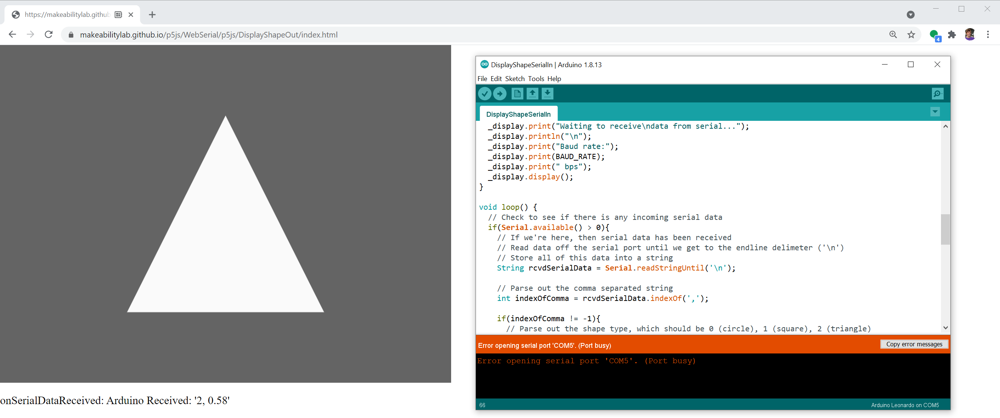
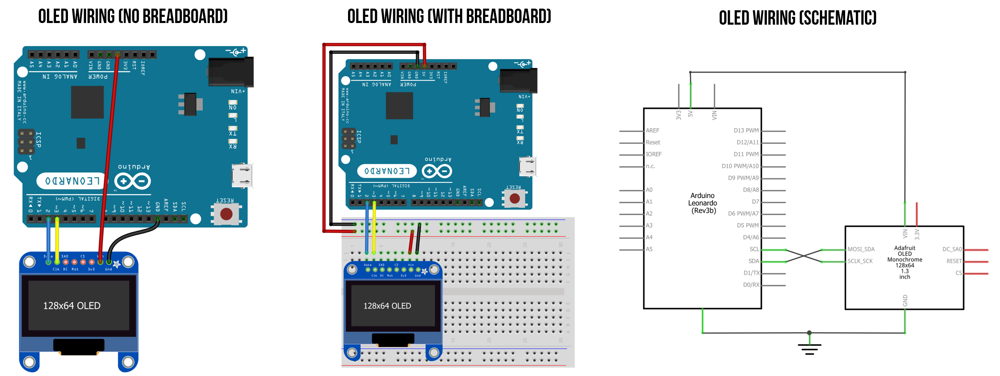
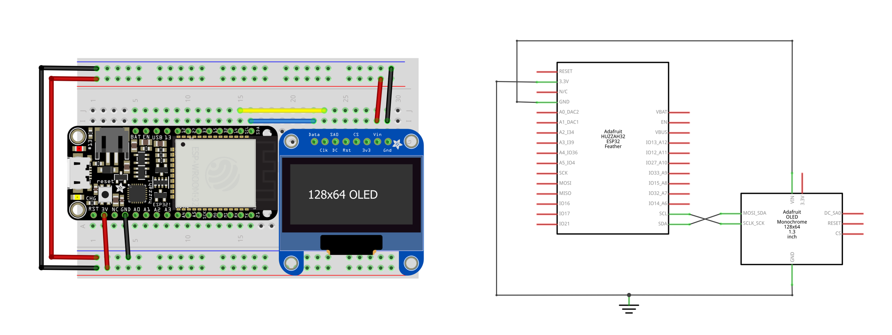
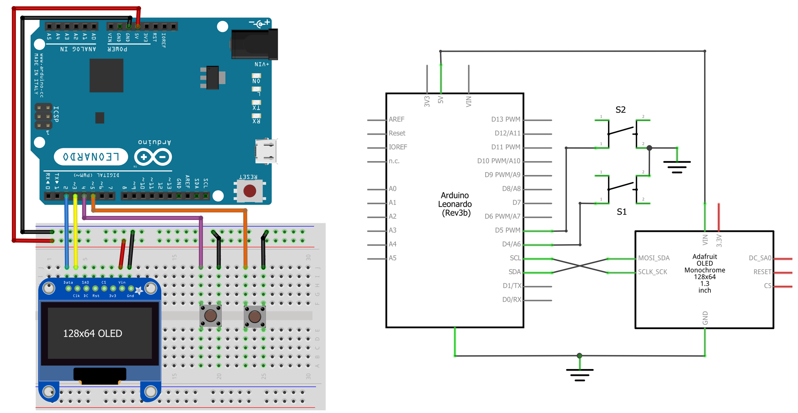

# {{ page.title }}
{: .no_toc }

## Table of Contents
{: .no_toc .text-delta }

1. TOC
{:toc}
---

OK, now we're really rolling! We learned about [serial communication](serial-intro.md), then how to use serial in our browsers ([web serial!](web-serial.md)), and then how to do this with [p5.js](p5js-serial.md). And we've already made some cool proof-of-concept demos.

Let's take this growing knowledge and momentum to create slightly more sophisticated programs. First, we'll cover the case of using p5.js to control something on our Arduino (`Computer → Arduino`) then we'll introduce bidirectional communication (`Computer ↔ Arduino`) where the computer + Arduino work together to create a holistic interactive experience.

## DisplayShapeOut: p5.js to Arduino

To begin, we'll build a simple p5.js demo app that draws and resizes a selected shape (a circle, triangle, or rectangle) based on the mouse's x position and sends this shape data as a text-encoded comma-separated string over web serial: (`"shapeType, shapeSize"`). On the Arduino side, we'll parse this string and draw the current shape and size on the OLED. Because the p5.js canvas size and the OLED screen size do not match, we'll use a normalized size value between [0,1] where 0 is the smallest size and 1 is the maximum size. Shape type is encoded as 0 for circle, 1 for square, and 2 for rectangle.

Here's a small sneak preview of what the final interactive experience will look like.

<video autoplay loop muted playsinline style="margin:0px">
  <source src="assets/videos/DisplayShapeIn.ino-DisplayShapeOut-Trimmed-Optimized.mp4" type="video/mp4" />
</video>
**Video.** A demonstration of the p5.js app [DisplayShapeOut](https://github.com/makeabilitylab/p5js/tree/master/WebSerial/p5js/DisplayShapeOut) and Arduino sketch [DisplayShapeIn.ino](https://github.com/makeabilitylab/arduino/blob/master/Serial/DisplayShapeSerialIn/DisplayShapeSerialIn.ino). The p5.js app sends a `shapeType` and a `shapeSize` as a comma-separated text string to Arduino via web serial. The [DisplayShapeIn.ino](https://github.com/makeabilitylab/arduino/blob/master/Serial/DisplayShapeSerialIn/DisplayShapeSerialIn.ino) program parses this text and draws a shape with the appropriate size to the OLED. I did not use my regular recording setup for this because OBS Studio + my document camera have a noticeable lag. You can view, edit, play with the DisplayShapeOut code in the [p5.js online editor](https://editor.p5js.org/jonfroehlich/sketches/TfE1BjOX6) or from our GitHub ([live page](https://makeabilitylab.github.io/p5js/WebSerial/p5js/DisplayShapeOut/), [code](https://github.com/makeabilitylab/p5js/tree/master/WebSerial/p5js/DisplayShapeOut))
{: .fs-1 }

### Creating DisplayShapeOut in p5.js

As with our [previous lesson](p5js-serial.md), we'll begin with our [`SerialTemplate`](https://github.com/makeabilitylab/p5js/tree/master/WebSerial/p5js/SerialTemplate). If you're using VSCode, copy [`SerialTemplate`](https://github.com/makeabilitylab/p5js/tree/master/WebSerial/p5js/SerialTemplate) and rename the folder to `DisplayShapeOut`. If you're using the p5.js online editor, simply open this project, [Serial Template](https://editor.p5js.org/jonfroehlich/sketches/vPfUvLze_C), and rename your project to `DisplayShapeOut`.

#### Overview of DisplayShapeOut functionality

Let's go over some of DisplayShapeOut's primary functionality. We want the user to:

- **Select a current shape (circle, triangle, or rectangle)**. We'll do this by enumerating through them in order via a mouse press action

- **Change the size of the shape**. We'll do this by tracking the mouse's x position and mapping it to size

- **Send shape data over serial.** Each time either the current shape or size changes, we need to send an update over serial. We'll do this using [our web serial class](web-serial.md#our-web-serial-class)

#### Draw and dynamically resize shape

We'll build this up piece-by-piece. First, we'll focus on the p5.js shape drawing code and then add in web serial. Let's start by supporting a single shape type and adding in the resizing via x mouse position (similar to [this part of our previous lesson](p5js-serial.md#make-circle-dynamically-sized)).

Add in the following top-level variables:


const MIN_SHAPE_SIZE = 10;   // minimum shape size in pixels
const MAX_SHAPE_MARGIN = 10; // when shape is at max size, the margin to edge of canvas
let maxShapeSize = -1;       // the maximum shape size
let curShapeSize = 10;       // the current shape size


We use the prefix [`const`](https://developer.mozilla.org/en-US/docs/Web/JavaScript/Reference/Statements/const) to indicate read-only variables and [`let`](https://developer.mozilla.org/en-US/docs/Web/JavaScript/Reference/Statements/let) for block-scoped mutable variables.

Now initialize the `maxShapeSize` based on the canvas width/height in `setup()`:


function setup(){
  ...
  maxShapeSize = min(width, height) - MAX_SHAPE_MARGIN;
  ...
}


Update the `draw()` function to actually draw our shape (a circle, for now).


function draw() {
  background(100);

  fill(250);
  noStroke();
  const xCenter = width / 2;
  const yCenter = height / 2;
  circle(xCenter, yCenter, curShapeSize);
}


Finally, we need to change `curShapeSize` based on the x position of the mouse:


function mouseMoved(){
  curShapeSize = map(mouseX, 0, width, MIN_SHAPE_SIZE, maxShapeSize);

  // mouseMoved() is called even when mouse not directly over our canvas
  // so make sure to constrain to just the min,max size. If you don't do this
  // your circle may grow larger than you expect. Try it out!
  curShapeSize = constrain(curShapeSize, MIN_SHAPE_SIZE, maxShapeSize);
}


That's it! We made an initial interactive shape app. Save your work and try it out with VSCode's [Live Server](https://marketplace.visualstudio.com/items?itemName=ritwickdey.LiveServer) or simply hit the `play` button in the p5.js editor.

Here's [a live demo](https://editor.p5js.org/jonfroehlich/sketches/qh-E0BRaR) from the p5.js online editor. Move your mouse over the canvas below to watch the circle change in size proportionall to the mouse's x position.

<iframe width="736" height="400" scrolling="no" src="https://editor.p5js.org/jonfroehlich/embed/qh-E0BRaR"></iframe>
**Code.** The initial code skeleton for interactively sizing a shape based on the mouse's x position. You can view, edit, and play with the code [here](https://editor.p5js.org/jonfroehlich/sketches/qh-E0BRaR).
{: .fs-1 }

#### Add in support for multiple shapes

Now, let's add in support for rendering more shapes: the square and triangle. We need a variable to track the current shape type and a method for the user to switch between shapes:

To track the current shape type, we'll use a JavaScript [`Object`](https://developer.mozilla.org/en-US/docs/Web/JavaScript/Reference/Global_Objects/Object)—a flexible, foundational [data type in JavaScript](https://developer.mozilla.org/en-US/docs/Web/JavaScript/Data_structures). Anything that is not a [primitive data type](https://developer.mozilla.org/en-US/docs/Web/JavaScript/Data_structures#data_and_structure_types) in JavaScript—*e.g.,* things that are not a [String](https://developer.mozilla.org/en-US/docs/Glossary/String), [Boolean](https://developer.mozilla.org/en-US/docs/Glossary/Boolean), [Number](https://developer.mozilla.org/en-US/docs/Glossary/Number), *etc.*—is a JavaScript [`Object`](https://developer.mozilla.org/en-US/docs/Web/JavaScript/Reference/Global_Objects/Object). In this case, we'll simply treat this Object as a key/value store, so let's call it `mapShapeTypeToShapeName` where the variable indicates "mapping" a shape type (0, 1, 2) to a shape name (circle, square, triangle). And we'll track the current shape type via `curShapeType`.


const mapShapeTypeToShapeName = {
  0: "Circle",
  1: "Square",
  2: "Triangle"
};

let curShapeType = 0;        // track current shape type


So, `mapShapeTypeToShapeName` defines the three shapes and their key/value relationship and `curShapeType` tracks the current shape as 0 (for circle), 1 (for square), and 2 (for triangle).

For selecting the shape type, there are many possibilities—we could draw small iconic representations of a circle, square, and triangle and switch shape types when these are clicked (like buttons). But we'll do something even simpler: increment `curShapeType` on each mouse click.


function mouseClicked() {
  curShapeType++;
  if(curShapeType >= Object.keys(mapShapeTypeToShapeName).length){
    curShapeType = 0;
  }

  // Your template may have also had this code in mouseClicked()
  // Comment out for now.
  //if (!serial.isOpen()) {
  //  serial.connectAndOpen(null, serialOptions);
  //}
}


Finally, we need to update our `draw()` function to draw the three shape types:

function draw() {
  background(100);
  fill(250);
  noStroke();
  const xCenter = width / 2;
  const yCenter = height / 2;
  const halfShapeSize = curShapeSize / 2;

  switch(curShapeType){
    case 0: // draw circle
      circle(xCenter, yCenter, curShapeSize);
      break;
    case 1: // draw square
      rectMode(CENTER);  // See: https://p5js.org/reference/#/p5/rectMode
      square(xCenter, yCenter, curShapeSize);
      break;
    case 2: // draw triangle
      let x1 = xCenter - halfShapeSize;
      let y1 = yCenter + halfShapeSize;

      let x2 = xCenter;
      let y2 = yCenter - halfShapeSize;

      let x3 = xCenter + halfShapeSize;
      let y3 = y1;
     
      triangle(x1, y1, x2, y2, x3, y3)
  }
}


For user friendliness, let's drop in some instructions as well. At the end of the draw() function, display some text that says "Mouse click to change the shape":


function draw() {
  ...

  // Some instructions to the user
  noStroke();
  fill(255);
  const tSize = 14; // text size
  const strInstructions = "Mouse click to change the shape";
  textSize(tSize);
  let tWidth = textWidth(strInstructions);
  const xText = width / 2 - tWidth / 2;
  text(strInstructions, xText, height - tSize + 6);
}


Alright, we did it! Now check out your work by loading it with Live Server or in the p5.js online editor. Here's [a live demo](https://editor.p5js.org/jonfroehlich/sketches/v3xWP3Np1):

<iframe width="736" height="400" scrolling="no" src="https://editor.p5js.org/jonfroehlich/embed/v3xWP3Np1"></iframe>
**Code.** Changing shapes by mouse clicking. Code [here](https://editor.p5js.org/jonfroehlich/sketches/v3xWP3Np1).
{: .fs-1 }

#### Add in web serial output

Finally, the last piece is to output shape type and shape size via web serial. To limit needless serial writes, we'll track the last shape type and size and only send out new data when these values have changed.

First, let's add a serial write function called `serialWriteShapeData(shapeType, shapeSize)`, which takes in a shape type and shape size and outputs them over web serial as text-encoded data.


async function serialWriteShapeData(shapeType, shapeSize) {
  if (serial.isOpen()) {
    // Convert the shape size into a fraction between [0, 1] inclusive
    let shapeSizeFraction = (shapeSize - MIN_SHAPE_SIZE) / (maxShapeSize - MIN_SHAPE_SIZE);

    // Format the text string to send over serial. nf simply formats the floating point
    // See: https://p5js.org/reference/#/p5/nf
    let strData = shapeType + ", " + nf(shapeSizeFraction, 1, 2);
    serial.writeLine(strData);
  }
}


Notably, we convert the shape size, which is in pixels, to a normalized value between [0, 1] called `shapeSizeFraction`—this is what we'll transmit over serial and interpret on the Arduino side.

Now, let's update the `mouseClicked()` function to handle opening and connecting with web serial or, if a connection has been made, to increment `curShapeType` and send that new data over serial by calling our new `serialWriteShapeData()` function.


function mouseClicked() {
  if (!serial.isOpen()) {
    // If the serial connection is not opened, begin open/connect sequence
    serial.connectAndOpen(null, serialOptions);
  }else{
    // Otherwise, increment shape type
    curShapeType++;
    if(curShapeType >= Object.keys(mapShapeTypeToShapeName).length){
      curShapeType = 0;
    }

    // Given that shape type just changed, write out new values to serial
    serialWriteShapeData(curShapeType, curShapeSize);
  }
}


Let's also update the instructions to the user so they know that mouse clicking is state dependent:


function draw(){
  ...
  // Some instructions to the user
  noStroke();
  fill(255);
  const tSize = 14;
  let strInstructions = "";
  if(serial.isOpen()){
    strInstructions = "Mouse click anywhere to change the shape";
  }else{
    strInstructions = "Click anywhere to connect with serial"
  }
  textSize(tSize);
  let tWidth = textWidth(strInstructions);
  const xText = width / 2 - tWidth / 2;
  text(strInstructions, xText, height - tSize + 6);
}


Finally, we need to update the `mouseMoved()` method to call `serialWriteShapeData()` on a new shape size:


function mouseMoved(){
  let lastShapeSize = curShapeSize;
  curShapeSize = map(mouseX, 0, width, MIN_SHAPE_SIZE, maxShapeSize);
  curShapeSize = constrain(curShapeSize, MIN_SHAPE_SIZE, maxShapeSize);
  
  if(lastShapeSize != curShapeSize){
    serialWriteShapeData(curShapeType, curShapeSize);
  }
}


And we're done with the p5.js app! You can view, edit, play with the code in the [p5.js online editor ](https://editor.p5js.org/jonfroehlich/sketches/TfE1BjOX6) or from our GitHub ([live page](https://makeabilitylab.github.io/p5js/WebSerial/p5js/DisplayShapeOut/), [code](https://github.com/makeabilitylab/p5js/tree/master/WebSerial/p5js/DisplayShapeOut)).

<!-- TODO: consider right clicking to disconnect? Then we could embed this full thing into the bidirectional serial webpage? But might get confusing if we have multiple examples on one page -->

### Creating DisplayShapeIn in Arduino

We could design many different types of Arduino apps that read in `"shapeType, shapeSize"` off serial and do something interesting. For example, we could use this info to set the paddle size and ball type (circle, square, triangle) in an OLED-based [Breakout game](https://en.wikipedia.org/wiki/Breakout_(video_game)). For this Arduino app, however, let's simply replicate the p5.js app visual experience. This might sound hard but you're [OLED](../advancedio/oled.md) experts by now—you got this!

But how should we begin?

The key is to start simply and build up your app step-by-step, testing incrementally each step of the way.

<!-- When you're writing your own `Computer ↔ Arduino` apps, you'll want to co-design the two apps together. You need to decide how the two apps will communicate over serial—in this case, p5.s and Arduino—and the format of the text-encoded strings. You could start implementing your design either in p5.js or Arduino—and you'll likely iterate between them as you co-create both. For our example, we chose to start with the p5.js side ([DisplayShapeOut](https://github.com/makeabilitylab/p5js/tree/master/WebSerial/p5js/DisplayShapeOut)). Now, let's begin working on the Arduino code. -->

#### A simple beginning and debugging strategies

Let's begin our Arduino app simply by echo'ing the incoming data back on serial. Remember, you **cannot** use the Arduino IDE's [Serial Monitor](../arduino/serial-print.md) once your p5.js app connects with your Arduino over serial. See error message in the figure below.

**Figure.** This figures shows the p5.js app [DisplayShapeOut](https://makeabilitylab.github.io/p5js/WebSerial/p5js/DisplayShapeOut) running and connected to the Arduino via web serial. Consequently, we cannot open and use the Arduino IDE's Serial Monitor tool (`Tools -> Serial Monitor`) because only one program can connect to a serial port at a time. When we try, we get an error printed in the Arduino IDE console (right image) that says "Error opening serial port 'COM5'. (Port busy)"
{: .fs-1 }

So, instead, let's program our p5.js app to read incoming serial data and print it out—a web-based Serial Monitor! Luckily, our p5.js [`SerialTemplate`](https://github.com/makeabilitylab/p5js/tree/master/WebSerial/p5js/SerialTemplate) code already does that. In the template, we simply have:


function onSerialDataReceived(eventSender, newData) {
  console.log("onSerialDataReceived", newData);
  pHtmlMsg.html("onSerialDataReceived: " + newData);
}


Which prints incoming data sent by Arduino to console and also updates the handy `pHtmlMsg` HTML element so you can see the info on your webpage (you could comment this out, of course).

So, the simplest Arduino sketch to start with could be an "echo back" program like:


const long BAUD_RATE = 115200;
void setup() {
  Serial.begin(BAUD_RATE);
}

void loop() {
  // Check to see if there is any incoming serial data
  if(Serial.available() > 0){
    // Echo the data back on serial (for debugging purposes)
    Serial.print("Arduino Received: '");
    Serial.print(rcvdSerialData);
    Serial.println("'");
  }
}


**Code.** Simple serial echo back program for Arduino ([EchoBackSerialIn.ino](https://github.com/makeabilitylab/arduino/blob/master/Serial/EchoBackSerialIn/EchoBackSerialIn.ino) on GitHub).
{: .fs-1 }

<!-- 

TODO: need video -->

This echo technique is a crucial debugging tool. So, make sure you understand it! We can also use the OLED display to show debugging output, which we need for this app anyway. So, let's do that next!

<!-- Another useful debugging strategy is to use our [OLED](../advancedio/oled.md) displays for debugging output. We can change these debug printouts as our app progresses (and remove them, of course, once we're confident things are working the way we intend). -->

<!-- So, let's add in our OLED—which we need for this app anyway. -->

<!-- It's important that you understand this "echo" technique and the fact that you can no longer use Serial Monitor for debugging (at least not in the same way [as before](../arduino/serial-print.md)) because only one program can open and use a serial port at a time (which will be your p5.js app). -->

<!-- Another debugging strategy is to use your [OLED](../advancedio/oled.md) displays for debugging output. The OLEDs are actually hugely advantageous for displaying intermediate debugging information as you create and iterate. You can, of course, remove and change debugging printouts as your app progresses.

Additionally, it can be useful to simply turn on an LED to track some state. You can do this without hooking up an LED by using the built-in LED on your board (`LED_BUILTIN`). So, write `digitalWrite(LED_BUILTIN, HIGH)` when your program enters some state, for example.

Finally, as you build out both apps, perhaps the most important strategy is to modularize and test, modularize and test, modularize and test. Build up your apps in pieces and test them each step of the way!

With that, let's begin making on the Arduino side! -->

#### A simple OLED circuit

We'll wire up the OLED using I2C as we did in our [OLED](../advancedio/oled.md) lesson. For our lesson, we'll use the Arduino Leonardo but some of you may choose to use the Adafruit Huzzah32 (ESP32). We provide both I2C wirings below.

##### The Arduino Leonardo Wiring

**Figure** Wiring the Adafruit OLED display with I2C requires only four wires. For my wire colors, I used the standard STEMMA QT color coding: blue for data (SDA), yellow for clock (SCL), black for ground (GND), and red for the voltage supply (5V). Note that the I2C pins will differ depending on your board. For example, on the Arduino Uno, they are A4 (SDA) and A5 (SCL) rather than digital pins 2 (SDA) and 3 (SCL) as they are for the Leonardo.
{: .fs-1 }

##### The ESP32 Wiring

**Figure.** Wiring diagram for the [Adafruit Huzzah32](../esp32/index.md) ESP32 board with OLED. Note that the ESP32 has silk-printed SCL and SDA pins at the top-right corner.
{: .fs-1 }

#### Add in OLED and debug printlns

Now, let's program the OLED to print out some debugging information. Add the following OLED-required declarations at the top:


#include <Wire.h>
#include <Adafruit_GFX.h>
#include <Adafruit_SSD1306.h>

#define SCREEN_WIDTH 128 // OLED display width, in pixels
#define SCREEN_HEIGHT 64 // OLED display height, in pixels

// Declaration for an SSD1306 display connected to I2C (SDA, SCL pins)
#define OLED_RESET     4 // Reset pin # (or -1 if sharing Arduino reset pin)
Adafruit_SSD1306 _display(SCREEN_WIDTH, SCREEN_HEIGHT, &Wire, OLED_RESET);


In `setup()`, initialize the OLED and print out a "Waiting for serial..." message. We'll also show the baud rate, which is a useful reminder in case you set a different value on the p5.js side.


const long BAUD_RATE = 115200;
void setup() {
  Serial.begin(BAUD_RATE);

  // SSD1306_SWITCHCAPVCC = generate display voltage from 3.3V internally
  if(!_display.begin(SSD1306_SWITCHCAPVCC, 0x3D)) { // Address 0x3D for 128x64
    Serial.println(F("SSD1306 allocation failed"));
    for(;;); // Don't proceed, loop forever
  }

  _display.clearDisplay();
  _display.setTextSize(1);      // Normal 1:1 pixel scale
  _display.setTextColor(SSD1306_WHITE); // Draw white text
  _display.setCursor(0, 0);     // Start at top-left corner
  _display.print("Waiting to receive\ndata from serial...");
  _display.println("\n");
  _display.print("Baud rate:");
  _display.print(BAUD_RATE);
  _display.print(" bps");
  _display.display();
}


Now, in `loop()`, add in the OLED-based debug printouts:


void loop() {
  // Check to see if there is any incoming serial data
  if(Serial.available() > 0){
    // If we're here, then serial data has been received
    // Read data off the serial port until we get to the endline delimeter ('\n')
    // Store all of this data into a string
    String rcvdSerialData = Serial.readStringUntil('\n'); 

    // Display data on OLED for debugging purposes
    _display.clearDisplay();
    _display.setCursor(0, 0);
    _display.setTextSize(1);
    _display.println("RECEIVED:\n");
    _display.setTextSize(3);
    _display.println(rcvdSerialData);
    _display.display();

    // Echo the data back on serial (for debugging purposes)
    Serial.print("Arduino Received: '");
    Serial.print(rcvdSerialData);
    Serial.println("'");
  }
}


Here's a video demonstration of what we have so far: the full DisplayShapeOut p5.js app ([live page](https://makeabilitylab.github.io/p5js/WebSerial/p5js/DisplayShapeOut/), [code](https://github.com/makeabilitylab/p5js/tree/master/WebSerial/p5js/DisplayShapeOut)) running with an intermediate version of [DisplayShapeSerialIn.ino](https://github.com/makeabilitylab/arduino/blob/master/Serial/DisplayShapeSerialIn-Intermediate1/DisplayShapeSerialIn-Intermediate1.ino), which simply echos back received data and displays some debugging output to the OLED screen.

<video autoplay loop muted playsinline style="margin:0px">
  <source src="assets/videos/DisplayShapeIn.ino-EchoBack-TrimmedAndOptimized.mp4" type="video/mp4" />
</video>
**Video.** Testing the C++ echo-back code for Arduino with the the p5.js app DisplayShapeOut ([live page](https://makeabilitylab.github.io/p5js/WebSerial/p5js/DisplayShapeOut/), [code](https://github.com/makeabilitylab/p5js/tree/master/WebSerial/p5js/DisplayShapeOut)). You can view this intermediate version of DisplayShapeSerialIn.ino [here](https://github.com/makeabilitylab/arduino/blob/master/Serial/DisplayShapeSerialIn-Intermediate1/DisplayShapeSerialIn-Intermediate1.ino).
{: .fs-1 }

#### Parse serial data and update OLED debug output

So far, so good!

But now we actually need to **parse** the incoming serial text data into useful typed variables. Let's do that and update our OLED-based debug output. Again, it's useful to construct our program step-by-step testing along the way.

Update the code inside of `if(Serial.available() > 0)` in `loop()` to include parsing. There are many possible parsing approaches; however, we are going to take advantage of Arduino's [String](https://www.arduino.cc/reference/en/language/variables/data-types/stringobject/) object and functions like [`indexOf()`](https://www.arduino.cc/reference/en/language/variables/data-types/string/functions/indexof) and [`substring()`](https://www.arduino.cc/reference/en/language/variables/data-types/string/functions/substring) to look for commas and parse out our data. We showed a similar technique in our [Intro to Serial](serial-intro.md#formatting-messages) lesson.

For now, we'll display both the raw data received over serial as well as the parsed data. Once we're confident we have this working, we'll remove this debug output.


String rcvdSerialData = Serial.readStringUntil('\n'); 

// Parse out the comma separated string
int indexOfComma = rcvdSerialData.indexOf(',');
if(indexOfComma != -1){
  // Parse out the shape type, which should be 0 (circle), 1 (square), 2 (triangle)
  String strShapeType = rcvdSerialData.substring(0, indexOfComma);
  int shapeType = strShapeType.toInt();

  // Parse out shape size fraction, a float between [0, 1]
  String strShapeSize = rcvdSerialData.substring(indexOfComma + 1, rcvdSerialData.length());
  float curShapeSizeFraction = strShapeSize.toFloat();

  // Display data for debugging purposes
  _display.clearDisplay();
  _display.setCursor(0, 0);
  _display.println("RECEIVED:");
  _display.println(rcvdSerialData);

  // Display parsed data
  _display.println("\nPARSED:");
  _display.print("Shape Type: ");
  _display.println(shapeType);
  _display.print("Shape Size: ");
  _display.print(curShapeSizeFraction);
  _display.display();
} 


Great, now let's upload this to the Arduino and test our two apps thus far. Does the parsing work?

<video autoplay loop muted playsinline style="margin:0px">
  <source src="assets/videos/DisplayShapeIn.ino-TestParsing-TrimmedAndOptimized.mp4" type="video/mp4" />
</video>
**Video.** Testing the C++ parsing code for Arduino with the the p5.js app DisplayShapeOut ([live page](https://makeabilitylab.github.io/p5js/WebSerial/p5js/DisplayShapeOut/), [code](https://github.com/makeabilitylab/p5js/tree/master/WebSerial/p5js/DisplayShapeOut)). You can view this intermediate version of DisplayShapeSerialIn.ino [here](https://github.com/makeabilitylab/arduino/blob/master/Serial/DisplayShapeSerialIn-Intermediate2/DisplayShapeSerialIn-Intermediate2.ino). 
{: .fs-1 }

#### Test parsing code via Serial Monitor

Our Arduino program does **not** know where the incoming data from its serial port is coming from. It could be coming from any application. We can use this to our advantage for testing!

Let's close our p5.js tab in our web browser to ensure it's disconnected from the Arduino. Now, open up the Serial Monitor and input data into the Serial Monitor. When testing, it's a good idea to enter both properly formed and malformed data. Make sure to test edge cases too! See video below.

<video autoplay loop muted playsinline style="margin:0px">
  <source src="assets/videos/DisplayShapeIn.ino-SerialMonitor-TrimmedOptimized1200w.mp4" type="video/mp4" />
</video>
**Video.** Using the Arduino IDE's [Serial Monitor](../arduino/serial-print.md) to test our parsing code. Using the Serial Monitor is an easy, convenient way to test your serial input and parsing code on the Arduino. 
{: .fs-1 }

#### Write drawing code

Awesome! We're almost done.

Let's pivot from reading and parsing serial input to writing our OLED-based drawing code. As we've previously mentioned the [Adafruit GFX drawing API](https://learn.adafruit.com/adafruit-gfx-graphics-library/graphics-primitives) is not significantly different from the [p5js drawing API](https://p5js.org/reference/). Note the similarities below!

First, let's introduce some shape related types and variables:


// New enum for tracking shape types
enum ShapeType {
  CIRCLE,
  SQUARE,
  TRIANGLE,
};

ShapeType _curShapeType = CIRCLE; // tracks current shape type
float _curShapeSizeFraction = -1; // tracks current shape fraction

const int MIN_SHAPE_SIZE = 4;     // min shape size
int _maxShapeSize;                // max shape size (dependent on display width/height)


We also need to initialize `_maxShapeSize` in `setup()`:


void setup(){
  ...
  _maxShapeSize = min(_display.width(), _display.height());
  ...
}


Update our relevant parsing code to use our new global variables `_curShapeType` and `_curShapeSizeFraction`. Let's also add in some boundary checking to ensure that the shape size fraction is between [0, 1].


...
if(indexOfComma != -1){
  // Parse out the shape type, which should be 0 (circle), 1 (square), 2 (triangle)
  String strShapeType = rcvdSerialData.substring(0, indexOfComma);
  int shapeType = strShapeType.toInt();
  _curShapeType = (ShapeType)shapeType;

  // Parse out shape size fraction, a float between [0, 1]
  String strShapeSize = rcvdSerialData.substring(indexOfComma + 1, rcvdSerialData.length());
  _curShapeSizeFraction = strShapeSize.toFloat();

  // Boundary check shape size fraction
  if(_curShapeSizeFraction < 0){
    _curShapeSizeFraction = 0;
  }else if(_curShapeSizeFraction > 1){
    _curShapeSizeFraction = 1;
  }
}
...


Now, let's add our `drawShape(ShapeType shapeType, float fractionSize)` function, which draws a circle, square, or triangle depending on the passed in `shapeType` at the appropriate size (`fractionSize`).


void drawShape(ShapeType shapeType, float fractionSize){
  _display.clearDisplay();

  int shapeSize = MIN_SHAPE_SIZE + fractionSize * (_maxShapeSize - MIN_SHAPE_SIZE);
  int halfShapeSize = shapeSize / 2;
  int xCenter = _display.width() / 2;
  int yCenter = _display.height() / 2; 
  int xLeft =  xCenter - halfShapeSize;
  int yTop =  yCenter - halfShapeSize;

  // Render the appropriate shape
  if(shapeType == CIRCLE){
    _display.fillRoundRect(xLeft, yTop, shapeSize, shapeSize, halfShapeSize, SSD1306_WHITE);
  }else if(shapeType == SQUARE){
    _display.fillRect(xLeft, yTop, shapeSize, shapeSize, SSD1306_WHITE);
  }else if(shapeType == TRIANGLE){
    int x1 = xCenter - halfShapeSize;
    int y1 = yCenter + halfShapeSize;

    int x2 = xCenter;
    int y2 = yCenter - halfShapeSize;

    int x3 = xCenter + halfShapeSize;
    int y3 = y1;

    _display.fillTriangle(x1, y1, x2, y2, x3, y3, SSD1306_WHITE);
  }

  _display.display();
}


Finally, we need to call `drawShape()`, which we'll do so at the end of `loop()`:


void loop() {
  ...

  // if no data has arrived, shape fraction will be < 0
  if(_curShapeSizeFraction > 0){ 
    drawShape(_curShapeType, _curShapeSizeFraction);
  }
}


That's it! You can see our full implementation on GitHub as [DisplayShapeSerialIn.ino](https://github.com/makeabilitylab/arduino/blob/master/Serial/DisplayShapeSerialIn/DisplayShapeSerialIn.ino).

### Full end-to-end demo

We did it! Here's the full end-to-end demo.

<video autoplay loop muted playsinline style="margin:0px">
  <source src="assets/videos/DisplaySerialIn-EndToEndDemo-TrimmedAndOptimized.mp4" type="video/mp4" />
</video>
**Video.** A demonstration of the p5.js app [DisplayShapeOut](https://github.com/makeabilitylab/p5js/tree/master/WebSerial/p5js/DisplayShapeOut) and Arduino sketch [DisplayShapeIn.ino](https://github.com/makeabilitylab/arduino/blob/master/Serial/DisplayShapeSerialIn/DisplayShapeSerialIn.ino). You can view, edit, play with the DisplayShapeOut code in the [p5.js online editor](https://editor.p5js.org/jonfroehlich/sketches/TfE1BjOX6) or from our GitHub ([live page](https://makeabilitylab.github.io/p5js/WebSerial/p5js/DisplayShapeOut/), [code](https://github.com/makeabilitylab/p5js/tree/master/WebSerial/p5js/DisplayShapeOut))
{: .fs-1 }

## DisplayShapeBidirectional: p5.js to Arduino and Arduino to p5.js

The above example demonstrated how to transmit data from p5.js to Arduino via text-encoded serial communication but did not send any commands from Arduino to p5.js. So, let's extend our code to communicate information bidirectionally (from p5.js to Arduino and Arduino to p5.js)!

Again, there are many possibilities but let's keep things simple. We'll add two buttons on the Arduino side to select the **shape type** and a **new drawing mode** (fill *vs.* outline). We can also change these variables on the p5.js side via mouse clicks: left click to change the shape type (same as before) and right click to change the drawing mode.

Here's a quick sneak peek at what the two apps will look like:

<video autoplay loop muted playsinline style="margin:0px">
  <source src="assets/videos/DisplayShapeBidirectional_ShortenedAndOptimized1200w.mp4" type="video/mp4" />
</video>
**Video.** A brief end-to-end demo of the p5.js app DisplayShapeBidirectional ([live page](http://makeabilitylab.github.io/p5js/WebSerial/p5js/DisplayShapeBidirectional), [code](https://github.com/makeabilitylab/p5js/tree/master/WebSerial/p5js/DisplayShapeBidirectional)) and the Arduino sketch [DisplayShapeSerialBidirectional.ino](https://github.com/makeabilitylab/arduino/blob/master/Serial/DisplayShapeSerialBidirectional/DisplayShapeSerialBidirectional.ino).
{: .fs-1 }

Notably, we are using **momentary buttons** for the Arduino input rather than input devices or sensors that maintain physical state like a potentiometer because fixed physical states could get out of sync with p5.js.

### Updating our p5.js code

To begin, make a copy of the `DisplayShapeOut` p5.js folder and rename it to something like `DisplayShapeBidirectional`. Now, let's add in support for the draw mode, update our parsing, and modify our instructions to the user.

#### Adding the fill/outline draw mode

For the fill *vs.* outline draw mode, we'll add in an additional state tracking variable called `curShapeDrawMode`:


let mapShapeDrawMode = {
  0: "Fill",
  1: "Outline",
};

let curShapeDrawMode = 0; // Fill as default


The draw mode can be set either by **right clicking** the mouse or from incoming Arduino data (from web serial). Let's handle the former (right-mouse clicking) first. 

According to [the p5.js docs](https://p5js.org/reference/#/p5/mouseClicked), the `mouseClicked()` function is only guaranteed to be called when the left mouse button is pressed and released. Thus, we cannot rely on this [`mouseClicked()`](https://p5js.org/reference/#/p5/mouseClicked) for changing the draw mode. Instead, we'll add our state tracking into [`mousePressed()`](https://p5js.org/reference/#/p5/mousePressed).


function mousePressed() {
  // Only update states if we're connected to serial
  if (serial.isOpen()) {
    if (mouseButton == RIGHT) {
      // Switch between fill and outline mode based on right click
      curShapeDrawMode++;
      if (curShapeDrawMode >= Object.keys(mapShapeDrawMode).length) {
        curShapeDrawMode = 0;
      }
    } else {
      curShapeType++;
      if (curShapeType >= Object.keys(mapShapeTypeToShapeName).length) {
        curShapeType = 0;
      }
    }
    serialWriteShapeData(curShapeType, curShapeSize, curShapeDrawMode);
  }
}


Notice that we also moved the `shapeType` tracking here too.

#### Add new instructions to the user

In `draw()`, update the instructions to the user to include info about both left-clicking and right-clicking:


function draw(){
  ...

  // Some instructions to the user
  noStroke();
  fill(255);
  const tSize = 14;
  let strInstructions = "";
  if (serial.isOpen()) {
    strInstructions = "Left click to change the shape. Right click to change fill/outline";
  } else {
    strInstructions = "Click anywhere to connect with serial"
  }
  textSize(tSize);
  let tWidth = textWidth(strInstructions);
  const xText = width / 2 - tWidth / 2;
  text(strInstructions, xText, height - tSize + 6);
}


#### Update the serialWriteShapeData function and callers

We also need to update our `serialWriteShapeData()` function to receive and write out three variables: `shapeType`, `shapeSize`, and `shapeDrawMode` instead of two as before:


async function serialWriteShapeData(shapeType, shapeSize, shapeDrawMode) {
  if (serial.isOpen()) {
    let shapeSizeFraction = (shapeSize - MIN_SHAPE_SIZE) / (maxShapeSize - MIN_SHAPE_SIZE);

    // Setup strData with three comma separated variables
    let strData = shapeType + ", " + nf(shapeSizeFraction, 1, 2) + ", " + shapeDrawMode;

    // Write out the data to serial
    serial.writeLine(strData);
  }
}


And make sure to also update the `serialWriteShapeData()` call in `mouseMoved()` to use three parameters as well:


function mouseMoved() { {
  ...
  serialWriteShapeData(curShapeType, curShapeSize, curShapeDrawMode);
  ...
}


#### Add onSerialDataReceived parsing code

Finally, we need to add code that parses incoming serial data into `shapeType`, `shapeSize`, and `shapeDrawMode`. For this, we'll add a new aspect to our `Arduino → Computer` communication protocol. Let's say that any line of text transmitted with a `#` prefix will be ignored and considered debugging output. This way, we can continue to use our p5.js web app for output debugging while still parsing useful information.

Recall that our web serial library has an event called `SerialEvents.DATA_RECEIVED`, which we subscribe to in `setup()` and hook up a method called `onSerialDataReceived(newData)`:


function setup() {
  ...
  serial.on(SerialEvents.DATA_RECEIVED, onSerialDataReceived);
  ...
}


Let's now update that `onSerialDataReceived` method!


function onSerialDataReceived(eventSender, newData) {
  //console.log("onSerialDataReceived", newData);
  pHtmlMsg.html("onSerialDataReceived: " + newData);

  // Check if data received starts with '#'. If so, ignore it
  // Otherwise, parse it! We ignore lines that start with '#' 
  if (!newData.startsWith("#")) {
    // Data format is ShapeType, ShapeDrawMode
    const indexOfComma = newData.indexOf(",");
    if (indexOfComma != -1) {
      let strShapeType = newData.substring(0, indexOfComma).trim();
      let strShapeDrawMode = newData.substring(indexOfComma + 1, newData.length).trim();
      let newShapeType = parseInt(strShapeType);
      let newShapeDrawMode = parseInt(strShapeDrawMode);

      // If data valid, set new shape type
      if (newShapeType in mapShapeTypeToShapeName) {
        curShapeType = newShapeType;
      }

      // if shape draw mode valid, set new draw mode
      if (newShapeDrawMode in mapShapeDrawMode) {
        curShapeDrawMode = newShapeDrawMode;
      }
    }
  }
}


And that's it! Here's our full implementation as [DisplayShapeBidirectional](https://github.com/makeabilitylab/p5js/tree/master/WebSerial/p5js/DisplayShapeBidirectional) in GitHub ([live page here](http://makeabilitylab.github.io/p5js/WebSerial/p5js/DisplayShapeBidirectional)).

### Updating our Arduino code and circuit

Shifting now to the Arduino side. Let's add in two buttons to our Arduino circuit: one button to iterate through shape type and another to iterate through draw modes. We'll hook them up to GPIO pins 4 and 5 respectively with internal pull-up resistors.

**Figure.** The Arduino Leonardo circuit with two buttons hooked up to pins 4 and 5 using the Arduino's internal pull-up resistors. So, by default, they are in a `HIGH` state and will be pulled `LOW` upon button press.
{: .fs-1 }

#### Add draw mode support

For the code, let's begin by adding draw mode support:


enum DrawMode{
  FILL,
  OUTLINE,
  NUM_DRAW_MODES
};

DrawMode _curDrawMode = FILL;


And update our `drawShape()` function to accept three variables and draw the shapes accordingly (either **filled** or as **outlines**):


void drawShape(ShapeType shapeType, float fractionSize, DrawMode curDrawMode){
  _display.clearDisplay();

  int shapeSize = MIN_SHAPE_SIZE + fractionSize * (_maxShapeSize - MIN_SHAPE_SIZE);
  int halfShapeSize = shapeSize / 2;
  int xCenter = _display.width() / 2;
  int yCenter = _display.height() / 2; 
  int xLeft =  xCenter - halfShapeSize;
  int yTop =  yCenter - halfShapeSize;
  
  if(shapeType == CIRCLE){
    if(curDrawMode == FILL){
      _display.fillRoundRect(xLeft, yTop, shapeSize, shapeSize, halfShapeSize, SSD1306_WHITE);
    }else{
      _display.drawRoundRect(xLeft, yTop, shapeSize, shapeSize, halfShapeSize, SSD1306_WHITE);
    }
  }else if(shapeType == SQUARE){
    if(curDrawMode == FILL){
      _display.fillRect(xLeft, yTop, shapeSize, shapeSize, SSD1306_WHITE);
    }else{
      _display.drawRect(xLeft, yTop, shapeSize, shapeSize, SSD1306_WHITE);
    }
  }else if(shapeType == TRIANGLE){
    int x1 = xCenter - halfShapeSize;
    int y1 = yCenter + halfShapeSize;

    int x2 = xCenter;
    int y2 = yCenter - halfShapeSize;

    int x3 = xCenter + halfShapeSize;
    int y3 = y1;

    if(curDrawMode == FILL){
      _display.fillTriangle(x1, y1, x2, y2, x3, y3, SSD1306_WHITE);
    }else{
      _display.drawTriangle(x1, y1, x2, y2, x3, y3, SSD1306_WHITE);
    }
  }

  _display.display();
}


### Add in support for buttons

Add in a new method called `checkButtonPresses()` that reads the two buttons, sets the global variables `_curShapeType` and `_curDrawMode` accordingly, and sends them over serial.


void checkButtonPresses(){
  // Read the shape selection button (active LOW)
  int shapeSelectionButtonVal = digitalRead(SHAPE_SELECTION_BUTTON_PIN);
  int lastShapeType = _curShapeType;
  if(shapeSelectionButtonVal == LOW && shapeSelectionButtonVal != _lastShapeSelectionButtonVal){
    // Increment the shape type
    _curShapeType = (ShapeType)((int)_curShapeType + 1);

    // Reset back to CIRCLE if we've made it to NUM_SHAPE_TYPES
    if(_curShapeType >= NUM_SHAPE_TYPES){
      _curShapeType = CIRCLE;
    }
  }

  // Read the shape draw mode button val (active LOW)
  int shapeDrawModeButtonVal = digitalRead(SHAPE_DRAWMODE_BUTTON_PIN);
  int lastDrawMode = _curDrawMode;
  if(shapeDrawModeButtonVal == LOW && shapeDrawModeButtonVal != _lastDrawModeButtonVal){
    // Increment the draw mode
    _curDrawMode = (DrawMode)((int)_curDrawMode + 1);

    // Reset back to FILL if we've made it to NUM_DRAW_MODES
    if(_curDrawMode >= NUM_DRAW_MODES){
      _curDrawMode = FILL;
    }
  }

  // Send new shape type and shape draw mode back over serial
  if(lastShapeType != _curShapeType || lastDrawMode != _curDrawMode){
    Serial.print(_curShapeType);
    Serial.print(", ");
    Serial.println(_curDrawMode);
  }

  // Set last button values (so nothing happens if user just holds down a button)
  _lastShapeSelectionButtonVal = shapeSelectionButtonVal;
  _lastDrawModeButtonVal = shapeDrawModeButtonVal;
}


We can test our new button and drawing code regardless of serial input. So, let's do that now:

<video autoplay loop muted playsinline style="margin:0px">
  <source src="assets/videos/DisplayShapeBidirectionalIntermediate-TrimmedAndOptimized.mp4" type="video/mp4" />
</video>
**Video.** Testing an intermediate version of our Arduino code (in GitHub [here](https://github.com/makeabilitylab/arduino/blob/master/Serial/DisplayShapeSerialBidirectional-Intermediate1/DisplayShapeSerialBidirectional-Intermediate1.ino)).
{: .fs-1 }

### Update parsing code to support draw mode

Finally, we need to update the serial parsing code to parse three comma separated values rather than just two: `shapeType`, `shapeSizeFraction`, and `drawMode`. Let's move all of this serial code into its own function called `checkAndParseSerial()`:


void checkAndParseSerial(){
  // Check to see if there is any incoming serial data
  if(Serial.available() > 0){
    // If we're here, then serial data has been received
    // Read data off the serial port until we get to the endline delimeter ('\n')
    // Store all of this data into a string
    String rcvdSerialData = Serial.readStringUntil('\n'); 

    // Parse out the comma separated string
    int startIndex = 0;
    int endIndex = rcvdSerialData.indexOf(',');
    if(endIndex != -1){
      // Parse out the shape type, which should be 0 (circle), 1 (square), 2 (triangle)
      String strShapeType = rcvdSerialData.substring(startIndex, endIndex);
      int shapeType = strShapeType.toInt();
      _curShapeType = (ShapeType)shapeType;

      // Parse out shape size fraction, a float between [0, 1]
      startIndex = endIndex + 1;
      endIndex = rcvdSerialData.indexOf(',', startIndex);
      String strShapeSize = rcvdSerialData.substring(startIndex, endIndex);
      _curShapeSizeFraction = strShapeSize.toFloat();

      if(_curShapeSizeFraction < 0){
        _curShapeSizeFraction = 0;
      }else if(_curShapeSizeFraction > 1){
        _curShapeSizeFraction = 1;
      }

      // Parse out draw mode 0 (fill), 1 (outline)
      startIndex = endIndex + 1;
      endIndex = rcvdSerialData.length();
      String strDrawMode = rcvdSerialData.substring(startIndex, endIndex);
      int drawMode = strDrawMode.toInt();
      _curDrawMode = (DrawMode)drawMode;
    } 
    
    // Echo the data back on serial (for debugging purposes)
    // Prefix debug output with '#' as a convention
    Serial.print("# Arduino Received: '");
    Serial.print(rcvdSerialData);
    Serial.println("'");
  }
}


And now the full `loop()` looks like:


void loop() {
  checkAndParseSerial();
  checkButtonPresses();

  // If we've received data from serial, then _curShapeSizeFraction will
  // no longer be -1
  if(_curShapeSizeFraction >= 0){
    drawShape(_curShapeType, _curShapeSizeFraction, _curDrawMode);
  }
}


We did it! Below, we provide the full code links and a video demonstration.

### Video of DisplayShapeBidirectional

Here's a video demo of DisplayShapeBidirectional ([live page](http://makeabilitylab.github.io/p5js/WebSerial/p5js/DisplayShapeBidirectional), [code](https://github.com/makeabilitylab/p5js/tree/master/WebSerial/p5js/DisplayShapeBidirectional)) and the Arduino sketch [DisplayShapeSerialBidirectional.ino](https://github.com/makeabilitylab/arduino/blob/master/Serial/DisplayShapeSerialBidirectional/DisplayShapeSerialBidirectional.ino).

<video autoplay loop muted playsinline style="margin:0px">
  <source src="assets/videos/DisplayShapeBidirectional_TrimmedAndOptimized900w.mp4" type="video/mp4" />
</video>
**Video.** A demonstration of the p5.js app DisplayShapeBidirectional ([live page](http://makeabilitylab.github.io/p5js/WebSerial/p5js/DisplayShapeBidirectional), [code](https://github.com/makeabilitylab/p5js/tree/master/WebSerial/p5js/DisplayShapeBidirectional)) and the Arduino sketch [DisplayShapeSerialBidirectional.ino](https://github.com/makeabilitylab/arduino/blob/master/Serial/DisplayShapeSerialBidirectional/DisplayShapeSerialBidirectional.ino).
{: .fs-1 }

## Activity

For your prototyping journals, create a simple bidirectional app in p5.js and Arduino. Ideally, this app would correspond to an idea you have for MP3 allowing you to rapidly prototype a concept. In your journal, describe the app, link to the code (for both p5.js and Arduino), and include a brief video.

<!-- extend the p5.js app DisplayShapeBidirectional ([live page](http://makeabilitylab.github.io/p5js/WebSerial/p5js/DisplayShapeBidirectional), [code](https://github.com/makeabilitylab/p5js/tree/master/WebSerial/p5js/DisplayShapeBidirectional)) and the Arduino sketch [DisplayShapeSerialBidirectional.ino](https://github.com/makeabilitylab/arduino/blob/master/Serial/DisplayShapeSerialBidirectional/DisplayShapeSerialBidirectional.ino)  -->

## Next Lesson

In the [next lesson](p5js-paint-io.md), we'll bring everything together and build a fully functional paint application.

[Previous: p5.js Serial In](p5js-serial.md){: .btn .btn-outline }
[Next: Paint I/O Example](p5js-paint-io.md){: .btn .btn-outline }

<!-- 
[Previous: Intro to Web Serial](web-serial.md){: .btn .btn-outline }
[Next: Serial I/O with p5.js](p5js-serial-io.md){: .btn .btn-outline }
 -->

<!-- Other p5js app ideas:
- use p5.js sound API and display real-time sound
- parse out weather in Seattle and display in OLED?  -->

<!-- - Show computer communicating with Arduino
- Show simple bidirectional communication
- Make a simple drawing app
  -- First, two potentiometers as input. Now, let's switch these to accel
  -- Then, we can control the size of the brush with FSR
  ---- When not pressed, show as a crosshair or something
  -- Control "clearing" the display with a button
  -- Control color with color sensor

Another example:
 - One example could be using p5.js sound input to make either a FFT or just magnitude OLED output -->