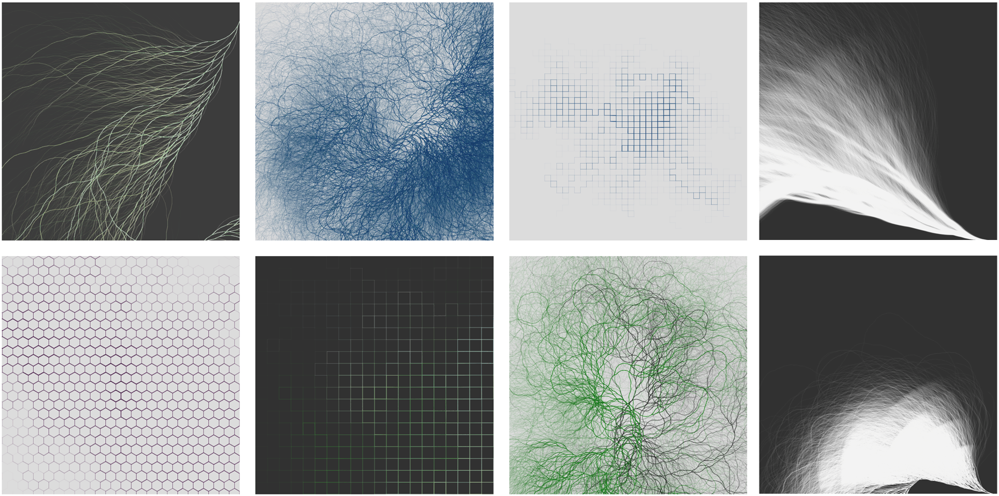
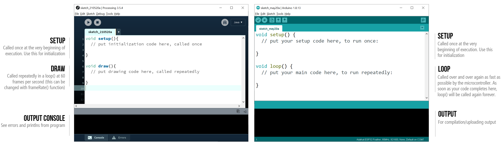
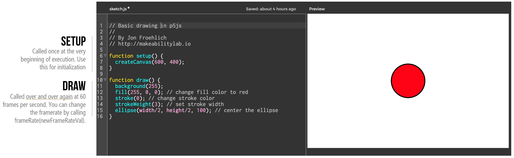
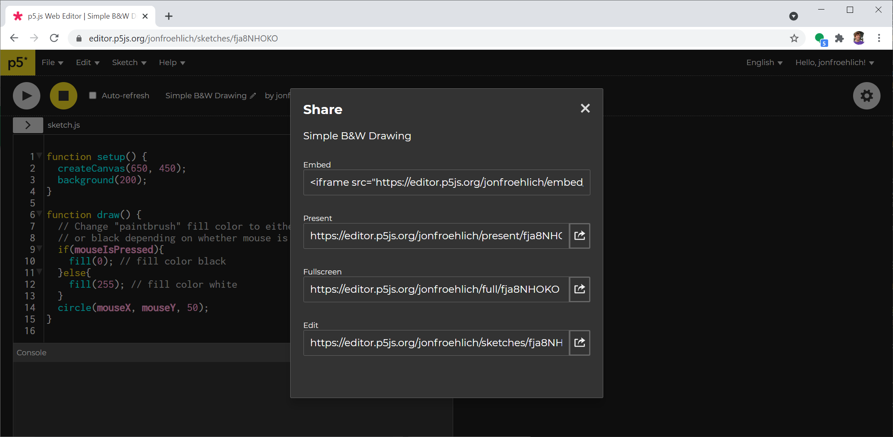
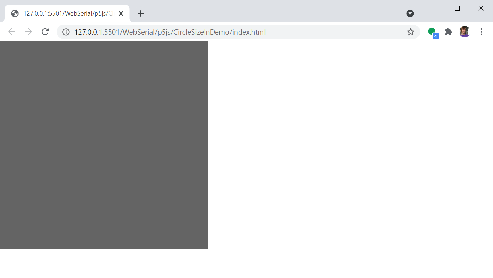
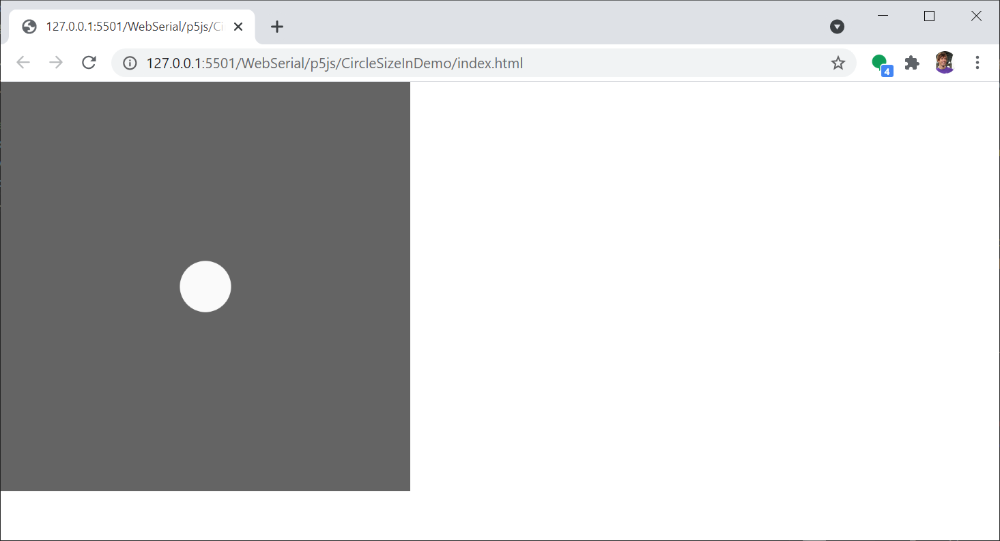
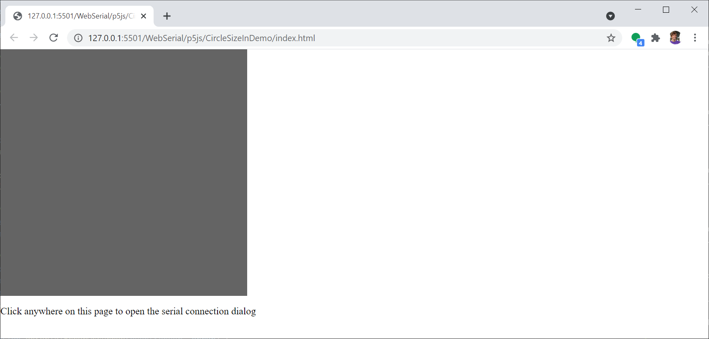

# {{ page.title }}
{: .no_toc }

## Table of Contents
{: .no_toc .text-delta }

1. TOC
{:toc}
---

We've only started to scratch the surface of what's possible in combining Arduino+Computers. In this lesson (and the next), we're going to use [p5.js](https://p5.js.org/) to help demonstrate this potential. It should be fun!

<!-- TODO: consider showing one of our earlier p5.js videos we made for HCID with a controller? -->

<!-- - p5.js demos (I've made three: one output only, one input only, one bidirectional).

## From Arduino to p5.js

- Could walk through them both in p5.js editor and in vscode

Simple ball size demo

- ExplodingImage?
- Linegraph demo?

For input, could show: FSR and then SharpIR (have SharpIRDistanceOut and SharpIRDistanceOutOLED)

EtchaSketch Demo
 -- Not just with pots but also FSRs, maybe the SharpIR sensor?
 -- Then show another version with pretty colors and ball sizes getting bigger? Kind of like that YouTube video version I have.
AccelBallDemo

## From p5.js to Arduino
- 

## Bidirectional
TODO: just generally need to add more screenshots or screen captures. -->

## Processing and p5.js

**Figure.** Variations on the Collatz Conjecture by user [/u/ideology_boi](https://www.reddit.com/r/processing/comments/dy5z5h/collatz_variations/) on Reddit. Coded in ~200 lines in Processing ([code link](https://dailygenerative.art.blog/2019/11/17/reflections/)). Inspired by the Coding Train walkthrough video ["Collatz Conjecture"](https://www.youtube.com/watch?v=EYLWxwo1Ed8).
{: .fs-1 }

[Processing](https://processing.org/) was started by [Casey Reas](https://en.wikipedia.org/wiki/Casey_Reas) and [Ben Frey](https://en.wikipedia.org/wiki/Ben_Fry) at MIT in 2001 to provide an accessible programming tool for combining art+technology. From the Processing website:

>  Since 2001, Processing has promoted software literacy within the visual arts and visual literacy within technology. There are tens of thousands of students, artists, designers, researchers, and hobbyists who use Processing for learning and prototyping.
{: .fs-3 }

Processing includes both an IDE and a Java-based library to allow designers, artists, makers, and engineers to *sketch with code*. Processing creates a safe, accessible, and easy-to-use coding sandbox to prototype, experiment, and play. Think of Processing like a creative canvas for coders!

Processing simplifies the graphical programming experiences and abstracts away complexity. In fact, when you write code in Processing, you don't even need to know that you're using Java! This design decision may feel familiar! Indeed, the Arduino framework similarly abstracts away complexity and often beginners don't even know they are writing `C/C++`. This is not by accident: the Arduino IDE and programming paradigm is based on Processing!

**Figure.** The Arduino IDE is based on Processing ([source](https://www.arduino.cc/en/guide/introduction)). Right-click on image and select "Open Image in New Tab" to zoom in. 
{: .fs-1 }

Creating interactive graphics and visualizations in Processing requires only a few lines of code. For example, here we've created a small painting program in ~10 lines.

<video autoplay loop muted playsinline style="margin:0px">
  <source src="assets/videos/ProcessingSimpleDrawingDemo-Optimized.mp4" type="video/mp4" />
</video>
**Video.** A ten-line drawing program for [Processing](https://processing.org/).
{: .fs-1 }

It is hard to overemphasize the impact Processing has had on digital artists, creative coders, and even CS education. Processing is now used by professionals and hobbyists alike and has produced work featured in music videos (*e.g.,* [Radiohead's House of Cards](http://www.aaronkoblin.com/work/rh/index.html)), exhibited at art galleries, and featured in movies, TV, and other media. Processing is open source and there is an ethos of sharing work and learning from others. See the [Reddit Processing community](https://www.reddit.com/r/processing/), for example. Read more about the Processing mission at the [Processing Foundation](https://processingfoundation.org/).

<iframe width="736" height="414" src="https://www.youtube.com/embed/8nTFjVm9sTQ" title="YouTube video player" frameborder="0" allow="accelerometer; autoplay; clipboard-write; encrypted-media; gyroscope; picture-in-picture" allowfullscreen></iframe>

**Video.** The music video for Radiohead's House of Cards was coded in Processing. See Aaron Koblin's writeup [here](http://www.aaronkoblin.com/work/rh/index.html). View all of Koblin's work [here](http://www.aaronkoblin.com/) and be inspired!
{: .fs-1 }

<!-- Space simulation in 35 lines of code: https://www.reddit.com/r/processing/comments/dswnx6/a_galaxy_in_35_lines_of_code/ 
https://www.reddit.com/r/processing/comments/gye5sd/platonic_waves_octahedron/
https://www.reddit.com/r/processing/comments/e12eg3/waves/
https://www.reddit.com/r/processing/comments/du2ewt/tree_generator/
-->

### p5.js

In 2008, [John Resig](https://en.wikipedia.org/wiki/John_Resig) (the creator of jQuery) ported Processing to JavaScript, which allowed creators to use Processing without a Java plugin ([Wikipedia](https://en.wikipedia.org/wiki/Processing_(programming_language)#Processing.js)). While an early success—and adopted by teaching programs such as [Khan Academy](https://www.khanacademy.org/)—the port may have come out just a bit early in HTML+JavaScript history.

In 2013, Lauren McCarthy (media artist + professor at UCLA) created [p5.js](https://p5.js.org/), which is now the officially supported JavaScript-based library for Processing and renders natively to the [Canvas](https://developer.mozilla.org/en-US/docs/Web/API/Canvas_API) element. Similar to the original Processing mission, p5.js is:

>  a JavaScript library for creative coding, with a focus on making coding accessible and inclusive for artists, designers, educators, beginners, and anyone else! p5.js is free and open-source because we believe software, and the tools to learn it, should be accessible to everyone.
{: .fs-3 }

Even though p5.js is in JavaScript rather than Java—two languages that are similarly named but have absolutely [no relation](https://en.wikipedia.org/wiki/JavaScript#Java))—the p5.js implementation has almost a nearly identical API. So, it's very easy to translate pre-existing Processing code to p5.js (and to learn p5.js in general, if you know Processing). Similar to Processing, p5.js abstracts away much of the complexity of writing in JavaScript and allows you to focus purely on interactive graphics and visualizations. Here's a simple p5.js program—notice the similarities?

And here's the same black-and-white drawing program we wrote in Processing above but now written in p5.js:

<video autoplay loop muted playsinline style="margin:0px">
  <source src="assets/videos/p5jsSimpleDrawingDemo-Optimized.mp4" type="video/mp4" />
</video>
**Video.** A ten-line drawing program for [Processing](https://processing.org/).
{: .fs-1 }

p5.js also has a convenient and incredibly cool [online editor](https://editor.p5.js.org/), which makes it easy to not just rapidly write, test, and iterate on code but to share it with others as well. In the editor, simply go to `File -> Share` and select one of the options.

**Figure.** Sharing options in the p5.js [online editor](https://editor.p5.js.org/).
{: .fs-1 }

So, you can not only [view our code](https://editor.p5js.org/jonfroehlich/sketches/fja8NHOKO) and make edits to it directly—don't worry, this won't affect the original code—but you can also embed the code in your other HTML pages. For example, here we've embedded the sketch below! Hold down the mouse to change the "paintbrush" to pure black.

<iframe width="736" height="380" scrolling="no" src="https://editor.p5js.org/jonfroehlich/embed/fja8NHOKO"></iframe>

**Code**. A live embedded version of our simple b&w drawing program in p5.js. View, edit, and play with the code [here](https://editor.p5js.org/jonfroehlich/sketches/fja8NHOKO).

Like Processing, the key overarching concept is to *sketch with code*—to play, to experiment, to iterate, to rapidly prototype ideas. I find it very intellectually freeing.

<!-- ### p5.js examples -->

<!-- Circle of rings: https://codepen.io/Mamboleoo/pen/JjGZBqL -->

### p5.js examples written in the online editor

Here are some examples that we've written directly in the p5.js editor. You can click on these links to see, edit, and run the code. Note that many of these examples were written while we were still learning p5.js ourselves (and, of course, our learning journey never ends!).

- [Sound Visualizations](https://editor.p5.js.org/jonfroehlich/sketches/d2euV09i)
- [Santa Landscape Generator](https://editor.p5.js.org/jonfroehlich/sketches/KFDQe5sbQ)
- [Cookie Monster Game](https://editor.p5.js.org/jonfroehlich/sketches/oUIeXC9sS)
- [Basic Slider Scroller Game](https://editor.p5.js.org/jonfroehlich/sketches/JwvvVJlNi)
- [Falling Star FFT Game](https://editor.p5.js.org/jonfroehlich/sketches/UvFAcoUgu)
- [Flappy Bird](https://editor.p5.js.org/jonfroehlich/sketches/shtF6XFeY)

## Learning p5.js

After conquering the [OLED display](../advancedio/oled.md) and graphics rendering, p5.js will feel both familiar and infinitely more expressive and accessible. [Processing](https://processing.org/) (for Java) and [p5.js](https://p5.js.org/) (for JavaScript) are some of our favorite programming environments, and we can't wait to share p5.js with you!

There are some **amazing** p5.js learning resources on the web. So, rather than replicate them, we'll simply share them with you!

- Johannes Preis' [Introduction to p5.js](https://medium.com/comsystoreply/introduction-to-p5-js-9a7da09f20aa), an excellent introduction to p5.js, the coding editor, basic graphic rendering, and interactivity.

- The official p5.js [Getting Started](https://p5.js.org/get-started/) guide, which parallels some of the Preis content but still worth a look.

- The plethora of official [p5.js examples](https://p5.js.org/examples/)

- The Coding Train's [Programming with p5.js](https://thecodingtrain.com/beginners/p5.js/) by Daniel Shiffman who probably produces the best, most interesting, fun, and accessible creative coding videos.

- The creator of p5.js, Lauren McCarthy, wrote a book called [Getting started with p5.js : making interactive graphics in JavaScript and Processing](https://alliance-primo.hosted.exlibrisgroup.com/permalink/f/kjtuig/CP71274969160001451), which is available as an e-book via the UW library.

We will also cover parts of p5.js in lecture and in the next few lessons but we assume you've read at least Preis' [Introduction to p5.js](https://medium.com/comsystoreply/introduction-to-p5-js-9a7da09f20aa) and the official p5.js [Getting Started](https://p5.js.org/get-started/) guide.

### Developing p5.js

You can develop p5.js projects either in the [online editor](https://editor.p5.js.org/) or in your favorite web dev environment—we strongly recommend [VS Code](https://code.visualstudio.com). We often switch between using the [online editor](https://editor.p5.js.org/)—to sketch out or easily share quick ideas—and VSCode for larger or more complicated projects. 

#### Setting up p5.js in VSCode

We used [Visual Studio Code (VS Code)](https://code.visualstudio.com/) in our [previous lesson](web-serial.md). So, by now hopefully you've downloaded [VSCode](https://code.visualstudio.com/) and installed the [Live Server](https://marketplace.visualstudio.com/items?itemName=ritwickdey.LiveServer) extension. If not, follow [these instructions](web-serial.md#web-dev-tools) and do so now!

##### Using a p5.js VSCode extension

The easiest way to setup VSCode for p5.js is to install an extension like [p5.vcode](https://marketplace.visualstudio.com/items?itemName=samplavigne.p5-vscode) by Sam Lavigne. This extension:
- Auto-creates an empty folder with required HTML/CSS/JavaScript files. To create a new project, open the VSCode Command Palette with `ctrl-shift-p` on Windows or `cmd-shift-p` on Mac and type `Create p5.js Project` then select a new empty folder to put your project in.
- Hooks up autocompletion and documentation for p5.js keywords and functions using TypeScript definitions
- Supplies a local version of p5.js libraries so you and your project can work offline
- Comes bundled with other useful extensions like Live Server to easily launch and test projects with a web server.

If you're a VSCode or web dev novice, we recommend this solution!

##### Manually setting up VSCode for p5.js

Though I've used the above extension, I typically configure VSCode manually for web dev. There is nothing magic about p5.js. It's just a JavaScript library!

The key difficulty is in trying to get VSCode to support autocompletion for p5.js keywords and functions. p5.js is written in vanilla JavaScript rather than [TypeScript](https://www.typescriptlang.org/)—and there is no official build of p5.js TypeScript definition files ([read more here](https://stackoverflow.com/questions/54581512/make-vscode-understand-p5js)), which makes it so VSCode's [Intellisense](https://code.visualstudio.com/docs/editor/intellisense) (*e.g.,* code completion, pop-up function defs) does not work.

Thankfully, there are some [great blog posts ](https://breaksome.tech/p5js-editor-how-to-set-up-visual-studio-code/)about how to get this to work.

## p5.js, Web Serial, and Arduino

OK, let's get started making stuff! We'll begin with Arduino sending data to p5.js via serial (`Arduino → Computer`).

<!-- TODO: make circuit diagram -->

### Starter template code

To make it easier to build p5.js web apps with web serial, we've created a basic p5.js serial template. You can view it and duplicate it via the [p5.js online editor](https://editor.p5js.org/jonfroehlich/sketches/vPfUvLze_C) or from our GitHub repo (as [SerialTemplate](https://github.com/makeabilitylab/p5js/tree/master/WebSerial/p5js/SerialTemplate)).

---
**IMPORTANT:**

You need to make sure that the baud rate in your JavaScript program and in your Arduino program match. For JavaScript, we can set this with the `let serialOptions = { baudRate: 115200  };` option. With Arduino, we do so with `Serial.begin(baudRate)` as described in our [Intro to Serial lesson](serial-intro.md).

---

### Circle size app

OK, let's build a simple `Arduino → Computer` p5.js web app that reads in a single floating point number between [0, 1] (as text-encoded data) and draws an appropriately sized circle. For this demonstration, we will be using the Arduino program AnalogOut.ino and the web app called CircleSizeIn (live page, code). The full app experience will look like this:

TODO: insert video

#### The Arduino code: AnalogOut.ino

The Arduino program is simple: read in an analog value and transmit it via serial.

More specifically, we will use [`analogRead` ](https://www.arduino.cc/reference/en/language/functions/analog-io/analogread/) on Pin A0 and convert this to a fraction between [0, 1] (inclusive)—this "normalization" process just makes it easier to share data across programs. To normalize between [0, 1], we simply need to divide the `analogVal` by the maximum analog input (which is 1023 on the Arduino Uno and Leonardo because of 10-bit ADCs and 4095 on microcontrollers like the ESP32 that have 12-bit ADCs). We'll also set the baud rate to 115200.

So, the full program looks like this:


const int DELAY_MS = 5;

const int ANALOG_INPUT_PIN = A0;
const int MAX_ANALOG_INPUT = 1023;

int _lastAnalogVal = -1;

void setup() {
  Serial.begin(115200); // set baud rate to 115200
}

void loop() {

  // Get the new analog value
  int analogVal = analogRead(ANALOG_INPUT_PIN);

  // If the analog value has changed, send a new one over serial
  if(_lastAnalogVal != analogVal){
    float sizeFrac = analogVal / (float)MAX_ANALOG_INPUT;
    Serial.println(sizeFrac, 4); // 4 decimal point precision
  }

  _lastAnalogVal = analogVal;
  delay(DELAY_MS);
}


**Code.** The full code is [AnalogOut.ino](https://github.com/makeabilitylab/arduino/blob/master/Serial/AnalogOut/AnalogOut.ino) in our GitHub.
{: .fs-1 }

This should all make sense. There is nothing new here. We've been doing this since the very early [Intro to Arduino](../arduino/index.md) lessons.

#### The p5.js code: CircleSizeIn

We will build up the initial p5.js app step-by-step. You can choose to do this in the [p5.js online editor](https://editor.p5.js.org/) or in VSCode. Our instructions will be for VSCode. 

##### Setup initial p5.js template

Start with a brand new blank project with `index.html`, `css\style.css`, and `sketch.js` files. We put them in a folder called `CircleSizeIn` but this is up to you.

If you have [p5.vcode](https://marketplace.visualstudio.com/items?itemName=samplavigne.p5-vscode) installed, you can simply create a new project by hitting `ctrl-shift-p` on Windows or `cmd-shift-p` on Mac in VSCode and typing `Create p5.js Project` then selecting a new empty folder (say `CircleSizeIn`) to put your project in. If you do this, make sure you add in `serial.js` to the `<body>` or `<head>` in `index.html`:





Or you could build up the required files manually.

The index.html should look like:


<!DOCTYPE html>
<html>

<head>

  <link rel="stylesheet" type="text/css" href="css\style.css">
  <meta charset="utf-8">
</head>

<body>
      
   
</body>

</html>


The `css\style.css` file:


html, body {
  margin: 0;
  padding: 0;
}

canvas {
  display: block;
}


And the `sketch.js` file:


function setup() {
  createCanvas(400, 400);
}

function draw() {
  background(100);
}


Now, save and load the page with Live Server. It should look like this:

**Figure.** An initial template for web dev development with p5.js and web serial.
{: .fs-1 }

If your page does not load or does not look like this, study our blank template here ([live page](https://makeabilitylab.github.io/p5js/WebSerial/p5js/BlankTemplate/), [code](https://github.com/makeabilitylab/p5js/tree/master/WebSerial/p5js/BlankTemplate)).

##### Draw a circle

Let's update our `sketch.js` to draw a white circle of diameter 30 in the canvas center. We'll use the [`fill()`](https://p5js.org/reference/#/p5/fill) function to set the fill color and turn off outlining with [`noStroke()`](https://p5js.org/reference/#/p5/noStroke).


function setup() {
  createCanvas(400, 400);
}

function draw() {
  background(100);
  
  noStroke(); // turn off outline
  fill(250); // white circle

  // Get x,y center of drawing Canvas
  let xCenter = width / 2;
  let yCenter = height / 2;
  let circleDiameter = 50;
  circle(xCenter, yCenter, circleDiameter);
}


It should look like this:

Or here's [a live demo](https://editor.p5js.org/jonfroehlich/sketches/aPoybLEdC) from the p5.js online editor.

<iframe width="736" height="380" scrolling="no" src="https://editor.p5js.org/jonfroehlich/embed/aPoybLEdC"></iframe>

##### Make circle dynamically sized

Now, let's make this sketch interactive! We'll set the circle's size based on the mouse's x-position. Later, we'll modify this code to use **incoming serial data** rather than the mouse but it's good to modularize code like this and get the initial interactivity working.


function draw() {
  background(100);
  
  noStroke(); // turn off outline
  fill(250); // white circle

  // Get x,y center of drawing Canvas
  let xCenter = width / 2;
  let yCenter = height / 2;

  // Set the diameter based on mouse x position
  const maxDiameter = min(width, height);
  let shapeFraction = mouseX / width;
  let circleDiameter = maxDiameter * shapeFraction;
  circle(xCenter, yCenter, circleDiameter);
}


It should look something like this:

<video autoplay loop muted playsinline style="margin:0px">
  <source src="assets/videos/CircleSizeIn-MouseX.mp4" type="video/mp4" />
</video>

Or here's [a live demo](https://editor.p5js.org/jonfroehlich/sketches/5Knw4tN1d) from the p5.js online editor.

<iframe width="736" height="380" scrolling="no" src="https://editor.p5js.org/jonfroehlich/embed/5Knw4tN1d"></iframe>

##### Add in web serial object and callback functions

Now, we can add in serial functionality. This is very similar to before but we'll add the code to `sketch.js` rather than as an inline script in the index's HTML `<body>`.

First, add three global variables to the top of `sketch.js`:


let shapeFraction = 0; // tracks the new shape fraction off serial
let serial; // the Serial object
let pHtmlMsg; // used for displaying messages via html (optional)


Then create the Serial object in `setup()`, setup the callback functions, and attempt to automatically connect to previously approved ports. So, `setup()` should look like:


function setup() {
  createCanvas(400, 400);

  // Setup Web Serial using serial.js
  serial = new Serial();
  serial.on(SerialEvents.CONNECTION_OPENED, onSerialConnectionOpened);
  serial.on(SerialEvents.CONNECTION_CLOSED, onSerialConnectionClosed);
  serial.on(SerialEvents.DATA_RECEIVED, onSerialDataReceived);
  serial.on(SerialEvents.ERROR_OCCURRED, onSerialErrorOccurred);

  // If we have previously approved ports, attempt to connect with them
  serial.autoConnectAndOpenPreviouslyApprovedPort(serialOptions);

  // Add in a lil 
 element to provide messages. This is optional
  pHtmlMsg = createP("Click anywhere on this page to open the serial connection dialog");
}


Third, add in those callback functions:


function onSerialErrorOccurred(eventSender, error) {
  console.log("onSerialErrorOccurred", error);
  pHtmlMsg.html(error);
}

function onSerialConnectionOpened(eventSender) {
  console.log("onSerialConnectionOpened");
  pHtmlMsg.html("Serial connection opened successfully");
}

function onSerialConnectionClosed(eventSender) {
  console.log("onSerialConnectionClosed");
  pHtmlMsg.html("onSerialConnectionClosed");
}

function onSerialDataReceived(eventSender, newData) {
  console.log("onSerialDataReceived", newData);
  pHtmlMsg.html("onSerialDataReceived: " + newData);
}


Finally, add in the `mouseClicked()` function to connect to serial:


function mouseClicked() {
  if (!serial.isOpen()) {
    serial.connectAndOpen(null, serialOptions);
  }
}


Now save and run. The page should look largely the same except for the addition of the new `
` element at the bottom that says "Click anywhere on this page to open the serial connection dialog".

#### Parse incoming web serial data

Finally, we need to parse the incoming serial data from `onSerialDataReceived()` and store it in the variable `shapeFraction` and then slightly update our `draw()` function to use this `shapeFraction`.

Here's the update to `onSerialDataReceived()`  


function onSerialDataReceived(eventSender, newData) {
  console.log("onSerialDataReceived", newData);
  pHtmlMsg.html("onSerialDataReceived: " + newData);

  // Parse the incoming value as a float
  shapeFraction = parseFloat(newData);
}


For our `draw()` routine, we can simply comment out the line `let shapeFraction = mouseX / width;` because `shapeFraction` is now being set by `onSerialDataReceived()`:


function draw() {
  background(100);
  
  noStroke(); // turn off outline
  fill(250); // white circle

  // Get x,y center of drawing Canvas
  let xCenter = width / 2;
  let yCenter = height / 2;

  // Set the diameter based on mouse x position
  const maxDiameter = min(width, height);
  // let shapeFraction = mouseX / width;
  let circleDiameter = maxDiameter * shapeFraction;
  circle(xCenter, yCenter, circleDiameter);
}


And that's it! We did it! You can view, edit, and run CircleSizeIn in p5.js's online editor [here](https://editor.p5js.org/jonfroehlich/sketches/5Knw4tN1d) or via GitHub (live page, code).

TODO: add code links

#### Video demonstration

TODO: add video demonstration
