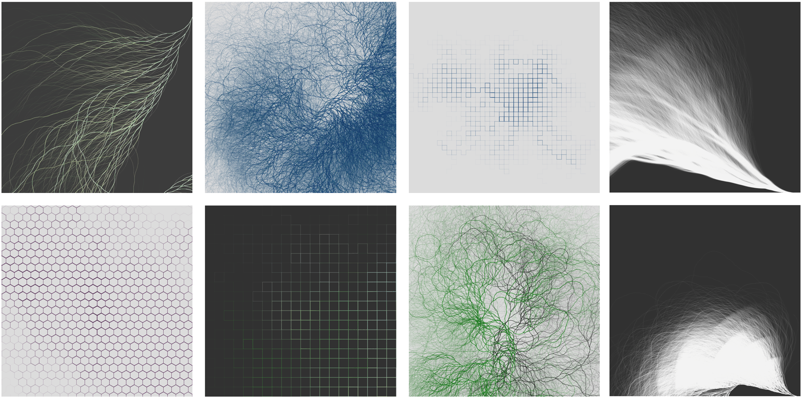
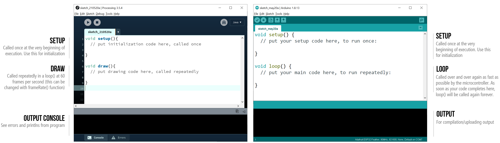
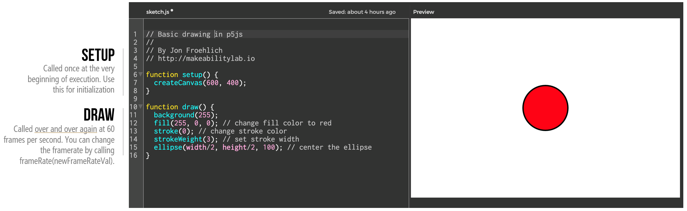
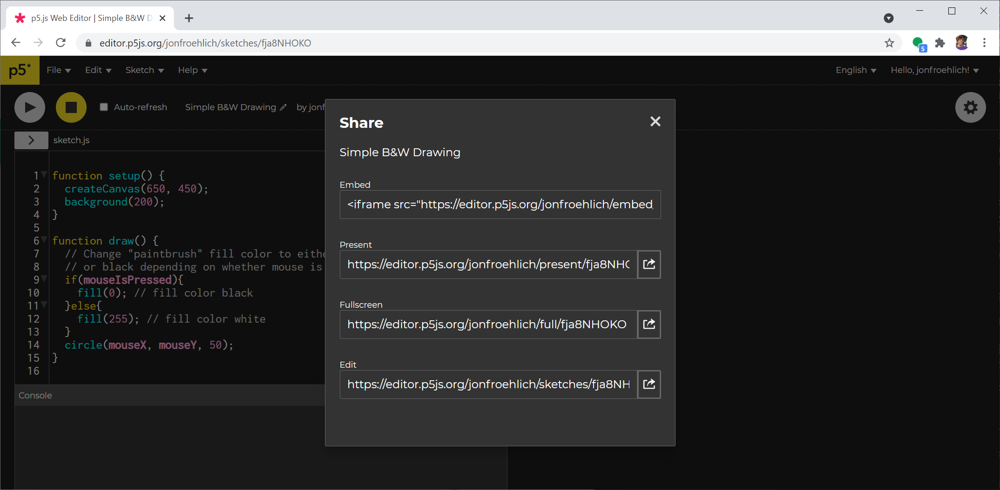
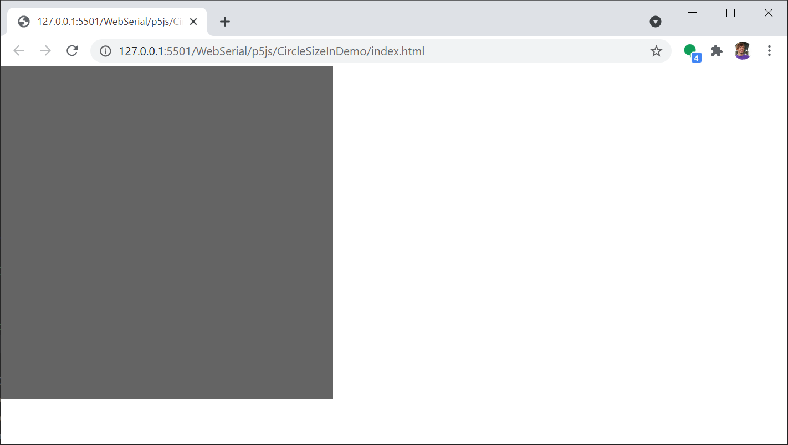
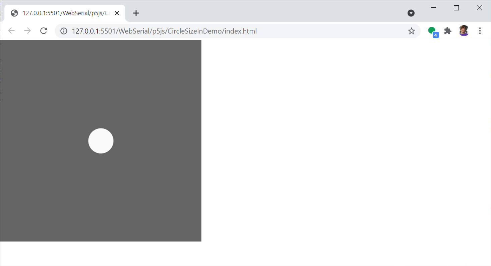
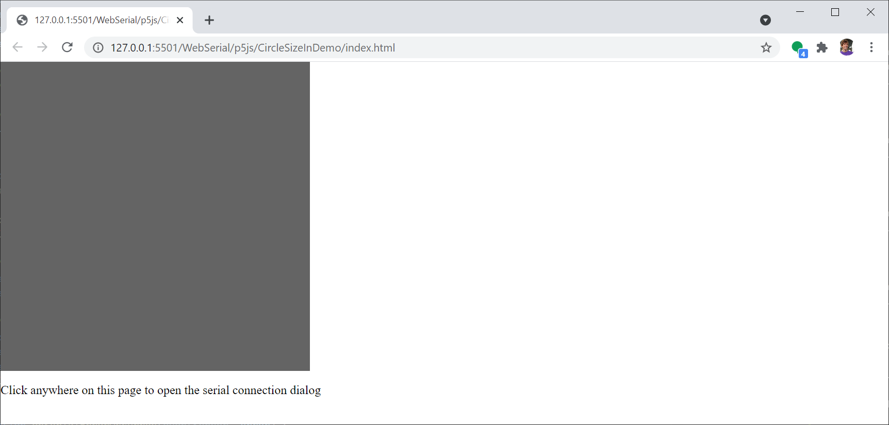

# {{ page.title | replace_first:'L','Lesson '}}
{: .no_toc }

## Table of Contents
{: .no_toc .text-delta }

1. TOC
{:toc}
---

We've only started to scratch the surface of what's possible when combining Arduino with computers. In this lesson (and the next), we're going to use a creative coding tool called [p5.js](https://p5js.org/) to help demonstrate this potential. It should be fun! 🎨

{: .note }
> **In this lesson, you will learn:**
> - What Processing and p5.js are, and why they're great tools for physical computing
> - How to set up a p5.js development environment (online editor and VSCode)
> - How to receive serial data from Arduino in a p5.js sketch (`Arduino → Computer`)
> - How to parse incoming serial data and use it to drive interactive visuals
> - How to build a real-time sensor graph in p5.js

## Processing and p5.js

**Figure.** Variations on the Collatz Conjecture by user [/u/ideology_boi](https://www.reddit.com/r/processing/comments/dy5z5h/collatz_variations/) on Reddit. Coded in ~200 lines in Processing ([code link](https://dailygenerative.art.blog/2019/11/17/reflections/)). Inspired by the Coding Train walkthrough video ["Collatz Conjecture"](https://www.youtube.com/watch?v=EYLWxwo1Ed8).
{: .fs-1 }

p5.js is based on [Processing](https://processing.org/), which was started by [Casey Reas](https://en.wikipedia.org/wiki/Casey_Reas) and [Ben Fry](https://en.wikipedia.org/wiki/Ben_Fry) at MIT in 2001 to provide an accessible programming tool for combining art and technology. From the Processing website:

>  Since 2001, Processing has promoted software literacy within the visual arts and visual literacy within technology. There are tens of thousands of students, artists, designers, researchers, and hobbyists who use Processing for learning and prototyping.
{: .fs-3 }

Processing includes both an IDE and a Java-based library that lets designers, artists, makers, and engineers *sketch with code*. It creates a safe, accessible, and easy-to-use coding sandbox to prototype, experiment, and play. Think of Processing like a creative canvas for coders!

Processing simplifies graphical programming and abstracts away complexity. In fact, when you write code in Processing, you don't even need to know that you're using Java! This design philosophy may feel familiar—the Arduino framework similarly abstracts away C/C++ complexity. This is not by accident: **the Arduino IDE and programming paradigm is based on Processing!**

**Figure.** The Arduino IDE is based on Processing ([source](https://www.arduino.cc/en/guide/introduction)). Right-click on image and select "Open Image in New Tab" to zoom in.
{: .fs-1 }

Creating interactive graphics in Processing requires only a few lines of code. For example, here we've created a small painting program in ~10 lines:

<video autoplay loop muted playsinline aria-label="Video of a ten-line drawing program written in Processing">
  <source src="assets/videos/ProcessingSimpleDrawingDemo-Optimized.mp4" type="video/mp4" />
</video>
**Video.** A ten-line drawing program written in [Processing](https://processing.org/).
{: .fs-1 }

It's hard to overemphasize Processing's impact on digital artists, creative coders, and CS education. Processing is used by professionals and hobbyists alike, and has produced work featured in music videos (*e.g.,* [Radiohead's House of Cards](https://www.aaronkoblin.com/work/rh/index.html)), exhibited at art galleries, and featured in movies, TV, and other media. Processing is open source and there is an ethos of sharing work and learning from others—see the [Reddit Processing community](https://www.reddit.com/r/processing/), for example, or read more at the [Processing Foundation](https://processingfoundation.org/).

  <iframe src="https://www.youtube.com/embed/8nTFjVm9sTQ?si=Vy5omJPJXA4eNcn8" title="YouTube video: Radiohead's House of Cards music video, created using data visualization in Processing" frameborder="0" allow="accelerometer; autoplay; clipboard-write; encrypted-media; gyroscope; picture-in-picture; web-share" referrerpolicy="strict-origin-when-cross-origin" allowfullscreen></iframe>

**Video.** The music video for [Radiohead's House of Cards](https://youtu.be/8nTFjVm9sTQ?si=6Y7C4gr3oC_d4-Vz) was created entirely using data visualization—no cameras or lights were used. The 3D data was captured using LIDAR and structured light scanners, then rendered in Processing. See Aaron Koblin's writeup [here](https://www.aaronkoblin.com/work/rh/index.html) and the [source code + data on GitHub](https://github.com/dataarts/radiohead).
{: .fs-1 }

<!-- Space simulation in 35 lines of code: https://www.reddit.com/r/processing/comments/dswnx6/a_galaxy_in_35_lines_of_code/ 
https://www.reddit.com/r/processing/comments/gye5sd/platonic_waves_octahedron/
https://www.reddit.com/r/processing/comments/e12eg3/waves/
https://www.reddit.com/r/processing/comments/du2ewt/tree_generator/
-->

### p5.js

In 2008, [John Resig](https://en.wikipedia.org/wiki/John_Resig) (the creator of jQuery) ported Processing to JavaScript, which allowed creators to use Processing without a Java plugin ([Wikipedia](https://en.wikipedia.org/wiki/Processing_(programming_language)#Processing.js)). While an early success—adopted by teaching programs like [Khan Academy](https://www.khanacademy.org/)—the port came a bit early in HTML+JavaScript history.

In 2013, [Lauren McCarthy](https://en.wikipedia.org/wiki/Lauren_Lee_McCarthy) (media artist and professor at UCLA) created [p5.js](https://p5js.org/), which is now the officially supported JavaScript-based library for Processing and renders natively to the [Canvas](https://developer.mozilla.org/en-US/docs/Web/API/Canvas_API) element. Similar to the original Processing mission, p5.js is:

>  a JavaScript library for creative coding, with a focus on making coding accessible and inclusive for artists, designers, educators, beginners, and anyone else! p5.js is free and open-source because we believe software, and the tools to learn it, should be accessible to everyone.
{: .fs-3 }

Even though p5.js is in JavaScript rather than Java—two languages that are similarly named but have absolutely [no relation](https://en.wikipedia.org/wiki/JavaScript#Java)—the p5.js API is nearly identical to Processing. So it's very easy to translate pre-existing Processing code to p5.js. Similar to Processing, p5.js abstracts away much of the complexity of JavaScript and lets you focus on interactive graphics and visualizations. Here's a simple p5.js program—notice the similarities to Processing?

And here's the same black-and-white drawing program we wrote in Processing above, now in p5.js:

<video autoplay loop muted playsinline aria-label="Video of the same ten-line drawing program now written in p5.js">
  <source src="assets/videos/p5jsSimpleDrawingDemo-Optimized.mp4" type="video/mp4" />
</video>
**Video.** A ten-line drawing program written in [p5.js](https://editor.p5js.org/jonfroehlich/sketches/fja8NHOKO). View, edit, and play with the code via the [online editor](https://editor.p5js.org/jonfroehlich/sketches/fja8NHOKO).
{: .fs-1 }

p5.js also has a convenient [online editor](https://editor.p5js.org/), which makes it easy to rapidly write, test, iterate on, and share code. In the editor, go to `File → Share` and select one of the options.

**Figure.** Sharing options in the p5.js [online editor](https://editor.p5js.org/).
{: .fs-1 }

You can not only [view our code](https://editor.p5js.org/jonfroehlich/sketches/fja8NHOKO) and make edits directly—don't worry, this won't affect the original—but you can also embed sketches in other HTML pages. Here we've embedded the drawing sketch below! Hold down the mouse to change the "paintbrush" to pure black.

<iframe width="100%" height="510" scrolling="no" src="https://editor.p5js.org/jonfroehlich/embed/fja8NHOKO" title="Embedded p5.js drawing sketch"></iframe>
**Code.** A live embedded version of our simple b&w drawing program in p5.js. View, edit, and play with the code [here](https://editor.p5js.org/jonfroehlich/sketches/fja8NHOKO).
{: .fs-1 }

Like Processing, the key concept is to *sketch with code*—to play, to experiment, to iterate, to rapidly prototype ideas. It's intellectually freeing!

<!-- ### p5.js examples -->

<!-- Circle of rings: https://codepen.io/Mamboleoo/pen/JjGZBqL -->

### p5.js examples written in the online editor

Here are some examples we've written directly in the p5.js editor. Click any link to see, edit, and run the code. Note that many of these were written while we were still learning p5.js ourselves (and our learning journey never ends!).

- [Sound Visualizations](https://editor.p5js.org/jonfroehlich/sketches/d2euV09i)
- [Santa Landscape Generator](https://editor.p5js.org/jonfroehlich/sketches/KFDQe5sbQ)
- [Cookie Monster Game](https://editor.p5js.org/jonfroehlich/sketches/oUIeXC9sS)
- [Basic Slider Scroller Game](https://editor.p5js.org/jonfroehlich/sketches/JwvvVJlNi)
- [Falling Star FFT Game](https://editor.p5js.org/jonfroehlich/sketches/UvFAcoUgu)
- [Flappy Bird](https://editor.p5js.org/jonfroehlich/sketches/shtF6XFeY)

<!-- TODO: verify all p5.js editor links above are still active -->

### p5.js 2.0

p5.js is currently undergoing a major transition from version 1.x to **version 2.0**. This is the biggest change to p5.js since Lauren McCarthy created it in 2013, and it's worth understanding what's happening—even though it **does not significantly affect our serial communication code**.

The p5.js 2.0 project, led by [Kit Kuksenok](https://medium.com/processing-foundation/p5-js-2-0-you-are-here-f827f40519a7) at the Processing Foundation, modernizes p5.js to align with how JavaScript has evolved over the past decade. The key changes include:

- **`preload()` removed in favor of `async`/`await`:** In 1.x, you loaded images and data in a special `preload()` function. In 2.0, loading functions return Promises and you use `async setup()` with `await`. This aligns p5.js with standard JavaScript patterns.
- **Removed redundant functions:** Functions that p5.js provided but that JavaScript itself now handles natively (like array manipulation and some string functions) have been removed to keep the library lean.
- **Shape API updates:** The `beginShape()`/`endShape()` API has been reworked for more flexibility.
- **Compatibility addons available:** For each breaking change, the Processing Foundation provides a [compatibility addon](https://github.com/processing/p5.js-compatibility) so you can keep using 1.x patterns if needed.

Here's the official timeline:

| Date | Milestone |
|------|-----------|
| April 2025 | p5.js 2.0 released, opt-in in the p5.js Editor |
| August 2025 | Communication about 1.x end-of-life |
| March 2026 | No further updates to 1.x |
| **August 2026** | **p5.js 2.0 becomes the default in the p5.js Editor** |

{: .warning }
> **For this course (Spring 2026), we use p5.js 1.x.** The p5.js online editor still defaults to 1.x, and all of our 400+ example sketches are written for 1.x. When developing locally, we pin to a specific 1.x version in our `index.html` to avoid surprises (see the [template code](#starter-template-code) below).
>
> The good news: **our serial communication code works identically on both 1.x and 2.0.** The `setup()`, `draw()`, `createCanvas()`, and all the graphics functions we use are unchanged. The breaking changes (`preload()` removal, data structure functions) don't affect serial sketches.
>
> If you'd like to explore p5.js 2.0, visit [beta.p5js.org](https://beta.p5js.org/). Read the [official transition blog post](https://medium.com/processing-foundation/p5-js-2-0-you-are-here-f827f40519a7) and the [compatibility guide](https://github.com/processing/p5.js-compatibility) for details on migrating.

## Learning p5.js

After conquering the [OLED display](../advancedio/oled.md) and graphics rendering, p5.js will feel both familiar and infinitely more expressive. [Processing](https://processing.org/) (for Java) and [p5.js](https://p5js.org/) (for JavaScript) are some of our favorite programming environments, and we can't wait to share p5.js with you!

There are some **amazing** learning resources on the web. Rather than replicate them, we'll share them here:

- Johannes Preis' [Introduction to p5.js](https://medium.com/comsystoreply/introduction-to-p5-js-9a7da09f20aa) — an excellent introduction to the coding editor, basic graphic rendering, and interactivity.

- The official p5.js [Getting Started](https://p5js.org/get-started/) guide.

- The plethora of official [p5.js examples](https://p5js.org/examples/).

- The Coding Train's [Programming with p5.js](https://thecodingtrain.com/beginners/p5.js/) by Daniel Shiffman — probably the best, most interesting, fun, and accessible creative coding videos on the web.

- Lauren McCarthy's book [Getting started with p5.js](https://alliance-primo.hosted.exlibrisgroup.com/permalink/f/kjtuig/CP71274969160001451), available as an e-book via the UW library.

We will also cover parts of p5.js in lecture, but we assume you've read at least Preis' [Introduction to p5.js](https://medium.com/comsystoreply/introduction-to-p5-js-9a7da09f20aa) and the official [Getting Started](https://p5js.org/get-started/) guide.

<!-- TODO: verify all learning resource links above are still active -->

### Developing p5.js

You can develop p5.js projects either in the [online editor](https://editor.p5js.org/) or in your favorite web dev environment. For local development, we strongly recommend [VS Code](https://code.visualstudio.com). We often switch between the [online editor](https://editor.p5js.org/)—for quick sketches and easy sharing—and VSCode for larger or more complicated projects.

#### Setting up p5.js in VSCode

We used [Visual Studio Code](https://code.visualstudio.com/) in our [previous lesson](web-serial.md). By now, you should have VSCode installed with the [Live Server](https://marketplace.visualstudio.com/items?itemName=ritwickdey.LiveServer) extension. If not, follow [these instructions](web-serial.md#web-dev-tools) and do so now!

##### Using a p5.js VSCode extension

The easiest way to set up VSCode for p5.js is to install an extension like [p5.vscode](https://marketplace.visualstudio.com/items?itemName=samplavigne.p5-vscode) by Sam Lavigne. This extension auto-creates a project folder with the required HTML/CSS/JavaScript files, hooks up autocompletion for p5.js functions, supplies a local copy of the p5.js library, and bundles Live Server. To create a new project, open the Command Palette (`Ctrl+Shift+P` on Windows, `Cmd+Shift+P` on Mac) and type `Create p5.js Project`, then select an empty folder.

If you're a VSCode or web dev novice, we recommend this solution!

<video autoplay loop muted playsinline aria-label="Video showing VSCode autocomplete for p5.js functions and inline documentation">
  <source src="assets/videos/VSCodeAutocompleteForP5JS-TrimmedAndOptimized.mp4" type="video/mp4" />
</video>
**Video.** Spending time setting up VSCode for p5.js is worth the investment. As the video shows, you get autocomplete, inline documentation, and more. You can do this with the [p5.vscode](https://marketplace.visualstudio.com/items?itemName=samplavigne.p5-vscode) extension or via a manual setup, described next.
{: .fs-1 }

##### Manually setting up VSCode for p5.js

If you prefer to configure VSCode manually, the key challenge is getting autocompletion for p5.js keywords. p5.js is written in vanilla JavaScript rather than [TypeScript](https://www.typescriptlang.org/), so VSCode's [IntelliSense](https://code.visualstudio.com/docs/editor/intellisense) doesn't work out of the box. There are some [great blog posts](https://breaksome.tech/p5js-editor-how-to-set-up-visual-studio-code/) about how to get this working.

## p5.js, Web Serial, and Arduino

OK, let's get started making stuff! We'll begin with Arduino sending data to p5.js via serial (`Arduino → Computer`).

<!-- TODO: make circuit diagram -->

### Starter template code

To make it easier to build p5.js web apps with Web Serial, we've created a basic p5.js serial template. You can view it and duplicate it via the [p5.js online editor](https://editor.p5js.org/jonfroehlich/sketches/vPfUvLze_C) or from our GitHub repo ([SerialTemplate](https://github.com/makeabilitylab/p5js/tree/master/WebSerial/p5js/SerialTemplate)).

<!-- TODO: verify template links above are still active -->

{: .warning }
> The baud rate in your JavaScript program and your Arduino program **must match**. In JavaScript, set this with `let serialOptions = { baudRate: 115200 };`. In Arduino, use `Serial.begin(115200)`. If they don't match, you'll get garbled data or nothing at all. See our [Intro to Serial lesson](serial-intro.md) for details.

{: .note }
> **Using an ESP32?** Remember to use `115200` baud (not 9600). Also, the ESP32 has a 12-bit ADC (0–4095) instead of the Arduino Uno/Leonardo's 10-bit ADC (0–1023). If you're normalizing analog input to [0, 1], use `MAX_ANALOG_INPUT = 4095` instead of `1023`.

### Circle size app

Let's build a simple `Arduino → Computer` p5.js web app that reads in a single floating point number between [0, 1] (as text-encoded data) and draws an appropriately sized circle. We'll use the Arduino program [AnalogOut.ino](https://github.com/makeabilitylab/arduino/blob/master/Serial/AnalogOut/AnalogOut.ino) and the web app called [CircleSizeIn](https://github.com/makeabilitylab/p5js/tree/master/WebSerial/p5js/CircleSizeInDemo) ([live page](http://makeabilitylab.github.io/p5js/WebSerial/p5js/CircleSizeInDemo)). The full app experience looks like this:

<!-- TODO: verify CircleSizeIn live page and code links are still active -->

<video autoplay loop muted playsinline aria-label="Video demonstrating the CircleSizeIn p5.js app where a potentiometer controls circle size">
  <source src="assets/videos/AnalogInputOut.ino-CircleSizeIn-POT-TrimmedAndOptimized.mp4" type="video/mp4" />
</video>
**Video.** The p5.js app CircleSizeIn ([live page](http://makeabilitylab.github.io/p5js/WebSerial/p5js/CircleSizeInDemo), [code](https://github.com/makeabilitylab/p5js/tree/master/WebSerial/p5js/CircleSizeInDemo)), which receives serial input from the Arduino running [AnalogOut.ino](https://github.com/makeabilitylab/arduino/blob/master/Serial/AnalogOut/AnalogOut.ino). We use a potentiometer on Pin A0 as analog input.
{: .fs-1 }

Let's get building!

#### The Arduino code: AnalogOut.ino

The Arduino program is simple: read an analog value and transmit it via serial as a normalized fraction between [0, 1].

We use [`analogRead()`](https://www.arduino.cc/reference/en/language/functions/analog-io/analogread/) on Pin A0 and divide the reading by the maximum analog input value (1023 on the Arduino Uno and Leonardo with 10-bit ADCs, or 4095 on ESP32 boards with 12-bit ADCs). We set the baud rate to 115200.


const int DELAY_MS = 5;

const int ANALOG_INPUT_PIN = A0;
const int MAX_ANALOG_INPUT = 1023;

int _lastAnalogVal = -1;

void setup() {
  Serial.begin(115200); // set baud rate to 115200
}

void loop() {

  // Get the new analog value
  int analogVal = analogRead(ANALOG_INPUT_PIN);

  // If the analog value has changed, send a new one over serial
  if(_lastAnalogVal != analogVal){
    float sizeFrac = analogVal / (float)MAX_ANALOG_INPUT;
    Serial.println(sizeFrac, 4); // 4 decimal point precision
  }

  _lastAnalogVal = analogVal;
  delay(DELAY_MS);
}


**Code.** The full code is [AnalogOut.ino](https://github.com/makeabilitylab/arduino/blob/master/Serial/AnalogOut/AnalogOut.ino) in our GitHub.
{: .fs-1 }

This should all make sense—there's nothing new here. We've been doing this since the early [Intro to Arduino](../arduino/index.md) lessons.

#### The p5.js code: CircleSizeIn

We'll build up the p5.js app step-by-step. You can do this in the [p5.js online editor](https://editor.p5js.org/) or in VSCode. Our instructions are for VSCode.

##### Setup initial p5.js template

Start with a brand new blank project with `index.html`, `css/style.css`, and `sketch.js` files. We put them in a folder called `CircleSizeIn` but this is up to you.

If you have [p5.vscode](https://marketplace.visualstudio.com/items?itemName=samplavigne.p5-vscode) installed, you can create a new project from the Command Palette (`Ctrl+Shift+P` → `Create p5.js Project`). If you do this, make sure you add our serial library to the `<head>` in `index.html`:





Or you can build up the required files manually. The `index.html` should look like:


<!DOCTYPE html>
<html>

<head>
  
  
  <link rel="stylesheet" type="text/css" href="css/style.css">
  <meta charset="utf-8">
</head>

<body>
  
</body>

</html>


{: .note }
> Notice that we're pinning to **p5.js version 1.11.13** (`p5@1.11.13`) rather than using the latest version. This ensures your sketch continues to work even after the p5.js Editor [defaults to 2.0 in August 2026](#p5js-20). You can also use `p5@1` to always get the latest 1.x release.

The `css/style.css` file:


html, body {
  margin: 0;
  padding: 0;
}

canvas {
  display: block;
}


And the `sketch.js` file:


function setup() {
  createCanvas(400, 400);
}

function draw() {
  background(100);
}


Now save and load the page with Live Server. It should look like this:

**Figure.** An initial template for web development with p5.js and Web Serial.
{: .fs-1 }

If your page does not load or does not look like this, study our blank template here ([live page](https://makeabilitylab.github.io/p5js/WebSerial/p5js/BlankTemplate/), [code](https://github.com/makeabilitylab/p5js/tree/master/WebSerial/p5js/BlankTemplate)).

<!-- TODO: verify blank template links above are still active -->

##### Draw a circle

Let's update `sketch.js` to draw a white circle of diameter 50 in the canvas center. We'll use [`fill()`](https://p5js.org/reference/#/p5/fill) to set the fill color and [`noStroke()`](https://p5js.org/reference/#/p5/noStroke) to turn off outlining.


function setup() {
  createCanvas(400, 400);
}

function draw() {
  background(100);
  
  noStroke(); // turn off outline
  fill(250); // white circle

  // Get x,y center of drawing Canvas
  let xCenter = width / 2;
  let yCenter = height / 2;
  let circleDiameter = 50;
  circle(xCenter, yCenter, circleDiameter);
}


It should look like this:

Or here's [a live demo](https://editor.p5js.org/jonfroehlich/sketches/aPoybLEdC) from the p5.js online editor.

<iframe src="https://editor.p5js.org/jonfroehlich/embed/aPoybLEdC" width="100%" height="510" style="border: none;" title="Embedded p5.js sketch showing a static white circle on a gray canvas"></iframe>

##### Make circle dynamically sized

Now let's make this sketch interactive! We'll set the circle's size based on the mouse's x position. Later, we'll replace the mouse input with **incoming serial data**.


function draw() {
  background(100);
  
  noStroke(); // turn off outline
  fill(250); // white circle

  // Get x,y center of drawing Canvas
  let xCenter = width / 2;
  let yCenter = height / 2;

  // Set the diameter based on mouse x position
  const maxDiameter = min(width, height);
  let shapeFraction = mouseX / width;
  let circleDiameter = maxDiameter * shapeFraction;
  circle(xCenter, yCenter, circleDiameter);
}


It should look something like this:

<video autoplay loop muted playsinline aria-label="Video showing circle size changing based on mouse x position in p5.js">
  <source src="assets/videos/CircleSizeIn-MouseX.mp4" type="video/mp4" />
</video>

Or here's [a live demo](https://editor.p5js.org/jonfroehlich/sketches/HqhM0dc1B) from the p5.js online editor.

<iframe width="736" height="380" scrolling="no" src="https://editor.p5js.org/jonfroehlich/embed/HqhM0dc1B" title="Embedded p5.js sketch showing circle size controlled by mouse x position"></iframe>

##### Add in Web Serial and callback functions

Now we can add serial functionality. This is very similar to the [previous lesson](web-serial.md), but we'll add the code to `sketch.js` rather than inline in the HTML.

First, add global variables to the top of `sketch.js`:


let shapeFraction = 0; // tracks the new shape fraction off serial
let serial;            // the Serial object
let serialOptions = { baudRate: 115200 };
let pHtmlMsg;          // used for displaying messages via html (optional)


Then create the Serial object in `setup()`, set up callbacks, and attempt to auto-connect to previously approved ports:


function setup() {
  createCanvas(400, 400);

  // Setup Web Serial using serial.js
  serial = new Serial();
  serial.on(SerialEvents.CONNECTION_OPENED, onSerialConnectionOpened);
  serial.on(SerialEvents.CONNECTION_CLOSED, onSerialConnectionClosed);
  serial.on(SerialEvents.DATA_RECEIVED, onSerialDataReceived);
  serial.on(SerialEvents.ERROR_OCCURRED, onSerialErrorOccurred);

  // If we have previously approved ports, attempt to connect with them
  serial.autoConnectAndOpenPreviouslyApprovedPort(serialOptions);

  // Add in a lil 
 element to provide messages. This is optional
  pHtmlMsg = createP("Click anywhere on this page to open the serial connection dialog");
}


Next, add the callback functions:


function onSerialErrorOccurred(eventSender, error) {
  console.log("onSerialErrorOccurred", error);
  pHtmlMsg.html(error);
}

function onSerialConnectionOpened(eventSender) {
  console.log("onSerialConnectionOpened");
  pHtmlMsg.html("Serial connection opened successfully");
}

function onSerialConnectionClosed(eventSender) {
  console.log("onSerialConnectionClosed");
  pHtmlMsg.html("Serial connection closed");
}

function onSerialDataReceived(eventSender, newData) {
  console.log("onSerialDataReceived", newData);
  pHtmlMsg.html("onSerialDataReceived: " + newData);
}


Finally, add `mouseClicked()` to let the user connect to serial by clicking anywhere on the canvas:


function mouseClicked() {
  if (!serial.isOpen()) {
    serial.connectAndOpen(null, serialOptions);
  }
}


Save and run. The page should look the same except for the new `
` element at the bottom saying "Click anywhere on this page to open the serial connection dialog."

##### Parse incoming serial data

Finally, we need to parse the incoming serial data and use it to control the circle size. Update `onSerialDataReceived()` to store the incoming value:


function onSerialDataReceived(eventSender, newData) {
  console.log("onSerialDataReceived", newData);
  pHtmlMsg.html("onSerialDataReceived: " + newData);

  // Parse the incoming value as a float
  shapeFraction = parseFloat(newData);
}


And in `draw()`, simply comment out the mouse-based line since `shapeFraction` is now set by serial:


function draw() {
  background(100);
  
  noStroke(); // turn off outline
  fill(250); // white circle

  // Get x,y center of drawing Canvas
  let xCenter = width / 2;
  let yCenter = height / 2;

  // Set the diameter based on serial input (was: mouseX / width)
  const maxDiameter = min(width, height);
  // let shapeFraction = mouseX / width;  // <-- replaced by serial!
  let circleDiameter = maxDiameter * shapeFraction;
  circle(xCenter, yCenter, circleDiameter);
}


And that's it! We did it! You can view, edit, and run CircleSizeIn in the [p5.js online editor](https://editor.p5js.org/jonfroehlich/sketches/5Knw4tN1d) or via GitHub ([live page](http://makeabilitylab.github.io/p5js/WebSerial/p5js/CircleSizeInDemo), [code](https://github.com/makeabilitylab/p5js/tree/master/WebSerial/p5js/CircleSizeInDemo)).

<!-- TODO: verify CircleSizeIn editor, live page, and code links are still active -->

#### CircleSizeIn video demonstration

Here's a video demonstration:

<video autoplay loop muted playsinline aria-label="Video demonstrating the CircleSizeIn p5.js app with a potentiometer controlling circle size via serial">
  <source src="assets/videos/AnalogInputOut.ino-CircleSizeIn-POT-TrimmedAndOptimized.mp4" type="video/mp4" />
</video>
**Video.** The p5.js app CircleSizeIn ([live page](http://makeabilitylab.github.io/p5js/WebSerial/p5js/CircleSizeInDemo), [code](https://github.com/makeabilitylab/p5js/tree/master/WebSerial/p5js/CircleSizeInDemo)), which receives serial input from the Arduino running [AnalogOut.ino](https://github.com/makeabilitylab/arduino/blob/master/Serial/AnalogOut/AnalogOut.ino). We use a potentiometer on Pin A0. Note: in this video, we use [AnalogOutOLED.ino](https://github.com/makeabilitylab/arduino/blob/master/Serial/AnalogOutOLED/AnalogOutOLED.ino) to also show the data on the OLED.
{: .fs-1 }

#### Other sensors as input

Of course, we can hook up whatever sensor we want as input. Below are demonstrations with a [force-sensitive resistor](../arduino/force-sensitive-resistors.md) and an infrared distance sensor.

<!-- TODO: make circuit diagrams of each -->

##### CircleSizeIn with FSR

<video autoplay loop muted playsinline aria-label="Video demonstrating CircleSizeIn with a force-sensitive resistor controlling circle size">
  <source src="assets/videos/AnalogOut-CircleSizeIn-FSR-Trimmed2-Optimized.mp4" type="video/mp4" />
</video>
**Video.** CircleSizeIn ([live page](http://makeabilitylab.github.io/p5js/WebSerial/p5js/CircleSizeInDemo), [code](https://github.com/makeabilitylab/p5js/tree/master/WebSerial/p5js/CircleSizeInDemo)) with a [force-sensitive resistor (FSR)](../arduino/force-sensitive-resistors.md) on Pin A0 and Arduino running [AnalogOutOLED.ino](https://github.com/makeabilitylab/arduino/blob/master/Serial/AnalogOutOLED/AnalogOutOLED.ino).
{: .fs-1 }

##### CircleSizeIn with IR distance sensor

<video autoplay loop muted playsinline aria-label="Video demonstrating CircleSizeIn with a Sharp infrared distance sensor controlling circle size">
  <source src="assets/videos/SharpIRDistance-CircleSizeIn-Trimmed-Optimized.mp4" type="video/mp4" />
</video>
**Video.** CircleSizeIn with the [Sharp GP2Y0A21YK](https://www.sparkfun.com/products/242) infrared distance sensor (analog output: 3.1V at 10cm to 0.4V at 80cm). Because the IR sensor is noisy, we used [SharpIRDistanceOutOLED.ino](https://github.com/makeabilitylab/arduino/blob/master/Serial/SharpIRDistanceOutOLED/SharpIRDistanceOutOLED.ino) with a [moving average filter](../advancedio/smoothing-input.md) to smooth the input.
{: .fs-1 }

### Simple real-time graph

Once we get the data into p5.js, we can really do *anything* we want: use the input to change colors, play a game, make a visualization, and more!

Recall in our [OLED lesson](../advancedio/oled.md) that we built a [real-time analog graph](../advancedio/oled.md#demo-4-real-time-scrolling-analog-graph). During that lesson, we alluded to how that graph replicated a [famous Processing example](https://www.arduino.cc/en/Tutorial/BuiltInExamples/Graph) but self-contained on the Arduino. Now we can build that Processing example in p5.js!

On the Arduino side, we use the exact same code ([AnalogOut.ino](https://github.com/makeabilitylab/arduino/blob/master/Serial/AnalogOut/AnalogOut.ino)) as before—the Arduino simply reads analog data and transmits it via serial. We just need a new p5.js app. Let's call it `GraphIn`.

#### Writing GraphIn in p5.js

Begin with the same p5.js serial template: copy [SerialTemplate](https://github.com/makeabilitylab/p5js/tree/master/WebSerial/p5js/SerialTemplate) and rename the folder to `GraphIn`.

We're going to use a **queue** to temporarily store data coming off serial, then read from and empty that queue in `draw()`. For each new value, we draw a representative line at an ever-increasing x-pixel position (`xPos`). When we reach the canvas width, we reset `xPos` and start over.

The full code is ~50 lines:


let serial; // the Serial object
let serialOptions = { baudRate: 115200 };
let queue = [];
let xPos = 0;

function setup() {
  createCanvas(750, 420);

  // Setup Web Serial using serial.js
  serial = new Serial();
  serial.on(SerialEvents.DATA_RECEIVED, onSerialDataReceived);

  // If we have previously approved ports, attempt to connect with them
  serial.autoConnectAndOpenPreviouslyApprovedPort(serialOptions);

  // Add in a lil 
 element to provide messages. This is optional
  pHtmlMsg = createP("Click anywhere on this page to open the serial connection dialog");

  background(50);
}

function draw() {
  
  while(queue.length > 0){
    // Grab the least recent value of queue (first in first out)
    // JavaScript is not multithreaded, so we need not lock the queue
    // before reading/modifying.
    let val = queue.shift();
    let yPixelPos = height - val * height;

    // Spruce up the color a bit by dynamically setting the line
    // color based on the current sensor value
    let redColor = val * 255;
    stroke(redColor, 34, 255); //set the color
    line(xPos, height, xPos, yPixelPos);

    xPos++;
  }

  if(xPos >= width){
    xPos = 0;
    background(50);
  }
}

function onSerialDataReceived(eventSender, newData) {
  pHtmlMsg.html("onSerialDataReceived: " + newData);

  // JavaScript is not multithreaded, so we need not lock the queue
  // before pushing new elements
  queue.push(parseFloat(newData));
}

function mouseClicked() {
  if (!serial.isOpen()) {
    serial.connectAndOpen(null, serialOptions);
  }
}


That's it! Pretty amazing, huh?! You can view our implementation as a [live page](https://makeabilitylab.github.io/p5js/WebSerial/p5js/GraphIn/) or [on GitHub](https://github.com/makeabilitylab/p5js/tree/master/WebSerial/p5js/GraphIn).

<!-- TODO: verify GraphIn live page and code links are still active -->

##### GraphIn video demonstration

Here are two video demonstrations: one with a potentiometer and the other with the Sharp IR distance sensor.

<video autoplay loop muted playsinline aria-label="Video demonstrating the GraphIn p5.js app with a potentiometer showing real-time sensor data as colored bars">
  <source src="assets/videos/AnalogOut.ino-GraphIn-POT-Trimmed-Optimized.mp4" type="video/mp4" />
</video>
**Video.** GraphIn ([live page](https://makeabilitylab.github.io/p5js/WebSerial/p5js/GraphIn/), [code](https://github.com/makeabilitylab/p5js/tree/master/WebSerial/p5js/GraphIn)) with a potentiometer on Pin A0. The Arduino is running [AnalogOutOLED.ino](https://github.com/makeabilitylab/arduino/blob/master/Serial/AnalogOutOLED/AnalogOutOLED.ino) but something simpler like [AnalogOut.ino](https://github.com/makeabilitylab/arduino/blob/master/Serial/AnalogOut/AnalogOut.ino) would work too!
{: .fs-1 }

And here's a demonstration with the Sharp IR distance sensor:

<video autoplay loop muted playsinline aria-label="Video demonstrating the GraphIn p5.js app with an infrared distance sensor showing real-time proximity data">
  <source src="assets/videos/SharpIRDistanceOutOLED-GraphIn-Trimmed-Optimized.mp4" type="video/mp4" />
</video>
**Video.** GraphIn ([live page](https://makeabilitylab.github.io/p5js/WebSerial/p5js/GraphIn/), [code](https://github.com/makeabilitylab/p5js/tree/master/WebSerial/p5js/GraphIn)) with the [Sharp GP2Y0A21YK](https://www.sparkfun.com/products/242) infrared distance sensor. We used [SharpIRDistanceOutOLED.ino](https://github.com/makeabilitylab/arduino/blob/master/Serial/SharpIRDistanceOutOLED/SharpIRDistanceOutOLED.ino), which uses a moving average filter to smooth the noisy IR signal.
{: .fs-1 }

## Lesson Summary

In this lesson, you learned about Processing and p5.js—creative coding tools that make it easy to build interactive graphics—and how to use them with Web Serial to receive data from Arduino. Here are the key takeaways:

- **Processing** (2001, Java) and **p5.js** (2013, JavaScript) are creative coding environments that make graphical programming accessible. The Arduino IDE is actually based on Processing!
- **p5.js 2.0** is in transition (default in the editor by August 2026). Our serial communication code works on both 1.x and 2.0, but we pin to 1.x for stability.
- The **`setup()`/`draw()` pattern** in p5.js mirrors Arduino's `setup()`/`loop()`—familiar territory!
- For serial input (`Arduino → Computer`), the Arduino sends normalized data (*e.g.,* a float between 0 and 1) via `Serial.println()`, and the p5.js app receives it via the `onSerialDataReceived` callback.
- We use a **data queue** pattern to bridge the gap between serial events (which can fire at any time) and `draw()` (which runs at ~60fps). This prevents dropped data.
- Any analog sensor can be an input—potentiometers, force-sensitive resistors, distance sensors—as long as the Arduino normalizes and transmits the data.

## Exercises

**Exercise 1:** Modify the CircleSizeIn example to also change the **circle color** based on the incoming serial value. Map the value to a color using p5.js's [`lerpColor()`](https://p5js.org/reference/#/p5/lerpColor) function—for example, transitioning from blue (value = 0) to red (value = 1).

**Exercise 2:** Create a p5.js app that reads **two** comma-separated sensor values from Arduino (*e.g.,* `"0.5,0.3\n"`) and uses them to control the x and y position of a circle. You'll need to split the incoming string with `newData.split(",")` and parse each part.

**Exercise 3:** Extend the GraphIn example to be a **scrolling graph** instead of one that resets when it reaches the right edge. Use an array to store the most recent N values and shift the display left as new values arrive.

**Exercise 4:** Build a "**sound level meter**" p5.js app that reads an analog value from a [sound sensor](https://www.sparkfun.com/products/12642) or microphone breakout board and displays it as a vertical bar that grows and shrinks in real time. Add color thresholds (green for quiet, yellow for medium, red for loud).

## Next Lesson

In the [next lesson](p5js-serial-io.md), we'll build more complex examples where Arduino and p5.js bidirectionally communicate (`Computer ↔ Arduino`). It should be fun! 🚀

<nav class="lesson-nav" aria-label="Lesson navigation">
  <a href="web-serial.html" class="nav-prev">
    
&larr; Previous Lesson

    
Web Serial

  </a>
  <a href="p5js-serial-io.html" class="nav-next">
    
Next Lesson &rarr;

    
p5.js Serial I/O

  </a>
</nav>

<!-- TODO: consider showing one of our earlier p5.js videos we made for HCID with a controller? -->

<!-- - p5.js demos (I've made three: one output only, one input only, one bidirectional).

Simple ball size demo

- ExplodingImage?

For input, could show: FSR and then SharpIR (have SharpIRDistanceOut and SharpIRDistanceOutOLED)

EtchaSketch Demo
- Could use color sensor to color the paintbrush in etchasketch
- Also pressure to change brush size. Might need three hands for this

 -- Not just with pots but also FSRs, maybe the SharpIR sensor?
 -- Then show another version with pretty colors and ball sizes getting bigger? Kind of like that YouTube video version I have.

AccelBallDemo
- how to make this bidirectional?
- maybe you draw stuff on screen (like level editor) and it gets translated to OLED?

- And actually, accel could be etch-a-sketch input too

 -->