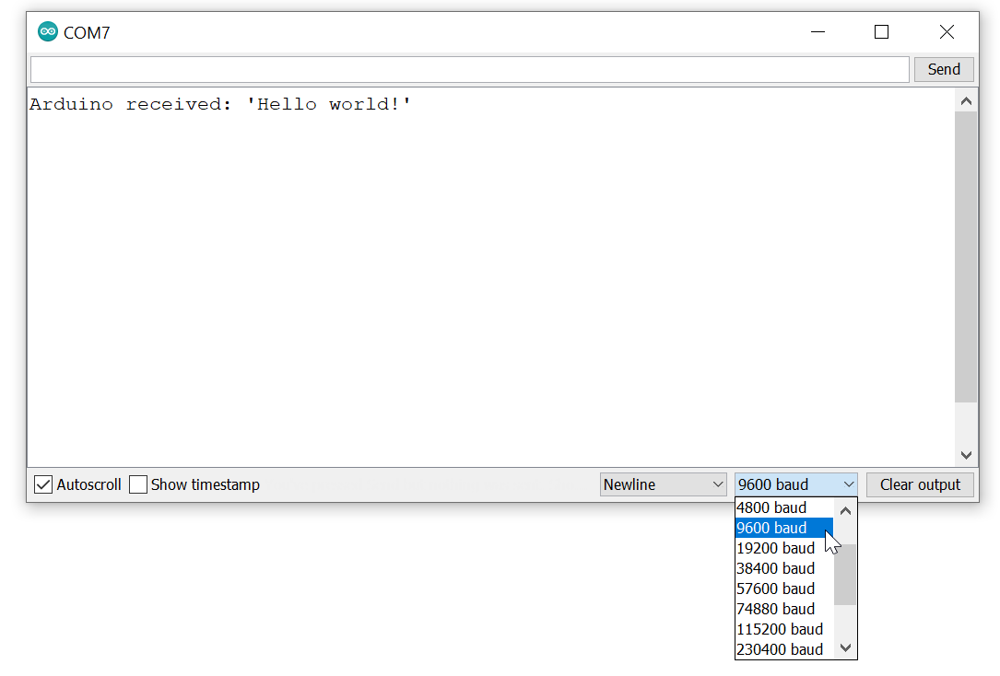
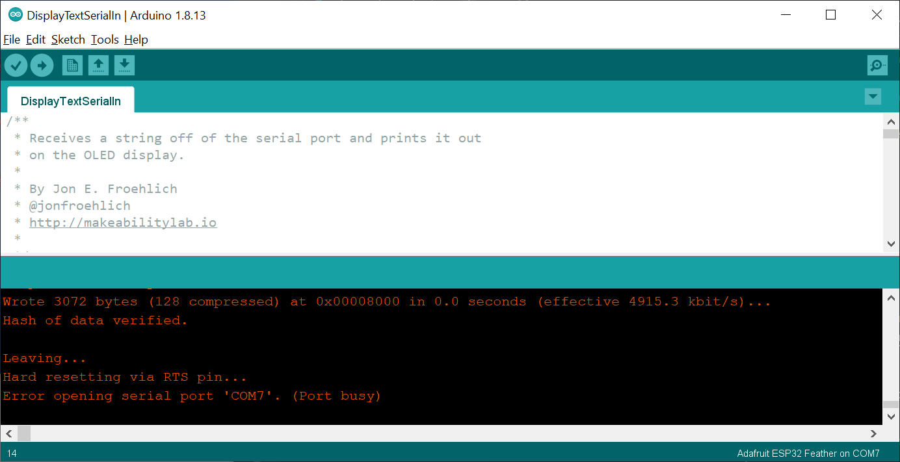
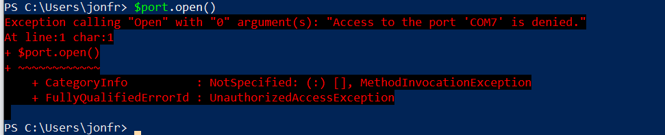
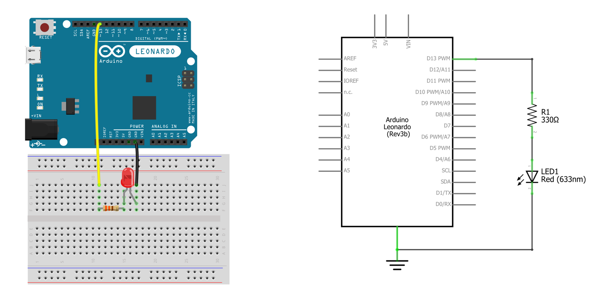

# {{ page.title }}
{: .no_toc }

## Table of Contents
{: .no_toc .text-delta }

1. TOC
{:toc}
---

Devices need to communicate. Sensors to microcontrollers. Microcontrollers to computers. Computers to the Internet. And beyond! Many different protocols have been created to support device-to-device communication from [Ethernet](https://en.wikipedia.org/wiki/Ethernet) and [Zigbee](https://en.wikipedia.org/wiki/Zigbee) to WiFi and Bluetooth. In this lesson, we will focus on asynchronous serial communication, specifically TTL serial (Transistor-Transistor Logic Serial)—an enduring standard that has prevailed since the beginning of personal computers and is what the [Arduino Serial library](https://www.arduino.cc/reference/en/language/functions/communication/serial/) uses. 

Unlike other popular serial communication protocols like [I<sup>2</sup>C](https://learn.sparkfun.com/tutorials/i2c/all) and [SPI](https://learn.sparkfun.com/tutorials/serial-peripheral-interface-spi/all), TTL serial is *asynchronous*, which means it does not rely on a shared clock signal (precisely timed voltage pulses) paired with its data lines. This has the benefit of fewer wires but does result in a bit of communication overhead for each transmitted "packet" or data frame.

In this lesson, we'll dive into asynchronous serial communication and how we can use it for bidrectional `Computer ↔ Arduino` communication. 

<!-- TODO:
- In future add in parallel vs. serial overview
- Add in some diagrams that show how serial works with voltage waveform
- https://www.circuitbasics.com/basics-uart-communication/
- https://en.wikipedia.org/wiki/Universal_asynchronous_receiver-transmitter
- https://www.analog.com/en/analog-dialogue/articles/uart-a-hardware-communication-protocol.html -->

## Serial communication with Arduino

<!-- Arduino uses a standard [asynchronous serial communication protocol](https://learn.sparkfun.com/tutorials/serial-communication/all) for serial communication.  -->

We've been using [Arduino's serial](https://www.arduino.cc/reference/en/language/functions/communication/serial/) functionality since our very first set of lessons (*e.g.,* [L3: Serial Debugging](../arduino/serial-print.md)). However, we've glossed over the details and used serial primarily for debugging rather than `Computer ↔ Arduino` communication.

On Arduino, we initialize the serial port using [`Serial.begin()`](https://www.arduino.cc/en/Serial.Begin). The [`Serial.begin()`](https://github.com/arduino/ArduinoCore-avr/blob/master/cores/arduino/HardwareSerial.cpp) function has two overloaded options:


begin(unsigned long baud)
begin(unsigned long baud, byte config)


Once `Serial.begin()` is called, the Arduino Uno and Leonardo take over Pins 1 and 0 for serial transmission and reception, respectively, and the RX and TX LEDs light up on the board. So, after `Serial.begin()` is called, you should not use Pins 1 and 0 (unless you're using them for cross-device communication or to hook up your [logic analyzer](https://en.wikipedia.org/wiki/Logic_analyzer)!).

Thus far, in our lessons, we have been using the first function—`begin(unsigned long baud)`—which sets the data rate in bits per second (baud). But what about the second function with `byte config` and what does this parameter mean? We'll dig in to both below.

### Baud rate

The baud rate specifies how fast data is sent over serial, which is expressed in bits-per-second (bps). For communicating with a computer, the [Arduino docs](https://www.arduino.cc/en/Serial.Begin) recommend: 300 bps, 600, 1200, 2400, 4800, 9600, 14400, 19200, 28800, 38400, 57600, or 115200. Both devices—in this case, the Arduino and the computer—need to be set to the **same** baud rate to communicate.

Thus far, speed hasn't been a concern. We've typically used 9600 bps (or 9.6 kbps) for transmitting our debugging info. At 9600 bps, the transmitter transmits one new voltage pulse (*e.g.,* HIGH corresponding to +5V and LOW corresponding to 0V) every 1/9600th of a second, which is interpreted as a bit (a 1 or 0) by the receiver. Arduino recommends up to 115200 or 115.2 kbps, which is 12x faster than 9600 (but still slow by today's networking standards, of course).


{: .mx-auto .align-center }
**Figure.** The Arduino IDE's [Serial Monitor](../arduino/serial-print.md), which has a drop down for baud rate. The baud rate used in `Serial.begin(<baud>)` must match this drop down menu setting or Serial Monitor will not properly communicate with Arduino.
{: .fs-1 }

#### What's the fastest serial baud rate?

This will be microcontroller dependent. The Arduino Uno uses a ATmega328P microcontroller, which states a maximum baud rate of 2,000,000 baud (2 Mbps). On [Stack Overflow](https://arduino.stackexchange.com/a/299/63793), Connor Wolf found that though the Uno was capable of communicating at 2Mpbs, the Arduino serial library resulted in only an effective 500 kbps communication rate. 

### The asynchronous serial communication frame

The second function, `begin(unsigned long baud, byte config)`, allows for an optional argument that configures the serial transmission packet or frame. A serial transmission frame consists of three pieces: **data**, **parity**, and **synchronization bits** (start and stop). 


**Figure.** An asynchronous serial communication frame.
{: .fs-1 }

The [data bit](https://en.wikipedia.org/wiki/Asynchronous_serial_communication) specifies the length of the data portion of the transmission frame (5-9), the [parity bit](https://en.wikipedia.org/wiki/Parity_bit) is a simple form of error detecting code (and can be turned on with '1' or off with '0'), and the synchronization bits help demarcate a frame. There is always *one* start bit at the beginning of a frame but there can be one or two stop bits at the end (though one is most common). On Arduino, the default transmission frame configuration is: 8 data bits, no parity, one stop bit—this is a common configuration.

Importantly, if the baud and config settings do not match between the Arduino and the computer, communication will not work. If something is not working for you, this is the first thing to double check!

<!-- TODO: would be nice to have some diagrams here showing the frame and voltages, etc. Kind of like what they have here: https://itp.nyu.edu/physcomp/lessons/serial-communication-the-basics/ -->

### Only one computer program can open a serial port at a time

Only one computer program can open a serial port at a time. For example, if you attempt to open Serial Monitor on the same COM port that has been opened by another program, you will receive an error like this: `Error opening serial port 'COM7'. (Port busy)`.


**Figure.** A demonstration of what happens if you try to open Serial Monitor on a COM port that is already opened by another program. The Arduino IDE shows an error stating `Error opening serial port 'COM7'. (Port busy)`.
{: .fs-1 }

Similarly, if we attempt to access a previously opened serial port with [PowerShell](https://docs.microsoft.com/en-us/powershell/scripting/overview), we receive `Access to the port 'COM7' is denied.`


**Figure.** Only one software program can access a serial port at a time.
{: .fs-1 }

### Serial buffers

Incoming serial data is stored in a serial buffer, which is read as a first-in, first-out queue (FIFO). On the Arduino, this buffer is 64 bytes (defined in [USBAPI.h](https://github.com/arduino/ArduinoCore-avr/blob/master/cores/arduino/USBAPI.h)) and is implemented as a circular or ring buffer. At 9600 baud, this buffer will fill in 53 milliseconds (9600 baud is 1,200 bytes/second or 1 byte every 0.83 millisecond).

### Serial to USB? USB to serial?

In the 1980s and 1990s, computers had serial ports like [RS-232 connections](https://en.wikipedia.org/wiki/RS-232) to support asynchronous serial communication. Now, we use USB (Universal Serial Bus)—a far more sophisticated and efficient serial communication standard that allows multiple devices to communicate over the same wires. However, because asynchronous serial communication persists, USB drivers and our operating systems support asynchronous serial communication over USB. Devices, like the Arduino, include a USB-to-serial converter that shows up as a serial port when you plug them in (just as if you were using an old serial connection). You might see the Arduino device, for example, as a USBtoUART device (UART is Universal Asynchronous Receiver-Transmitter).

## Developing serial communication software applications

So, how can we design and implement a computer program to communicate with Arduino via serial? To answer this, let's decompose serial communication into three high-level layers:

- **Hardware layer:** How is data communicated over hardware? How many wires are used? What does the voltage signal look like? Thankfully, Arduino handles this for us. And for `Computer ↔ Arduino` serial communication, serial data is transmitted via the USB cable. 
- **Serial protocol:** What is the format of a serial transmission packet (*e.g.,* the data and parity bits)? How do we compose this packet? Again, we do not really need to worry about this. Arduino uses the standard [asynchronous serial protocol](https://learn.sparkfun.com/tutorials/serial-communication/all) and includes the software library [`Serial`](https://www.arduino.cc/reference/en/language/functions/communication/serial/) to support this. We just need to make sure that both communicating devices are using the same baud rate and data packet configuration.
- **Application layer:** How do applications communicate together using serial? Aha, this is the key question for this sub-section!

The answer—for better or worse—is completely up to you! If you're writing serial communication code for both devices (the application on Arduino and the application on your computer), you get to decide how these applications communicate—you're in complete control. There are, however, some important considerations, including: binary vs. ASCII-encoded data, message formatting, handshaking, and message acknowledgments (call-and-response).

### Binary vs. ASCII-encoded data

With serial communication, we can either transmit/receive data as a series of bits (raw binary data) or as alphanumeric characters (ASCII-encoded data). 

#### Reading and writing binary data

To read binary data with Arduino, use [`readBytes()`](https://www.arduino.cc/reference/en/language/functions/communication/serial/readbytes/) or [`readBytesUntil()`](https://www.arduino.cc/reference/en/language/functions/communication/serial/readbytesuntil/).


size_t readBytes(byte *buffer, size_t length)
size_t readBytesUntil(byte terminator, byte *buffer, size_t length)


[`Serial.readBytes()`](https://www.arduino.cc/reference/en/language/functions/communication/serial/readbytes/) reads bytes from the serial port into a buffer and terminates if the determined length has been read or it times out (see [`Serial.setTimeout()`](https://www.arduino.cc/reference/en/language/functions/communication/serial/settimeout/)). [`Serial.readBytesUntil()`](https://www.arduino.cc/reference/en/language/functions/communication/serial/readbytesuntil/) is similar but also has a terminator parameter—if the terminator byte is detected, the function returns all bytes up to the last byte before the terminator. Both functions return the number of bytes read.

To write binary data, we can use [`Serial.write()`](https://www.arduino.cc/reference/en/language/functions/communication/serial/write/), which is an overloaded function:


size_t write(byte val); // value to send as a single byte
size_t write(String str); // string to send as a series of bytes
size_t write(byte *buffer, size_t length); // an array and number of bytes in buffer


All three [`Serial.write()`](https://www.arduino.cc/reference/en/language/functions/communication/serial/write/) functions return the number of bytes written.

#### Reading and writing ASCII-encoded data

Reading and writing ASCII-encoded data should feel more familiar. Indeed, for our use-case of [serial-based debugging](../arduino/serial-print.md), we've been using [`Serial.print()`](https://www.arduino.cc/reference/en/language/functions/communication/serial/print/) and [`Serial.println()`](https://www.arduino.cc/reference/en/language/functions/communication/serial/println/), which transmits data as human-readable ASCII text. 

To read ASCII data, we can use [`Serial.readString()`](https://www.arduino.cc/reference/en/language/functions/communication/serial/readstring/) and [`Serial.readStringUntil()`](https://www.arduino.cc/reference/en/language/functions/communication/serial/readstringuntil/):


String readString();
String readStringUntil(char terminator)


Both functions read characters from the serial buffer and store them in a String, which is returned. [`Serial.readString()`](https://www.arduino.cc/reference/en/language/functions/communication/serial/readstring/) terminates if it times out (see [`Serial.setTimeout()`](https://www.arduino.cc/reference/en/language/functions/communication/serial/settimeout/)). [`Serial.readStringUntil()`](https://www.arduino.cc/reference/en/language/functions/communication/serial/readstringuntil/) terminates either if a timeout is reached or if a terminator character is identified.

To write ASCII data, we use [`Serial.print()`](https://www.arduino.cc/reference/en/language/functions/communication/serial/print/) and [`Serial.println()`](https://www.arduino.cc/reference/en/language/functions/communication/serial/println/):


size_t print(const __FlashStringHelper *);
size_t print(const String &);
size_t print(const char[]);
size_t print(char);
size_t print(unsigned char, int = DEC);
size_t print(int, int = DEC);
size_t print(unsigned int, int = DEC);
size_t print(long, int = DEC);
size_t print(unsigned long, int = DEC);
size_t print(double, int = 2);
size_t print(const Printable&);

size_t println(const __FlashStringHelper *);
size_t println(const String &s);
size_t println(const char[]);
size_t println(char);
size_t println(unsigned char, int = DEC);
size_t println(int, int = DEC);
size_t println(unsigned int, int = DEC);
size_t println(long, int = DEC);
size_t println(unsigned long, int = DEC);
size_t println(double, int = 2);
size_t println(const Printable&);
size_t println(void);


Both functions return the number of bytes written. See their respective documentation pages for more details: [`Serial.print()`](https://www.arduino.cc/reference/en/language/functions/communication/serial/print/) and [`Serial.println()`](https://www.arduino.cc/reference/en/language/functions/communication/serial/println/)

<!-- See: https://github.com/arduino/ArduinoCore-avr/blob/master/cores/arduino/Stream.cpp -->

#### Why use binary vs. ASCII?

Why might we want to use **binary** *vs.* **text** **encodings**? Well, if we are trying to transmit binary data—like an image, video, or song—then communicating via binary is preferred. It's also more bandwidth efficient (uses fewer bits). However, in our courses, we're typically transmitting/receiving small amounts of data and it's beneficial for debugging purposes (and human understanding) to use an ASCII-encoded format.

#### Binary vs. ASCII example

Let's take a look at an example. Let's say we want to transmit a signal that ranges between 0 - 255 from our Arduino to our computer. Because the value only ranges from 0 to 255, we can encode this with 8 bits or a single byte (`0000 0000` to `1111 1111` or `0x00` and `0xFF` in hexadecimal). Sending via binary looks like:


byte signalVal = getSignal();
Serial.write(signalVal)


So, for example, if `getSignal()` returns 15, we would transmit `0000 1111` (or `0x0F`). If `getSignal()` returns 127, we would transmit `0111 1111` (`0x7`). If 255, then `1111 1111` (`0xFF`). And so on.

However, we could also transmit this using ASCII-encoded data with [`Serial.println()`](https://www.arduino.cc/reference/en/language/functions/communication/serial/println/):


byte signalVal = getSignal();
Serial.println(signalVal)

 
However, now if `getSignal()` returns 15, we would need to transmit **four bytes** rather than just one byte. Using the [ASCII-encoding chart](https://www.asciichart.com/), we can see that the ASCII encoding for '1' is ASCII 49 or `0011 0001` (`0x31`) and '5' is ASCII 53 or `0011 0101` (`0x35`). Then, unlike [`Serial.print()`](https://www.arduino.cc/reference/en/language/functions/communication/serial/print/), [`Serial.println()`](https://www.arduino.cc/reference/en/language/functions/communication/serial/println/) adds in a carriage return character '\r', which is ASCII 13 or `0000 1101` (`0x0D`), and then a newline (or linefeed) character '\n', which is ASCII 10 or `0000 1010` (`0x0A`).

Similarly, if we wanted to transmit 127 or 255 using `Serial.println()`, we would need **five bytes**. For example, with 127, we would transmit '1' (ASCII 49 or `0011 0001`), '2' (ASCII 50 or `0011 0010`), '7' (ASCII 55 or `0011 0111`), '\r' (ASCII 13 or `0000 1101`), '\n' (ASCII 10 or `0000 1010`).

#### Both applications need to use same encoding

Note that the receiver needs to know whether data has been transmitted using binary or ASCII encodings. If the latter, the receiver can simply use a method like [`Serial.readStringUntil('\n')`](https://www.arduino.cc/reference/en/language/functions/communication/serial/readstringuntil/) and the data will be automatically transformed into an ASCII-encoded String. If the former, then a method like [`Serial.readBytes()`](https://www.arduino.cc/reference/en/language/functions/communication/serial/readbytes/) is necessary and the receiver must know how many bytes are being sent and how to decode them.

For our purposes, we almost always use the ASCII encoding because the benefit of human readability (*e.g.,* sending and receiving text) outweighs efficiency. However, you should consider this on a case-by-case basis depending on your application context, communication medium (wireless *vs.* wired), and power requirements (*e.g.,* low power applications should minimize transceiving).

### Formatting messages

The above example simply sent one value per transmission. For binary, we sent one byte per new signal read; for ASCII-encoding, we sent one line per new signal read. However, it's likely that you'll want to transmit and receive *multiple* values. How do we do this?

Again, it's completely up to you! If you're using ASCII-encoded transceiving, you could use a [comma-separated value (CSV) format](https://en.wikipedia.org/wiki/Comma-separated_values), [JSON](https://en.wikipedia.org/wiki/JSON), or some other messaging format of your own design.

As you'll commonly see in our demo code, we use a simple CSV format like this:


int sensorVal1 = analogRead(SENSOR1_INPUT_PIN);
int sensorVal2 = analogRead(SENSOR2_INPUT_PIN);
int sensorVal3 = analogRead(SENSOR3_INPUT_PIN);
Serial.print(sensorVal1);
Serial.print(",");
Serial.print(sensorVal1);
Serial.print(",");
Serial.println(sensorVal1);


For example, if `sensorVal1` is 896, `sensorVal1` 943, and `sensorVal3` is 349, then the above code would send a text string that looks like `896, 943, 349\r\n`.

On the receiving end, we might use [regex](https://en.wikipedia.org/wiki/Regular_expression) for parsing or write our own parsing code like this:



if(Serial.available() > 0){
    // If we're here, then serial data has been received
    // Read data off the serial port until we get to the endline delimeter ('\n')
    String rcvdSerialData = Serial.readStringUntil('\n');

    // Parse the comma separated string
    int startIndex = 0;
    int endIndex = rcvdSerialData.indexOf(','); // find first index of comma in the string
    if(endIndex != -1){

        // Parse out first sensor value
        String strSensorVal1 = rcvdSerialData.substring(startIndex, endIndex);
        int sensorVal1 = strSensorVal1.toInt();

        // Parse out the second sensor value
        startIndex = endIndex + 1;
        endIndex = rcvdSerialData.indexOf(',', startIndex);
        String strSensorVal2 = rcvdSerialData.substring(startIndex, endIndex);
        int sensorVal2 = strSensorVal2.toInt();

        // Parse out the third sensor value
        startIndex = endIndex + 1;
        endIndex = rcvdSerialData.length();
        String strSensorVal3 = rcvdSerialData.substring(startIndex, endIndex);
        int sensorVal3 = strSensorVal2.toInt();

        // Do stuff with sensor values
    } 
}


This example assumes that data is in the order of `sensorVal1, sensorVal2, sensorVal3` and that each received line is the same. To make this communication scheme more flexible, you could transmit a modified CSV with variable names (like key,value pairs) or use JSON. Towards the former, you could transmit the key,value pairs as: "`sensorVal1=896, sensorVal2=943, sensorVal3=349`". The receiver would then parse both the variable names and their values.

In all of our examples, we use very simple CSV formatting with ASCII-encoded transceiving. But feel free to do things differently!

### Handshaking

When two devices begin communicating—whether via serial or some other protocol—it's common to [handshake](https://en.wikipedia.org/wiki/Handshaking). That is, to transmit and receive a small set of initial messages to establish parameters for communication and to synchronize statuses. For example, upon connection establishment, you might have your two devices exchange their current set of stored values.

### Acknowledging data

Similarly, if you want to ensure that data has arrived and been parsed correctly. You might decide to transmit back an 'OK' message after each line of receive data along with a hash (this hash can be used by the original transmitter to verify data arrival).

## Example serial programs

Below, we are going to show a few different examples using the command line, Python, and then JavaScript. To keep things simple, in this lesson, we are going to focus on **unidirectional communication** from the computer to the Arduino (`Computer → Arduino`). That is, the computer will send data and the Arduino will receive data. Later, we will cover `Arduino → Computer` and bidirectional (duplex) communication `Computer ↔ Arduino`.

And actually, in all of our serial lessons—including this one—we will have the Arduino transmit something back to the computer to aid with debugging and ensure the Arduino received what we expected. We call this an echo message. You'll see!

### Simple Arduino serial receiver program

For our examples below, we will be running a simple program on our Arduino that reads ASCII-encoded data off of the serial port, parses that data into an integer, and uses `analogWrite` to output that integer to an output pin. In this case, we have hooked up a red LED with a current limiting resistor to the `OUTPUT_PIN`, which is set to `LED_BUILTIN` (Pin 13 on the Arduino Uno and Leonardo). The entire program looks like this:


const int DELAY_MS = 5;
const int OUTPUT_PIN = LED_BUILTIN;

void setup() {
  Serial.begin(9600);
  pinMode(OUTPUT_PIN, OUTPUT);
}

void loop() {
  // Check to see if there is any incoming serial data
  if(Serial.available() > 0){
    // If we're here, then serial data has been received
    // Read data off the serial port until we get to the endline delimeter ('\n')
    // Store all of this data into a string
    String rcvdSerialData = Serial.readStringUntil('\n'); 

    // Convert string data into an integer
    int ledValue = rcvdSerialData.toInt();

    // Ensure value is between 0 and 255 (our maximum output values)
    ledValue = constrain(ledValue, 0, 255);
    analogWrite(OUTPUT_PIN, ledValue);
    
    // Just for debugging, echo the data back on serial
    Serial.print("Arduino received: '");
    Serial.print(rcvdSerialData);
    Serial.println("'");
  }

  delay(DELAY_MS);
}


**Code.** This code is available as [SimpleSerialIn.ino](https://github.com/makeabilitylab/arduino/blob/master/Serial/SimpleSerialIn/SimpleSerialIn.ino) on GitHub. We will actually be using [SimpleSerialInOLED.ino](https://github.com/makeabilitylab/arduino/blob/master/Serial/SimpleSerialInOLED/SimpleSerialInOLED.ino) in our videos.
{: .fs-1}

#### Demo circuit

And here's the corresponding circuit for the program above, which consists of a current-limiting resistor and LED attached to Pin 13. Of course, you could build almost any circuit to respond to serial input. But let's keep things simple!


**Figure.** The corresponding circuit for [SimpleSerialIn.ino](https://github.com/makeabilitylab/arduino/blob/master/Serial/SimpleSerialIn/SimpleSerialIn.ino). Made in Fritzing and PowerPoint.
{: .fs-1}

### Using Serial Monitor

Let's begin by using our now familiar Arduino IDE [Serial Monitor](../arduino/serial-print.md) tool. With [SimpleSerialIn.ino](https://github.com/makeabilitylab/arduino/blob/master/Serial/SimpleSerialIn/SimpleSerialIn.ino) loaded on your Arduino and your Arduino connected to your computer, open the Serial Monitor and send data to our Arduino. Make sure you've selected the same baud rate used in `Serial.begin(<baud rate>)`.


**Figure** An annotated screenshot the Arduino IDE's [Serial Monitor](../arduino/serial-print.md) tool for sending and receiving serial data. The data "echoed" back to our Arduino is shown in the autoscrolling textfield (where it says "Arduino received...").
{: .fs-1}

#### Video demo using Serial Monitor

Here's a video demonstration of sending ASCII-encoded text via [Serial Monitor](../arduino/serial-print.md) to the Arduino running [SimpleSerialInOLED.ino](https://github.com/makeabilitylab/arduino/blob/master/Serial/SimpleSerialInOLED/SimpleSerialInOLED.ino). 

<video autoplay loop muted playsinline style="margin:0px">
  <source src="assets/videos/SimpleSerialIn-NoTalking-TrimmedAndSpedUp720p.mp4" type="video/mp4" />
</video>
**Video.** A video demonstrating using the Arduino IDE [Serial Monitor](../arduino/serial-print.md) tool to communicate with the Arduino running [SimpleSerialIn.ino](https://github.com/makeabilitylab/arduino/blob/master/Serial/SimpleSerialIn/SimpleSerialIn.ino). For this video, we are using a slightly modified program called [SimpleSerialInOLED.ino](https://github.com/makeabilitylab/arduino/blob/master/Serial/SimpleSerialInOLED/SimpleSerialInOLED.ino) along with an [OLED display](../advancedio/oled.md). This allows you to more easily see the received values.
{: .fs-1 }

Notice how we are able to print out what the Arduino receives because the Arduino cpde echos the received data back over serial using `Serial.print`. This is optional but helpful!


// Just for debugging, echo the data back on serial
Serial.print("Arduino received: '");
Serial.print(rcvdSerialData);
Serial.println("'");


### Command lines tools

While we've thus far emphasized the Arduino IDE's [Serial Monitor](../arduino/serial-print.md), there is nothing special or unique about that tool. We can use any application or programming language with serial support. Below, we'll show how to use command line tools for both Windows and Mac/Linux before showing an example with Python (but C#, Objective C, Java, *etc.* would work too!)

<!-- https://itp.nyu.edu/physcomp/lab-intro-to-serial-communications/#Connecting_via_the_Command_Line
https://learn.sparkfun.com/tutorials/terminal-basics/command-line-windows-mac-linux -->

#### Windows

On Windows, we can use the [PowerShell](https://docs.microsoft.com/en-us/powershell/scripting/overview?view=powershell-7.1) terminal, which is built into Windows 10, to read and write data from the serial port. For this, we'll follow the official [PowerShell blog](https://devblogs.microsoft.com/powershell/writing-and-reading-info-from-serial-ports/).

First, to find the available serial ports, we can use `getportnames()`.

```
PS> [System.IO.Ports.SerialPort]::getportnames()
COM7
```

Then, we'll create a `SerialPort` object, which takes the COM port, the baud rate, serial configuration parameters (parity bit, data bit length, and stop bit). 

```
PS> $port= new-Object System.IO.Ports.SerialPort COM7,9600,None,8,one
```

Now open this port.

```
PS> $port.open()
```

Write to the port using ASCII-encoded text with `WriteLine(<str>)`:

```
PS> $port.WriteLine(“Hello!")
```

Similarly, to read from the port, use `ReadLine()`:

```
PS> $port.ReadLine()
Arduino received: 'Hello!'
```
Finally, to close the port, use `Close()`. 

```
PS> $port.Close()
```

Thus, the full program is simply:

```
PS> $port= new-Object System.IO.Ports.SerialPort COM7,9600,None,8,one
PS> $port.open()
PS> $port.WriteLine("Hello!")
PS> $port.ReadLine()
PS> $port.Close()
```

##### Video demo using Windows PowerShell

Here's a video demonstration:

<video autoplay loop muted playsinline style="margin:0px">
  <source src="assets/videos/SimpleSerialIn-NoTalking-WindowsPowerShell-TrimmedAndSpedUp720p.mp4" type="video/mp4" />
</video>
**Video.** A video demonstrating using [Windows PowerShell](https://docs.microsoft.com/en-us/powershell/scripting/overview) to communicate with the Arduino running [SimpleSerialIn.ino](https://github.com/makeabilitylab/arduino/blob/master/Serial/SimpleSerialIn/SimpleSerialIn.ino). For this video, we are using a slightly modified program called [SimpleSerialInOLED.ino](https://github.com/makeabilitylab/arduino/blob/master/Serial/SimpleSerialInOLED/SimpleSerialInOLED.ino) along with an [OLED display](../advancedio/oled.md). This allows you to more easily see the received values.
{: .fs-1 }

#### Mac and Linux

On Mac and Linux, we can use the `screen` command as described by this [Sparkfun tutorial](https://learn.sparkfun.com/tutorials/terminal-basics/command-line-windows-mac-linux). Screen should be installed by default on Mac. If it's not installed on Linux, install it with `sudo apt-get install screen`.

First, we need to enumerate the available ports. Type:

```
> ls /dev/tty.*

/dev/tty.Bluetooth-Incoming-Port /dev/tty.SLAB_USBtoUART
/dev/tty.MALS                    /dev/tty.SOC
```

In this case, the Arduino is listed as `/dev/tty.SLAB_USBtoUART`. We can connect to it via screen by typing `screen <port_name> <baud_rate>`:

```
> screen /dev/tty.SLAB_USBtoUART 9600
```

You terminal should go blank with a flashing cursor. You are now connected to that port. Anything you write will be instantly sent to Arduino as ASCII-encoded text.

To disconnect, you must type `control-a` followed by `control-\`. The screen program will then ask if you want to exit. Type `y`.

### Python

Finally, let's make a simple program in [Python](https://www.python.org/) to write and read data off the serial port. This is simply to demonstrate the overall programming concepts before we dive more deeply into JavaScript solutions for our other lessons. Again, you can really use any programming language you like!

For serial communication with Python, we'll use the [pySerial](https://pyserial.readthedocs.io/en/latest/) library. With Python3 installed, open your terminal and type:

```
> pip3 install pyserial
```

This will install the [pySerial](https://pyserial.readthedocs.io/en/latest/) library. pySerial is quite straightforward and pySerial's ["fast intro" docs](https://pyserial.readthedocs.io/en/latest/shortintro.html) provide a number of examples.

Let's write a quick Python program to communicate with [SimpleSerialIn.ino](https://github.com/makeabilitylab/arduino/blob/master/Serial/SimpleSerialIn/SimpleSerialIn.ino).

First, import the required libraries and then create and initialize a pySerial `Serial` object.


import serial # from https://pyserial.readthedocs.io
import time

# Create serial object on COM13 with 9600 baud and a read timeout
# of one second (can be a float value, so 1.5 would be 1.5s)
ser = serial.Serial(port='COM13', baudrate=9600, timeout=1)


Now, write code to ask the user to input a number between 0 and 255:


# Ask user for number between 0 and 255 and store in num
num = input("Enter a number (0 - 255): ")


Then encode this data as a string. You can force it to ASCII via `num.encode("ascii", "ignore")`


# Encode numeric value as a string
strNum = str.encode(num)


Now we're ready to send the data using pySerial's [`write(<data>)`](https://pyserial.readthedocs.io/en/latest/pyserial_api.html#serial.Serial.write) function.


# Send the data using pyserial write method
print("Sending...", strNum)
ser.write(strNum)
time.sleep(0.05) # sleep for 0.05s


Finally, read the response from the Arduino and print it out:


# Read data back from Arduino
echoLine = ser.readline()

print(echoLine);
print(); # empty line


And that's it! This code is available as [serial_demo.py](https://github.com/makeabilitylab/arduino/blob/master/Python/Serial/serial_demo.py) in our GitHub. Note, after creating the `Serial` object, we wrap everything in a `While True:` statement to infinitely loop and ask for new user data. See video below.

#### Video demo using Python

<video autoplay loop muted playsinline style="margin:0px">
  <source src="assets/videos/SimpleSerialIn-Python-NoTalking2-TrimmedAndSpedUp720p.mp4" type="video/mp4" />
</video>
**Video.** A video demonstrating using [Python3](https://www.python.org/downloads/) with [pySerial](https://pypi.org/project/pyserial/) to communicate with the Arduino running [SimpleSerialIn.ino](https://github.com/makeabilitylab/arduino/blob/master/Serial/SimpleSerialIn/SimpleSerialIn.ino). For this video, we are using a slightly modified program called [SimpleSerialInOLED.ino](https://github.com/makeabilitylab/arduino/blob/master/Serial/SimpleSerialInOLED/SimpleSerialInOLED.ino) along with an [OLED display](../advancedio/oled.md). This allows you to more easily see the received values.
{: .fs-1 }

#### Using Python for real-time gesture recognition

Of course, we can do significantly more interesting things using serial communication. In the video below, for example, we demonstrate a Python program that reads in real-time accelerometer data sent via the Arduino over serial and classifies gestures (using a template matching).

<iframe width="736" height="414" src="https://www.youtube.com/embed/nnTyqCwYVbA" title="YouTube video player" frameborder="0" allow="accelerometer; autoplay; clipboard-write; encrypted-media; gyroscope; picture-in-picture" allowfullscreen></iframe>

**Video.** A video demonstrating real-time gesture recognition using 3-axis accelerometer data sent via the Arduino over serial. We wrote the gesture recognizer in Python; however, we are not linking to the code because we use it as an assignment in some of our courses. You can learn more in our [Signal Classification](../signals/classification.md) lesson series.
{: .fs-1 }

There is a world of possibilities here. And we'll begin to explore them in this lesson series!

## Activity

For your prototyping journals, run [SimpleSerialIn.ino](https://github.com/makeabilitylab/arduino/blob/master/Serial/SimpleSerialIn/SimpleSerialIn.ino) or [SimpleSerialInOLED.ino](https://github.com/makeabilitylab/arduino/blob/master/Serial/SimpleSerialInOLED/SimpleSerialInOLED.ino) with the appropriate circuit and choose one of the above approaches (or develop your own!) to communicate with the Arduino. Take a video and reflect on what you've learned in this lesson.

## Resources

- [Intro to Asynchronous Serial Communications](https://itp.nyu.edu/physcomp/lab-intro-to-serial-communications/), NYU ITP Physical Computing course

- [Serial Communication](https://learn.sparkfun.com/tutorials/serial-communication/all), Sparkfun.com

- [Asynchronous Serial Communication: The Basics](https://itp.nyu.edu/physcomp/lessons/serial-communication-the-basics/), NYU ITP Physical Computing course

### Videos

- [Serial 1: Introduction](https://vimeo.com/380355568), NYU ITP Physical Computing course video

- [Serial 2: Logic Analyzer and ASCII](https://vimeo.com/380355716), NYU ITP Physical Computing course video 

## Next Lesson

In the [next lesson](web-serial), we'll apply our newfound serial knowledge to communicating with our Arduino via our web browsers using the [Web Serial API](https://web.dev/serial/).

<span class="fs-6">
[Next: Web Serial](web-serial.md){: .btn .btn-outline }
</span>

<!-- #### DisplayTextSerialIn

For each, we will be running [DisplayTextSerialIn.ino](https://github.com/makeabilitylab/arduino/blob/master/Serial/DisplayTextSerialIn/DisplayTextSerialIn.ino) on the Arduino, which reads text data off the Serial port, displays it on a connected [OLED](../advancedio/oled.md), and echos the data back on the Serial port.

Essentially, [DisplayTextSerialIn.ino](https://github.com/makeabilitylab/arduino/blob/master/Serial/DisplayTextSerialIn/DisplayTextSerialIn.ino) does this:


// Declaration for an SSD1306 display connected to I2C (SDA, SCL pins)
#define OLED_RESET     4 // Reset pin # (or -1 if sharing Arduino reset pin)
Adafruit_SSD1306 _display(SCREEN_WIDTH, SCREEN_HEIGHT, &Wire, OLED_RESET);

void setup() {
  Serial.begin(9600);

  initializeOledScreen();
}

void loop(){
  // Check to see if there is any incoming serial data
  if(Serial.available() > 0){
    // If we're here, then serial data has been received
    // Read data off the serial port until we get to the endline delimeter ('\n')
    // Store all of this data into a string
    String rcvdSerialData = Serial.readStringUntil('\n'); 

    // Display the received data on the OLED
    _display.clearDisplay();
    _display.print(rcvdSerialData);
    _display.display();

    // Echo the data back on serial (for debugging purposes)
    Serial.print("Arduino received: '");
    Serial.print(rcvdSerialData);
    Serial.println("'");
}
 -->
