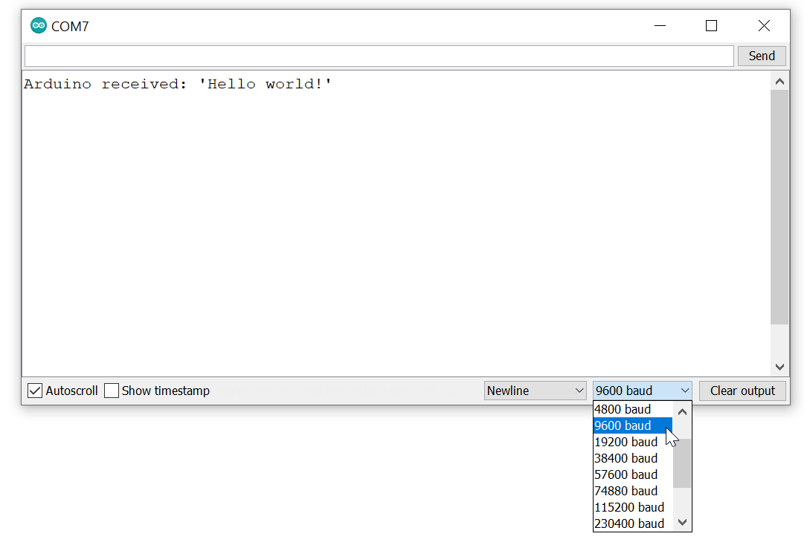
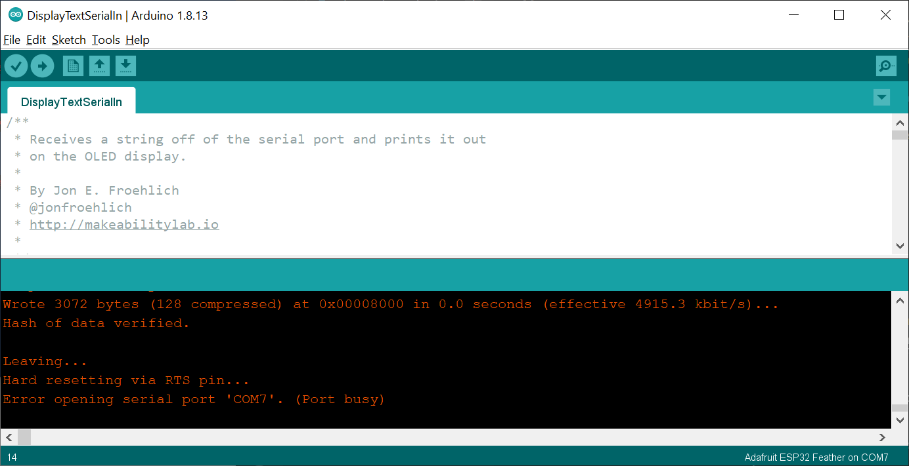
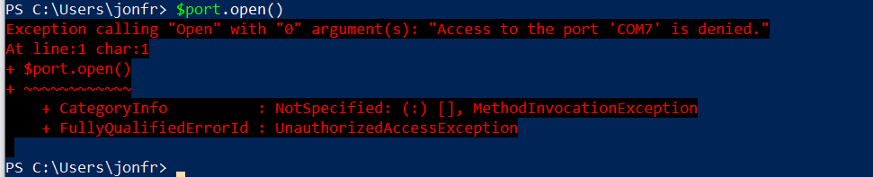
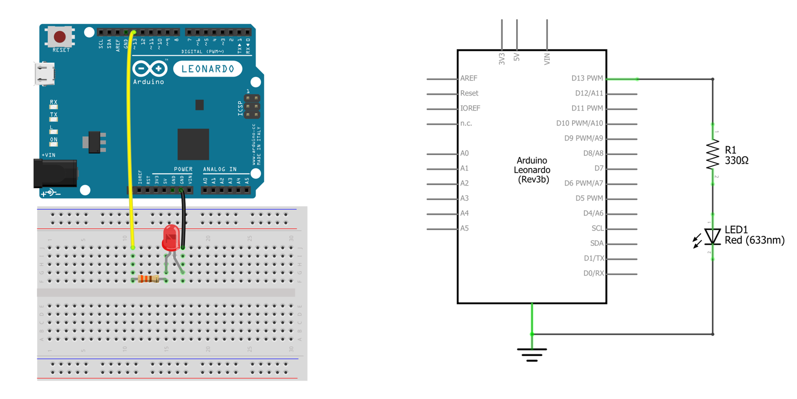
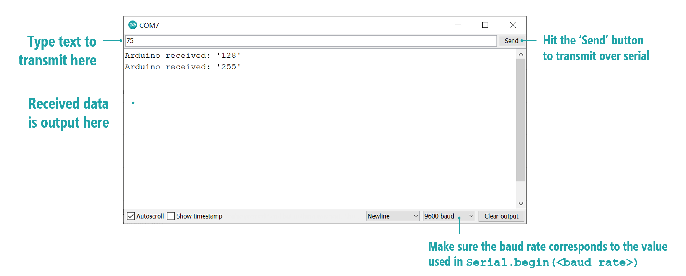

# {{ page.title | replace_first:'L','Lesson '}}
{: .no_toc }

## Table of Contents
{: .no_toc .text-delta }

1. TOC
{:toc}
---

<video autoplay loop muted playsinline aria-label="Video demonstrating the Arduino IDE Serial Monitor sending numeric text to the Arduino, which receives it, displays it on an OLED, and echoes it back.">
  <source src="assets/videos/SimpleSerialIn-NoTalking-TrimmedAndSpedUp720p.mp4" type="video/mp4" />
</video>
**Video.** Serial communication in action—the focus of this lesson: text typed into the Arduino IDE [Serial Monitor](../arduino/serial-print.md) is sent to an Arduino, shown on an [OLED](../advancedio/oled.md), and echoed back.
{: .fs-1 }

Devices need to communicate. Sensors talk to microcontrollers. Microcontrollers talk to computers. Computers talk to the Internet. And beyond! Many different protocols have been created to support device-to-device communication—from [Ethernet](https://en.wikipedia.org/wiki/Ethernet) and [Zigbee](https://en.wikipedia.org/wiki/Zigbee) to WiFi and Bluetooth. In this lesson, we will focus on **asynchronous serial communication**, specifically TTL serial (Transistor-Transistor Logic Serial)—an enduring standard that has prevailed since the beginning of personal computers and is what the [Arduino Serial library](https://www.arduino.cc/reference/en/language/functions/communication/serial/) uses.

Unlike other popular serial communication protocols like [I<sup>2</sup>C](https://learn.sparkfun.com/tutorials/i2c/all) and [SPI](https://learn.sparkfun.com/tutorials/serial-peripheral-interface-spi/all), TTL serial is *asynchronous*, which means it does not rely on a shared clock signal (precisely timed voltage pulses) paired with its data lines. This has the benefit of fewer wires but does result in a bit of communication overhead for each transmitted "packet" or data frame.

In this lesson, we'll dive into asynchronous serial communication and how we can use it for bidirectional `Computer ↔ Arduino` communication. By the end, you'll have sent data from a terminal, a Python script, and the Arduino Serial Monitor—and you'll understand the protocol well enough to design your own communication schemes! 🔌

{: .note }
> **In this lesson, you will learn:**
> - How asynchronous serial communication works (baud rate, data frames, start/stop bits)
> - The difference between binary and ASCII-encoded serial data—and when to use each
> - How to design simple serial message formats (CSV, delimiters, key-value pairs)
> - How to send data to Arduino from the Serial Monitor, command line (PowerShell/screen), and Python
> - How serial buffers, handshaking, and echo-based debugging work

## Serial communication with Arduino

<!-- Arduino uses a standard [asynchronous serial communication protocol](https://learn.sparkfun.com/tutorials/serial-communication/all) for serial communication.  -->

We've been using [Arduino's serial](https://www.arduino.cc/reference/en/language/functions/communication/serial/) functionality since our very first set of lessons (*e.g.,* [L3: Serial Debugging](../arduino/serial-print.md)). However, we've glossed over the details and used serial primarily for debugging rather than `Computer ↔ Arduino` communication.

On Arduino, we initialize the serial port using [`Serial.begin()`](https://docs.arduino.cc/language-reference/en/functions/communication/serial/begin/). The [`Serial.begin()`](https://github.com/arduino/ArduinoCore-avr/blob/master/cores/arduino/HardwareSerial.cpp) function has two overloaded options:


begin(unsigned long baud)
begin(unsigned long baud, byte config)


Thus far, in our lessons, we have been using the first function—`begin(unsigned long baud)`—which sets the data rate in bits per second (baud). But what about the second function with `byte config` and what does this parameter mean? We'll dig into both below.

{: .warning }
> On the **Arduino Uno**, once `Serial.begin()` is called, the board takes over **Pins 0 (RX) and 1 (TX)** for serial transmission and reception. The RX and TX LEDs light up on the board during communication. After `Serial.begin()` is called, **you should not use Pins 0 and 1** for other purposes.
>
> On the **Arduino Leonardo** and **ESP32-S3**, standard computer-to-board serial communication uses **native USB** and does not consume any GPIO pins. For the Leonardo, hardware pins 0 and 1 are reserved for `Serial1`, and for the ESP32, the hardware UART pins are only used if you explicitly initialize them. See our [ESP32 Blink lesson](../esp32/led-blink.md#picking-a-pin) for details.

### Baud rate

The baud rate specifies how fast data is sent over serial, expressed in bits per second (bps). For communicating with a computer, the [Arduino docs](https://docs.arduino.cc/language-reference/en/functions/communication/serial/begin/) recommend: 300, 600, 1200, 2400, 4800, 9600, 14400, 19200, 28800, 38400, 57600, or 115200 bps. Both devices—in this case, the Arduino and the computer—need to be set to the **same** baud rate to communicate.

{: .warning }
> If your Serial Monitor shows garbled text or garbage characters, the most common cause is a **baud rate mismatch**. Double-check that the baud rate in `Serial.begin(<baud>)` matches the setting in your Serial Monitor dropdown.

Thus far, speed hasn't been a major concern. We've typically used 9600 bps (9.6 kbps) for transmitting debugging info. At 9600 bps, the transmitter sends one new voltage pulse—HIGH corresponding to the logic-level voltage (+5V on Uno, +3.3V on ESP32) and LOW corresponding to 0V—every 1/9600th of a second, which is interpreted as a bit (a 1 or 0) by the receiver. The most common higher rate we use is 115200 bps (115.2 kbps), which is 12x faster than 9600—but still slow by today's networking standards.

{: .note }
> In our [ESP32 lessons](../esp32/index.md), we use **115200 baud** as the default because the ESP32 is much faster than the Uno and defaults to this rate. If you're using an ESP32, use `Serial.begin(115200)` and make sure your Serial Monitor matches!


{: .mx-auto .align-center }
**Figure.** The Arduino IDE's [Serial Monitor](../arduino/serial-print.md), which has a dropdown for baud rate. The baud rate used in `Serial.begin(<baud>)` must match this dropdown setting or Serial Monitor will not properly communicate with Arduino.
{: .fs-1 }

#### What's the fastest serial baud rate?

This is microcontroller dependent. The Arduino Uno uses an ATmega328P microcontroller, which supports a maximum baud rate of 2,000,000 baud (2 Mbps). On [Stack Overflow](https://arduino.stackexchange.com/a/299/63793), Connor Wolf found that though the Uno was capable of communicating at 2 Mbps, the Arduino serial library resulted in only an effective 500 kbps communication rate. The ESP32, by contrast, can handle baud rates well above 1 Mbps in practice.

### The asynchronous serial communication frame

The second function, `begin(unsigned long baud, byte config)`, allows for an optional argument that configures the serial transmission packet or frame. A serial transmission frame consists of three pieces: **data**, **parity**, and **synchronization bits** (start and stop).


**Figure.** An asynchronous serial communication frame showing the start bit, data bits, optional parity bit, and stop bit(s). Image from [Sparkfun](https://learn.sparkfun.com/tutorials/serial-communication/all).
{: .fs-1 }

The [data bits](https://en.wikipedia.org/wiki/Asynchronous_serial_communication) field specifies the length of the data portion of the frame (5–9 bits). The [parity bit](https://en.wikipedia.org/wiki/Parity_bit) is a simple form of error detection (and can be enabled or disabled). The synchronization bits help demarcate a frame: there is always *one* start bit at the beginning but there can be one or two stop bits at the end (one is most common). On Arduino, the default configuration is **8 data bits, no parity, one stop bit**—often abbreviated as **8N1**. This is the most common configuration you'll encounter.

{: .warning }
> If the baud rate *and* frame configuration do not match between the Arduino and the computer, communication will not work. If you're seeing garbled output, double-check both settings!

To help you visualize how a serial frame works at the bit level, try the interactive visualization below. Type any character and instantly see its complete 8N1 frame as a voltage waveform. Try changing the baud rate—notice how the frame stretches at 300 baud and compresses at 115200. Toggle between 5V (Uno) and 3.3V (ESP32) logic levels to reinforce that this is a real voltage signal on the wire. And pay attention to the bit order: data bits are transmitted **LSB (least significant bit) first**, not MSB first as you might expect!

<iframe src="https://editor.p5js.org/jonfroehlich/full/brClr0Jfc" width="100%" height="510" style="border: none;"></iframe>
**Interactive Figure.** A UART serial frame visualizer showing the voltage waveform for a single character. Type a character to see its 10-bit frame: 1 start bit (LOW), 8 data bits (LSB first), and 1 stop bit (HIGH). The line idles HIGH when no data is being sent. Change the baud rate to see how bit timing changes, and toggle between 5V and 3.3V logic levels. [Open in the p5.js editor](https://editor.p5js.org/jonfroehlich/sketches/brClr0Jfc).
{: .fs-1 }

### Only one program can open a serial port at a time

Importantly, **only one computer program** can open a serial port at a time. This is a common source of confusion! If the Arduino IDE's Serial Monitor is open, you can't connect a Python script or web app to the same port—and vice versa. You'll see an error like `Port busy` or `Access denied`.

For example, if you attempt to open Serial Monitor on the same COM port that has been opened by another program, you will receive an error like this: `Error opening serial port 'COM7'. (Port busy)`.


**Figure.** A demonstration of what happens if you try to open Serial Monitor on a COM port that is already opened by another program. The Arduino IDE shows an error stating `Error opening serial port 'COM7'. (Port busy)`.
{: .fs-1 }

Similarly, if we attempt to access a currently opened serial port with [PowerShell](https://docs.microsoft.com/en-us/powershell/scripting/overview), we receive `Access to the port 'COM7' is denied.`


**Figure.** Only one software program can access a serial port at a time.
{: .fs-1 }

### Serial buffers

Incoming serial data is stored in a **serial buffer**, which is read as a first-in, first-out queue (FIFO). On the Arduino Uno and Leonardo, this buffer is 64 bytes (defined in [USBAPI.h](https://github.com/arduino/ArduinoCore-avr/blob/master/cores/arduino/USBAPI.h)) and is implemented as a circular or ring buffer. At 9600 baud with 8N1 framing, each byte requires 10 bits on the wire, so the effective data rate is 960 bytes/second (~1.04 ms per byte). This 64-byte buffer will fill in about 67 milliseconds.

{: .note }
> The **ESP32** has a much larger default serial buffer of **256 bytes** (configurable up to 2KB+). Combined with the ESP32's faster processor, buffer overflows are far less likely—but you should still read serial data promptly in your `loop()` to avoid losing data.

### Serial to USB? USB to serial?

In the 1980s and 1990s, computers had serial ports like [RS-232 connections](https://en.wikipedia.org/wiki/RS-232) to support asynchronous serial communication. Today, we use USB (Universal Serial Bus)—a far more sophisticated serial communication standard that allows multiple devices to communicate over the same wires. However, because asynchronous serial communication persists, USB drivers and our operating systems support it over USB. Devices like the Arduino include a USB-to-serial converter that shows up as a serial port when you plug them in (just as if you were using an old serial connection). You might see the Arduino device listed as a "USBtoUART" device—UART stands for Universal Asynchronous Receiver-Transmitter.

{: .note }
> The **ESP32-S3** uses **native USB**, meaning the USB connection goes directly to the chip without a separate USB-to-serial converter. This is similar to the Arduino Leonardo's ATmega32u4. In practice, this means the serial port may briefly disappear during resets. See our [ESP32 Blink lesson](../esp32/led-blink.md) for more details.

## Developing serial communication software applications

So, how can we design and implement a computer program to communicate with Arduino via serial? To answer this, let's decompose serial communication into three high-level layers:

- **Hardware layer:** How is data physically communicated? How many wires are used? What does the voltage signal look like? Thankfully, Arduino handles this for us. For `Computer ↔ Arduino` serial communication, data is transmitted via the USB cable.
- **Serial protocol layer:** What is the format of a serial transmission packet (*e.g.,* the data and parity bits)? How do we compose this packet? Again, we don't need to worry much about this—Arduino uses the standard [asynchronous serial protocol](https://learn.sparkfun.com/tutorials/serial-communication/all) and includes the [`Serial`](https://www.arduino.cc/reference/en/language/functions/communication/serial/) library. We just need to make sure both devices are using the same baud rate and frame configuration.
- **Application layer:** How do applications communicate *with each other* using serial? This is the key question—and the answer is completely up to you!

If you're writing serial communication code for both devices (the application on Arduino and the application on your computer), you get to decide how these applications communicate—you're in complete control. There are, however, some important considerations: binary vs. ASCII-encoded data, message formatting, handshaking, and message acknowledgments (call-and-response).

### Binary vs. ASCII-encoded data

With serial communication, we can either transmit/receive data as a series of bits (raw binary data) or as alphanumeric characters (ASCII-encoded data).

#### Reading and writing binary data

To read binary data with Arduino, use [`readBytes()`](https://www.arduino.cc/reference/en/language/functions/communication/serial/readBytes/) or [`readBytesUntil()`](https://www.arduino.cc/reference/en/language/functions/communication/serial/readBytesUntil/):


size_t readBytes(byte *buffer, size_t length)
size_t readBytesUntil(byte terminator, byte *buffer, size_t length)


[`Serial.readBytes()`](https://www.arduino.cc/reference/en/language/functions/communication/serial/readBytes/) reads bytes from the serial port into a buffer and terminates if the determined length has been read or it times out (see [`Serial.setTimeout()`](https://www.arduino.cc/reference/en/language/functions/communication/serial/setTimeout/)). [`Serial.readBytesUntil()`](https://www.arduino.cc/reference/en/language/functions/communication/serial/readBytesUntil/) is similar but also accepts a terminator parameter—if the terminator byte is detected, the function returns all bytes up to (but not including) the terminator. Both functions return the number of bytes read.

To write binary data, use [`Serial.write()`](https://www.arduino.cc/reference/en/language/functions/communication/serial/write/), which is an overloaded function:


size_t write(byte val);                  // value to send as a single byte
size_t write(String str);                // string to send as a series of bytes
size_t write(byte *buffer, size_t length); // an array and number of bytes in buffer


All three [`Serial.write()`](https://www.arduino.cc/reference/en/language/functions/communication/serial/write/) functions return the number of bytes written.

#### Reading and writing ASCII-encoded data

Reading and writing ASCII-encoded data should feel more familiar. For [serial-based debugging](../arduino/serial-print.md), we've been using [`Serial.print()`](https://www.arduino.cc/reference/en/language/functions/communication/serial/print/) and [`Serial.println()`](https://www.arduino.cc/reference/en/language/functions/communication/serial/println/), which transmit data as human-readable ASCII text.

To read ASCII data, use [`Serial.readString()`](https://www.arduino.cc/reference/en/language/functions/communication/serial/readString/) and [`Serial.readStringUntil()`](https://www.arduino.cc/reference/en/language/functions/communication/serial/readStringUntil/):


String readString();
String readStringUntil(char terminator)


Both functions read characters from the serial buffer and store them in a String. [`Serial.readString()`](https://www.arduino.cc/reference/en/language/functions/communication/serial/readString/) terminates when it times out (see [`Serial.setTimeout()`](https://www.arduino.cc/reference/en/language/functions/communication/serial/setTimeout/)). [`Serial.readStringUntil()`](https://www.arduino.cc/reference/en/language/functions/communication/serial/readStringUntil/) terminates either on timeout or when a terminator character is found.

To write ASCII data, use [`Serial.print()`](https://www.arduino.cc/reference/en/language/functions/communication/serial/print/) and [`Serial.println()`](https://www.arduino.cc/reference/en/language/functions/communication/serial/println/). Both have many overloaded versions for different data types (int, float, String, *etc.*) and return the number of bytes written. See the Arduino docs for [Serial.print()](https://www.arduino.cc/reference/en/language/functions/communication/serial/print/) and [Serial.println()](https://www.arduino.cc/reference/en/language/functions/communication/serial/println/) for the full API.

<!-- See: https://github.com/arduino/ArduinoCore-avr/blob/master/cores/arduino/Stream.cpp -->

#### Why use binary vs. ASCII?

Why might we want to use **binary** vs. **text** encodings? If we are transmitting binary data—like an image, video, or song—then binary encoding is preferred. It's also more bandwidth efficient (uses fewer bits per value). However, in our courses, we're typically transmitting small amounts of data and it's beneficial for debugging and human readability to use ASCII-encoded text.

#### Binary vs. ASCII example

Let's look at a concrete example. Say we want to transmit a value that ranges between 0 and 255 from our Arduino to our computer. Because the value only ranges from 0 to 255, we can encode this in 8 bits—a single byte (`0000 0000` to `1111 1111`, or `0x00` to `0xFF` in hexadecimal). Sending via binary:


byte signalVal = getSignal();
Serial.write(signalVal);


So, if `getSignal()` returns 15, we transmit `0000 1111` (`0x0F`)—just one byte. If it returns 127, we transmit `0111 1111` (`0x7F`). If 255, then `1111 1111` (`0xFF`).

However, we could also transmit this using ASCII-encoded data with [`Serial.println()`](https://www.arduino.cc/reference/en/language/functions/communication/serial/println/):


byte signalVal = getSignal();
Serial.println(signalVal);


Now if `getSignal()` returns 15, we need to transmit **four bytes** rather than just one. Using the [ASCII chart](https://www.asciichart.com/), the ASCII encoding for '1' is 49 (`0x31`) and '5' is 53 (`0x35`). Then, `Serial.println()` adds a carriage return '\r' (ASCII 13, `0x0D`) and a newline '\n' (ASCII 10, `0x0A`).

Similarly, if we wanted to transmit 127 or 255 using `Serial.println()`, we would need **five bytes** each. For example, with 127, we would transmit: '1' (0x31), '2' (0x32), '7' (0x37), '\r' (0x0D), '\n' (0x0A).

#### Comparing binary vs. ASCII on the wire

That byte-counting arithmetic gets tedious fast—so let's *see* it instead. The visualization below expands our example to values from 0 to 1023 (the full range of Arduino Uno's and Leonardo's 10-bit `analogRead()`). Because 1023 doesn't fit in a single byte, the binary encoding now uses a **fixed 2-byte** representation—making the efficiency gap even more dramatic. The visualization shows the same integer value transmitted two ways simultaneously: binary encoding on top (`Serial.write()`) and ASCII encoding on the bottom (`Serial.println()`). Drag the slider and watch the gap between them grow:

- At value **7**, binary uses 2 bytes and ASCII uses 4 bytes (the digit `'7'` plus `'\r'` and `'\n'`). Not a huge difference.
- At value **127**, binary still uses 2 bytes, but ASCII jumps to 5 bytes—each *digit* becomes its own frame.
- At value **1023**, binary is still just 2 bytes. ASCII? **6 bytes.** Three times more data on the wire.

Notice the key tradeoff shown in the comparison table: binary encoding uses a **fixed-length** protocol (the receiver must know to read exactly 2 bytes), while ASCII encoding is **self-delimiting** (the `'\n'` tells the receiver "this message is done"). This is why we use ASCII for most of our projects—the human readability and self-delimiting properties make debugging much easier, and the bandwidth cost is negligible for the small amounts of data we typically send.

<iframe src="https://editor.p5js.org/jonfroehlich/full/fqey-ErqK" width="100%" height="650" style="border: none;"></iframe>
**Interactive Figure.** A side-by-side comparison of binary vs. ASCII serial encoding. The top waveform shows `Serial.write()` (fixed 2-byte binary, big-endian) and the bottom shows `Serial.println()` (variable-length ASCII text with `\r\n` delimiter). Drag the value slider to see how the byte cost of ASCII grows with the number of digits, while binary stays constant. [Open in the p5.js editor](https://editor.p5js.org/jonfroehlich/sketches/fqey-ErqK).
{: .fs-1 }

{: .warning }
> When using binary encoding, the receiver **must know the exact protocol**: how many bytes to expect, what byte order (big-endian vs. little-endian), and how to interpret the raw bits. If the sender transmits 2 bytes but the receiver reads 3, the data will be corrupted—and there's no `'\n'` delimiter to recover from. This is why binary encoding requires more careful coordination between your Arduino code and your computer code.

#### Visualizing a serial stream

The single-frame visualizer above shows what happens for *one* character. But what does it look like when you send an entire string? The visualization below shows how multiple frames chain together on the wire. Try typing `"Hi"` and toggling the `println()` checkbox—you'll see two extra frames appear for `\r` and `\n`, the invisible characters that `Serial.println()` appends. This is why `println()` is so convenient for parsing on the receiving end: that `\n` acts as a delimiter that tells the receiver "this message is complete."

Try experimenting:
- Type a longer string and watch the total transmission time grow
- Compare the time at 9600 baud vs. 115200—the difference is dramatic for longer strings
- Hover over any frame to see its bit-level breakdown
- Uncheck `println()` to see what `Serial.print()` sends (no `\r\n`!)

<iframe src="https://editor.p5js.org/jonfroehlich/full/oCTWfLgQN" width="100%" height="480" style="border: none;"></iframe>
**Interactive Figure.** A UART serial stream visualizer showing how multiple characters are transmitted as a sequence of 8N1 frames. Each character becomes a separate frame on the wire, with short idle gaps in between. Toggle `println()` to see the `\r\n` overhead. Hover over any frame for bit-level detail. [Open in the p5.js editor](https://editor.p5js.org/jonfroehlich/sketches/oCTWfLgQN).
{: .fs-1 }

#### Both applications need to use the same encoding

The receiver needs to know whether data has been transmitted using binary or ASCII encoding. For ASCII, the receiver can use a method like [`Serial.readStringUntil('\n')`](https://www.arduino.cc/reference/en/language/functions/communication/serial/readStringUntil/) and the data will be automatically read as a text String. For binary, a method like [`Serial.readBytes()`](https://www.arduino.cc/reference/en/language/functions/communication/serial/readBytes/) is necessary and the receiver must know how many bytes are being sent and how to decode them.

For our purposes, we almost always use ASCII encoding because the benefit of human readability (*e.g.,* sending and receiving text) outweighs the efficiency cost. However, you should consider this on a case-by-case basis depending on your application context, communication medium (wireless vs. wired), and power requirements (*e.g.,* low-power applications should minimize the amount of data transmitted).

### Formatting messages

The above example simply sent one value per transmission. For binary, we sent one byte per new signal read; for ASCII, we sent one line per new signal read. However, you'll likely want to transmit and receive *multiple* values. How do we do this?

Again, it's completely up to you! If you're using ASCII-encoded data, you could use a [comma-separated value (CSV) format](https://en.wikipedia.org/wiki/Comma-separated_values), [JSON](https://en.wikipedia.org/wiki/JSON), or some other messaging format of your own design.

As you'll commonly see in our demo code, we use a simple CSV format like this:


int sensorVal1 = analogRead(SENSOR1_INPUT_PIN);
int sensorVal2 = analogRead(SENSOR2_INPUT_PIN);
int sensorVal3 = analogRead(SENSOR3_INPUT_PIN);
Serial.print(sensorVal1);
Serial.print(",");
Serial.print(sensorVal2);
Serial.print(",");
Serial.println(sensorVal3);


For example, if `sensorVal1` is 896, `sensorVal2` is 943, and `sensorVal3` is 349, then the above code would send a text string that looks like `896,943,349\r\n`.

On the receiving end, we can write our own parsing code like this:


if(Serial.available() > 0){
    // If we're here, then serial data has been received
    // Read data off the serial port until we get to the endline delimiter ('\n')
    String rcvdSerialData = Serial.readStringUntil('\n');

    // Parse the comma-separated string
    int startIndex = 0;
    int endIndex = rcvdSerialData.indexOf(',');
    if(endIndex != -1){

        // Parse out first sensor value
        String strSensorVal1 = rcvdSerialData.substring(startIndex, endIndex);
        int sensorVal1 = strSensorVal1.toInt();

        // Parse out the second sensor value
        startIndex = endIndex + 1;
        endIndex = rcvdSerialData.indexOf(',', startIndex);
        String strSensorVal2 = rcvdSerialData.substring(startIndex, endIndex);
        int sensorVal2 = strSensorVal2.toInt();

        // Parse out the third sensor value
        startIndex = endIndex + 1;
        endIndex = rcvdSerialData.length();
        String strSensorVal3 = rcvdSerialData.substring(startIndex, endIndex);
        int sensorVal3 = strSensorVal3.toInt();

        // Do stuff with sensor values
    } 
}


This example assumes that data arrives in the order `sensorVal1, sensorVal2, sensorVal3` and that each received line follows the same format. To make this communication scheme more flexible, you could transmit key-value pairs like `sensorVal1=896,sensorVal2=943,sensorVal3=349`. The receiver would then parse both the variable names and their values. You could even use JSON for more complex data structures.

In all of our examples, we use simple CSV formatting with ASCII-encoded data. But feel free to do things differently!

### Handshaking

When two devices begin communicating—whether via serial or some other protocol—it's common to [handshake](https://en.wikipedia.org/wiki/Handshaking). That is, the devices transmit and receive a small set of initial messages to establish communication parameters and to synchronize state. For example, upon connection, you might have your two devices exchange their current settings or confirm that they're ready to begin.

### Acknowledging data

If you want to ensure that data has arrived and been parsed correctly, you might implement an acknowledgment scheme. After each received message, the receiver could send back an 'OK' along with a hash or checksum that the original sender can use to verify successful delivery. We'll use a simpler version of this—**echo debugging**—in our examples below, where the Arduino echoes received data back to the computer for visual confirmation.

## Example serial programs

Below, we'll show a few different examples using the Serial Monitor, command line tools, and Python. To keep things simple, in this lesson, we focus on **unidirectional communication** from the computer to the Arduino (`Computer → Arduino`). That is, the computer will send data and the Arduino will receive it. In later lessons, we'll cover `Arduino → Computer` and bidirectional (duplex) communication `Computer ↔ Arduino`.

In all of our serial lessons—including this one—we'll have the Arduino transmit something back to the computer to aid with debugging. We call this an **echo message**: the Arduino simply echoes what it received. You'll see how helpful this is!

### Simple Arduino serial receiver program

For our examples below, we will run a simple program on the Arduino that reads ASCII-encoded data off of the serial port, parses it into an integer, and uses `analogWrite` to output that integer to an output pin. We have an LED with a current-limiting resistor connected to `OUTPUT_PIN`, which is set to `LED_BUILTIN` (Pin 13 on the Arduino Uno and Leonardo). The entire program:


const int DELAY_MS = 5;
const int OUTPUT_PIN = LED_BUILTIN;

void setup() {
  Serial.begin(9600);
  pinMode(OUTPUT_PIN, OUTPUT);
}

void loop() {
  // Check to see if there is any incoming serial data
  if(Serial.available() > 0){
    // If we're here, then serial data has been received
    // Read data off the serial port until we get to the endline delimiter ('\n')
    // Store all of this data into a string
    // Note: readStringUntil() blocks until it finds '\n' or times out (default: 1s).
    // This is fine here since we check Serial.available() first, but be aware of the
    // timeout if data arrives without a newline. We'll revisit this in later lessons.
    String rcvdSerialData = Serial.readStringUntil('\n'); 

    // Convert string data into an integer
    int ledValue = rcvdSerialData.toInt();

    // Ensure value is between 0 and 255 (our maximum output values)
    ledValue = constrain(ledValue, 0, 255);
    analogWrite(OUTPUT_PIN, ledValue);
    
    // Just for debugging, echo the data back on serial
    Serial.print("Arduino received: '");
    Serial.print(rcvdSerialData);
    Serial.println("'");
  }

  delay(DELAY_MS);
}


**Code.** This code is available as [SimpleSerialIn.ino](https://github.com/makeabilitylab/arduino/blob/master/Serial/SimpleSerialIn/SimpleSerialIn.ino) on GitHub. We will actually be using [SimpleSerialInOLED.ino](https://github.com/makeabilitylab/arduino/blob/master/Serial/SimpleSerialInOLED/SimpleSerialInOLED.ino) in our videos.
{: .fs-1}

{: .warning }
> **Uno users:** Pin 13 supports PWM on the **Leonardo** (via Timer 4) but **not** on the **Uno**. If you're using an Uno, `analogWrite` on Pin 13 will behave as a simple on/off (`HIGH` if the value is ≥ 128, `LOW` otherwise)—you won't see smooth brightness changes. To get true PWM dimming on the Uno, change `OUTPUT_PIN` to a PWM-capable pin like 9 or 11 and rewire your LED accordingly.

{: .note }
> Notice the **echo debugging** pattern at the bottom of `loop()`: the Arduino prints `"Arduino received: '<data>'"` back to the computer. This lets us verify that the data arrived correctly. You'll see this pattern throughout our serial lessons.

#### Demo circuit

And here's the corresponding circuit for the program above, which consists of a current-limiting resistor and LED attached to Pin 13. Of course, you could build almost any circuit to respond to serial input—but let's keep things simple!


**Figure.** The corresponding Arduino Leonardo circuit for [SimpleSerialIn.ino](https://github.com/makeabilitylab/arduino/blob/master/Serial/SimpleSerialIn/SimpleSerialIn.ino). Made in Fritzing and PowerPoint.
{: .fs-1}

### Using Serial Monitor

Let's begin by using the Arduino IDE's [Serial Monitor](../arduino/serial-print.md). With [SimpleSerialIn.ino](https://github.com/makeabilitylab/arduino/blob/master/Serial/SimpleSerialIn/SimpleSerialIn.ino) loaded on your Arduino and your Arduino connected to your computer, open the Serial Monitor and send data. Make sure you've selected the same baud rate used in `Serial.begin(<baud rate>)`.


**Figure.** An annotated screenshot of the Arduino IDE's [Serial Monitor](../arduino/serial-print.md) tool for sending and receiving serial data. The data "echoed" back from the Arduino is shown in the autoscrolling text field.
{: .fs-1}

#### Video demo using Serial Monitor

Here's a video demonstration of sending ASCII-encoded text via [Serial Monitor](../arduino/serial-print.md) to the Arduino running [SimpleSerialInOLED.ino](https://github.com/makeabilitylab/arduino/blob/master/Serial/SimpleSerialInOLED/SimpleSerialInOLED.ino).

<video autoplay loop muted playsinline aria-label="Video demonstrating the Arduino IDE Serial Monitor sending numeric text to the Arduino, which receives it, displays it on an OLED, and echoes it back.">
  <source src="assets/videos/SimpleSerialIn-NoTalking-TrimmedAndSpedUp720p.mp4" type="video/mp4" />
</video>
**Video.** A video demonstrating the Arduino IDE [Serial Monitor](../arduino/serial-print.md) communicating with the Arduino running [SimpleSerialInOLED.ino](https://github.com/makeabilitylab/arduino/blob/master/Serial/SimpleSerialInOLED/SimpleSerialInOLED.ino) with an [OLED display](../advancedio/oled.md) to show received values.
{: .fs-1 }

Notice how we are able to see what the Arduino receives because the Arduino code echoes the received data back over serial using `Serial.print`. This is optional but helpful!


// Just for debugging, echo the data back on serial
Serial.print("Arduino received: '");
Serial.print(rcvdSerialData);
Serial.println("'");


### Command line tools

While we've thus far emphasized the Arduino IDE's [Serial Monitor](../arduino/serial-print.md), there is nothing special or unique about that tool. We can use any application or programming language with serial support. Below, we'll show how to use command line tools for both Windows and Mac/Linux before showing an example with Python (but C#, Objective C, Java, *etc.* would work too!).

<!-- https://itp.nyu.edu/physcomp/lab-intro-to-serial-communications/#Connecting_via_the_Command_Line
https://learn.sparkfun.com/tutorials/terminal-basics/command-line-windows-mac-linux -->

#### Windows

On Windows, we can use the [PowerShell](https://docs.microsoft.com/en-us/powershell/scripting/overview?view=powershell-7.1) terminal, which is built into Windows 10+, to read and write data from the serial port. For this, we'll follow the official [PowerShell blog](https://devblogs.microsoft.com/powershell/writing-and-reading-info-from-serial-ports/).

First, to find the available serial ports, we can use `getportnames()`:

```
PS> [System.IO.Ports.SerialPort]::getportnames()
COM7
```

Then, create a `SerialPort` object, which takes the COM port, the baud rate, and serial configuration parameters (parity, data bit length, and stop bit):

```
PS> $port= new-Object System.IO.Ports.SerialPort COM7,9600,None,8,one
```

Now open this port:

```
PS> $port.open()
```

Write to the port using ASCII-encoded text with `WriteLine(<str>)`:

```
PS> $port.WriteLine("Hello!")
```

Similarly, to read from the port, use `ReadLine()`:

```
PS> $port.ReadLine()
Arduino received: 'Hello!'
```
Finally, to close the port, use `Close()`:

```
PS> $port.Close()
```

Thus, the full program is simply:

```
$port= new-Object System.IO.Ports.SerialPort COM7,9600,None,8,one
$port.open()
$port.WriteLine("Hello!")
$port.ReadLine()
$port.Close()
```

##### Video demo using Windows PowerShell

<video autoplay loop muted playsinline aria-label="Video demonstrating using Windows PowerShell to send serial data to the Arduino and read back the echoed response.">
  <source src="assets/videos/SimpleSerialIn-NoTalking-WindowsPowerShell-TrimmedAndSpedUp720p.mp4" type="video/mp4" />
</video>
**Video.** A video demonstrating using [Windows PowerShell](https://docs.microsoft.com/en-us/powershell/scripting/overview) to communicate with the Arduino running [SimpleSerialInOLED.ino](https://github.com/makeabilitylab/arduino/blob/master/Serial/SimpleSerialInOLED/SimpleSerialInOLED.ino) with an [OLED display](../advancedio/oled.md) to show received values.
{: .fs-1 }

#### Mac and Linux

On Mac and Linux, we can use the `screen` command as described by this [Sparkfun tutorial](https://learn.sparkfun.com/tutorials/terminal-basics/command-line-windows-mac-linux). Screen should be installed by default on Mac. If it's not installed on Linux, install it with `sudo apt-get install screen`.

First, we need to enumerate the available ports. Type:

```
> ls /dev/tty.*

/dev/tty.Bluetooth-Incoming-Port /dev/tty.SLAB_USBtoUART
/dev/tty.MALS                    /dev/tty.SOC
```

In this case, the Arduino is listed as `/dev/tty.SLAB_USBtoUART`. We can connect to it via screen by typing `screen <port_name> <baud_rate>`:

```
> screen /dev/tty.SLAB_USBtoUART 9600
```

Your terminal should go blank with a flashing cursor. You are now connected to that port. Anything you type will be instantly sent to Arduino as ASCII-encoded text.

To disconnect, type `control-a` followed by `control-\`. The screen program will then ask if you want to exit. Type `y`.

### Python

Finally, let's write a simple program in [Python](https://www.python.org/) to communicate with the Arduino over serial. This demonstrates the overall programming concepts before we dive into JavaScript solutions in the following lessons. Again, you can use any programming language you like!

For serial communication with Python, we'll use the [pySerial](https://pyserial.readthedocs.io/en/latest/) library. With Python 3 installed, open your terminal and type:

```
> pip3 install pyserial
```

This will install the [pySerial](https://pyserial.readthedocs.io/en/latest/) library. pySerial is quite straightforward—their ["short introduction" docs](https://pyserial.readthedocs.io/en/latest/shortintro.html) provide a number of examples.

Let's write a quick Python program to communicate with [SimpleSerialIn.ino](https://github.com/makeabilitylab/arduino/blob/master/Serial/SimpleSerialIn/SimpleSerialIn.ino).

First, import the required libraries and create a pySerial `Serial` object:


import serial # from https://pyserial.readthedocs.io
import time

# Create serial object on COM13 with 9600 baud and a read timeout
# of one second (can be a float value, so 1.5 would be 1.5s)
ser = serial.Serial(port='COM13', baudrate=9600, timeout=1)


Now, ask the user to input a number between 0 and 255:


# Ask user for number between 0 and 255 and store in num
num = input("Enter a number (0 - 255): ")


Encode this data as a string. You can force ASCII encoding via `num.encode("ascii", "ignore")`:


# Encode numeric value as a string
strNum = str.encode(num)


Now send the data using pySerial's [`write(<data>)`](https://pyserial.readthedocs.io/en/latest/pyserial_api.html#serial.Serial.write) function. We append a newline (`\n`) so the Arduino's `Serial.readStringUntil('\n')` returns immediately rather than waiting for its 1-second timeout:


# Send the data using pyserial write method
# We append '\n' so the Arduino's readStringUntil('\n') returns immediately
print("Sending...", strNum)
ser.write(strNum + b'\n')
time.sleep(0.05) # sleep for 0.05s


Finally, read the response from the Arduino and print it out:


# Read data back from Arduino
echoLine = ser.readline()

# readline() returns raw bytes; decode to a UTF-8 string and strip whitespace
print(echoLine.decode('utf-8').strip())
print() # empty line


And that's it! This code is available as [serial_demo.py](https://github.com/makeabilitylab/arduino/blob/master/Python/Serial/serial_demo.py) in our GitHub. Note that after creating the `Serial` object, we wrap everything in a `while True:` loop to continuously ask for new user data.

One important detail: if you exit the script with `Ctrl+C` without closing the serial port, the OS may keep the port locked—which means you won't be able to upload new Arduino code or open Serial Monitor until you kill the Python process. To handle this gracefully, wrap your loop in a `try`/`except`/`finally` block:


import serial
import time

ser = serial.Serial(port='COM13', baudrate=9600, timeout=1)

try:
    while True:
        num = input("Enter a number (0 - 255): ")
        strNum = str.encode(num)

        print("Sending...", strNum)
        ser.write(strNum + b'\n')
        time.sleep(0.05)

        echoLine = ser.readline()
        print(echoLine.decode('utf-8').strip(), "\n")
except KeyboardInterrupt:
    print("\nExiting...")
finally:
    ser.close()
    print("Serial port closed.")


The `finally` block ensures `ser.close()` is called whether the loop ends normally or via `Ctrl+C`. This is a good habit for any program that opens hardware resources.

See the video below.

#### Video demo using Python

<video autoplay loop muted playsinline aria-label="Video demonstrating a Python script using pySerial to send numeric values to the Arduino and receive echoed responses, with values displayed on an OLED.">
  <source src="assets/videos/SimpleSerialIn-Python-NoTalking2-TrimmedAndSpedUp720p.mp4" type="video/mp4" />
</video>
**Video.** A video demonstrating [Python 3](https://www.python.org/downloads/) with [pySerial](https://pypi.org/project/pyserial/) communicating with the Arduino running [SimpleSerialInOLED.ino](https://github.com/makeabilitylab/arduino/blob/master/Serial/SimpleSerialInOLED/SimpleSerialInOLED.ino) with an [OLED display](../advancedio/oled.md) to show received values.
{: .fs-1 }

#### Using Python for real-time gesture recognition

Of course, we can do significantly more interesting things using serial communication. In the video below, we demonstrate a Python program that reads in real-time accelerometer data sent from the Arduino over serial and classifies gestures using template matching. This is a taste of the kinds of interactive systems you can build once your computer and Arduino are talking to each other!

<div class="iframe-container">
  <iframe src="https://www.youtube.com/embed/nnTyqCwYVbA" title="YouTube video player" frameborder="0" allow="accelerometer; autoplay; clipboard-write; encrypted-media; gyroscope; picture-in-picture" allowfullscreen></iframe>
</div>

**Video.** A demonstration of real-time gesture recognition using 3-axis accelerometer data sent via the Arduino over serial. The gesture recognizer is written in Python. You can learn more in our [Signal Classification](../signals/classification.md) lesson series.
{: .fs-1 }

There is a world of possibilities here—and we'll begin to explore them in this lesson series!

## Lesson Summary

In this lesson, you learned the fundamentals of asynchronous serial communication and how to send data from a computer to an Arduino. Here are the key takeaways:

- **Serial communication** sends data one bit at a time over a wire. Asynchronous serial (TTL/UART) does not require a shared clock signal—instead, both devices agree on a **baud rate** and **frame format** (typically 8N1).
- The **baud rate** must match on both sides (Arduino and computer). We use 9600 bps for Arduino Uno and 115200 bps for ESP32.
- Data can be sent as **binary** (`Serial.write()`) or **ASCII text** (`Serial.print()`/`Serial.println()`). We primarily use ASCII for human readability and debugging convenience, even though binary is more bandwidth-efficient.
- For multi-value messages, a simple **CSV format** (*e.g.,* `"896,943,349\n"`) works well. Both the sender and receiver must agree on the format.
- **Only one program** can open a serial port at a time—close Serial Monitor before connecting a Python script or web app.
- The **echo debugging** pattern—where the Arduino sends back what it received—is a simple but powerful technique for verifying communication.
- The ESP32-S3 differs from the Arduino Uno in several serial-relevant ways: native USB (no GPIO pins consumed), larger serial buffers (256 bytes), and a default baud rate of 115200.

## Exercises

**Exercise 1:** Modify [SimpleSerialIn.ino](https://github.com/makeabilitylab/arduino/blob/master/Serial/SimpleSerialIn/SimpleSerialIn.ino) to accept **two** comma-separated values: the first controls the LED brightness (0–255), and the second controls the blink delay in milliseconds. For example, sending `"128,500"` should set the LED to half brightness and blink it every 500ms. Use the CSV parsing approach shown in this lesson.

**Exercise 2:** Write a Python script that continuously reads a potentiometer value from the Arduino (`Arduino → Computer`). The Arduino should send the analog reading as ASCII text with `Serial.println()`, and your Python script should receive and print each value. This is the reverse direction from our lesson demo!

**Exercise 3:** Modify the Python example to send a **sequence** of values from 0 to 255 automatically (no user input), with a small delay between each. Observe the LED fading up on the Arduino. What happens if you decrease the delay? At what point do you start losing data?

**Exercise 4:** Using the binary vs. ASCII analysis from this lesson, calculate how many bytes are needed to transmit the value `1023` using `Serial.write()` (hint: you'll need two bytes) versus `Serial.println()`. Then calculate the time each approach takes at 9600 baud, including the frame overhead (start bit + stop bit per byte).

## Resources

- [Intro to Asynchronous Serial Communications](https://itp.nyu.edu/physcomp/lab-intro-to-serial-communications/), NYU ITP Physical Computing course

- [Serial Communication](https://learn.sparkfun.com/tutorials/serial-communication/all), Sparkfun

- [Asynchronous Serial Communication: The Basics](https://itp.nyu.edu/physcomp/lessons/serial-communication-the-basics/), NYU ITP Physical Computing course

- [UART: A Hardware Communication Protocol](https://www.analog.com/en/analog-dialogue/articles/uart-a-hardware-communication-protocol.html), Analog Devices

### Videos

- [Serial 1: Introduction](https://vimeo.com/380355568), NYU ITP Physical Computing course video

- [Serial 2: Logic Analyzer and ASCII](https://vimeo.com/380355716), NYU ITP Physical Computing course video

## Next Lesson

In the [next lesson](web-serial.md), we'll apply our newfound serial knowledge to communicating with our Arduino via web browsers using the [Web Serial API](https://developer.mozilla.org/en-US/docs/Web/API/Web_Serial_API). It's gonna be great fun! 🌐

<nav class="lesson-nav" aria-label="Lesson navigation">
  <a href="web-serial.html" class="nav-next">
    <div class="nav-label">Next Lesson &rarr;</div>
    <div class="nav-title">Web Serial</div>
  </a>
</nav>

<!-- #### DisplayTextSerialIn

For each, we will be running [DisplayTextSerialIn.ino](https://github.com/makeabilitylab/arduino/blob/master/Serial/DisplayTextSerialIn/DisplayTextSerialIn.ino) on the Arduino, which reads text data off the Serial port, displays it on a connected [OLED](../advancedio/oled.md), and echos the data back on the Serial port.

Essentially, [DisplayTextSerialIn.ino](https://github.com/makeabilitylab/arduino/blob/master/Serial/DisplayTextSerialIn/DisplayTextSerialIn.ino) does this:


// Declaration for an SSD1306 display connected to I2C (SDA, SCL pins)
#define OLED_RESET     4 // Reset pin # (or -1 if sharing Arduino reset pin)
Adafruit_SSD1306 _display(SCREEN_WIDTH, SCREEN_HEIGHT, &Wire, OLED_RESET);

void setup() {
  Serial.begin(9600);

  initializeOledScreen();
}

void loop(){
  // Check to see if there is any incoming serial data
  if(Serial.available() > 0){
    // If we're here, then serial data has been received
    // Read data off the serial port until we get to the endline delimiter ('\n')
    // Store all of this data into a string
    String rcvdSerialData = Serial.readStringUntil('\n'); 

    // Display the received data on the OLED
    _display.clearDisplay();
    _display.print(rcvdSerialData);
    _display.display();

    // Echo the data back on serial (for debugging purposes)
    Serial.print("Arduino received: '");
    Serial.print(rcvdSerialData);
    Serial.println("'");
}
 -->