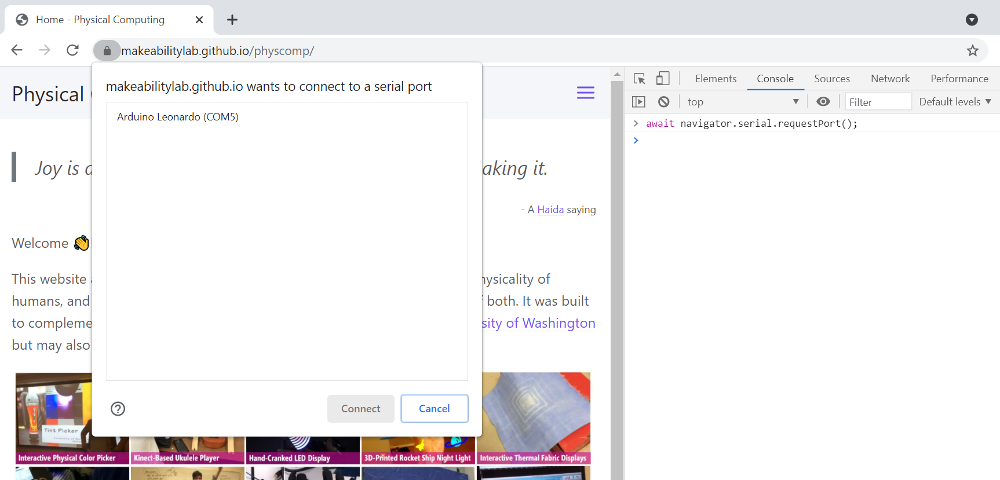
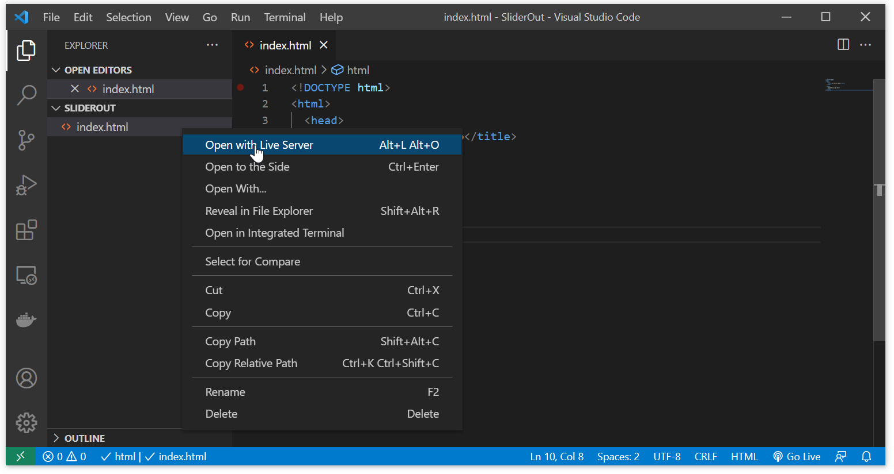
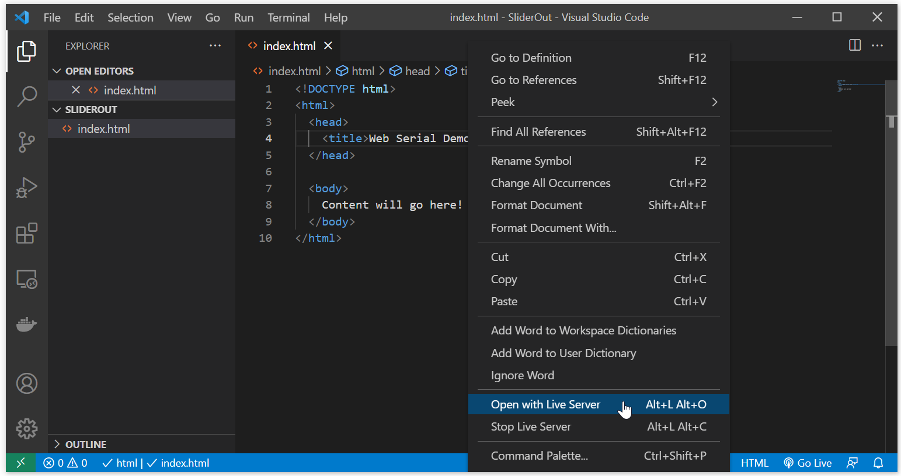
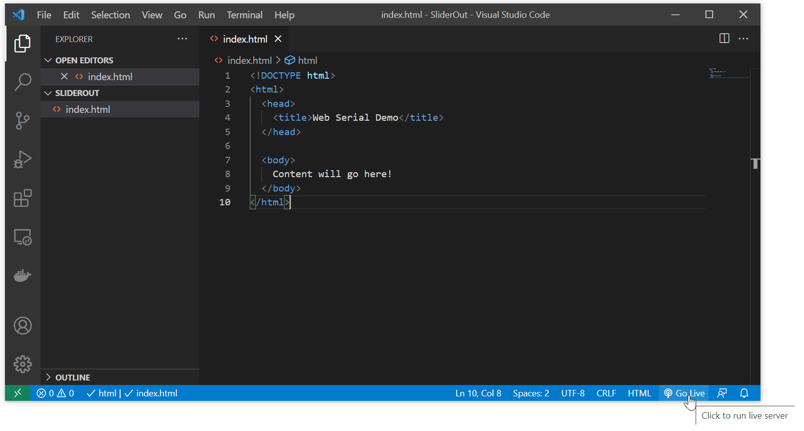

# {{ page.title | replace_first:'L','Lesson '}}
{: .no_toc }

## Table of Contents
{: .no_toc .text-delta }

1. TOC
{:toc}
---

In our [previous lesson](serial-intro.md), we learned about asynchronous serial communication, Arduino's [Serial library](https://www.arduino.cc/reference/en/language/functions/communication/serial/), and how to write programs—using [Serial Monitor](../arduino/serial-print.md), the command line, and [Python](https://www.python.org/)—to send data to an Arduino.

In this lesson, we'll apply that knowledge to a new and exciting context: **the web browser!** Using the [Web Serial API](https://developer.mozilla.org/en-US/docs/Web/API/Web_Serial_API), we'll build simple web apps that communicate directly with an Arduino over USB—no drivers, no native installs, just HTML, JavaScript, and a serial cable. 🌐

It may seem odd to use a web browser to talk to a locally connected device, but we actually do this all the time! Video chat apps access your camera and microphone via the [MediaDevices API](https://developer.mozilla.org/en-US/docs/Web/API/MediaDevices). The [Web Serial API](https://wicg.github.io/serial/) extends this same idea to serial devices—like Arduino.

{: .note }
> **In this lesson, you will learn:**
> - What the Web Serial API is and which browsers support it
> - How to use our [`serial.js`](https://github.com/makeabilitylab/js) wrapper library to simplify Web Serial
> - How to set up a web development environment with VSCode and Live Server
> - How to build a web app that sends slider values to Arduino over serial
> - How to build a bidirectional web app that sends and receives text data
> - How the event-driven programming pattern works with serial callbacks

## Background

Web browsers have been steadily gaining the ability to interact with local hardware. The W3C [MediaDevices API](https://developer.mozilla.org/en-US/docs/Web/API/MediaDevices) gave websites regulated access to cameras and microphones—something we now take for granted in video chat apps. In late 2017, Chrome added support for [WebUSB](https://wicg.github.io/webusb/), which extended this idea to general-purpose USB devices. Just like with cameras, security and privacy are paramount: web pages must request explicit user permission before accessing any device, and the browser mediates the entire process.

However, WebUSB did not include support for USB-to-serial devices like Arduino. The operating system's serial driver "claims" these devices before WebUSB can access them. To fill this gap, the [Web Serial API](https://wicg.github.io/serial/) was proposed and shipped in **Chrome 89 in March 2021**. It follows the same security model—your web page requests access, the browser shows a permission dialog, the user selects their device—but it specifically targets serial communication.

Web Serial is already used in production tools like the [Arduino Cloud Editor](https://create.arduino.cc/editor), which lets you write and upload sketches entirely from your browser, and [Microsoft MakeCode](https://makecode.com/), which uses it to flash code to microcontrollers via a drag-and-drop visual programming interface.

{: .note }
> **A brief timeline of browser hardware APIs:**
> - **2013:** [MediaDevices API](https://developer.mozilla.org/en-US/docs/Web/API/MediaDevices) — camera and microphone access (Chrome 21+)
> - **2017:** [WebUSB](https://wicg.github.io/webusb/) — general USB device access (Chrome 61+)
> - **2020:** [WebHID](https://developer.mozilla.org/en-US/docs/Web/API/WebHID_API) — human interface devices like game controllers (Chrome 89+)
> - **2021:** [Web Serial](https://wicg.github.io/serial/) — serial port access for microcontrollers, 3D printers, *etc.* (Chrome 89+)
>
> Each API follows the same pattern: the website requests access, the browser shows a permission dialog, and the user decides. This keeps you in control of which devices your browser can talk to.

## Why Web Serial?

While we could use [Processing](https://processing.org/) or [Python](https://www.python.org/) for computer-to-Arduino communication, Web Serial lets us combine Arduino with the **creative, fast-changing world of the web**. This opens up access to powerful web-based tools and APIs like [p5.js](https://p5js.org/), [ml5.js](https://ml5js.org/), [paper.js](http://paperjs.org/), [three.js](https://threejs.org/), [matter.js](https://brm.io/matter-js/), and more—all running right in the browser!

Of course, if your board has built-in WiFi (like the [ESP32](../esp32/index.md)), you can communicate directly with web servers over the network (as we explore in the [ESP32 IoT lesson](../esp32/iot.md)). In this lesson, however, we assume a **tethered USB connection** using serial over USB. Much of what we do here with Web Serial could be adapted to a WiFi context later.

## The Web Serial API

The [Web Serial API](https://developer.mozilla.org/en-US/docs/Web/API/Web_Serial_API) bridges the web and the physical world by allowing websites to communicate with serial devices—like microcontrollers and 3D printers—directly from JavaScript. Let's look at how to use it.

### Does my web browser support Web Serial?

Web Serial is supported by **Chrome** (89+), **Edge** (89+), and **Opera** (76+) on desktop. **Safari** does not support it. **Firefox** added experimental support in Nightly 151 (April 2026) behind a flag, but it is not yet enabled by default in stable releases and should not be relied on for coursework. For the latest browser compatibility, check Mozilla's [browser compatibility chart](https://developer.mozilla.org/en-US/docs/Web/API/Serial#browser_compatibility).

{: .warning }
> **We recommend using Chrome** for all Web Serial work in this course. If Web Serial is not available, your browser will silently fail—so always test with Chrome or Edge first.

To quickly check whether your browser supports Web Serial, open the developer console (`Ctrl+Shift+I` on Windows/Linux, `Cmd+Option+I` on Mac) and type:


> "serial" in navigator
true


If the result is `true`, your browser supports Web Serial. If `false`, switch to Chrome.

### How the Web Serial API works

The Web Serial API is **asynchronous** and **event-based**, which means your web page won't freeze while waiting for serial data. For a detailed walkthrough of the raw API, see the [Chrome Developers guide](https://developer.chrome.com/docs/capabilities/serial) by François Beaufort.

Here's a quick overview of the key steps:

#### Requesting permission to communicate with a serial device

For security, the browser requires the user to explicitly select and grant permission to a serial port. This is triggered by calling `navigator.serial.requestPort()`:


// Prompt user to select any serial port.
const port = await navigator.serial.requestPort();


The [`await`](https://developer.mozilla.org/en-US/docs/Web/JavaScript/Reference/Operators/await) keyword pauses execution until the user selects a port from the browser's permission dialog.

You can try this yourself! Open the dev console on any page served over HTTPS or localhost and type:


> await navigator.serial.requestPort();


If your Arduino is plugged in, you should see a dialog like this:

**Figure.** Typing `navigator.serial.requestPort()` in Chrome's dev console with an Arduino Leonardo plugged in shows the browser's permission prompt.
{: .fs-1 }

#### Opening the serial port

To open the port, call `port.open()` with a [SerialOptions](https://wicg.github.io/serial/#dom-serialoptions) dictionary. The only required option is `baudRate`:


// Prompt user to select a serial port
const port = await navigator.serial.requestPort();

// Open the port at 9600 baud
await port.open({ baudRate: 9600 });


The other options (`dataBits`, `stopBits`, `parity`, `bufferSize`, `flowControl`) default to the standard 8N1 configuration we discussed in the [previous lesson](serial-intro.md#the-asynchronous-serial-communication-frame). You typically don't need to change them.

#### Writing data

To write text data, use a `TextEncoderStream` piped to the port's writable stream:


const textEncoder = new TextEncoderStream();
const writableStreamClosed = textEncoder.readable.pipeTo(port.writable);

const writer = textEncoder.writable.getWriter();
await writer.write("hello");

// Release the lock so the port can be closed later
writer.releaseLock();


#### Reading data

Reading works similarly, using a `TextDecoderStream` and a read loop:


const textDecoder = new TextDecoderStream();
const readableStreamClosed = port.readable.pipeTo(textDecoder.writable);
const reader = textDecoder.readable.getReader();

// Listen to data coming from the serial device
while (true) {
  const { value, done } = await reader.read();
  if (done) {
    reader.releaseLock();
    break;
  }
  // value is a string
  console.log(value);
}


{: .note }
> The raw Web Serial API works, but it's verbose—especially for the stream setup, line buffering, and error handling. That's why we built a wrapper library called `serial.js` to simplify things. Let's look at that next!

## Our serial.js library

To make it easier to work with Web Serial, we wrote a JavaScript library called [`serial.js`](https://github.com/makeabilitylab/js) that handles the stream setup, text encoding/decoding, and line-break parsing for you. The library is part of the [Makeability Lab JS library](https://github.com/makeabilitylab/js).

To use it, add this `


This loads our serial library from the [jsDelivr CDN](https://www.jsdelivr.com/). After loading, the `Serial`, `SerialEvents`, and `SerialState` classes are available as global variables—no `import` statements needed!

{: .note }
> We intentionally use the **non-minified** version (`makelab.serial.iife.js`) rather than the minified version (`makelab.serial.iife.min.js`). Minified files are compressed and unreadable—if you ever need to step through the library code in your browser's debugger or read it in the Sources panel, the non-minified version is much easier to understand. For production websites, you'd use the `.min.js` version to save bandwidth, but for learning, readability wins.

{: .note }
> Our `serial.js` library is open source and lives at [github.com/makeabilitylab/js](https://github.com/makeabilitylab/js). You can view the [full source code](https://github.com/makeabilitylab/js/blob/main/src/lib/serial/serial.js), read the [API documentation](https://github.com/makeabilitylab/js#serial-module) in the README, or report issues there.

### Event-based architecture

[`serial.js`](https://github.com/makeabilitylab/js) uses an **event-based architecture** with callback functions, which is a common pattern in web and UI programming (see: Mozilla's [Introduction to Events](https://developer.mozilla.org/en-US/docs/Learn/JavaScript/Building_blocks/Events)). The `Serial` class fires four events:


const SerialEvents = Object.freeze({
  CONNECTION_OPENED: "CONNECTION_OPENED",  // Serial port successfully opened
  CONNECTION_CLOSED: "CONNECTION_CLOSED",  // Serial port closed
  DATA_RECEIVED:     "DATA_RECEIVED",      // New line of text received
  ERROR_OCCURRED:    "ERROR_OCCURRED",      // Error during connection or I/O
});


To create a `Serial` object and subscribe to events:


// Setup Web Serial using serial.js
const serial = new Serial();

// Subscribe to events
serial.on(SerialEvents.CONNECTION_OPENED, onSerialConnectionOpened);
serial.on(SerialEvents.CONNECTION_CLOSED, onSerialConnectionClosed);
serial.on(SerialEvents.DATA_RECEIVED, onSerialDataReceived);
serial.on(SerialEvents.ERROR_OCCURRED, onSerialErrorOccurred);

// Called when the serial connection opens
function onSerialConnectionOpened(eventSender) {
  console.log("Serial connection opened!");
}

// Called when the serial connection closes
function onSerialConnectionClosed(eventSender) {
  console.log("Serial connection closed.");
}

// Called when a new line of text is received from the serial device
function onSerialDataReceived(eventSender, newData) {
  console.log("Received:", newData);
}

// Called when an error occurs
function onSerialErrorOccurred(eventSender, error) {
  console.log("Serial error:", error);
}


You don't need to subscribe to *all* events—just the ones you need. But subscribing to `ERROR_OCCURRED` is helpful for debugging when things go wrong.

### Opening the serial port

The simplest way to open a connection is with `connectAndOpen()`, which prompts the user for a port and opens it in one step:


// Prompt user to select a port and open it at 9600 baud (default)
await serial.connectAndOpen();

// Or specify a baud rate (e.g., for ESP32)
await serial.connectAndOpen(null, { baudRate: 115200 });


{: .note }
> Because `connectAndOpen()` triggers a browser permission dialog, it **must be called from a user gesture** like a button click. You can't call it automatically when the page loads.

There is also `autoConnectAndOpenPreviouslyApprovedPort()`, which reconnects to a port the user has previously approved—without showing the permission dialog again. This is useful for web apps where you don't want to ask the user to re-select their Arduino every time the page reloads:


// Automatically reconnect to a previously approved port
await serial.autoConnectAndOpenPreviouslyApprovedPort({ baudRate: 9600 });


### Writing data

To send data to the Arduino, use `writeLine()` (which appends a newline character) or `write()`:


// Send "Hello" followed by a newline (\n)
await serial.writeLine("Hello");

// Send text without a newline
await serial.write("data");


### Checking connection state


serial.isOpen();  // returns true or false
serial.state;     // returns "closed", "opening", "open", or "closing"

// Check browser support (static method)
Serial.isWebSerialSupported(); // returns true or false


## Let's make stuff!

Now that we understand the Web Serial API and our `serial.js` wrapper, let's build two web apps. We'll use the same Arduino code ([SimpleSerialIn.ino](https://github.com/makeabilitylab/arduino/blob/master/Serial/SimpleSerialIn/SimpleSerialIn.ino)) and circuit from the [previous lesson](serial-intro.md).

**Figure.** The circuit for [SimpleSerialIn.ino](https://github.com/makeabilitylab/arduino/blob/master/Serial/SimpleSerialIn/SimpleSerialIn.ino). Made in Fritzing and PowerPoint.
{: .fs-1 }

{: .note }
> **Using an ESP32?** All the code in this lesson works with the ESP32-S3 too—just change the baud rate to `115200` in both your Arduino sketch (`Serial.begin(115200)`) and your JavaScript (`serial.connectAndOpen(null, { baudRate: 115200 })`). The ESP32-S3 uses **native USB**, so the serial port may briefly disappear during board resets—this is normal. If your web app loses the connection after an upload, just click the connect button again.

### Web dev tools

We recommend developing web code in [Visual Studio Code (VSCode)](https://code.visualstudio.com/) with the [Live Server](https://marketplace.visualstudio.com/items?itemName=ritwickdey.LiveServer) extension.

{: .warning }
> Web Serial requires your page to be served from a **web server** (either `localhost` or `https://`). You can't just double-click `index.html` in File Explorer or Finder—the browser will block serial access from `file://` URLs. Use Live Server (or any local web server) instead.

To install Live Server, open VSCode, click `Extensions` in the left sidebar (or `Ctrl+Shift+X`), and search for "Live Server." To use it, open an `.html` file, then either right-click and select "Open with Live Server" or click the blue "Go Live" button in the bottom-right corner of VSCode. By default, Live Server auto-reloads whenever your files change—very handy!

| 1. Right-click in Explorer View | 2. Right-click in Editor | 3. Click 'Go Live' Button |
|----|----|----|
|  |  |  |

### Example 1: Slider webpage

We're going to build a simple webpage with a slider that transmits a value between 0 and 255 as text via Web Serial. The Arduino receives the text, converts it to an `int`, and uses `analogWrite` to control an LED brightness.

The full experience looks like this:

<video autoplay loop muted playsinline aria-label="Video demonstrating the SliderOut web serial demo controlling an LED brightness via a slider">
  <source src="assets/videos/SimpleSerialIn-JavaScript-SliderOut-Snippet720p.mp4" type="video/mp4" />
</video>
**Video.** The SliderOut demo ([live page](https://makeabilitylab.github.io/p5js/WebSerial/Basic/SliderOut), [code](https://github.com/makeabilitylab/p5js/tree/main/WebSerial/Basic/SliderOut)) with [SimpleSerialIn.ino](https://github.com/makeabilitylab/arduino/blob/master/Serial/SimpleSerialIn/SimpleSerialIn.ino) on the Arduino Leonardo.
{: .fs-1 }

<!-- TODO: verify that the live page and code links above are still active -->

<!-- TODO: Sync GitHub source for SliderOut/index.html to match lesson changes:
     - Add try/catch around connectAndOpen() in onConnectButtonClick()
     GitHub: https://github.com/makeabilitylab/p5js/tree/main/WebSerial/Basic/SliderOut -->

#### Create folder and initial index.html page

Create a folder called `SliderOut` with an empty `index.html` file. Open the folder in VSCode (`File → Open Folder`). Start with this minimal HTML:


<!DOCTYPE html>
<html>
<head>
  <title>Web Serial Demo</title>
</head>

<body>
  Content will go here!
</body>
</html>


Save (`Ctrl+S`) and launch it with Live Server to verify everything is working. You should see a blank page with "Content will go here!" at `127.0.0.1:5500`.

#### Add serial.js and a connect button

Now let's add our serial library, a heading, and a connect button. Because Web Serial requires explicit user permission, we need a button the user can click to initiate the connection.


<!DOCTYPE html>
<html>
<head>
  <title>Web Serial Demo</title>
  
</head>

<body>
  <h1>Web Serial Demo</h1>
  
This demo uses a slider to send a number between 0-255 to your connected serial device.

  <button id="connect-button" onclick="onConnectButtonClick()">Connect via Serial Port</button>

  
</body>
</html>


Save, reload, and try clicking the button with your Arduino plugged in. The browser will show a permission dialog listing available serial ports. Select your Arduino and click "Connect." You should see `onSerialConnectionOpened` in the dev console.

<video autoplay loop muted playsinline aria-label="Video showing the Web Serial permission dialog appearing when the Connect button is clicked">
  <source src="assets/videos/SliderOutScreenRecording_ButtonJustHookedUp-Optimized.mp4" type="video/mp4" />
</video>

#### Add and hook up a slider

Now let's add a slider to select and send values between 0 and 255. In HTML, sliders are [`<input type="range">`](https://developer.mozilla.org/en-US/docs/Web/HTML/Element/input/range) elements. Add this below the button:


<button id="connect-button" onclick="onConnectButtonClick()">Connect via Serial Port</button>
<label for="slider">LED brightness:</label>
<input id="slider" type="range" min="0" max="255"
  value="128" onchange="onSliderValueChanged(this, event)" />


And add the `onSliderValueChanged()` function to the `
</head>

<body>
  

    <button id="connect-button" onclick="onButtonConnectToSerialDevice()">
      Connect via Serial Port
    </button>
    

      <label for="input-text">Enter text:</label>
      <input id="input-text" placeholder="Enter some text" name="input-text" />

      <h3>Display text:</h3>
      

      <h3>Received from Arduino:</h3>
      

    

  

</body>
</html>


#### Add the JavaScript

Add a `


#### Add CSS

Create a `css/styles.css` file to clean up the interface:


#main-content {
  margin: auto;
  width: 800px;
  border: 3px solid rgb(216, 216, 216);
  padding: 10px;
}

input {
  min-width: 400px;
}

#text-interface {
  display: none;
}


Link it in the `<head>`:


<head>
  ...
  <link rel="stylesheet" href="css/styles.css">
</head>


That's it! You now have a bidirectional web serial app. Play and experiment!

#### Full DisplayText video demo

<video autoplay loop muted playsinline aria-label="Video showing the completed DisplayText web serial demo with bidirectional text communication">
  <source src="assets/videos/DisplaySerialTextIn-FullSpedUp-Optimized.mp4" type="video/mp4" />
</video>
**Video.** The completed DisplayText demo ([live page](https://makeabilitylab.github.io/p5js/WebSerial/Basic/DisplayText/), [code](https://github.com/makeabilitylab/p5js/tree/main/WebSerial/Basic/DisplayText)) with [DisplayTextSerialIn.ino](https://github.com/makeabilitylab/arduino/blob/master/Serial/DisplayTextSerialIn/DisplayTextSerialIn.ino) on the Arduino Leonardo.
{: .fs-1 }

<!-- TODO: verify that the live page and code links above are still active -->

## Troubleshooting

Web Serial is powerful but can be frustrating to debug, especially when things silently fail. Here are the most common issues and how to fix them.

**No serial ports appear in the browser dialog.** Make sure your Arduino is plugged in via USB and that no other program (like the Arduino IDE's Serial Monitor) has the port open. Only one program can access a serial port at a time. On Mac/Linux, check that you have the correct USB drivers installed. Try a different USB cable—some cables are power-only and don't carry data.

**Garbled text or garbage characters in the console.** This almost always means a **baud rate mismatch**. The baud rate in your JavaScript (`serial.connectAndOpen(null, { baudRate: 9600 })`) must exactly match the baud rate in your Arduino sketch (`Serial.begin(9600)`). Double-check both.

**`navigator.serial` is `undefined`.** Your browser doesn't support Web Serial. Switch to **Chrome**, **Edge**, or **Opera**. Also make sure you're serving your page from a web server (`localhost` or `https://`)—Web Serial is blocked on `file://` URLs.

**The connect button does nothing (no permission dialog appears).** The `connectAndOpen()` call must happen inside a **user gesture** event handler (like a button click). You cannot call it automatically on page load—the browser blocks this for security. Also check your dev console (`Ctrl+Shift+I`) for error messages.

**The connection works once but fails after re-uploading Arduino code.** When you upload new code to the Arduino, the board resets and the serial port briefly disconnects. Your web app may need to reconnect. Click the connect button again after uploading. On the **ESP32-S3** with native USB, the port may disappear entirely during reset and reappear with a different name—this is normal.

**Data seems delayed or arrives in chunks.** Serial data is buffered. Our `serial.js` library reads line-by-line (splitting on `\n`), so make sure your Arduino is sending data with `Serial.println()` (which appends `\r\n`) rather than `Serial.print()`. If you use `Serial.print()`, the data will accumulate in the buffer until a newline arrives.

## Lesson Summary

In this lesson, you learned how to use the Web Serial API to communicate between a web browser and an Arduino. Here are the key takeaways:

- The **Web Serial API** allows websites to communicate with serial devices like Arduino directly from JavaScript. It is supported in Chrome, Edge, and Opera.
- We use our **[`serial.js`](https://github.com/makeabilitylab/js) wrapper library** to simplify Web Serial. It handles stream setup, text encoding, and line-break parsing so you can focus on the interaction.
- Web Serial requires a **user gesture** (like a button click) to request access to a serial port. The browser handles the permission dialog for security.
- Our `serial.js` library uses an **event-based pattern** with four events: `CONNECTION_OPENED`, `CONNECTION_CLOSED`, `DATA_RECEIVED`, and `ERROR_OCCURRED`.
- You must serve your web page from a **web server** (like Live Server) for Web Serial to work—`file://` URLs won't work.
- We built two complete web apps: a **slider** that sends values to control an LED, and a **bidirectional text** app that sends and receives text between the browser and Arduino.

## Exercises

**Exercise 1:** Modify the SliderOut example to include **two sliders**—one that controls LED brightness (0–255) and one that controls blink delay in milliseconds. Send both values as a comma-separated string (*e.g.,* `"128,500\n"`) and modify the Arduino code to parse and use both values.

**Exercise 2:** Add a **status indicator** to the SliderOut page that shows whether the serial connection is open, closed, or in an error state. Use the `onSerialConnectionOpened`, `onSerialConnectionClosed`, and `onSerialErrorOccurred` callbacks to update a `` element with the current status and change its color (green for connected, red for disconnected/error).

**Exercise 3:** Build a **color picker** web app that sends an RGB value to the Arduino. Use three sliders (one each for red, green, blue) and send the values as a CSV string (*e.g.,* `"128,0,255\n"`). 
On the Arduino, parse the three values and use them to control an RGB LED. See the Makeability Lab's [SerialColorTest example](https://makeabilitylab.github.io/js/src/apps/serial/SerialColorTest/).

**Exercise 4:** Extend the DisplayText example to keep a **scrolling log** of all received serial data instead of showing only the most recent line. Display the last 20 lines in a `<textarea>` or `
` element.

## Resources

- [Web Serial API](https://developer.mozilla.org/en-US/docs/Web/API/Web_Serial_API), MDN Web Docs

- [Read from and write to a serial port](https://developer.chrome.com/docs/capabilities/serial), Chrome for Developers (by François Beaufort)

- [Web Serial API Living Document](https://wicg.github.io/serial/), W3C Community Group Draft Report

- [Makeability Lab JS Library (serial.js)](https://github.com/makeabilitylab/js), GitHub

## Next Lesson

In the [next lesson](p5js-serial.md), we'll combine Web Serial with [p5.js](https://p5js.org/)—a creative coding library—to build interactive visualizations driven by Arduino sensor data. It's gonna be great fun! 🎨

<nav class="lesson-nav" aria-label="Lesson navigation">
  <a href="serial-intro.html" class="nav-prev">
    
&larr; Previous Lesson

    
Intro to Serial

  </a>
  <a href="p5js-serial.html" class="nav-next">
    
Next Lesson &rarr;

    
p5.js Serial In

  </a>
</nav>