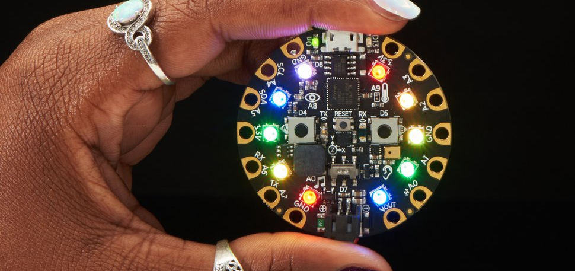
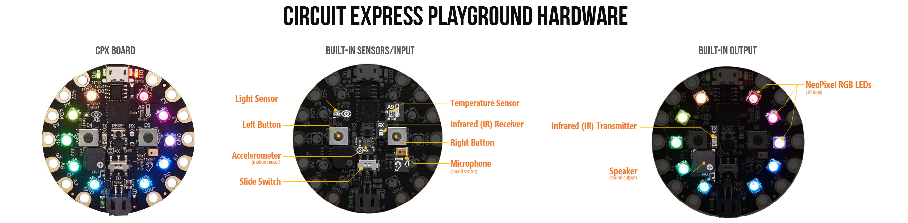
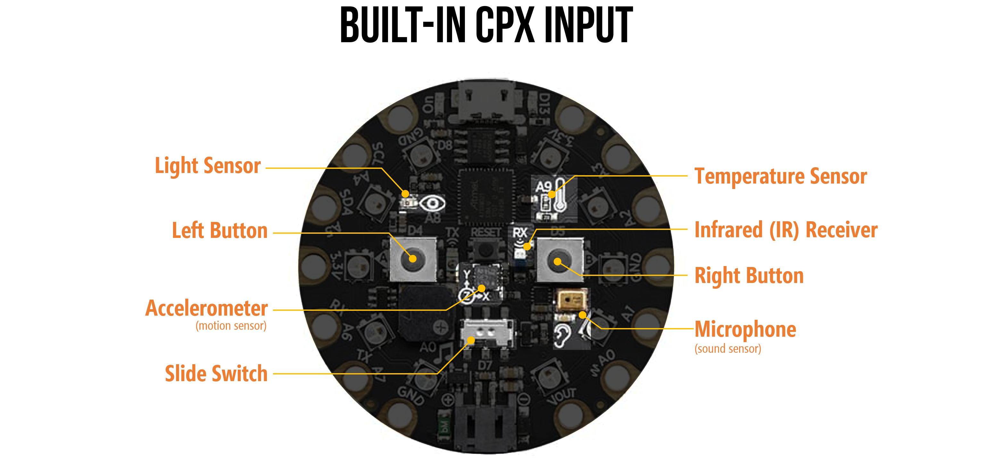
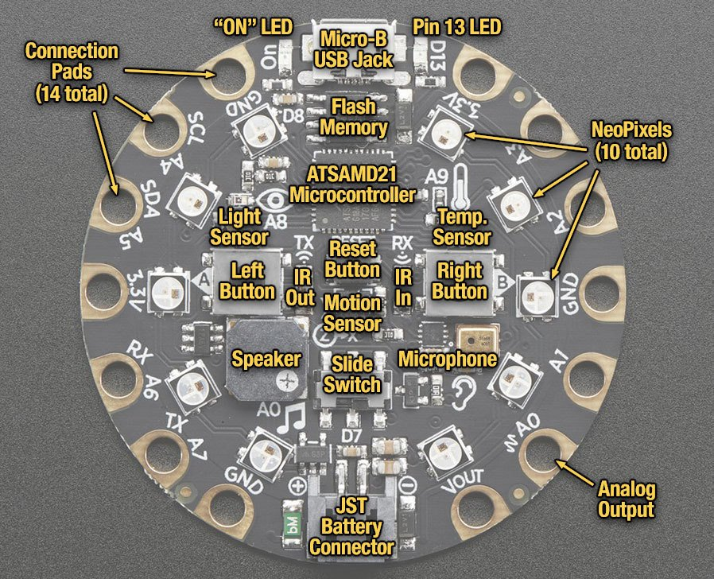
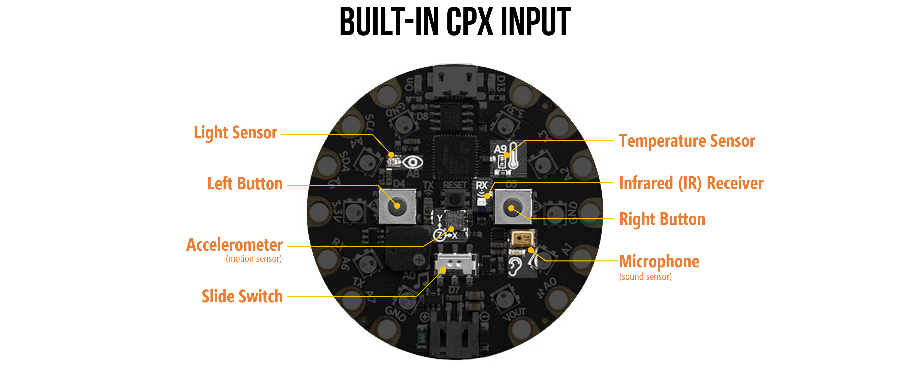
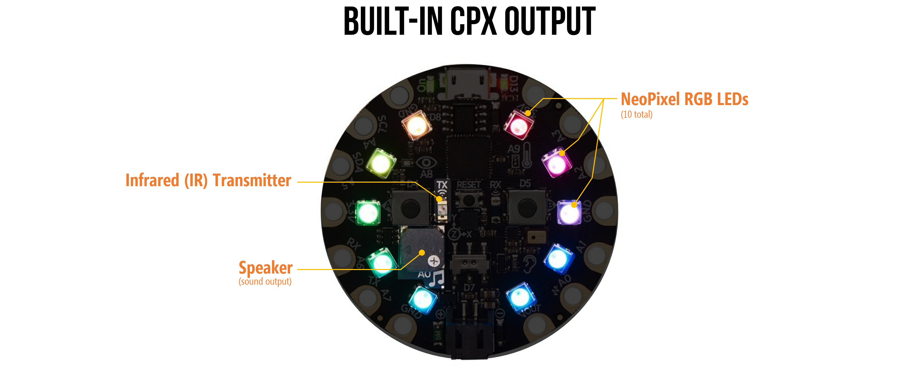
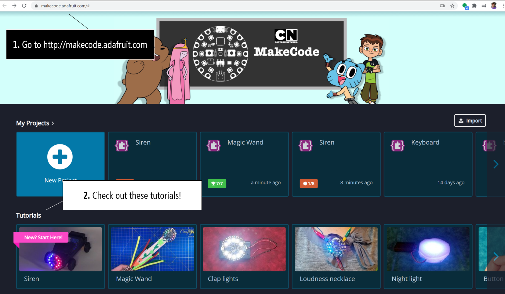

# {{ page.title | replace_first:'L','Lesson '}}
{: .no_toc }

## Table of Contents
{: .no_toc .text-delta }

1. TOC
{:toc}
---

**Figure.** The Circuit Express Playground. Image from [Adafruit](https://www.adafruit.com/product/3333). 
{: .fs-1 } 

The Circuit Express Playground (CPX) is an introductory physical computing board created through a partnership by [Adafruit](https://adafruit.com) and [Code.org](https://code.org). It is a wonderful electronic prototyping platform and introductory board for learning *electronics* and *programming*.

Compared with [Arduino](../arduino/index.md), the CPX's advantages for novice makers are twofold:

1. First, the CPX can be programmed with an easy-to-use drag-and-drop—or block-based—visual programming language called [MakeCode](https://makecode.adafruit.com/), which is similar to [Scratch](https://scratch.mit.edu/). As students and makers gain experience and expertise, they can switch over to more advanced programming languages such as [CircuitPython](https://learn.adafruit.com/adafruit-circuit-playground-express/what-is-circuitpython) (Python), or [Arduino](https://learn.adafruit.com/adafruit-circuit-playground-express/arduino) (C/C++)

2. Second, the CPX includes a variety of built-in inputs and outputs, so you do not need to purchase or wire-up external components (or even use a [breadboard](../electronics/breadboards.md)). On-board **inputs** include a [LIS3DH accelerometer](https://learn.adafruit.com/adafruit-lis3dh-triple-axis-accelerometer-breakout), a light-level sensor (a phototransistor), multiple push buttons, a microphone, and **outputs** include [neopixel LEDS](https://learn.adafruit.com/neopixels-with-makecode), a speaker, and infrared receivers/transmitters.

To contextualize CPX's potential even further, we can use the three evaluation criteria for creative construction kits that Mitchell Resnick and Brian Silverman outline in their fantastic IDC'05 paper ["Some Reflections on Designing Construction Kits for Kids"](https://doi.org/10.1145/1109540.1109556)

1. **Low floors**—construction kits should be approachable, easy-to-use for beginners;
2. **high ceilings**—construction kits should grow with you as you learn and gain experience, allowing you to create  increasingly advanced projects; 
3. and **wide walls**—construction kits should support a breadth of designs and projects. 
 
We believe the CPX meets each of these criteria—making it a powerful prototyping and educational platform. As an example, the UW has used the CPX in our [MHCI+D program](https://mhcid.washington.edu/) but also in some introductory electrical engineering courses—quite the range of contexts!

## Hardware
<!-- 
**Figure.** An overview of the Circuit Express Playground (CPX) hardware including built-in input and output. See below for larger versions.
{: .fs-1 }  -->

<!-- 

*Figure.* An annotated version of the CPX showing the location of all main components. Image from [Adafruit](https://learn.adafruit.com/adafruit-circuit-playground-express/guided-tour).  -->

One key benefit of the CPX hardware—compared with vanilla Arduino boards—is that it's  full of amazing input/output (IO) components. Adafruit provides a detailed ["guided tour"](https://learn.adafruit.com/adafruit-circuit-playground-express/guided-tour) but, in short, the board includes:

### Input

**Figure.** An annotated image of the CPX's built-in sensors/input.
{: .fs-1 .align-center} 

The CPX includes the following built-in input/sensors:

- 1 x Motion sensor (LIS3DH triple-axis accelerometer with tap detection, free-fall detection)
- 1 x Temperature sensor (thermistor)
- 1 x Light sensor (phototransistor). Can also act as a color sensor and pulse sensor.
- 1 x Sound sensor (MEMS microphone)
- 2 x Push buttons, labeled A and B
- 1 x Slide switch

<!-- - 7 pads can act as capacitive touch inputs and the 1 remaining is a true analog output
- Reset button -->

### Output

**Figure.** An annotated image of the CPX's built-in output.
{: .fs-1 .align-center} 

The CPX includes the following built-in output:
- 10 x mini [NeoPixels](https://learn.adafruit.com/neopixels-with-makecode), each one can display any color
- 1 x Mini speaker with class D amplifier (7.5mm magnetic speaker/buzzer)
- Green "ON" LED so you know its powered
- Red "#13" LED for basic blinking

<!-- ### I/O

- Infrared (IR) receiver and transmitter: can receive and transmit any remote control codes, as well as send messages between Circuit Playground Expresses. Can also act as a proximity sensor.
- 8 x alligator-clip friendly input/output pins
- Includes I2C, UART, 8 pins that can do analog inputs, multiple PWM output -->
### Other info

The CPX also has a powerful embedded microcontroller—the ATSAMD21 ARM Cortex M0 Processor—running at 3.3V and 48MHz. In comparison, the Arduino Uno is powered by a much older and slower microcontroller: the ATmega328P at 5V and 16 MHz. 

Like the Arduino Leonardo, the CPX can act like a keyboard, mouse, joystick, MIDI, or simply a serial port. So you can easily make custom input to your computer—neat!

## Programming

An additional benefit of the CPX compared with traditional Arduino is that it can be programmed multiple ways—for novices with limited programming background or for those who simply like visual programming languages, you can use [MakeCode](https://learn.adafruit.com/adafruit-circuit-playground-express/makecode). More advanced users may choose Python via [CircuitPython](https://learn.adafruit.com/adafruit-circuit-playground-express/what-is-circuitpython) or C/C++ via the [Arduino IDE](https://learn.adafruit.com/adafruit-circuit-playground-express/arduino).

### MakeCode
Microsoft's MakeCode was designed to provide a visual, drag-and-drop interface for programming physical computing projects. This visual programming style—called block-based programming—was popularized by and is similar to [Scratch](https://scratch.mit.edu/). The animation below shows how you program the CPX simply by dragging-and-dropping "puzzle pieces" (blocks).

<video class="img img-responsive lazy" preload="auto" muted="muted" loop="loop" autoplay="autoplay" playsinline="" poster="https://cdn-learn.adafruit.com/assets/assets/000/048/088/medium800thumb/makecodedragdemo.jpg?1510260958">
    <source src="https://cdn-learn.adafruit.com/assets/assets/000/048/088/large1024mp4/makecodedragdemo.mp4?1510260958">
    <source src="https://cdn-learn.adafruit.com/assets/assets/000/048/088/large1024webm/makecodedragdemo.webm?1510260958" type="video/webm; codecs=vp8,vorbis">
    <source src="https://cdn-learn.adafruit.com/assets/assets/000/048/088/large1024ogv/makecodedragdemo.ogv?1510260958" type="video/ogg; codecs=theora,vorbis">
    Your browser does not support the video tag.
</video>
**Video.** An animation showing how to program the CPX in MakeCode. Animation from [Adafruit](https://learn.adafruit.com/adafruit-circuit-playground-express/what-is-makecode).
{: .fs-1 }

## Learning Resources

<!-- 
**Figure** A screenshot of the [Adafruit MakeCode website](https://makecode.adafruit.com/) that has links to tutorials and example projects.
{: .fs-1 } -->

To learn more, Adafruit and MakeCode have published a series of thoughtful, easy-to-understand tutorials:
- A ["What is MakeCode and How to Use it"](https://learn.adafruit.com/makecode) primer

- You can find [step-by-step MakeCode + CPX tutorials](https://makecode.adafruit.com/) within the MakeCode editor itself. The nice thing here is that the MakeCode editor walks you through each step. Pretty awesome!

- You can also access the above tutorials as [traditional, linear step-by-step guides here](https://makecode.adafruit.com/tutorials).

- Microsoft's [Peli de Halleux](https://learn.adafruit.com/users/pelikhan) has created a few CPX+MakeCode guides on the Adafruit website, including one on [NeoPixels](https://learn.adafruit.com/neopixels-with-makecode) and the other on [CPX Sensors](https://learn.adafruit.com/sensors-in-makecode).

- Adafruit also publishes individual "courses", including [Using the CPX Pins](https://makecode.adafruit.com/learnsystem/pins-tutorial), [Logic Lab](https://makecode.adafruit.com/learnsystem/logic-lab), and a [Maker Course](https://makecode.adafruit.com/courses/maker).

- Finally, if you want to dive deeper into some of the CPX's individual hardware components, [Shawn Hymel](https://shawnhymel.com/), Adafruit, and MakeCode teamed up to make a video-based tutorial series called [Behind the MakeCode Hardware](https://makecode.adafruit.com/behind-the-makecode-hardware), including topics on:
  - [Neopixels](https://youtu.be/Bo0cM2qmuAE). See also Halleux's [NeoPixels with MakeCode](https://learn.adafruit.com/neopixels-with-makecode) tutorial.
  - [Speaker](https://youtu.be/JjJ-KGwKh_4). See also the [Make it Sound](https://learn.adafruit.com/make-it-sound?view=all#music-and-sound-in-makecode) tutorial.
  - [Accelerometer](https://youtu.be/2HzNKz-QlV0)
  - [Light Sensor](https://youtu.be/9LrWQ68lO20)
  - [Infrared](https://youtu.be/0EMuaMClfos)
  - [Microphone](https://youtu.be/g5894PVYOF4)

### Example projects

- Adafruit publishes [example MakeCode+CPX example projects](https://learn.adafruit.com/category/makecode) along with tutorials.

## Next Lesson

In the [next lesson](makecode.md), we will make our first MakeCode+CPX program—called Blinky. As we build, we will learn about the MakeCode programming environment, the simulator, and how to load our program on to the CPX.

[Next: Programming the CPX with MakeCode](makecode.md){: .btn .btn-outline }

## Educational reflections

As someone who has worked with and taught physical computing for nearly a decade, MakeCode addresses several barriers to entry for novices (in rough order of importance):

- First, the block-based, drag-and-drop interface is far more accessible to novice programmers than Arduino's IDE and C/C++ environment. And MakeCode generates **real** JavaScript code based on your block program so you can go back and forth between the two.
- Second, **event handling**. A key challenge with Arduino for novices is handling events (e.g., when a button is pressed, do this), especially when programs contain lots of loops (which can make the system seem unresponsive, see this [discussion](https://makeabilitylab.github.io/physcomp/arduino/led-fade.html#improved-fading-approach-limiting-delays))
- Third, there is a built-in **simulation environment** that immediately lets you see how your code will perform before uploading it to your physical CPX device
- Finally, it is a **web-based editor**. There is nothing to install and you can program the CPX from your web browser. And once you've loaded the editor, it stays cached in your browser (so works offline).
