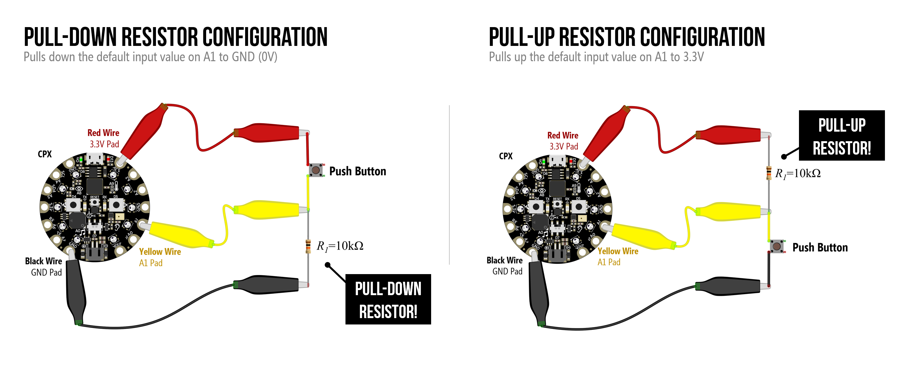
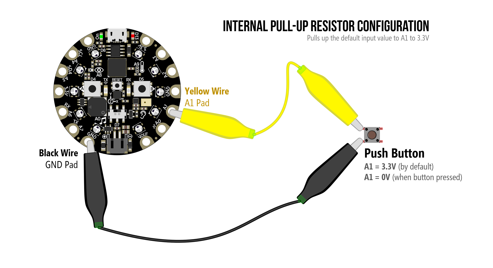
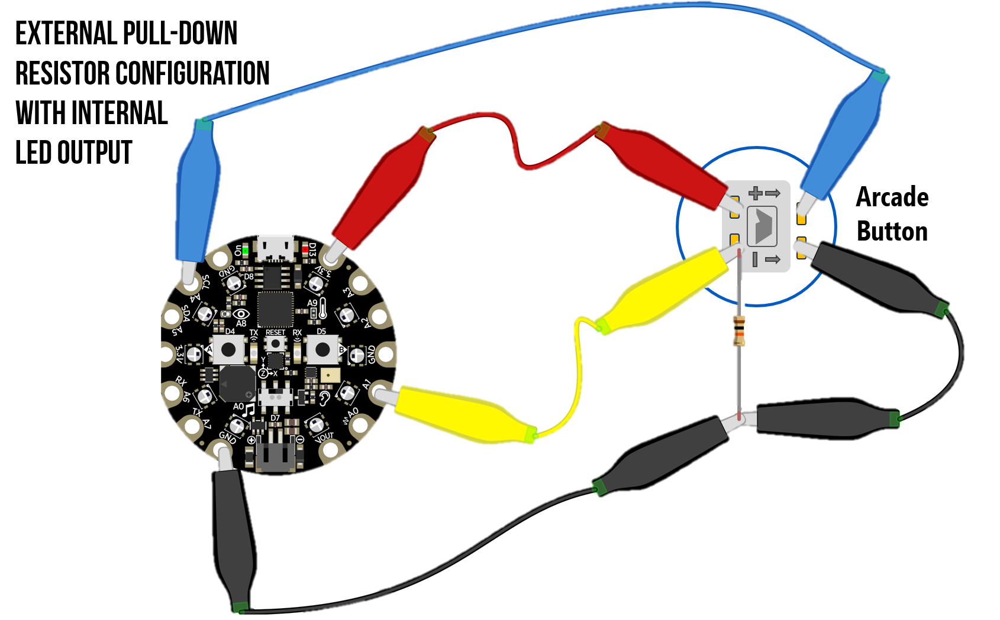
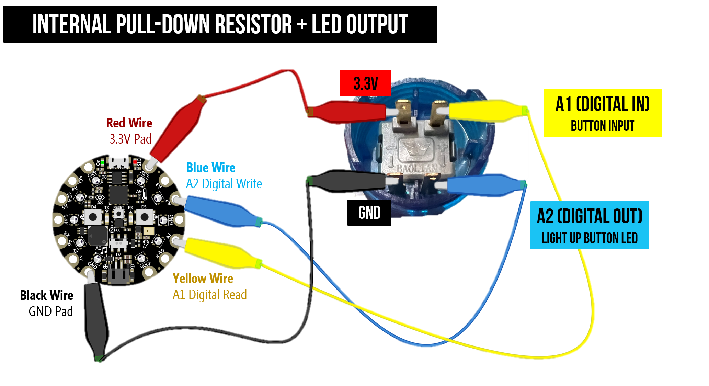

# {{ page.title | replace_first:'L','Lesson '}}
{: .no_toc }

## Table of Contents
{: .no_toc .text-delta }

1. TOC
{:toc}
---

In Lesson 9, we continue exploring how to hook up and use external electronics with our CPX. In Lesson 8, we worked with analog input—which converts voltage signals from 0 - 3.3V to 0 - 1023. In Lesson 9, we'll work with **digital input**, which converts voltage input signals to either ON (1) or OFF (0). This is useful for components like buttons.

## Lesson 8.1: Overview of Digital Input

In this lesson, we learn about _what_ is **digital input** and _how_ to use it on the Circuit Playground Express (CPX). We begin similarly to our [analog input lessons](analog-input.md): introducing the 3.3V, GND, and A1 CPX connection pads and showing how the **digital read** function responds to different input voltages (e.g., 3.3V, GND).

  <iframe width="100%" src="https://www.youtube.com/embed/raIc-EuHfmc?si=-KCgO3ypF9kPKBVd" title="YouTube video player" frameborder="0" allow="accelerometer; autoplay; clipboard-write; encrypted-media; gyroscope; picture-in-picture; web-share" allowfullscreen></iframe>

## Lesson 8.2: Hooking up Buttons to the CPX & Why Pull-down Resistors?

In this video, we introduce a solution to the "floating pin" problem using pull-down resistors and hook up our first button to the CPX.

  <iframe width="100%" src="https://www.youtube.com/embed/mFXvAfsiRx0?si=_6ks-_M8sWD0XlSQ" title="YouTube video player" frameborder="0" allow="accelerometer; autoplay; clipboard-write; encrypted-media; gyroscope; picture-in-picture; web-share" allowfullscreen></iframe>

{: .note }
If you want to skip all the theory about why pull-down resistors and just "follow the recipe" for hooking up a button, [skip to 13:54 in our video](https://youtu.be/mFXvAfsiRx0?si=jWkx5H2zZZ5vhSaB&t=834). You can learn more about the "floating pin problem" and more in [Arduino L1: Using Buttons](../arduino/buttons.md).

### Circuit Diagrams

### Code

- [Example MakeCode for Pull-down Resistor](https://makecode.com/_abT69mEadH6t). In the pull-down configuration, the default input to A1 is pulled down to 0V. Then, when the button is pressed, the A1 input goes to 3.3V. So, we turn on the NeoPixels when A1 goes to 3.3V (i.e., when the button is pressed).

- [Example MakeCode for Pull-up Resistor](https://makecode.com/_FD0KHFLfDau7). In the pull-up configuration, the default input to A1 is pulled up to 3.3V. Then, when the button is pressed, the A1 input goes to 0V. So, we turn on the NeoPixels when A1 goes to 0V (i.e., when the button is pressed).

## Lesson 8.3: Using Internal Pull-up & Pull-down Resistors

In this video, we introduce external pull-up resistors and then using internal pull-up and pull-down resistors on the CPX with MakeCode.

  <iframe width="100%" src="https://www.youtube.com/embed/JT4sQ72HJAM?si=ib8fGLSrsdvz5T-u" title="YouTube video player" frameborder="0" allow="accelerometer; autoplay; clipboard-write; encrypted-media; gyroscope; picture-in-picture; web-share" allowfullscreen></iframe>

### Circuit Diagrams

## Lesson 8.4: Hooking up Arcade Buttons to the CPX

In this video, we show how to hook up arcade buttons to the CPX, which have cool embedded LEDs that we can turn on/off. We'll show how to wire up the arcade button with without and with the embedded LED and, along the way, learn a bit about digital write.

  <iframe width="100%" src="https://www.youtube.com/embed/nExLP211ZUA?si=5_z8wM0QDisPTTo8" title="YouTube video player" frameborder="0" allow="accelerometer; autoplay; clipboard-write; encrypted-media; gyroscope; picture-in-picture; web-share" allowfullscreen></iframe>

### Circuit Diagrams

Using an external pull-down resistor with the arcade button.

Using an internal pull-down resistor with the arcade button (but not hooking up the internal LED).

Hooking up internal LED. Here's [example code](https://makecode.com/_0oVYVmYK5gYt) that turns on the internal LED when the button is pressed.

<!-- TODO: add in circuit diagrams and code links 
Post advance code for debouncing
-->

### Code

- [Example Arcade Button Code](https://makecode.com/_0oVYVmYK5gYt). Example arcade button code for an internal pull-down resistor configuration that turns on the NeoPixels with a button press and the internal LED on the button itself (using digital write)

## Advanced Code

* [Debouncing Buttons in MakeCode](https://makecode.com/_ie5VHcgsXfEu). Note: I haven't really found the need to debounce buttons with MakeCode and CPX but if you're getting unexpected multiple button presses when using a button, try this out. For more on debouncing, see our [Debouncing Lesson](../arduino/debouncing.md).

## Resources
Here are some additional resources:

* [MakeCode Pins](https://makecode.adafruit.com/reference/pins)
* [MakeCode's Digital Read Function](https://makecode.adafruit.com/reference/pins/digital-read)
* [MakeCode Input States](https://makecode.adafruit.com/learnsystem/pins-tutorial/digital-input/input-states)
* [Adafruit MakeCode Learning: Digital Input](https://makecode.adafruit.com/learnsystem/digital-input)
* [Using Digital Input on the CPX with Arduino C/C++](https://learn.adafruit.com/circuit-playground-digital-input/overview)

## Previous Lesson

[Previous: Analog Input](analog-input.md){: .btn .btn-outline }
