# {{ page.title | replace_first:'L','Lesson '}}
{: .no_toc }

## Table of Contents
{: .no_toc .text-delta }

1. TOC
{:toc}
---

In this lesson, we will make our first MakeCode+CPX program—called Blinky—which will play a sound effect at the start and then repeatedly flash lights. As we build, we will learn about the MakeCode programming environment, the simulator, and how to load our program on to the CPX.

## The MakeCode Programming Environment

<video autoplay loop muted playsinline style="margin:0px">
  <source src="assets/videos/Making_SimpleFastAnimationProgram_MakeCode_ScreenRecording.mp4" type="video/mp4" />
</video>
**Video.** Rapidly creating a full program with MakeCode: a simple rainbow animation. [Code link](https://makecode.com/_8uY3D8Fc8A5t). 
{: .fs-1 }

MakeCode is a visual programming language—like [Scratch](https://scratch.mit.edu/)—built on [Blockly](https://developers.google.com/blockly). As the video above shows, to program the CPX, you simply drag-and-drop "puzzle pieces." We call these pieces *blocks.* As you fit blocks together, you can create interactive programs!

<!-- Some of you may be familiar with similar languages like [Scratch](https://scratch.mit.edu/) or to the intro programming interfaces used by [code.org](https://code.org/student/elementary).  -->

### The MakeCode interface

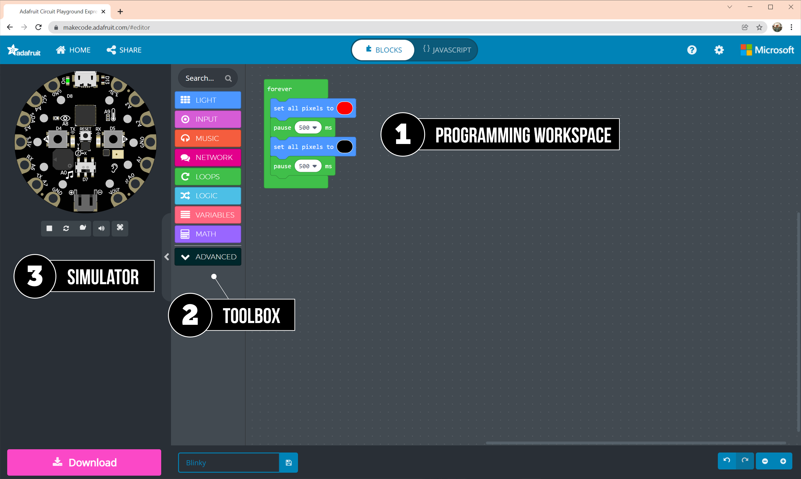
**Figure.** An annotated screenshot of the MakeCode interface highlighting the (1) programming workspace, (2) toolbox, and (3) the simulator.
{: .fs-1 }

The MakeCode editor has three primary user interface areas, the: (1) programming workspace, (2) toolbox, and (3) simulator.

1. The **programming workspace** to build your program by dragging-and-dropping the puzzle pieces
2. The **toolbox** to retrieve the puzzle pieces (aka blocks)
3. The **simulator** to test your program before downloading it to your CPX

## Our first program: Blinky
Let's make our first program: Blinky! To start, we'll make Blinky flash all ten of the CPX's NeoPixel LEDs on and off. Then we'll add in a special "startup" sound to introduce other programmable elements.

<video autoplay loop muted playsinline style="margin:0px">
  <source src="assets/videos/Making_Blinky_MakeCode_FinalLoop.mp4" type="video/mp4" />
</video>
**Video.** The initial Blinky program: notice how the simulator's lights (the NeoPixels) are flashing red for 500ms then off for 500ms and repeating.
{: .fs-1 }

As you build your program, observe how the simulator on the left shows it's behavior in real-time—notice the flashing LEDs in the video above. As you make changes in MakeCode, the simulator will automatically restart.

### Step 1: Creating a new project

To start, go to [https://makecode.adafruit.com/](https://makecode.adafruit.com) and click the "New Project" button.

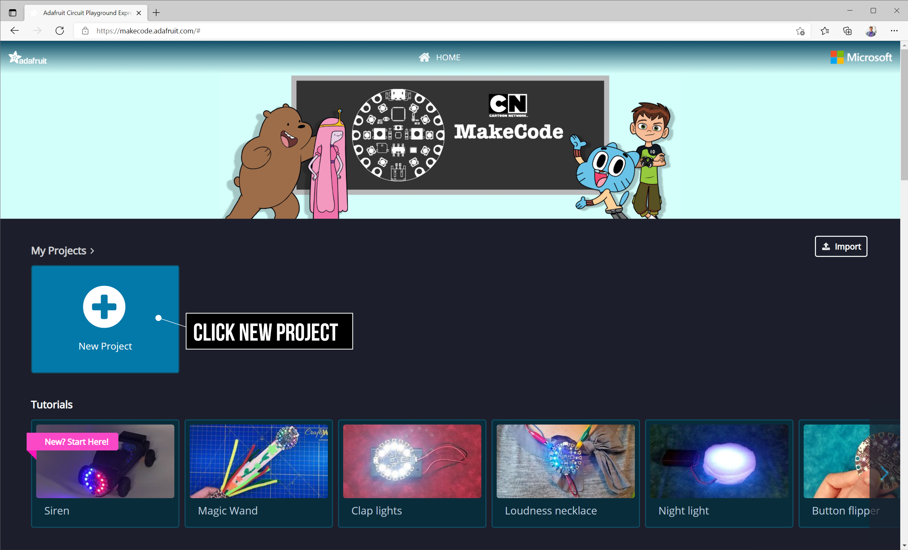
**Figure.** On the [MakeCode website](https://makecode.adafruit.com), click the "New Project" button.
{: .fs-1 }

After clicking, you should see the MakeCode editor interface with a largely empty workspace (see screenshot below). You might observe that MakeCode pre-populates the workspace with a [`forever`](https://makecode.adafruit.com/reference/loops/forever) block, which starts automatically and runs repeatedly in a loop *forever.*

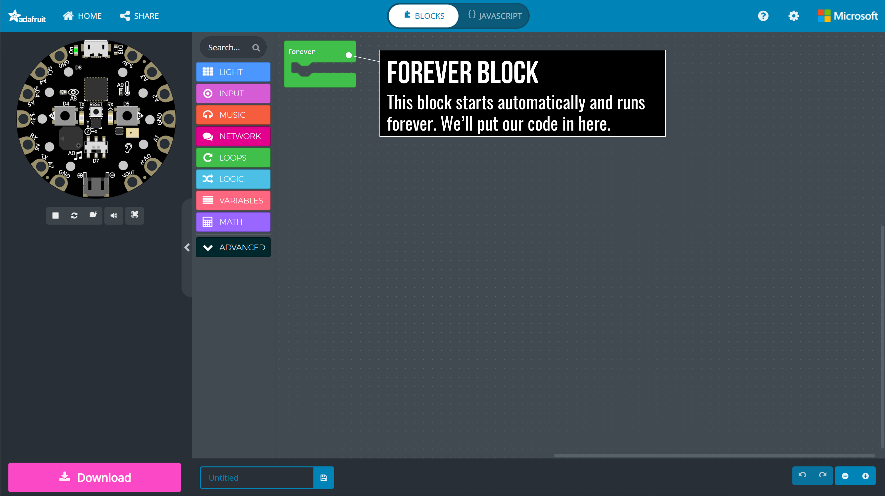
**Figure.** The [`forever`](https://makecode.adafruit.com/reference/loops/forever) block starts automatically and runs repeatedly in a loop *forever.* Remember, you can always right click on these images and select "Open image in new tab" to see larger versions.
{: .fs-1 }

For Blinky, we'll put our program inside this [`forever`](https://makecode.adafruit.com/reference/loops/forever) block; however, it's not always needed (as we'll see in future lessons).

### Step 2: Add in a light block

Now let's add our first block: a [`LIGHT`](https://makecode.adafruit.com/reference/light) block to turn on the lights—that is, the 10 NeoPixels. There are lots of different [`LIGHT`](https://makecode.adafruit.com/reference/light) block possibilities but, for now, let's use the [`set all pixels to`](https://makecode.adafruit.com/reference/light/set-all) block, which will set all 10 NeoPixels to the same color.

From the [`LIGHT`](https://makecode.adafruit.com/reference/light) menu inside the toolbox, drag-and-drop the [`set all pixels to`](https://makecode.adafruit.com/reference/light/set-all) block to the workspace. 

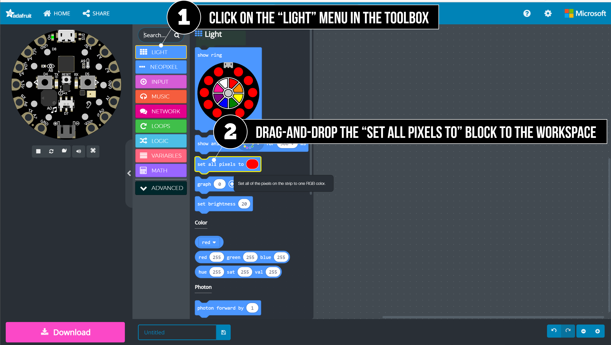
**Figure.** Drag-and-drop the [`set all pixels to`](https://makecode.adafruit.com/reference/light/set-all) block from the [`LIGHT`](https://makecode.adafruit.com/reference/light) menu.
{: .fs-1 }

Place the [`set all pixels to`](https://makecode.adafruit.com/reference/light/set-all) block inside the [`forever`](https://makecode.adafruit.com/reference/loops/forever) block in the workspace. Your program should now look like this:

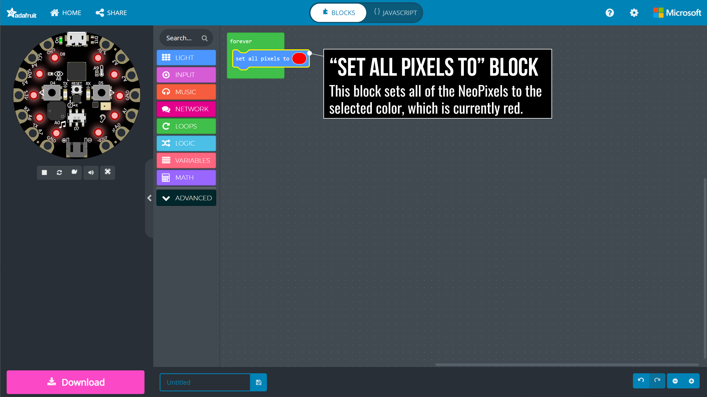
**Figure.** The [`set all pixels to`](https://makecode.adafruit.com/reference/light/set-all) block sets all 10 CPX lights (the NeoPixels) to the same color. In this case, we'll set them to red.
{: .fs-1 }

Notice too how the NeoPixels are now glowing red in the simulator—neat!

### Step 3: Add in a pause block

To make the light **blink**, we need to add in a [`pause`](https://makecode.adafruit.com/reference/loops/pause) block, which is somewhat hidden away in the [`LOOPS`](https://makecode.adafruit.com/blocks/loops) toolbox menu. Click on the [`LOOPS`](https://makecode.adafruit.com/blocks/loops) menu button and drag-and-drop the [`pause`](https://makecode.adafruit.com/reference/loops/pause) block to the workspace.

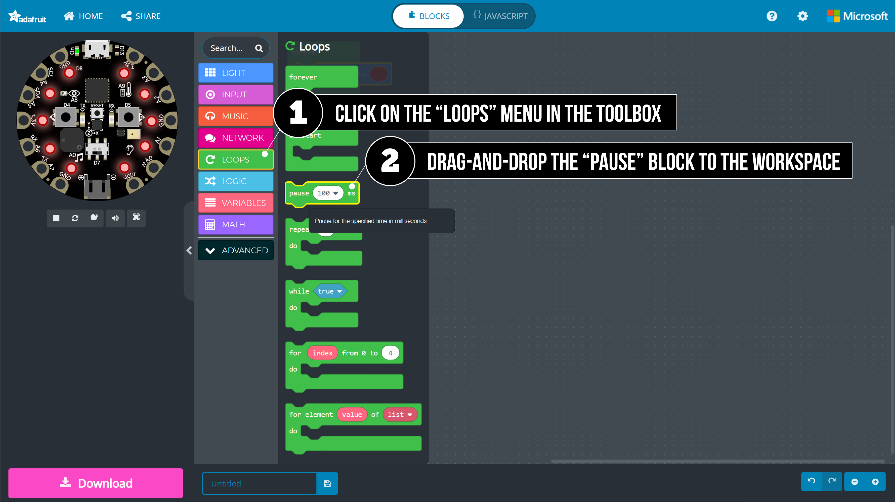
**Figure.** Drag-and-drop the [`pause`](https://makecode.adafruit.com/reference/loops/pause) block from the [`LOOPS`](https://makecode.adafruit.com/blocks/loops) toolbox menu.
{: .fs-1 }

Let's set the red light to stay on for half-a-second (500 milliseconds) before moving on to the next puzzle piece.

**Figure.** The [`pause`](https://makecode.adafruit.com/reference/loops/pause) block pauses your program for a specified time. In this case, let's set it to half-a-second (500ms) so that the red light is shown for 500ms.
{: .fs-1 }

### Step 4: Turn off light

Finally, to complete the blinking effect, we need to turn off the lights. Again, we can use the [`set all pixels to`](https://makecode.adafruit.com/reference/light/set-all) block.

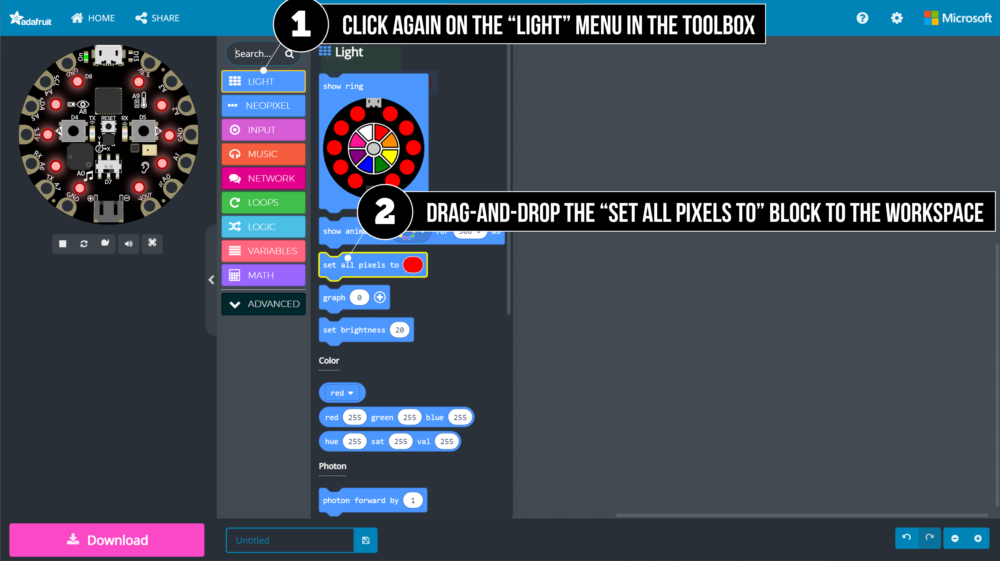
**Figure.** To turn off the light, we need another light block. Drag-and-drop a second [`set all pixels to`](https://makecode.adafruit.com/reference/light/set-all) block from the [`LIGHT`](https://makecode.adafruit.com/reference/light) menu.
{: .fs-1 }

This time we will set the light color to black. In MakeCode, setting lights to black is equivalent to turning them off. You could choose a different color, if you'd like.

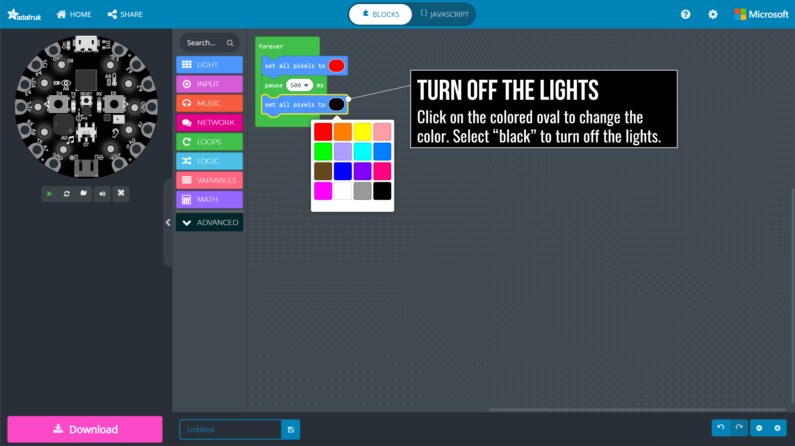
**Figure.** To change the light colors in the [`set all pixels to`](https://makecode.adafruit.com/reference/light/set-all) block, click on the colored oval and select a color from the pop-up menu.
{: .fs-1 }

### Step 5: Add final pause block
As before, we also need to add in a [`pause`](https://makecode.adafruit.com/reference/loops/pause) block, which will control how long the lights are off before looping back to the beginning of our program.

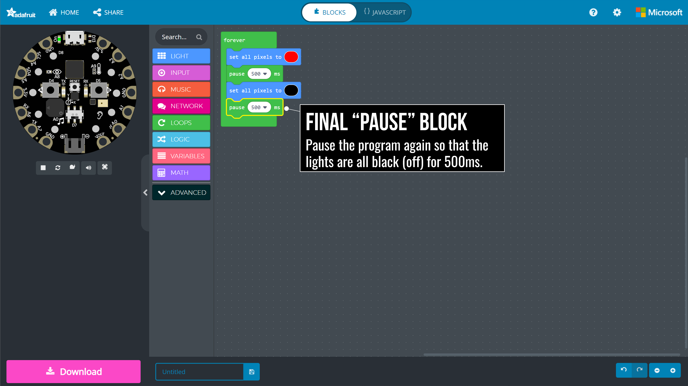
**Figure.** Drag-and-drop the [`pause`](https://makecode.adafruit.com/reference/loops/pause) block from the [`LOOPS`](https://makecode.adafruit.com/blocks/loops) toolbox menu.
{: .fs-1 }

Our final program should look like this. Because our code sits within a [`forever`](https://makecode.adafruit.com/reference/loops/forever) block, it will loop forever thereby creating a neverending on-off flashing of red lights.

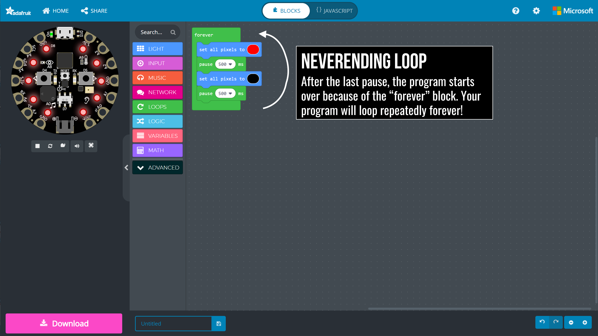
**Figure.** Because our code sits within a [`forever`](https://makecode.adafruit.com/reference/loops/forever) block, it will loop forever thereby creating a neverending on-off flashing of red lights.
{: .fs-1 }

### Video of building Blinky

Here's a full walkthrough video of building Blinky from start-to-finish in MakeCode in only 30 seconds. This really demonstrates how quickly we can prototype electronic behaviors with MakeCode+CPX.

<video autoplay loop muted playsinline style="margin:0px">
  <source src="assets/videos/Making_Blinky_MakeCode_ScreenRecording.mp4" type="video/mp4" />
</video>
**Video.** A full walkthrough video of building Blinky from start-to-finish in only 30 seconds. Feel free to pause the video or open it in a new tab for full screen (right click on the video and select "Open video in new tab").
{: .fs-1 }

## Adding sound to Blinky

Before downloading Blinky on to the physical CPX board, let's make one more addition: a "startup" sound, which plays when the CPX is first turned on (or reset).

<video autoplay loop muted playsinline style="margin:0px">
  <source src="assets/videos/Making_BlinkyWithPowerUp_ScreenRecording.mp4" type="video/mp4" />
</video>
**Video.** Adding a "startup" sound to Blinky. Now, when Blinky is turned on, it will play a sound.
{: .fs-1 }

### Step 1: Add "on start" block

In addition to the [`forever`](https://makecode.adafruit.com/reference/loops/forever) block, which runs repeatedly, MakeCode also has an [`on start`](https://makecode.adafruit.com/blocks/on-start) block that runs when the program first starts. This is a perfect place to put "startup sound" code!

Open the [`LOOPS`](https://makecode.adafruit.com/blocks/loops) toolbox menu and drag-and-drop the [`on start`](https://makecode.adafruit.com/blocks/on-start) block into your workspace.

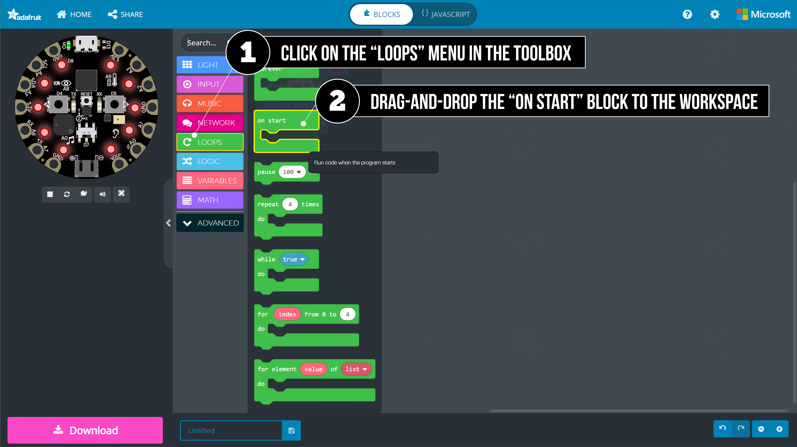
**Figure.** Drag-and-drop the [`on start`](https://makecode.adafruit.com/blocks/on-start) block from the [`LOOPS`](https://makecode.adafruit.com/blocks/loops) toolbox menu.
{: .fs-1 }

Now your Blinky program should look like this. I've arbitrarily placed the [`on start`](https://makecode.adafruit.com/blocks/on-start) block next to the [`forever`](https://makecode.adafruit.com/blocks/on-start) block—you can put it wherever you want. Regardless of its position in the editor, the [`on start`](https://makecode.adafruit.com/blocks/on-start) block will always run before the [`forever`](https://makecode.adafruit.com/blocks/on-start) block.

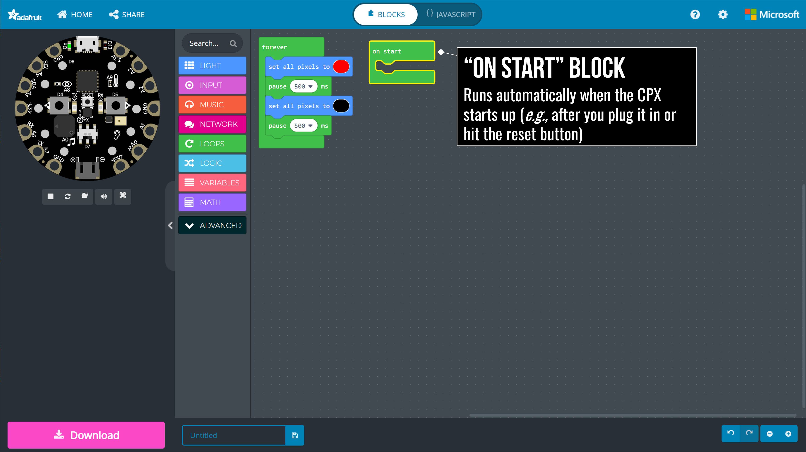
**Figure.** The [`on start`](https://makecode.adafruit.com/blocks/on-start) block runs automatically when the program first starts.
{: .fs-1 }

### Step 2: Adding sound

Thus far, we have only programmed one type of output, [light](https://makecode.adafruit.com/reference/light), but there is also sound! For sound, we can use the [`MUSIC`](https://makecode.adafruit.com/reference/music) toolbox menu.

Let's use the [`play sound`](https://makecode.adafruit.com/reference/music/play-sound) block, which plays a preprogrammed sound like "power up" or "jump up" (these sounds may be familiar to you as some come from Super Mario!).

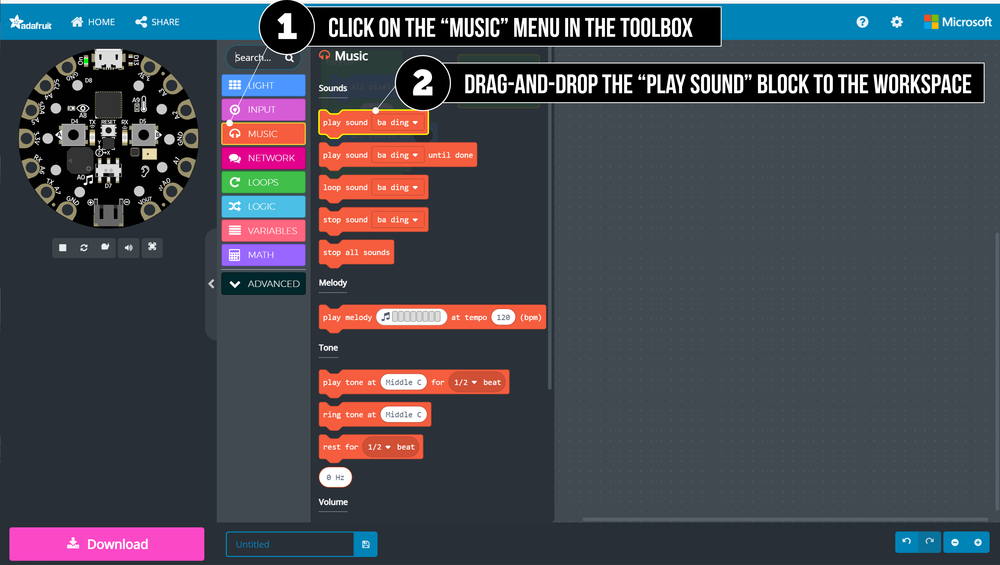
**Figure.** Drag-and-drop the [`play sound`](https://makecode.adafruit.com/reference/music/play-sound) block from the [`MUSIC`](https://makecode.adafruit.com/reference/music) toolbox menu.
{: .fs-1 }

You are welcome to select any sound option. We're going to use "power up." As soon as you add this block, you should hear the sound play in the simulator (assuming your sound is on and you have speakers/headphones).

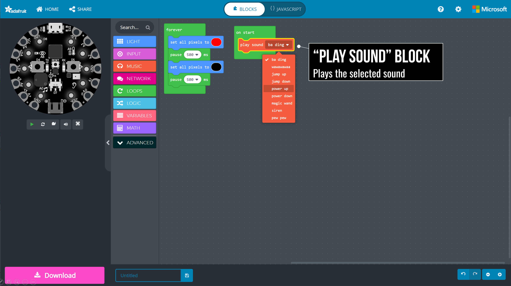
**Figure.** The [`play sound`](https://makecode.adafruit.com/reference/music/play-sound) block plays the selected sound.
{: .fs-1 }

### Step 3: The final program

You did it! The final program should look like this:

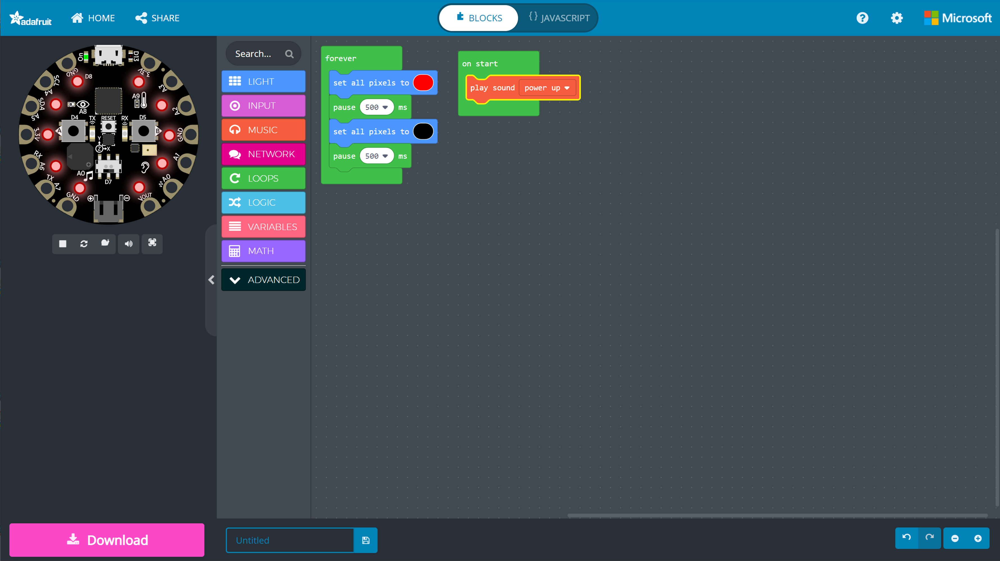
**Figure.** The final ["Blinky with Sound" program](https://makecode.com/_2iL2xkVKa7Dh) in MakeCode. You can edit and play with our code [here](https://makecode.com/_2iL2xkVKa7Dh)—we changed the color from red to blue. 
{: .fs-1 }

## Transferring our program to the CPX

Thus far, we've used the simulator to test and run Blinky. But the true power and fun of physical computing and the CPX is working with *physical materials.* So, we need to transfer Blinky from your laptop to the CPX. 

<!-- Once the CPX is programmed, you can detach it from your computer and power it from a battery. Your MakeCode program "lives" inside the CPX! -->

There are two ways of transferring MakeCode programs to CPX: 

1. **Manual download.** By manually downloading the program and copying it over to the CPX (as if the CPX is a USB thumb drive). 
2. **Direct download.** By using an experimental WebUSB feature to directly download your program to the CPX. When it works, this feels very seamless. However, because this feature is experimental, it is a bit inconsistent—which can lead to frustration.

We'll cover both below. We recommend at least trying the "direct download" approach and falling back on manual download when it doesn't work.

### Manual download

<video autoplay loop muted playsinline style="margin:0px">
  <source src="assets/videos/CopyingProgramToCPXFromMac_NoSound.mp4" type="video/mp4" />
</video>
**Video.** Downloading a MakeCode program and transferring it to the CPX using a Mac.
{: .fs-1 }

Manually downloading your MakeCode program to the CPX is a 4-step process:

1. **Download.** Click on the pink 'Download' button, which will download a `.uf2` file to your downloads folder; 
2. **Plug in CPX.** Plug in your CPX to your laptop/computer using a USB micro cable. 
3. **Put CPX into programmable state.** Click the 'Reset' button on the CPX. The CPX should glow green and mount a new "thumb drive" folder called CPLAYBOOT; 
4. **Move .uf2 file onto CPLAYBOOT** Drag-and-drop the downloaded `.uf2` file onto CPLAYBOOT. When the file finishes copying, the CPX will auto-reset and begin running your program—which will also disconnect the CPX from your laptop/computer.

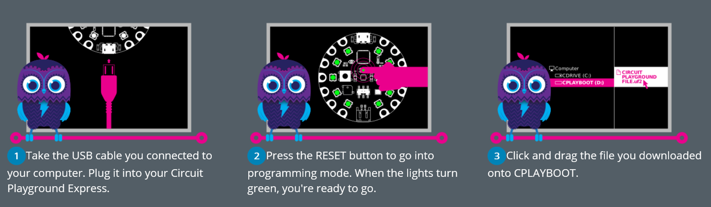

**Figure.** After you click the pink 'Download' button in MakeCode, the MakeCode interface shows this three-stage prompt for transferring the downloaded `.uf2` file to the CPX.
{: .fs-1 }

We will show you how to do this for both Windows and Mac.

#### Manual download with Mac

<video playsinline controls style="margin:0px">
  <source src="assets/videos/CopyingProgramToCPXFromMac.mp4" type="video/mp4" />
</video>
**Video.** Downloading a MakeCode program and transferring it to the CPX using a Mac.
{: .fs-1 }

#### Manual download with Windows

<iframe width="736" height="414" src="https://www.youtube.com/embed/Y_jkUylGe4E" title="YouTube video player" frameborder="0" allow="accelerometer; autoplay; clipboard-write; encrypted-media; gyroscope; picture-in-picture" allowfullscreen></iframe>

**Video.** Manually downloading and transferring your MakeCode program onto the CPX using Windows ([YouTube link](https://youtu.be/Y_jkUylGe4E))
{: .fs-1 }

### Direct download using WebUSB

In this video, we walk you through how to directly download your MakeCode program onto the CPX using WebUSB. This is a far more ideal and seamless way to program the MakeCode but doesn't always work reliably. You must use either Chrome or Microsoft Edge web browsers and should work for either Mac or Windows.

<iframe width="736" height="414" src="https://www.youtube.com/embed/7FjYEJhVeLY" title="YouTube video player" frameborder="0" allow="accelerometer; autoplay; clipboard-write; encrypted-media; gyroscope; picture-in-picture" allowfullscreen></iframe>

**Video.** Directly downloading your MakeCode program to the CPX using WebUSB ([YouTube link](https://youtu.be/7FjYEJhVeLY))
{: .fs-1 }

## Next Lesson

In the [next lesson](todo.md), we'll TODO.

[Previous: Intro the CPX](cpx.md){: .btn .btn-outline }
[Next: TODO](todo.md){: .btn .btn-outline }

<!-- TODO:
- Add in saving and sharing projects 
- Add in design challenge about using more lights? Show holiday light example from kids
- Add in notion that once you download your program, it runs on the CPX
- -->
