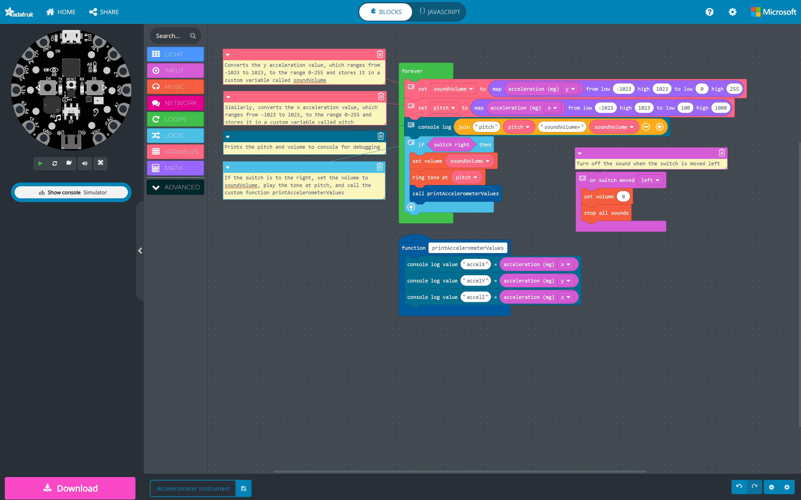
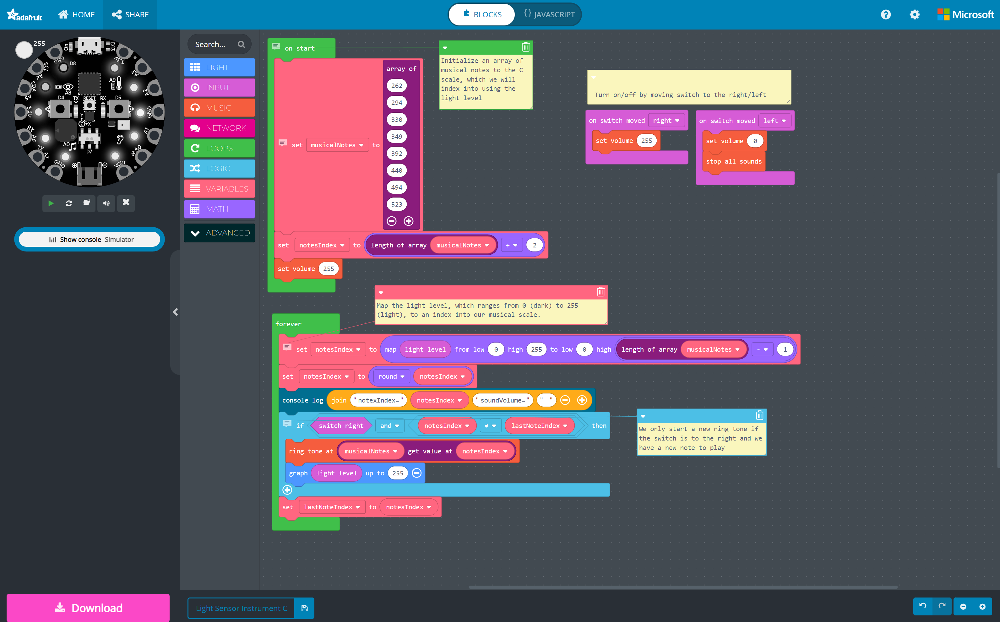

# {{ page.title | replace_first:'L','Lesson '}}
{: .no_toc }

## Table of Contents
{: .no_toc .text-delta }

1. TOC
{:toc}
---

In this lesson, we will build on our last lesson—the [Button Piano](button-piano.md)—to make an interactive instrument that translates light levels into sound and light. It won't sound great but it will sound fun!

<!-- TODO consider adding in a lil video of a theremin? -->

## Video Tutorial

  <iframe width="100%" src="https://www.youtube.com/embed/RlEPQqyQGEk" title="YouTube video player" frameborder="0" allow="accelerometer; autoplay; clipboard-write; encrypted-media; gyroscope; picture-in-picture; web-share" allowfullscreen></iframe>

**Video.** Creating a light sensor instrument. Here's [the full code](https://makecode.com/_drYKXH5UeV1r) and a [link to the video on YouTube](https://youtu.be/RlEPQqyQGEk).
{: .fs-1 }

## Code

Here's the final [code](https://makecode.com/_2dVi02gquH6h). Right-click on the code below and select "Open link in a new tab" to open it in the MakeCode editor.

<iframe style="position:absolute;top:0;left:0;width:100%;height:100%;" src="https://makecode.adafruit.com/---codeembed#pub:_2dVi02gquH6h" allowfullscreen="allowfullscreen" frameborder="0" sandbox="allow-scripts allow-same-origin"></iframe>

<!-- 
<iframe style="position:absolute;top:0;left:0;width:100%;height:100%;" src="https://makecode.adafruit.com/#pub:_K9Xddy0gk1hY" frameborder="0" sandbox="allow-popups allow-forms allow-scripts allow-same-origin"></iframe>

<iframe style="position:absolute;top:0;left:0;width:100%;height:100%;" src="https://makecode.adafruit.com/---run?id=_K9Xddy0gk1hY" allowfullscreen="allowfullscreen" sandbox="allow-popups allow-forms allow-scripts allow-same-origin" frameborder="0"></iframe>
 -->

## Blocks

We use the following blocks in this example. See the [Adafruit MakeCode Reference](https://makecode.adafruit.com/reference) guide.

### Output

For output, we used **[Light](https://makecode.adafruit.com/reference/light)**, **[Music](https://makecode.adafruit.com/reference/music)**, and **[Console](https://makecode.adafruit.com/reference/console)** blocks, particularly:

- **[graph](https://makecode.adafruit.com/reference/light/graph)** makes the on-board NeoPixels into a real-time "bar graph"
- **[ring tone](https://makecode.adafruit.com/reference/music/ring-tone)** plays a tone at a given frequency
- **[set volume](https://makecode.adafruit.com/reference/music/set-volume)** sets the volume of the output speaker
- **[stop all sounds](https://makecode.adafruit.com/reference/music/stop-all-sounds)** stops all sounds from playing
- **[console log](https://makecode.adafruit.com/reference/console)** writes a line of text to the console output

### Input

For **[Input blocks](https://makecode.adafruit.com/reference/input)**, we used:

- **[light level](https://makecode.adafruit.com/reference/input/light-level)** measures light level between 0 (dark) and 255 (light)
- **switch right** is true if the switch is to the right; however, I could not find documentation for this block

### Logic

We also used one [Logic block](https://makecode.adafruit.com/blocks/logic) to check to see if the switch was to the right and, if it was, to play the sound. Otherwise, to stop all sounds.

- **[if](https://makecode.adafruit.com/blocks/logic)** runs code depending on whether a statement is true

### Event

To ensure that our volume is properly set, we initialize it to 255 (the highest value) when the program first starts using the [on start](https://makecode.adafruit.com/blocks/on-start) block

- **[on start](https://makecode.adafruit.com/blocks/on-start)** runs once and only once when the program starts

## Design Activity

{: .note }
The examples we include here are intentionally more complicated to help demonstrate the power and potential of MakeCode with the CPX. It's OK if you don't understand something. We'll get there!

How might you use the other built-in sensors to create music? Try playing with [**acceleration** (motion)](https://makecode.adafruit.com/reference/input/acceleration), [**sound level**](https://makecode.adafruit.com/reference/input/sound-level), and [**temperature**](https://makecode.adafruit.com/reference/input/temperature). For example, we've created an [example accelerometer-based instrument](https://makecode.com/_fbsJcbKMgJxv) that changes the pitch and volume based on the y and x acceleration, respectively. You need not create something so complicated but do try to experiment with different sensors!

**Figure.** An accelerometer-based instrument that changes the pitch and volume based on the y and x acceleration, respectively. Here's [the full code](https://makecode.com/_fbsJcbKMgJxv).
{: .fs-1 }

Relatedly, how might you improve *how* the music sounds? In the [example below](https://makecode.com/_49zec62PC6eJ), we map the light level to notes in the C scale using a predefined array of frequencies (each frequency maps to a musical note in the C scale, which is indexed based on the light level).

**Figure.** A more advanced light sensor instrument that translates the raw light levels to notes in the C scale. Here's [the full code](https://makecode.com/_49zec62PC6eJ).
{: .fs-1 }

Similarly, [here's a version](https://makecode.com/_RCK2f5KhHLby) that maps the x component of the accelerometer to notes in the C musical scale.

<!-- 
<iframe style="position:absolute;top:0;left:0;width:100%;height:100%;" src="https://makecode.adafruit.com/---codeembed#pub:_bb6Musb9aVex" allowfullscreen="allowfullscreen" frameborder="0" sandbox="allow-scripts allow-same-origin"></iframe>
 -->

## Next Lesson

In the [next lesson](capacitive-touch), we'll introduce a multi-part series on using capacitive sensing to interact with everyday objects and more!

[Previous: Button Piano](button-piano.md){: .btn .btn-outline }
[Next: Capacitive Sensing](capacitive-touch.md){: .btn .btn-outline }
