# {{ page.title | replace_first:'L','Lesson '}}
{: .no_toc }

## Table of Contents
{: .no_toc .text-delta }

1. TOC
{:toc}
---

Breadboards allow us to prototype physical computing circuits quickly and efficiently. They have standardized holes, which allow integrated circuits and other components, to tightly sit in the board. You use "jumper wires" to connect placed components. These so-called "solderless breadboards" or just "breadboards" for short, dramatically simplify prototyping circuits. In the past, you would have to painfully wrap wires around mounted conductive poles or screws. 

**Figure** The left image is from an Instructable on "[Using a Real Breadboard for Prototyping Your Circuit](https://www.instructables.com/Use-a-real-Bread-Board-for-prototyping-your-circui/)" and the center image is originally from Wikipedia (user Wikinaut); however, both images were found on Sparkfun.com's [breadboard tutorial](https://learn.sparkfun.com/tutorials/how-to-use-a-breadboard).
{: .fs-1 }

That said, breadboards are a bit obscure at first and do take time to get used to and understand. In this lesson, we'll learn about breadboards, prototype with them in the simulation environment called [Tinkercad Circuits]((https://www.tinkercad.com/)), and build some simple circuits with resistors and LEDs.

## Inside a breadboard

If you tore open a breadboard, you would see a set of *pre-wired* columns and rows (internal metal strips). These pre-wired connections are exposed as holes on the top of the breadboard (looks like a grid), which you can quickly and easily tap into to make circuits. 

Unfortunately, it is not immediately clear *which* holes are pre-wired to one another—which introduces a lot of confusion and miswirings for novices. So, it's important that you study and understand these breadboarding images (and also be patient with yourself as you're learning—a very common and frustrating mistake for beginners is an 'off-by-one' error or by misunderstanding how the embedded wiring in a breadboard works).

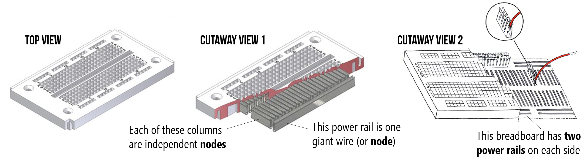
**Figure** Images originally from [here](https://slideplayer.com/slide/7059660/) and [here](http://www.captaincredible.com/abc/?page_id=92). Annotations in PowerPoint.
{: .fs-1 }

In the image below, we've highlighted *where* the pre-wired connections (those internal metal strips) exist. You can think of each of these lines as individual nodes. Just like the breadboards in your kit, this breadboard has two power rails on each side, individual columns for placing components, and a ravine (in the middle) that separates the columns on each side of the board.

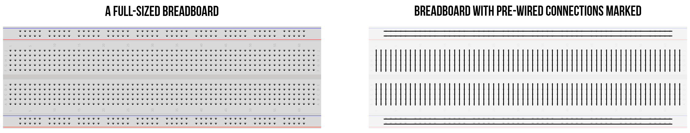
**Figure** Breadboard image from [Fritzing](https://fritzing.org/). Annotations in PowerPoint.
{: .fs-1 }

## Examples

Let's breadboard an LED-based circuit with a 9V power supply, a resistor, and a red LED. We're going to build one variation step-by-step and then show other possibilities. 

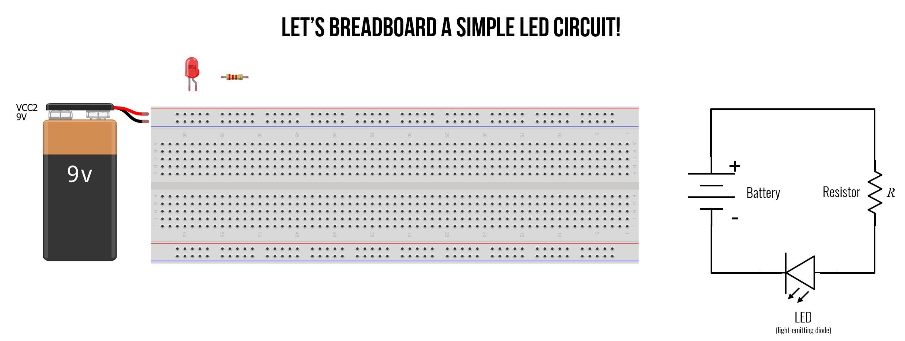

With breadboards, there are nearly infinite ways to build the same circuit. So, try to keep things clean and minimize the use of extraneous wires whenever possible. As we walk through this example and then show variations, check your understanding: what makes sense to you? Which breadboard variation is "cleanest" in your opinion and why?

### Building variation 1

So, let's build our first breadboard circuit. In this version, we're trying to keep things very clear. Consequently, we're using more jumper wires than necessary. Let's get started.

#### Step 1: Connect the voltage source

First, let's connect the positive and negative terminals of the battery to the power rails. Notice how with just making two connections, we create two giant nodes (red for positive `+` and black for `-`). These two nodes are now easily tappable as we build out our circuit.

Typically, we would not connect the power rails to our voltage source until we're ready to test something (it's not good practice to breadboard with a live source!). But, for educational purposes, it's helpful to first start here and build the circuit outwards.

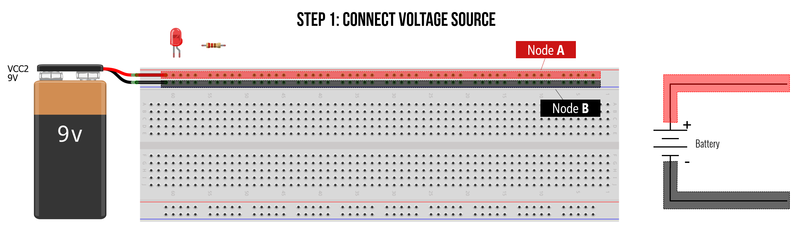

#### Step 2: Add the resistor

Second, let's add in the resistor connecting one leg directly to the positive `+` power rail and the other to an arbitrary column on our breadboard. Notice how even though the bottom resistor leg is in just one hole, that entire column becomes the same node (Node C). Also note how Node C does not extend across the ravine in the middle of the board.

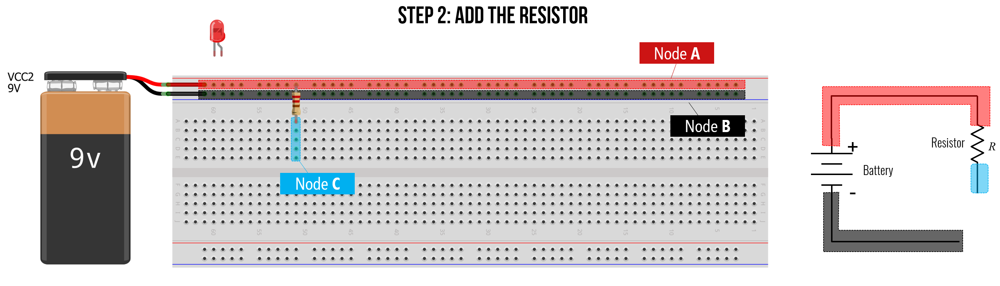

#### Step 3: Add the LED

Third, let's add in the LED. We can place it anywhere we want but let's put it close to the resistor (since we know we'll have to connect them). Moreover, we cannot put the LED in such that both legs are in the same column. This wouldn't make sense.

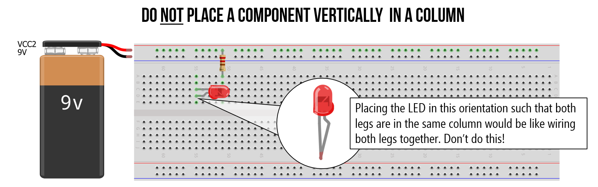

Instead, place the LED such that the legs span two columns, like this. Notably, the LED is not yet connected to anything in our circuit. It's just sort of floating there in its own space. We'll hook it up next.

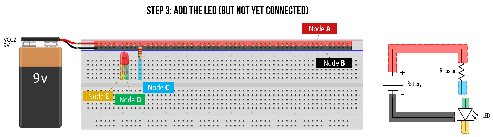

#### Step 4: Connect LED anode (+) leg

Now, let's wire up the LED to our circuit starting with the LED anode (`+`) leg first (which must point towards the positive electric potential).

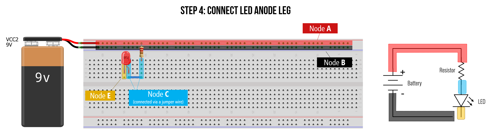

#### Step 5: Connect LED cathode (-) leg

Fifth, let's start to wire up the LED cathode leg. In this case, we'll create an intermediate wire connection to a different point of our breadboard just to keep things clean. However, we could just place a jumper wire from the cathode leg directly to the `GND` (`-`) power rail.

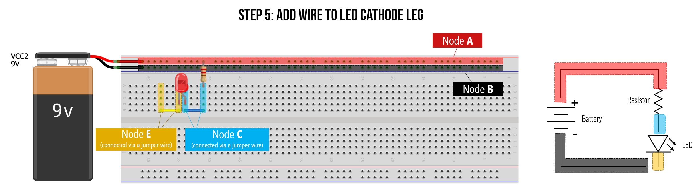

#### Step 6: Connect LED cathode (-) to ground

Finally, we can connect the LED cathode node to ground thereby completing our circuit. Yay!

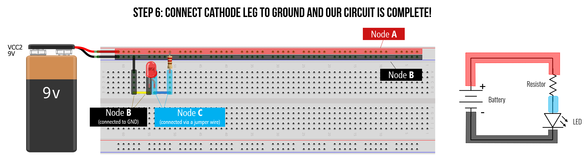

Does this breadboarded circuit make sense? Can you picture how current would flow through the breadboard?

#### Visualizing current through breadboard

To further reinforce how a breadboard works, we've drawn two additional representations. The middle image below shows a schematic overlay on top of the breadboard. The image on the right shows overlaid arrows showing the path of conventional current. Is this what you visualized too? Why or why not?

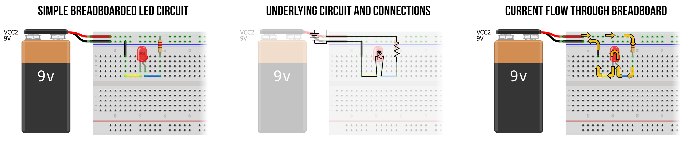
**Figure** Made in [Fritzing](https://fritzing.org/) and PowerPoint.
{: .fs-1 }

### Variation 2
Here's another version of the same circuit but breadboarded differently. Again, with breadboards, part of what makes them powerful is their flexibility but this also introduces many possibilities for breadboarding the same circuit (and this is just for one simple example!).

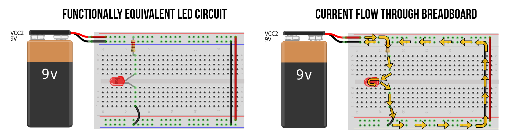

### Variation 3
Again, the same circuit but breadboarded differently. This version uses no jumper wires and simple connects the resistor and LED directly to the power rails.

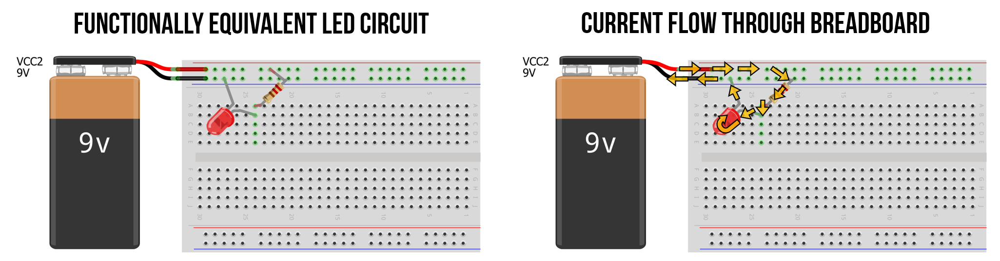

## Some breadboard tips

### Tip 1: Use power rails

### Tip 2: Link power rails across board

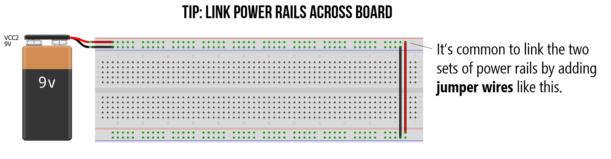

### Tip 3: Use wire colors to convey meaning

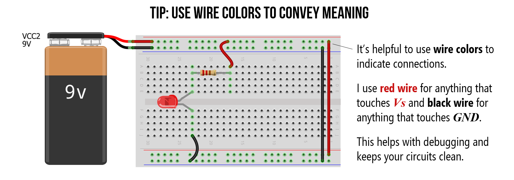

## Video tutorial

If you're still feeling lost, we highly recommend this breadboard tutorial video by *Science Buddies*. 

<iframe width="736" height="414" src="https://www.youtube.com/embed/6WReFkfrUIk" title="YouTube video player" frameborder="0" allow="accelerometer; autoplay; clipboard-write; encrypted-media; gyroscope; picture-in-picture" allowfullscreen></iframe>

**Video** This video tutorial ["How to use a breadboard"](https://youtu.be/6WReFkfrUIk) by Science Buddies offers a great introduction to breadboards. 
{: .fs-1 }

## Breadboard voltage and current specifications

Generally, breadboards are designed to work with digital circuits (0-5V) and low amperages (0-1A). The breadboards we purchase for our courses ([link](https://www.amazon.com/Breadboards-Solderless-Breadboard-Distribution-Connecting/dp/B07DL13RZH/ref=sxin_2_ac_d_rm?ac_md=2-2-YnJlYWRib2FyZA%3D%3D-ac_d_rm&cv_ct_cx=perf+board&keywords=perf+board&pd_rd_i=B07DL13RZH&pd_rd_r=a9be70ad-f0e7-4956-b683-f1266bde56b4&pd_rd_w=mD02O&pd_rd_wg=faDF0&pf_rd_p=de19e82a-2d83-4ae8-9f5c-212586b8b9a0&pf_rd_r=H52F2FG970MN56W91230&psc=1&qid=1583787088)) specify a "300V/3-5A" rating. I'm highly incredulous. If you need to prototype a circuit with ~12V and greater than 500mA - 1A, it's better to use a [perfboard](https://learn.adafruit.com/collins-lab-breadboards-and-perfboards/learn-more) and a soldering iron. 

## Limitations

Breadboards have a number of limitations. First, their connections can wear over time (as you push in and pull out components) leading to unreliable contact points. Second, the internal metal clips and contact points add resistance and capacitance. I've seen estimates of about 0.1Ω and a stray capacitance of 2-20 picofarads (pFs) per connection ([link](https://www.circuitspecialists.com/blog/common-breadboard-specifications/), [link](https://www.baldengineer.com/electronics-introduction-to-breadboards.html)). Finally, due to these factors, high-frequency digital circuits—that switch on/off voltages at ~16 Mhz and beyond—won't work as well.

In physical computing, however, breadboards are often the perfect rapid prototyping board.

## Experimenting with breadboards in Tinkercad

To learn more about breadboards and gain experience with them before physically making, let's use [Tinkercad Circuits](https://www.tinkercad.com/) to play around. Tinkercad makes it easy to rapidly prototype, build, and simulate circuits in a software environment. And, for those that do not have access to electronic tools, Tinkercad also provides a simple multimeter and oscilloscope—so we can test and measure our circuits too!

For learning about breadboards, particularly, Tinkercad auto-highlights selected nodes when you mouse over breadboard columns and rows, so it builds up understanding before using a physical breadboard.

### Step 1: Open Tinkercad Circuits

Visit [tinkercad.com](https://www.tinkercad.com/) and login (if you already have an Autodesk account) or register if not. We are not using any of the "In School" features, so create a personal account:

### Step 2: Create a new circuit

In your dashboard, click on "Circuits":

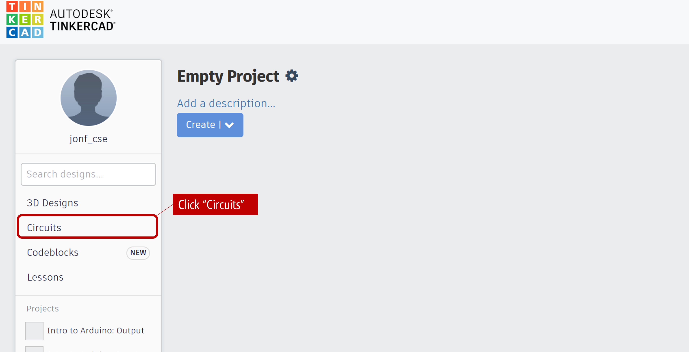

Then click on "Create new Circuit":

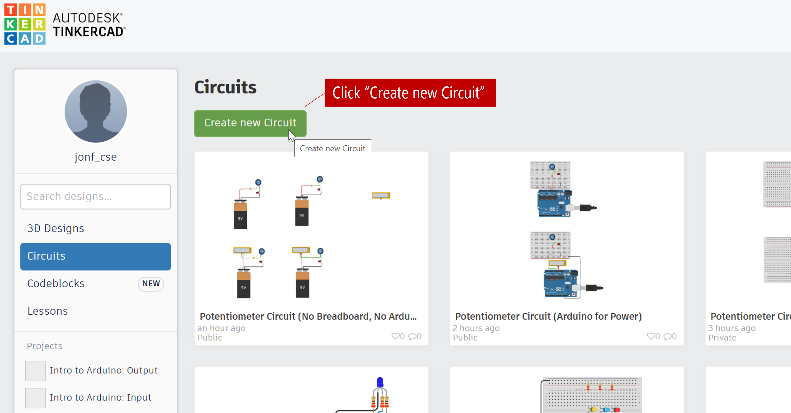

### Step 3: Aquaint yourself with Tinkercad

Tinkercad works by dragging and dropping components from the right sidebar menu onto the Circuit canvas. You can click on the "Start Simulation" button to simulate circuits (in later lessons, we'll show how you can even simulate circuits with and write code for Arduino in the Tinkercad environment). 

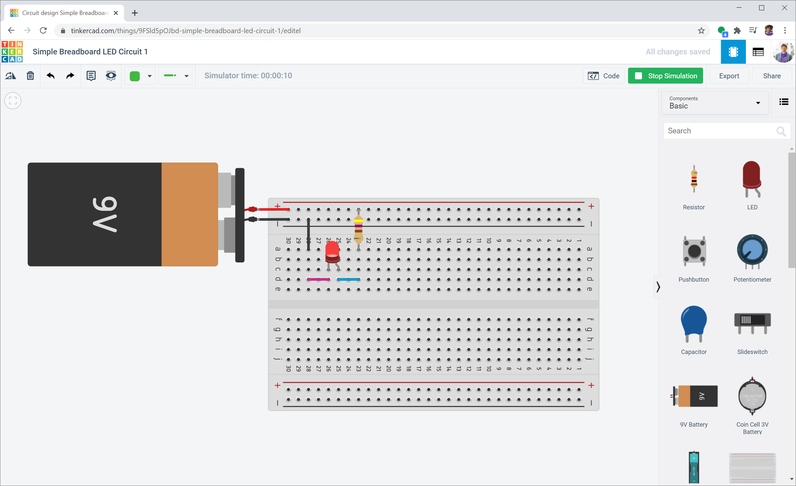

### Step 4: You can even embed created circuits onto webpages

Tinkercad also has a cool feature to embed working versions of your circuits onto your webpages. Here's a simple LED circuit with a 9V battery supply, a 470Ω resistor, and an LED. You can open [this circuit up](https://www.tinkercad.com/things/9FSld5pOJbd) in Tinkercad yourself and start to remix it as well! 

<iframe width="725" height="453" src="https://www.tinkercad.com/embed/9FSld5pOJbd?editbtn=1" frameborder="0" marginwidth="0" marginheight="0" scrolling="no"></iframe>

**Embedded Circuit**. We've embedded a simple LED circuit made in [Tinkercad](https://www.tinkercad.com/things/9FSld5pOJbd). You can open it up [here](https://www.tinkercad.com/things/9FSld5pOJbd) and play with it and/or build on it.
{: .fs-1 }

## Activity

For your prototyping journals, come up with three LED-based circuits and build them in Tinkercad circuits—each circuit can either be a minor or major variation. The goal of this activity is to get comfortable with breadboards. Play around. What do you observe? Take screenshots, provide a brief description, and include a link to your Tinkercad circuit in your prototyping journal.

Then, select your two favorite ideas and actually build them using the components in your hardware kits (*e.g.,* breadboard, 9V battery, resistors, LEDs). Using manual calculations for current draw, estimate how long your circuit will last on a 9V battery—assume 500 mAh at a 25mA discharge rate and ~400mAh at a 50mA discharge rate down to 4.8 volts ([9V Energizer Datasheet](https://data.energizer.com/PDFs/522.pdf)).

Note that you'll need to use the alligator clips on the 9V battery to supply power your breadboard rails. I suggest using the black alligator clip for the battery's negative terminal, the red alligator clip for the battery's positive terminal, and matching jumper wires to connect to your breadboard.

<!-- https://www.baldengineer.com/9v-batteries-suck.html -->

<!-- https://www.baldengineer.com/electronics-introduction-to-breadboards.html -->

## Resources

- [Setting Up a Breadboard](https://itp.nyu.edu/physcomp/labs/labs-electronics/breadboard/), NYU ITP

- [How to use a breadboard](https://youtu.be/6WReFkfrUIk), Science Buddies video

- [How to Use a Breadboard](https://learn.sparkfun.com/tutorials/how-to-use-a-breadboard), Sparkfun.com

## Next Lesson

In the [next lesson](variable-resistors), we will learn more about **variable resistors** and how to use them.

[Previous: LEDs](leds.md){: .btn .btn-outline }
[Next: Variable Resistors](variable-resistors.md){: .btn .btn-outline }

