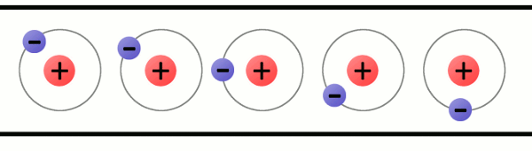

# {{ page.title | replace_first:'L','Lesson '}}
{: .no_toc }

## Table of Contents
{: .no_toc .text-delta }

1. TOC
{:toc}
---

In this lesson, we are going to learn about three key electricity concepts, *current*, *voltage*, and *resistance*, which form the foundation of electronics and circuits. We will also use an online circuit simulator to play with basic components and advanced understanding.

<!-- TODO: Include a nice overview animation? [here](https://kaiserscience.wordpress.com/physics/electromagnetism/electric-current/) -->

---
**NOTE**

This material is important. Depending on your previous background in physics or engineering, some of these concepts may be brand new and confusing. Take your time to understand (and re-read) sections—this material will help you comprehend *how* circuits work and *how* and *why* we hook up and use electronic components the way we do. But this is also *not* a circuits course nor a [physics course](https://youtu.be/x1-SibwIPM4), so I will largely focus on what I *think* is most critical to physical computing.

---

## A brief overview

So, what is voltage, current, and resistance?

In short, **voltage** "pushes" **electrons** through conductive material (*e.g.,* a wire). The amount of **electron flow** is called **current** (measured in amps). Some materials are better at conducting current than others. Resistors are specially formulated to *resist* the flow of electrons (the **resistance** is measured in ohms).

{: .mx-auto .align-center }

**Figure.** A humorous but helpful depiction of the relationship between voltage (measured in volts), current (measured in amps), and resistance (measured in ohms). The yellow "volt" character is trying to push the green "amp" character through a tube (*i.e.,* a wire) but the red "ohm" character is impeding this by restricting the size of the tube (by tightening a rope, reducing its girth). The image source is unknown but there are many examples and alternatives [online](https://www.google.com/search?q=ohm%27s+law+cartoon&tbm=isch&sxsrf=ALeKk01Bq3GWclp6ij6yQ6Kn3yWKh1GXxA%3A1616617564907&source=hp&biw=1280&bih=1248&ei=XKBbYMb0NLXV9APPhL3ABA&oq=ohm%27s+law+cartoon&gs_lcp=CgNpbWcQAzICCAAyAggAOgQIIxAnOgUIABCxAzoGCAAQCBAeUMMBWPoVYNkXaABwAHgAgAHAA4gBrBKSAQk3LjguMC4xLjGYAQCgAQGqAQtnd3Mtd2l6LWltZw&sclient=img&ved=0ahUKEwjGksTd4cnvAhW1Kn0KHU9CD0gQ4dUDCAc&uact=5).
{: .fs-1 }

What are the measurement units for voltage, current, and resistance?

Just like we measure weight in kilograms and temperature in celsius, so too do we have standard units of measurement for current, voltage, and resistance (called [SI units](https://en.wikipedia.org/wiki/International_System_of_Units) for the *International System of Units*). We will use these quantities and measurements a lot in physical computing, so take a moment to study the table below.

| Quantity   | Symbol | Unit of Measurement   | Unit abbreviation |
|------------|--------|-----------------------|-------------------|
| Current    | $$I$$  | Ampere (or Amp)       | A |
| Voltage    | $$V$$  | Volt                  | V |
| Resistance | $$R$$  | Ohm                   | Ω |

### A hydraulic analogy

In circuits, we often use hydraulic analogies to aid understanding. For example, we can think of *voltage* as analogous to *water pressure* in a water plumbing system. An increase in water pressure provides more force to propel water molecules through pipes. Water flows from **high pressure** (intake supply) to **low pressure** (out an open valve). Similarly, an increase in voltage provides more force to "push" electrons from **high** electric potential to **low** electric potential through a circuit. 

Just as a wider water pipe can carry more water, so too can a thicker conductive wire carry more current. Obstructions in the pipe—such as sand or, worse, clay—can slow the flow of water. These obstructions are similar to resistors, which we can insert into circuits to impede the flow of current (resistors are electronic components with less displaceable electrons).

|            | Electric                       | Hydraulic                                |
|------------|--------------------------------|------------------------------------------|
| Flow rate  | Current, *amps (coloumbs/sec)* | Flow rate, *GPM (gallons/minute)*        |
| Potential  | Voltage, *volts*               | Pressure, *psi (pound per square inch)*  |
| Resistance | Resistance, *ohm (volts/amp)*  | Resistance, *psi/gpm*                    |

<video autoplay loop muted playsinline style="margin:0px">
  <source src="assets/videos/WaterCircuitAnalogy_Trimmed_ByJonFroehlich.mp4" type="video/mp4" />
</video>
**Figure.** Here's a slightly different hydraulic analogy than the water plumbing system one described above. Here, we have a water tank filled with water with a hole at the bottom: as the water level increases, the pressure (voltage) on the water at the bottom of the tank also increases, which commensurately increases the amount of water flowing out of the hole. If we increase the hole size (decreasing resistance), more water (current) will flow. Note: the animation direction is showing *conventional current*. The water diagram based on an illustration in [Platt's *Make: Electronics* book](https://learning.oreilly.com/library/view/make-electronics-2nd/9781680450255/).
{: .fs-1 }

Let's dive into each of these concepts more deeply, starting with current.

## What is current?

**Figure.** **[Current](https://en.wikipedia.org/wiki/Electric_current)** is the flow of charged particles—in this case, electrons—through a conductor. In the animation above, we are illustrating "electron flow" as a dotted green line, which flows from the negative terminal of the 9V battery, through an LED and resistor, and then back to the 9V battery to its positive terminal. Note that this is actually opposite from *conventional current* flow, but we'll get to that below. Animation from [The Engineering Mindset](https://youtu.be/kcL2_D33k3o).
{: .fs-1 }

*Current* is the flow of charged particles through a conductor. In digital circuits, these charged particles are *electrons* (negatively charged particles) propelled by an electromotive force (voltage) to move from "high pressure" to "low pressure" in a circuit.

Electric current is similar to water current moving through a pipe. Just like with water where we can guide water flow through various pipe configurations and harness its kinetic energy (*e.g.,* by spinning a turbine), so too can we use wires to guide the flow of electrons and use it to power lamps, turn motors, *etc.*

To measure the flow of water, we could count the number of water molecules flowing past a given cross-section of pipe in time $$t$$. Similarly, we can measure electric current by "counting" the number of charges flowing through a wire. Indeed, electric current $$I$$ is defined as the amount of charge $$Q$$ moving through a point in time $$t$$:

$$I = \frac{\Delta{Q}}{\Delta{t}}$$

A [couloumb (C)](https://en.wikipedia.org/wiki/Coulomb) is the SI unit for *electric charge* and is approximately 6,240,000,000,000,000,000 electrons—that's 6.24 quintillion or $$6.24 × 10^{18}$$ electrons!

Rather than constantly describe current as the number of coloumbs/second (or electrons/second) flowing through a wire—*i.e.,* "*Hey there, that wire is carrying $$1.872 × 10^{19}$$ electrons per second!*"—we, instead, use the SI unit of electric current called *amperes* or *amps* (A), which is simply equal to 1 coloumb per second:

$$1 A = 1 C / s$$

Though you'll not need to do this when prototyping circuits, you could, of course, use these formulations to calculate the number of electrons passing through a cross-section of wire over time $$t$$. We do so below in the image simply for illustrative purposes: How many electrons pass a given point in 3s if a conductor is carrying 2A of current? Answer: $$6C$$ (6 coloumbs) or $$3.74 × 10^{19}$$ electrons.

Using the formulas above, we can calculate the amount of electrons that pass through a cross-section of wire in three seconds if the wire is carrying 2A of current. Image from [Chapter 2](https://learning.oreilly.com/library/view/practical-electronics-for/9781259587559/xhtml/13_Chapter_02.xhtml) of Scherz and Monk's *Practical Electronics for Inventors* .
{: .fs-1 }

<!-- As electric charges move through a circuit from the high potential terminal to the low, they perform work (spin a motor, heat up electric coils, turn on a light bulb). By doing work, a charge loses its electric potential energy. For example, the conductive point just prior to a light bulb or motor is at a higher electric potential than the point just after. This loss in electric potential is referred to as a *voltage drop*, which we will explain later. -->

### Building intuition for current

Importantly, just like your home plumbing system, where water flows instantly out of your tap when you open the valve (propelled by water pressure from a water tower, for example), so too does current flow instantly when a voltage is applied (propelled, for example, by a battery). And, critically, the water molecules that touch your hand did not flow all the way through your plumbing system in an instant. Instead, your pipes are completely filled with pressurized water—just as a conductive wire is filled with atoms. When you open the tap, the water molecules that touch your hands are the molecules pushing against that tap's valve (sort of like a first-in, first-out queue).

This is similar to current in a circuit—atoms are tightly packed in a material with orbiting electrons. When a voltage is applied, these electrons start to "hop" from one atom to another through a conductor but do not instantly travel from A to B (see [video](https://youtu.be/OGa_b26eK2c?t=472)).

{: .mx-auto .align-center }

A animation of charges (electrons) hopping from atom-to-atom propelled by an applied voltage. This is simplified model showing a wire (conductor) that is only a single atom thick but helps illustrate the cascading movement of electrons in current flow. Image from [What is Electricity?](https://learn.sparkfun.com/tutorials/what-is-electricity) by [Sparkfun.com](https://www.sparkfun.com/). 
{: .fs-1 }

Another way to think about current flow is like that of a tube filled end-to-end with marbles. If a marble is inserted on the left, another marble will immediately exit the tube on the right. Even though each marble travels only a short distance, the transfer of motion is nearly instantaneous. With electricity, the overall effect from one end of a conductor to the other is at the speed of light; however, each individual electron travels through the conductor at a much slower pace. Indeed, the average speed at which electrons move through a wire due to an applied electric field such as from a battery is on the order of centimeters per hour (called the [drift velocity](https://en.wikipedia.org/wiki/Speed_of_electricity#Electric_drift))!

{: .mx-auto .align-center }

**Figure.** You can think of electrons flowing through a circuit like marbles tightly packed in a tube. A marble does not need to traverse the entire tube to create motion. Instead, when a marble is inserted into the left side of the tube, a marble on the right side instantly exits. Image from [All About Circuits](https://www.allaboutcircuits.com/textbook/direct-current/chpt-1/conductors-insulators-electron-flow/). See also, [this video](https://youtu.be/8gvJzrjwjds?t=74) by Afrotechmods.
{: .fs-1 }

<!-- Another nice description of this marble analogy is from https://learning.oreilly.com/library/view/practical-electronics-components/9781449373221/ch01.html -->

### What's conventional current vs. electron flow?

<!-- 
**Figure.** In electric circuits, we model the flow of charges (electrons) as if they move from positive to negative terminals in a battery (or voltage source)—this is called "*conventional current*"—see right side of image. However, it is a historic artifact (blame Benjamin Franklin). Instead, because electrons are negatively charged, they actually flow from negative to positive (called "*electron flow*")—see left side of figure. Animation from [The Engineering Mindset](https://youtu.be/kcL2_D33k3o).
{: .fs-1 } -->

<video autoplay loop muted playsinline style="margin:0px">
  <source src="assets/videos/ElectronFlowVsConventionalCurrent_PhetSimulation_ByJonFroehlich.mp4" type="video/mp4" />
</video>
**Figure.** In the animation above, we are showing the **same** two electrical circuits but the difference between *electron flow* and *current flow*. In circuits, negatively charged particles (electrons) move from the negative terminals of a battery (or voltage source) to the positive—this is called *electron flow*; however, when we model circuits (and use circuit formulas), we use *conventional current*, which moves in the opposite direction.
{: .fs-1 }

In electric circuits, we use *conventional current* to model the flow of charge from the positive terminal of the voltage source to the negative; however, electrons actually move in the *opposite* direction (called *electron flow*). This causes great confusion!

Why? Blame [Benjamin Franklin](https://hackaday.com/2017/07/17/conventional-current-vs-electron-current/). In early experiments (mid 1740s), Franklin determined that electricity appears to "flow" as if a liquid in solid material. He assumed that the flowing charges had positive signs and moved from positive to negative. It was not until 1897, however, that Sir Joseph Thomson determined that the real charge carrier in a wire was the electron and that electrons move from cathode (negative) to anode (positive).

**Figure.** Franklin thought that positive charge carriers moved in a conductor from positive to negative. This is called the *conventional current* direction, which is still used today. Instead, as Thomson discovered, it's electrons that move in a conductor (which are negatively charged) and they move from negative to positive. This is called *electron flow*. Image from [Chapter 2](https://learning.oreilly.com/library/view/practical-electronics-for/9781259587559/xhtml/13_Chapter_02.xhtml) of Scherz and Monk's *Practical Electronics for Inventors* .
{: .fs-1 }

Despite this confusion, it turns out that as long as you're consistent, it does not matter: negative electrons flowing one way is equivalent to modeling positive charges flowing the other. So, we tend to use *conventional current* (modeling flow of charge from positive to negative) in electronics (*e.g.,* in diagrams, formulas, *etc.*). The math will still work out and even mnemonics like the [right-hand rule](https://en.wikipedia.org/wiki/Right-hand_rule) are based on conventional current (point thumb in direction of current $$I$$, see direction of electric field $$B$$).

<!-- For more, see [Chapter 2](https://learning.oreilly.com/library/view/practical-electronics-for/9781259587559/xhtml/13_Chapter_02.xhtml) of Scherz and Monk's *Practical Electronics for Inventors* and this lovely [video](https://youtu.be/kcL2_D33k3o?t=224) by The Engineering Mindset. -->

### Common operating currents in circuits

As you begin working in physical computing, you'll gain a better understanding of "*What's a lot of current?* vs. "*What's a little current?*".

With digital circuits, we typically work with **low amperages**. For example, an LED may require 2V but only ~20 milliamperes (milliamps or simply, mA) to light up—that's $$(6.24 × 10^{18}) * 0.02 = 1.3 × 10^{17}$$ electrons/second. Similarly, an individual pin on the Arduino might be able to supply up to 40mA or $$2.5 × 10^{17}$$ electrons/second.

Most USB ports supply 5V of electricity with a maximum current of 0.5A (500 mA). Some electrical components, like [motors](https://itp.nyu.edu/physcomp/labs/motors-and-transistors/using-a-transistor-to-control-a-high-current-load/) or a [long string of LED lights](https://www.eerkmans.nl/powering-lots-of-leds-from-arduino/), require more current (called "[high current loads](https://itp.nyu.edu/physcomp/lessons/electronics/transistors-relays-and-controlling-high-current-loads/)") than a microcontroller or USB port can supply. In these cases, we can use an external power supply controlled by a transistor.

## What is voltage?

<video autoplay loop muted playsinline style="margin:0px">
  <source src="assets/videos/VoltageElectromotiveForce_EngineeringMindset.mp4" type="video/mp4" />
</video>
**Figure.** You can think of *voltage* as what "pushes" electrons around a circuit. Animation from the [Voltage Explained](https://youtu.be/w82aSjLuD_8) video by The Engineering Mindset.
{: .fs-1 }

OK, so if current is the *flow* of charge in a circuit? What's compelling these charges to move?

Similar to magnets, charges with the *same sign* repel each other (*e.g.,* electrons repel each other because they are all negatively charged) and charges with opposite signs *attract* each other (*e.g.,* electrons and protons). A battery uses chemical reactions to cause a *build up* of electrons at the negative terminal—this creates a "pressure" or electrical difference between the battery's two terminals.

When you connect the battery's terminals (*i.e.,* close the circuit), electrons flow to rearrange this imbalance from the negative terminal to the positive. But remember, with conventional current, we model charge movement in the other direction, so we show current going from the positive terminal to the negative; in this case, we refer to charges at the positive terminal as having high potential energy and those at the negative terminal as having low potential energy. 

<!-- As new electrons flow into the positive terminal of the battery, the electrochemical processes continue and the "pressure" is maintained thereby creating a continuous stream of electron movement (current). (And, confusingly, recall that we model circuits as if *positive* charges move rather than *negative*—so, we show current moving from the positive terminal of a battery to the negative).  -->

In short, you can think of voltage like pressure in a water pipe: the more pressure, the more water is forced through a pipe. Similarly, by increasing voltage, we can "push" more electrons through a wire.

Indeed, Wikipedia refers to **[Voltage](https://en.wikipedia.org/wiki)** as "electric pressure", "electromotive force", and "electric potential difference" to capture this propelling (or repelling) effect. This is a reasonable conceptual approximation: you can think of voltage as a measure of "pressure" that causes current to flow. Between two components, if there is a electric potential difference of 0V, no current will flow.

<!-- As [Scherz and Monk](https://learning.oreilly.com/library/view/practical-electronics-for/9781259587559/xhtml/13_Chapter_02.xhtml) state, "a voltage placed across a conductor gives rise to an *electromotive force (EMF)* that is responsible for giving all free electrons within the conductor a push."  -->

<!-- https://learning.oreilly.com/library/view/make-electronics-2nd/9781680450255/ch01.html
https://learning.oreilly.com/library/view/make-electronics-2nd/9781680450255/ch01.html
https://learning.oreilly.com/library/view/practical-electronics-for/9781259587559/xhtml/13_Chapter_02.xhtml#
https://learning.oreilly.com/library/view/practical-electronics-components/9781449373221/ch05.html
https://learning.oreilly.com/library/view/electronics-for-beginners/9781484259795/html/488495_1_En_5_Chapter.xhtml
https://www.khanacademy.org/science/physics/circuits-topic/circuits-resistance/a/ee-voltage-and-current -->

### A more precise definition

More precisely, *voltage* is the work needed to bring a charge from one location to another in an electric field. Voltage gives us an idea of how much "pushing" force an electric field has, and is defined as the electric potential energy per unit charge (*e.g.,* electron), which is measured in joules per coloumb (volts):

$$1\ V = 1\ joule\ (of\ work) / 1\ coulomb\ (of\ charge)$$

As joule is a unit of *energy*, voltage introduces a very important and necessary concept: the potential to do *work* (*e.g.,* to power a light bulb, spin a motor)!

<video autoplay loop muted playsinline style="margin:0px">
  <source src="assets/videos/VoltagePotentialWaterWheelCircuitAnalogy_TrimmedAndCropped_ByJonFroehlich.mp4" type="video/mp4" />
</video>
**Figure.** An animation showing an analogy between an electrical circuit and a "water" circuit. In a battery, the electric potential of charges increase as they move to the positive terminal (higher voltage)—this potential drops as work is performed (*e.g.,* flowing through a resistor). Similarly, water molecules being pumped to higher elevations have *higher potential* to do work; this potential decreases as the water flows to lower elevations or is used to perform work (*e.g.,* spin a turbine). Note that no charges (or water molecules) are lost in these systems—but the potential energy of these particles is transformed to other forms (*e.g.,* kinetic, heat).
{: .fs-1 }

And just like we can use "energy" of flowing water to do work—*e.g.,* to spin a turbine—so too can we use flowing current to do work. As electrons move through a circuit and perform work (drive a motor, heat up a wire, turn on a light), they begin to lose their "electric potential." See animation above.

<!-- ### Example problems

Let's look at some examples (inspired by [Khan Academy](https://www.khanacademy.org/science/in-in-class10th-physics/in-in-electricity/in-in-electric-potential-potential-difference/v/intro-to-potential-difference-voltage)). We use conventional current below.

If a smartphone battery does $$15J$$ of work to move a net charge of $$3.0C$$ between its negative and positive terminals, then what voltage does the battery provide? Let's define $$V_{cell}$$ as the work needed to move one unit of charge through the battery and we know $$1V = \frac{1J}{1C}$$. Thus:

$$V_{cell} = \frac{15J}{3.0C} = 5V$$

So, we say that the *charges* at the battery's positive terminal have an electric potential of 5V. The battery uses chemical reactions (work) to elevate the potential energy of these charges from 0V (from its negative terminal) to 5V (to its positive terminal).

As another example, after an exhausting journey through resistors and bulbs in a circuit, 2C of charges arrive at the negative terminal of a 9V battery with 0 electric potential (0V). How much work, in joules, does the battery need to do to push these charges back to high potential energy (its positive terminal)? Using basic algebra, we can solve for joules by:

$$9V = \frac{xJ}{2C} => xJ = 9V * 2C = 18J$$

So, it takes 18J to move 2C of charge ($$1.25 x 10^{19}$$ electrons) from the negative terminal of the battery to the positive. -->

<!-- Finally, last one: if 1C of charge exits the positive terminal of a battery with 2J of energy and passes through a resistive lamp, what is the voltage drop across the lamp? -->

<!-- TODO: insert that animation I use in lecture here of charges moving up gaining electric potential and then using that work would drops potential. See: https://www.khanacademy.org/science/physics/circuits-topic/circuits-resistance/a/ee-voltage-and-current -->

<!-- another fun gravity analogy: https://electronics.stackexchange.com/a/182450 -->

<!-- In a battery-powered circuit, electrons are repelled by the negative battery terminal (which has an imbalance of negative charges) and attracted to the positive battery terminal (which has an imbalance of positive charges). These charge "buildups" create an electromotive force that moves charge through the circuit. We call this movement *current*.  -->

<!-- This is similar to water flow in a pipe (hydraulics) or air flow in a tube (pneumatics)—all which flow from "high pressure" to "low pressure." -->

<!-- Another nice analogy is a tube with water and angling the tube upright, which increases pressure and then increases flow -->

<!-- "Another way to think of voltage is as the electric potential difference between two points in an electric field. It is similar to the difference in the potential energy of a cannonball at the top of a ladder as opposed to one at the top of a tall tower. Both cannonballs exist in the earth’s gravitational field, they both have potential energy, and it took some work to get them both into position. When they are released, the cannonball on the top of the tower will have more energy when it hits the ground than the cannonball dropped from the top of the ladder, because it had a larger potential energy due to its position." From https://learning.oreilly.com/library/view/practical-electronics-components/9781449373221/ch01.html -->

### Common operating voltages

In digital circuits, common operating voltages are relatively small—like 3.3V or 5V—compared to the voltage supplied by your wall outlet (which, in the US, is 120V!). The popular [ESP32](https://www.espressif.com/en/products/socs/esp32) microcontroller operates at 3.3V while the [Arduino Uno](https://store.arduino.cc/usa/arduino-uno-rev3) and [Arduino Leonardo](https://www.arduino.cc/en/Main/Arduino_BoardLeonardo) boards operate on 5V. My Apple iPhone charger outputs 5V and can supply up to 2A. Importantly, you do not want to supply a voltage beyond an electric component's specified input voltage or you risk damaging things. So, it's essential that you read a component's data sheet before using it (which we will learn how to do in a future lesson).

<!-- **TODO: UPDATE THIS DESCRIPTION**
Some potential references:
- https://learning.oreilly.com/library/view/practical-electronics-components/9781449373221/ch01.html
- https://learning.oreilly.com/library/view/learn-electronics-with/9781680454420/#toc
- https://learning.oreilly.com/library/view/practical-electronics-for/9781259587559/xhtml/12_Chapter_01.xhtml#ch01 -->

### Relative voltages and ground

By definition, voltage is the *difference* in electric potential between **two points**. When we actually start measuring voltages in a circuit (using a multimeter), you'll observe that we can't just place a single probe on the circuit. Instead, we have to place **two probes** in different locations to measure the voltage difference between them (also called the **voltage drop**).

To simplify calculations, we select some point on the circuit—typically the point with the least electric potential (*e.g.,* wires connected to the negative terminal of a battery)—as 0 volts. As [Bartlett](https://learning.oreilly.com/library/view/electronics-for-beginners/9781484259795/) notes (Chapter 4.3), "*This 'zero point' goes by several names, the most popular of which is **ground** (often abbreviated as **GND**). It is called the ground because, historically, the physical ground has often been used as a reference voltage for circuits*."

Returning to the gravity-voltage analogy, how much potential energy does a rock have once it reached the ground? None! For the rock to gain potential energy, we need to do *work* to lift the rock.

### Danger: high voltage!

You may have seen warnings like: *DANGER: HIGH VOLTAGE* but you may have also heard contradictory phrases like "*it's not the voltage the kills, it's the current.*" How can both be true?

Well, in some regards: they are. High voltage has the potential to push more current through your body than low voltages—and it's the *current* that can burn tissue, impede muscle control, and fibrillate your heart. Indeed, humans can feel DC currents as low as 0.6-1.0mA pass through their bodies, 40-60mA is painful, and a ~90mA and above current is sufficient to induce cardiac/respiratory arrest. 

But—and this is an important but—our bodies offer fairly high resistance. And the voltages we work with (typically 3.3V and 5V) are simply not sufficiently high to "push" current through our bodies. However, wet skin can drop your resistance and metal jewelry can cause incidental shorts (and possibly thermal burns). So, be careful.

Generally, the most dangerous electrical thing in your household is the line voltage coming out of your home outlets (120V at 60Hz in the US and 240V at 50Hz in many other countries). Never open any electronic device while it's plugged in and, even then, be careful (charged capacitors can still maintain high voltages for a time).

For more on electrical safety, see this [write-up on AllAboutCircuits.com](https://www.allaboutcircuits.com/textbook/direct-current/chpt-3/ohms-law-again/) or this section on [Safety (Chapter 7.1) in Practical Electronics for Inventors](https://learning.oreilly.com/library/view/practical-electronics-for/9781259587559/xhtml/18_Chapter_07.xhtml).

You can also watch [this video](https://youtu.be/hp97GjuULX8) by popular YouTuber [ElectroBOOM](https://www.youtube.com/channel/UCJ0-OtVpF0wOKEqT2Z1HEtA), which examines his pain tolerance between AC and DC.

<!-- Returning to the [water tank analogy](assets/videos/WaterCircuitAnalogy_Trimmed_ByJonFroehlich.mp4) from the Introduction, how much potential to do work does water have once it's flowed out of the hole and onto the ground? None! It's lost all of its energy. Likewise, when an electric charge reaches ground, it no longer has electric potential for work. -->

### How can we increase pressure?

A battery has an imbalanced electric charge built up between its positive and negative leads. When a circuit is connected, electric charges (electrons) flow to "correct" this imbalance. The larger the imbalance (*i.e.,* the higher voltage), the greater the "push" and the more electrons that flow (higher current).

If you connect two batteries in series (*i.e.,* stack them), you increase their ability to "push" electrons—indeed, you sum the battery voltages together. So, two standard alkaline 1.5V AA batteries in series will have a 3V potential difference, which can "push" more electrons around a circuit—see the animation below. 

<video autoplay loop muted playsinline style="margin:0px">
  <source src="assets/videos/VoltageBatteriesInSeries_CroppedAndTrimmed2_EngineeringMindset.mp4" type="video/mp4" />
</video>
**Figure.** When you connect batteries in series, you increase the "pushing" force—indeed, you sum the battery voltages together (so, 1.5V + 1.5V = 3V in total). More voltage, more pressure. More pressure, more electrons are "pushed" through the circuit. Animation from the [Voltage Explained](https://youtu.be/w82aSjLuD_8?t=183) video by The Engineering Mindset.
{: .fs-1 }

<!-- See https://www.physicsclassroom.com/class/circuits/Lesson-1/Electric-Potential-Difference -->

<!-- See also: http://andnowforelectronics.com/notes/voltage-and-current/ -->

---

**NOTE: BASE UNITS**

As you learn and begin analyzing electrical circuits, it's important to pay attention to *units*. The base unit of voltage is volts (V), the base unit of current is amperes or amps (A), and the base unit of resistance is ohms (Ω). As noted, with digital circuits, we often work with voltages between 0-5V (and sometimes 9V or 12V) but amperages are often in the milliamp range—like 0.02A or 0.1A—and common resistances include 220Ω, 1,000Ω, 2,200Ω, and even 10,000Ω. Typically, however, you'll see these written as 20mA and 100mA and 1kΩ, 2.2kΩ, and 10kΩ respectively. Thus, it's important to carefully track units and convert values to base units for analysis. We'll talk more about this in the [Ohm's Law](ohms-law.md) lesson.

---

## What is electrical resistance?

<video autoplay loop muted playsinline style="margin:0px">
  <source src="assets/videos/CopperVsIronWireResistanceElectronFlow_EngineeringMindset.mp4" type="video/mp4" />
</video>
**Figure.** As electrons move through a material, they may collide with some atoms or other electrons. These collisions create a resistance. In the animation above, notice how the iron wire has more collisions than the copper wire. Iron is ~17% as conductive as copper. At 20° C, Iron has an electrical resistivity of 96.1 nanoohm-meters while Copper has a resitivity of 16.8 nanoohm-meters. Notice the halo around the Iron wire: this is to illustrate how some of the "kinetic"  or movement energy of electrons gets converted into heat or light through those collisions. Indeed, this is how incandescent lightbulbs, toaster ovens, and electric spaceheaters work! Animation from the [How Electricity Works](https://youtu.be/mc979OhitAg?t=322) video by The Engineering Mindset.
{: .fs-1 }

As electrons move through a material, they may collide with some atoms or other electrons. These collisions create a *resistance* to the electrical current. Notably, and importantly, this resistance slows **all** of the charge movement (current) in the circuit, not just those charges passing through the resistive material.

A common, but imperfect, analogy for electrical resistance is *mechanical friction*; a resistor converts electrical energy to heat energy (and causes a voltage drop) just as friction transforms kinetic mechanical energy to heat. 

<!-- **TODO: think of a water [flow through a narrow pipe](https://youtu.be/F_vLWkkOETI?t=267)** -->

Depending on their atomic composition, some materials have lower resistance than others. Metals like silver, copper, and gold are *good* conductors—they offer *low* resistance—because they have loosely bound electrons in the outer shells of their atoms. These electrons are easily displaceable and, with an applied electric field, can be "pushed" from atom-to-atom within the material to form a current.

The SI unit of electrical resistance is the ohm (Ω). The direct inverse of resistance is *conductance*. Materials with low resistance are called *conductors*. In contrast, materials such as glass, rubber, and air have high resistance and poor conductivity ("low electron mobility")—these materials are called *insulators*.

**Figure.** The image shows PVC-insulated copper wire.
{: .fs-1 }

The resistance $$R$$ of an object is defined as the ratio of voltage $$V$$ across it to current $$I$$ through it while conductance $$G$$ is the reciprocal:

$$R = \frac{V}{I}$$, $$G = \frac{1}{R}$$

With enough voltage (pressure), almost any material can conduct electrical current (even air, as evident by lightning). The resistance (or conductance) of a wire is not just a function of material type but also its temperature and its size (both length and thickness). In short, for metal wires, resistance drops with increases to wire diameter or temperature. And resistance increases as wire length increases.

[Wikipedia](https://en.wikipedia.org/wiki/Electrical_resistivity_and_conductivity) provides a nice water-based analogy: 

> "passing current through a highly resistive material is like pushing water through a pipe full of sand. In contrast, passing current through a low-resistivity material is like pushing water through an empty pipe. If the pipes are the same size and shape, the pipe full of sand has higher resistance to flow. Resistance, however, is not solely determined by the presence or absence of sand. It also depends on the length and width of the pipe: short or wide pipes have lower resistance than narrow or long pipes."
{: .fs-4 }

To help illustrate this idea visually, [Professor Squier](http://people.cs.georgetown.edu/~squier/Teaching/ComputerSystemsArchitecture/520-2013-CourseDocuments/Lec-1-electricityPrimer.pdf) created some helpful sketches—see the caption for more details:

**Figure.** Continuing our water analogies: imagine two pipes filled with resistive materials, one with gravel (less resistance) and one filled with clay (more resistance). Both pipes have an equal amount of water pressure (voltage) "pushing" water through them. The pipe with less resistance (gravel) will have more water flow (current). Image from Professor Richard Squier's [Electricity Primer](http://people.cs.georgetown.edu/~squier/Teaching/ComputerSystemsArchitecture/520-2013-CourseDocuments/Lec-1-electricityPrimer.pdf).
{: .fs-1 }

### Electrical resitivity

Because resistance is not just an intrinsic property of a material (*e.g.,* based on its atomic makeup) but also based on the material's shape and size, we use [*electrical resistivity*](https://en.wikipedia.org/wiki/Electrical_resistivity_and_conductivity) $$\rho$$, which is independent of a material's dimensions (assuming temperature is constant).

More specifically, at a constant temperature, the electrical resistivity $$\rho$$ of a wire can be calculated by:

$$\rho =R{\frac {A}{\ell }}$$,

where $$R$$ is the electrical resistance of a uniform specimen of the material, $$ℓ$$ is the length of the specimen, and $$A$$ is the cross-sectional area of the specimen. The SI unit for resistivity are ohm-meters (Ωm).

Similar to resistance and conductance, we can also describe *resistivity* in terms of its inverse, which is *conductivity* $$\sigma$$: 

$$\sigma = \frac {1}{\rho }$$

The SI units of conductivity are in siemens per meter (S/m).

[Scherz and Monk](https://learning.oreilly.com/library/view/practical-electronics-for/9781259587559/xhtml/13_Chapter_02.xhtml) report some common resitivities (and conductivities) of materials, which is drawn from the *Handbook of Chemistry and Physics*.

| Material | Classification | Resitivity $$\rho$$ (Ωm) | Conductivity $$\sigma$$ (S/m) |
|----------|----------------|--------------------------|-------------------------------|
|Aluminunum| Conductor      | $$2.82 × 10^{-8}$$       | 3.55 × 10^7                   |
|Gold      | Conductor      | $$2.44 × 10^{-8}$$       | 4.10 × 10^7                   |
|Silver    | Conductor      | $$1.59 × 10^{-8}$$       | 6.29 × 10^7                   |
|Copper    | Conductor      | $$1.72 × 10^{-8}$$       | 5.81 × 10^7                   |
|Brass     | Conductor      | $$7 × 10^{-8}$$          | 1.4 × 10^7                   |
|Carbon    | Semi-Conductor | $$3.5 × 10^{-5}$$        | 2.9 × 10^4                   |
|Silicon   | Semi-Conductor | $$640$$                  | 3.5 × 10^{-3}                   |
|Glass     | Insulator      | $$~10^{10}$$             | 10^{-10}                      |
|Rubber    | Insulator      | $$10^{9}$$               | 10^{-9}                   |
|Teflon    | Insulator      | $$10^{14}$$              | 10^{-14}                   |

<!-- See also http://spiff.rit.edu/classes/phys213/lectures/resist/resist_long.html -->

### Increasing conductance by increasing wire girth

As noted above, we can *increase* the conductance of a wire by *increasing* its diameter (a "bigger pipe" for current to flow). Drawing again on our water analogy: just as a larger diameter pipe can support larger quantities of water flow so too can a thicker wire support more current flow.

<!-- TODO: possibly insert figure (maybe from that PDF?) -->

Because wire diameter is so important to current capacity, there is a standardized system for measurement. In the US, we use the [American Wire Gauge](https://en.wikipedia.org/wiki/American_wire_gauge) or AWG system. A wire with a diameter of 5.2mm (AWG 4) has a current capacity of 59.6A. In comparison, a standard circuit prototyping wire (0.64mm or AWG 22)—see Figure below—has a current capacity of 0.9A. 

**Figure.** Example AWG solid-core wire commonly used in circuit prototyping. The box of wire on the left is $29.95 for ten 25ft spools from [Adafruit](https://www.adafruit.com/product/3174). 
{: .fs-1 }

Counterintuitively, *increasing* AWG numbers denote *decreasing* wire diameters (and strangely, AWG gauges are always integers but can be less than 1 with '0', '00', or even '000' for a very thick wire).

If we pass more current through a wire than its capacity, it will start to heat up and eventually burn. Indeed, this is how fuses are *designed* to work! Fuses contain thin wires that protect your circuit from damagingly high current and "burn up" to instantly disconnect your circuit (creating an "open circuit") if a high current is applied. You can then replace the fuse, which is far cheaper and easier than replacing your electrical device or appliance. There are lots of great videos of this online, including [here](https://youtu.be/V-lhVTDWjwY?t=120) and [here](https://youtu.be/qgz1lskyYDU?t=70).

<video autoplay loop muted playsinline style="margin:0px">
  <source src="assets/videos/BlowingFuses_RobinsonsAuto.mp4" type="video/mp4" />
</video>
**Figure.** If we attempt to push large amounts of current through a wire and exceed its carrying capacity (by hooking up a large voltage supply, for example), then the wire will heat up and could start a fire. This can happen almost instantly, which is the operating principle behind a fuse (shown above). A fuse is *designed* to burn up thereby disconnecting your circuit when a damagingly large current is supplied. Video from [Robinson Auto](https://youtu.be/V-lhVTDWjwY).
{: .fs-1 }

<!-- TODO: can we totally ignore wire resistance? It depends. Typically, in basic circuit analysis, we do but this can become problematic if we employ the wrong wire sizes in practice. Nice discussion of cars, 12V batteries, and thick wiring here: https://learning.oreilly.com/library/view/make-electronics-2nd/9781680450255/ch01.html -->

<!-- ### Resistance increases with wire length

TODO?

Could have posille's law here? -->

### What are resistors?

**Figure.** This animation shows how a resistor can be placed between two wires to reduce current flow. Notice how electrons flow freely through the copper wire. With the resistor, these electrons "collide" with other atoms and themselves, which restricts electron flow (and also transforms some energy as heat). Animation from [The Engineering Mindset](https://youtu.be/kcL2_D33k3o?t=891).
{: .fs-1 }

Resistors are specially formulated electrical components that restrict current at a certain rate based on their material composition and construction. In circuits, we place resistors between components to lower current. Why would we want to restrict current? In short, to protect components in our circuit that require lower current (like LEDs).

Just as there is a pressure drop after a kink in a hose, so too is there a voltage drop after a resistor. That is, electric charges before a resistor have a higher electric potential than those after.

<!-- **TODO: We'll talk more about this in Lesson X.** -->

## Some common questions

Before moving on to the next lesson, let's cover some common questions.

<!-- ## Dangerous voltage/current levels

TODO! -->

### What's a short circuit?

<video autoplay loop muted playsinline style="margin:0px">
  <source src="assets/videos/ShortCircuitExample_PhetScreenRecording-Cropped2_ByJonFroehlich.mp4" type="video/mp4" />
</video>
**Figure.** A **short circuit** is when there is a zero-resistance path back to your power source. It's never good! Animation made in the [Phet Simulation Environment](https://phet.colorado.edu/sims/html/circuit-construction-kit-dc-virtual-lab/latest/circuit-construction-kit-dc-virtual-lab_en.html).
{: .fs-1 }

A **short circuit** is a zero-resistance *shortcut* between two sides of a power source—for example, if the positive and negative terminals of a battery directly touch. It's a bad thing and should be avoided. Short circuits can cause excessive current, burn out components, start fires, or even cause explosions. Here's a [video](https://youtu.be/75_f6CjIcz8) of four AA batteries being shorted, a [news story](https://youtu.be/75_f6CjIcz8) about how a house fire started when two 9V batteries shorted together, and a [Stack Exchange post](https://physics.stackexchange.com/a/30596) about shorting a single AA alkaline battery.

When we build circuits, we obviously do not try to create *shorts* but they can, accidentally, happen. For example, we may inadvertently hook up a 5V source to ground, touch two wires together, or even make accidental connections between two points in a circuit with a screwdriver or other metal tool. When working on your circuit, always make sure that it is *unpowered* to prevent accidental shorts while building.

How will you know if something is shorted? You might start to smell something burning or touch a wire or other electrical component that is hot. If this happens—and it eventually happens to all of us—immediately unplug your power source!

Note that your USB port and the Arduino microcontrollers have some level of short circuit protection. For example, if you start drawing too much current from your USB, it will (hopefully) auto-disconnect. And your homes, of course, have built in "circuit breakers" that trigger automatically when excess current is drawn (like happens with a short). See how a circuit breaker works in slow motion [here](https://youtu.be/wGFnooeA6Iw?t=116) and [here](https://youtu.be/wGFnooeA6Iw?t=284).

When a circuit breaker triggers, it creates an *open circuit*, which we describe next!

### What is an open circuit?

While a **closed** circuit is a complete circuit (a "circle" for current flow), an **open** circuit is an *incomplete* circuit. For example, when there is no path from the positive terminal of a battery to the negative. This might happen intentionally (*e.g.,* due to a switch opening) or unintionally (*e.g.,* circuit shuts off due to a fuse blowing).

<video autoplay loop muted playsinline style="margin:0px">
  <source src="assets/videos/ClosedVsOpenCircuit-Cropped_PhetRecording_ByJonFroehlich.mp4" type="video/mp4" />
</video>
**Figure.** A closed circuit is when **no path** exists between the positive and negative terminals of your power source. It is an incomplete circuit. Animation made in the [Phet Simulation Environment](https://phet.colorado.edu/sims/html/circuit-construction-kit-dc-virtual-lab/latest/circuit-construction-kit-dc-virtual-lab_en.html).
{: .fs-1 }

### What's the difference between AC and DC?

Digital circuits use *direct current* (DC), which is supplied by batteries or by AC adapters that convert the *alternating current* from your wall socket into DC current used by your phone or laptop chargers.

There are lots of great videos on YouTube explaining the difference between AC and DC, like [this one](https://youtu.be/vN9aR2wKv0U) by AddOhms and [this one](https://youtu.be/Wm75XgbqHBY) by KEMET Electronics.

## Activity

To gain a better understanding of common operating voltages/currents, we would like you to document the  AC input voltages/current and the DC output voltages/current of devices of your home. Select five devices and take a picture of the device and its AC-to-DC adapter with the operating AC/DC information visible (if you can't find this sticker, it may be on the device itself, which is also fine). In your prototyping journals, include these pictures along with a table of operating input/output voltages/current and a brief summary of what you found.

**Figure.** Here's an example of the AC input and DC output of three devices in my home.
{: .fs-1 }

<!-- Should probably talk about watts P= V * I. But don't want to overwhelm in first lesson. https://learning.oreilly.com/library/view/make-electronics-2nd/9781680450255/ch01.html has a nice introductory description of watts>

<!-- ## Notes
- Should I talk about short vs. open circuit here? I think so
- And then the activity can be with PHET?

- https://firstyearengineer.com/circuits/basic-electricity/current/
- https://www.allaboutcircuits.com/textbook/direct-current/chpt-1/conductors-insulators-electron-flow/
- http://people.cs.georgetown.edu/~squier/Teaching/ComputerSystemsArchitecture/520-2013-CourseDocuments

## ACTIVITY Idea:
- Have them work with an online circuit simulator like Tinkercad or [Falstad](https://www.falstad.com/circuit/circuitjs.html)

- Introduce the multimeter and how to measure voltage, current, and resistance
- Engineering Mindset has a good animation of [ammeter here](https://youtu.be/kcL2_D33k3o?t=718) 

## Notes:
Things to consider adding:
- What is an open vs. a closed circuit? (Perhaps add to Ohm's Law or maybe third lesson?)
- What is a short circuit? -->

## Resources

### Circuit Simulators

We recommend the following basic circuit simulators (these are not intended for advanced analysis):
- [Falstad's CircuitJS](https://www.falstad.com/circuit/circuitjs.html). A completely free, open-source web platform for circuit simulation with circuit animation.
- [EveryCircuit.com](https://everycircuit.com/). Similar to CircuitJS in supporting simulated animations of current but more powerful (and also not free, though there is a free trial). There is no 'wire' component; you need to click one node and then another node to make a connection.
- [Circuitlab.com](https://www.circuitlab.com/). A more traditional circuit simulator that is not as approachable for novices/makers. You can use a trial version but the number of circuits you can create is limited without a paid account.

### Online text links

- [Chapter 2: Circuit Thoery](https://learning.oreilly.com/library/view/practical-electronics-for/9781259587559/xhtml/13_Chapter_02.xhtml), Scherz & Monk, Practical Electronics for Inventors, 4th Edition
- [Basic electrical quantities: current, voltage, power](https://www.khanacademy.org/science/physics/circuits-topic/circuits-resistance/a/ee-voltage-and-current)
- [Voltage, Current, Resistance, and Ohm's Law](https://learn.sparkfun.com/tutorials/voltage-current-resistance-and-ohms-law/all), Sparkfun.com
- [Electrical Resistance and Conductance](https://en.wikipedia.org/wiki/Electrical_resistance_and_conductance), Wikipedia
- [Electromotive Force](https://opentextbc.ca/universityphysicsv2openstax/chapter/electromotive-force/), opentextbc.ca

<!-- https://www.physicsclassroom.com/class/circuits/Lesson-1/Electric-Potential -->
<!-- https://www.physicsclassroom.com/class/circuits/Lesson-1/Electric-Potential-Difference -->

### Video links

- [Intro to potential differences and voltage](https://youtu.be/pmtmJep1xY0), [Khan Academy](https://www.khanacademy.org/science/in-in-class10th-physics/in-in-electricity/in-in-electric-potential-potential-difference/v/intro-to-potential-difference-voltage)
- [Electronics for Beginners](https://www.youtube.com/watch?v=8gvJzrjwjds&list=PLzqS33DOPhJkRn6e9_OTdQwRojO8qlusI), [afrotechmods.com](http://afrotechmods.com/tutorials/)
- [Voltage, Current, Resistance](https://youtu.be/OGa_b26eK2c), [mathandscience.com](http://mathandscience.com/)
- [What is Ohm's Law?](https://youtu.be/lf0lMDZVwTI), [mathandscience.com](http://mathandscience.com/)
- [Engineering Circuits, Volume 1](https://www.youtube.com/watch?v=OGa_b26eK2c&list=PLnVYEpTNGNtUSjEEYf01D-q4ExTO960sG), [mathandscience.com](http://mathandscience.com/)
- [What is Voltage?](https://youtu.be/OGa_b26eK2c), Sparkfun.com
- [What is Current?](https://youtu.be/kYwNj9uauJ4), Sparkfun.com

<!-- 
MIT 8.02x lecture on electric charges, forces, and coulomb's law (polarization) by Walter Lewin: https://youtu.be/x1-SibwIPM4 -->

## Next Lesson

In the [next lesson](schematics.md), we will learn about visual representations of circuits—called [circuit schematics](schematics.md), which will prepare us for some basic circuit analysis and [Ohm's Law](ohms-law.md).

[Next: Circuit Schematics](schematics.md){: .btn .btn-outline }

