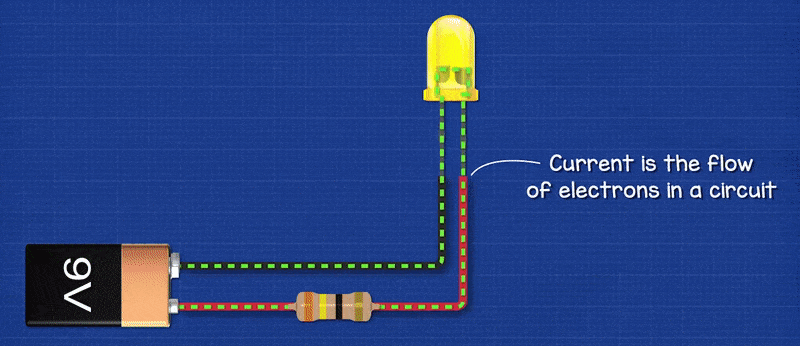
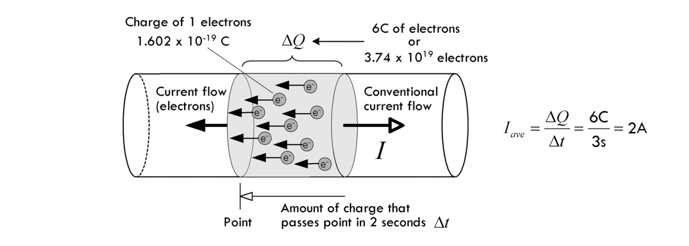
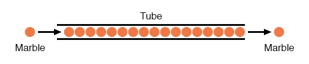
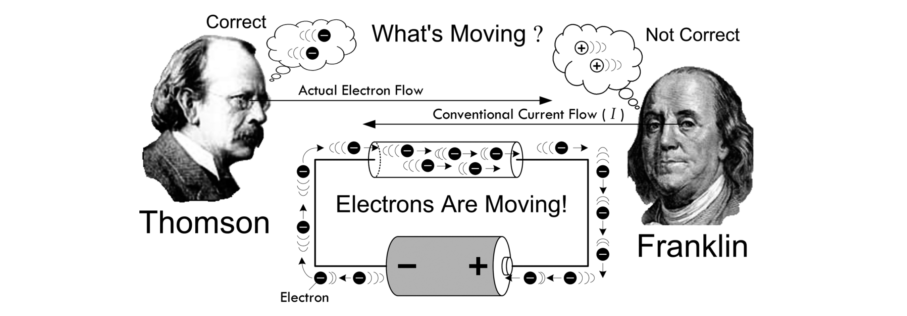
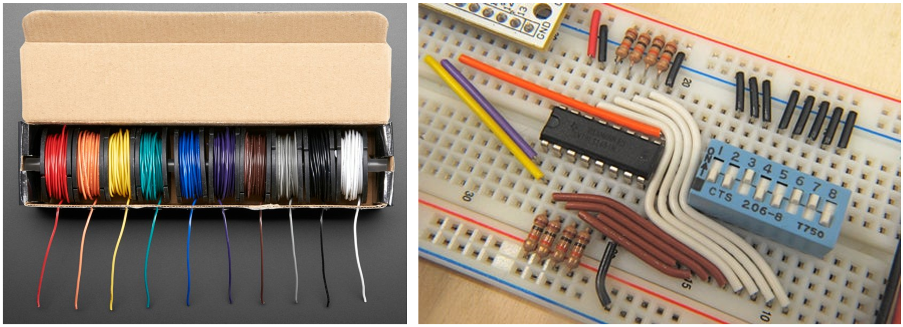
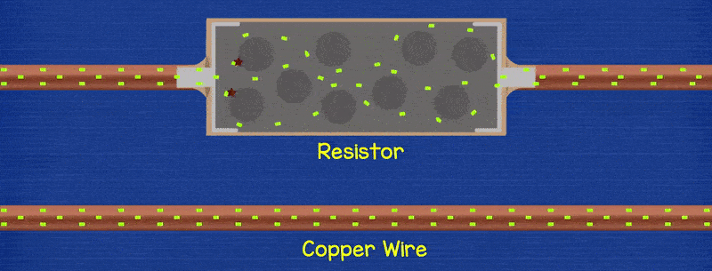

# {{ page.title | replace_first:'L','Lesson '}}
{: .no_toc }

## Table of Contents
{: .no_toc .text-delta }

1. TOC
{:toc}
---

In this lesson, we are going to learn about three key electricity concepts, *current*, *voltage*, and *resistance*, which form the foundation of electronics and circuits. We will also use an online circuit simulator to play with basic components and advanced understanding.

---
**NOTE**

This material is important. Depending on your previous background in physics or engineering, some of these concepts may be brand new and confusing. Take your time to understand (and re-read) sections—this material will help you understand *how* circuits work and *how* and *why* we hook up and use electronic components the way we do. But this is also *not* a circuits course, so I will largely focus on what I *think* is most critical to physical computing.

---

## A brief overview

In short, **voltage** pushes **electrons** through a conductive material (*e.g.,* a wire) and the amount of *electron flow* is called **current**. Some materials conduct electrons better than others—materials with low conductivity have high **resistance**.

In circuits, we often use hydraulic (and other) analogies to aid understanding. For example, think of *voltage* as analogous to *water pressure* in a water plumbing system. An increase in water pressure provides more force to propel water molecules through the pipes (from high pressure to low pressure). Similarly, an increase in voltage provides more force to "push" electrons (from high electric potential to low electric potential) through a circuit. And, just as a wider water pipe can carry more water, so too can a thicker conductive wire carry more current. Obstructions in the pipe—such as sand or, worse, clay—can slow the flow of water. Similarly, in circuits, we can insert resistors to impede the flow of current.

## What is current?

**Figure.** *Current* is the flow of charged particles—in this case, electrons—through a conductor. In the animation above, we are illustrating "electron flow" as a dotted green line, which flows from the negative terminal of the 9V battery, through an LED and resistor, and then back to the 9V battery to its positive terminal. Note that this is actually opposite from *conventional current* flow, but we'll get to that below. Animation from [The Engineering Mindset](https://youtu.be/kcL2_D33k3o).
{: .fs-1 }

*Current* is the flow of charged particles through a conductor. Electric current is similar to water current moving through a pipe. To measure the flow of water, we could count the number of water molecules flowing past a given cross-section of pipe in time $$t$$. In fact, electric current $$I$$ is defined as the amount of charge $$Q$$ moving through a cross-section of wire in time $$t$$:

$$I = \frac{\Delta{Q}}{\Delta{t}}$$

A [couloumb (C)](https://en.wikipedia.org/wiki/Coulomb) is the SI unit for *electric charge* and is approximately $$6.24 × 10^{18}$$ electrons. Rather than constantly describe current as the number of coloumbs/second (or electrons/second) flowing through a wire, which would be messy and exhausting—*i.e.,* "that wire is carrying $$1.872 × 10^{19}$$ electrons per second"—we, instead, use a higher-level abstraction called *amperes* or *amps* (A), which is the SI unit of electric current defined as:

$$1 A = 1 C / s$$

That is, *amperes* is the flow of electric charge in coloumbs per second $$C/s$$. Though unnecessary (and not typically helpful), you can use these formulations to calculate the number of electrons passing through a cross-section of wire over time $$t$$. For example, in the image below, we are calculating how many electrons pass a given point in 3s if a conductor is carrying 2A of current.

Using the formulas above, we can calculate the amount of electrons that pass through a cross-section of wire in three seconds if the wire is carrying 2A of current. Image from [Chapter 2](https://learning.oreilly.com/library/view/practical-electronics-for/9781259587559/xhtml/13_Chapter_02.xhtml) of Scherz and Monk's *Practical Electronics for Inventors* .
{: .fs-1 }

But, again, we'd just say that wire is conducting 2A of current. :)

With digital circuits, we work with low amperages. For example, an LED may require 2V and ~20 milliamperes (milliamps or simply, mA) to light up—that's $$(6.24 × 10^{18}) * 0.02 = 1.3 × 10^{17}$$ electrons/second. Similarly, an individual pin on the Arduino might be able to supply up to 40mA or $$(6.24 × 10^{18}) * 0.04 = 2.5 × 10^{17}$$ electrons/second.

### Building intuition for current

Importantly, just like your home plumbing system, where water flows instantly out of your tap when you open the valve (propelled by water pressure from a water tower, for example), so too does current flow instantly when a voltage is applied (propelled, for example, by a battery). And, critically, the water molecules that touch your hand did not flow all the way through your plumbing system in an instant. Instead, your pipes are completely filled with pressurized water—just as a conductive wire is filled with atoms. When you open the tap, the water molecules that touch your hands were the molecules pushing against that tap's valve (sort of like a first-in, first-out queue). This is similar to current in a circuit—atoms are tightly packed in a material with orbiting electrons. When a voltage is applied, these electrons start to "hop" from one atom to another through a conductor.

{: .mx-auto .align-center }

**Figure.** You can think of electrons flowing through a circuit like marbles tightly packed in a tube. A marble does not need to traverse the entire tube to create motion. Instead, when a marble is inserted into the left side of the tube, a marble on the right side instantly exits. Image from [All About Circuits](https://www.allaboutcircuits.com/textbook/direct-current/chpt-1/conductors-insulators-electron-flow/).
{: .fs-1 }

Another way to think about current flow is like that of a tube filled end-to-end with marbles. If a marble is inserted on the left, another marble will immediately exit the tube on the right. Even though each marble travels only a short distance, the transfer of motion is nearly instantaneous. With electricity, the overall effect from one end of a conductor to the other is at the speed of light; however, each individual electron travels through the conductor at a much slower pace.

### What is an open circuit?

TODO: add in how water plumbing analogy breaks down with pipe breakage (Water would spill out of hole); with circuits, an open circuit, no current flow.

### What's conventional current vs. electron flow?

**Figure.** In electric circuits, we model the flow of charges (electrons) as if they move from positive to negative terminals in a battery (or voltage source)—this is called "*conventional current*"—see right side of image. However, it is a historic artifact (blame Benjamin Franklin). Instead, because electrons are negatively charged, they actually flow from negative to positive (called "*electron flow*")—see left side of figure. Animation from [The Engineering Mindset](https://youtu.be/kcL2_D33k3o).
{: .fs-1 }

In circuits, we use *conventional current* to model the flow of electrons from the positive terminal of the voltage source to the negative; however, electrons actually move in the *opposite* direction (called *electron flow*). This causes great confusion to novice makers.

Why? Blame [Benjamin Franklin](https://hackaday.com/2017/07/17/conventional-current-vs-electron-current/). In early experiments (mid 1740s), Franklin determined that electricity appears to "flow" as if a liquid in solid material. He assumed that the flowing charges had positive signs and moved from positive to negative. It was not until 1897, however, that Sir Joseph Thomson determined that the real charge carrier in a wire was the electron and that electrons move from cathode (negative) to anode (positive).

**Figure.** Franklin thought that positive charge carriers moved in a conductor from positive to negative. This is called the *conventional current* direction, which is still used today. Instead, as Thomson discovered, it's electrons that move in a conductor (which are negatively charged) and they move from negative to positive. This is called *electron flow*. Image from [Chapter 2](https://learning.oreilly.com/library/view/practical-electronics-for/9781259587559/xhtml/13_Chapter_02.xhtml) of Scherz and Monk's *Practical Electronics for Inventors* .
{: .fs-1 }

Despite this confusion, it turns out that as long as you're consistent, it does not matter: negative electrons flowing one way is equivalent to modeling positive charges going the other direction. So, we tend to use *conventional current* (modeling flow of charge from positive to negative) in electronics (*e.g.,* in diagrams, formulas, etc.). The math will still work out and even mnemonics like the [right-hand rule](https://en.wikipedia.org/wiki/Right-hand_rule) are based on conventional current (point thumb in direction of current $$I$$, see direction of electric field $$B$$).

For more, see [Chapter 2](https://learning.oreilly.com/library/view/practical-electronics-for/9781259587559/xhtml/13_Chapter_02.xhtml) of Scherz and Monk's *Practical Electronics for Inventors* and this lovely [video](https://youtu.be/kcL2_D33k3o?t=224) by The Engineering Mindset.

### What's the difference between AC and DC?

Digital circuits use *direct current* (DC), which is supplied by batteries or by AC adapters that convert the *alternating current* from your wall socket into DC current used by your phone or laptop chargers.

## What is voltage?
<video autoplay loop muted playsinline style="margin:0px">
  <source src="assets/videos/VoltageElectromotiveForce_EngineeringMindset.mp4" type="video/mp4" />
</video>
**Figure.** *Voltage* is what "pushes" electrons around a circuit. Animation from the [Voltage Explained](https://youtu.be/w82aSjLuD_8) video by The Engineering Mindset.
{: .fs-1 }

**[Voltage](https://en.wikipedia.org/wiki/Voltage)** is the difference in electric potential between two points—it is defined as work needed to move a charge between two points. Think of voltage like pressure in a water pipe: the more pressure, the more water is being forced through a pipe. Similarly, by increasing voltage, we "push" more electrons through a wire.

We measure voltage with the SI unit *volt* (V), which is expressed as:

$$1\ V = 1\ joule\ (of\ work) / 1\ coulomb\ (of\ charge)$$

A battery has an imbalanced electric charge built up between its positive and negative leads. When a circuit is connected, electric charges (electrons) flow to "correct" this imbalance. The larger the imbalance (i.e., the higher voltage), the greater the "push" and the more electrons that flow (higher current).

If you connect two batteries in series (i.e., stack them), you increase their ability to "push" electrons—indeed, you sum the battery voltages together. So, two standard alkaline 1.5V AA batteries in series will have a 3V potential difference, which can "push" more electrons around a circuit. 

Insert cropped animation from: https://youtu.be/w82aSjLuD_8?t=183

In digital circuits, common operating voltages are 3.3V or 5V. For example, the ESP32 chip operates at 3.3V while the Arduino Uno and Leonardo boards operate on 5V. My Apple iPhone charger outputs 5V and can supply up to 2A.

## What is electrical resistance?
<video autoplay loop muted playsinline style="margin:0px">
  <source src="assets/videos/CopperVsIronWireResistanceElectronFlow_EngineeringMindset.mp4" type="video/mp4" />
</video>
**Figure.** As electrons move through a material, they may collide with some atoms or other electrons. These collisions create a resistance. In the animation above, notice how the iron wire has more collisions than the copper wire. Iron is ~17% as conductive as copper. More precisely, at 20° C, Iron has an electrical resistivity of 96.1 nanoohm-meters while Copper has a resitivity of 16.8 nanoohm-meters. Notice the halo around the Iron wire: this is to indicate that the electron collisions manifest as heat or light energy. Animation from the [How Electricity Works](https://youtu.be/mc979OhitAg?t=322) video by The Engineering Mindset.
{: .fs-1 }

As electrons move through a material, they may collide with some atoms or other electrons. These collisions create a *resistance* to the electrical current. Depending on their atomic composition, some materials have lower resistance than others. Metals like silver, copper, and gold are *good* conductors—they offer *low* resistance—because they have loosely bound electrons in the outer shells of their atoms. These electrons are easily displaceable and, with an externally applied force (voltage), can be pushed from atom-to-atom within the material to form a current.

The SI unit of electrical resistance is the ohm (Ω). The direct inverse of resistance is *conductance*. Materials with low resistance are called *conductors*. In contrast, materials such as glass, rubber, and air have high resistance and poor conductivity ("low electron mobility")—these materials are called *insulators*.

**Figure.** The image shows PVC-insulated copper wire.
{: .fs-1 }

The resistance $$R$$ of an object is defined as the ratio of voltage $$V$$ across it to current $$I$$ through it while conductance G is the reciprocal:

$$R = \frac{V}{I}$$, $$G = \frac{1}{R}$$

The higher the resistance (higher Ω value), the more opposition to current flow.

With enough voltage (pressure), almost any material can conduct electrical current (even air, as evident by lightning). The resistance (or conductance) of a wire is not just a function of material type but also its temperature and its size (both length and thickness). In short, for metal wires, resistance drops with increases to wire diameter or temperature. And resistance increases as wire length increases.

More specifically, at a constant temperature, the electrical resistivity $$ρ$$ of a wire can be calculated by:

$$\rho =R{\frac {A}{\ell }}$$,

where $$R$$ is the electrical resistance of a uniform specimen of the material, $$ℓ$$ is the length of the specimen
$$A$$ is the cross-sectional area of the specimen. 

[Wikipedia](https://en.wikipedia.org/wiki/Electrical_resistivity_and_conductivity) provides a nice water-based analogy: 

> passing current through a highly resistive material is like pushing water through a pipe full of sand. In contrast, passing current through a low-resistivity material is like pushing water through an empty pipe. If the pipes are the same size and shape, the pipe full of sand has higher resistance to flow. Resistance, however, is not solely determined by the presence or absence of sand. It also depends on the length and width of the pipe: short or wide pipes have lower resistance than narrow or long pipes.

### Increasing conductance by increasing wire girth

As noted above, we can *increase* the conductance of a wire by *increasing* its diameter (a "bigger pipe" for current to flow). Drawing again on our water analogy: just as a larger diameter pipe can support larger quantities of water flow so too can a thicker wire support more current flow.

TODO: insert figure

Because wire diameter is so important to current capacity, there is a standardized system for measurement. In the US, we use the [American Wire Gauge](https://en.wikipedia.org/wiki/American_wire_gauge) or AWG system. A wire with a diameter of 5.2mm (AWG 4) has a current capacity of 59.6A. In comparison, a standard circuit prototyping wire (0.64mm or AWG 22) has a current capacity of 0.9A. If we pass more current through a wire than its capacity, it will start to heat up and eventually burn (indeed, this is how fuses work!).

**Figure.** Example AWG solid-core wire commonly used in circuit prototyping. The box of wire on the left is $29.95 for ten 25ft spools from [Adafruit](https://www.adafruit.com/product/3174). 
{: .fs-1 }

Counterintuitively, *increasing* AWG numbers denote *decreasing* wire diameters (and strangely, AWG gauges are always integers but can be less than 1 with '0', '00', or even '000' for a very thick wire).

### Resistance increases with wire length

TODO?

Could have posille's law here?

### What are resistors?

**Figure.** This animation shows how a resistor can be placed between two wires to reduce current flow. Notice how electrons flow freely through the copper wire. With the resistor, these electrons collide with other atoms and themselves, which restricts electron flow (and creates heat). Animation from [The Engineering Mindset](https://youtu.be/kcL2_D33k3o?t=891).
{: .fs-1 }

Resistors are specially formulated electrical components that restrict current at a certain rate based on their material composition and construction. In circuits, we place resistors between components to lower current. Why would we want to restrict current? In short, to protect components in our circuit that require lower current. TODO: We'll talk more about this in Lesson X.

## Notes
- Should I talk about short vs. open circuit here? I think so
- And then the activity can be with PHET?

- https://firstyearengineer.com/circuits/basic-electricity/current/
- https://www.allaboutcircuits.com/textbook/direct-current/chpt-1/conductors-insulators-electron-flow/
- http://people.cs.georgetown.edu/~squier/Teaching/ComputerSystemsArchitecture/520-2013-CourseDocuments

## ACTIVITY Idea:
- Have them work with an online circuit simulator like Tinkercad or [Falstad](https://www.falstad.com/circuit/circuitjs.html)

- Introduce the multimeter and how to measure voltage, current, and resistance
  - Engineering Mindset has a good animation of [ammeter here](https://youtu.be/kcL2_D33k3o?t=718) 

## Resources

### Circuit Simulators
We recommend the following basic circuit simulators (these are not intended for advanced analysis):
- [Falstad's CircuitJS](https://www.falstad.com/circuit/circuitjs.html). A completely free, open-source web platform for circuit simulation with circuit animation.
- [EveryCircuit.com](https://everycircuit.com/). Similar to CircuitJS in supporting simulated animations of current but more powerful (and also not free, though there is a free trial). There is no 'wire' component; you need to click one node and then another node to make a connection.
- [Circuitlab.com](https://www.circuitlab.com/). A more traditional circuit simulator that is not as approachable for novices/makers. You can use a trial version but the number of circuits you can create is limited without a paid account.

### Online links
- [Chapter 2: Circuit Thoery](https://learning.oreilly.com/library/view/practical-electronics-for/9781259587559/xhtml/13_Chapter_02.xhtml), Scherz & Monk, Practical Electronics for Inventors, 4th Edition
- [Voltage, Current, Resistance, and Ohm's Law](https://learn.sparkfun.com/tutorials/voltage-current-resistance-and-ohms-law/all), Sparkfun.com
- [Electrical Resistance and Conductance](https://en.wikipedia.org/wiki/Electrical_resistance_and_conductance), Wikipedia

### Video links
- [Voltage, Current, Resistance](https://youtu.be/OGa_b26eK2c), [mathandscience.com](http://mathandscience.com/)
- [What is Ohm's Law?](https://youtu.be/lf0lMDZVwTI), [mathandscience.com](http://mathandscience.com/)
- [Engineering Circuits, Volume 1](https://www.youtube.com/watch?v=OGa_b26eK2c&list=PLnVYEpTNGNtUSjEEYf01D-q4ExTO960sG), [mathandscience.com](http://mathandscience.com/)
- [What is Voltage?](https://youtu.be/OGa_b26eK2c), Sparkfun.com
- [What is Current?](https://youtu.be/kYwNj9uauJ4), Sparkfun.com