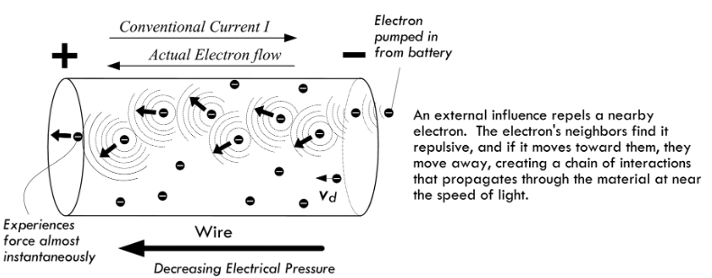

This is the resistor page.

## TODO
Add basic concepts:
- Voltage
- Current
- Resistance

## Notes

### How does electricity "flow" in a circuit
Some wonderful discussions on the Electronics and Physics Stack Exchange sites.

- https://electronics.stackexchange.com/a/72944
- https://physics.stackexchange.com/a/17776
- https://electronics.stackexchange.com/a/67300
- https://electronics.stackexchange.com/a/73013

The [Scherz and Monk](https://alliance-primo.hosted.exlibrisgroup.com/permalink/f/kjtuig/CP71291894620001451) book provides a nice description about the mechanisms of voltage and how "energy" moves through a circuit. Section 2.3:

> To get electrical current to flow from one point to another, a voltage must exist between two points. A voltage placed across a conductor gives rise to an *electromotive force* (EMF) that is responsible for giving all *free electrons* within the conductor a push.
> 
> ...
>
> To get a mental image of how a battery generates an EMF through a circuit, we envision chemical reactions inside yield free electrons that quickly build in number within the negative terminal region (anode material) causing an electron concentration. This concentration is full of repulsive force (electrons repel) that can be viewed as a kind of "electrical pressure." With a load placed between the battery's terminals, electrons from the battery's negative terminal attempt to alleviate this pressure by dispersing into the circuit. These electrons increase the concentration of free electrons wthin the end of the conductor attached to the negative terminal. Even a small percentage difference in free electron concentration in one region gives rise to great repulsive forces between electrons. The repulsive force is expressed as a seeminlgy instantaneous (Close to the speed of light) pulse that travels throughout the circuit. Those free electrons nearest to the pumped-in electrons are quickly repulsed in the opposite direction; the next neighboring electrons get shoved, and so on down the line, causing a chain reaction, or pulse. This pulse travels down the conductor near the speed of light. See figure.
> 
