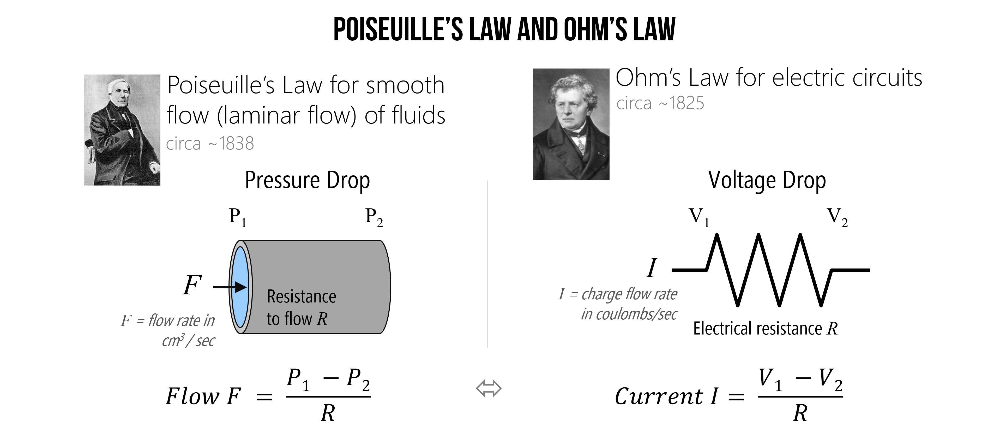
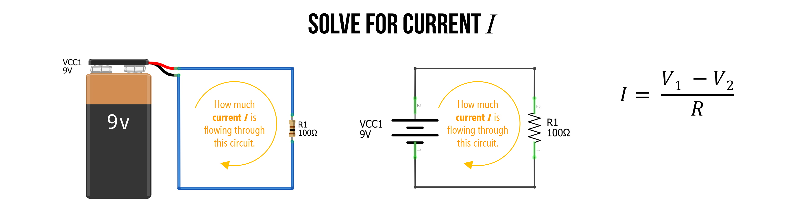
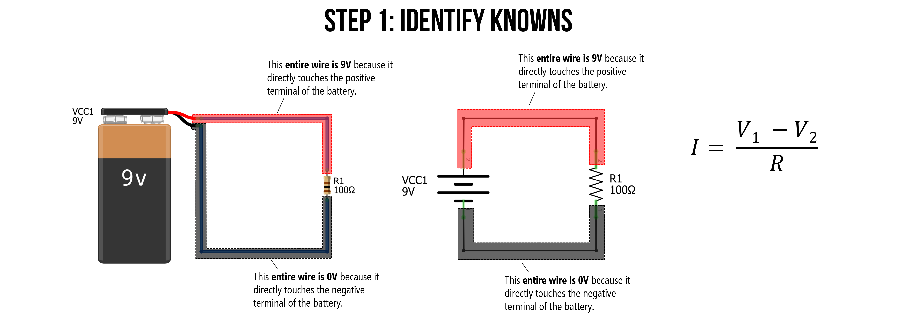
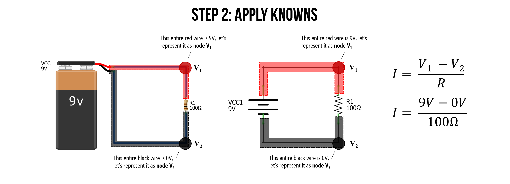
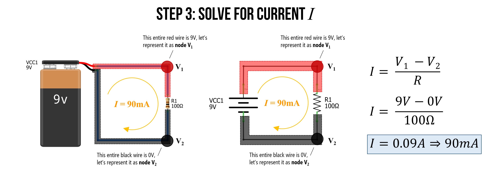
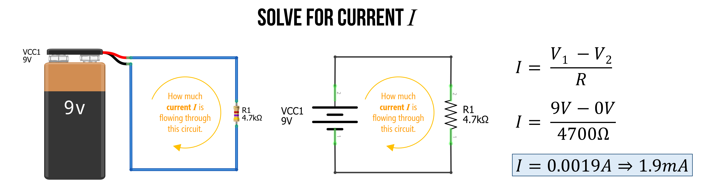
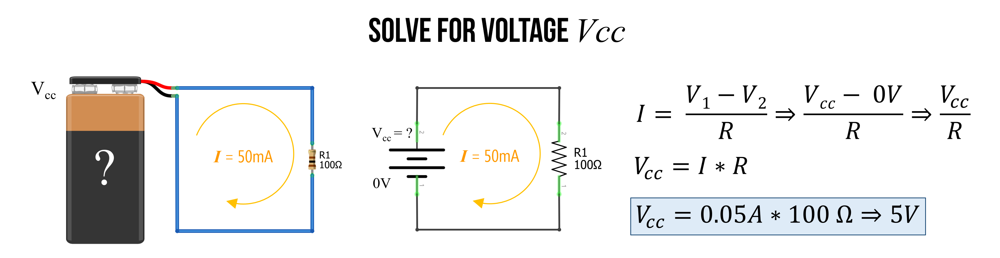
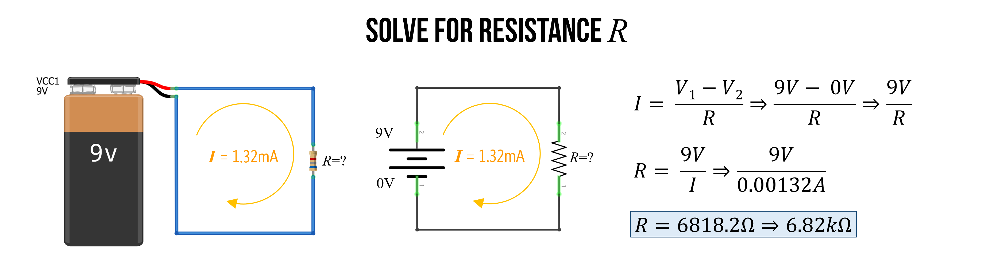

# {{ page.title | replace_first:'L','Lesson '}}
{: .no_toc }

## Table of Contents
{: .no_toc .text-delta }

1. TOC
{:toc}
---

In this lesson, we will learn about **Ohm's Law**, one of the most important empirical laws in electrical circuits that describes how *current*, *voltage*, and *resistance* relate together. While Ohm's Law is incredibly useful in analyzing and understanding how circuits work, like many "laws", it is not always obeyed (particularly for what are called "non-ohmic" devices like LEDs or other diodes). But we'll get to that.

For now, on to Georg Ohm's Law!

## Ohm's Law

In 1827, after years of experimentation, German physicist Georg Simon Ohm published the "[*Galvanic Circuit Investigated Mathematically*](https://en.wikipedia.org/wiki/Ohm%27s_law#History)", which became the foundation for Ohm's Law. Ohm's Law states that the current ($$I$$ in amperes) in a conductor is directly proportional to the applied voltage ($$V$$ in volts) *vs.* the conductor's resistance ($$R$$ in ohms):

$$I = \frac{V}{R}$$

Thus, if we double the voltage in our circuit—for example, by stacking two batteries together in series—then we will also double the current. Ohm's Law has many implications for how we build and use circuits with microcontrollers, including voltage dividers and resistive sensors.

Importantly, you will see and use Ohm's Law in all three equivalent incarnations (which can be derived with simple algebra):

When you want to solve for **current** in your circuit, you use:
$$I = \frac{V}{R}$$

To solve for **voltage**, use:
$$V = I * R$$

To solve for **resistance**, use:
$$R = \frac{V}{I}$$

Notice how these equations map to the concepts we explained in our first lesson on [Voltage, Current, and Resistance](electricity-basics.md)—which you may want to return to. For example, $$I = \frac{V}{R}$$ clearly demonstrates that to **increase current**, we can either **increase voltage** or **decrease resistance**.

### Relating Ohm's Law to our water analogies

Drawing again on our hydraulic-electric analogies (which we used amply in [previous lessons](electricity-basics.md)), we can highlight another similarity. In the 1840s, [Poiseuille](https://en.wikipedia.org/wiki/Hagen%E2%80%93Poiseuille_equation) empirically showed that the flow rate of water through a pipe is equal to the pressure drop across the pipe divided by the pipe's resistance—this is called **Poiseuille's Law**. And it conceptually makes sense: a higher pressure difference between two ends of a pipe creates more force and a lower resistance allows more water flow. 

Does this equation sound familiar? It should. It is exactly Ohm's Law! Current flow in a circuit is directly proportional to the voltage drop in a circuit divided by its resistance. See image below.

**Figure.** [Poiseuille's Law](http://hyperphysics.phy-astr.gsu.edu/hbase/ppois.html#poi) for the smooth flow of fluids and [Ohm's Law](http://hyperphysics.phy-astr.gsu.edu/hbase/electric/ohmlaw.html#c1) for electric current are similar. Image based on [HyperPhysics at Georgia State ](http://hyperphysics.phy-astr.gsu.edu/hbase/electric/watcir2.html) and created in PowerPoint. Images of Poiseuille and Ohm are from Wikipedia.
{: .fs-1 }

---
**NOTE:**

Poiseuille's Law equation only holds for the smooth (laminar rather than turbulent) flow of a Newtonian fluid like water. But such a stipulation is not relevant to electrical current.

---

### Why $$I$$ and not $$C$$?

You might be asking, "If $$R$$ is the **r**esistance in ohms (Ω) and V is the **v**oltage in volts (V) then why is $$I$$ used to represent the **c**urrent in amperes (A) rather than $$C$$?" Two reasons: first, $$C$$ is already reserved for the SI unit of coloumbs (C), which is used in the very definition of amperes (recall that $$1\ A = 1\ C / s$$) and thus, could get confusing! Second, the ampere is named after [André-Marie Ampère](https://en.wikipedia.org/wiki/Andr%C3%A9-Marie_Amp%C3%A8re), considered the father of electromagnetism, who referred to amperage as the "**i**ntensité du courant" or "**i**ntensity of current." So, current is $$I$$ and not $$C$$.

## Make sure to use base units

A common "gotcha" in applying Ohm's Law—or analyzing circuits in general—is messing up base units. In digital circuits, we often deal with **kilohms (kΩ)**—which is 1,000 ohms—**milliamps (ma)**—which is $$\frac{1}{1000}$$ (0.001) of an amp—or even microamps (μA)—which is one millionth ($$\frac{1}{1,000,000}$$ or 0.000001) of an amp—and so on. We need to convert these units to **base units** in volts (V), ohms (Ω), and amps (A) to perform our analysis.

For example, if a circuit contains a 2.2kΩ resistor with a 9V battery, to calculate the current do not mistakenly write $$I = \frac{9V}{2.2Ω}A$$ but, instead, $$I = \frac{9V}{2200Ω}A$$. The former would give you 4.1A (a large amperage and incorrect!) while the latter gives you the correct value of 0.0041A—which is 4.1mA. 

So, always make sure you double check your units!

### Common SI prefixes

Below, we've written some common SI prefixes—most of which should be familiar to you from other measurement quantities. 

| Conversion factor   | Scientific notation | Prefix | Abbreviation | English word | Examples |
|:--------------------|:--------------------|:-------|:-------------|:-------------|:---------|
| 1,000,000,000,000   | $$10^{12}$$         | tera   | T            | trillion     | terabyte, terameter |
| 1,000,000,000       | $$10^{9}$$          | giga   | G            | billion      | gigabyte, gigawatt |
| 1,000,000           | $$10^{6}$$          | mega   | M            | million      | megabyte, mega-awesome |
| 1,000               | $$10^{3}$$          | kilo   | k            | thousand     | kilobyte, kilometer, kilohm |
| 1                   | $$1$$               | base unit |           |              | gram, meter, amp, volt, ohm |
| 0.001               | $$10^{-3}$$         | milli  | m            | thousandth   | millimeter, milliamp, millivolt |
| 0.000001            | $$10^{-6}$$         | micro  | μ            | millionth    | micrometer, microamp |
| 0.000000001         | $$10^{-9}$$         | nano   | n            | billionth    | nanosecond, nanoamp |
| 0.000000000001      | $$10^{-12}$$        | pico   | n            | trillionth    | picosecond, picoamp |
{: .fs-1 .condensed-table }

**Table** This chart is based on NIST's [Metric SI Prefixes webpage](https://www.nist.gov/pml/weights-and-measures/metric-si-prefixes) and Figure 2.2 in [Bartlett's book](https://learning.oreilly.com/library/view/electronics-for-beginners/9781484259795/html/488495_1_En_2_Chapter.xhtml).
{: .fs-1 }

### Converting units

To convert between a prefixed unit and a base unit, we *multiply* by the conversion factor. To convert between a base unit and a prefixed unit, we *divide* the conversion factor.

So, for example, to convert 2.2kΩ to ohms, we would multiply by the conversion factor for *kilo* (k), which is 1,000. So, $$2.2 * 1,000 = 2,200 Ω$$. To convert 0.000037A to microamps, we would divide by the conversion factor for *micro* (μ), which is 0.000001 (or $$10^{-6}$$). So, $$\frac{0.000037}{10^{-6}} = 37 μA$$.

## Let's analyze some circuits!

Whew, OK, now we are ready to start analyzing some circuits. We'll start with a simple circuit and go from there. When analyzing (or even preparing to build) circuits, it's always a good idea to get out a pencil and paper. So, please do that now.

In addition, it's helpful to have a way to check our work, which we can do in a circuit simulator. I like to use [CircuitJS](https://www.falstad.com/circuit/circuitjs.html) but I have also used [EveryCircuit](http://everycircuit.com/) and [CircuitLab](https://www.circuitlab.com/)—the latter costs money.

Before we begin, let's watch this video of me building a simple resistive circuit in [CircuitJS](https://www.falstad.com/circuit/circuitjs.html) and calculating its current, given a voltage source and resistor.

<iframe width="736" height="414" src="https://www.youtube.com/embed/ZxNHcUp-CFY" title="YouTube video player" frameborder="0" allow="accelerometer; autoplay; clipboard-write; encrypted-media; gyroscope; picture-in-picture" allowfullscreen></iframe>

**Video** The video was created using the [CircuitJS](https://www.falstad.com/circuit/circuitjs.html) simulator. Direct link is [here](https://www.falstad.com/circuit/circuitjs.html?ctz=CQAgjCAMB0l3BWcMBMcUHYMGZIA4UA2ATmIxAUgpABZsKBTAWjDACgA3cDQkbNbrxQ0qo2lSRiYCNgAdBIYVSWKR4KFDkL+ytTvWi2AdwUqwPcMRSaT53mCt9INS9cjGnLh9dwuV7+V9VKmxCPGCDG20BOz4wqNjQ8KCk8A8U+JSBAM8+AVT9CEMAJ1yVLLEweDYgA).
{: .fs-1 }

### Example 1: Solve for current

Imagine a battery-powered circuit with a single resistor (basic, yes but pedagogically powerful!). If we are given the voltage $$9V$$ and the resistance ($$100Ω$$), can we solve for the current $$I$$?

**Figure.** A simple 9V-powered circuit with a single resistor of $$100Ω$$. Using Ohm's Law, can you solve for current $$I$$? Images made in [Fritzing](https://fritzing.org/) and PowerPoint.
{: .fs-1 }

#### Step 1: Identify knowns

To begin your analysis, you'll want to identify everything that you *know* about this circuit. 

Observe that all wires touching the *positive* battery terminal have the same electric potential ($$9V$$)—which we've now marked in red—and all wires touching the *negative* battery terminal have the same electric potential ($$0V$$)—which we've marked in black. Note that even though copper wires have some resistance, it's so small (especially for the lengths in a digital circuit), that we can model it as $$0Ω$$ (indeed, wires are always assumed $$0Ω$$ in this sort of circuit analysis).

And because we are solving for current, we we need to use the Ohm's Law formulation: $$I = \frac{V}{R}$$. More specifically, as voltage is always relative—an electric potential *difference*—we use $$I = \frac{V_1 - V_2}{R}$$

**Figure.** All wires touching the battery's positive terminal have the same voltage (9V). Similarly, all wires touching the battery's negative terminal have the same voltage (0V). Images made in [Fritzing](https://fritzing.org/) and PowerPoint.
{: .fs-1 }

#### Step 2: Apply knowns

Having established that all of the wires on the top of the circuit (those directly connected to the positive terminal) are the same electric potential, we can mark it as a single **node $$V_1$$**. Similarly, all wires touching the negative battery terminal can be called **node $$V_2$$**.

Now, we can substitute $$9V$$ for $$V_1$$ and $$0V$$ for $$V_2$$. And we also know that $$R=100Ω$$, giving us the complete equation: $$I = \frac{9V - 0V}{100Ω}$$

**Figure.** We can call all wires touching the battery's positive terminal node $$V_1$$ and all wires touching the negative terminal node $$V_2$$. Using this information, we can substitute $$9V$$ for $$V_1$$ and $$0V$$ for $$V_2$$. Images made in [Fritzing](https://fritzing.org/) and PowerPoint.
{: .fs-1 }

#### Step 3: Solve for current I

Finally, we are ready to solve for current $$I = \frac{9V - 0V}{100Ω} \Rightarrow 0.09A \Rightarrow 90mA$$

We did it. We successfully applied Ohm's Law to solve for current!

### Example 2: Solve for current again (but with different resistance)

Let's try to solve for current again with a similar circuit. This time the resistance has been increased from $$100Ω$$ to $$4.7kΩ$$.

Before doing anything else: it's useful to think of *conceptually* what will happen?

Current decreases, right? And does so proportionally.

Indeed, the current goes from $$90mA$$ with $$100Ω$$ to $$I = \frac{9V}{4700Ω} \Rightarrow 0.0019𝐴 \Rightarrow 1.9𝑚𝐴$$, which is not very much!

**Figure.** As expected, the current $$I$$ goes down as resistance $$R$$ goes up.
{: .fs-1 }

### Example 3: Solve for voltage

As noted above, we can use the three different formulations of Ohm's Law ($$I=\frac{V}{R}$$, $$V=I*R$$, and $$R=\frac{V}{I}$$) to help us analyze different unknowns in a circuit.

In this case, let's use Ohm's Law to solve for an **unknown voltage source**. Assume a similar circuit as before: a single voltage source (but of unknown voltage) with a single resistor of size $$100Ω$$ and a current of $$I=50mA$$.

Because we are solving for voltage, we should use the $$V=I*R$$ formulation. The first thing we need to do is ensure that all of our measurements are in *base* *units*. The current is not, so modify it to amperage (rather than milliamps): $$I=50mA \Rightarrow 0.05A$$.

Now, we can easily solve for $$V = 0.05A * 100Ω = 5V$$. The battery is a $$5V$$ voltage source.

**Figure.** Using the $$V=I*R$$ formulation of Ohm's Law, we can solve for voltage given a known current $$I$$ and a known resistance $$R$$. Images made in [Fritzing](https://fritzing.org/) and PowerPoint.
{: .fs-1 }

### Example 4: Solve for resistance

I bet you're getting the hang of it now!

Finally, you can use $$R=\frac{V}{I}$$ to solve for resistance if $$V$$ and $$I$$ are known. In this case, let's return to our $$9V$$ battery and assume we have a current of $$1.32mA$$. What is the resistor value $$R$$?

Again, the first thing to do is convert all units to base units. So, $$1.32mA \Rightarrow 0.00132A$$.

Now, we can solve for $$R = \frac{9V}{0.00132A} \Rightarrow 6818.2Ω \Rightarrow 6.8kΩ$$

**Figure.** Using the $$R=\frac{V}{I}$$ formulation of Ohm's Law, we can solve for the resistance $$R$$ given a known voltage $$V$$ and a known current $$I$$. Images made in [Fritzing](https://fritzing.org/) and PowerPoint.
{: .fs-1 }

<!-- TODO: consider giving them example problems for pencil/paper here? -->

## Activity: Using a circuit simulator

Now that we've built up an initial understanding of Ohm's Law, it's time to build and play with some circuits in a circuit simulator. 

Using [CircuitJS](https://www.falstad.com/circuit/circuitjs.html), build and analyze five different types of resistive circuits. You can build whatever circuits you want with a few requirements:
* All circuits should have only a single power supply
* You should use only resistors
* You can use as many resistors per circuit as you'd like but double click on the wires to show current/voltage
* For each circuit, take a screenshot and put it in your prototyping journal along with a brief reflection of what you observed/learned.

You can save your circuits in one of two ways: (1) download them locally (File -> Save As) or (2) export them as a shareable link (File -> Export as Link)—use this latter option for your prototyping journals. 

In your prototyping journals, include a screenshot of each CircuitJS circuit along with a brief description of what you observed and a link directly back to the CircuitJS circuit that you made.

## Lesson summary

In this lesson, we learned:
- That there is an empirical law, called Ohm's Law, that describes the linear relationship between voltage, current, and resistance
- Specifically, Ohm's Law states that the current in a circuit is the total voltage divided by the total resistance ($$I = \frac{V}{R}$$). This law builds on the concepts and intuitions we were developing in [the first lesson](electricity-basics.md) in this series
- We also learned how to apply Ohm's Law to some simple circuits to solve for unknown currents, voltages, and resistances
- That a common "gotcha" for beginners is forgetting to convert measurements to base units
- We then played around with circuits in [CircuitJS](https://www.falstad.com/circuit/circuitjs.html) and made observations.

## Resources

- [Introduction to Ohm's Law](https://www.khanacademy.org/science/high-school-physics/dc-circuits/electric-current-resistivity-and-ohms-law/v/circuits-part-1), Khan Academy

- [What is Ohm's Law?](https://youtu.be/lf0lMDZVwTI), Math and Science

- [Ohm's Law and Power](https://www.electronics-tutorials.ws/dccircuits/dcp_2.html), [Electronics Tutorials](https://www.electronics-tutorials.ws/)

## Next Lesson

In the [next lesson](series-parallel.md), we will apply Ohm's Law to more complex circuits—specifically those that combine resistors in *series* and those that combine them in *parallel*.

<!-- In the [next lesson](resistors.md), we will expand what we know about [resistors](resistors.md)—specially designed electrical components that *resist* the flow of current—before showing how they are useful with [LEDs](leds.md).  -->

[Previous: Schematics](schematics.md){: .btn .btn-outline }
[Next: Resistors in Series and Parallel](series-parallel.md){: .btn .btn-outline }
<!-- [Next: Resistors](resistors.md){: .btn .btn-outline } -->
